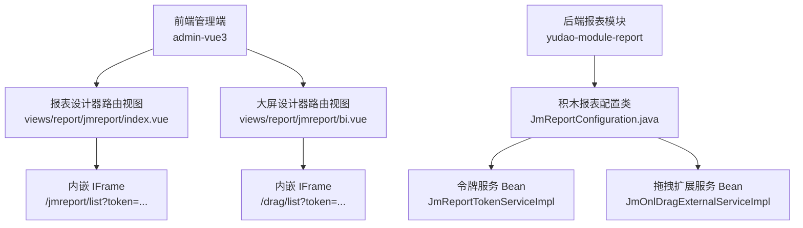
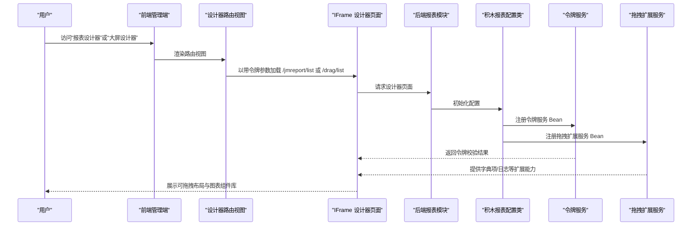
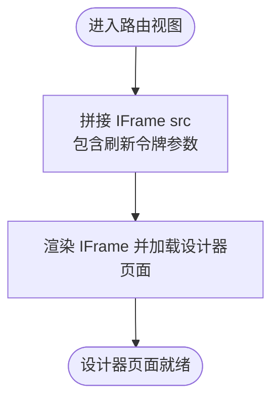
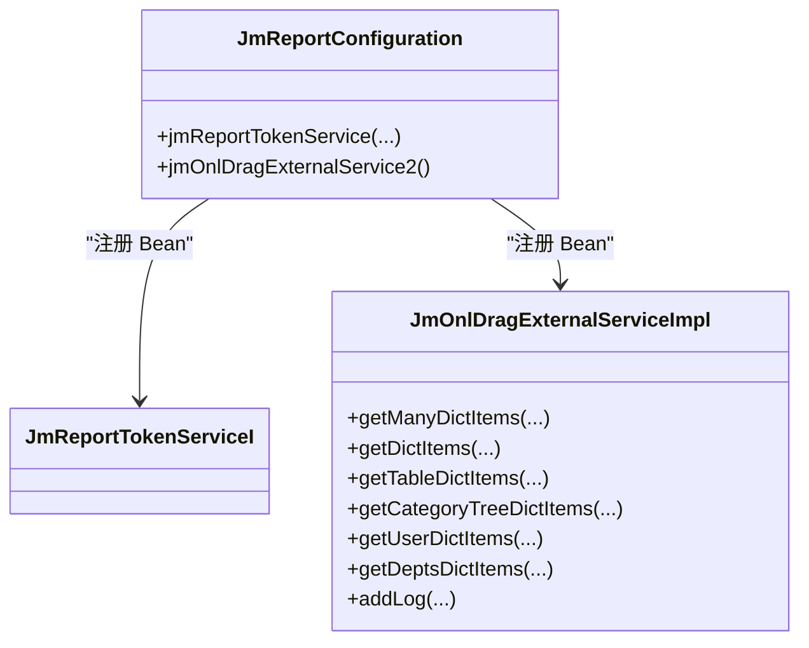
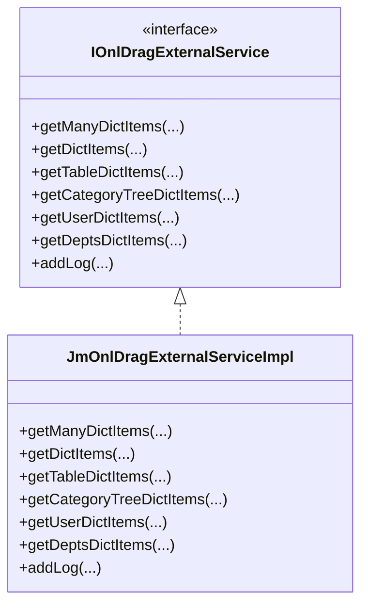
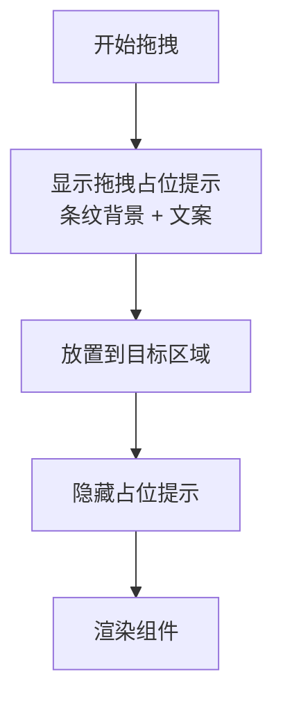
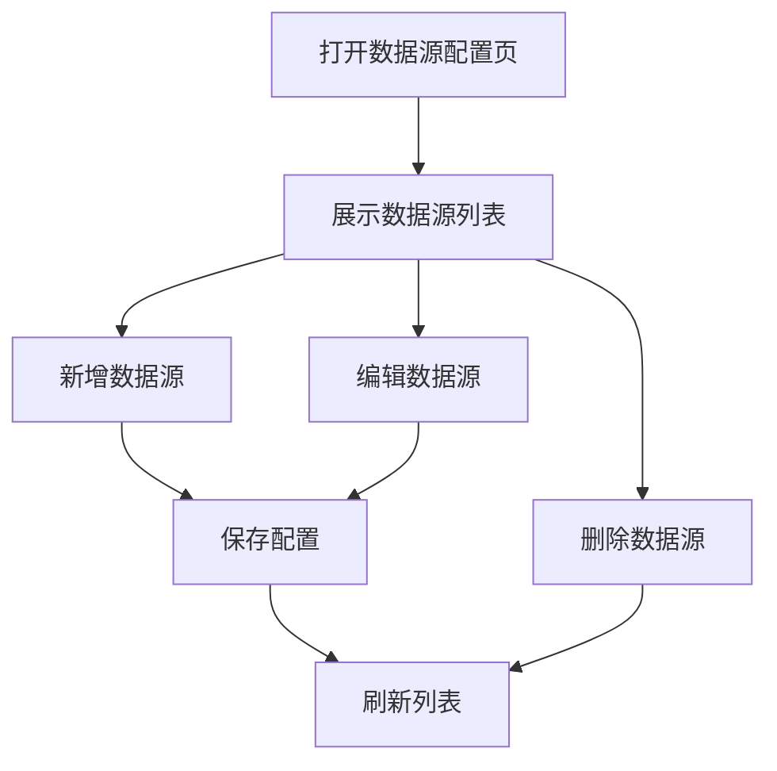
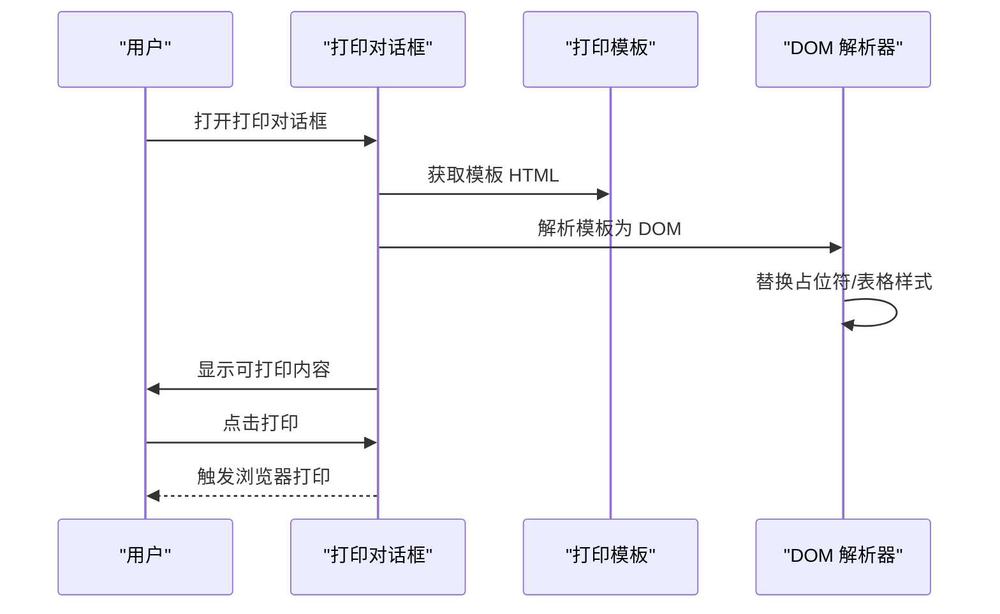
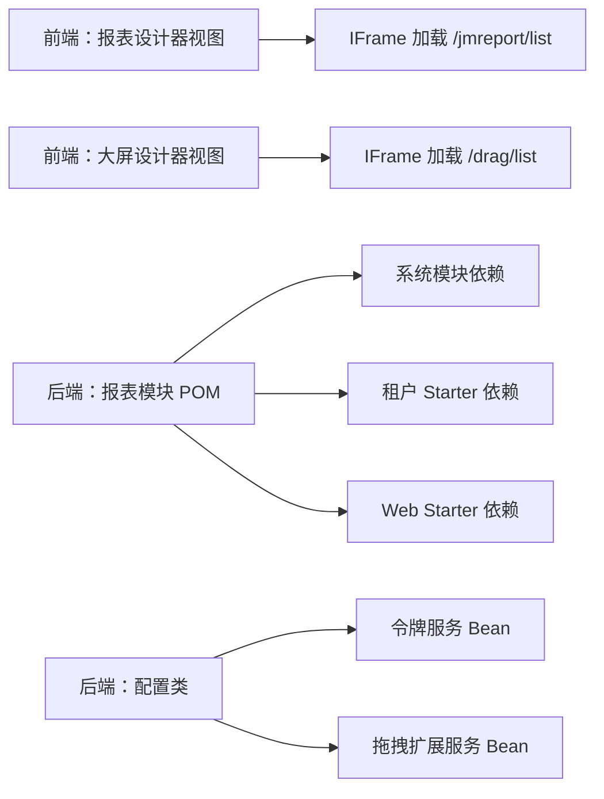

# 报表设计器

<cite>
**本文引用的文件**
- [前端路由视图：报表设计器](file://frontend/admin-vue3/src/views/report/jmreport/index.vue)
- [前端路由视图：大屏设计器](file://frontend/admin-vue3/src/views/report/jmreport/bi.vue)
- [后端配置：积木报表配置类](file://backend/yudao-module-report/src/main/java/cn/iocoder/yudao/module/report/framework/jmreport/config/JmReportConfiguration.java)
- [后端服务：拖拽外部扩展服务实现](file://backend/yudao-module-report/src/main/java/cn/iocoder/yudao/module/report/framework/jmreport/core/service/JmOnlDragExternalServiceImpl.java)
- [后端模块POM：报表模块](file://backend/yudao-module-report/pom.xml)
- [后端模块POM：报表模块（展平）](file://backend/yudao-module-report/.flattened-pom.xml)
- [前端组件：自定义编辑器组件库](file://frontend/admin-vue3/src/components/DiyEditor/components/ComponentLibrary.vue)
- [前端页面：数据源配置（管理端）](file://frontend/admin-vue3/src/views/infra/dataSourceConfig/index.vue)
- [前端页面：数据源配置（基础设施）](file://frontend/admin-uniapp/src/pages-infra/data-source-config/index.vue)
- [前端页面：打印模板与打印对话框](file://frontend/admin-vue3/src/views/bpm/processInstance/detail/PrintDialog.vue)
- [前端页面：打印模板设置开关](file://frontend/admin-vue3/src/views/bpm/model/form/ExtraSettings.vue)
</cite>

## 目录
1. [简介](#简介)
2. [项目结构](#项目结构)
3. [核心组件](#核心组件)
4. [架构总览](#架构总览)
5. [详细组件分析](#详细组件分析)
6. [依赖关系分析](#依赖关系分析)
7. [性能考虑](#性能考虑)
8. [故障排查指南](#故障排查指南)
9. [结论](#结论)
10. [附录](#附录)

## 简介
本技术文档围绕“报表设计器”展开，系统性阐述基于积木报表（JimuReport）的前端设计器与后端集成方案，覆盖以下主题：
- 报表设计器与大屏可视化的设计理念与实现路径
- 拖拽式布局、组件库、数据绑定与动态数据源配置
- 图表类型与使用场景、数据聚合与过滤能力
- 报表模板的保存与复用机制
- 与后端数据接口的集成方式、权限控制策略
- 报表导出与打印功能的最佳实践

## 项目结构
本仓库采用前后端分离架构，报表设计器相关能力由前端路由视图承载，并通过 iframe 内嵌积木报表提供的设计器页面；后端通过自定义配置类与服务实现对接积木报表的令牌、权限与拖拽扩展能力。

**图示来源**
- [前端路由视图：报表设计器:1-16](file://frontend/admin-vue3/src/views/report/jmreport/index.vue#L1-L16)
- [前端路由视图：大屏设计器:1-16](file://frontend/admin-vue3/src/views/report/jmreport/bi.vue#L1-L16)
- [后端配置：积木报表配置类:1-38](file://backend/yudao-module-report/src/main/java/cn/iocoder/yudao/module/report/framework/jmreport/config/JmReportConfiguration.java#L1-L38)
- [后端服务：拖拽外部扩展服务实现:1-69](file://backend/yudao-module-report/src/main/java/cn/iocoder/yudao/module/report/framework/jmreport/core/service/JmOnlDragExternalServiceImpl.java#L1-L69)

**章节来源**
- [前端路由视图：报表设计器:1-16](file://frontend/admin-vue3/src/views/report/jmreport/index.vue#L1-L16)
- [前端路由视图：大屏设计器:1-16](file://frontend/admin-vue3/src/views/report/jmreport/bi.vue#L1-L16)
- [后端配置：积木报表配置类:1-38](file://backend/yudao-module-report/src/main/java/cn/iocoder/yudao/module/report/framework/jmreport/config/JmReportConfiguration.java#L1-L38)
- [后端服务：拖拽外部扩展服务实现:1-69](file://backend/yudao-module-report/src/main/java/cn/iocoder/yudao/module/report/framework/jmreport/core/service/JmOnlDragExternalServiceImpl.java#L1-L69)

## 核心组件
- 前端设计器入口
  - 报表设计器路由视图：通过 IFrame 加载后端提供的报表设计器页面，并携带刷新令牌参数。
  - 大屏设计器路由视图：通过 IFrame 加载后端提供的大屏设计器页面，并携带刷新令牌参数。
- 后端集成组件
  - 积木报表配置类：注册令牌服务与拖拽扩展服务 Bean，完成与系统权限与租户体系的对接。
  - 拖拽外部扩展服务实现：为大屏设计器提供字典项与日志等扩展能力的默认实现。
- 前端组件与页面
  - 自定义编辑器组件库：提供拖拽占位提示、拖拽区域样式等，支撑设计器的拖拽体验。
  - 数据源配置页面：管理后端可用的数据源配置，为报表数据绑定提供基础。
  - 打印模板与打印对话框：支持在业务流程中生成并打印模板化的 HTML 内容。

**章节来源**
- [前端路由视图：报表设计器:1-16](file://frontend/admin-vue3/src/views/report/jmreport/index.vue#L1-L16)
- [前端路由视图：大屏设计器:1-16](file://frontend/admin-vue3/src/views/report/jmreport/bi.vue#L1-L16)
- [后端配置：积木报表配置类:1-38](file://backend/yudao-module-report/src/main/java/cn/iocoder/yudao/module/report/framework/jmreport/config/JmReportConfiguration.java#L1-L38)
- [后端服务：拖拽外部扩展服务实现:1-69](file://backend/yudao-module-report/src/main/java/cn/iocoder/yudao/module/report/framework/jmreport/core/service/JmOnlDragExternalServiceImpl.java#L1-L69)
- [前端组件：自定义编辑器组件库:140-211](file://frontend/admin-vue3/src/components/DiyEditor/components/ComponentLibrary.vue#L140-L211)
- [前端页面：数据源配置（管理端）:36-80](file://frontend/admin-vue3/src/views/infra/dataSourceConfig/index.vue#L36-L80)
- [前端页面：数据源配置（基础设施）:33-71](file://frontend/admin-uniapp/src/pages-infra/data-source-config/index.vue#L33-L71)
- [前端页面：打印模板与打印对话框:78-234](file://frontend/admin-vue3/src/views/bpm/processInstance/detail/PrintDialog.vue#L78-L234)
- [前端页面：打印模板设置开关:493-507](file://frontend/admin-vue3/src/views/bpm/model/form/ExtraSettings.vue#L493-L507)

## 架构总览
下图展示了从前端设计器入口到后端积木报表服务的整体交互路径，以及与权限、租户、数据源配置的关系。

**图示来源**
- [前端路由视图：报表设计器:1-16](file://frontend/admin-vue3/src/views/report/jmreport/index.vue#L1-L16)
- [前端路由视图：大屏设计器:1-16](file://frontend/admin-vue3/src/views/report/jmreport/bi.vue#L1-L16)
- [后端配置：积木报表配置类:1-38](file://backend/yudao-module-report/src/main/java/cn/iocoder/yudao/module/report/framework/jmreport/config/JmReportConfiguration.java#L1-L38)
- [后端服务：拖拽外部扩展服务实现:1-69](file://backend/yudao-module-report/src/main/java/cn/iocoder/yudao/module/report/framework/jmreport/core/service/JmOnlDragExternalServiceImpl.java#L1-L69)

## 详细组件分析

### 组件A：设计器路由视图（报表设计器/大屏设计器）
- 功能要点
  - 通过 IFrame 内嵌加载积木报表提供的设计器页面。
  - 使用刷新令牌拼接查询参数，避免访问令牌刷新带来的复杂性。
- 关键行为
  - 路由视图名称与文档链接提示，便于快速定位官方文档。
  - IFrame 的 src 地址包含 token 参数，确保设计器具备会话上下文。

**图示来源**
- [前端路由视图：报表设计器:1-16](file://frontend/admin-vue3/src/views/report/jmreport/index.vue#L1-L16)
- [前端路由视图：大屏设计器:1-16](file://frontend/admin-vue3/src/views/report/jmreport/bi.vue#L1-L16)

**章节来源**
- [前端路由视图：报表设计器:1-16](file://frontend/admin-vue3/src/views/report/jmreport/index.vue#L1-L16)
- [前端路由视图：大屏设计器:1-16](file://frontend/admin-vue3/src/views/report/jmreport/bi.vue#L1-L16)

### 组件B：积木报表配置类
- 功能要点
  - 扫描积木报表相关包，完成自动装配。
  - 注册令牌服务 Bean，用于与系统 OAuth2 与权限体系对接。
  - 注册拖拽扩展服务 Bean，提供字典项与日志等扩展能力。
- 设计意义
  - 将第三方设计器无缝接入现有安全与租户模型，保证多租户隔离与权限控制。

**图示来源**
- [后端配置：积木报表配置类:1-38](file://backend/yudao-module-report/src/main/java/cn/iocoder/yudao/module/report/framework/jmreport/config/JmReportConfiguration.java#L1-L38)
- [后端服务：拖拽外部扩展服务实现:1-69](file://backend/yudao-module-report/src/main/java/cn/iocoder/yudao/module/report/framework/jmreport/core/service/JmOnlDragExternalServiceImpl.java#L1-L69)

**章节来源**
- [后端配置：积木报表配置类:1-38](file://backend/yudao-module-report/src/main/java/cn/iocoder/yudao/module/report/framework/jmreport/config/JmReportConfiguration.java#L1-L38)
- [后端服务：拖拽外部扩展服务实现:1-69](file://backend/yudao-module-report/src/main/java/cn/iocoder/yudao/module/report/framework/jmreport/core/service/JmOnlDragExternalServiceImpl.java#L1-L69)

### 组件C：拖拽外部扩展服务实现
- 功能要点
  - 提供字典项查询接口的默认实现，便于大屏设计器使用下拉选择等组件。
  - 提供日志记录接口的默认实现，便于审计与追踪设计器操作。
- 可扩展性
  - 该实现目前为默认空实现，可根据业务需要扩展具体逻辑（如对接系统字典、用户、部门等）。

**图示来源**
- [后端服务：拖拽外部扩展服务实现:1-69](file://backend/yudao-module-report/src/main/java/cn/iocoder/yudao/module/report/framework/jmreport/core/service/JmOnlDragExternalServiceImpl.java#L1-L69)

**章节来源**
- [后端服务：拖拽外部扩展服务实现:1-69](file://backend/yudao-module-report/src/main/java/cn/iocoder/yudao/module/report/framework/jmreport/core/service/JmOnlDragExternalServiceImpl.java#L1-L69)

### 组件D：自定义编辑器组件库（拖拽体验）
- 功能要点
  - 提供组件库样式与拖拽占位提示，增强设计器的拖拽体验。
  - 在拖拽到目标区域时，显示条纹背景与提示文案，提升交互反馈。
- 设计理念
  - 通过视觉反馈与占位提示，降低拖拽误操作，提高布局效率。

**图示来源**
- [前端组件：自定义编辑器组件库:140-211](file://frontend/admin-vue3/src/components/DiyEditor/components/ComponentLibrary.vue#L140-L211)

**章节来源**
- [前端组件：自定义编辑器组件库:140-211](file://frontend/admin-vue3/src/components/DiyEditor/components/ComponentLibrary.vue#L140-L211)

### 组件E：数据源配置页面
- 功能要点
  - 管理后端可用的数据源配置，包括 URL、用户名、创建时间等字段。
  - 支持新增、编辑、删除等操作，并结合权限控制按钮可见性。
- 价值
  - 为报表设计器提供稳定的数据源基础，保障数据绑定与动态查询能力。

**图示来源**
- [前端页面：数据源配置（管理端）:36-80](file://frontend/admin-vue3/src/views/infra/dataSourceConfig/index.vue#L36-L80)
- [前端页面：数据源配置（基础设施）:33-71](file://frontend/admin-uniapp/src/pages-infra/data-source-config/index.vue#L33-L71)

**章节来源**
- [前端页面：数据源配置（管理端）:36-80](file://frontend/admin-vue3/src/views/infra/dataSourceConfig/index.vue#L36-L80)
- [前端页面：数据源配置（基础设施）:33-71](file://frontend/admin-uniapp/src/pages-infra/data-source-config/index.vue#L33-L71)

### 组件F：打印模板与打印对话框
- 功能要点
  - 在业务流程详情中，支持配置打印模板并生成 HTML。
  - 对模板中的占位符进行替换（如流程名称、发起人、时间等），并对表格添加边框等样式。
  - 提供打印按钮，结合媒体查询优化打印效果。
- 应用场景
  - 适用于流程审批、合同签署等需要纸质或 PDF 输出的业务环节。

**图示来源**
- [前端页面：打印模板与打印对话框:78-234](file://frontend/admin-vue3/src/views/bpm/processInstance/detail/PrintDialog.vue#L78-L234)
- [前端页面：打印模板设置开关:493-507](file://frontend/admin-vue3/src/views/bpm/model/form/ExtraSettings.vue#L493-L507)

**章节来源**
- [前端页面：打印模板与打印对话框:78-234](file://frontend/admin-vue3/src/views/bpm/processInstance/detail/PrintDialog.vue#L78-L234)
- [前端页面：打印模板设置开关:493-507](file://frontend/admin-vue3/src/views/bpm/model/form/ExtraSettings.vue#L493-L507)

## 依赖关系分析
- 前端依赖
  - 路由视图依赖鉴权工具获取刷新令牌，确保设计器会话有效。
  - IFrame 页面依赖后端提供的设计器端点与令牌参数。
- 后端依赖
  - 报表模块依赖系统模块、租户与 Web 相关 Starter。
  - 积木报表配置类依赖 OAuth2 与权限通用 API，实现令牌与权限对接。

**图示来源**
- [前端路由视图：报表设计器:1-16](file://frontend/admin-vue3/src/views/report/jmreport/index.vue#L1-L16)
- [前端路由视图：大屏设计器:1-16](file://frontend/admin-vue3/src/views/report/jmreport/bi.vue#L1-L16)
- [后端模块POM：报表模块:1-38](file://backend/yudao-module-report/pom.xml#L1-L38)
- [后端模块POM：报表模块（展平）:1-31](file://backend/yudao-module-report/.flattened-pom.xml#L1-L31)
- [后端配置：积木报表配置类:1-38](file://backend/yudao-module-report/src/main/java/cn/iocoder/yudao/module/report/framework/jmreport/config/JmReportConfiguration.java#L1-L38)

**章节来源**
- [后端模块POM：报表模块:1-38](file://backend/yudao-module-report/pom.xml#L1-L38)
- [后端模块POM：报表模块（展平）:1-31](file://backend/yudao-module-report/.flattened-pom.xml#L1-L31)
- [后端配置：积木报表配置类:1-38](file://backend/yudao-module-report/src/main/java/cn/iocoder/yudao/module/report/framework/jmreport/config/JmReportConfiguration.java#L1-L38)

## 性能考虑
- IFrame 渲染与资源加载
  - 通过刷新令牌参数加载设计器页面，减少重复鉴权开销。
  - 建议在设计器页面中启用懒加载与按需渲染，降低首屏压力。
- 拖拽体验优化
  - 使用占位提示与条纹背景，减少无效拖拽尝试，提升交互效率。
- 打印性能
  - 模板解析与占位符替换应尽量在前端完成，避免后端重复处理。
  - 打印前对表格样式进行预处理，减少浏览器打印时的重排成本。

## 故障排查指南
- 设计器无法加载
  - 检查 IFrame 的 token 参数是否正确传递。
  - 确认后端积木报表配置类已成功注册令牌与拖拽扩展服务 Bean。
- 字典项不可用
  - 若使用大屏设计器的下拉选择组件，请确认拖拽扩展服务的字典项接口实现是否满足业务需求。
- 打印内容异常
  - 检查模板中占位符是否被正确替换，表格样式是否已添加边框。
  - 确认打印对话框的样式媒体查询生效，避免打印只显示一页的问题。

**章节来源**
- [前端路由视图：报表设计器:1-16](file://frontend/admin-vue3/src/views/report/jmreport/index.vue#L1-L16)
- [前端路由视图：大屏设计器:1-16](file://frontend/admin-vue3/src/views/report/jmreport/bi.vue#L1-L16)
- [后端配置：积木报表配置类:1-38](file://backend/yudao-module-report/src/main/java/cn/iocoder/yudao/module/report/framework/jmreport/config/JmReportConfiguration.java#L1-L38)
- [后端服务：拖拽外部扩展服务实现:1-69](file://backend/yudao-module-report/src/main/java/cn/iocoder/yudao/module/report/framework/jmreport/core/service/JmOnlDragExternalServiceImpl.java#L1-L69)
- [前端页面：打印模板与打印对话框:78-234](file://frontend/admin-vue3/src/views/bpm/processInstance/detail/PrintDialog.vue#L78-L234)

## 结论
本项目通过“前端 IFrame 内嵌 + 后端积木报表配置”的方式，实现了报表设计器与大屏可视化的快速落地。后端通过令牌与权限对接、拖拽扩展服务，确保了多租户与权限控制下的稳定运行；前端通过组件库与打印能力，提升了设计与交付效率。建议后续在字典项与日志扩展上进一步完善，以满足更复杂的业务场景。

## 附录
- 报表设计器与大屏设计器的使用建议
  - 在设计器中优先使用组件库提供的标准组件，减少自定义开发成本。
  - 通过数据源配置页面统一管理数据源，确保数据绑定一致性。
  - 对关键流程启用打印模板，规范输出格式与内容。
- 最佳实践
  - 设计器模板保存与复用：建议建立模板版本管理与权限控制，防止误操作。
  - 图表类型选择：根据数据特征选择合适的图表类型，避免误导性展示。
  - 数据聚合与过滤：在设计器中合理设置聚合维度与过滤条件，提升查询效率与准确性。