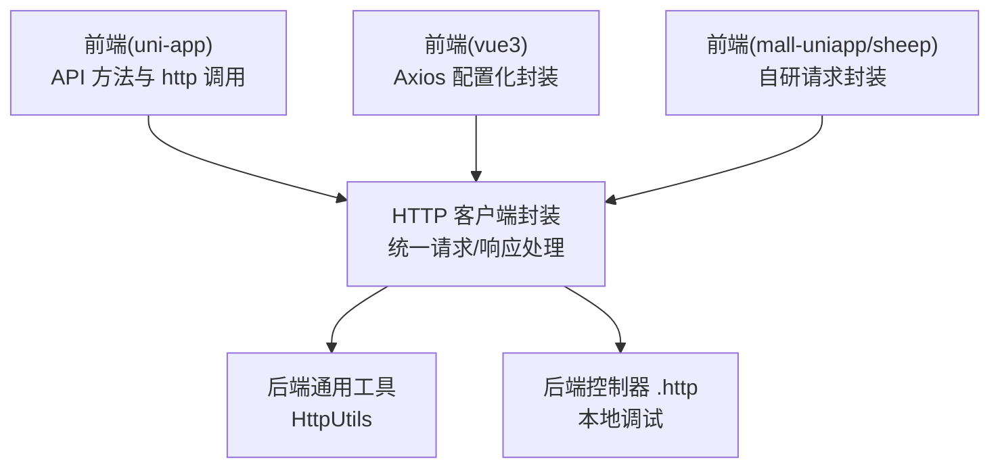
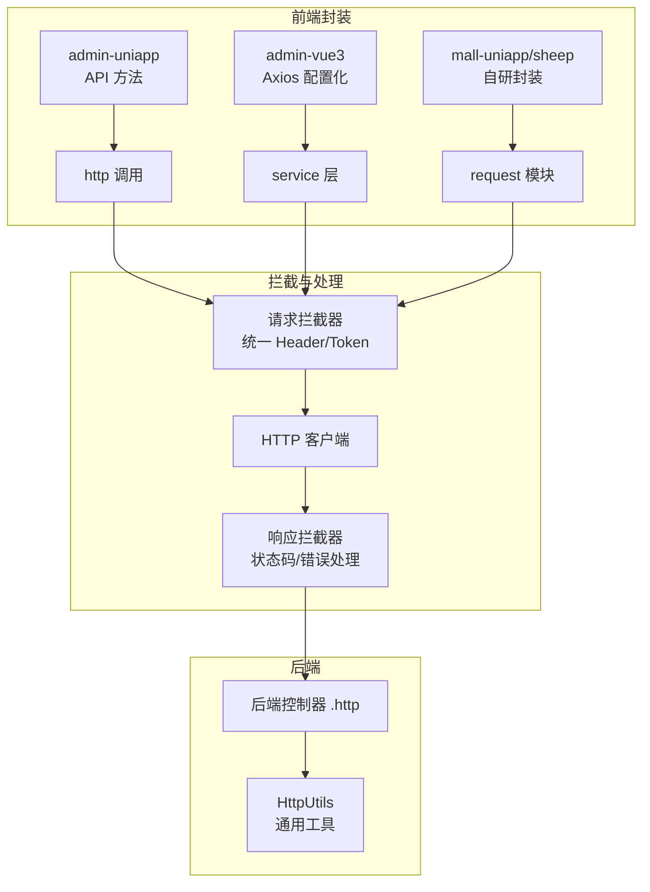
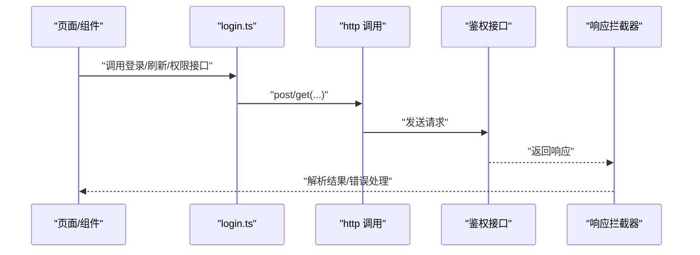
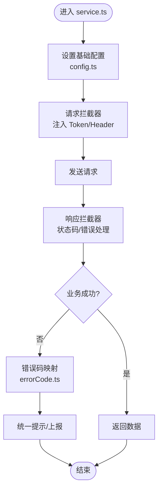
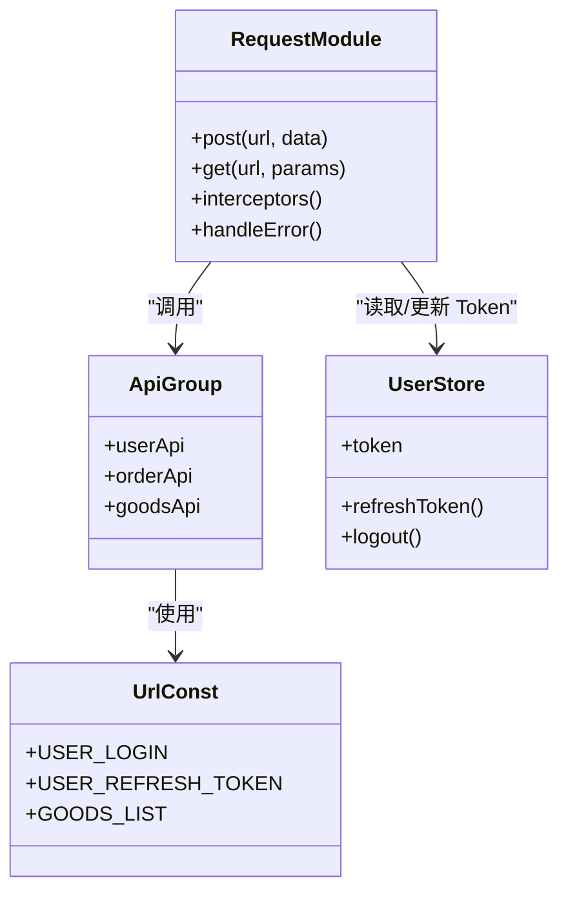
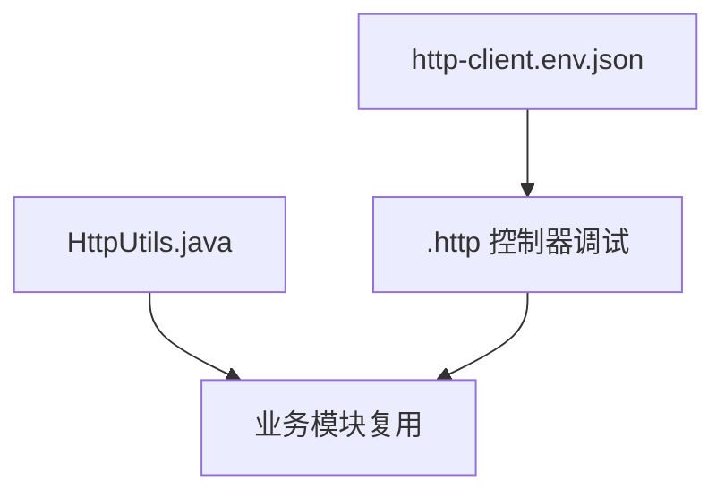
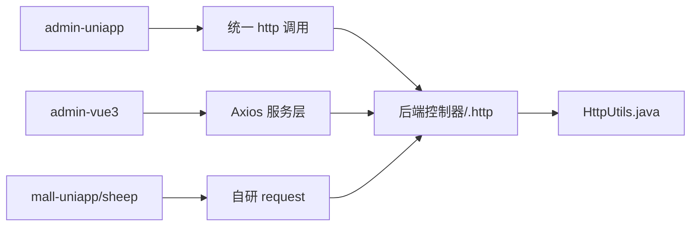

# API 接口集成

<cite>
**本文引用的文件**
- [frontend/admin-uniapp/src/api/login.ts](file://frontend/admin-uniapp/src/api/login.ts)
- [frontend/admin-uniapp/src/api/system/area/index.ts](file://frontend/admin-uniapp/src/api/system/area/index.ts)
- [frontend/admin-vue3/src/config/axios/index.ts](file://frontend/admin-vue3/src/config/axios/index.ts)
- [frontend/admin-vue3/src/config/axios/service.ts](file://frontend/admin-vue3/src/config/axios/service.ts)
- [frontend/admin-vue3/src/config/axios/config.ts](file://frontend/admin-vue3/src/config/axios/config.ts)
- [frontend/admin-vue3/src/config/axios/errorCode.ts](file://frontend/admin-vue3/src/config/axios/errorCode.ts)
- [frontend/mall-uniapp/sheep/request/index.ts](file://frontend/mall-uniapp/sheep/request/index.ts)
- [frontend/mall-uniapp/sheep/api/index.ts](file://frontend/mall-uniapp/sheep/api/index.ts)
- [frontend/mall-uniapp/sheep/url/index.ts](file://frontend/mall-uniapp/sheep/url/index.ts)
- [frontend/mall-uniapp/sheep/store/user.ts](file://frontend/mall-uniapp/sheep/store/user.ts)
- [backend/yudao-framework/yudao-common/src/main/java/cn/iocoder/yudao/framework/common/util/http/HttpUtils.java](file://backend/yudao-framework/yudao-common/src/main/java/cn/iocoder/yudao/framework/common/util/http/HttpUtils.java)
- [backend/script/idea/http-client.env.json](file://backend/script/idea/http-client.env.json)
- [backend/yudao-module-ai/src/main/java/cn/iocoder/yudao/module/ai/controller/admin/chat/AiChatMessageController.http](file://backend/yudao-module-ai/src/main/java/cn/iocoder/yudao/module/ai/controller/admin/chat/AiChatMessageController.http)
</cite>

## 目录
1. [简介](#简介)
2. [项目结构](#项目结构)
3. [核心组件](#核心组件)
4. [架构总览](#架构总览)
5. [详细组件分析](#详细组件分析)
6. [依赖分析](#依赖分析)
7. [性能考虑](#性能考虑)
8. [故障排查指南](#故障排查指南)
9. [结论](#结论)
10. [附录](#附录)

## 简介
本文件面向“API 接口集成”的目标，系统性梳理前端与后端在 HTTP 请求封装、拦截器配置、错误处理、鉴权与 Token 管理、并发控制、请求去重、缓存策略、超时处理、调试与 Mock、开发与生产优化、性能监控与错误上报等方面的实现与最佳实践。文档以仓库中已存在的前端 Axios 配置、UniApp 与 Vue3 的 API 封装、以及后端通用 HTTP 工具为依据，结合概念性流程图与类图进行说明。

## 项目结构
本仓库包含多端前端工程与后端框架，其中与 API 集成直接相关的关键位置如下：
- 前端（admin-uniapp）：API 方法集中于各业务模块的 api 目录，HTTP 调用通过统一的 http 模块发起。
- 前端（admin-vue3）：采用 axios 配置化的请求封装，包含基础配置、服务层封装与错误码映射。
- 前端（mall-uniapp/sheep）：自研请求封装与 API 分组管理，配合 URL 常量与用户状态存储。
- 后端（yudao-framework）：提供通用 HTTP 工具类，便于跨模块复用。
- 后端（IDEA 环境）：提供 http-client.env.json 与 .http 控制器文件，用于本地调试。

**图表来源**
- [frontend/admin-uniapp/src/api/login.ts:75-123](file://frontend/admin-uniapp/src/api/login.ts#L75-L123)
- [frontend/admin-vue3/src/config/axios/index.ts](file://frontend/admin-vue3/src/config/axios/index.ts)
- [frontend/admin-vue3/src/config/axios/service.ts](file://frontend/admin-vue3/src/config/axios/service.ts)
- [frontend/mall-uniapp/sheep/request/index.ts](file://frontend/mall-uniapp/sheep/request/index.ts)
- [backend/yudao-framework/yudao-common/src/main/java/cn/iocoder/yudao/framework/common/util/http/HttpUtils.java](file://backend/yudao-framework/yudao-common/src/main/java/cn/iocoder/yudao/framework/common/util/http/HttpUtils.java)

**章节来源**
- [frontend/admin-uniapp/src/api/login.ts:1-149](file://frontend/admin-uniapp/src/api/login.ts#L1-L149)
- [frontend/admin-vue3/src/config/axios/index.ts](file://frontend/admin-vue3/src/config/axios/index.ts)
- [frontend/admin-vue3/src/config/axios/service.ts](file://frontend/admin-vue3/src/config/axios/service.ts)
- [frontend/mall-uniapp/sheep/request/index.ts](file://frontend/mall-uniapp/sheep/request/index.ts)
- [backend/yudao-framework/yudao-common/src/main/java/cn/iocoder/yudao/framework/common/util/http/HttpUtils.java](file://backend/yudao-framework/yudao-common/src/main/java/cn/iocoder/yudao/framework/common/util/http/HttpUtils.java)

## 核心组件
- 统一请求封装（admin-uniapp）
  - 在 API 层通过 http 模块发起请求，示例包括登录、注册、短信登录、刷新 Token、权限信息获取等。
  - 关键路径参考：[login.ts:75-123](file://frontend/admin-uniapp/src/api/login.ts#L75-L123)、[area/index.ts:11-19](file://frontend/admin-uniapp/src/api/system/area/index.ts#L11-L19)

- Axios 配置化封装（admin-vue3）
  - 提供基础配置、服务层封装与错误码映射，便于全局拦截与统一处理。
  - 关键路径参考：[config.ts](file://frontend/admin-vue3/src/config/axios/config.ts)、[service.ts](file://frontend/admin-vue3/src/config/axios/service.ts)、[index.ts](file://frontend/admin-vue3/src/config/axios/index.ts)、[errorCode.ts](file://frontend/admin-vue3/src/config/axios/errorCode.ts)

- 自研请求封装（mall-uniapp/sheep）
  - 通过独立的 request 模块与 API 分组、URL 常量、用户状态存储协同工作。
  - 关键路径参考：[request/index.ts](file://frontend/mall-uniapp/sheep/request/index.ts)、[api/index.ts](file://frontend/mall-uniapp/sheep/api/index.ts)、[url/index.ts](file://frontend/mall-uniapp/sheep/url/index.ts)、[store/user.ts](file://frontend/mall-uniapp/sheep/store/user.ts)

- 后端通用 HTTP 工具
  - 提供通用 HTTP 工具类，便于跨模块复用与扩展。
  - 关键路径参考：[HttpUtils.java](file://backend/yudao-framework/yudao-common/src/main/java/cn/iocoder/yudao/framework/common/util/http/HttpUtils.java)

**章节来源**
- [frontend/admin-uniapp/src/api/login.ts:1-149](file://frontend/admin-uniapp/src/api/login.ts#L1-L149)
- [frontend/admin-uniapp/src/api/system/area/index.ts:1-20](file://frontend/admin-uniapp/src/api/system/area/index.ts#L1-L20)
- [frontend/admin-vue3/src/config/axios/config.ts](file://frontend/admin-vue3/src/config/axios/config.ts)
- [frontend/admin-vue3/src/config/axios/service.ts](file://frontend/admin-vue3/src/config/axios/service.ts)
- [frontend/admin-vue3/src/config/axios/index.ts](file://frontend/admin-vue3/src/config/axios/index.ts)
- [frontend/admin-vue3/src/config/axios/errorCode.ts](file://frontend/admin-vue3/src/config/axios/errorCode.ts)
- [frontend/mall-uniapp/sheep/request/index.ts](file://frontend/mall-uniapp/sheep/request/index.ts)
- [frontend/mall-uniapp/sheep/api/index.ts](file://frontend/mall-uniapp/sheep/api/index.ts)
- [frontend/mall-uniapp/sheep/url/index.ts](file://frontend/mall-uniapp/sheep/url/index.ts)
- [frontend/mall-uniapp/sheep/store/user.ts](file://frontend/mall-uniapp/sheep/store/user.ts)
- [backend/yudao-framework/yudao-common/src/main/java/cn/iocoder/yudao/framework/common/util/http/HttpUtils.java](file://backend/yudao-framework/yudao-common/src/main/java/cn/iocoder/yudao/framework/common/util/http/HttpUtils.java)

## 架构总览
下图展示前端三套 API 封装与后端通用工具之间的关系，以及请求在拦截器与错误处理层面的流转。

**图表来源**
- [frontend/admin-uniapp/src/api/login.ts:75-123](file://frontend/admin-uniapp/src/api/login.ts#L75-L123)
- [frontend/admin-vue3/src/config/axios/service.ts](file://frontend/admin-vue3/src/config/axios/service.ts)
- [frontend/mall-uniapp/sheep/request/index.ts](file://frontend/mall-uniapp/sheep/request/index.ts)
- [backend/yudao-framework/yudao-common/src/main/java/cn/iocoder/yudao/framework/common/util/http/HttpUtils.java](file://backend/yudao-framework/yudao-common/src/main/java/cn/iocoder/yudao/framework/common/util/http/HttpUtils.java)
- [backend/yudao-module-ai/src/main/java/cn/iocoder/yudao/module/ai/controller/admin/chat/AiChatMessageController.http](file://backend/yudao-module-ai/src/main/java/cn/iocoder/yudao/module/ai/controller/admin/chat/AiChatMessageController.http)

## 详细组件分析

### 组件 A：admin-uniapp API 封装与鉴权集成
- 设计理念
  - API 方法集中在业务模块目录，每个方法通过统一的 http 发起请求，便于维护与扩展。
  - 鉴权相关接口（登录、刷新 Token、权限信息、退出）集中在一个文件中，职责清晰。
- 关键流程
  - 登录/注册/短信登录：提交凭据并接收登录结果。
  - 刷新 Token：使用 refreshToken 接口传入 refresh_token。
  - 权限信息：调用 getAuthPermissionInfo 获取当前用户权限。
- 并发控制与去重
  - 可在 http 层引入请求去重与并发限制策略（例如基于 URL+参数的去重键与并发计数器），避免重复请求与资源浪费。
- 缓存策略
  - 对于只读数据（如地区树、租户列表）可引入短期缓存，减少网络开销。
- 超时处理
  - 在 http 层设置统一超时时间，失败时统一提示或重试。
- 错误处理
  - 响应拦截器中根据状态码与业务返回体进行统一处理，区分网络错误、业务错误与鉴权失败。

**图表来源**
- [frontend/admin-uniapp/src/api/login.ts:75-123](file://frontend/admin-uniapp/src/api/login.ts#L75-L123)

**章节来源**
- [frontend/admin-uniapp/src/api/login.ts:1-149](file://frontend/admin-uniapp/src/api/login.ts#L1-L149)
- [frontend/admin-uniapp/src/api/system/area/index.ts:1-20](file://frontend/admin-uniapp/src/api/system/area/index.ts#L1-L20)

### 组件 B：admin-vue3 Axios 配置化封装
- 统一配置
  - 在 config.ts 中定义基础配置（如 baseURL、超时、默认 Header 等）。
- 服务层封装
  - 在 service.ts 中实现请求/响应拦截器，统一处理 Token 注入、错误码映射与业务异常。
- 错误码映射
  - errorCode.ts 将后端错误码映射为前端可读文案，提升用户体验。
- 并发控制与去重
  - 可在 service 层引入请求去重队列与并发上限控制，避免重复与风暴请求。
- 缓存策略
  - 对 GET 请求可按 URL+查询参数生成缓存键，命中则直接返回缓存。
- 超时与重试
  - 结合超时与指数退避重试策略，提升弱网环境下的成功率。

**图表来源**
- [frontend/admin-vue3/src/config/axios/config.ts](file://frontend/admin-vue3/src/config/axios/config.ts)
- [frontend/admin-vue3/src/config/axios/service.ts](file://frontend/admin-vue3/src/config/axios/service.ts)
- [frontend/admin-vue3/src/config/axios/errorCode.ts](file://frontend/admin-vue3/src/config/axios/errorCode.ts)

**章节来源**
- [frontend/admin-vue3/src/config/axios/config.ts](file://frontend/admin-vue3/src/config/axios/config.ts)
- [frontend/admin-vue3/src/config/axios/service.ts](file://frontend/admin-vue3/src/config/axios/service.ts)
- [frontend/admin-vue3/src/config/axios/errorCode.ts](file://frontend/admin-vue3/src/config/axios/errorCode.ts)

### 组件 C：mall-uniapp/sheep 自研请求封装
- 请求模块
  - request/index.ts 封装了请求方法、拦截器与错误处理，支持统一 Header 与 Token 管理。
- API 分组
  - api/index.ts 按业务域组织接口，便于维护与调用。
- URL 常量
  - url/index.ts 维护所有接口地址常量，避免魔法字符串。
- 用户状态存储
  - store/user.ts 管理用户登录态与 Token，供请求模块读取与刷新。
- 并发与去重
  - 可在 request 层引入请求去重与并发控制，避免重复请求与资源竞争。
- 缓存策略
  - 对 GET 请求按 URL+参数生成缓存键，命中则直接返回缓存。
- 超时与重试
  - 设置统一超时与重试策略，增强弱网体验。

**图表来源**
- [frontend/mall-uniapp/sheep/request/index.ts](file://frontend/mall-uniapp/sheep/request/index.ts)
- [frontend/mall-uniapp/sheep/api/index.ts](file://frontend/mall-uniapp/sheep/api/index.ts)
- [frontend/mall-uniapp/sheep/url/index.ts](file://frontend/mall-uniapp/sheep/url/index.ts)
- [frontend/mall-uniapp/sheep/store/user.ts](file://frontend/mall-uniapp/sheep/store/user.ts)

**章节来源**
- [frontend/mall-uniapp/sheep/request/index.ts](file://frontend/mall-uniapp/sheep/request/index.ts)
- [frontend/mall-uniapp/sheep/api/index.ts](file://frontend/mall-uniapp/sheep/api/index.ts)
- [frontend/mall-uniapp/sheep/url/index.ts](file://frontend/mall-uniapp/sheep/url/index.ts)
- [frontend/mall-uniapp/sheep/store/user.ts](file://frontend/mall-uniapp/sheep/store/user.ts)

### 组件 D：后端通用 HTTP 工具与本地调试
- 通用工具
  - HttpUtils.java 提供通用 HTTP 工具方法，便于跨模块复用与扩展。
- 本地调试
  - IDEA 环境提供 http-client.env.json 与 .http 控制器文件，便于快速调试接口与查看响应。

**图表来源**
- [backend/yudao-framework/yudao-common/src/main/java/cn/iocoder/yudao/framework/common/util/http/HttpUtils.java](file://backend/yudao-framework/yudao-common/src/main/java/cn/iocoder/yudao/framework/common/util/http/HttpUtils.java)
- [backend/script/idea/http-client.env.json](file://backend/script/idea/http-client.env.json)
- [backend/yudao-module-ai/src/main/java/cn/iocoder/yudao/module/ai/controller/admin/chat/AiChatMessageController.http](file://backend/yudao-module-ai/src/main/java/cn/iocoder/yudao/module/ai/controller/admin/chat/AiChatMessageController.http)

**章节来源**
- [backend/yudao-framework/yudao-common/src/main/java/cn/iocoder/yudao/framework/common/util/http/HttpUtils.java](file://backend/yudao-framework/yudao-common/src/main/java/cn/iocoder/yudao/framework/common/util/http/HttpUtils.java)
- [backend/script/idea/http-client.env.json](file://backend/script/idea/http-client.env.json)
- [backend/yudao-module-ai/src/main/java/cn/iocoder/yudao/module/ai/controller/admin/chat/AiChatMessageController.http](file://backend/yudao-module-ai/src/main/java/cn/iocoder/yudao/module/ai/controller/admin/chat/AiChatMessageController.http)

## 依赖分析
- 前端三套封装相互独立但遵循统一的“请求拦截器 + 响应拦截器 + 错误处理”范式。
- admin-vue3 的 Axios 配置化封装与 mall-uniapp/sheep 的自研封装在功能上互补：前者强调标准化与可复用，后者强调灵活性与业务贴合。
- 后端通用工具与本地调试文件为前后端协作提供支撑。

**图表来源**
- [frontend/admin-uniapp/src/api/login.ts:75-123](file://frontend/admin-uniapp/src/api/login.ts#L75-L123)
- [frontend/admin-vue3/src/config/axios/service.ts](file://frontend/admin-vue3/src/config/axios/service.ts)
- [frontend/mall-uniapp/sheep/request/index.ts](file://frontend/mall-uniapp/sheep/request/index.ts)
- [backend/yudao-framework/yudao-common/src/main/java/cn/iocoder/yudao/framework/common/util/http/HttpUtils.java](file://backend/yudao-framework/yudao-common/src/main/java/cn/iocoder/yudao/framework/common/util/http/HttpUtils.java)

**章节来源**
- [frontend/admin-uniapp/src/api/login.ts:1-149](file://frontend/admin-uniapp/src/api/login.ts#L1-L149)
- [frontend/admin-vue3/src/config/axios/service.ts](file://frontend/admin-vue3/src/config/axios/service.ts)
- [frontend/mall-uniapp/sheep/request/index.ts](file://frontend/mall-uniapp/sheep/request/index.ts)
- [backend/yudao-framework/yudao-common/src/main/java/cn/iocoder/yudao/framework/common/util/http/HttpUtils.java](file://backend/yudao-framework/yudao-common/src/main/java/cn/iocoder/yudao/framework/common/util/http/HttpUtils.java)

## 性能考虑
- 并发控制
  - 在请求层设置最大并发数，超过阈值的请求排队等待，避免资源争用。
- 请求去重
  - 基于 URL+参数生成唯一键，相同请求在执行中被去重，仅保留一个。
- 缓存策略
  - 对 GET 请求启用短期缓存，命中则直接返回；对写操作禁用缓存或失效对应键。
- 超时与重试
  - 统一设置超时时间，结合指数退避重试，提升弱网稳定性。
- 响应数据处理
  - 在响应拦截器中进行数据清洗与格式化，减少上层重复逻辑。
- 状态码判断
  - 明确区分网络错误、鉴权失败、业务错误与成功响应，分别处理与提示。

[本节为通用指导，无需列出具体文件来源]

## 故障排查指南
- 常见问题定位
  - 鉴权失败：检查 Token 是否存在、是否过期、刷新流程是否正确。
  - 网络错误：检查超时设置、重试策略与代理配置。
  - 业务错误：查看错误码映射与后端返回体，确认参数与权限。
- 日志与上报
  - 在响应拦截器中记录请求上下文与错误详情，便于定位问题。
- 本地调试
  - 使用 .http 文件与 http-client.env.json 快速验证接口与参数。

**章节来源**
- [frontend/admin-vue3/src/config/axios/errorCode.ts](file://frontend/admin-vue3/src/config/axios/errorCode.ts)
- [backend/script/idea/http-client.env.json](file://backend/script/idea/http-client.env.json)
- [backend/yudao-module-ai/src/main/java/cn/iocoder/yudao/module/ai/controller/admin/chat/AiChatMessageController.http](file://backend/yudao-module-ai/src/main/java/cn/iocoder/yudao/module/ai/controller/admin/chat/AiChatMessageController.http)

## 结论
本仓库在前端提供了三套成熟的 API 集成方案：admin-uniapp 的统一 http 调用、admin-vue3 的 Axios 配置化封装与 mall-uniapp/sheep 的自研请求封装。它们共同遵循“请求/响应拦截器 + 统一错误处理 + 鉴权与 Token 管理”的设计范式，并可通过并发控制、请求去重、缓存与超时策略进一步优化性能与稳定性。后端通用工具与本地调试文件为前后端协作提供了坚实支撑。

[本节为总结性内容，无需列出具体文件来源]

## 附录
- 开发环境配置建议
  - 前端：在 Axios 配置中设置 baseURL 与默认 Header；在拦截器中注入 Token；启用错误码映射与统一提示。
  - 后端：使用 HttpUtils 进行通用 HTTP 操作；通过 .http 文件与 http-client.env.json 进行本地调试。
- 生产环境优化建议
  - 启用请求去重与并发限制；对只读接口启用缓存；设置合理的超时与重试策略；完善错误上报与埋点。

[本节为通用指导，无需列出具体文件来源]