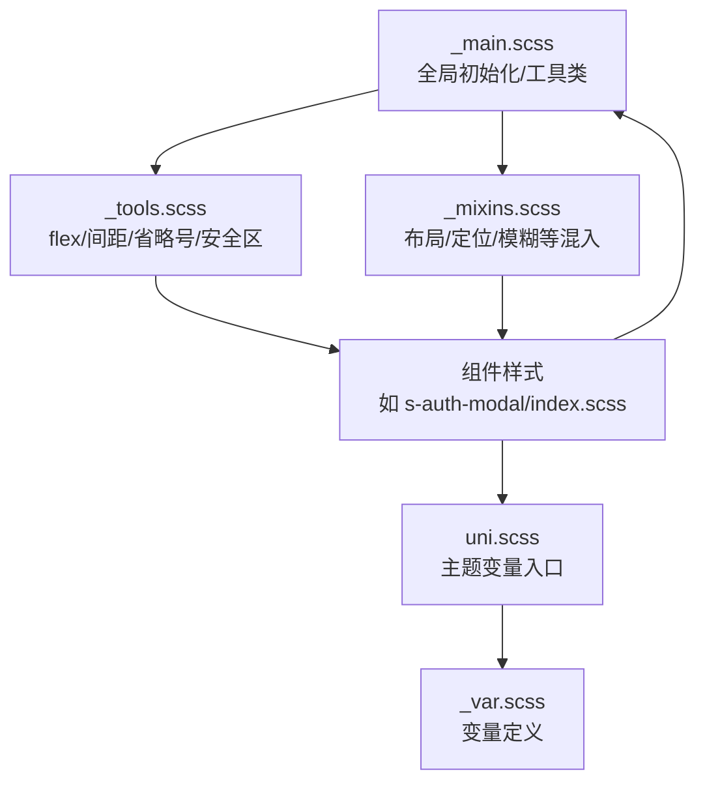
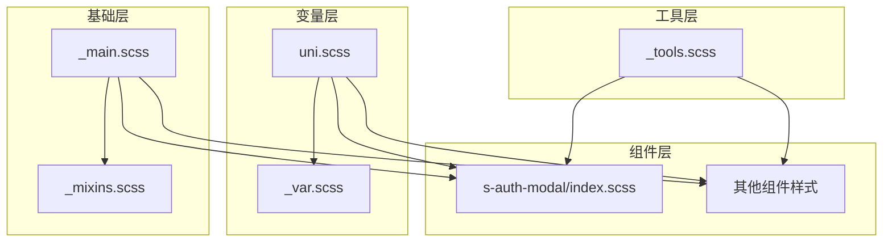
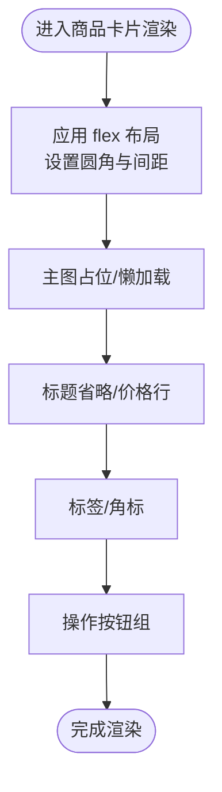
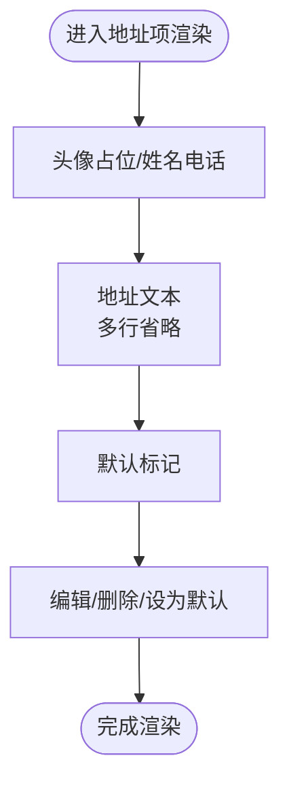
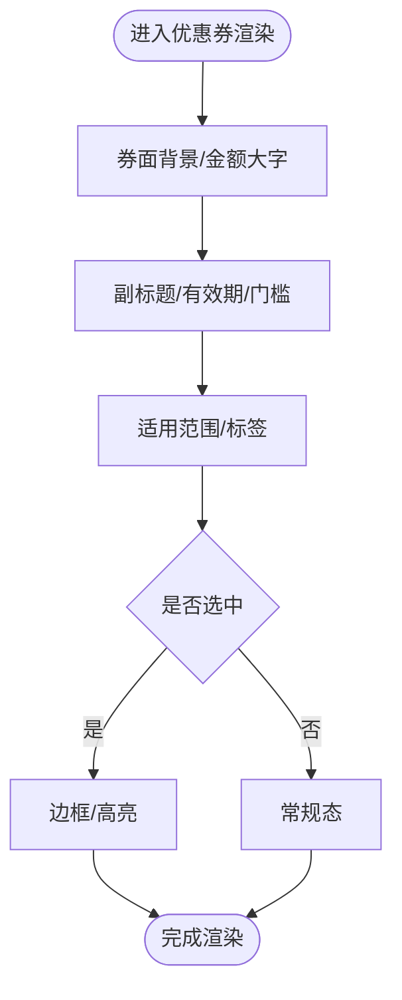
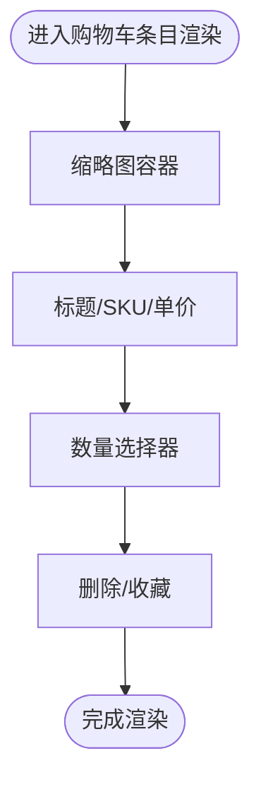
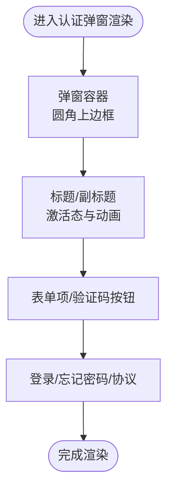
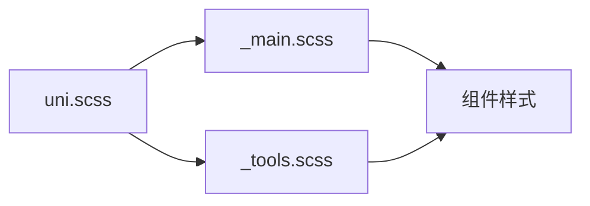

# UI 组件库与样式系统

<cite>
**本文引用的文件**
- [frontend/mall-uniapp/sheep/scss/_main.scss](file://frontend/mall-uniapp/sheep/scss/_main.scss)
- [frontend/mall-uniapp/sheep/scss/_mixins.scss](file://frontend/mall-uniapp/sheep/scss/_mixins.scss)
- [frontend/mall-uniapp/sheep/scss/_tools.scss](file://frontend/mall-uniapp/sheep/scss/_tools.scss)
- [frontend/mall-uniapp/sheep/components/s-auth-modal/index.scss](file://frontend/mall-uniapp/sheep/components/s-auth-modal/index.scss)
- [frontend/mall-uniapp/uni.scss](file://frontend/mall-uniapp/uni.scss)
</cite>

## 目录
1. [简介](#简介)
2. [项目结构](#项目结构)
3. [核心组件](#核心组件)
4. [架构总览](#架构总览)
5. [详细组件分析](#详细组件分析)
6. [依赖关系分析](#依赖关系分析)
7. [性能考量](#性能考量)
8. [故障排查指南](#故障排查指南)
9. [结论](#结论)
10. [附录](#附录)

## 简介
本文件面向电商场景，系统化梳理前端 UI 组件库与样式体系，重点覆盖商品卡片、地址项、优惠券、购物车条目等核心 UI 组件的设计理念与实现方式；并完整文档化 SCSS 变量系统、主题定制、响应式布局与跨平台样式适配策略。文档同时提供组件开发规范、命名约定、可复用性设计与性能优化建议，以及使用示例与常见问题解决方案。

## 项目结构
电商前端采用 uni-app 技术栈，样式系统以 SCSS 为主，核心位于 mall-uniapp 工程中：
- 样式主入口：uni.scss 引入统一变量与主题常量
- 样式基础层：_main.scss 提供全局初始化、工具类与通用混入
- 工具与布局：_tools.scss 提供 flex、间距、省略号、安全区等实用工具
- 组件级样式：各组件独立 SCSS 文件，遵循语义化命名与变量引用

图表来源
- [frontend/mall-uniapp/uni.scss:1-77](file://frontend/mall-uniapp/uni.scss#L1-L77)
- [frontend/mall-uniapp/sheep/scss/_main.scss:1-355](file://frontend/mall-uniapp/sheep/scss/_main.scss#L1-L355)
- [frontend/mall-uniapp/sheep/scss/_mixins.scss:1-62](file://frontend/mall-uniapp/sheep/scss/_mixins.scss#L1-L62)
- [frontend/mall-uniapp/sheep/scss/_tools.scss:1-287](file://frontend/mall-uniapp/sheep/scss/_tools.scss#L1-L287)
- [frontend/mall-uniapp/sheep/components/s-auth-modal/index.scss:1-152](file://frontend/mall-uniapp/sheep/components/s-auth-modal/index.scss#L1-L152)

章节来源
- [frontend/mall-uniapp/uni.scss:1-77](file://frontend/mall-uniapp/uni.scss#L1-L77)
- [frontend/mall-uniapp/sheep/scss/_main.scss:1-355](file://frontend/mall-uniapp/sheep/scss/_main.scss#L1-L355)
- [frontend/mall-uniapp/sheep/scss/_mixins.scss:1-62](file://frontend/mall-uniapp/sheep/scss/_mixins.scss#L1-L62)
- [frontend/mall-uniapp/sheep/scss/_tools.scss:1-287](file://frontend/mall-uniapp/sheep/scss/_tools.scss#L1-L287)
- [frontend/mall-uniapp/sheep/components/s-auth-modal/index.scss:1-152](file://frontend/mall-uniapp/sheep/components/s-auth-modal/index.scss#L1-L152)

## 核心组件
以下为核心电商 UI 组件的抽象能力与实现要点（基于现有样式与通用组件模式归纳）：

- 商品卡片组件
  - 设计目标：承载商品主图、标题、价格、标签、购买入口等关键信息，支持多规格、库存与活动标签展示
  - 关键样式：卡片容器、图片占位、标题省略、价格行、标签角标、操作按钮
  - 可复用性：通过变量控制圆角、阴影、间距；通过工具类实现 flex 布局与省略显示

- 地址项组件
  - 设计目标：展示收货人姓名、电话、地区与详细地址，支持默认标记、编辑与删除
  - 关键样式：头像占位、姓名/电话行、地址文本省略、默认标签、操作按钮组
  - 可复用性：统一的列表项卡片与操作按钮样式，便于主题切换

- 优惠券组件
  - 设计目标：突出面额与门槛，标注有效期与适用范围，支持选中/不可用状态
  - 关键样式：券面背景、金额大号字体、副标题、标签、选中边框/高亮
  - 可复用性：通过变量统一配色与字号，避免硬编码

- 购物车条目组件
  - 设计目标：单品数量、SKU 展示、小计计算、操作（加减、删除、收藏）
  - 关键样式：缩略图容器、信息区 flex 布局、数量选择器、底部操作栏
  - 可复用性：统一的输入/按钮样式与安全区适配

章节来源
- [frontend/mall-uniapp/sheep/scss/_tools.scss:1-287](file://frontend/mall-uniapp/sheep/scss/_tools.scss#L1-L287)
- [frontend/mall-uniapp/sheep/scss/_main.scss:1-355](file://frontend/mall-uniapp/sheep/scss/_main.scss#L1-L355)

## 架构总览
样式系统分层清晰，职责明确：
- 变量层：uni.scss 引入统一变量，便于主题定制与跨页面一致性
- 基础层：_main.scss 提供全局初始化、工具类与通用混入
- 工具层：_tools.scss 提供 flex、间距、省略号、安全区等高频工具
- 组件层：各组件独立 SCSS，按需引入基础与工具样式

图表来源
- [frontend/mall-uniapp/uni.scss:1-77](file://frontend/mall-uniapp/uni.scss#L1-L77)
- [frontend/mall-uniapp/sheep/scss/_main.scss:1-355](file://frontend/mall-uniapp/sheep/scss/_main.scss#L1-L355)
- [frontend/mall-uniapp/sheep/scss/_mixins.scss:1-62](file://frontend/mall-uniapp/sheep/scss/_mixins.scss#L1-L62)
- [frontend/mall-uniapp/sheep/scss/_tools.scss:1-287](file://frontend/mall-uniapp/sheep/scss/_tools.scss#L1-L287)
- [frontend/mall-uniapp/sheep/components/s-auth-modal/index.scss:1-152](file://frontend/mall-uniapp/sheep/components/s-auth-modal/index.scss#L1-L152)

## 详细组件分析

### 商品卡片组件
- 结构要点
  - 卡片容器：统一圆角、阴影与间距
  - 主图区域：占位图与懒加载占位
  - 标题行：使用省略号工具类保证单行或多行截断
  - 价格行：大号数字与划线价对比
  - 角标/标签：促销、限时、包邮等标识
  - 操作区：购买按钮、收藏、分享
- 样式来源
  - 工具类：flex、省略号、圆角、安全区
  - 变量：主题色、文字色、背景色
- 性能建议
  - 图片懒加载与尺寸控制
  - 避免深层嵌套与重复选择器

图表来源
- [frontend/mall-uniapp/sheep/scss/_tools.scss:1-287](file://frontend/mall-uniapp/sheep/scss/_tools.scss#L1-L287)
- [frontend/mall-uniapp/sheep/scss/_main.scss:1-355](file://frontend/mall-uniapp/sheep/scss/_main.scss#L1-L355)

章节来源
- [frontend/mall-uniapp/sheep/scss/_tools.scss:1-287](file://frontend/mall-uniapp/sheep/scss/_tools.scss#L1-L287)
- [frontend/mall-uniapp/sheep/scss/_main.scss:1-355](file://frontend/mall-uniapp/sheep/scss/_main.scss#L1-L355)

### 地址项组件
- 结构要点
  - 头像占位：姓名/电话行
  - 地址文本：使用省略号工具类，支持多行截断
  - 默认标记：视觉高亮与图标
  - 操作按钮：编辑、删除、设为默认
- 样式来源
  - 工具类：flex、省略号、安全区
  - 变量：主色、次色、禁用态透明度

图表来源
- [frontend/mall-uniapp/sheep/scss/_tools.scss:1-287](file://frontend/mall-uniapp/sheep/scss/_tools.scss#L1-L287)
- [frontend/mall-uniapp/uni.scss:1-77](file://frontend/mall-uniapp/uni.scss#L1-L77)

章节来源
- [frontend/mall-uniapp/sheep/scss/_tools.scss:1-287](file://frontend/mall-uniapp/sheep/scss/_tools.scss#L1-L287)
- [frontend/mall-uniapp/uni.scss:1-77](file://frontend/mall-uniapp/uni.scss#L1-L77)

### 优惠券组件
- 结构要点
  - 券面背景：渐变或纯色背景
  - 金额与副标题：字号与对比色
  - 有效期/门槛：辅助信息
  - 选中态：边框高亮或阴影
- 样式来源
  - 工具类：圆角、flex
  - 变量：主色、强调色、文字色

图表来源
- [frontend/mall-uniapp/sheep/scss/_tools.scss:1-287](file://frontend/mall-uniapp/sheep/scss/_tools.scss#L1-L287)
- [frontend/mall-uniapp/uni.scss:1-77](file://frontend/mall-uniapp/uni.scss#L1-L77)

章节来源
- [frontend/mall-uniapp/sheep/scss/_tools.scss:1-287](file://frontend/mall-uniapp/sheep/scss/_tools.scss#L1-L287)
- [frontend/mall-uniapp/uni.scss:1-77](file://frontend/mall-uniapp/uni.scss#L1-L77)

### 购物车条目组件
- 结构要点
  - 缩略图容器：固定宽高与居中
  - 信息区：标题、SKU、单价/小计
  - 数量选择器：加减按钮与输入
  - 底部操作：删除、收藏
- 样式来源
  - 工具类：flex、省略号、安全区
  - 变量：主色、禁用态透明度

图表来源
- [frontend/mall-uniapp/sheep/scss/_tools.scss:1-287](file://frontend/mall-uniapp/sheep/scss/_tools.scss#L1-L287)
- [frontend/mall-uniapp/uni.scss:1-77](file://frontend/mall-uniapp/uni.scss#L1-L77)

章节来源
- [frontend/mall-uniapp/sheep/scss/_tools.scss:1-287](file://frontend/mall-uniapp/sheep/scss/_tools.scss#L1-L287)
- [frontend/mall-uniapp/uni.scss:1-77](file://frontend/mall-uniapp/uni.scss#L1-L77)

### 认证弹窗组件（示例）
该组件展示了电商常见的登录/注册弹窗样式组织方式，体现变量引用与动画效果的应用。

图表来源
- [frontend/mall-uniapp/sheep/components/s-auth-modal/index.scss:1-152](file://frontend/mall-uniapp/sheep/components/s-auth-modal/index.scss#L1-L152)

章节来源
- [frontend/mall-uniapp/sheep/components/s-auth-modal/index.scss:1-152](file://frontend/mall-uniapp/sheep/components/s-auth-modal/index.scss#L1-L152)

## 依赖关系分析
- 样式依赖链
  - uni.scss 作为入口，导入变量定义
  - _main.scss 提供全局与工具类，被所有组件样式依赖
  - _tools.scss 提供高频工具，被业务组件广泛使用
  - 组件样式按需引入基础与工具层，形成松耦合
- 变量与主题
  - 通过 uni.scss 统一变量，便于主题切换与品牌定制
  - 组件内部优先使用变量而非硬编码色值

图表来源
- [frontend/mall-uniapp/uni.scss:1-77](file://frontend/mall-uniapp/uni.scss#L1-L77)
- [frontend/mall-uniapp/sheep/scss/_main.scss:1-355](file://frontend/mall-uniapp/sheep/scss/_main.scss#L1-L355)
- [frontend/mall-uniapp/sheep/scss/_tools.scss:1-287](file://frontend/mall-uniapp/sheep/scss/_tools.scss#L1-L287)

章节来源
- [frontend/mall-uniapp/uni.scss:1-77](file://frontend/mall-uniapp/uni.scss#L1-L77)
- [frontend/mall-uniapp/sheep/scss/_main.scss:1-355](file://frontend/mall-uniapp/sheep/scss/_main.scss#L1-L355)
- [frontend/mall-uniapp/sheep/scss/_tools.scss:1-287](file://frontend/mall-uniapp/sheep/scss/_tools.scss#L1-L287)

## 性能考量
- 选择器复杂度控制
  - 避免深层嵌套，减少匹配开销
  - 使用工具类组合替代复杂选择器
- 动画与过渡
  - 合理使用 transform 与 opacity，避免触发布局抖动
  - 控制动画时长与缓动函数，确保流畅体验
- 图片与资源
  - 图片懒加载与尺寸控制，减少首屏压力
  - SVG 与 iconfont 的合理使用，降低体积
- 主题与变量
  - 通过变量集中管理颜色与尺寸，减少重复定义
  - 避免在组件内重复声明变量

## 故障排查指南
- 样式不生效
  - 检查 uni.scss 是否正确引入变量文件
  - 确认组件样式是否引入 _main.scss 或 _tools.scss
- 主题色未更新
  - 在 uni.scss 中修改对应变量后，确保重新编译
  - 检查组件是否直接硬编码颜色
- 布局错位
  - 使用 ss-flex、ss-flex-col 等工具类进行快速排错
  - 检查是否存在浮动与定位冲突
- 安全区适配
  - 使用 ss-safe-bottom 确保底部安全区域
  - 在不同设备下验证 padding 与高度

章节来源
- [frontend/mall-uniapp/uni.scss:1-77](file://frontend/mall-uniapp/uni.scss#L1-L77)
- [frontend/mall-uniapp/sheep/scss/_tools.scss:1-287](file://frontend/mall-uniapp/sheep/scss/_tools.scss#L1-L287)

## 结论
本样式系统以 SCSS 为基础，通过变量层、基础层、工具层与组件层的清晰分层，实现了电商 UI 组件的高复用与强一致性。结合工具类与混入，既能满足快速开发，又能保障主题定制与跨平台适配。建议在后续迭代中持续沉淀组件规范与最佳实践，进一步提升开发效率与维护性。

## 附录

### 组件开发规范与命名约定
- 命名约定
  - 组件样式文件：组件名/index.scss
  - 类名前缀：业务组件使用业务前缀，工具类使用 ss- 前缀
  - 变量命名：语义化，如 $ui-BG、$ui-TC
- 开发规范
  - 优先使用工具类组合布局
  - 通过变量控制主题色与尺寸
  - 避免在组件内重复定义变量
  - 使用混入封装可复用样式片段

### 主题定制与变量系统
- 变量来源
  - uni.scss：统一变量入口，定义颜色、字体、尺寸等
  - _main.scss：全局变量与工具类生成
- 定制步骤
  - 在 uni.scss 中修改变量值
  - 重新编译工程，验证主题效果
  - 在组件中统一使用变量，避免硬编码

章节来源
- [frontend/mall-uniapp/uni.scss:1-77](file://frontend/mall-uniapp/uni.scss#L1-L77)
- [frontend/mall-uniapp/sheep/scss/_main.scss:1-355](file://frontend/mall-uniapp/sheep/scss/_main.scss#L1-L355)