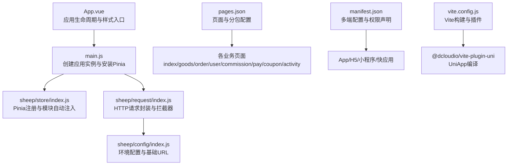
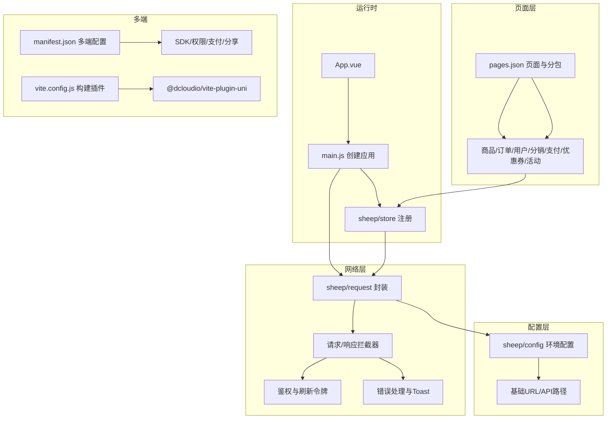
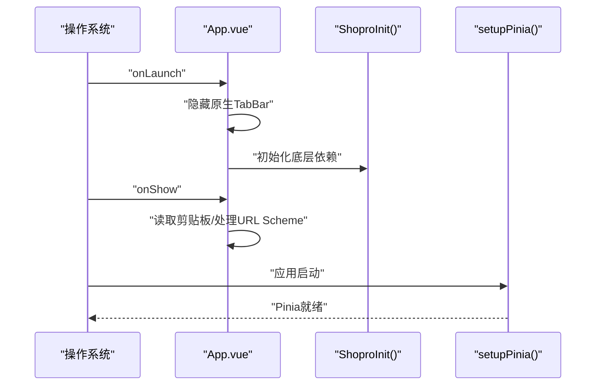
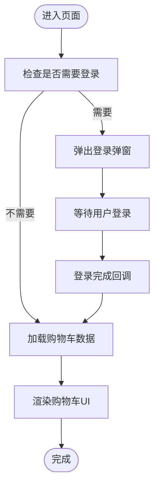
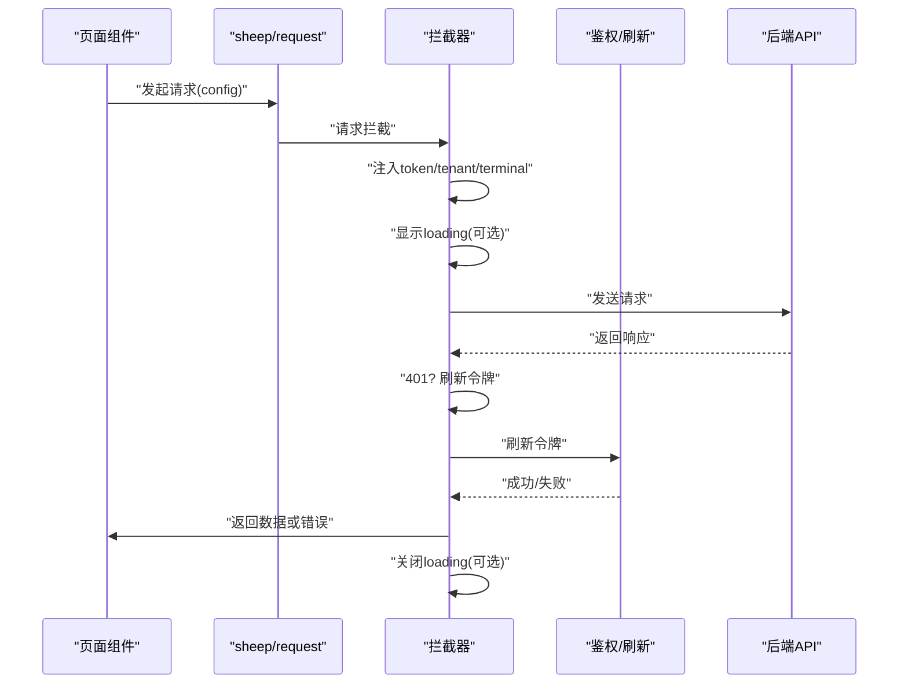
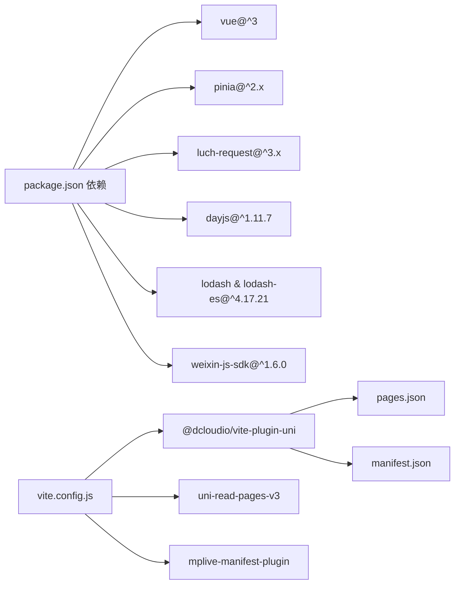

# UniApp 电商客户端

<cite>
**本文档引用的文件**
- [App.vue](file://frontend/mall-uniapp/App.vue)
- [main.js](file://frontend/mall-uniapp/main.js)
- [pages.json](file://frontend/mall-uniapp/pages.json)
- [manifest.json](file://frontend/mall-uniapp/manifest.json)
- [vite.config.js](file://frontend/mall-uniapp/vite.config.js)
- [store/index.js](file://frontend/mall-uniapp/sheep/store/index.js)
- [request/index.js](file://frontend/mall-uniapp/sheep/request/index.js)
- [config/index.js](file://frontend/mall-uniapp/sheep/config/index.js)
- [package.json](file://frontend/mall-uniapp/package.json)
</cite>

## 目录
1. [简介](#简介)
2. [项目结构](#项目结构)
3. [核心组件](#核心组件)
4. [架构总览](#架构总览)
5. [详细组件分析](#详细组件分析)
6. [依赖关系分析](#依赖关系分析)
7. [性能考虑](#性能考虑)
8. [故障排除指南](#故障排除指南)
9. [结论](#结论)
10. [附录](#附录)

## 简介
本项目是一个基于 Vue 2 + UniApp + Vite 的电商移动端应用，采用单包多页面架构，通过 pages.json 配置页面与分包策略，结合 Pinia 状态管理、自研请求封装与本地持久化方案，覆盖商品展示、购物车、订单流程、支付集成、用户中心等核心业务模块。应用通过 manifest.json 配置多端发布能力，支持 App、H5、微信小程序等平台，并提供统一的 UI 组件体系与路由管理。

## 项目结构
项目采用分层组织方式：
- 应用入口与运行时配置：App.vue、main.js、manifest.json、vite.config.js
- 页面与路由：pages.json（主包 + 多个分包）
- 状态管理：sheep/store（Pinia + 持久化插件）
- 网络请求：sheep/request（基于 luch-request 封装，含拦截器、鉴权、刷新令牌）
- 配置中心：sheep/config（环境变量与基础路径）
- 依赖与多端声明：package.json（uni_modules 平台声明）

图表来源
- [App.vue:1-33](file://frontend/mall-uniapp/App.vue#L1-L33)
- [main.js:1-16](file://frontend/mall-uniapp/main.js#L1-L16)
- [store/index.js:1-21](file://frontend/mall-uniapp/sheep/store/index.js#L1-L21)
- [request/index.js:1-311](file://frontend/mall-uniapp/sheep/request/index.js#L1-L311)
- [config/index.js:1-32](file://frontend/mall-uniapp/sheep/config/index.js#L1-L32)
- [pages.json:1-704](file://frontend/mall-uniapp/pages.json#L1-L704)
- [manifest.json:1-225](file://frontend/mall-uniapp/manifest.json#L1-L225)
- [vite.config.js:1-35](file://frontend/mall-uniapp/vite.config.js#L1-L35)

章节来源
- [App.vue:1-33](file://frontend/mall-uniapp/App.vue#L1-L33)
- [main.js:1-16](file://frontend/mall-uniapp/main.js#L1-L16)
- [pages.json:1-704](file://frontend/mall-uniapp/pages.json#L1-L704)
- [manifest.json:1-225](file://frontend/mall-uniapp/manifest.json#L1-L225)
- [vite.config.js:1-35](file://frontend/mall-uniapp/vite.config.js#L1-L35)

## 核心组件
- 应用初始化与生命周期：在 App.vue 中监听 onLaunch/onShow，隐藏原生 TabBar 并初始化底层依赖；在 main.js 中创建 SSR 应用并注册 Pinia。
- 页面路由与分包：pages.json 定义主包页面与多个分包（商品、订单、用户、分销、支付、优惠券、活动等），并配置 tabBar。
- 状态管理：sheep/store 使用 Pinia，启用 pinia-plugin-persist-uni 实现状态持久化，自动扫描模块并注入。
- 请求封装：sheep/request 基于 luch-request，统一设置 header、拦截器、鉴权、错误处理与无感刷新令牌。
- 配置中心：sheep/config 从环境变量读取基础 URL、API 路径、静态资源、租户 ID 等。
- 构建与多端：vite.config.js 集成 @dcloudio/vite-plugin-uni 与自定义插件，支持 uni-read-pages-v3 与 mplive-manifest 插件；manifest.json 声明多端能力与 SDK 配置。

章节来源
- [App.vue:1-33](file://frontend/mall-uniapp/App.vue#L1-L33)
- [main.js:1-16](file://frontend/mall-uniapp/main.js#L1-L16)
- [store/index.js:1-21](file://frontend/mall-uniapp/sheep/store/index.js#L1-L21)
- [request/index.js:1-311](file://frontend/mall-uniapp/sheep/request/index.js#L1-L311)
- [config/index.js:1-32](file://frontend/mall-uniapp/sheep/config/index.js#L1-L32)
- [pages.json:1-704](file://frontend/mall-uniapp/pages.json#L1-L704)
- [manifest.json:1-225](file://frontend/mall-uniapp/manifest.json#L1-L225)
- [vite.config.js:1-35](file://frontend/mall-uniapp/vite.config.js#L1-L35)

## 架构总览
应用采用“单页应用 + 多页面 + 分包”的混合架构：
- 主包承载首页、分类、购物车、用户中心等高频页面
- 业务按模块拆分为分包，减少首屏体积与冷启动时间
- 通过 pages.json 的 meta 字段标注权限、同步策略与分组，便于统一治理
- 请求层统一处理鉴权、加载态、错误提示与令牌刷新
- 状态层通过 Pinia + 持久化实现跨页面共享与本地缓存

图表来源
- [App.vue:1-33](file://frontend/mall-uniapp/App.vue#L1-L33)
- [main.js:1-16](file://frontend/mall-uniapp/main.js#L1-L16)
- [store/index.js:1-21](file://frontend/mall-uniapp/sheep/store/index.js#L1-L21)
- [request/index.js:1-311](file://frontend/mall-uniapp/sheep/request/index.js#L1-L311)
- [config/index.js:1-32](file://frontend/mall-uniapp/sheep/config/index.js#L1-L32)
- [pages.json:1-704](file://frontend/mall-uniapp/pages.json#L1-L704)
- [manifest.json:1-225](file://frontend/mall-uniapp/manifest.json#L1-L225)
- [vite.config.js:1-35](file://frontend/mall-uniapp/vite.config.js#L1-L35)

## 详细组件分析

### 应用初始化流程
- 启动阶段：onLaunch 中隐藏原生 TabBar，调用 ShoproInit 初始化底层依赖
- 运行阶段：onShow 中处理 App 平台的 URL Scheme 与剪贴板读取
- 应用实例：main.js 中 createSSRApp 创建应用，setupPinia 安装 Pinia 并注入模块

图表来源
- [App.vue:1-33](file://frontend/mall-uniapp/App.vue#L1-L33)
- [main.js:1-16](file://frontend/mall-uniapp/main.js#L1-L16)

章节来源
- [App.vue:1-33](file://frontend/mall-uniapp/App.vue#L1-L33)
- [main.js:1-16](file://frontend/mall-uniapp/main.js#L1-L16)

### 页面路由配置与分包策略
- 主包页面：首页、个人中心、商品分类、购物车、登录、搜索、自定义页面
- 分包页面：商品（详情、拼团、秒杀、积分、列表、评价）、订单（详情、确认、列表、售后、物流）、用户（信息、收藏、足迹、地址、余额、积分）、分销（中心、佣金、推广、订单、团队、排行榜、提现）、应用（签到）、公共（设置、富文本、FAQ、错误、webview）、优惠券（列表、详情）、聊天（客服）、支付（收银台、结果、充值、充值记录）、活动（拼团、秒杀、积分）
- tabBar：首页、分类、购物车、个人中心
- 全局样式与导航：globalStyle 设置导航文字颜色、背景色、自定义导航样式

章节来源
- [pages.json:1-704](file://frontend/mall-uniapp/pages.json#L1-L704)

### 用户状态管理与购物车功能
- 状态管理：sheep/store 使用 Pinia，启用持久化插件，自动扫描模块并注入
- 购物车：通过 store 模块维护购物车数据，结合页面与 API 实现增删改查
- 用户登录：鉴权接口返回 accessToken 时自动写入 store 并持久化

图表来源
- [store/index.js:1-21](file://frontend/mall-uniapp/sheep/store/index.js#L1-L21)
- [request/index.js:1-311](file://frontend/mall-uniapp/sheep/request/index.js#L1-L311)

章节来源
- [store/index.js:1-21](file://frontend/mall-uniapp/sheep/store/index.js#L1-L21)
- [request/index.js:1-311](file://frontend/mall-uniapp/sheep/request/index.js#L1-L311)

### API 请求封装与鉴权
- 基础配置：baseURL、超时、header（Accept、Content-Type、platform、tenant-id）
- 请求拦截：注入 Authorization 令牌、terminal、tenant；按需显示 loading
- 响应拦截：登录接口自动写入 token；401 无感刷新令牌；错误码统一提示
- 令牌刷新：并发请求排队，刷新成功后重放队列与当前请求；刷新失败则登出并弹出登录

图表来源
- [request/index.js:1-311](file://frontend/mall-uniapp/sheep/request/index.js#L1-L311)

章节来源
- [request/index.js:1-311](file://frontend/mall-uniapp/sheep/request/index.js#L1-L311)

### 组件库使用与 UI 组件
- 自定义 UI：pages.json 中通过 easycom 自动扫描与别名映射，支持 s- 与 su- 前缀组件
- 原生组件：项目引入大量 uni-ui 组件（如 uni-badge、uni-card、uni-forms、uni-list 等），用于表单、列表、导航、加载等场景
- 组件命名规范：以 s- 或 su- 前缀区分自定义与 uni-ui 组件，便于统一管理与替换

章节来源
- [pages.json:1-8](file://frontend/mall-uniapp/pages.json#L1-L8)

### 支付集成与订单流程
- 支付页面：pages/pay 下提供收银台、支付结果、余额充值与充值记录
- 订单流程：pages/order 下提供订单确认、订单详情、售后申请与进度跟踪
- 多端支付：manifest.json 中 app-plus.modules 声明 Payment，SDK 配置中包含微信与支付宝支付参数

章节来源
- [pages.json:566-604](file://frontend/mall-uniapp/pages.json#L566-L604)
- [manifest.json:25-113](file://frontend/mall-uniapp/manifest.json#L25-L113)

### 用户中心与本地存储
- 用户信息：pages/user 下提供个人信息、地址管理、收藏、足迹、余额、积分等
- 本地存储：请求封装中使用 uni.getStorageSync 读取 token、refresh-token、tenant-id，配合 Pinia 持久化实现跨页面状态保持

章节来源
- [pages.json:262-358](file://frontend/mall-uniapp/pages.json#L262-L358)
- [request/index.js:291-304](file://frontend/mall-uniapp/sheep/request/index.js#L291-L304)

### 商品展示与营销活动
- 商品模块：pages/goods 下提供普通商品、拼团、秒杀、积分、列表与评价
- 营销活动：pages/activity 下提供拼团详情、我的拼团、营销商品、拼团活动、秒杀活动、积分商城

章节来源
- [pages.json:87-161](file://frontend/mall-uniapp/pages.json#L87-L161)
- [pages.json:606-671](file://frontend/mall-uniapp/pages.json#L606-L671)

## 依赖关系分析
- 运行时依赖：Vue 3、Pinia、luch-request、dayjs、lodash、weixin-js-sdk
- 构建依赖：@dcloudio/vite-plugin-uni、vite 插件（uni-read-pages-v3、mplive-manifest）
- 多端声明：uni_modules 中声明 App/H5/小程序/Vue3 支持情况

图表来源
- [package.json:90-98](file://frontend/mall-uniapp/package.json#L90-L98)
- [vite.config.js:1-35](file://frontend/mall-uniapp/vite.config.js#L1-L35)

章节来源
- [package.json:1-104](file://frontend/mall-uniapp/package.json#L1-L104)
- [vite.config.js:1-35](file://frontend/mall-uniapp/vite.config.js#L1-L35)

## 性能考虑
- 分包策略：将商品、订单、用户、分销、支付、优惠券、活动等模块拆分为分包，降低首屏加载压力
- 图片懒加载：建议在商品列表与详情页使用懒加载组件，减少首屏渲染负担
- 下拉刷新与上拉加载：首页与订单列表等页面启用 enablePullDownRefresh，结合分页加载优化滚动体验
- 构建优化：Vite HMR、按需加载、Tree Shaking（H5 平台）与压缩插件预留
- 缓存策略：Pinia 持久化 + 本地存储（token/tenant），避免重复登录与重复请求

## 故障排除指南
- 登录态失效：401 错误触发无感刷新令牌，若刷新失败则登出并弹出登录弹窗
- 网络异常：根据 statusCode 显示不同提示，H5 环境检测在线状态
- 加载态问题：loading 计数器确保嵌套请求正确关闭
- 多端差异：App 平台禁用 SSL 校验，H5 平台跨域 withCredentials 配置

章节来源
- [request/index.js:112-220](file://frontend/mall-uniapp/sheep/request/index.js#L112-L220)
- [request/index.js:222-290](file://frontend/mall-uniapp/sheep/request/index.js#L222-L290)

## 结论
该 UniApp 电商客户端通过清晰的分包策略、完善的请求封装与状态管理、以及多端配置，实现了跨平台的一致体验。建议在后续迭代中进一步完善图片懒加载、分页加载与缓存策略，持续优化首屏性能与交互流畅度。

## 附录
- 组件开发规范：统一使用 s-/su- 前缀，遵循 easycom 自动扫描规则；组件属性命名与事件命名保持一致
- 页面路由管理：通过 pages.json 的 meta 字段统一标注权限与分组，便于权限控制与菜单生成
- 跨平台兼容：在 manifest.json 中集中配置 SDK、权限与多端能力，避免分散配置带来的维护成本