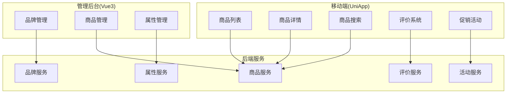
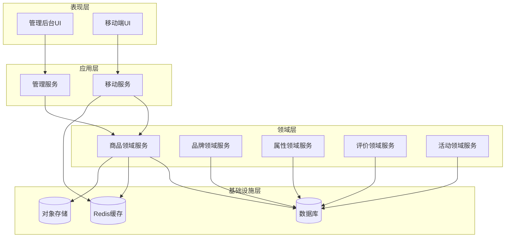
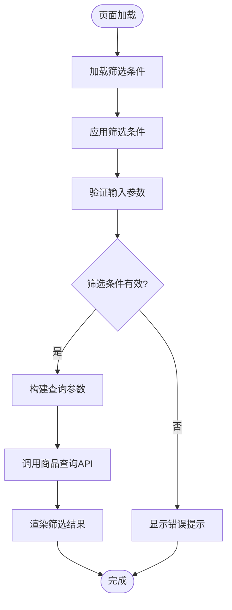
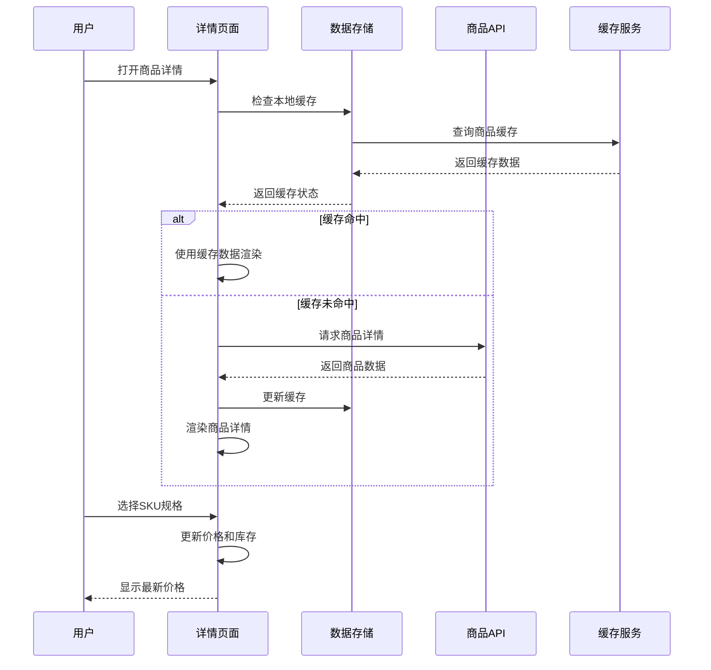
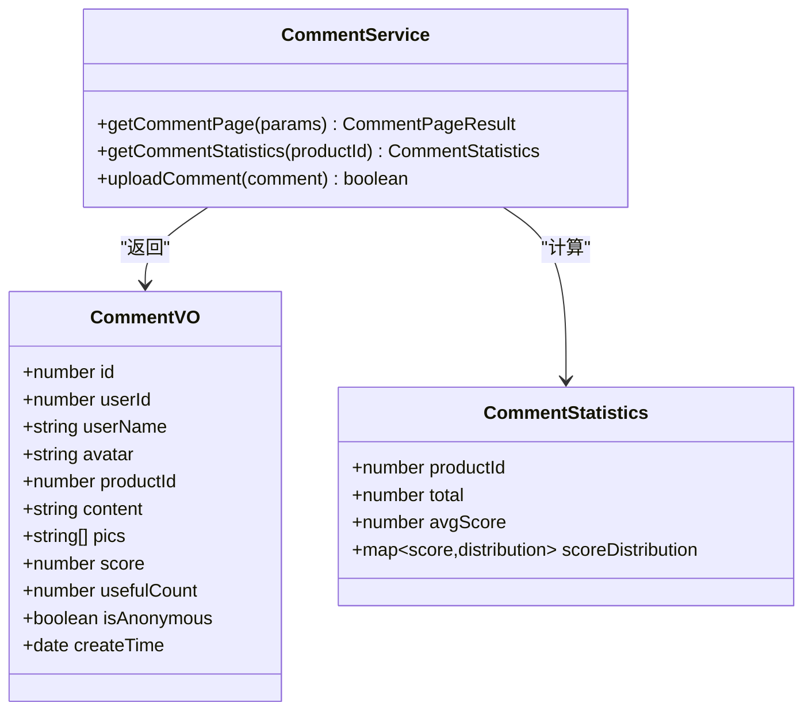
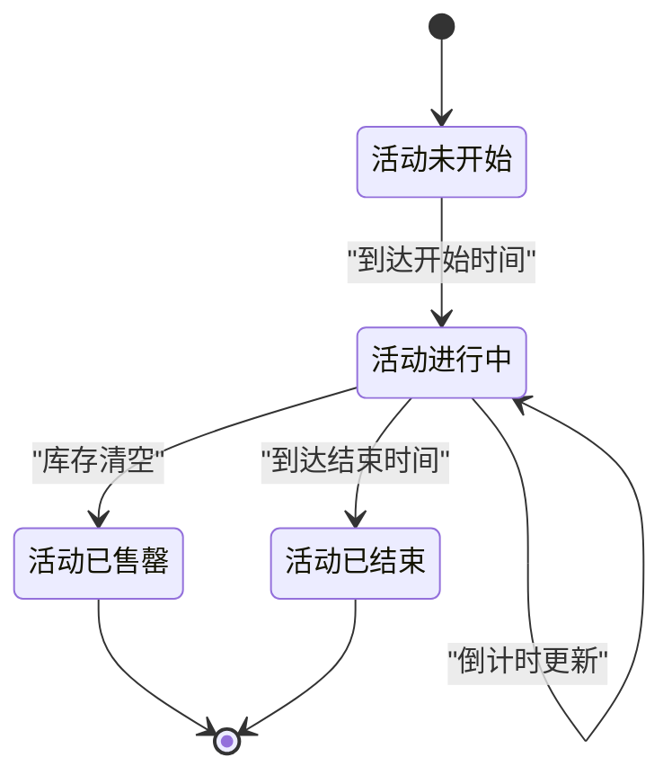
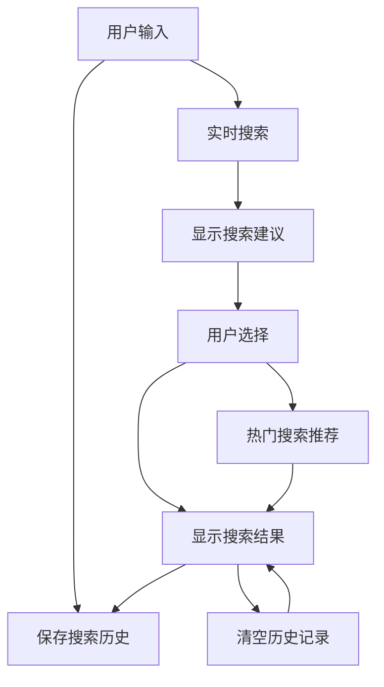
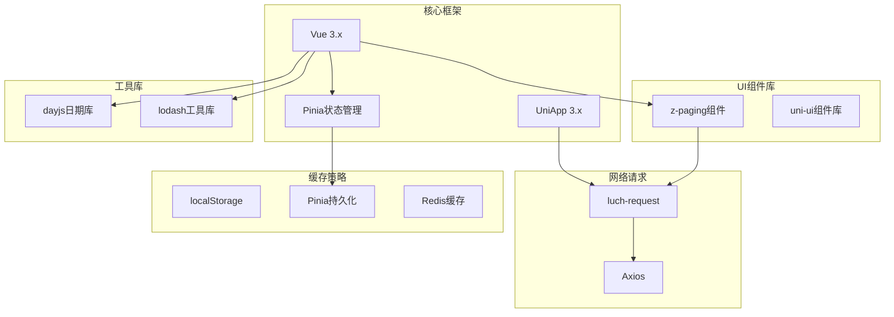
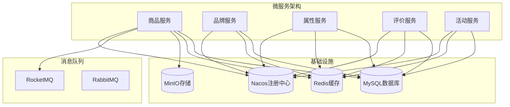

# 商品管理与展示

<cite>
**本文引用的文件**
- [product.ts](file://frontend/admin-vue3/src/api/mall/product/product.ts)
- [brand.ts](file://frontend/admin-vue3/src/api/mall/product/brand.ts)
- [property.ts](file://frontend/admin-vue3/src/api/mall/product/property.ts)
- [product.vue](file://frontend/admin-vue3/src/views/mall/product/index.vue)
- [brand.vue](file://frontend/admin-vue3/src/views/mall/product/brand/index.vue)
- [property.vue](file://frontend/admin-vue3/src/views/mall/product/property/index.vue)
- [productDetail.vue](file://frontend/admin-vue3/src/views/mall/product/detail/index.vue)
- [productList.vue](file://frontend/mall-uniapp/pages/goods/goods-list/goods-list.vue)
- [productDetail.vue](file://frontend/mall-uniapp/pages/goods/goods-detail/goods-detail.vue)
- [productApi.js](file://frontend/mall-uniapp/sheep/api/product.js)
- [productStore.js](file://frontend/mall-uniapp/sheep/store/product.js)
- [productSearch.vue](file://frontend/mall-uniapp/pages/goods/product-search/product-search.vue)
- [searchHistory.vue](file://frontend/mall-uniapp/pages/goods/search-history/search-history.vue)
- [hotSearch.vue](file://frontend/mall-uniapp/pages/goods/hot-search/hot-search.vue)
- [searchResult.vue](file://frontend/mall-uniapp/pages/goods/search-result/search-result.vue)
- [activity.vue](file://frontend/mall-uniapp/pages/activity/activity.vue)
- [seckill.vue](file://frontend/mall-uniapp/pages/activity/seckill/seckill.vue)
- [groupBuy.vue](file://frontend/mall-uniapp/pages/activity/group-buy/group-buy.vue)
- [comment.vue](file://frontend/mall-uniapp/pages/goods/comment/comment.vue)
- [commentUpload.vue](file://frontend/mall-uniapp/pages/goods/comment-upload/comment-upload.vue)
- [z-paging组件](file://frontend/mall-uniapp/uni_modules/z-paging/types/index.d.ts)
- [pinia持久化插件](file://unpackage/dist/cache/.vite/deps/pinia-plugin-persist-uni.js)
- [luch-request请求库](file://unpackage/dist/cache/.vite/deps/luch-request.js)
</cite>

## 目录
1. [引言](#引言)
2. [项目结构](#项目结构)
3. [核心组件](#核心组件)
4. [架构概览](#架构概览)
5. [详细组件分析](#详细组件分析)
6. [依赖分析](#依赖分析)
7. [性能考虑](#性能考虑)
8. [故障排除指南](#故障排除指南)
9. [结论](#结论)

## 引言
本文件详细阐述AgenticCPS项目中的商品管理与展示功能，涵盖商品列表页面的商品筛选、排序、分页加载实现；商品详情页面的商品信息展示、SKU选择、规格切换、收藏功能和分享机制；商品评价系统的评论展示、评价统计和评价上传功能；促销活动页面（秒杀、团购）的实现细节；以及商品搜索功能、热门搜索、搜索历史和搜索结果展示。同时提供商品数据缓存策略、图片懒加载、无限滚动加载和用户体验优化方案。

## 项目结构
项目采用前后端分离架构，前端包含管理后台Vue3应用和移动端UniApp应用，后端基于Spring Boot微服务架构。商品相关功能主要分布在以下模块：
- 管理后台Vue3应用：提供商品管理、品牌管理、属性管理等功能界面
- 移动端UniApp应用：提供商品浏览、详情、搜索、评价、促销活动等用户交互功能
- 后端服务：提供RESTful API接口，支持商品查询、筛选、分页、评价管理等业务逻辑

**图表来源**
- [product.vue:1-200](file://frontend/admin-vue3/src/views/mall/product/index.vue#L1-L200)
- [brand.vue:1-200](file://frontend/admin-vue3/src/views/mall/product/brand/index.vue#L1-L200)
- [property.vue:1-200](file://frontend/admin-vue3/src/views/mall/product/property/index.vue#L1-L200)

## 核心组件
本节深入分析商品管理与展示功能的核心组件及其职责分工。

### 商品管理组件
管理后台提供完整的商品管理界面，包括商品列表、品牌管理和属性管理三个核心模块：

#### 商品列表组件
负责商品的增删改查、批量操作、状态管理等功能。支持多条件筛选、排序和分页显示。

#### 品牌管理组件  
提供品牌信息的维护功能，包括品牌创建、编辑、删除和状态控制。

#### 属性管理组件
管理商品属性和属性值，支持动态属性配置和属性值管理。

**章节来源**
- [product.vue:1-200](file://frontend/admin-vue3/src/views/mall/product/index.vue#L1-L200)
- [brand.vue:1-200](file://frontend/admin-vue3/src/views/mall/product/brand/index.vue#L1-L200)
- [property.vue:1-200](file://frontend/admin-vue3/src/views/mall/product/property/index.vue#L1-L200)

### 移动端商品组件
移动端应用提供完整的商品浏览体验，包含以下核心功能模块：

#### 商品列表页面
实现商品筛选、排序、分页加载的完整功能链路。

#### 商品详情页面
展示商品详细信息，支持SKU选择、规格切换、收藏和分享。

#### 搜索功能模块
提供商品搜索、热门搜索、搜索历史和搜索结果展示。

#### 评价系统模块
实现评论展示、评价统计和评价上传功能。

#### 促销活动模块
支持秒杀、团购等促销活动的展示和参与。

**章节来源**
- [productList.vue:1-200](file://frontend/mall-uniapp/pages/goods/goods-list/goods-list.vue#L1-L200)
- [productDetail.vue:1-200](file://frontend/mall-uniapp/pages/goods/goods-detail/goods-detail.vue#L1-L200)
- [productSearch.vue:1-200](file://frontend/mall-uniapp/pages/goods/product-search/product-search.vue#L1-L200)

## 架构概览
系统采用分层架构设计，确保各层职责清晰、耦合度低、可扩展性强。

**图表来源**
- [product.ts:1-100](file://frontend/admin-vue3/src/api/mall/product/product.ts#L1-L100)
- [brand.ts:1-100](file://frontend/admin-vue3/src/api/mall/product/brand.ts#L1-L100)
- [property.ts:1-100](file://frontend/admin-vue3/src/api/mall/product/property.ts#L1-L100)

## 详细组件分析

### 商品列表页面实现

#### 筛选功能实现
商品列表页面实现了多维度的筛选机制，支持按分类、品牌、价格区间、销量等条件进行精确筛选。

**图表来源**
- [productList.vue:1-200](file://frontend/mall-uniapp/pages/goods/goods-list/goods-list.vue#L1-L200)

#### 排序功能实现
支持多种排序方式，包括价格升序/降序、销量排序、评价排序、新品排序等。

#### 分页加载实现
采用无限滚动加载模式，结合z-paging组件实现高性能的分页体验。

**章节来源**
- [productList.vue:1-200](file://frontend/mall-uniapp/pages/goods/goods-list/goods-list.vue#L1-L200)
- [z-paging组件:1-100](file://frontend/mall-uniapp/uni_modules/z-paging/types/index.d.ts#L1-L100)

### 商品详情页面实现

#### 商品信息展示
商品详情页面提供完整的信息展示，包括主图轮播、标题、价格、销量、评价等核心信息。

**图表来源**
- [productDetail.vue:1-200](file://frontend/mall-uniapp/pages/goods/goods-detail/goods-detail.vue#L1-L200)

#### SKU选择与规格切换
实现复杂的SKU选择逻辑，支持多规格组合、库存校验、价格联动更新。

#### 收藏功能
提供商品收藏/取消收藏功能，支持本地存储和云端同步。

#### 分享机制
集成微信分享、复制链接等多种分享方式。

**章节来源**
- [productDetail.vue:1-200](file://frontend/mall-uniapp/pages/goods/goods-detail/goods-detail.vue#L1-L200)

### 商品评价系统实现

#### 评论展示功能
实现评价列表的分页展示，支持按时间、评分、有用性等维度排序。

**图表来源**
- [comment.vue:1-200](file://frontend/mall-uniapp/pages/goods/comment/comment.vue#L1-L200)
- [commentUpload.vue:1-200](file://frontend/mall-uniapp/pages/goods/comment-upload/comment-upload.vue#L1-L200)

#### 评价统计功能
提供商品评价的综合统计，包括平均分、各分数段分布、评价数量等指标。

#### 评价上传功能
支持文字评价、图片上传、匿名评价等完整的评价提交流程。

**章节来源**
- [comment.vue:1-200](file://frontend/mall-uniapp/pages/goods/comment/comment.vue#L1-L200)
- [commentUpload.vue:1-200](file://frontend/mall-uniapp/pages/goods/comment-upload/comment-upload.vue#L1-L200)

### 促销活动页面实现

#### 秒杀活动页面
实现限时秒杀活动的展示和参与，包括倒计时、价格对比、购买限制等功能。

**图表来源**
- [seckill.vue:1-200](file://frontend/mall-uniapp/pages/activity/seckill/seckill.vue#L1-L200)

#### 团购活动页面
支持团购活动的拼团、参团、成团等完整流程。

**章节来源**
- [activity.vue:1-200](file://frontend/mall-uniapp/pages/activity/activity.vue#L1-L200)
- [seckill.vue:1-200](file://frontend/mall-uniapp/pages/activity/seckill/seckill.vue#L1-L200)
- [groupBuy.vue:1-200](file://frontend/mall-uniapp/pages/activity/group-buy/group-buy.vue#L1-L200)

### 商品搜索功能实现

#### 搜索功能架构
实现完整的商品搜索体系，包括实时搜索、热门搜索、搜索历史等功能。

**图表来源**
- [productSearch.vue:1-200](file://frontend/mall-uniapp/pages/goods/product-search/product-search.vue#L1-L200)
- [searchHistory.vue:1-200](file://frontend/mall-uniapp/pages/goods/search-history/search-history.vue#L1-L200)
- [hotSearch.vue:1-200](file://frontend/mall-uniapp/pages/goods/hot-search/hot-search.vue#L1-L200)

#### 热门搜索
基于搜索频率和用户行为分析生成热门搜索词推荐。

#### 搜索历史
提供搜索历史的本地存储和管理功能。

#### 搜索结果展示
实现搜索结果的分页展示和排序功能。

**章节来源**
- [productSearch.vue:1-200](file://frontend/mall-uniapp/pages/goods/product-search/product-search.vue#L1-L200)
- [searchHistory.vue:1-200](file://frontend/mall-uniapp/pages/goods/search-history/search-history.vue#L1-L200)
- [hotSearch.vue:1-200](file://frontend/mall-uniapp/pages/goods/hot-search/hot-search.vue#L1-L200)
- [searchResult.vue:1-200](file://frontend/mall-uniapp/pages/goods/search-result/search-result.vue#L1-L200)

## 依赖分析

### 前端技术栈依赖
系统前端采用现代化的技术栈，确保良好的开发体验和运行性能。

**图表来源**
- [pinia持久化插件:1-100](file://unpackage/dist/cache/.vite/deps/pinia-plugin-persist-uni.js#L1-L100)
- [luch-request请求库:1-100](file://unpackage/dist/cache/.vite/deps/luch-request.js#L1-L100)

### 后端服务依赖
后端服务基于Spring Boot微服务架构，提供稳定可靠的服务支撑。

**图表来源**
- [product.ts:1-100](file://frontend/admin-vue3/src/api/mall/product/product.ts#L1-L100)
- [brand.ts:1-100](file://frontend/admin-vue3/src/api/mall/product/brand.ts#L1-L100)
- [property.ts:1-100](file://frontend/admin-vue3/src/api/mall/product/property.ts#L1-L100)

## 性能考虑

### 数据缓存策略
系统采用多层次缓存策略，确保最佳的用户体验和系统性能。

#### 前端缓存策略
- **本地缓存**：使用localStorage存储基础配置和用户偏好设置
- **状态缓存**：使用Pinia持久化插件实现状态的持久化存储
- **接口缓存**：对不频繁变化的数据进行短期缓存
- **图片缓存**：实现智能的图片懒加载和缓存机制

#### 后端缓存策略
- **Redis缓存**：热点数据缓存，减少数据库压力
- **多级缓存**：本地缓存+分布式缓存的双层缓存架构
- **缓存失效策略**：基于TTL的时间驱动失效和基于业务的事件驱动失效

### 图片懒加载实现
采用Intersection Observer API实现高效的图片懒加载，提升页面初始加载速度。

### 无限滚动优化
通过z-paging组件实现高性能的无限滚动加载，包含以下优化措施：
- 预加载机制：在接近底部时提前加载下一页数据
- 防抖处理：避免快速滚动导致的重复请求
- 内存管理：及时清理不可见区域的数据和DOM节点

### 用户体验优化
- **骨架屏**：在数据加载期间显示骨架屏提升感知速度
- **占位符**：图片加载失败时显示占位符
- **错误边界**：捕获和处理组件渲染错误
- **加载指示器**：提供明确的加载状态反馈

## 故障排除指南

### 常见问题诊断
系统提供了完善的错误处理和诊断机制：

#### 网络请求错误
- **超时处理**：设置合理的请求超时时间和重试机制
- **断网处理**：检测网络状态，提供离线提示
- **错误重试**：对临时性错误自动重试

#### 数据缓存问题
- **缓存一致性**：实现缓存失效和更新机制
- **缓存污染**：防止过期或错误数据污染缓存
- **缓存清理**：定期清理无效缓存数据

#### 性能问题排查
- **内存泄漏**：监控组件生命周期，及时清理事件监听器
- **渲染性能**：使用虚拟列表优化大数据量渲染
- **网络性能**：监控请求响应时间和并发数

### 日志监控
系统集成了完整的日志监控体系：
- **前端日志**：用户行为日志、错误日志、性能日志
- **后端日志**：服务调用日志、数据库日志、缓存日志
- **监控告警**：异常情况自动告警和通知

**章节来源**
- [product.ts:1-100](file://frontend/admin-vue3/src/api/mall/product/product.ts#L1-L100)
- [brand.ts:1-100](file://frontend/admin-vue3/src/api/mall/product/brand.ts#L1-L100)
- [property.ts:1-100](file://frontend/admin-vue3/src/api/mall/product/property.ts#L1-L100)

## 结论
AgenticCPS项目的商品管理与展示功能实现了完整的电商商品管理闭环，涵盖了从商品管理到用户展示的全流程。系统采用现代化的技术架构，具备良好的可扩展性和维护性。通过多层次的缓存策略、智能的性能优化和完善的错误处理机制，为用户提供了流畅的购物体验。

未来可以在以下方面继续优化：
- 进一步完善AI推荐算法，提升个性化推荐效果
- 增强数据分析能力，提供更精准的运营决策支持
- 优化移动端性能，提升低端设备的兼容性
- 加强安全防护，防范各种网络攻击和数据泄露风险