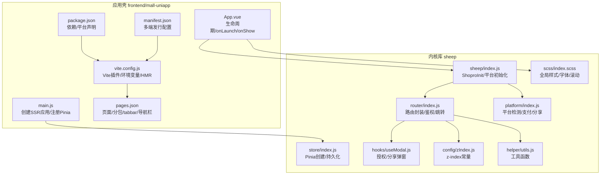
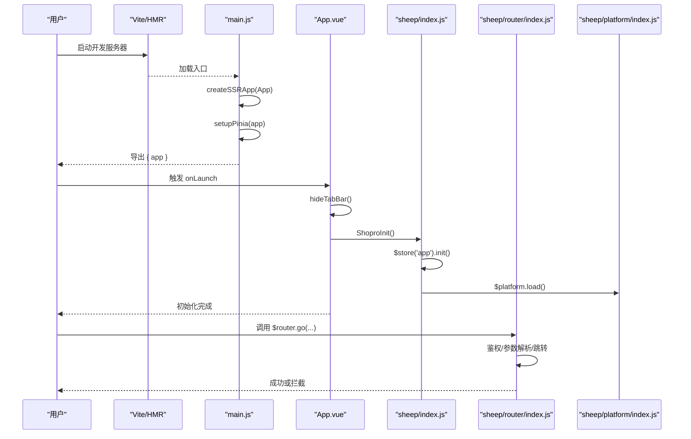
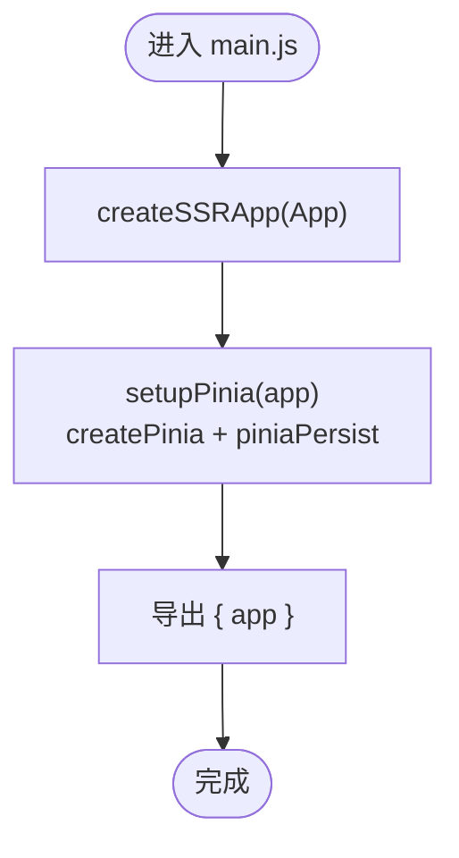
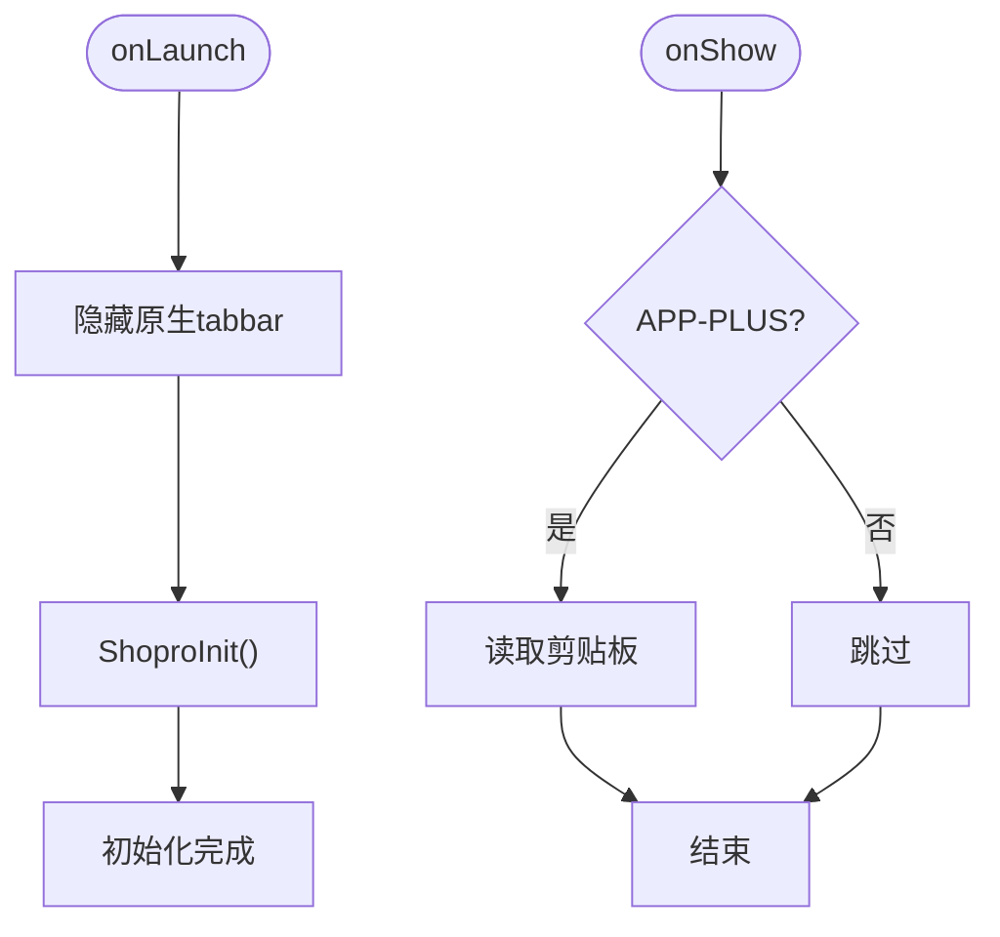
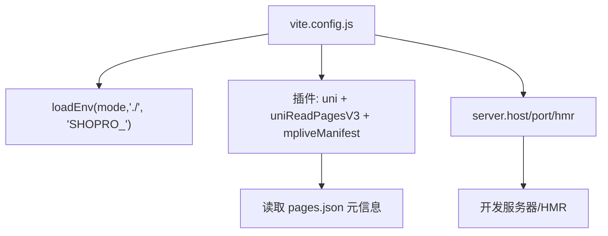
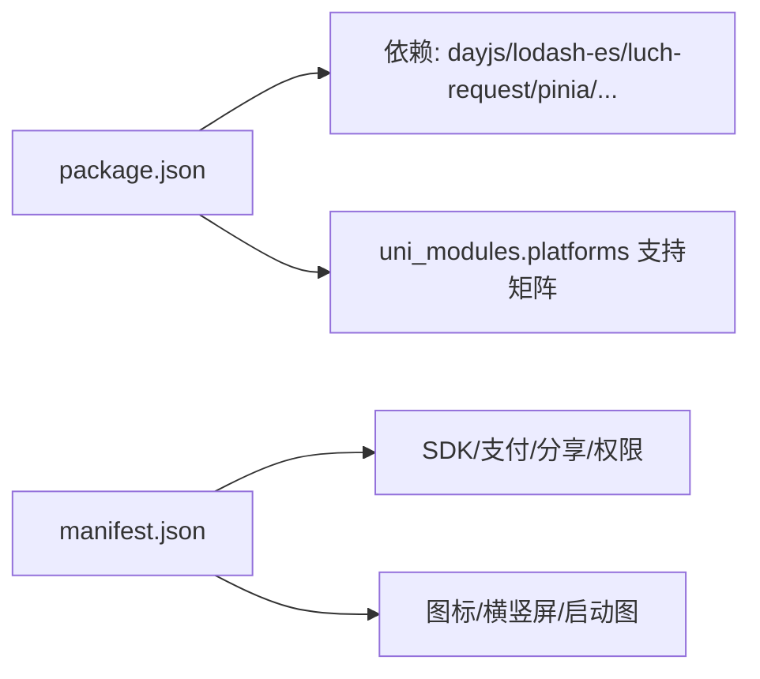
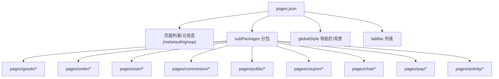
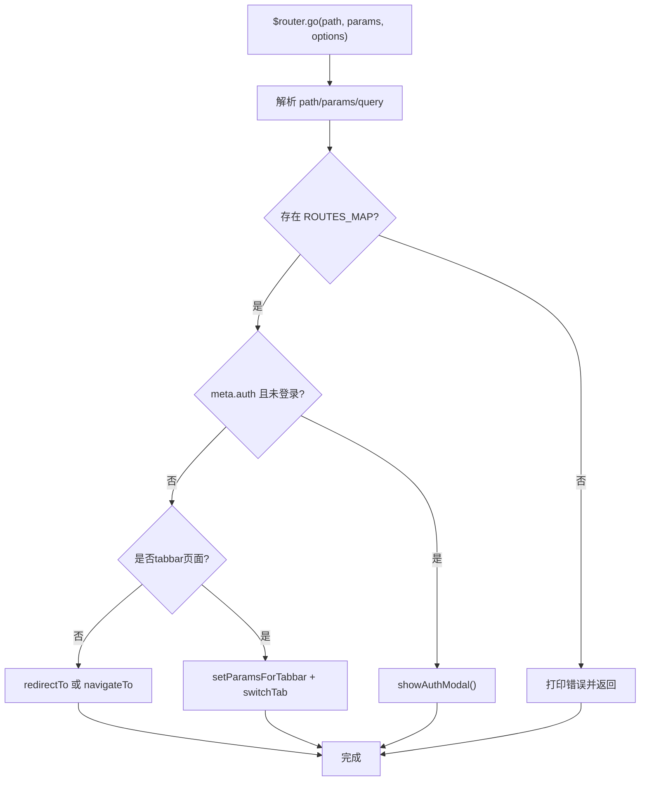
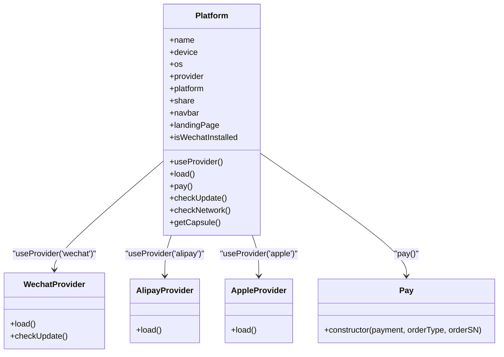
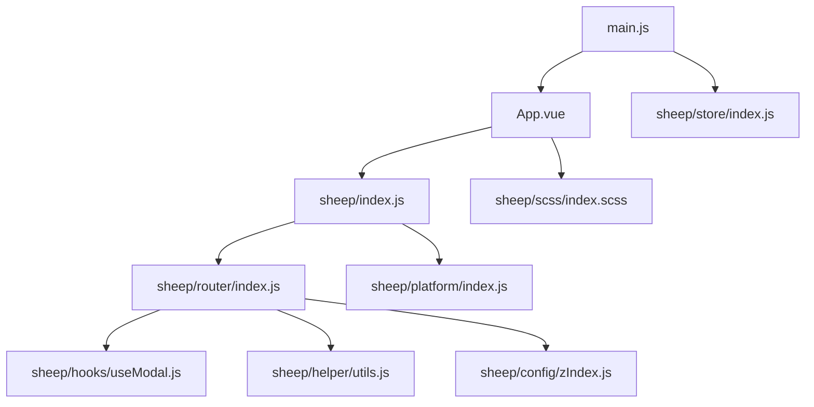

# 应用初始化与配置

<cite>
**本文引用的文件**
- [main.js](file://frontend/mall-uniapp/main.js)
- [App.vue](file://frontend/mall-uniapp/App.vue)
- [pages.json](file://frontend/mall-uniapp/pages.json)
- [vite.config.js](file://frontend/mall-uniapp/vite.config.js)
- [package.json](file://frontend/mall-uniapp/package.json)
- [manifest.json](file://frontend/mall-uniapp/manifest.json)
- [sheep/store/index.js](file://frontend/mall-uniapp/sheep/store/index.js)
- [sheep/index.js](file://frontend/mall-uniapp/sheep/index.js)
- [sheep/router/index.js](file://frontend/mall-uniapp/sheep/router/index.js)
- [sheep/platform/index.js](file://frontend/mall-uniapp/sheep/platform/index.js)
- [sheep/hooks/useModal.js](file://frontend/mall-uniapp/sheep/hooks/useModal.js)
- [sheep/scss/index.scss](file://frontend/mall-uniapp/sheep/scss/index.scss)
- [sheep/config/zIndex.js](file://frontend/mall-uniapp/sheep/config/zIndex.js)
- [sheep/helper/utils.js](file://frontend/mall-uniapp/sheep/helper/utils.js)
</cite>

## 目录
1. [简介](#简介)
2. [项目结构](#项目结构)
3. [核心组件](#核心组件)
4. [架构总览](#架构总览)
5. [详细组件分析](#详细组件分析)
6. [依赖关系分析](#依赖关系分析)
7. [性能考量](#性能考量)
8. [故障排查指南](#故障排查指南)
9. [结论](#结论)
10. [附录](#附录)

## 简介
本文件面向 UniApp 电商客户端应用，系统化梳理应用初始化与配置，覆盖以下主题：
- 应用入口 main.js 初始化流程：Vue 实例创建、插件注册、全局配置
- 根组件 App.vue 生命周期与平台能力加载
- Vite 构建配置、依赖管理与环境变量
- 页面路由 pages.json 配置、导航栏与 tabbar、分包策略
- 应用启动流程、错误处理机制、国际化与主题定制
- 开发与生产环境最佳实践、跨平台兼容性处理

## 项目结构
该电商客户端采用“应用壳 + 内核库”架构：
- 应用壳位于 frontend/mall-uniapp，负责运行时初始化、构建配置与页面路由
- 内核库 sheep 提供统一 API、路由封装、平台能力抽象、状态管理等

图表来源
- [main.js:1-16](file://frontend/mall-uniapp/main.js#L1-L16)
- [sheep/store/index.js:1-21](file://frontend/mall-uniapp/sheep/store/index.js#L1-L21)
- [App.vue:1-33](file://frontend/mall-uniapp/App.vue#L1-L33)
- [sheep/index.js:1-53](file://frontend/mall-uniapp/sheep/index.js#L1-L53)
- [sheep/router/index.js:1-204](file://frontend/mall-uniapp/sheep/router/index.js#L1-L204)
- [sheep/platform/index.js:1-193](file://frontend/mall-uniapp/sheep/platform/index.js#L1-L193)
- [pages.json:1-704](file://frontend/mall-uniapp/pages.json#L1-L704)
- [vite.config.js:1-35](file://frontend/mall-uniapp/vite.config.js#L1-L35)
- [package.json:1-104](file://frontend/mall-uniapp/package.json#L1-L104)
- [manifest.json:1-225](file://frontend/mall-uniapp/manifest.json#L1-L225)

章节来源
- [main.js:1-16](file://frontend/mall-uniapp/main.js#L1-L16)
- [App.vue:1-33](file://frontend/mall-uniapp/App.vue#L1-L33)
- [pages.json:1-704](file://frontend/mall-uniapp/pages.json#L1-L704)
- [vite.config.js:1-35](file://frontend/mall-uniapp/vite.config.js#L1-L35)
- [package.json:1-104](file://frontend/mall-uniapp/package.json#L1-L104)
- [manifest.json:1-225](file://frontend/mall-uniapp/manifest.json#L1-L225)

## 核心组件
- 应用入口与实例创建：通过 createSSRApp 创建 Vue 应用，注册 Pinia 并导出工厂函数，便于多端统一挂载
- 根组件生命周期：onLaunch 隐藏原生 tabbar、执行 ShoproInit；onShow 中处理剪贴板与平台参数
- 内核初始化：ShoproInit 负责应用与平台初始化，开发模式下可启用调试
- 路由与鉴权：封装跳转 go/back/redirect，支持 meta.auth 登录拦截、tabbar 特殊处理
- 平台能力：自动识别 H5/小程序/App 等平台，按需加载支付、分享、更新检查等能力
- 全局样式与主题：SCSS 全局样式、字体、滚动优化；z-index 常量统一弹层层级

章节来源
- [main.js:6-15](file://frontend/mall-uniapp/main.js#L6-L15)
- [sheep/store/index.js:11-16](file://frontend/mall-uniapp/sheep/store/index.js#L11-L16)
- [App.vue:5-27](file://frontend/mall-uniapp/App.vue#L5-L27)
- [sheep/index.js:28-38](file://frontend/mall-uniapp/sheep/index.js#L28-L38)
- [sheep/router/index.js:6-95](file://frontend/mall-uniapp/sheep/router/index.js#L6-L95)
- [sheep/platform/index.js:78-84](file://frontend/mall-uniapp/sheep/platform/index.js#L78-L84)
- [sheep/scss/index.scss:1-28](file://frontend/mall-uniapp/sheep/scss/index.scss#L1-L28)
- [sheep/config/zIndex.js:10-20](file://frontend/mall-uniapp/sheep/config/zIndex.js#L10-L20)

## 架构总览
应用初始化的关键流程如下：

图表来源
- [main.js:6-15](file://frontend/mall-uniapp/main.js#L6-L15)
- [App.vue:5-13](file://frontend/mall-uniapp/App.vue#L5-L13)
- [sheep/index.js:28-38](file://frontend/mall-uniapp/sheep/index.js#L28-L38)
- [sheep/router/index.js:6-95](file://frontend/mall-uniapp/sheep/router/index.js#L6-L95)
- [sheep/platform/index.js:78-84](file://frontend/mall-uniapp/sheep/platform/index.js#L78-L84)

## 详细组件分析

### 应用入口 main.js 初始化流程
- 创建 SSR 应用实例并注入根组件
- 注册 Pinia，启用持久化插件，自动扫描并注册 store 模块
- 导出 createApp 工厂函数，供多端挂载

图表来源
- [main.js:6-15](file://frontend/mall-uniapp/main.js#L6-L15)
- [sheep/store/index.js:11-16](file://frontend/mall-uniapp/sheep/store/index.js#L11-L16)

章节来源
- [main.js:1-16](file://frontend/mall-uniapp/main.js#L1-L16)
- [sheep/store/index.js:1-21](file://frontend/mall-uniapp/sheep/store/index.js#L1-L21)

### 根组件 App.vue 生命周期与平台初始化
- onLaunch：隐藏原生 tabbar，调用 ShoproInit 完成应用与平台初始化
- onShow：在 APP-PLUS 下读取剪贴板等参数
- 样式：引入全局 SCSS，统一字体与滚动体验

图表来源
- [App.vue:5-27](file://frontend/mall-uniapp/App.vue#L5-L27)
- [sheep/index.js:28-38](file://frontend/mall-uniapp/sheep/index.js#L28-L38)

章节来源
- [App.vue:1-33](file://frontend/mall-uniapp/App.vue#L1-L33)
- [sheep/index.js:1-53](file://frontend/mall-uniapp/sheep/index.js#L1-L53)

### Vite 构建配置与环境变量
- 插件体系：@dcloudio/vite-plugin-uni、自研 pages 读取插件、mplive 清单插件
- 环境变量：通过 loadEnv(mode, dir, prefix) 统一前缀 SHOPRO_，支持开发端口等
- 服务器：host=true、端口来自环境变量、开启 HMR overlay
- 与 pages.json 的联动：通过 uni-read-pages-v3 插件扫描页面元信息

图表来源
- [vite.config.js:10-35](file://frontend/mall-uniapp/vite.config.js#L10-L35)
- [package.json:7-9](file://frontend/mall-uniapp/package.json#L7-L9)

章节来源
- [vite.config.js:1-35](file://frontend/mall-uniapp/vite.config.js#L1-L35)
- [package.json:1-104](file://frontend/mall-uniapp/package.json#L1-L104)

### 依赖管理与多端发行
- 依赖：dayjs/lodash-es/luch-request/pinia/pinia-plugin-persist-uni/weixin-js-sdk
- 平台声明：uni_modules.platforms 指明 App/H5/小程序/Vue 版本支持情况
- manifest.json：多端发行配置，含权限、模块、SDK、图标、方向等

图表来源
- [package.json:90-102](file://frontend/mall-uniapp/package.json#L90-L102)
- [package.json:45-88](file://frontend/mall-uniapp/package.json#L45-L88)
- [manifest.json:8-152](file://frontend/mall-uniapp/manifest.json#L8-L152)

章节来源
- [package.json:1-104](file://frontend/mall-uniapp/package.json#L1-L104)
- [manifest.json:1-225](file://frontend/mall-uniapp/manifest.json#L1-L225)

### 页面路由与分包策略
- pages.json：定义页面、分包、全局样式、导航栏与 tabbar
- 分包：goods/order/user/commission/app/public/coupon/chat/pay/activity 等
- 全局样式：导航栏文字颜色、背景色、自定义导航
- tabbar：首页/分类/购物车/我的

图表来源
- [pages.json:9-86](file://frontend/mall-uniapp/pages.json#L9-L86)
- [pages.json:87-671](file://frontend/mall-uniapp/pages.json#L87-L671)
- [pages.json:673-687](file://frontend/mall-uniapp/pages.json#L673-L687)
- [pages.json:688-702](file://frontend/mall-uniapp/pages.json#L688-L702)

章节来源
- [pages.json:1-704](file://frontend/mall-uniapp/pages.json#L1-L704)

### 路由封装与鉴权拦截
- 跳转封装：支持 path/http/action:、query 拼接、redirectTo/navigateTo
- 登录拦截：根据 meta.auth 与用户登录态决定是否弹出授权
- tabbar 特殊处理：wx.switchTab 不支持 query，通过全局状态传递参数
- 错误页跳转：error(errCode, errMsg) 统一跳转至错误页

图表来源
- [sheep/router/index.js:6-95](file://frontend/mall-uniapp/sheep/router/index.js#L6-L95)
- [sheep/hooks/useModal.js:9-25](file://frontend/mall-uniapp/sheep/hooks/useModal.js#L9-L25)

章节来源
- [sheep/router/index.js:1-204](file://frontend/mall-uniapp/sheep/router/index.js#L1-L204)
- [sheep/hooks/useModal.js:1-143](file://frontend/mall-uniapp/sheep/hooks/useModal.js#L1-L143)

### 平台能力与支付/分享
- 平台识别：H5/小程序/App 自动区分，按平台加载不同 provider
- 支付：Pay 类封装，统一支付入口
- 分享：统一分享接口
- 网络检查：异步获取网络状态
- 安全区域与胶囊：提供胶囊信息与安全区适配

图表来源
- [sheep/platform/index.js:78-193](file://frontend/mall-uniapp/sheep/platform/index.js#L78-L193)

章节来源
- [sheep/platform/index.js:1-193](file://frontend/mall-uniapp/sheep/platform/index.js#L1-L193)

### 全局样式与主题定制
- SCSS 全局样式：字体声明、page 样式、滚动条隐藏、背景色与文字色
- z-index 常量：toast/modal/popup/mask/navbar 等层级统一管理
- 导航栏样式：全局样式中设置导航栏文字颜色、标题、背景与自定义样式

章节来源
- [sheep/scss/index.scss:1-28](file://frontend/mall-uniapp/sheep/scss/index.scss#L1-L28)
- [pages.json:673-687](file://frontend/mall-uniapp/pages.json#L673-L687)
- [sheep/config/zIndex.js:10-20](file://frontend/mall-uniapp/sheep/config/zIndex.js#L10-L20)

### 国际化与本地化
- 语言设置：manifest.json locale/fallbackLocale 指定简体中文
- 日期本地化：dayjs 在 sheep/index.js 中扩展 zh-cn 与相对时间、时长插件
- 建议：如需多语言，可在 store 中维护语言切换逻辑，并结合 dayjs 的 locale 切换

章节来源
- [manifest.json:222-224](file://frontend/mall-uniapp/manifest.json#L222-L224)
- [sheep/index.js:8-15](file://frontend/mall-uniapp/sheep/index.js#L8-L15)

## 依赖关系分析
- 入口依赖：main.js 依赖 App.vue 与 sheep/store
- 根组件依赖：App.vue 依赖 sheep/index.js 与全局 SCSS
- 内核依赖：sheep/index.js 依赖 store/router/platform
- 路由依赖：sheep/router/index.js 依赖 store/hooks/useModal/utils
- 平台依赖：sheep/platform/index.js 依赖各 provider 与 share/pay

图表来源
- [main.js:1-16](file://frontend/mall-uniapp/main.js#L1-L16)
- [App.vue:1-33](file://frontend/mall-uniapp/App.vue#L1-L33)
- [sheep/index.js:1-53](file://frontend/mall-uniapp/sheep/index.js#L1-L53)
- [sheep/router/index.js:1-204](file://frontend/mall-uniapp/sheep/router/index.js#L1-L204)
- [sheep/platform/index.js:1-193](file://frontend/mall-uniapp/sheep/platform/index.js#L1-L193)
- [sheep/hooks/useModal.js:1-143](file://frontend/mall-uniapp/sheep/hooks/useModal.js#L1-L143)
- [sheep/helper/utils.js:1-337](file://frontend/mall-uniapp/sheep/helper/utils.js#L1-L337)
- [sheep/scss/index.scss:1-28](file://frontend/mall-uniapp/sheep/scss/index.scss#L1-L28)
- [sheep/config/zIndex.js:10-20](file://frontend/mall-uniapp/sheep/config/zIndex.js#L10-L20)

章节来源
- [main.js:1-16](file://frontend/mall-uniapp/main.js#L1-L16)
- [sheep/store/index.js:1-21](file://frontend/mall-uniapp/sheep/store/index.js#L1-L21)
- [sheep/index.js:1-53](file://frontend/mall-uniapp/sheep/index.js#L1-L53)

## 性能考量
- 分包策略：按业务域拆分子包，减少首屏体积，提升加载速度
- 资源优化：H5 tree-shaking、小程序分包加载、按需引入 vconsole（注释）
- 状态持久化：Pinia + pinia-plugin-persist-uni，减少重复请求
- 路由跳转节流：go 函数内部使用节流，防止重复点击导致的路由异常
- 样式与滚动：全局滚动优化与字体预加载，改善移动端体验

章节来源
- [pages.json:87-671](file://frontend/mall-uniapp/pages.json#L87-L671)
- [sheep/store/index.js:12-13](file://frontend/mall-uniapp/sheep/store/index.js#L12-L13)
- [sheep/router/index.js:98-102](file://frontend/mall-uniapp/sheep/router/index.js#L98-L102)
- [sheep/scss/index.scss:12-27](file://frontend/mall-uniapp/sheep/scss/index.scss#L12-L27)

## 故障排查指南
- 启动失败
  - 检查 Vite 端口与 host 配置，确保未被占用
  - 确认环境变量前缀与变量名一致（SHOPRO_）
- 页面无法显示/跳转异常
  - 核对 pages.json 中的 path 与 aliasPath 是否与路由映射一致
  - 检查 meta.auth 与用户登录态，必要时调用授权弹窗
- tabbar 参数丢失
  - 确认通过 setParamsForTabbar 设置参数并在业务完成后清理
- 平台能力不可用
  - 检查平台识别逻辑与 provider 加载顺序
  - 确认 manifest.json 中对应 SDK/权限已配置
- 样式异常
  - 检查全局 SCSS 引入顺序与 z-index 层级冲突
- 国际化问题
  - 确认 dayjs locale 已扩展，语言设置与 fallbackLocale 正确

章节来源
- [vite.config.js:25-32](file://frontend/mall-uniapp/vite.config.js#L25-L32)
- [pages.json:2-8](file://frontend/mall-uniapp/pages.json#L2-L8)
- [sheep/router/index.js:72-82](file://frontend/mall-uniapp/sheep/router/index.js#L72-L82)
- [sheep/platform/index.js:78-84](file://frontend/mall-uniapp/sheep/platform/index.js#L78-L84)
- [sheep/scss/index.scss:1-28](file://frontend/mall-uniapp/sheep/scss/index.scss#L1-L28)
- [sheep/index.js:8-15](file://frontend/mall-uniapp/sheep/index.js#L8-L15)

## 结论
本应用通过清晰的入口初始化、完善的内核库封装与规范的路由/分包策略，实现了跨平台的一致体验。建议在后续迭代中：
- 补充国际化文案与资源管理
- 增强错误监控与埋点上报
- 优化首屏加载与缓存策略
- 持续完善平台能力与第三方 SDK 集成

## 附录
- 开发环境
  - 使用 Vite 开发服务器，端口与 HMR 由环境变量控制
  - 可选 vconsole（注释）用于 H5 调试
- 生产环境
  - 依据 manifest.json 与各平台配置进行打包与发布
  - 建议开启代码压缩与资源懒加载（按需启用）
- 跨平台兼容
  - 通过条件编译与平台检测适配差异
  - 注意各平台导航栏、胶囊、安全区与权限差异