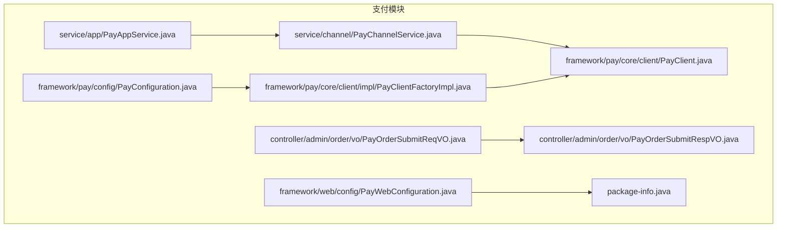
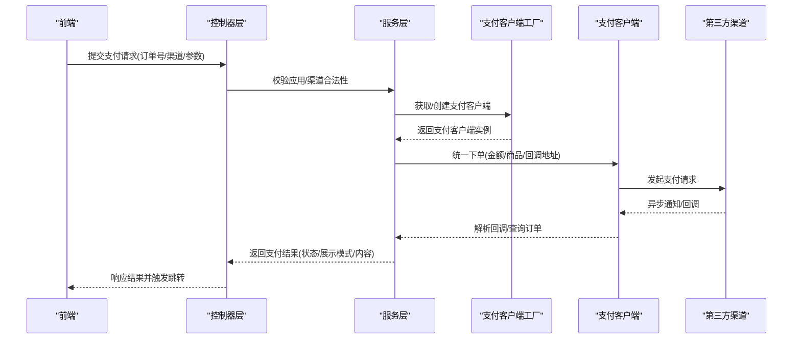
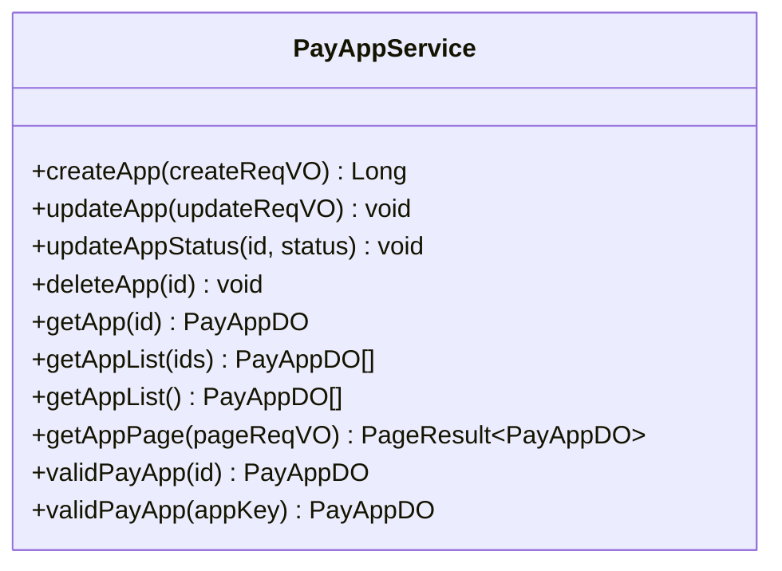
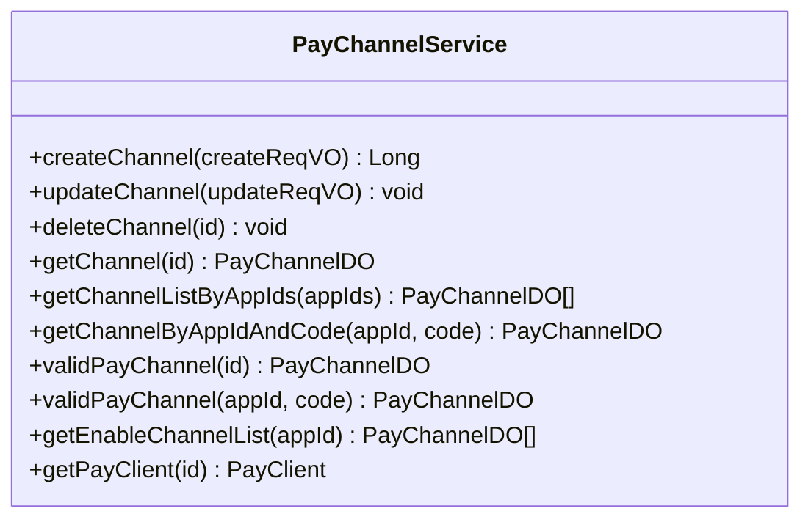
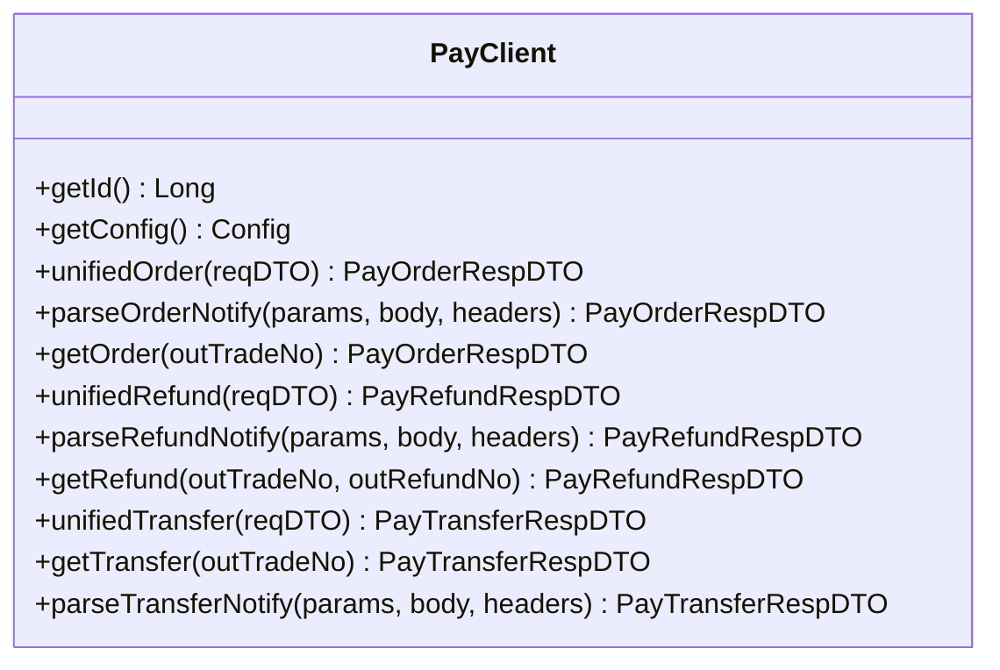
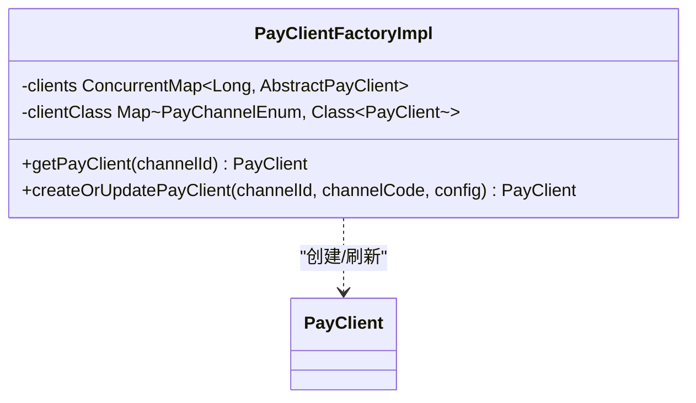
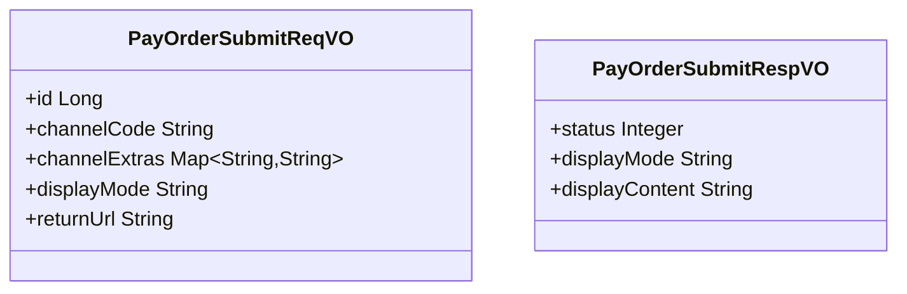
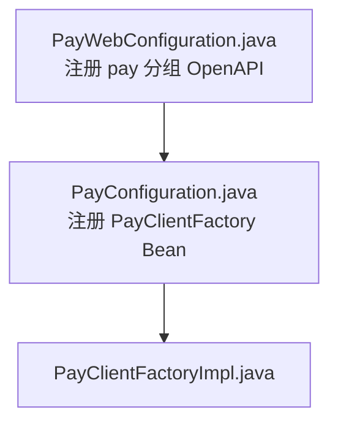
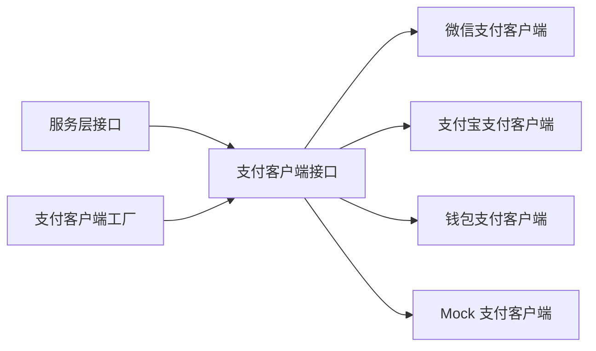
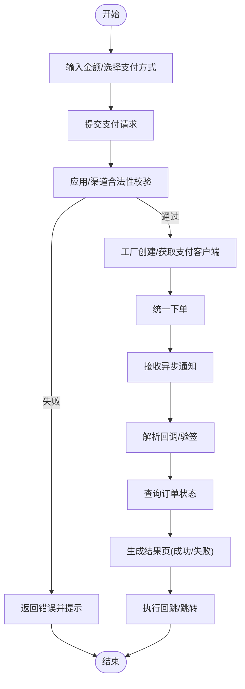

# 支付集成

<cite>
**本文引用的文件**
- [PayAppService.java](file://backend/yudao-module-pay/src/main/java/cn/iocoder/yudao/module/pay/service/app/PayAppService.java)
- [PayChannelService.java](file://backend/yudao-module-pay/src/main/java/cn/iocoder/yudao/module/pay/service/channel/PayChannelService.java)
- [PayClient.java](file://backend/yudao-module-pay/src/main/java/cn/iocoder/yudao/module/pay/framework/pay/core/client/PayClient.java)
- [PayClientFactoryImpl.java](file://backend/yudao-module-pay/src/main/java/cn/iocoder/yudao/module/pay/framework/pay/core/client/impl/PayClientFactoryImpl.java)
- [PayOrderSubmitReqVO.java](file://backend/yudao-module-pay/src/main/java/cn/iocoder/yudao/module/pay/controller/admin/order/vo/PayOrderSubmitReqVO.java)
- [PayOrderSubmitRespVO.java](file://backend/yudao-module-pay/src/main/java/cn/iocoder/yudao/module/pay/controller/admin/order/vo/PayOrderSubmitRespVO.java)
- [PayWebConfiguration.java](file://backend/yudao-module-pay/src/main/java/cn/iocoder/yudao/module/pay/framework/web/config/PayWebConfiguration.java)
- [PayConfiguration.java](file://backend/yudao-module-pay/src/main/java/cn/iocoder/yudao/module/pay/framework/pay/config/PayConfiguration.java)
- [package-info.java](file://backend/yudao-module-pay/src/main/java/cn/iocoder/yudao/module/pay/package-info.java)
</cite>

## 目录
1. [简介](#简介)
2. [项目结构](#项目结构)
3. [核心组件](#核心组件)
4. [架构总览](#架构总览)
5. [详细组件分析](#详细组件分析)
6. [依赖分析](#依赖分析)
7. [性能考虑](#性能考虑)
8. [故障排查指南](#故障排查指南)
9. [结论](#结论)
10. [附录](#附录)

## 简介
本文件面向支付集成场景，系统性梳理支付页面的支付方式选择、金额输入与支付确认流程；解释支付结果页面的成功/失败展示、跳转逻辑与错误处理机制；文档化平台支付接口的封装、微信支付与支付宝支付等第三方支付渠道的集成；覆盖支付安全验证、签名算法、回调处理与异步通知机制；解释支付状态查询、支付记录管理与退款流程；并提供支付异常处理、网络重试、用户取消支付的处理方案与用户体验优化策略。

## 项目结构
支付模块位于后端 yudao-module-pay，采用按职责分层与按功能域划分相结合的组织方式：
- service 层：应用与渠道服务接口，负责业务编排与校验
- framework 支付框架：支付客户端抽象、工厂、配置与 Web 分组
- controller/admin/order/vo：支付订单提交的请求/响应 VO
- package-info：模块命名规范与表前缀约定

**图表来源**
- [PayAppService.java:1-116](file://backend/yudao-module-pay/src/main/java/cn/iocoder/yudao/module/pay/service/app/PayAppService.java#L1-L116)
- [PayChannelService.java:1-105](file://backend/yudao-module-pay/src/main/java/cn/iocoder/yudao/module/pay/service/channel/PayChannelService.java#L1-L105)
- [PayClient.java:1-119](file://backend/yudao-module-pay/src/main/java/cn/iocoder/yudao/module/pay/framework/pay/core/client/PayClient.java#L1-L119)
- [PayClientFactoryImpl.java:1-98](file://backend/yudao-module-pay/src/main/java/cn/iocoder/yudao/module/pay/framework/pay/core/client/impl/PayClientFactoryImpl.java#L1-L98)
- [PayOrderSubmitReqVO.java:1-33](file://backend/yudao-module-pay/src/main/java/cn/iocoder/yudao/module/pay/controller/admin/order/vo/PayOrderSubmitReqVO.java#L1-L33)
- [PayOrderSubmitRespVO.java:1-18](file://backend/yudao-module-pay/src/main/java/cn/iocoder/yudao/module/pay/controller/admin/order/vo/PayOrderSubmitRespVO.java#L1-L18)
- [PayWebConfiguration.java:1-24](file://backend/yudao-module-pay/src/main/java/cn/iocoder/yudao/module/pay/framework/web/config/PayWebConfiguration.java#L1-L24)
- [PayConfiguration.java:1-18](file://backend/yudao-module-pay/src/main/java/cn/iocoder/yudao/module/pay/framework/pay/config/PayConfiguration.java#L1-L18)
- [package-info.java:1-10](file://backend/yudao-module-pay/src/main/java/cn/iocoder/yudao/module/pay/package-info.java#L1-L10)

**章节来源**
- [package-info.java:1-10](file://backend/yudao-module-pay/src/main/java/cn/iocoder/yudao/module/pay/package-info.java#L1-L10)

## 核心组件
- 支付应用服务接口：负责应用维度的增删改查、分页与合法性校验
- 支付渠道服务接口：负责渠道维度的增删改查、启用列表、渠道合法性校验与支付客户端获取
- 支付客户端接口：统一定义下单、回调解析、订单查询、退款、转账等能力
- 支付客户端工厂：根据渠道类型动态创建或刷新支付客户端实例
- 订单提交请求/响应 VO：定义支付提交的输入参数与输出结构（状态、展示模式、展示内容）

**章节来源**
- [PayAppService.java:1-116](file://backend/yudao-module-pay/src/main/java/cn/iocoder/yudao/module/pay/service/app/PayAppService.java#L1-L116)
- [PayChannelService.java:1-105](file://backend/yudao-module-pay/src/main/java/cn/iocoder/yudao/module/pay/service/channel/PayChannelService.java#L1-L105)
- [PayClient.java:1-119](file://backend/yudao-module-pay/src/main/java/cn/iocoder/yudao/module/pay/framework/pay/core/client/PayClient.java#L1-L119)
- [PayClientFactoryImpl.java:1-98](file://backend/yudao-module-pay/src/main/java/cn/iocoder/yudao/module/pay/framework/pay/core/client/impl/PayClientFactoryImpl.java#L1-L98)
- [PayOrderSubmitReqVO.java:1-33](file://backend/yudao-module-pay/src/main/java/cn/iocoder/yudao/module/pay/controller/admin/order/vo/PayOrderSubmitReqVO.java#L1-L33)
- [PayOrderSubmitRespVO.java:1-18](file://backend/yudao-module-pay/src/main/java/cn/iocoder/yudao/module/pay/controller/admin/order/vo/PayOrderSubmitRespVO.java#L1-L18)

## 架构总览
支付集成采用“服务编排 + 客户端抽象 + 工厂动态创建”的分层架构：
- 控制器层通过 VO 接收支付提交请求，调用服务层完成应用/渠道校验与合法性检查
- 服务层根据渠道编码选择对应支付客户端，统一发起支付
- 支付客户端对接具体第三方 SDK，完成下单、回调解析与订单查询
- 结果通过统一响应 VO 返回给前端，前端据此渲染支付结果页与跳转

**图表来源**
- [PayOrderSubmitReqVO.java:1-33](file://backend/yudao-module-pay/src/main/java/cn/iocoder/yudao/module/pay/controller/admin/order/vo/PayOrderSubmitReqVO.java#L1-L33)
- [PayOrderSubmitRespVO.java:1-18](file://backend/yudao-module-pay/src/main/java/cn/iocoder/yudao/module/pay/controller/admin/order/vo/PayOrderSubmitRespVO.java#L1-L18)
- [PayChannelService.java:1-105](file://backend/yudao-module-pay/src/main/java/cn/iocoder/yudao/module/pay/service/channel/PayChannelService.java#L1-L105)
- [PayClientFactoryImpl.java:1-98](file://backend/yudao-module-pay/src/main/java/cn/iocoder/yudao/module/pay/framework/pay/core/client/impl/PayClientFactoryImpl.java#L1-L98)
- [PayClient.java:1-119](file://backend/yudao-module-pay/src/main/java/cn/iocoder/yudao/module/pay/framework/pay/core/client/PayClient.java#L1-L119)

## 详细组件分析

### 支付应用服务（应用维度）
- 职责：应用的创建、更新、状态变更、删除、查询、分页与合法性校验
- 关键点：合法性校验在业务异常中抛出，保证上层调用的安全性

**图表来源**
- [PayAppService.java:1-116](file://backend/yudao-module-pay/src/main/java/cn/iocoder/yudao/module/pay/service/app/PayAppService.java#L1-L116)

**章节来源**
- [PayAppService.java:1-116](file://backend/yudao-module-pay/src/main/java/cn/iocoder/yudao/module/pay/service/app/PayAppService.java#L1-L116)

### 支付渠道服务（渠道维度）
- 职责：渠道的创建、更新、删除、查询、按应用筛选、启用列表、合法性校验、获取支付客户端
- 关键点：支持按应用与渠道编码精确匹配；提供启用渠道列表；通过工厂获取支付客户端

**图表来源**
- [PayChannelService.java:1-105](file://backend/yudao-module-pay/src/main/java/cn/iocoder/yudao/module/pay/service/channel/PayChannelService.java#L1-L105)

**章节来源**
- [PayChannelService.java:1-105](file://backend/yudao-module-pay/src/main/java/cn/iocoder/yudao/module/pay/service/channel/PayChannelService.java#L1-L105)

### 支付客户端接口（统一抽象）
- 职责：统一定义支付下单、回调解析、订单查询、退款、转账等能力
- 关键点：回调解析接收参数、Body、Headers，便于适配不同渠道的签名与验签

**图表来源**
- [PayClient.java:1-119](file://backend/yudao-module-pay/src/main/java/cn/iocoder/yudao/module/pay/framework/pay/core/client/PayClient.java#L1-L119)

**章节来源**
- [PayClient.java:1-119](file://backend/yudao-module-pay/src/main/java/cn/iocoder/yudao/module/pay/framework/pay/core/client/PayClient.java#L1-L119)

### 支付客户端工厂（动态创建）
- 职责：根据渠道编码映射到具体支付客户端类，支持初始化与刷新
- 关键点：内置微信支付、支付宝支付、钱包支付与 Mock 支付客户端映射

**图表来源**
- [PayClientFactoryImpl.java:1-98](file://backend/yudao-module-pay/src/main/java/cn/iocoder/yudao/module/pay/framework/pay/core/client/impl/PayClientFactoryImpl.java#L1-L98)

**章节来源**
- [PayClientFactoryImpl.java:1-98](file://backend/yudao-module-pay/src/main/java/cn/iocoder/yudao/module/pay/framework/pay/core/client/impl/PayClientFactoryImpl.java#L1-L98)

### 订单提交请求/响应 VO（前端交互）
- 请求 VO：包含支付单编号、支付渠道编码、渠道额外参数、展示模式、回跳地址
- 响应 VO：包含支付状态、展示模式、展示内容

**图表来源**
- [PayOrderSubmitReqVO.java:1-33](file://backend/yudao-module-pay/src/main/java/cn/iocoder/yudao/module/pay/controller/admin/order/vo/PayOrderSubmitReqVO.java#L1-L33)
- [PayOrderSubmitRespVO.java:1-18](file://backend/yudao-module-pay/src/main/java/cn/iocoder/yudao/module/pay/controller/admin/order/vo/PayOrderSubmitRespVO.java#L1-L18)

**章节来源**
- [PayOrderSubmitReqVO.java:1-33](file://backend/yudao-module-pay/src/main/java/cn/iocoder/yudao/module/pay/controller/admin/order/vo/PayOrderSubmitReqVO.java#L1-L33)
- [PayOrderSubmitRespVO.java:1-18](file://backend/yudao-module-pay/src/main/java/cn/iocoder/yudao/module/pay/controller/admin/order/vo/PayOrderSubmitRespVO.java#L1-L18)

### Web 与配置（模块暴露与 Bean 注册）
- Web 配置：为支付模块注册 OpenAPI 分组
- 支付配置：注册支付客户端工厂 Bean

**图表来源**
- [PayWebConfiguration.java:1-24](file://backend/yudao-module-pay/src/main/java/cn/iocoder/yudao/module/pay/framework/web/config/PayWebConfiguration.java#L1-L24)
- [PayConfiguration.java:1-18](file://backend/yudao-module-pay/src/main/java/cn/iocoder/yudao/module/pay/framework/pay/config/PayConfiguration.java#L1-L18)
- [PayClientFactoryImpl.java:1-98](file://backend/yudao-module-pay/src/main/java/cn/iocoder/yudao/module/pay/framework/pay/core/client/impl/PayClientFactoryImpl.java#L1-L98)

**章节来源**
- [PayWebConfiguration.java:1-24](file://backend/yudao-module-pay/src/main/java/cn/iocoder/yudao/module/pay/framework/web/config/PayWebConfiguration.java#L1-L24)
- [PayConfiguration.java:1-18](file://backend/yudao-module-pay/src/main/java/cn/iocoder/yudao/module/pay/framework/pay/config/PayConfiguration.java#L1-L18)

## 依赖分析
- 低耦合高内聚：服务层仅依赖接口，不直接依赖具体实现
- 动态扩展：通过工厂映射新增渠道时，只需扩展映射与客户端实现
- 明确边界：VO 与框架层隔离，便于前端契约稳定

**图表来源**
- [PayChannelService.java:1-105](file://backend/yudao-module-pay/src/main/java/cn/iocoder/yudao/module/pay/service/channel/PayChannelService.java#L1-L105)
- [PayClient.java:1-119](file://backend/yudao-module-pay/src/main/java/cn/iocoder/yudao/module/pay/framework/pay/core/client/PayClient.java#L1-L119)
- [PayClientFactoryImpl.java:1-98](file://backend/yudao-module-pay/src/main/java/cn/iocoder/yudao/module/pay/framework/pay/core/client/impl/PayClientFactoryImpl.java#L1-L98)

**章节来源**
- [PayChannelService.java:1-105](file://backend/yudao-module-pay/src/main/java/cn/iocoder/yudao/module/pay/service/channel/PayChannelService.java#L1-L105)
- [PayClientFactoryImpl.java:1-98](file://backend/yudao-module-pay/src/main/java/cn/iocoder/yudao/module/pay/framework/pay/core/client/impl/PayClientFactoryImpl.java#L1-L98)

## 性能考虑
- 客户端缓存：工厂层维护客户端实例缓存，减少重复初始化开销
- 并发安全：客户端 Map 使用并发容器，保障多线程环境下的稳定性
- 异步通知：回调解析与订单查询解耦，避免阻塞主线程
- 网络重试：建议在具体客户端实现中对第三方接口调用增加指数退避重试

## 故障排查指南
- 应用/渠道校验失败：检查应用状态与渠道启用状态，确保合法性校验通过
- 回调验签失败：核对回调参数、Body 与 Headers 是否完整传入，确认签名算法与密钥配置正确
- 订单查询异常：确认外部订单号与渠道订单号一致，检查渠道侧是否已受理
- 客户端未创建：确认渠道编码映射是否存在，工厂是否正确注册

**章节来源**
- [PayChannelService.java:1-105](file://backend/yudao-module-pay/src/main/java/cn/iocoder/yudao/module/pay/service/channel/PayChannelService.java#L1-L105)
- [PayClient.java:1-119](file://backend/yudao-module-pay/src/main/java/cn/iocoder/yudao/module/pay/framework/pay/core/client/PayClient.java#L1-L119)

## 结论
该支付模块通过清晰的服务接口、统一的客户端抽象与可扩展的工厂机制，实现了对多种支付渠道的统一接入。结合回调解析与订单查询能力，能够支撑完整的支付闭环。建议在实际接入时完善签名算法、异步通知幂等与重试策略，并在前端做好结果页与跳转逻辑的用户体验设计。

## 附录

### 支付流程（概念示意）

[此图为概念流程图，无需图表来源]