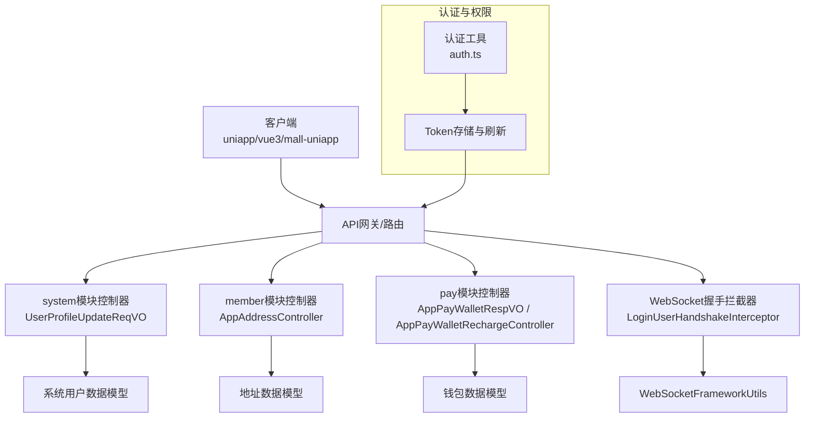
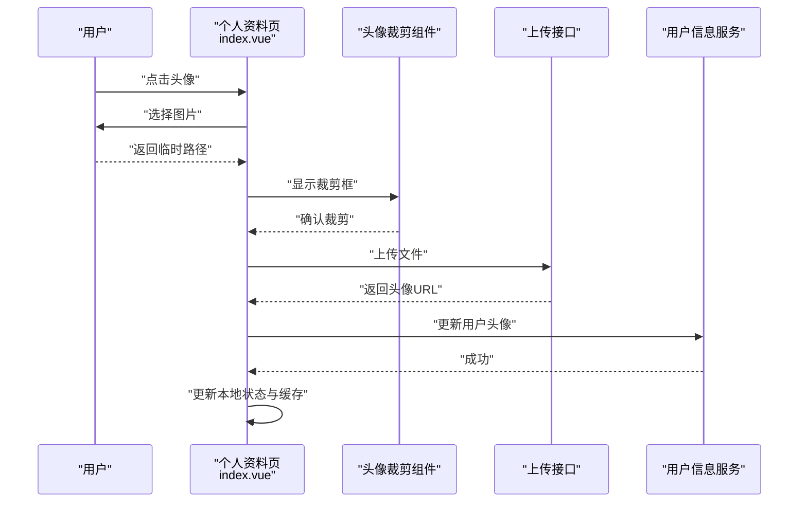
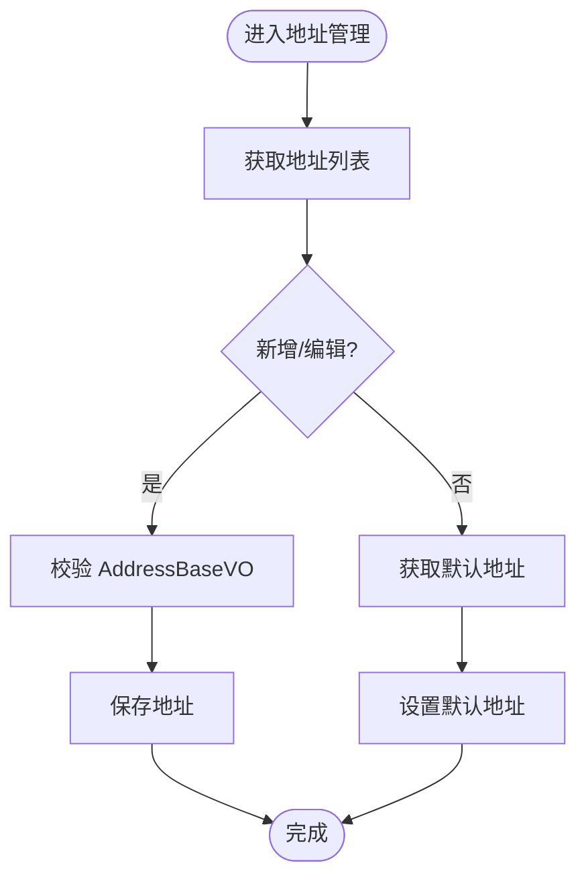
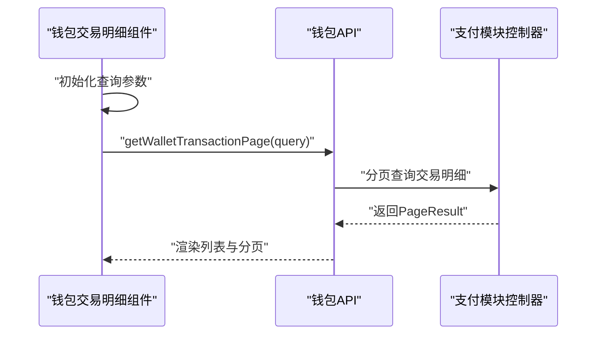
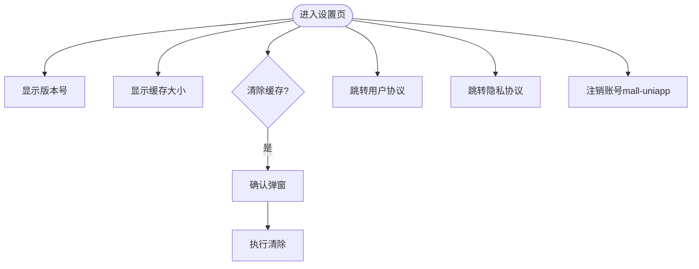
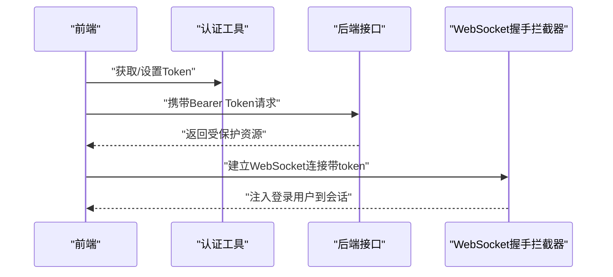
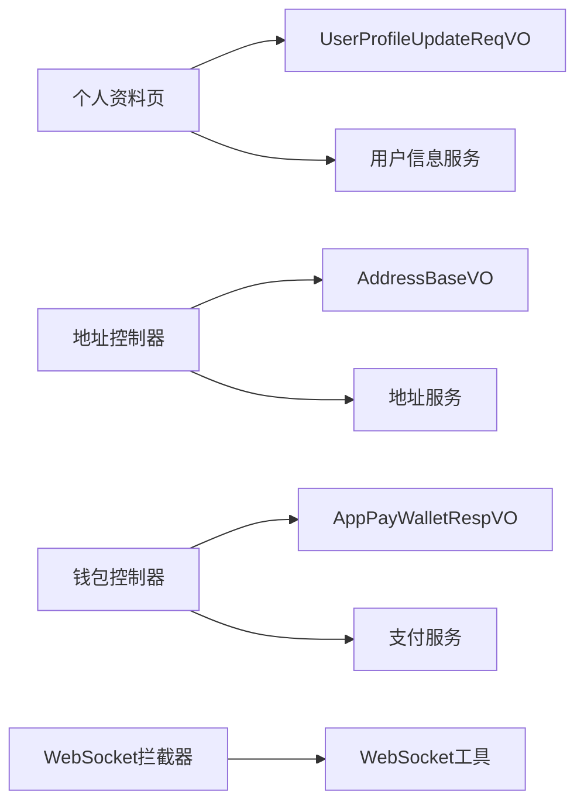

# 用户中心

<cite>
**本文引用的文件**
- [前端-个人资料页（admin-uniapp）](file://frontend/admin-uniapp/src/pages-core/user/profile/index.vue)
- [前端-设置页（admin-uniapp）](file://frontend/admin-uniapp/src/pages-core/user/settings/index.vue)
- [前端-隐私协议页（admin-uniapp）](file://frontend/admin-uniapp/src/pages-core/user/settings/privacy/index.vue)
- [前端-个人资料页（admin-vue3）](file://frontend/admin-vue3/src/views/Profile/Index.vue)
- [前端-个人资料用户区（admin-vue3）](file://frontend/admin-vue3/src/views/Profile/components/ProfileUser.vue)
- [前端-个人资料头像组件（admin-vue3）](file://frontend/admin-vue3/src/views/Profile/components/UserAvatar.vue)
- [前端-个人资料基础信息组件（admin-vue3）](file://frontend/admin-vue3/src/views/Profile/components/BasicInfo.vue)
- [前端-钱包交易明细列表（admin-vue3）](file://frontend/admin-vue3/src/views/pay/wallet/transaction/WalletTransactionList.vue)
- [前端-用户余额明细列表（admin-vue3）](file://frontend/admin-vue3/src/views/member/user/detail/UserBalanceList.vue)
- [前端-钱包API（mall-uniapp）](file://frontend/mall-uniapp/sheep/api/pay/wallet.js)
- [前端-设置页（mall-uniapp）](file://frontend/mall-uniapp/pages/public/setting.vue)
- [后端-用户个人信息更新请求VO（system模块）](file://backend/yudao-module-system/src/main/java/cn/iocoder/yudao/module/system/controller/admin/user/vo/profile/UserProfileUpdateReqVO.java)
- [后端-APP收货地址控制器（member模块）](file://backend/yudao-module-member/src/main/java/cn/iocoder/yudao/module/member/controller/app/address/AppAddressController.java)
- [后端-收货地址基础VO（member模块）](file://backend/yudao-module-member/src/main/java/cn/iocoder/yudao/module/member/controller/admin/address/vo/AddressBaseVO.java)
- [后端-管理后台钱包交易控制器（pay模块）](file://backend/yudao-module-pay/src/main/java/cn/iocoder/yudao/module/pay/controller/admin/wallet/PayWalletTransactionController.java)
- [后端-APP钱包响应VO（pay模块）](file://backend/yudao-module-pay/src/main/java/cn/iocoder/yudao/module/pay/controller/app/wallet/vo/wallet/AppPayWalletRespVO.java)
- [后端-管理后台钱包余额更新请求VO（pay模块）](file://backend/yudao-module-pay/src/main/java/cn/iocoder/yudao/module/pay/controller/admin/wallet/vo/wallet/PayWalletUpdateBalanceReqVO.java)
- [后端-管理后台钱包基础请求VO（pay模块）](file://backend/yudao-module-pay/src/main/java/cn/iocoder/yudao/module/pay/controller/admin/wallet/vo/wallet/PayWalletBaseVO.java)
- [后端-APP钱包充值控制器（pay模块）](file://backend/yudao-module-pay/src/main/java/cn/iocoder/yudao/module/pay/controller/app/wallet/AppPayWalletRechargeController.java)
- [前端-认证工具（admin-vue3）](file://frontend/admin-vue3/src/utils/auth.ts)
- [后端-WebSocket握手拦截器（yudao-framework）](file://backend/yudao-framework/yudao-spring-boot-starter-websocket/src/main/java/cn/iocoder/yudao/framework/websocket/core/security/LoginUserHandshakeInterceptor.java)
- [后端-WebSocket框架工具（yudao-framework）](file://backend/yudao-framework/yudao-spring-boot-starter-websocket/src/main/java/cn/iocoder/yudao/framework/websocket/core/util/WebSocketFrameworkUtils.java)
- [前端-页面配置（admin-uniapp）](file://frontend/admin-uniapp/src/pages.json)
</cite>

## 目录
1. [简介](#简介)
2. [项目结构](#项目结构)
3. [核心组件](#核心组件)
4. [架构总览](#架构总览)
5. [详细组件分析](#详细组件分析)
6. [依赖关系分析](#依赖关系分析)
7. [性能考虑](#性能考虑)
8. [故障排查指南](#故障排查指南)
9. [结论](#结论)
10. [附录](#附录)

## 简介
本文件系统性梳理用户中心功能，覆盖以下方面：
- 个人信息展示与编辑、头像上传机制
- 收货地址管理（列表、新增/编辑、默认地址、删除）
- 钱包页面（余额、明细、充值、提现）
- 设置页面（账号管理、隐私设置、通知设置、帮助反馈）
- 用户状态管理、登录认证、会话保持与权限控制
- 数据安全、隐私保护与用户体验优化策略

## 项目结构
用户中心涉及前后端多模块协作：
- 前端（admin-uniapp）：用户资料、设置、隐私协议、页面路由
- 前端（admin-vue3）：Profile 页面、钱包交易明细、用户余额明细
- 前端（mall-uniapp）：钱包API、设置页
- 后端（system）：用户个人信息更新请求VO
- 后端（member）：收货地址增删改查、默认地址查询
- 后端（pay）：钱包余额、交易明细、充值流程
- 后端（yudao-framework）：WebSocket认证与会话保持

```mermaid
graph TB
subgraph "前端-uniapp"
U_Profile["个人资料页<br/>pages-core/user/profile/index.vue"]
U_Settings["设置页<br/>pages-core/user/settings/index.vue"]
U_Privacy["隐私协议页<br/>pages-core/user/settings/privacy/index.vue"]
U_Router["页面配置<br/>pages.json"]
end
subgraph "前端-vue3"
V_Profile["Profile首页<br/>views/Profile/Index.vue"]
V_Profiles["Profile子组件集<br/>views/Profile/components/*"]
V_WalletTx["钱包交易明细<br/>views/pay/wallet/transaction/WalletTransactionList.vue"]
V_BalanceList["用户余额明细<br/>views/member/user/detail/UserBalanceList.vue"]
end
subgraph "前端-mall-uniapp"
M_API["钱包API<br/>sheep/api/pay/wallet.js"]
M_Setting["设置页<br/>pages/public/setting.vue"]
end
subgraph "后端-system"
S_ProfileVO["UserProfileUpdateReqVO<br/>controller/admin/user/vo/profile/UserProfileUpdateReqVO.java"]
end
subgraph "后端-member"
M_AppAddrCtrl["AppAddressController<br/>controller/app/address/AppAddressController.java"]
M_AddrBaseVO["AddressBaseVO<br/>controller/admin/address/vo/AddressBaseVO.java"]
end
subgraph "后端-pay"
P_AdminTx["PayWalletTransactionController<br/>controller/admin/wallet/*"]
P_AppWalletVO["AppPayWalletRespVO<br/>controller/app/wallet/vo/wallet/AppPayWalletRespVO.java"]
P_AdminBalReq["PayWalletUpdateBalanceReqVO<br/>controller/admin/wallet/vo/wallet/PayWalletUpdateBalanceReqVO.java"]
P_AdminBaseReq["PayWalletBaseVO<br/>controller/admin/wallet/vo/wallet/PayWalletBaseVO.java"]
P_AppRechargeCtrl["AppPayWalletRechargeController<br/>controller/app/wallet/AppPayWalletRechargeController.java"]
end
subgraph "后端-framework"
F_WSInterc["LoginUserHandshakeInterceptor<br/>websocket/core/security/LoginUserHandshakeInterceptor.java"]
F_WSUtils["WebSocketFrameworkUtils<br/>websocket/core/util/WebSocketFrameworkUtils.java"]
end
U_Profile --> S_ProfileVO
U_Settings --> U_Privacy
V_Profile --> V_Profiles
V_WalletTx --> P_AdminTx
V_BalanceList --> P_AdminTx
M_API --> P_AppWalletVO
M_Setting --> U_Settings
M_AppAddrCtrl --> M_AddrBaseVO
P_AdminTx --> P_AdminBaseReq
F_WSInterc --> F_WSUtils
```

**图表来源**
- [前端-个人资料页（admin-uniapp）:1-140](file://frontend/admin-uniapp/src/pages-core/user/profile/index.vue#L1-L140)
- [前端-设置页（admin-uniapp）:1-150](file://frontend/admin-uniapp/src/pages-core/user/settings/index.vue#L1-L150)
- [前端-隐私协议页（admin-uniapp）:1-159](file://frontend/admin-uniapp/src/pages-core/user/settings/privacy/index.vue#L1-L159)
- [前端-个人资料页（admin-vue3）:1-41](file://frontend/admin-vue3/src/views/Profile/Index.vue#L1-L41)
- [前端-个人资料用户区（admin-vue3）:1-35](file://frontend/admin-vue3/src/views/Profile/components/ProfileUser.vue#L1-L35)
- [前端-个人资料头像组件（admin-vue3）:1-54](file://frontend/admin-vue3/src/views/Profile/components/UserAvatar.vue#L1-L54)
- [前端-个人资料基础信息组件（admin-vue3）:1-43](file://frontend/admin-vue3/src/views/Profile/components/BasicInfo.vue#L1-L43)
- [前端-钱包交易明细列表（admin-vue3）:1-79](file://frontend/admin-vue3/src/views/pay/wallet/transaction/WalletTransactionList.vue#L1-L79)
- [前端-用户余额明细列表（admin-vue3）:1-67](file://frontend/admin-vue3/src/views/member/user/detail/UserBalanceList.vue#L1-L67)
- [前端-钱包API（mall-uniapp）:1-49](file://frontend/mall-uniapp/sheep/api/pay/wallet.js#L1-L49)
- [前端-设置页（mall-uniapp）:43-86](file://frontend/mall-uniapp/pages/public/setting.vue#L43-L86)
- [后端-用户个人信息更新请求VO（system模块）:1-36](file://backend/yudao-module-system/src/main/java/cn/iocoder/yudao/module/system/controller/admin/user/vo/profile/UserProfileUpdateReqVO.java#L1-L36)
- [后端-APP收货地址控制器（member模块）:1-59](file://backend/yudao-module-member/src/main/java/cn/iocoder/yudao/module/member/controller/app/address/AppAddressController.java#L1-L59)
- [后端-收货地址基础VO（member模块）:1-37](file://backend/yudao-module-member/src/main/java/cn/iocoder/yudao/module/member/controller/admin/address/vo/AddressBaseVO.java#L1-L37)
- [后端-管理后台钱包交易控制器（pay模块）:1-31](file://backend/yudao-module-pay/src/main/java/cn/iocoder/yudao/module/pay/controller/admin/wallet/PayWalletTransactionController.java#L1-L31)
- [后端-APP钱包响应VO（pay模块）:1-19](file://backend/yudao-module-pay/src/main/java/cn/iocoder/yudao/module/pay/controller/app/wallet/vo/wallet/AppPayWalletRespVO.java#L1-L19)
- [后端-管理后台钱包余额更新请求VO（pay模块）:1-19](file://backend/yudao-module-pay/src/main/java/cn/iocoder/yudao/module/pay/controller/admin/wallet/vo/wallet/PayWalletUpdateBalanceReqVO.java#L1-L19)
- [后端-管理后台钱包基础请求VO（pay模块）:1-39](file://backend/yudao-module-pay/src/main/java/cn/iocoder/yudao/module/pay/controller/admin/wallet/vo/wallet/PayWalletBaseVO.java#L1-L39)
- [后端-APP钱包充值控制器（pay模块）:1-26](file://backend/yudao-module-pay/src/main/java/cn/iocoder/yudao/module/pay/controller/app/wallet/AppPayWalletRechargeController.java#L1-L26)
- [后端-WebSocket握手拦截器（yudao-framework）:1-29](file://backend/yudao-framework/yudao-spring-boot-starter-websocket/src/main/java/cn/iocoder/yudao/framework/websocket/core/security/LoginUserHandshakeInterceptor.java#L1-L29)
- [后端-WebSocket框架工具（yudao-framework）:1-51](file://backend/yudao-framework/yudao-spring-boot-starter-websocket/src/main/java/cn/iocoder/yudao/framework/websocket/core/util/WebSocketFrameworkUtils.java#L1-L51)
- [前端-页面配置（admin-uniapp）:106-161](file://frontend/admin-uniapp/src/pages.json#L106-L161)

**章节来源**
- [前端-页面配置（admin-uniapp）:106-161](file://frontend/admin-uniapp/src/pages.json#L106-L161)

## 核心组件
- 个人信息与头像
  - uniapp 个人资料页支持头像裁剪上传与字段编辑弹窗；vue3 Profile 提供头像组件与基础信息表单。
- 收货地址管理
  - APP 地址控制器提供创建、更新、删除、详情、默认地址查询与列表接口。
- 钱包功能
  - APP 钱包返回余额、充值、支出统计；交易明细分页查询；充值流程由钱包充值控制器处理。
- 设置与隐私
  - uniapp 设置页包含版本、缓存、协议跳转；隐私协议页展示条款；mall-uniapp 设置页含注销账号入口。

**章节来源**
- [前端-个人资料页（admin-uniapp）:1-140](file://frontend/admin-uniapp/src/pages-core/user/profile/index.vue#L1-L140)
- [前端-个人资料页（admin-vue3）:1-41](file://frontend/admin-vue3/src/views/Profile/Index.vue#L1-L41)
- [前端-个人资料头像组件（admin-vue3）:1-54](file://frontend/admin-vue3/src/views/Profile/components/UserAvatar.vue#L1-L54)
- [前端-个人资料基础信息组件（admin-vue3）:1-43](file://frontend/admin-vue3/src/views/Profile/components/BasicInfo.vue#L1-L43)
- [后端-APP收货地址控制器（member模块）:1-59](file://backend/yudao-module-member/src/main/java/cn/iocoder/yudao/module/member/controller/app/address/AppAddressController.java#L1-L59)
- [后端-APP钱包响应VO（pay模块）:1-19](file://backend/yudao-module-pay/src/main/java/cn/iocoder/yudao/module/pay/controller/app/wallet/vo/wallet/AppPayWalletRespVO.java#L1-L19)
- [前端-钱包API（mall-uniapp）:1-49](file://frontend/mall-uniapp/sheep/api/pay/wallet.js#L1-L49)
- [前端-钱包交易明细列表（admin-vue3）:1-79](file://frontend/admin-vue3/src/views/pay/wallet/transaction/WalletTransactionList.vue#L1-L79)
- [前端-用户余额明细列表（admin-vue3）:1-67](file://frontend/admin-vue3/src/views/member/user/detail/UserBalanceList.vue#L1-L67)
- [前端-设置页（admin-uniapp）:1-150](file://frontend/admin-uniapp/src/pages-core/user/settings/index.vue#L1-L150)
- [前端-隐私协议页（admin-uniapp）:1-159](file://frontend/admin-uniapp/src/pages-core/user/settings/privacy/index.vue#L1-L159)
- [前端-设置页（mall-uniapp）:43-86](file://frontend/mall-uniapp/pages/public/setting.vue#L43-L86)

## 架构总览
用户中心采用“前端页面 + 后端控制器 + 数据模型”的分层架构，前后端通过HTTP API交互，认证与权限通过Token与拦截器实现。

**图表来源**
- [前端-认证工具（admin-vue3）:1-49](file://frontend/admin-vue3/src/utils/auth.ts#L1-L49)
- [后端-用户个人信息更新请求VO（system模块）:1-36](file://backend/yudao-module-system/src/main/java/cn/iocoder/yudao/module/system/controller/admin/user/vo/profile/UserProfileUpdateReqVO.java#L1-L36)
- [后端-APP收货地址控制器（member模块）:1-59](file://backend/yudao-module-member/src/main/java/cn/iocoder/yudao/module/member/controller/app/address/AppAddressController.java#L1-L59)
- [后端-APP钱包响应VO（pay模块）:1-19](file://backend/yudao-module-pay/src/main/java/cn/iocoder/yudao/module/pay/controller/app/wallet/vo/wallet/AppPayWalletRespVO.java#L1-L19)
- [后端-APP钱包充值控制器（pay模块）:1-26](file://backend/yudao-module-pay/src/main/java/cn/iocoder/yudao/module/pay/controller/app/wallet/AppPayWalletRechargeController.java#L1-L26)
- [后端-WebSocket握手拦截器（yudao-framework）:1-29](file://backend/yudao-framework/yudao-spring-boot-starter-websocket/src/main/java/cn/iocoder/yudao/framework/websocket/core/security/LoginUserHandshakeInterceptor.java#L1-L29)
- [后端-WebSocket框架工具（yudao-framework）:1-51](file://backend/yudao-framework/yudao-spring-boot-starter-websocket/src/main/java/cn/iocoder/yudao/framework/websocket/core/util/WebSocketFrameworkUtils.java#L1-L51)

## 详细组件分析

### 个人信息与头像上传
- 功能要点
  - 展示头像、昵称、性别、手机、邮箱、部门、岗位、角色等信息。
  - 支持头像裁剪上传并同步更新用户状态与本地缓存。
  - 支持昵称、性别、手机、邮箱的编辑弹窗。
- 前端流程（uniapp）
  - 选择图片 -> 打开头像裁剪 -> 确认裁剪 -> 上传文件 -> 更新用户头像 -> 本地状态同步。
- 前端流程（vue3）
  - 通过 CropperAvatar 组件触发上传，调用更新接口并刷新用户信息。
- 后端约束
  - UserProfileUpdateReqVO 对昵称、邮箱、手机号、性别、头像进行参数校验。

**图表来源**
- [前端-个人资料页（admin-uniapp）:92-117](file://frontend/admin-uniapp/src/pages-core/user/profile/index.vue#L92-L117)
- [后端-用户个人信息更新请求VO（system模块）:1-36](file://backend/yudao-module-system/src/main/java/cn/iocoder/yudao/module/system/controller/admin/user/vo/profile/UserProfileUpdateReqVO.java#L1-L36)

**章节来源**
- [前端-个人资料页（admin-uniapp）:1-140](file://frontend/admin-uniapp/src/pages-core/user/profile/index.vue#L1-L140)
- [前端-个人资料头像组件（admin-vue3）:1-54](file://frontend/admin-vue3/src/views/Profile/components/UserAvatar.vue#L1-L54)
- [后端-用户个人信息更新请求VO（system模块）:1-36](file://backend/yudao-module-system/src/main/java/cn/iocoder/yudao/module/system/controller/admin/user/vo/profile/UserProfileUpdateReqVO.java#L1-L36)

### 收货地址管理
- 功能要点
  - 列表：获取当前用户地址列表。
  - 新增/编辑：基于 AddressBaseVO 校验姓名、手机、地区编码、详细地址、默认状态。
  - 默认地址：提供获取默认地址接口。
  - 删除：按地址ID删除。
- 控制器与数据模型
  - AppAddressController 提供创建、更新、删除、详情、默认地址查询、列表接口。
  - AddressBaseVO 定义地址字段与必填校验。

**图表来源**
- [后端-APP收货地址控制器（member模块）:1-59](file://backend/yudao-module-member/src/main/java/cn/iocoder/yudao/module/member/controller/app/address/AppAddressController.java#L1-L59)
- [后端-收货地址基础VO（member模块）:1-37](file://backend/yudao-module-member/src/main/java/cn/iocoder/yudao/module/member/controller/admin/address/vo/AddressBaseVO.java#L1-L37)

**章节来源**
- [后端-APP收货地址控制器（member模块）:1-59](file://backend/yudao-module-member/src/main/java/cn/iocoder/yudao/module/member/controller/app/address/AppAddressController.java#L1-L59)
- [后端-收货地址基础VO（member模块）:1-37](file://backend/yudao-module-member/src/main/java/cn/iocoder/yudao/module/member/controller/admin/address/vo/AddressBaseVO.java#L1-L37)

### 钱包页面
- 功能要点
  - 余额查询：APP 钱包响应VO包含余额、累计支出、累计充值。
  - 明细记录：分页查询钱包交易流水，支持按钱包ID过滤。
  - 充值记录：钱包API提供充值套餐列表与创建充值记录。
  - 提现申请：钱包充值控制器处理充值流程（提现通常与充值类似，需结合具体业务扩展）。
- 前端组件
  - 钱包交易明细列表：支持传入 walletId 或 userId 自动解析钱包ID并分页查询。
  - 用户余额明细：支持传入 walletId 分页查询交易明细。

**图表来源**
- [前端-钱包交易明细列表（admin-vue3）:34-79](file://frontend/admin-vue3/src/views/pay/wallet/transaction/WalletTransactionList.vue#L34-L79)
- [前端-钱包API（mall-uniapp）:1-49](file://frontend/mall-uniapp/sheep/api/pay/wallet.js#L1-L49)
- [后端-管理后台钱包交易控制器（pay模块）:1-31](file://backend/yudao-module-pay/src/main/java/cn/iocoder/yudao/module/pay/controller/admin/wallet/PayWalletTransactionController.java#L1-L31)
- [后端-APP钱包响应VO（pay模块）:1-19](file://backend/yudao-module-pay/src/main/java/cn/iocoder/yudao/module/pay/controller/app/wallet/vo/wallet/AppPayWalletRespVO.java#L1-L19)

**章节来源**
- [前端-钱包交易明细列表（admin-vue3）:1-79](file://frontend/admin-vue3/src/views/pay/wallet/transaction/WalletTransactionList.vue#L1-L79)
- [前端-用户余额明细列表（admin-vue3）:1-67](file://frontend/admin-vue3/src/views/member/user/detail/UserBalanceList.vue#L1-L67)
- [前端-钱包API（mall-uniapp）:1-49](file://frontend/mall-uniapp/sheep/api/pay/wallet.js#L1-L49)
- [后端-管理后台钱包交易控制器（pay模块）:1-31](file://backend/yudao-module-pay/src/main/java/cn/iocoder/yudao/module/pay/controller/admin/wallet/PayWalletTransactionController.java#L1-L31)
- [后端-APP钱包响应VO（pay模块）:1-19](file://backend/yudao-module-pay/src/main/java/cn/iocoder/yudao/module/pay/controller/app/wallet/vo/wallet/AppPayWalletRespVO.java#L1-L19)

### 设置与隐私
- 设置页（uniapp）
  - 展示版本号、本地缓存大小；支持清除缓存；跳转至用户协议与隐私协议。
- 隐私协议页（uniapp）
  - 展示隐私政策全文与联系方式。
- 设置页（mall-uniapp）
  - 提供注销账号入口与协议链接。

**图表来源**
- [前端-设置页（admin-uniapp）:1-150](file://frontend/admin-uniapp/src/pages-core/user/settings/index.vue#L1-L150)
- [前端-隐私协议页（admin-uniapp）:1-159](file://frontend/admin-uniapp/src/pages-core/user/settings/privacy/index.vue#L1-L159)
- [前端-设置页（mall-uniapp）:43-86](file://frontend/mall-uniapp/pages/public/setting.vue#L43-L86)

**章节来源**
- [前端-设置页（admin-uniapp）:1-150](file://frontend/admin-uniapp/src/pages-core/user/settings/index.vue#L1-L150)
- [前端-隐私协议页（admin-uniapp）:1-159](file://frontend/admin-uniapp/src/pages-core/user/settings/privacy/index.vue#L1-L159)
- [前端-设置页（mall-uniapp）:43-86](file://frontend/mall-uniapp/pages/public/setting.vue#L43-L86)

### 登录认证、会话保持与权限控制
- 认证与Token
  - 前端通过认证工具管理Token的获取、设置、刷新与移除，统一格式化为Bearer。
- WebSocket会话
  - 握手拦截器将登录用户注入到WebSocket会话属性，便于实时通信场景下的鉴权与会话保持。
- 权限控制
  - 后端通过注解与拦截器实现权限校验（如管理后台接口的PreAuthorize），前端在需要鉴权的接口中携带Token。

**图表来源**
- [前端-认证工具（admin-vue3）:1-49](file://frontend/admin-vue3/src/utils/auth.ts#L1-L49)
- [后端-WebSocket握手拦截器（yudao-framework）:1-29](file://backend/yudao-framework/yudao-spring-boot-starter-websocket/src/main/java/cn/iocoder/yudao/framework/websocket/core/security/LoginUserHandshakeInterceptor.java#L1-L29)
- [后端-WebSocket框架工具（yudao-framework）:1-51](file://backend/yudao-framework/yudao-spring-boot-starter-websocket/src/main/java/cn/iocoder/yudao/framework/websocket/core/util/WebSocketFrameworkUtils.java#L1-L51)

**章节来源**
- [前端-认证工具（admin-vue3）:1-49](file://frontend/admin-vue3/src/utils/auth.ts#L1-L49)
- [后端-WebSocket握手拦截器（yudao-framework）:1-29](file://backend/yudao-framework/yudao-spring-boot-starter-websocket/src/main/java/cn/iocoder/yudao/framework/websocket/core/security/LoginUserHandshakeInterceptor.java#L1-L29)
- [后端-WebSocket框架工具（yudao-framework）:1-51](file://backend/yudao-framework/yudao-spring-boot-starter-websocket/src/main/java/cn/iocoder/yudao/framework/websocket/core/util/WebSocketFrameworkUtils.java#L1-L51)

## 依赖关系分析
- 前端依赖
  - uniapp/vite3 页面依赖各自组件与API封装；mall-uniapp 依赖 sheep 请求库。
- 后端依赖
  - 控制器依赖Service与Convert；VO负责参数校验；WebSocket工具依赖Security上下文。
- 耦合与内聚
  - 控制器职责单一，围绕用户、地址、钱包分别提供REST接口；组件间通过API契约耦合，降低直接依赖。

**图表来源**
- [前端-个人资料页（admin-uniapp）:1-140](file://frontend/admin-uniapp/src/pages-core/user/profile/index.vue#L1-L140)
- [后端-用户个人信息更新请求VO（system模块）:1-36](file://backend/yudao-module-system/src/main/java/cn/iocoder/yudao/module/system/controller/admin/user/vo/profile/UserProfileUpdateReqVO.java#L1-L36)
- [后端-APP收货地址控制器（member模块）:1-59](file://backend/yudao-module-member/src/main/java/cn/iocoder/yudao/module/member/controller/app/address/AppAddressController.java#L1-L59)
- [后端-收货地址基础VO（member模块）:1-37](file://backend/yudao-module-member/src/main/java/cn/iocoder/yudao/module/member/controller/admin/address/vo/AddressBaseVO.java#L1-L37)
- [后端-APP钱包响应VO（pay模块）:1-19](file://backend/yudao-module-pay/src/main/java/cn/iocoder/yudao/module/pay/controller/app/wallet/vo/wallet/AppPayWalletRespVO.java#L1-L19)
- [后端-WebSocket握手拦截器（yudao-framework）:1-29](file://backend/yudao-framework/yudao-spring-boot-starter-websocket/src/main/java/cn/iocoder/yudao/framework/websocket/core/security/LoginUserHandshakeInterceptor.java#L1-L29)
- [后端-WebSocket框架工具（yudao-framework）:1-51](file://backend/yudao-framework/yudao-spring-boot-starter-websocket/src/main/java/cn/iocoder/yudao/framework/websocket/core/util/WebSocketFrameworkUtils.java#L1-L51)

**章节来源**
- [后端-管理后台钱包余额更新请求VO（pay模块）:1-19](file://backend/yudao-module-pay/src/main/java/cn/iocoder/yudao/module/pay/controller/admin/wallet/vo/wallet/PayWalletUpdateBalanceReqVO.java#L1-L19)
- [后端-管理后台钱包基础请求VO（pay模块）:1-39](file://backend/yudao-module-pay/src/main/java/cn/iocoder/yudao/module/pay/controller/admin/wallet/vo/wallet/PayWalletBaseVO.java#L1-L39)

## 性能考虑
- 前端
  - 图片上传前进行裁剪，减少传输体积；分页加载钱包明细，避免一次性渲染大量数据。
  - 缓存Token与常用配置，减少重复请求。
- 后端
  - 地址与钱包接口使用分页参数，避免全量扫描；WebSocket会话仅注入必要用户信息，降低握手成本。
- 可扩展性
  - 将校验规则集中到VO，便于复用与维护；接口按领域拆分，提升内聚度。

## 故障排查指南
- 头像上传失败
  - 检查上传组件是否正确返回URL；确认更新接口返回成功并刷新本地状态。
- 地址保存失败
  - 核对 AddressBaseVO 校验规则（姓名、手机、地区编码、详细地址、默认状态）。
- 钱包明细为空
  - 确认传入的 walletId 或 userId 是否正确；检查分页参数与接口返回。
- WebSocket无法连接
  - 确认握手时携带的token有效；检查拦截器是否注入登录用户。

**章节来源**
- [前端-个人资料页（admin-uniapp）:104-117](file://frontend/admin-uniapp/src/pages-core/user/profile/index.vue#L104-L117)
- [后端-收货地址基础VO（member模块）:1-37](file://backend/yudao-module-member/src/main/java/cn/iocoder/yudao/module/member/controller/admin/address/vo/AddressBaseVO.java#L1-L37)
- [前端-钱包交易明细列表（admin-vue3）:58-73](file://frontend/admin-vue3/src/views/pay/wallet/transaction/WalletTransactionList.vue#L58-L73)
- [后端-WebSocket握手拦截器（yudao-framework）:1-29](file://backend/yudao-framework/yudao-spring-boot-starter-websocket/src/main/java/cn/iocoder/yudao/framework/websocket/core/security/LoginUserHandshakeInterceptor.java#L1-L29)

## 结论
用户中心通过清晰的前后端分工与严格的参数校验，实现了个人信息、收货地址、钱包与设置等核心能力。配合认证与WebSocket会话机制，确保了安全性与实时性。后续可在权限细化、数据脱敏与用户体验优化方面持续迭代。

## 附录
- 术语
  - VO：视图对象，用于接口参数与返回值的结构化定义。
  - DTO：数据传输对象，用于跨层或跨服务的数据封装。
- 最佳实践
  - 参数校验前置到VO，接口层只做路由与鉴权。
  - 前端对敏感字段进行脱敏展示，上传前进行压缩与裁剪。
  - WebSocket场景下，统一从会话属性获取用户信息，避免重复鉴权。