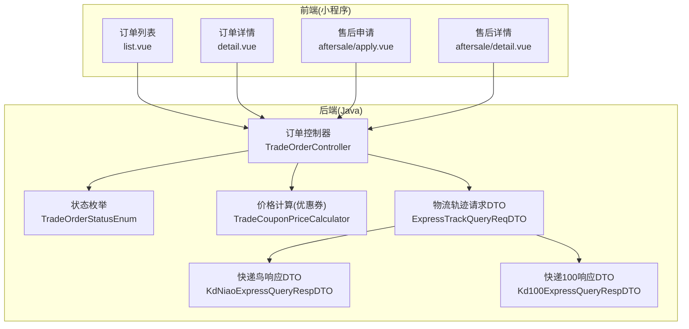
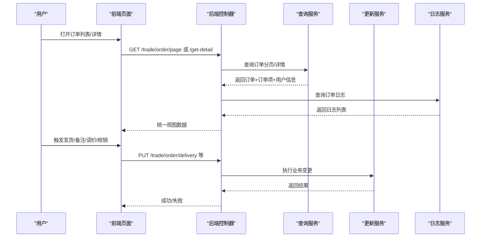
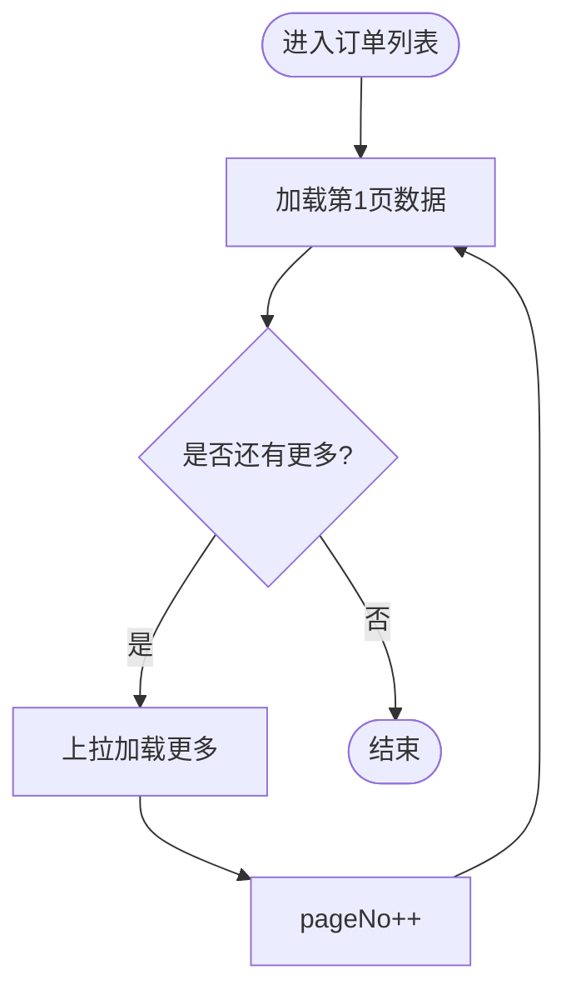
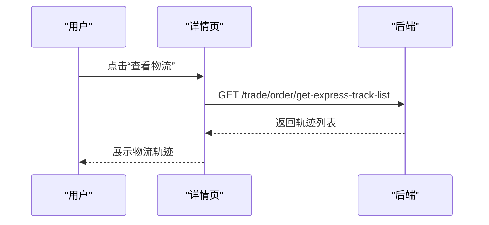
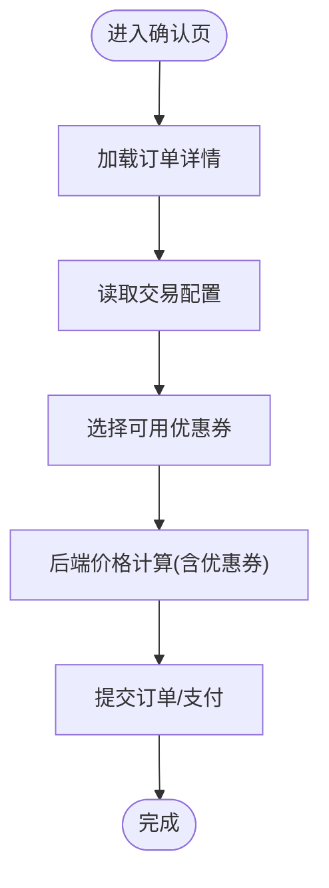
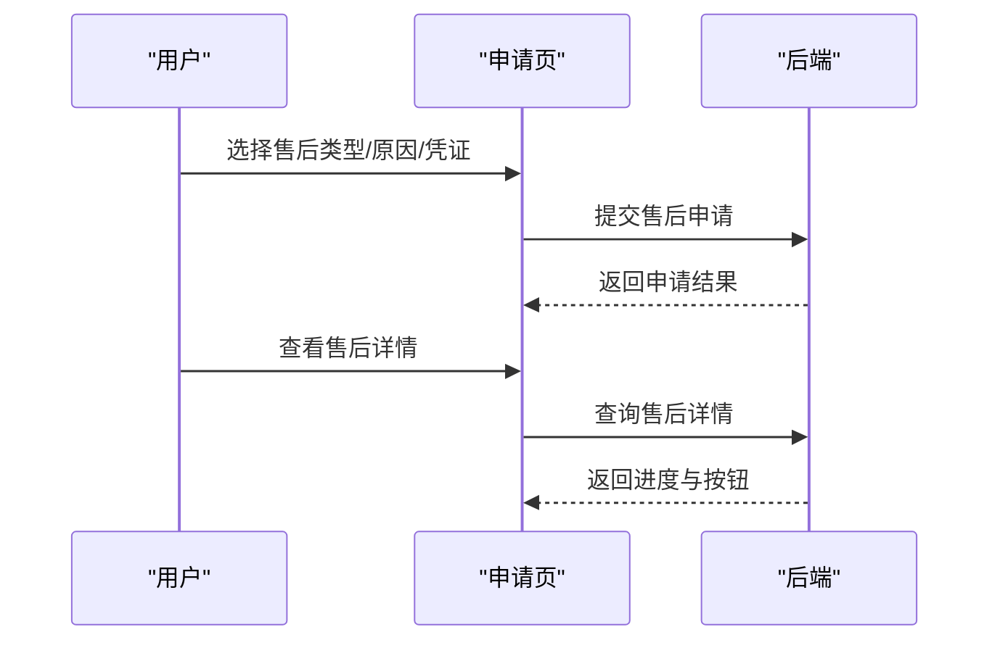
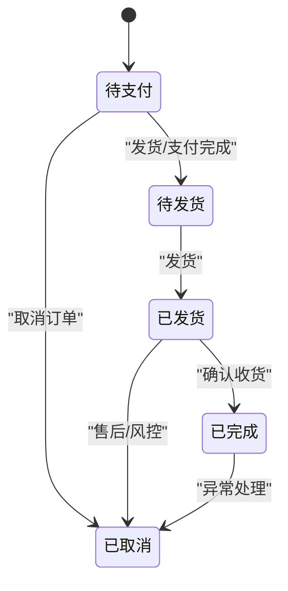
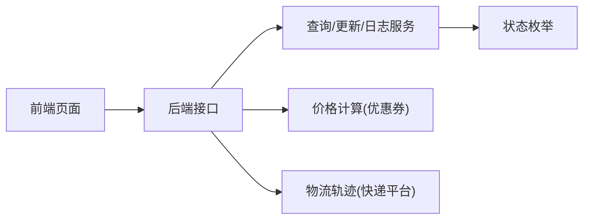

# 订单管理

<cite>
**本文引用的文件**
- [TradeOrderStatusEnum.java](file://backend/yudao-module-mall/yudao-module-trade-api/src/main/java/cn/iocoder/yudao/module/trade/enums/order/TradeOrderStatusEnum.java)
- [TradeOrderController.java](file://backend/yudao-module-mall/yudao-module-trade/src/main/java/cn/iocoder/yudao/module/trade/controller/admin/order/TradeOrderController.java)
- [TradeOrderApiImpl.java](file://backend/yudao-module-mall/yudao-module-trade/src/main/java/cn/iocoder/yudao/module/trade/api/order/TradeOrderApiImpl.java)
- [list.vue](file://frontend/mall-uniapp/pages/order/list.vue)
- [detail.vue](file://frontend/mall-uniapp/pages/order/detail.vue)
- [apply.vue](file://frontend/mall-uniapp/pages/order/aftersale/apply.vue)
- [detail.vue](file://frontend/mall-uniapp/pages/order/aftersale/detail.vue)
- [TradeCouponPriceCalculator.java](file://backend/yudao-module-mall/yudao-module-trade/src/main/java/cn/iocoder/yudao/module/trade/service/price/calculator/TradeCouponPriceCalculator.java)
- [ExpressTrackQueryReqDTO.java](file://backend/yudao-module-mall/yudao-module-trade/src/main/java/cn/iocoder/yudao/module/trade/framework/delivery/core/client/dto/ExpressTrackQueryReqDTO.java)
- [KdNiaoExpressQueryRespDTO.java](file://backend/yudao-module-mall/yudao-module-trade/src/main/java/cn/iocoder/yudao/module/trade/framework/delivery/core/client/dto/kdniao/KdNiaoExpressQueryRespDTO.java)
- [Kd100ExpressQueryRespDTO.java](file://backend/yudao-module-mall/yudao-module-trade/src/main/java/cn/iocoder/yudao/module/trade/framework/delivery/core/client/dto/kd100/Kd100ExpressQueryRespDTO.java)
- [TradeOrderItemAfterSaleStatusEnum.java](file://backend/yudao-module-mall/yudao-module-trade-api/src/main/java/cn/iocoder/yudao/module/trade/enums/order/TradeOrderItemAfterSaleStatusEnum.java)
</cite>

## 目录
1. [简介](#简介)
2. [项目结构](#项目结构)
3. [核心组件](#核心组件)
4. [架构总览](#架构总览)
5. [详细组件分析](#详细组件分析)
6. [依赖分析](#依赖分析)
7. [性能考虑](#性能考虑)
8. [故障排查指南](#故障排查指南)
9. [结论](#结论)
10. [附录](#附录)

## 简介
本文件面向订单管理功能，围绕以下目标展开：  
- 订单列表页面：状态分类、筛选条件、分页加载实现  
- 订单详情页面：信息展示、物流跟踪、状态管理与操作按钮控制  
- 订单确认页面：商品信息核对、收货地址选择、优惠券使用与价格计算  
- 售后服务页面：退换货申请、进度查询与状态更新  
- 订单状态流转、异步更新机制与用户通知推送  
- 订单数据缓存、离线处理与异常情况下的一致性保障方案  

## 项目结构
订单管理涉及前后端协同：前端负责页面交互与分页加载；后端提供订单查询、发货、备注、调价、核销、物流轨迹、价格计算等能力，并通过枚举统一状态语义。

**图表来源**
- [list.vue:147-167](file://frontend/mall-uniapp/pages/order/list.vue#L147-L167)
- [detail.vue:1-681](file://frontend/mall-uniapp/pages/order/detail.vue#L1-L681)
- [apply.vue:1-350](file://frontend/mall-uniapp/pages/order/aftersale/apply.vue#L1-L350)
- [detail.vue:1-380](file://frontend/mall-uniapp/pages/order/aftersale/detail.vue#L1-L380)
- [TradeOrderController.java:52-108](file://backend/yudao-module-mall/yudao-module-trade/src/main/java/cn/iocoder/yudao/module/trade/controller/admin/order/TradeOrderController.java#L52-L108)
- [TradeOrderStatusEnum.java:18-24](file://backend/yudao-module-mall/yudao-module-trade-api/src/main/java/cn/iocoder/yudao/module/trade/enums/order/TradeOrderStatusEnum.java#L18-L24)
- [TradeCouponPriceCalculator.java:42-50](file://backend/yudao-module-mall/yudao-module-trade/src/main/java/cn/iocoder/yudao/module/trade/service/price/calculator/TradeCouponPriceCalculator.java#L42-L50)
- [ExpressTrackQueryReqDTO.java:12-36](file://backend/yudao-module-mall/yudao-module-trade/src/main/java/cn/iocoder/yudao/module/trade/framework/delivery/core/client/dto/ExpressTrackQueryReqDTO.java#L12-L36)
- [KdNiaoExpressQueryRespDTO.java:47-99](file://backend/yudao-module-mall/yudao-module-trade/src/main/java/cn/iocoder/yudao/module/trade/framework/delivery/core/client/dto/kdniao/KdNiaoExpressQueryRespDTO.java#L47-L99)
- [Kd100ExpressQueryRespDTO.java:46-73](file://backend/yudao-module-mall/yudao-module-trade/src/main/java/cn/iocoder/yudao/module/trade/framework/delivery/core/client/dto/kd100/Kd100ExpressQueryRespDTO.java#L46-L73)

**章节来源**
- [list.vue:1-504](file://frontend/mall-uniapp/pages/order/list.vue#L1-L504)
- [detail.vue:1-681](file://frontend/mall-uniapp/pages/order/detail.vue#L1-L681)
- [apply.vue:1-350](file://frontend/mall-uniapp/pages/order/aftersale/apply.vue#L1-L350)
- [detail.vue:1-380](file://frontend/mall-uniapp/pages/order/aftersale/detail.vue#L1-L380)
- [TradeOrderController.java:52-108](file://backend/yudao-module-mall/yudao-module-trade/src/main/java/cn/iocoder/yudao/module/trade/controller/admin/order/TradeOrderController.java#L52-L108)
- [TradeOrderStatusEnum.java:18-116](file://backend/yudao-module-mall/yudao-module-trade-api/src/main/java/cn/iocoder/yudao/module/trade/enums/order/TradeOrderStatusEnum.java#L18-L116)

## 核心组件
- 订单状态枚举：统一定义“待支付、待发货、已发货、已完成、已取消”等状态，便于前后端一致理解与判断。
- 订单控制器：提供分页查询、详情、物流轨迹、发货、备注、调价、地址修改、核销等接口。
- 前端订单页：列表页按状态标签筛选并分页加载；详情页展示订单信息、价格明细、售后按钮与物流入口。
- 售后页：申请页支持选择售后类型、原因、上传凭证；详情页展示进度步骤条与可执行按钮。
- 价格计算：优惠券计算器仅对普通订单生效，按商品范围与有效期匹配，参与最终应付金额计算。
- 物流轨迹：封装快递公司编码、单号、电话等查询参数，对接多家物流平台响应结构。

**章节来源**
- [TradeOrderStatusEnum.java:18-116](file://backend/yudao-module-mall/yudao-module-trade-api/src/main/java/cn/iocoder/yudao/module/trade/enums/order/TradeOrderStatusEnum.java#L18-L116)
- [TradeOrderController.java:52-108](file://backend/yudao-module-mall/yudao-module-trade/src/main/java/cn/iocoder/yudao/module/trade/controller/admin/order/TradeOrderController.java#L52-L108)
- [list.vue:147-167](file://frontend/mall-uniapp/pages/order/list.vue#L147-L167)
- [detail.vue:1-681](file://frontend/mall-uniapp/pages/order/detail.vue#L1-L681)
- [apply.vue:1-350](file://frontend/mall-uniapp/pages/order/aftersale/apply.vue#L1-L350)
- [TradeCouponPriceCalculator.java:42-50](file://backend/yudao-module-mall/yudao-module-trade/src/main/java/cn/iocoder/yudao/module/trade/service/price/calculator/TradeCouponPriceCalculator.java#L42-L50)
- [ExpressTrackQueryReqDTO.java:12-36](file://backend/yudao-module-mall/yudao-module-trade/src/main/java/cn/iocoder/yudao/module/trade/framework/delivery/core/client/dto/ExpressTrackQueryReqDTO.java#L12-L36)

## 架构总览
订单管理采用前后端分离架构：前端通过API获取数据并渲染界面；后端以控制器为中心，聚合查询服务、更新服务与日志服务，统一输出领域对象视图。

**图表来源**
- [TradeOrderController.java:52-108](file://backend/yudao-module-mall/yudao-module-trade/src/main/java/cn/iocoder/yudao/module/trade/controller/admin/order/TradeOrderController.java#L52-L108)
- [TradeOrderController.java:110-158](file://backend/yudao-module-mall/yudao-module-trade/src/main/java/cn/iocoder/yudao/module/trade/controller/admin/order/TradeOrderController.java#L110-L158)

## 详细组件分析

### 订单列表页面
- 状态分类与筛选
  - 前端定义“全部、待付款、待发货、待收货、待评价”等标签映射到状态值，发起分页请求时携带 status 与 commentStatus 等条件。
  - 后端分页接口接收查询条件，返回订单列表与分页总数，前端据此渲染。
- 分页加载
  - 使用 pageNo/pageSize 控制分页；当列表长度小于 total 时，允许继续加载更多；支持下拉刷新重置页码。
  - 列表项包含商品缩略图、标题、SKU、数量与总价；底部按钮根据订单状态动态显示（如确认收货、查看物流、取消订单、删除订单、继续支付等）。

**图表来源**
- [list.vue:320-366](file://frontend/mall-uniapp/pages/order/list.vue#L320-L366)

**章节来源**
- [list.vue:147-167](file://frontend/mall-uniapp/pages/order/list.vue#L147-L167)
- [list.vue:320-366](file://frontend/mall-uniapp/pages/order/list.vue#L320-L366)

### 订单详情页面
- 订单信息展示
  - 展示订单编号、下单时间、支付时间、支付方式等基础信息；价格明细包含商品总额、运费、优惠券、积分抵扣、活动优惠、会员优惠与应付金额。
  - 收货地址区域展示收件人、电话与完整地址。
- 物流跟踪
  - 提供“查看物流”入口，跳转至物流轨迹页；后端提供物流轨迹查询接口，返回轨迹列表。
- 订单状态管理与操作按钮
  - 根据订单状态与售后状态动态生成按钮（取消、继续支付、确认收货、查看物流、评价、拼团详情等）。
  - 微信小程序场景下支持“微信物流确认收货组件”，提升用户体验与合规性。

**图表来源**
- [TradeOrderController.java:101-108](file://backend/yudao-module-mall/yudao-module-trade/src/main/java/cn/iocoder/yudao/module/trade/controller/admin/order/TradeOrderController.java#L101-L108)

**章节来源**
- [detail.vue:51-202](file://frontend/mall-uniapp/pages/order/detail.vue#L51-L202)
- [detail.vue:274-391](file://frontend/mall-uniapp/pages/order/detail.vue#L274-L391)
- [TradeOrderController.java:101-108](file://backend/yudao-module-mall/yudao-module-trade/src/main/java/cn/iocoder/yudao/module/trade/controller/admin/order/TradeOrderController.java#L101-L108)

### 订单确认页面
- 商品信息核对
  - 展示商品图片、名称、SKU属性、购买数量与单价，确保与下单一致。
- 收货地址选择
  - 展示默认或已选地址，支持切换或编辑。
- 优惠券使用
  - 仅普通订单可使用优惠券；前端读取交易配置，按售后类型动态调整可选原因列表。
- 价格计算
  - 优惠券按商品范围与有效期匹配，计算每件商品分摊金额，最终应付金额由后端价格计算器汇总得出。

**图表来源**
- [apply.vue:199-223](file://frontend/mall-uniapp/pages/order/aftersale/apply.vue#L199-L223)
- [TradeCouponPriceCalculator.java:42-50](file://backend/yudao-module-mall/yudao-module-trade/src/main/java/cn/iocoder/yudao/module/trade/service/price/calculator/TradeCouponPriceCalculator.java#L42-L50)

**章节来源**
- [apply.vue:137-197](file://frontend/mall-uniapp/pages/order/aftersale/apply.vue#L137-L197)
- [TradeCouponPriceCalculator.java:42-50](file://backend/yudao-module-mall/yudao-module-trade/src/main/java/cn/iocoder/yudao/module/trade/service/price/calculator/TradeCouponPriceCalculator.java#L42-L50)

### 售后服务页面
- 退换货申请
  - 申请页支持“仅退款/退款退货”两种方式，选择申请原因与上传凭证；提交后跳转售后列表。
- 进度查询与状态更新
  - 详情页以步骤条展示“提交申请—处理中—完成”，并根据当前状态显示可执行按钮（如取消申请、填写退货物流）。
  - 售后状态枚举包含“未售后、售后中、售后成功”，用于前端按钮与文案控制。

**图表来源**
- [apply.vue:160-174](file://frontend/mall-uniapp/pages/order/aftersale/apply.vue#L160-L174)
- [detail.vue:190-210](file://frontend/mall-uniapp/pages/order/aftersale/detail.vue#L190-L210)
- [TradeOrderItemAfterSaleStatusEnum.java:18-21](file://backend/yudao-module-mall/yudao-module-trade-api/src/main/java/cn/iocoder/yudao/module/trade/enums/order/TradeOrderItemAfterSaleStatusEnum.java#L18-L21)

**章节来源**
- [apply.vue:1-350](file://frontend/mall-uniapp/pages/order/aftersale/apply.vue#L1-L350)
- [detail.vue:1-380](file://frontend/mall-uniapp/pages/order/aftersale/detail.vue#L1-L380)
- [TradeOrderItemAfterSaleStatusEnum.java:18-49](file://backend/yudao-module-mall/yudao-module-trade-api/src/main/java/cn/iocoder/yudao/module/trade/enums/order/TradeOrderItemAfterSaleStatusEnum.java#L18-L49)

### 订单状态流转
- 状态枚举定义了“待支付、待发货、已发货、已完成、已取消”等状态，以及若干辅助判断方法（如是否已付款、是否已发货），便于在不同业务环节进行条件判断与按钮控制。
- 前端根据状态动态渲染按钮与文案；后端通过控制器暴露发货、备注、调价、地址修改、核销等操作接口，驱动状态向前推进。

**图表来源**
- [TradeOrderStatusEnum.java:18-24](file://backend/yudao-module-mall/yudao-module-trade-api/src/main/java/cn/iocoder/yudao/module/trade/enums/order/TradeOrderStatusEnum.java#L18-L24)

**章节来源**
- [TradeOrderStatusEnum.java:18-116](file://backend/yudao-module-mall/yudao-module-trade-api/src/main/java/cn/iocoder/yudao/module/trade/enums/order/TradeOrderStatusEnum.java#L18-L116)
- [TradeOrderController.java:110-158](file://backend/yudao-module-mall/yudao-module-trade/src/main/java/cn/iocoder/yudao/module/trade/controller/admin/order/TradeOrderController.java#L110-L158)

### 异步更新机制与用户通知
- 异步更新：前端在触发发货、备注、调价、核销等操作后，收到后端返回的成功信号，再局部刷新页面或列表项，避免强依赖实时推送。
- 用户通知：可在发货、确认收货、售后状态变更等关键节点，结合消息中心或站内信推送通知用户，提升体验与转化率。

[本节为通用实践建议，不直接分析具体文件]

### 数据缓存、离线处理与一致性
- 前端缓存策略
  - 列表页使用分页累加，结合本地状态与接口返回 total 控制加载状态；详情页在 onShow 生命周期中刷新，保证页面最新。
- 离线处理
  - 对于网络异常或弱网环境，前端应在请求失败时提示并允许重试；必要时提供“离线模式”下的只读展示。
- 一致性保障
  - 后端通过事务与幂等设计保证状态变更原子性；前端在提交成功后主动刷新当前页或列表项，避免脏读。

**章节来源**
- [list.vue:320-366](file://frontend/mall-uniapp/pages/order/list.vue#L320-L366)
- [detail.vue:429-435](file://frontend/mall-uniapp/pages/order/detail.vue#L429-L435)

## 依赖分析
- 前端依赖后端接口：订单列表、详情、物流轨迹、售后详情等均通过HTTP请求获取。
- 后端依赖：订单查询服务、更新服务、日志服务；价格计算依赖促销模块；物流轨迹依赖第三方快递平台SDK封装。

**图表来源**
- [TradeOrderController.java:52-108](file://backend/yudao-module-mall/yudao-module-trade/src/main/java/cn/iocoder/yudao/module/trade/controller/admin/order/TradeOrderController.java#L52-L108)
- [TradeCouponPriceCalculator.java:42-50](file://backend/yudao-module-mall/yudao-module-trade/src/main/java/cn/iocoder/yudao/module/trade/service/price/calculator/TradeCouponPriceCalculator.java#L42-L50)
- [ExpressTrackQueryReqDTO.java:12-36](file://backend/yudao-module-mall/yudao-module-trade/src/main/java/cn/iocoder/yudao/module/trade/framework/delivery/core/client/dto/ExpressTrackQueryReqDTO.java#L12-L36)

**章节来源**
- [TradeOrderController.java:52-108](file://backend/yudao-module-mall/yudao-module-trade/src/main/java/cn/iocoder/yudao/module/trade/controller/admin/order/TradeOrderController.java#L52-L108)
- [TradeCouponPriceCalculator.java:42-50](file://backend/yudao-module-mall/yudao-module-trade/src/main/java/cn/iocoder/yudao/module/trade/service/price/calculator/TradeCouponPriceCalculator.java#L42-L50)

## 性能考虑
- 列表分页：合理设置 pageSize，避免一次性加载过多数据；利用“加载更多”与“下拉刷新”减少首屏压力。
- 详情懒加载：物流轨迹与售后信息按需请求，避免阻塞主信息渲染。
- 价格计算：前端仅做展示，后端统一计算并缓存中间结果，降低重复计算成本。
- 图片与SKU：列表项使用缩略图与简要SKU信息，减少DOM体积。

[本节为通用指导，不直接分析具体文件]

## 故障排查指南
- 列表无法加载或一直显示“加载中”
  - 检查分页参数 pageNo/pageSize 与后端分页接口；确认 total 与 list 长度关系。
- 物流轨迹为空
  - 确认订单已发货且物流单号正确；检查快递公司编码与单号传参。
- 售后按钮不可用
  - 核对订单状态与售后状态枚举；确认交易配置中的售后原因列表是否正确下发。
- 优惠券不可用
  - 确认订单类型为普通订单；检查优惠券有效期与商品范围匹配。

**章节来源**
- [list.vue:320-366](file://frontend/mall-uniapp/pages/order/list.vue#L320-L366)
- [TradeOrderController.java:101-108](file://backend/yudao-module-mall/yudao-module-trade/src/main/java/cn/iocoder/yudao/module/trade/controller/admin/order/TradeOrderController.java#L101-L108)
- [TradeOrderItemAfterSaleStatusEnum.java:18-49](file://backend/yudao-module-mall/yudao-module-trade-api/src/main/java/cn/iocoder/yudao/module/trade/enums/order/TradeOrderItemAfterSaleStatusEnum.java#L18-L49)
- [TradeCouponPriceCalculator.java:42-50](file://backend/yudao-module-mall/yudao-module-trade/src/main/java/cn/iocoder/yudao/module/trade/service/price/calculator/TradeCouponPriceCalculator.java#L42-L50)

## 结论
订单管理通过前后端清晰的职责划分与统一的状态枚举，实现了从列表筛选、分页加载，到详情展示、物流跟踪、售后处理的完整闭环。配合价格计算与物流轨迹对接，满足电商核心业务诉求。建议持续完善异步通知与缓存策略，进一步提升用户体验与系统稳定性。

## 附录
- 物流轨迹查询参数结构
  - 快递公司编码、物流单号、电话、客户名称等字段封装，便于对接多家物流平台。
- 物流平台响应结构
  - 快递鸟与快递100分别提供统一的轨迹数组结构，包含时间与描述字段，前端可直接渲染。

**章节来源**
- [ExpressTrackQueryReqDTO.java:12-36](file://backend/yudao-module-mall/yudao-module-trade/src/main/java/cn/iocoder/yudao/module/trade/framework/delivery/core/client/dto/ExpressTrackQueryReqDTO.java#L12-L36)
- [KdNiaoExpressQueryRespDTO.java:47-99](file://backend/yudao-module-mall/yudao-module-trade/src/main/java/cn/iocoder/yudao/module/trade/framework/delivery/core/client/dto/kdniao/KdNiaoExpressQueryRespDTO.java#L47-L99)
- [Kd100ExpressQueryRespDTO.java:46-73](file://backend/yudao-module-mall/yudao-module-trade/src/main/java/cn/iocoder/yudao/module/trade/framework/delivery/core/client/dto/kd100/Kd100ExpressQueryRespDTO.java#L46-L73)