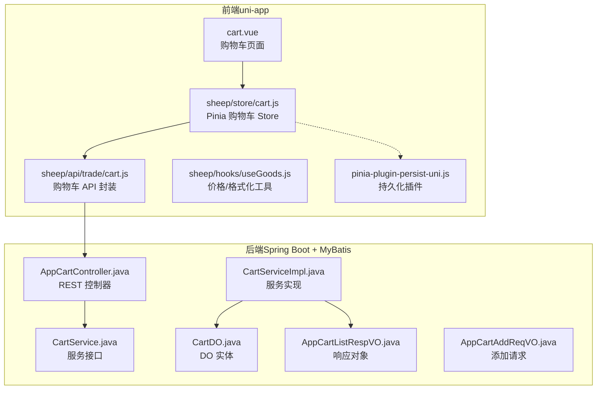
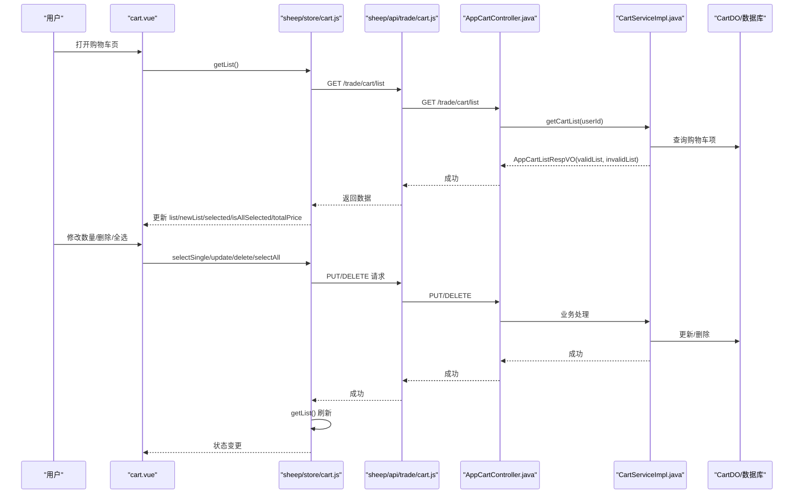
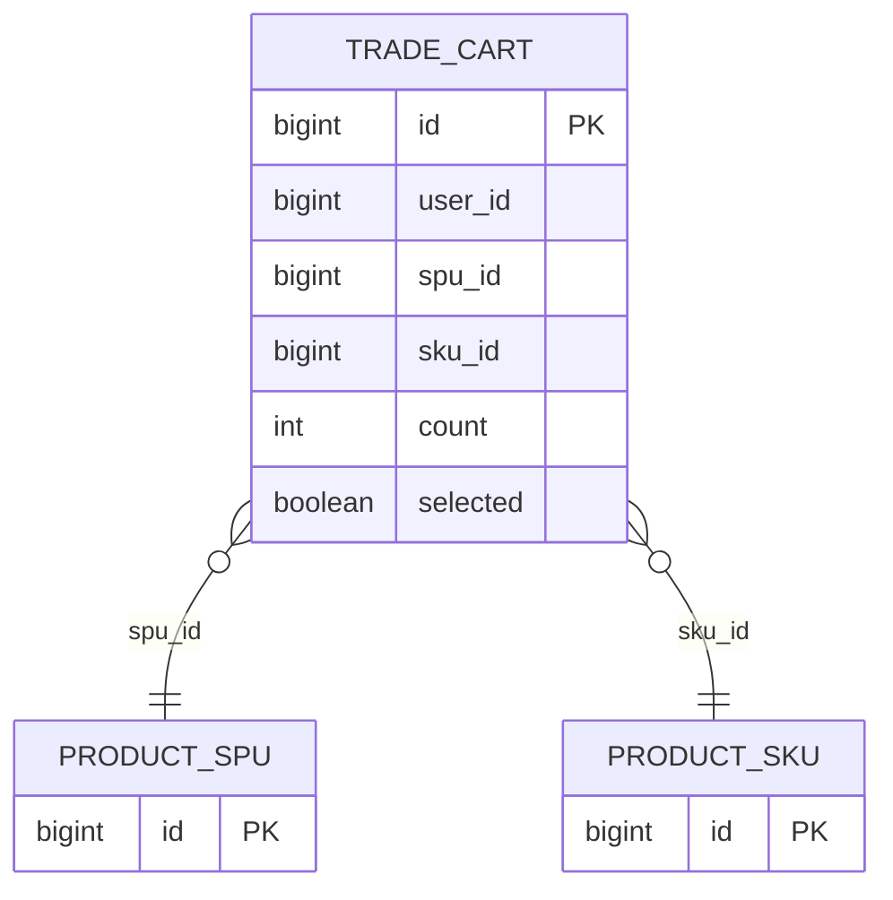
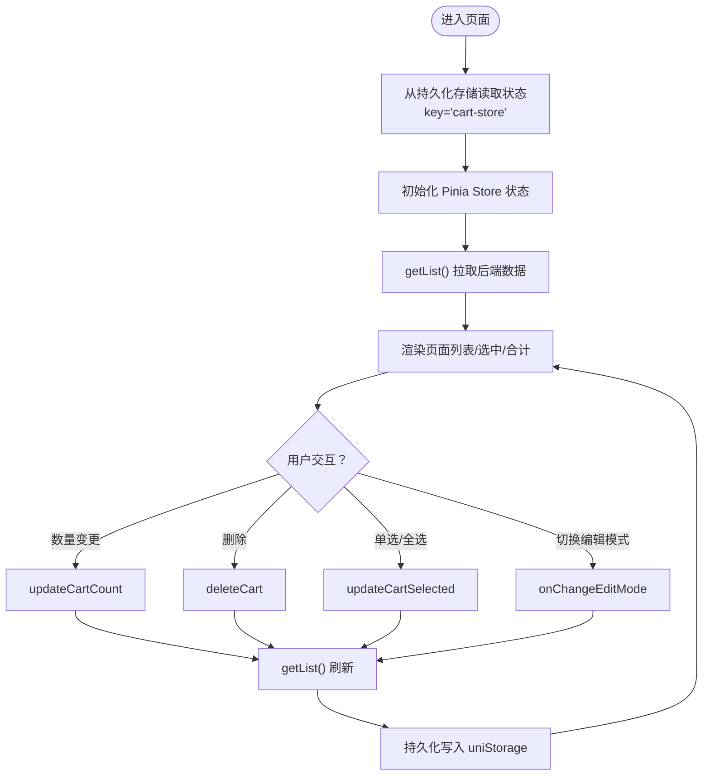
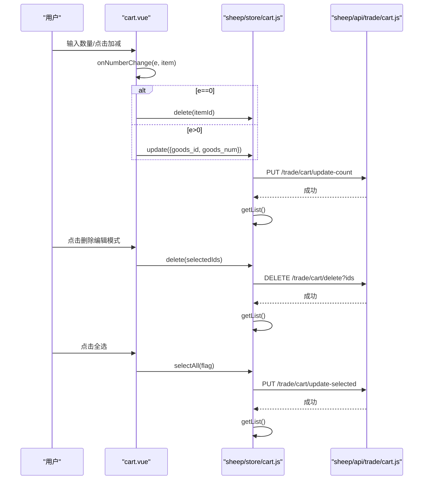
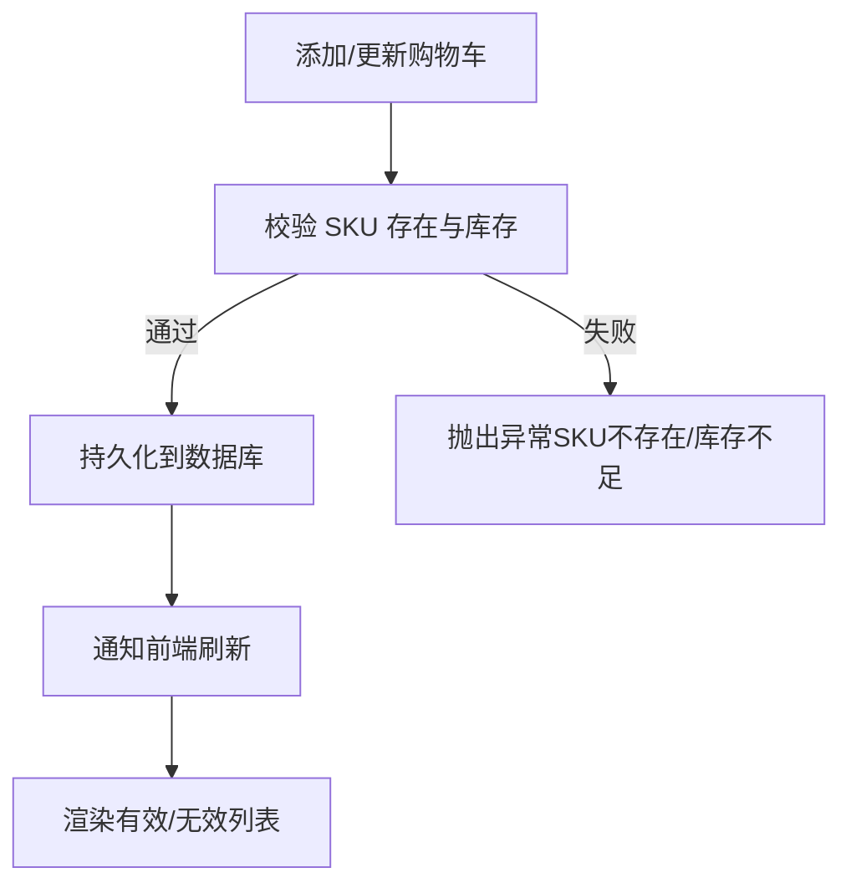
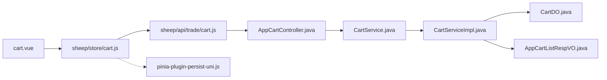

# 购物车功能

<cite>
**本文引用的文件**
- [cart.vue](file://frontend/mall-uniapp/pages/index/cart.vue)
- [cart.js（前端 Store）](file://frontend/mall-uniapp/sheep/store/cart.js)
- [cart.js（前端 API）](file://frontend/mall-uniapp/sheep/api/trade/cart.js)
- [useGoods.js（前端工具）](file://frontend/mall-uniapp/sheep/hooks/useGoods.js)
- [AppCartController.java（后端控制器）](file://backend/yudao-module-mall/yudao-module-trade/src/main/java/cn/iocoder/yudao/module/trade/controller/app/cart/AppCartController.java)
- [CartService.java（后端接口）](file://backend/yudao-module-mall/yudao-module-trade/src/main/java/cn/iocoder/yudao/module/trade/service/cart/CartService.java)
- [CartServiceImpl.java（后端实现）](file://backend/yudao-module-mall/yudao-module-trade/src/main/java/cn/iocoder/yudao/module/trade/service/cart/CartServiceImpl.java)
- [CartDO.java（后端实体）](file://backend/yudao-module-mall/yudao-module-trade/src/main/java/cn/iocoder/yudao/module/trade/dal/dataobject/cart/CartDO.java)
- [AppCartListRespVO.java（后端响应）](file://backend/yudao-module-mall/yudao-module-trade/src/main/java/cn/iocoder/yudao/module/trade/controller/app/cart/vo/AppCartListRespVO.java)
- [AppCartAddReqVO.java（后端请求）](file://backend/yudao-module-mall/yudao-module-trade/src/main/java/cn/iocoder/yudao/module/trade/controller/app/cart/vo/AppCartAddReqVO.java)
- [pinia-plugin-persist-uni.js（持久化实现）](file://frontend/mall-uniapp/unpackage/dist/cache/.vite/deps/pinia-plugin-persist-uni.js)
</cite>

## 目录
1. [简介](#简介)
2. [项目结构](#项目结构)
3. [核心组件](#核心组件)
4. [架构总览](#架构总览)
5. [详细组件分析](#详细组件分析)
6. [依赖关系分析](#依赖关系分析)
7. [性能考虑](#性能考虑)
8. [故障排查指南](#故障排查指南)
9. [结论](#结论)
10. [附录](#附录)

## 简介
本文件系统化梳理购物车功能的完整实现，覆盖数据模型设计、前后端交互协议、状态管理与本地持久化、页面展示与交互（列表、数量编辑、规格修改、删除、全选）、与商品详情的数据同步与库存检查、价格计算、批量操作、跨设备同步方案以及性能优化策略。目标是帮助开发者快速理解与扩展购物车能力。

## 项目结构
购物车相关代码分布在前端 uni-app 与后端 yudao 模块中，采用“页面 + Store + API + 后端控制器/服务/实体”的分层组织方式。

图表来源
- [cart.vue:1-316](file://frontend/mall-uniapp/pages/index/cart.vue#L1-L316)
- [cart.js（前端 Store）:1-122](file://frontend/mall-uniapp/sheep/store/cart.js#L1-L122)
- [cart.js（前端 API）:1-50](file://frontend/mall-uniapp/sheep/api/trade/cart.js#L1-L50)
- [useGoods.js（前端工具）:338-352](file://frontend/mall-uniapp/sheep/hooks/useGoods.js#L338-L352)
- [AppCartController.java（后端控制器）:1-80](file://backend/yudao-module-mall/yudao-module-trade/src/main/java/cn/iocoder/yudao/module/trade/controller/app/cart/AppCartController.java#L1-L80)
- [CartService.java（后端接口）:1-87](file://backend/yudao-module-mall/yudao-module-trade/src/main/java/cn/iocoder/yudao/module/trade/service/cart/CartService.java#L1-L87)
- [CartServiceImpl.java（后端实现）:1-197](file://backend/yudao-module-mall/yudao-module-trade/src/main/java/cn/iocoder/yudao/module/trade/service/cart/CartServiceImpl.java#L1-L197)
- [CartDO.java（后端实体）:1-58](file://backend/yudao-module-mall/yudao-module-trade/src/main/java/cn/iocoder/yudao/module/trade/dal/dataobject/cart/CartDO.java#L1-L58)
- [AppCartListRespVO.java（后端响应）:1-49](file://backend/yudao-module-mall/yudao-module-trade/src/main/java/cn/iocoder/yudao/module/trade/controller/app/cart/vo/AppCartListRespVO.java#L1-L49)
- [AppCartAddReqVO.java（后端请求）:1-22](file://backend/yudao-module-mall/yudao-module-trade/src/main/java/cn/iocoder/yudao/module/trade/controller/app/cart/vo/AppCartAddReqVO.java#L1-L22)
- [pinia-plugin-persist-uni.js（持久化实现）:1-62](file://frontend/mall-uniapp/unpackage/dist/cache/.vite/deps/pinia-plugin-persist-uni.js#L1-L62)

章节来源
- [cart.vue:1-316](file://frontend/mall-uniapp/pages/index/cart.vue#L1-L316)
- [cart.js（前端 Store）:1-122](file://frontend/mall-uniapp/sheep/store/cart.js#L1-L122)
- [cart.js（前端 API）:1-50](file://frontend/mall-uniapp/sheep/api/trade/cart.js#L1-L50)
- [useGoods.js（前端工具）:338-352](file://frontend/mall-uniapp/sheep/hooks/useGoods.js#L338-L352)
- [AppCartController.java（后端控制器）:1-80](file://backend/yudao-module-mall/yudao-module-trade/src/main/java/cn/iocoder/yudao/module/trade/controller/app/cart/AppCartController.java#L1-L80)
- [CartService.java（后端接口）:1-87](file://backend/yudao-module-mall/yudao-module-trade/src/main/java/cn/iocoder/yudao/module/trade/service/cart/CartService.java#L1-L87)
- [CartServiceImpl.java（后端实现）:1-197](file://backend/yudao-module-mall/yudao-module-trade/src/main/java/cn/iocoder/yudao/module/trade/service/cart/CartServiceImpl.java#L1-L197)
- [CartDO.java（后端实体）:1-58](file://backend/yudao-module-mall/yudao-module-trade/src/main/java/cn/iocoder/yudao/module/trade/dal/dataobject/cart/CartDO.java#L1-L58)
- [AppCartListRespVO.java（后端响应）:1-49](file://backend/yudao-module-mall/yudao-module-trade/src/main/java/cn/iocoder/yudao/module/trade/controller/app/cart/vo/AppCartListRespVO.java#L1-L49)
- [AppCartAddReqVO.java（后端请求）:1-22](file://backend/yudao-module-mall/yudao-module-trade/src/main/java/cn/iocoder/yudao/module/trade/controller/app/cart/vo/AppCartAddReqVO.java#L1-L22)
- [pinia-plugin-persist-uni.js（持久化实现）:1-62](file://frontend/mall-uniapp/unpackage/dist/cache/.vite/deps/pinia-plugin-persist-uni.js#L1-L62)

## 核心组件
- 前端页面：负责渲染购物车列表、数量编辑、规格查看、删除、全选、去结算等交互，并在页面显示总价与商品数量统计。
- 前端 Store：封装购物车状态（列表、选中集合、全选状态、总价、编辑模式）与动作（添加、更新、删除、单选、全选、清空、切换编辑模式、拉取列表）。
- 前端 API：对后端购物车接口进行封装，统一处理加载态与鉴权。
- 后端控制器：暴露 REST 接口，处理添加、更新数量、更新选中、重置、删除、查询数量、查询列表等。
- 后端服务：实现业务逻辑，包括 SKU 校验、库存检查、SPU 删除后的购物车项清理、列表组装（有效/无效分组）。
- 数据模型：后端以 CartDO 表示购物车项，包含用户、SPU、SKU、数量、选中状态等字段。

章节来源
- [cart.vue:1-316](file://frontend/mall-uniapp/pages/index/cart.vue#L1-L316)
- [cart.js（前端 Store）:1-122](file://frontend/mall-uniapp/sheep/store/cart.js#L1-L122)
- [cart.js（前端 API）:1-50](file://frontend/mall-uniapp/sheep/api/trade/cart.js#L1-L50)
- [AppCartController.java（后端控制器）:1-80](file://backend/yudao-module-mall/yudao-module-trade/src/main/java/cn/iocoder/yudao/module/trade/controller/app/cart/AppCartController.java#L1-L80)
- [CartServiceImpl.java（后端实现）:1-197](file://backend/yudao-module-mall/yudao-module-trade/src/main/java/cn/iocoder/yudao/module/trade/service/cart/CartServiceImpl.java#L1-L197)
- [CartDO.java（后端实体）:1-58](file://backend/yudao-module-mall/yudao-module-trade/src/main/java/cn/iocoder/yudao/module/trade/dal/dataobject/cart/CartDO.java#L1-L58)

## 架构总览
购物车从前端页面发起请求，Store 调用 API，后端控制器转发至服务层，服务层访问数据库与商品域接口进行校验与组装，最终返回给前端 Store 并驱动页面渲染。

图表来源
- [cart.vue:120-255](file://frontend/mall-uniapp/pages/index/cart.vue#L120-L255)
- [cart.js（前端 Store）:14-101](file://frontend/mall-uniapp/sheep/store/cart.js#L14-L101)
- [cart.js（前端 API）:3-47](file://frontend/mall-uniapp/sheep/api/trade/cart.js#L3-L47)
- [AppCartController.java（后端控制器）:32-77](file://backend/yudao-module-mall/yudao-module-trade/src/main/java/cn/iocoder/yudao/module/trade/controller/app/cart/AppCartController.java#L32-L77)
- [CartServiceImpl.java（后端实现）:133-154](file://backend/yudao-module-mall/yudao-module-trade/src/main/java/cn/iocoder/yudao/module/trade/service/cart/CartServiceImpl.java#L133-L154)

## 详细组件分析

### 数据模型设计
- 后端实体 CartDO：包含用户 ID、SPU ID、SKU ID、数量、选中状态等字段，作为购物车项的持久化载体。
- 响应对象 AppCartListRespVO：将购物车项与商品 SPU/SKU 组合，拆分为有效列表与无效列表，便于前端区分展示。
- 请求对象 AppCartAddReqVO：添加购物车时的输入参数（SKU 编号、数量）。

图表来源
- [CartDO.java（后端实体）:15-57](file://backend/yudao-module-mall/yudao-module-trade/src/main/java/cn/iocoder/yudao/module/trade/dal/dataobject/cart/CartDO.java#L15-L57)
- [AppCartListRespVO.java（后端响应）:24-46](file://backend/yudao-module-mall/yudao-module-trade/src/main/java/cn/iocoder/yudao/module/trade/controller/app/cart/vo/AppCartListRespVO.java#L24-L46)

章节来源
- [CartDO.java（后端实体）:1-58](file://backend/yudao-module-mall/yudao-module-trade/src/main/java/cn/iocoder/yudao/module/trade/dal/dataobject/cart/CartDO.java#L1-L58)
- [AppCartListRespVO.java（后端响应）:1-49](file://backend/yudao-module-mall/yudao-module-trade/src/main/java/cn/iocoder/yudao/module/trade/controller/app/cart/vo/AppCartListRespVO.java#L1-L49)
- [AppCartAddReqVO.java（后端请求）:1-22](file://backend/yudao-module-mall/yudao-module-trade/src/main/java/cn/iocoder/yudao/module/trade/controller/app/cart/vo/AppCartAddReqVO.java#L1-L22)

### 本地存储策略与状态管理
- 前端使用 Pinia Store 管理购物车状态，包含 list、selectedIds、isAllSelected、totalPriceSelected、newList、editMode 等。
- 通过 pinia-plugin-persist-uni 实现持久化，自动在 uniStorage 中读写指定 key 的状态，适配 uni-app 多端环境。
- Store 在每次关键操作（添加、更新、删除、全选）后调用 getList() 以保持与后端一致。

图表来源
- [cart.js（前端 Store）:14-101](file://frontend/mall-uniapp/sheep/store/cart.js#L14-L101)
- [cart.js（前端 Store）:111-119](file://frontend/mall-uniapp/sheep/store/cart.js#L111-L119)
- [pinia-plugin-persist-uni.js（持久化实现）:6-26](file://frontend/mall-uniapp/unpackage/dist/cache/.vite/deps/pinia-plugin-persist-uni.js#L6-L26)

章节来源
- [cart.js（前端 Store）:1-122](file://frontend/mall-uniapp/sheep/store/cart.js#L1-L122)
- [pinia-plugin-persist-uni.js（持久化实现）:1-62](file://frontend/mall-uniapp/unpackage/dist/cache/.vite/deps/pinia-plugin-persist-uni.js#L1-L62)

### 页面交互与功能实现
- 商品列表展示：页面遍历 state.list，按有效/无效状态显示不同样式；编辑模式下显示复选框与数量输入框。
- 数量编辑：su-number-box 绑定 item.count，触发 onNumberChange，当数量为 0 时执行删除，否则调用 updateCartCount。
- 规格修改：页面展示 SKU 属性文本，实际规格切换由商品详情页处理，此处仅展示当前规格。
- 删除操作：编辑模式下点击“删除”，调用 delete(ids) 批量删除。
- 全选功能：点击全选复选框，调用 selectAll(!isAllSelected)。
- 去结算：过滤选中项，组装提交参数，校验配送方式冲突后跳转订单确认页。

图表来源
- [cart.vue:231-247](file://frontend/mall-uniapp/pages/index/cart.vue#L231-L247)
- [cart.js（前端 Store）:56-101](file://frontend/mall-uniapp/sheep/store/cart.js#L56-L101)
- [cart.js（前端 API）:15-37](file://frontend/mall-uniapp/sheep/api/trade/cart.js#L15-L37)

章节来源
- [cart.vue:1-316](file://frontend/mall-uniapp/pages/index/cart.vue#L1-L316)
- [cart.js（前端 Store）:1-122](file://frontend/mall-uniapp/sheep/store/cart.js#L1-L122)
- [cart.js（前端 API）:1-50](file://frontend/mall-uniapp/sheep/api/trade/cart.js#L1-L50)

### 数据同步机制、库存检查与价格计算
- 数据同步：前端每次关键操作后调用 getList()，后端返回有效/无效分组，前端据此更新 UI。
- 库存检查：后端在添加/更新时校验 SKU 是否存在、库存是否充足；若 SPU 被删除则延迟删除对应购物车项。
- 价格计算：前端使用分转元工具函数展示合计价格；后端注释说明未来可扩展营销价计算（需前端配合）。

图表来源
- [CartServiceImpl.java（后端实现）:46-65](file://backend/yudao-module-mall/yudao-module-trade/src/main/java/cn/iocoder/yudao/module/trade/service/cart/CartServiceImpl.java#L46-L65)
- [CartServiceImpl.java（后端实现）:67-80](file://backend/yudao-module-mall/yudao-module-trade/src/main/java/cn/iocoder/yudao/module/trade/service/cart/CartServiceImpl.java#L67-L80)
- [CartServiceImpl.java（后端实现）:185-194](file://backend/yudao-module-mall/yudao-module-trade/src/main/java/cn/iocoder/yudao/module/trade/service/cart/CartServiceImpl.java#L185-L194)

章节来源
- [CartServiceImpl.java（后端实现）:1-197](file://backend/yudao-module-mall/yudao-module-trade/src/main/java/cn/iocoder/yudao/module/trade/service/cart/CartServiceImpl.java#L1-L197)
- [useGoods.js（前端工具）:338-352](file://frontend/mall-uniapp/sheep/hooks/useGoods.js#L338-L352)

### 购物车与商品详情的数据同步
- 商品详情页的规格选择会改变 SKU，但购物车页面展示的是当前购物车项的 SKU 属性文本；若商品状态变化（下架/无库存），页面以遮罩提示并禁用编辑。
- 后端在拉取列表时会查询 SPU/SKU 并清理已删除 SPU 的购物车项，确保数据一致性。

章节来源
- [cart.vue:38-67](file://frontend/mall-uniapp/pages/index/cart.vue#L38-L67)
- [CartServiceImpl.java（后端实现）:133-154](file://backend/yudao-module-mall/yudao-module-trade/src/main/java/cn/iocoder/yudao/module/trade/service/cart/CartServiceImpl.java#L133-L154)

### 跨设备同步方案
- 当前实现基于用户维度的后端数据库存储，前端通过登录态与后端交互，保证同一账号在不同设备上的购物车数据一致。
- 若需进一步增强体验，可在登录态切换时触发一次强制拉取，或在应用启动时预热购物车数据。

章节来源
- [cart.js（前端 API）:38-47](file://frontend/mall-uniapp/sheep/api/trade/cart.js#L38-L47)
- [AppCartController.java（后端控制器）:73-77](file://backend/yudao-module-mall/yudao-module-trade/src/main/java/cn/iocoder/yudao/module/trade/controller/app/cart/AppCartController.java#L73-L77)

## 依赖关系分析
- 前端页面依赖 Store 与工具函数；Store 依赖 API；API 依赖后端控制器；控制器依赖服务接口；服务实现依赖 Mapper 与商品域 API；服务实现依赖 DO 与响应对象。
- 前端持久化依赖 pinia-plugin-persist-uni，适配 uniStorage。

图表来源
- [cart.vue:1-316](file://frontend/mall-uniapp/pages/index/cart.vue#L1-L316)
- [cart.js（前端 Store）:1-122](file://frontend/mall-uniapp/sheep/store/cart.js#L1-L122)
- [cart.js（前端 API）:1-50](file://frontend/mall-uniapp/sheep/api/trade/cart.js#L1-L50)
- [AppCartController.java（后端控制器）:1-80](file://backend/yudao-module-mall/yudao-module-trade/src/main/java/cn/iocoder/yudao/module/trade/controller/app/cart/AppCartController.java#L1-L80)
- [CartService.java（后端接口）:1-87](file://backend/yudao-module-mall/yudao-module-trade/src/main/java/cn/iocoder/yudao/module/trade/service/cart/CartService.java#L1-L87)
- [CartServiceImpl.java（后端实现）:1-197](file://backend/yudao-module-mall/yudao-module-trade/src/main/java/cn/iocoder/yudao/module/trade/service/cart/CartServiceImpl.java#L1-L197)
- [CartDO.java（后端实体）:1-58](file://backend/yudao-module-mall/yudao-module-trade/src/main/java/cn/iocoder/yudao/module/trade/dal/dataobject/cart/CartDO.java#L1-L58)
- [AppCartListRespVO.java（后端响应）:1-49](file://backend/yudao-module-mall/yudao-module-trade/src/main/java/cn/iocoder/yudao/module/trade/controller/app/cart/vo/AppCartListRespVO.java#L1-L49)
- [pinia-plugin-persist-uni.js（持久化实现）:1-62](file://frontend/mall-uniapp/unpackage/dist/cache/.vite/deps/pinia-plugin-persist-uni.js#L1-L62)

章节来源
- [cart.js（前端 Store）:1-122](file://frontend/mall-uniapp/sheep/store/cart.js#L1-L122)
- [cart.js（前端 API）:1-50](file://frontend/mall-uniapp/sheep/api/trade/cart.js#L1-L50)
- [AppCartController.java（后端控制器）:1-80](file://backend/yudao-module-mall/yudao-module-trade/src/main/java/cn/iocoder/yudao/module/trade/controller/app/cart/AppCartController.java#L1-L80)
- [CartServiceImpl.java（后端实现）:1-197](file://backend/yudao-module-mall/yudao-module-trade/src/main/java/cn/iocoder/yudao/module/trade/service/cart/CartServiceImpl.java#L1-L197)

## 性能考虑
- 列表渲染优化：前端按有效/无效分组渲染，避免一次性渲染大量节点；建议在大数据量时启用虚拟滚动（如 z-paging）。
- 网络请求优化：后端接口 GET /trade/cart/list 已关闭默认 loading，前端无需重复加载提示；建议在切换页面或切后台时减少不必要的刷新。
- 计算优化：前端总价计算在 Store 初始化时一次性完成，避免在渲染中重复计算；建议对大列表采用懒计算策略。
- 数据一致性：频繁更新时先本地乐观更新，再拉取最新列表，降低卡顿感。
- 库存与状态校验：后端在添加/更新时严格校验 SKU 与库存，避免前端误操作导致的无效请求。

## 故障排查指南
- 添加失败：检查 SKU 是否存在、库存是否充足；关注后端异常码（SKU 不存在、库存不足）。
- 更新失败：确认购物车项是否存在（CARD_ITEM_NOT_FOUND）。
- 删除失败：确认传入的 ids 是否属于当前用户。
- 配送方式冲突：结算前校验选中商品的配送方式交集，若无交集则阻止提交。
- 价格显示异常：确认使用分转元工具函数，避免整型除法精度问题。

章节来源
- [CartServiceImpl.java（后端实现）:185-194](file://backend/yudao-module-mall/yudao-module-trade/src/main/java/cn/iocoder/yudao/module/trade/service/cart/CartServiceImpl.java#L185-L194)
- [cart.vue:184-199](file://frontend/mall-uniapp/pages/index/cart.vue#L184-L199)

## 结论
购物车功能通过前后端清晰的职责划分与一致的状态管理，实现了稳定的商品列表展示、数量编辑、规格查看、删除与全选等核心能力。后端在 SKU 校验与 SPU 删除后的清理保障了数据一致性，前端通过持久化与乐观更新提升了用户体验。后续可扩展营销价计算、虚拟列表与缓存策略以进一步提升性能与体验。

## 附录
- 常用接口清单
  - 添加购物车：POST /trade/cart/add
  - 更新数量：PUT /trade/cart/update-count
  - 更新选中：PUT /trade/cart/update-selected
  - 删除购物车：DELETE /trade/cart/delete?ids
  - 查询数量：GET /trade/cart/get-count
  - 查询列表：GET /trade/cart/list

章节来源
- [cart.js（前端 API）:3-47](file://frontend/mall-uniapp/sheep/api/trade/cart.js#L3-L47)
- [AppCartController.java（后端控制器）:32-77](file://backend/yudao-module-mall/yudao-module-trade/src/main/java/cn/iocoder/yudao/module/trade/controller/app/cart/AppCartController.java#L32-L77)