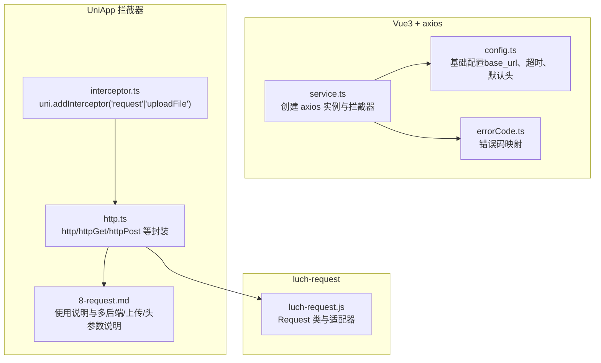
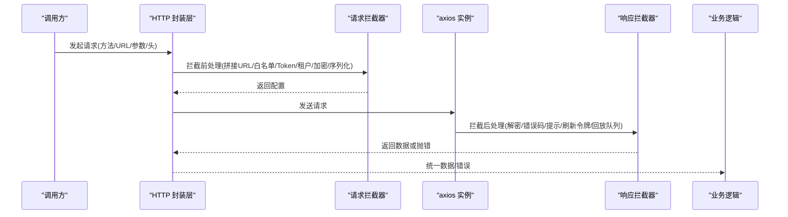
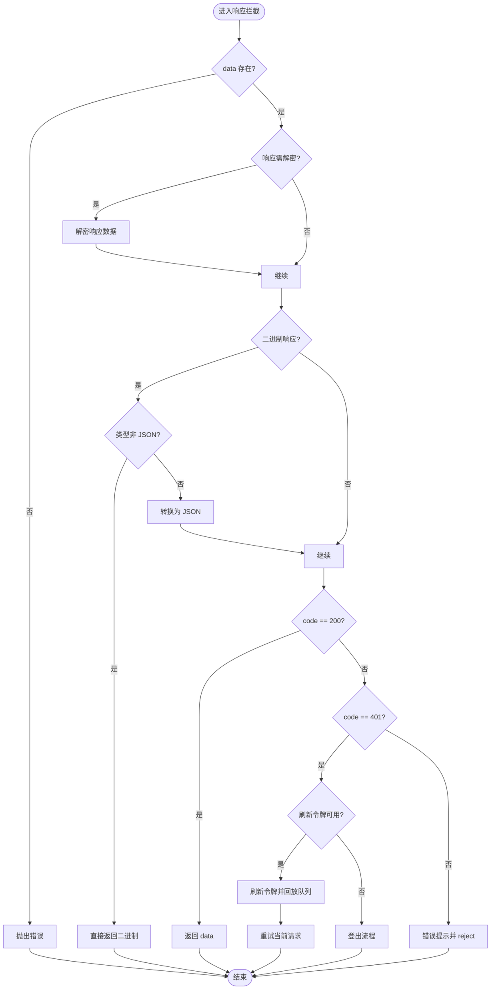
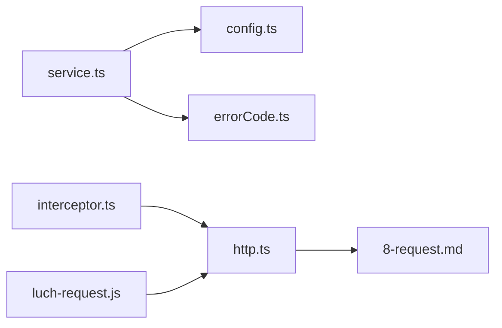

# HTTP 请求拦截

<cite>
**本文引用的文件**
- [service.ts](file://frontend/admin-vue3/src/config/axios/service.ts)
- [config.ts](file://frontend/admin-vue3/src/config/axios/config.ts)
- [errorCode.ts](file://frontend/admin-vue3/src/config/axios/errorCode.ts)
- [interceptor.ts](file://frontend/admin-uniapp/src/http/interceptor.ts)
- [http.ts](file://frontend/admin-uniapp/src/http/http.ts)
- [8-request.md](file://frontend/admin-uniapp/docs/base/8-request.md)
- [luch-request.js](file://frontend/mall-uniapp/unpackage/dist/cache/.vite/deps/luch-request.js)
</cite>

## 目录
1. [简介](#简介)
2. [项目结构](#项目结构)
3. [核心组件](#核心组件)
4. [架构总览](#架构总览)
5. [组件详解](#组件详解)
6. [依赖关系分析](#依赖关系分析)
7. [性能与移动端特性](#性能与移动端特性)
8. [故障排查指南](#故障排查指南)
9. [结论](#结论)
10. [附录](#附录)

## 简介
本文件系统化梳理前端 HTTP 请求拦截体系，覆盖基于 axios 的请求/响应拦截、Token 自动注入、请求签名（加密）、参数序列化、响应数据格式化、错误码处理、无感刷新令牌、并发与队列、以及移动端网络特性与性能优化策略。文档同时给出 API 调用规范、调试技巧与常见问题排查建议。

## 项目结构
本仓库包含两套主要的前端实现：
- Vue3 + axios 版本：位于 frontend/admin-vue3，采用 axios 拦截器统一处理请求与响应。
- UniApp 版本：位于 frontend/admin-uniapp，采用 uni.addInterceptor 对 request/uploadFile 进行拦截；另有 mall-uniapp 使用 luch-request 库作为请求适配层。

图表来源
- [service.ts:1-274](file://frontend/admin-vue3/src/config/axios/service.ts#L1-L274)
- [config.ts:1-29](file://frontend/admin-vue3/src/config/axios/config.ts#L1-L29)
- [errorCode.ts:1-7](file://frontend/admin-vue3/src/config/axios/errorCode.ts#L1-L7)
- [interceptor.ts:1-105](file://frontend/admin-uniapp/src/http/interceptor.ts#L1-L105)
- [http.ts:165-223](file://frontend/admin-uniapp/src/http/http.ts#L165-L223)
- [8-request.md:1-253](file://frontend/admin-uniapp/docs/base/8-request.md#L1-L253)
- [luch-request.js:513-626](file://frontend/mall-uniapp/unpackage/dist/cache/.vite/deps/luch-request.js#L513-L626)

章节来源
- [service.ts:1-274](file://frontend/admin-vue3/src/config/axios/service.ts#L1-L274)
- [interceptor.ts:1-105](file://frontend/admin-uniapp/src/http/interceptor.ts#L1-L105)
- [http.ts:165-223](file://frontend/admin-uniapp/src/http/http.ts#L165-L223)
- [8-request.md:1-253](file://frontend/admin-uniapp/docs/base/8-request.md#L1-L253)
- [luch-request.js:513-626](file://frontend/mall-uniapp/unpackage/dist/cache/.vite/deps/luch-request.js#L513-L626)

## 核心组件
- axios 实例与拦截器：负责 Token 注入、租户头、GET 缓存禁用、POST 表单序列化、请求/响应加解密、错误码映射与统一提示、无感刷新令牌、并发队列等。
- UniApp 拦截器：对原生 uni.request/uni.uploadFile 进行拦截，完成 URL 拼接、白名单、Token/租户头、加密、超时等处理。
- luch-request：提供 Request 类与多种方法（get/post/put/delete 等），内部通过适配器与拦截器链路实现请求编排。
- 配置与错误码：集中管理基础 URL、超时、默认头、错误码映射。

章节来源
- [service.ts:38-108](file://frontend/admin-vue3/src/config/axios/service.ts#L38-L108)
- [interceptor.ts:18-95](file://frontend/admin-uniapp/src/http/interceptor.ts#L18-L95)
- [luch-request.js:513-626](file://frontend/mall-uniapp/unpackage/dist/cache/.vite/deps/luch-request.js#L513-L626)

## 架构总览

图表来源
- [service.ts:49-241](file://frontend/admin-vue3/src/config/axios/service.ts#L49-L241)
- [interceptor.ts:19-95](file://frontend/admin-uniapp/src/http/interceptor.ts#L19-L95)

## 组件详解

### axios 请求拦截（Token/租户/加密/序列化）
- Token 注入：根据白名单判断是否附加 Authorization 头。
- 租户头：开启租户功能时，自动附加 tenant-id；登录场景附加 visit-tenant-id。
- GET 缓存禁用：强制添加 Cache-Control/Pragma。
- POST 表单序列化：当 Content-Type 为 application/x-www-form-urlencoded 时，将对象序列化为字符串。
- 请求加密：当 isEncrypt=true 且未加密时，对 data 加密并设置加密标识头。
- 参数序列化：全局 paramsSerializer 使用 qs.stringify 支持嵌套键。

章节来源
- [service.ts:49-108](file://frontend/admin-vue3/src/config/axios/service.ts#L49-L108)
- [config.ts:44-46](file://frontend/admin-vue3/src/config/axios/config.ts#L44-L46)

### axios 响应拦截（解密/错误码/提示/刷新令牌/回放）
- 响应解密：若响应头含加密标识，对字符串响应进行解密。
- 二进制处理：对 blob/arraybuffer 做类型判断，避免误下载 JSON。
- 错误码映射：根据 data.code 或默认码映射提示，忽略特定消息。
- 401 无感刷新：存在刷新令牌时，进入刷新流程，回放队列请求并重试当前请求；失败则引导登出。
- 其他错误：网络错误、超时、状态码失败统一提示。
- 回放队列：并发请求时，统一等待刷新完成后再回放。

图表来源
- [service.ts:110-241](file://frontend/admin-vue3/src/config/axios/service.ts#L110-L241)

章节来源
- [service.ts:110-241](file://frontend/admin-vue3/src/config/axios/service.ts#L110-L241)

### UniApp 请求拦截（URL/Token/租户/加密/超时）
- URL 拼接：非 http 开头时，按环境变量拼接基础地址；H5 可启用代理前缀。
- 白名单：对登录/刷新令牌等接口跳过 Token 注入。
- 租户头：开启租户时附加 tenant-id。
- 加密：同 axios，对 data 加密并设置加密标识头。
- 超时：统一设置为 60s。
- 上传：对 uploadFile 同样生效。

章节来源
- [interceptor.ts:19-95](file://frontend/admin-uniapp/src/http/interceptor.ts#L19-L95)

### HTTP 封装与 API 调用规范
- 统一封装：http/httpGet/httpPost/httpPut/httpDelete，支持 query/header/options 扩展。
- 多后端：通过路径前缀映射到不同服务，拦截器内匹配替换。
- 上传：使用 uploadFile，配合 VITE_UPLOAD_BASEURL。
- 头参数：支持在调用时传入 header，覆盖默认行为。

章节来源
- [http.ts:165-223](file://frontend/admin-uniapp/src/http/http.ts#L165-L223)
- [8-request.md:134-189](file://frontend/admin-uniapp/docs/base/8-request.md#L134-L189)

### luch-request 请求适配
- Request 类：提供 request/get/post/put/delete 等方法，内部通过 middleware 链路调度。
- 适配器：底层适配不同运行环境（H5/小程序/App）。
- 超时/头/响应类型：支持全局配置与单次覆盖。

章节来源
- [luch-request.js:513-626](file://frontend/mall-uniapp/unpackage/dist/cache/.vite/deps/luch-request.js#L513-L626)

## 依赖关系分析

图表来源
- [service.ts:1-19](file://frontend/admin-vue3/src/config/axios/service.ts#L1-L19)
- [config.ts:1-6](file://frontend/admin-vue3/src/config/axios/config.ts#L1-L6)
- [errorCode.ts:1-7](file://frontend/admin-vue3/src/config/axios/errorCode.ts#L1-L7)
- [interceptor.ts:1-6](file://frontend/admin-uniapp/src/http/interceptor.ts#L1-L6)
- [http.ts:165-223](file://frontend/admin-uniapp/src/http/http.ts#L165-L223)
- [8-request.md:1-10](file://frontend/admin-uniapp/docs/base/8-request.md#L1-L10)
- [luch-request.js:513-626](file://frontend/mall-uniapp/unpackage/dist/cache/.vite/deps/luch-request.js#L513-L626)

章节来源
- [service.ts:1-274](file://frontend/admin-vue3/src/config/axios/service.ts#L1-L274)
- [interceptor.ts:1-105](file://frontend/admin-uniapp/src/http/interceptor.ts#L1-L105)
- [http.ts:165-223](file://frontend/admin-uniapp/src/http/http.ts#L165-L223)
- [8-request.md:1-253](file://frontend/admin-uniapp/docs/base/8-request.md#L1-L253)
- [luch-request.js:513-626](file://frontend/mall-uniapp/unpackage/dist/cache/.vite/deps/luch-request.js#L513-L626)

## 性能与移动端特性
- 超时控制：axios 默认 30s，UniApp 拦截器统一 60s；可根据接口特性在调用时覆盖。
- GET 缓存禁用：防止浏览器缓存 GET 响应，保证数据一致性。
- 二进制响应：对 blob/arraybuffer 做类型判断，避免误下载 JSON。
- 无感刷新令牌：并发请求时统一排队，刷新完成后回放，减少重复鉴权开销。
- 移动端网络特性：拦截器支持 H5/小程序/App 不同环境的 URL 拼接与代理前缀切换；luch-request 提供统一适配。
- 参数序列化：使用 qs.stringify 支持嵌套键，提升复杂参数传输稳定性。

章节来源
- [config.ts:18-25](file://frontend/admin-vue3/src/config/axios/config.ts#L18-L25)
- [service.ts:72-86](file://frontend/admin-vue3/src/config/axios/service.ts#L72-L86)
- [service.ts:137-147](file://frontend/admin-vue3/src/config/axios/service.ts#L137-L147)
- [interceptor.ts:32-48](file://frontend/admin-uniapp/src/http/interceptor.ts#L32-L48)
- [luch-request.js:513-626](file://frontend/mall-uniapp/unpackage/dist/cache/.vite/deps/luch-request.js#L513-L626)

## 故障排查指南
- 401 未认证
  - 现象：频繁弹出重新登录。
  - 排查：确认刷新令牌是否存在；查看刷新流程是否成功；检查 isRefreshToken 队列是否正确回放。
- 网络错误/超时
  - 现象：提示网络错误或超时。
  - 排查：检查环境变量与代理配置；适当提高超时；确认后端可达性。
- 错误码提示异常
  - 现象：提示信息不符合预期。
  - 排查：核对 errorCode 映射；确认接口返回字段 code/msg；忽略列表是否命中。
- 上传失败
  - 现象：上传接口报错。
  - 排查：确认 VITE_UPLOAD_BASEURL；检查 header 中 Content-Type；确保拦截器对 uploadFile 生效。
- 多后端地址
  - 现象：请求地址拼接错误。
  - 排查：确认路径前缀映射；拦截器内是否正确替换；调用时是否去掉多余前缀。

章节来源
- [service.ts:154-241](file://frontend/admin-vue3/src/config/axios/service.ts#L154-L241)
- [interceptor.ts:12-16](file://frontend/admin-uniapp/src/http/interceptor.ts#L12-L16)
- [8-request.md:134-189](file://frontend/admin-uniapp/docs/base/8-request.md#L134-L189)

## 结论
本项目在 Vue3 与 UniApp 场景下提供了完善的 HTTP 请求拦截体系：统一的 Token/租户注入、参数序列化、请求/响应加解密、错误码映射与提示、无感刷新令牌与并发回放队列。结合 luch-request 的适配能力，满足多端与多后端场景需求。建议在实际使用中：
- 明确白名单与加密开关；
- 合理设置超时与缓存策略；
- 在多后端场景下规范路径前缀；
- 对关键接口做好错误码与国际化提示。

## 附录

### API 调用规范
- 统一入口：http/httpGet/httpPost/httpPut/httpDelete。
- 参数：支持 query、header、自定义 options。
- 多后端：通过路径前缀映射；拦截器内替换为真实地址。
- 上传：使用 uploadFile，配置 VITE_UPLOAD_BASEURL。

章节来源
- [http.ts:165-223](file://frontend/admin-uniapp/src/http/http.ts#L165-L223)
- [8-request.md:134-189](file://frontend/admin-uniapp/docs/base/8-request.md#L134-L189)

### 错误码处理
- 默认码：200 表示成功。
- 常见码：401（未认证）、500（服务器错误）、901（特殊提示）。
- 忽略列表：对特定提示直接 reject，避免重复交互。

章节来源
- [config.ts:13-15](file://frontend/admin-vue3/src/config/axios/config.ts#L13-L15)
- [errorCode.ts:1-7](file://frontend/admin-vue3/src/config/axios/errorCode.ts#L1-L7)
- [service.ts:148-154](file://frontend/admin-vue3/src/config/axios/service.ts#L148-L154)

### 调试技巧
- 打印拦截器日志：在拦截器回调中输出 config/headers/url/data。
- 国际化提示：统一使用 i18n 文案，便于定位问题。
- 网络面板：对比请求头、响应头与状态码，确认加密标识与二进制类型。
- 刷新流程：观察 isRefreshToken 与 requestList 队列行为，确保回放成功。

章节来源
- [service.ts:103-107](file://frontend/admin-vue3/src/config/axios/service.ts#L103-L107)
- [service.ts:227-241](file://frontend/admin-vue3/src/config/axios/service.ts#L227-L241)