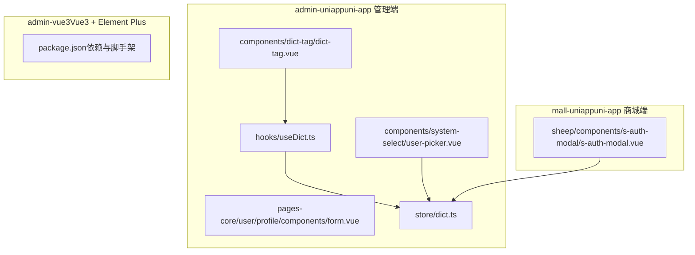
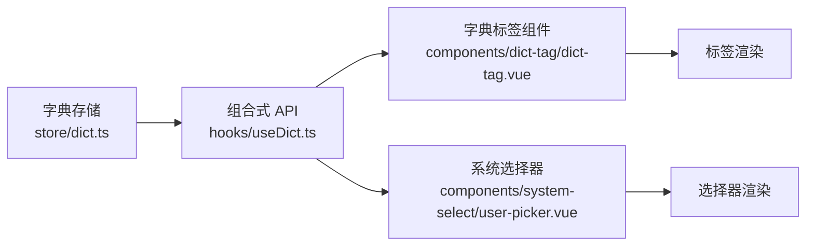
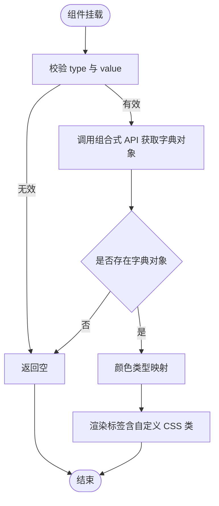
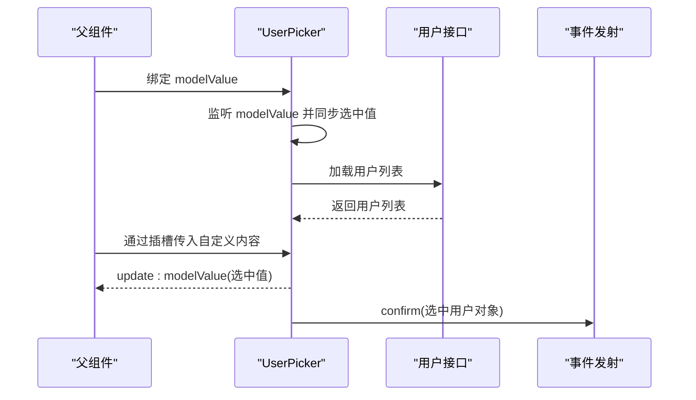
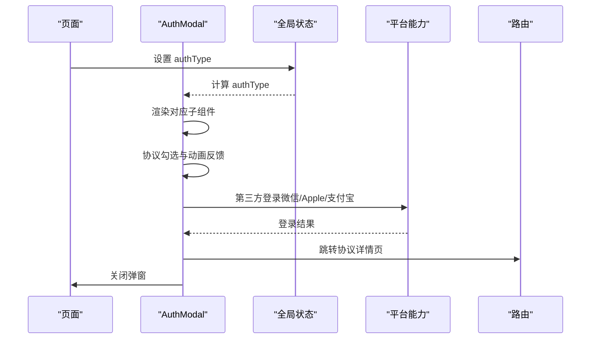
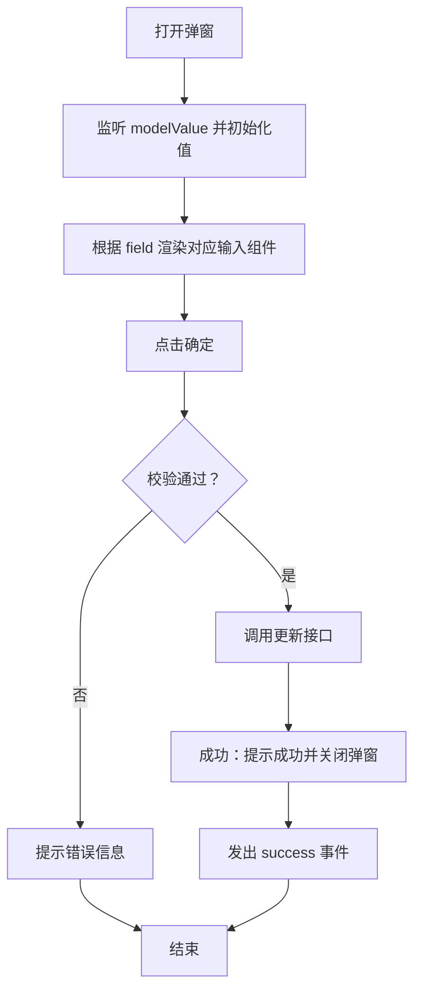
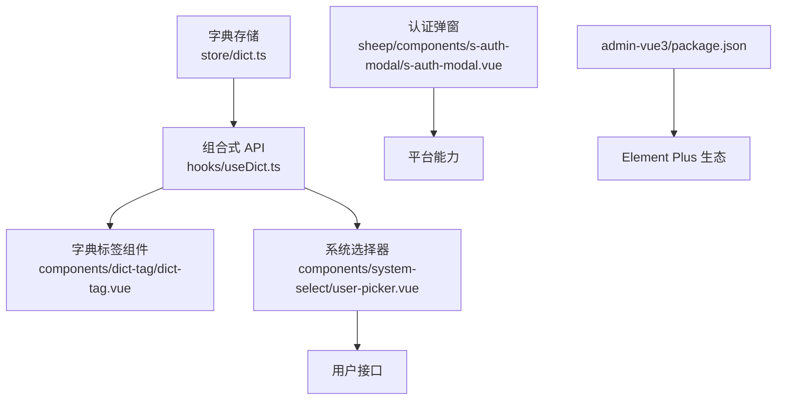

# UI 组件库

<cite>
**本文引用的文件**
- [dict-tag.vue](file://frontend/admin-uniapp/src/components/dict-tag/dict-tag.vue)
- [user-picker.vue](file://frontend/admin-uniapp/src/components/system-select/user-picker.vue)
- [s-auth-modal.vue](file://frontend/mall-uniapp/sheep/components/s-auth-modal/s-auth-modal.vue)
- [form.vue](file://frontend/admin-uniapp/src/pages-core/user/profile/components/form.vue)
- [useDict.ts](file://frontend/admin-uniapp/src/hooks/useDict.ts)
- [dict.ts](file://frontend/admin-uniapp/src/store/dict.ts)
- [uni.scss](file://frontend/admin-uniapp/src/uni.scss)
- [package.json](file://frontend/admin-vue3/package.json)
</cite>

## 目录
1. [简介](#简介)
2. [项目结构](#项目结构)
3. [核心组件](#核心组件)
4. [架构总览](#架构总览)
5. [组件详解](#组件详解)
6. [依赖关系分析](#依赖关系分析)
7. [性能考量](#性能考量)
8. [故障排查指南](#故障排查指南)
9. [结论](#结论)
10. [附录](#附录)

## 简介
本文件面向 UI 组件库的使用者与维护者，系统化梳理并文档化以下组件的设计理念与实现方式：
- 字典标签组件：将后端字典类型与值映射为可渲染的标签，支持颜色与样式类透传。
- 系统选择器：封装用户选择器，支持单选/多选、远程加载、插槽扩展与事件回传。
- 弹窗组件：统一认证弹窗容器，按授权类型动态切换子页面，集成协议与第三方登录流程。
- 表单组件：底部弹出式编辑表单，内嵌多种字段类型的输入与校验。

文档还覆盖组件属性、事件处理、插槽使用、样式定制；移动端 UI 适配、响应式设计与跨平台兼容性；组件复用模式、组合式 API 使用与性能优化；以及组件开发规范、测试策略与文档编写指南。

## 项目结构
该仓库包含多个前端工程，其中与 UI 组件库最相关的是：
- admin-uniapp：基于 uni-app 的管理端前端，包含字典标签、系统选择器、表单弹窗等组件与示例。
- mall-uniapp：基于 uni-app 的商城前端，包含认证弹窗等组件。
- admin-vue3：基于 Vue3 + Element Plus 的管理端前端，包含字典标签等组件的另一套实现，便于对比与迁移。

**图表来源**
- [dict-tag.vue:1-63](file://frontend/admin-uniapp/src/components/dict-tag/dict-tag.vue#L1-L63)
- [user-picker.vue:1-117](file://frontend/admin-uniapp/src/components/system-select/user-picker.vue#L1-L117)
- [form.vue:1-149](file://frontend/admin-uniapp/src/pages-core/user/profile/components/form.vue#L1-L149)
- [useDict.ts:1-133](file://frontend/admin-uniapp/src/hooks/useDict.ts#L1-L133)
- [dict.ts:1-87](file://frontend/admin-uniapp/src/store/dict.ts#L1-L87)
- [s-auth-modal.vue:1-314](file://frontend/mall-uniapp/sheep/components/s-auth-modal/s-auth-modal.vue#L1-L314)
- [package.json:1-160](file://frontend/admin-vue3/package.json#L1-L160)

**章节来源**
- [dict-tag.vue:1-63](file://frontend/admin-uniapp/src/components/dict-tag/dict-tag.vue#L1-L63)
- [user-picker.vue:1-117](file://frontend/admin-uniapp/src/components/system-select/user-picker.vue#L1-L117)
- [form.vue:1-149](file://frontend/admin-uniapp/src/pages-core/user/profile/components/form.vue#L1-L149)
- [useDict.ts:1-133](file://frontend/admin-uniapp/src/hooks/useDict.ts#L1-L133)
- [dict.ts:1-87](file://frontend/admin-uniapp/src/store/dict.ts#L1-L87)
- [s-auth-modal.vue:1-314](file://frontend/mall-uniapp/sheep/components/s-auth-modal/s-auth-modal.vue#L1-L314)
- [package.json:1-160](file://frontend/admin-vue3/package.json#L1-L160)

## 核心组件
- 字典标签组件：根据字典类型与值获取标签文本、颜色类型与自定义 CSS 类，最终渲染为标签组件。
- 系统选择器：封装用户列表选择器，支持单选/多选、远程加载、插槽扩展与 confirm 事件回传。
- 弹窗组件：统一认证弹窗容器，按授权类型动态渲染子组件，处理协议展示与第三方登录。
- 表单组件：底部弹出式编辑表单，内嵌多种字段类型的输入与校验逻辑。

**章节来源**
- [dict-tag.vue:1-63](file://frontend/admin-uniapp/src/components/dict-tag/dict-tag.vue#L1-L63)
- [user-picker.vue:1-117](file://frontend/admin-uniapp/src/components/system-select/user-picker.vue#L1-L117)
- [s-auth-modal.vue:1-314](file://frontend/mall-uniapp/sheep/components/s-auth-modal/s-auth-modal.vue#L1-L314)
- [form.vue:1-149](file://frontend/admin-uniapp/src/pages-core/user/profile/components/form.vue#L1-L149)

## 架构总览
组件库围绕“字典数据层 + 组合式 API + 业务组件”的三层架构组织：
- 字典数据层：通过 store 缓存字典数据，提供按类型查询与按值匹配的方法。
- 组合式 API：提供获取字典标签、字典选项与对象的方法，供组件与页面使用。
- 业务组件：以组合式 API 为核心，完成渲染、交互与事件回传。

**图表来源**
- [dict.ts:1-87](file://frontend/admin-uniapp/src/store/dict.ts#L1-L87)
- [useDict.ts:1-133](file://frontend/admin-uniapp/src/hooks/useDict.ts#L1-L133)
- [dict-tag.vue:1-63](file://frontend/admin-uniapp/src/components/dict-tag/dict-tag.vue#L1-L63)
- [user-picker.vue:1-117](file://frontend/admin-uniapp/src/components/system-select/user-picker.vue#L1-L117)

## 组件详解

### 字典标签组件（DictTag）
- 设计理念
  - 将后端字典类型与值映射为前端可渲染的标签，支持颜色类型与自定义 CSS 类透传，提升一致性与可维护性。
  - 对接组合式 API，避免重复查询与计算。
- 关键属性
  - type：字典类型（必填）
  - value：字典值（必填）
  - plain：是否镂空（可选，默认 true）
- 关键行为
  - 参数校验：type 为空或 value 为 undefined/null 时返回空。
  - 字典查询：通过组合式 API 获取字典对象。
  - 颜色映射：后端颜色类型到标签组件类型的映射，不匹配时回退为默认类型。
  - 渲染：若存在字典对象则渲染标签，否则不显示。
- 插槽与样式
  - 通过自定义 CSS 类实现样式定制。
- 事件
  - 无对外事件，仅内部渲染控制。
- 使用示例路径
  - [字典标签组件:1-63](file://frontend/admin-uniapp/src/components/dict-tag/dict-tag.vue#L1-L63)
  - [组合式 API（获取字典对象）:42-46](file://frontend/admin-uniapp/src/hooks/useDict.ts#L42-L46)
  - [字典存储（按类型/值查询）:59-66](file://frontend/admin-uniapp/src/store/dict.ts#L59-L66)

**图表来源**
- [dict-tag.vue:34-50](file://frontend/admin-uniapp/src/components/dict-tag/dict-tag.vue#L34-L50)
- [useDict.ts:42-46](file://frontend/admin-uniapp/src/hooks/useDict.ts#L42-L46)
- [dict.ts:59-66](file://frontend/admin-uniapp/src/store/dict.ts#L59-L66)

**章节来源**
- [dict-tag.vue:1-63](file://frontend/admin-uniapp/src/components/dict-tag/dict-tag.vue#L1-L63)
- [useDict.ts:1-133](file://frontend/admin-uniapp/src/hooks/useDict.ts#L1-L133)
- [dict.ts:1-87](file://frontend/admin-uniapp/src/store/dict.ts#L1-L87)

### 系统选择器（UserPicker）
- 设计理念
  - 封装用户列表选择器，支持单选/多选、远程加载、插槽扩展与 confirm 事件回传，降低页面耦合度。
- 关键属性
  - modelValue：双向绑定的选中值（可为数字或数组）
  - type：radio 或 checkbox（可选，默认 checkbox）
  - label：标签文案（可选）
  - placeholder：占位符（可选）
  - prop：额外属性名（可选）
  - useDefaultSlot：是否启用默认插槽（可选）
- 关键事件
  - update:modelValue：选中值变更
  - confirm：确认选择，回传完整用户对象数组或单个对象
- 关键行为
  - 初始化：根据父组件传入的 modelValue 同步本地选中值。
  - 加载：首次挂载时异步加载用户列表。
  - 回显：根据用户 ID 返回昵称。
  - 确认：根据选中值类型筛选对应用户对象并发出 confirm 事件。
- 插槽
  - 默认插槽：允许自定义渲染内容。
- 使用示例路径
  - [系统选择器组件:1-117](file://frontend/admin-uniapp/src/components/system-select/user-picker.vue#L1-L117)

**图表来源**
- [user-picker.vue:77-115](file://frontend/admin-uniapp/src/components/system-select/user-picker.vue#L77-L115)

**章节来源**
- [user-picker.vue:1-117](file://frontend/admin-uniapp/src/components/system-select/user-picker.vue#L1-L117)

### 弹窗组件（AuthModal）
- 设计理念
  - 统一认证弹窗容器，按授权类型动态渲染子组件，集中处理协议展示与第三方登录流程，提升可维护性与一致性。
- 关键属性
  - 无（通过全局状态控制显示与类型）
- 关键行为
  - 动态渲染：根据授权类型渲染不同子组件（账号密码登录、短信登录、重置密码、绑定手机、修改密码、微信小程序授权等）。
  - 协议处理：展示协议勾选区域，支持同意/拒绝状态反馈与动画提示。
  - 第三方登录：根据平台与安装状态触发第三方登录流程。
  - 小程序快捷登录：处理手机号快速验证回调。
- 使用示例路径
  - [认证弹窗容器:1-314](file://frontend/mall-uniapp/sheep/components/s-auth-modal/s-auth-modal.vue#L1-L314)

**图表来源**
- [s-auth-modal.vue:153-216](file://frontend/mall-uniapp/sheep/components/s-auth-modal/s-auth-modal.vue#L153-L216)

**章节来源**
- [s-auth-modal.vue:1-314](file://frontend/mall-uniapp/sheep/components/s-auth-modal/s-auth-modal.vue#L1-L314)

### 表单组件（Bottom Popup Form）
- 设计理念
  - 底部弹出式编辑表单，内嵌多种字段类型的输入与校验逻辑，统一交互体验与错误提示。
- 关键属性
  - modelValue：是否显示（布尔）
  - field：编辑字段类型（昵称、性别、手机、邮箱）
  - value：当前值
- 关键事件
  - update:modelValue：控制显示隐藏
  - success：提交成功回调
- 关键行为
  - 标题：根据字段类型动态生成标题。
  - 输入：针对不同字段类型渲染对应输入组件（文本、数字、单选等）。
  - 校验：对必填、手机号、邮箱等进行校验，提示错误信息。
  - 提交：调用更新接口，成功后关闭弹窗并发出 success 事件。
- 使用示例路径
  - [底部弹出式表单:1-149](file://frontend/admin-uniapp/src/pages-core/user/profile/components/form.vue#L1-L149)

**图表来源**
- [form.vue:117-147](file://frontend/admin-uniapp/src/pages-core/user/profile/components/form.vue#L117-L147)

**章节来源**
- [form.vue:1-149](file://frontend/admin-uniapp/src/pages-core/user/profile/components/form.vue#L1-L149)

## 依赖关系分析
- 字典标签组件依赖组合式 API 与字典存储，实现按类型与值查询字典对象。
- 系统选择器依赖用户接口与字典存储，实现用户列表加载与回显。
- 弹窗组件依赖全局状态与平台能力，实现多类型授权与第三方登录。
- Vue3 + Element Plus 工程包含大量依赖，便于在该环境下复用组件与工具。

**图表来源**
- [dict.ts:1-87](file://frontend/admin-uniapp/src/store/dict.ts#L1-L87)
- [useDict.ts:1-133](file://frontend/admin-uniapp/src/hooks/useDict.ts#L1-L133)
- [dict-tag.vue:1-63](file://frontend/admin-uniapp/src/components/dict-tag/dict-tag.vue#L1-L63)
- [user-picker.vue:1-117](file://frontend/admin-uniapp/src/components/system-select/user-picker.vue#L1-L117)
- [s-auth-modal.vue:1-314](file://frontend/mall-uniapp/sheep/components/s-auth-modal/s-auth-modal.vue#L1-L314)
- [package.json:1-160](file://frontend/admin-vue3/package.json#L1-L160)

**章节来源**
- [dict.ts:1-87](file://frontend/admin-uniapp/src/store/dict.ts#L1-L87)
- [useDict.ts:1-133](file://frontend/admin-uniapp/src/hooks/useDict.ts#L1-L133)
- [dict-tag.vue:1-63](file://frontend/admin-uniapp/src/components/dict-tag/dict-tag.vue#L1-L63)
- [user-picker.vue:1-117](file://frontend/admin-uniapp/src/components/system-select/user-picker.vue#L1-L117)
- [s-auth-modal.vue:1-314](file://frontend/mall-uniapp/sheep/components/s-auth-modal/s-auth-modal.vue#L1-L314)
- [package.json:1-160](file://frontend/admin-vue3/package.json#L1-L160)

## 性能考量
- 字典缓存与懒加载
  - 字典存储采用缓存结构，首次加载后复用，减少重复请求。
  - 可结合业务场景在进入页面前预加载常用字典类型，缩短首屏渲染时间。
- 组件渲染优化
  - 字典标签组件在参数无效时直接返回空，避免不必要的渲染。
  - 系统选择器在初始化时仅同步选中值，避免重复渲染。
- 事件与状态
  - 表单组件在提交过程中设置 loading 状态，避免重复提交。
- 移动端适配
  - 使用 rpx 单位与 uni-app 内置样式变量，保证在不同设备上的视觉一致性。
  - 弹窗组件使用底部弹出与安全区域适配，提升移动端交互体验。

**章节来源**
- [dict.ts:30-52](file://frontend/admin-uniapp/src/store/dict.ts#L30-L52)
- [dict-tag.vue:34-50](file://frontend/admin-uniapp/src/components/dict-tag/dict-tag.vue#L34-L50)
- [user-picker.vue:77-89](file://frontend/admin-uniapp/src/components/system-select/user-picker.vue#L77-L89)
- [form.vue:117-147](file://frontend/admin-uniapp/src/pages-core/user/profile/components/form.vue#L117-L147)
- [uni.scss:1-78](file://frontend/admin-uniapp/src/uni.scss#L1-L78)

## 故障排查指南
- 字典标签不显示
  - 检查 type 与 value 是否有效；确认字典存储中是否存在该类型与值。
  - 参考：[字典标签组件:34-50](file://frontend/admin-uniapp/src/components/dict-tag/dict-tag.vue#L34-L50)，[字典存储:59-66](file://frontend/admin-uniapp/src/store/dict.ts#L59-L66)
- 系统选择器无数据
  - 确认用户列表加载接口正常；检查初始化时 modelValue 的同步逻辑。
  - 参考：[系统选择器组件:91-115](file://frontend/admin-uniapp/src/components/system-select/user-picker.vue#L91-L115)，[初始化同步:77-89](file://frontend/admin-uniapp/src/components/system-select/user-picker.vue#L77-L89)
- 表单校验失败
  - 检查必填字段、手机号与邮箱格式；确认校验函数返回正确提示。
  - 参考：[表单组件校验:117-135](file://frontend/admin-uniapp/src/pages-core/user/profile/components/form.vue#L117-L135)
- 弹窗协议未勾选
  - 确认协议状态与动画反馈逻辑；检查第三方登录前置条件。
  - 参考：[认证弹窗协议处理:161-201](file://frontend/mall-uniapp/sheep/components/s-auth-modal/s-auth-modal.vue#L161-L201)

**章节来源**
- [dict-tag.vue:34-50](file://frontend/admin-uniapp/src/components/dict-tag/dict-tag.vue#L34-L50)
- [dict.ts:59-66](file://frontend/admin-uniapp/src/store/dict.ts#L59-L66)
- [user-picker.vue:91-115](file://frontend/admin-uniapp/src/components/system-select/user-picker.vue#L91-L115)
- [user-picker.vue:77-89](file://frontend/admin-uniapp/src/components/system-select/user-picker.vue#L77-L89)
- [form.vue:117-135](file://frontend/admin-uniapp/src/pages-core/user/profile/components/form.vue#L117-L135)
- [s-auth-modal.vue:161-201](file://frontend/mall-uniapp/sheep/components/s-auth-modal/s-auth-modal.vue#L161-L201)

## 结论
本 UI 组件库通过清晰的分层设计与组合式 API，实现了字典标签、系统选择器、弹窗与表单等核心组件的高复用与易维护。配合移动端适配与响应式设计，能够在多端环境中保持一致的用户体验。建议在后续迭代中持续完善字典缓存策略、组件事件契约与测试覆盖，以进一步提升稳定性与可扩展性。

## 附录

### 组件开发规范
- 属性命名与默认值：统一使用语义化命名，提供合理默认值。
- 事件命名：遵循 update:xxx 与业务事件（如 confirm）的约定。
- 插槽使用：明确插槽用途与作用域插槽的使用场景。
- 样式定制：优先通过 CSS 变量与自定义类实现，避免硬编码样式。

### 组合式 API 使用
- 将通用逻辑抽象为组合式 API，减少重复代码。
- 明确返回值类型与可选值，提升类型安全。

### 性能优化建议
- 字典缓存：按需加载与持久化缓存相结合。
- 渲染优化：避免不必要的计算与渲染，使用 computed 与 v-if 控制。
- 事件节流：在高频交互场景下考虑节流/防抖。

### 测试策略
- 单元测试：针对组合式 API 与纯函数进行断言。
- 组件测试：模拟 props、事件与插槽，覆盖主要分支。
- 端到端测试：在多端环境验证交互与样式表现。

### 文档编写指南
- 为每个组件编写使用示例与 API 文档，标注属性、事件与插槽。
- 提供移动端适配与跨平台兼容性说明。
- 维护更新日志，记录破坏性变更与迁移指引。