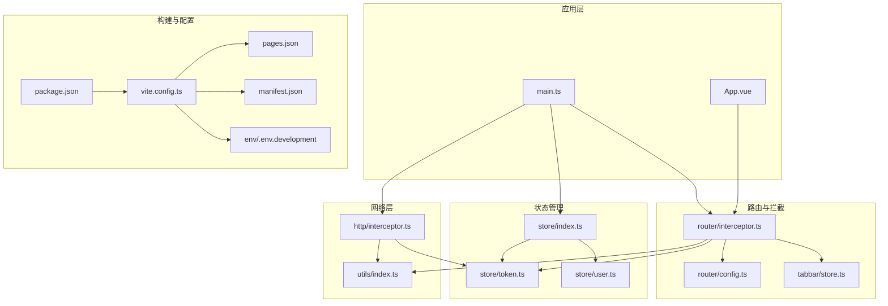
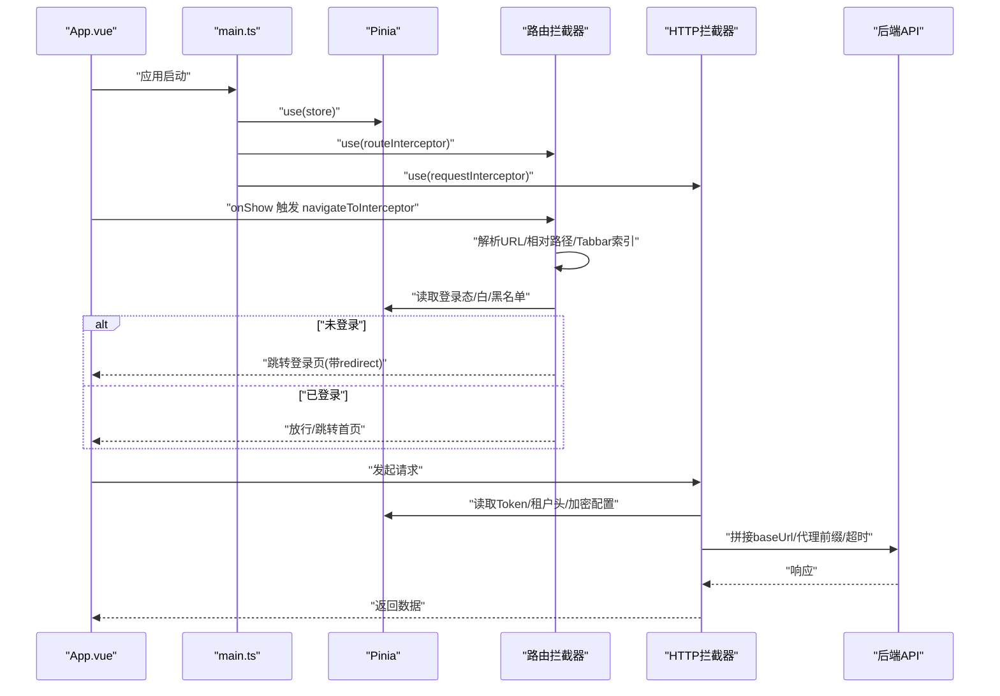
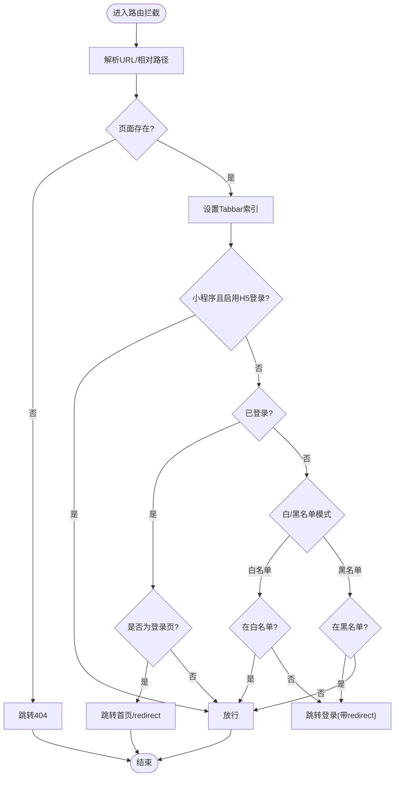
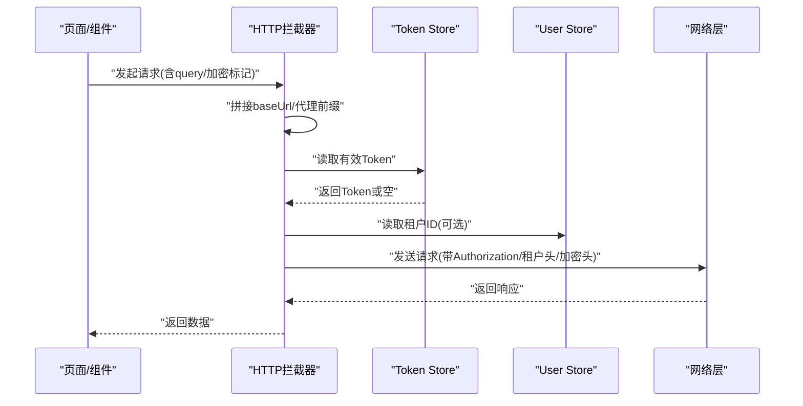
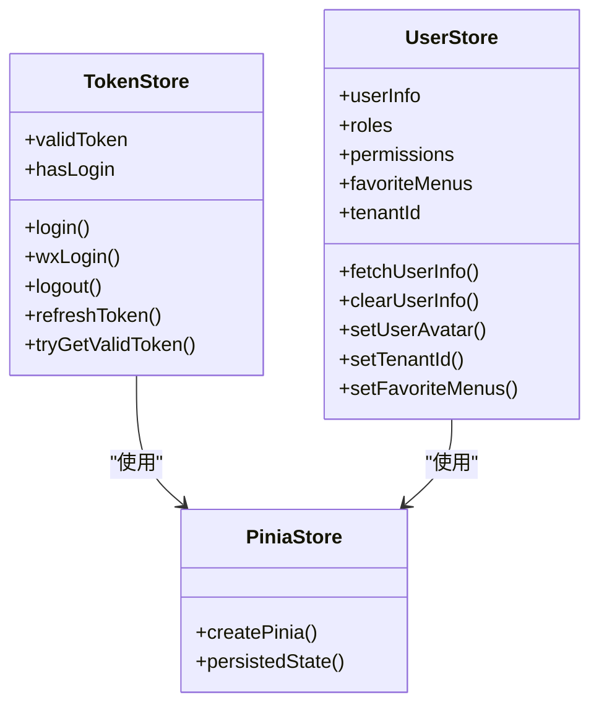
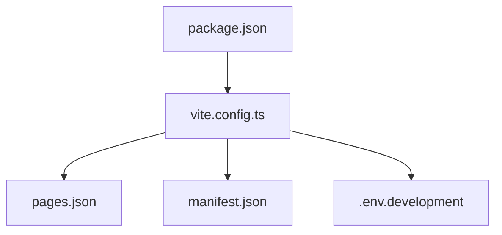

# UniApp 移动管理端

<cite>
**本文档引用的文件**
- [main.ts](file://frontend/admin-uniapp/src/main.ts)
- [App.vue](file://frontend/admin-uniapp/src/App.vue)
- [vite.config.ts](file://frontend/admin-uniapp/vite.config.ts)
- [package.json](file://frontend/admin-uniapp/package.json)
- [manifest.json](file://frontend/admin-uniapp/src/manifest.json)
- [pages.json](file://frontend/admin-uniapp/src/pages.json)
- [.env.development](file://frontend/admin-uniapp/env/.env.development)
- [interceptor.ts（路由）](file://frontend/admin-uniapp/src/router/interceptor.ts)
- [config.ts（路由）](file://frontend/admin-uniapp/src/router/config.ts)
- [index.ts（状态管理入口）](file://frontend/admin-uniapp/src/store/index.ts)
- [token.ts（状态管理）](file://frontend/admin-uniapp/src/store/token.ts)
- [user.ts（状态管理）](file://frontend/admin-uniapp/src/store/user.ts)
- [interceptor.ts（HTTP 请求）](file://frontend/admin-uniapp/src/http/interceptor.ts)
- [index.ts（工具集）](file://frontend/admin-uniapp/src/utils/index.ts)
- [store.ts（Tabbar）](file://frontend/admin-uniapp/src/tabbar/store.ts)
</cite>

## 目录
1. [简介](#简介)
2. [项目结构](#项目结构)
3. [核心组件](#核心组件)
4. [架构总览](#架构总览)
5. [详细组件分析](#详细组件分析)
6. [依赖关系分析](#依赖关系分析)
7. [性能考量](#性能考量)
8. [故障排查指南](#故障排查指南)
9. [结论](#结论)
10. [附录](#附录)

## 简介
本项目是一个基于 Vue 3 + UniApp + Vite 的跨平台移动端管理端应用，采用 Pinia 进行状态管理，内置路由权限拦截、HTTP 请求拦截与认证机制，结合 Wot Design Uni 组件库与 z-paging 实现移动端分页体验。项目通过 Vite 插件链路实现页面自动生成、分包优化、自动导入与 UnoCSS 等工程能力，支持 H5、小程序（含微信、支付宝等）与 App 多端发布。

## 项目结构
前端工程位于 frontend/admin-uniapp，核心目录与职责概览：
- src：应用源码
  - api：接口定义与封装
  - components：通用组件
  - http：请求拦截与工具
  - router：路由拦截与配置
  - store：Pinia 状态管理
  - utils：工具函数
  - tabbar：自定义 Tabbar 状态与配置
  - pages*.json：页面与分包配置
  - App.vue、main.ts：应用入口
- vite.config.ts：构建与开发服务器配置
- package.json：依赖与脚本
- manifest.json：多端发行配置
- env：环境变量

图表来源
- [main.ts:10-19](file://frontend/admin-uniapp/src/main.ts#L10-L19)
- [vite.config.ts:64-164](file://frontend/admin-uniapp/vite.config.ts#L64-L164)
- [package.json:29-97](file://frontend/admin-uniapp/package.json#L29-L97)

章节来源
- [main.ts:1-20](file://frontend/admin-uniapp/src/main.ts#L1-L20)
- [vite.config.ts:1-214](file://frontend/admin-uniapp/vite.config.ts#L1-L214)
- [package.json:1-194](file://frontend/admin-uniapp/package.json#L1-L194)
- [manifest.json:1-136](file://frontend/admin-uniapp/src/manifest.json#L1-L136)
- [pages.json:1-800](file://frontend/admin-uniapp/src/pages.json#L1-L800)
- [.env.development:1-10](file://frontend/admin-uniapp/env/.env.development#L1-L10)

## 核心组件
- 应用初始化与全局注入
  - main.ts 创建 SSR 应用实例，注册 Pinia、路由拦截器与请求拦截器。
- 路由权限控制
  - router/interceptor.ts 实现 navigateTo/reLaunch/redirectTo/switchTab 的统一拦截；支持白/黑名单策略、Tabbar 自动索引、小程序平台登录策略。
- HTTP 请求拦截与认证
  - http/interceptor.ts 统一拼接 baseUrl、代理前缀、添加 Authorization 与租户头、可选 API 加密、超时与上传拦截。
- 状态管理（Pinia）
  - store/index.ts 配置持久化插件；token.ts 管理登录态与 Token 生命周期；user.ts 管理用户信息与权限。
- 工具与配置
  - utils/index.ts 提供页面栈、URL 解析、环境基址、导航栏高度、首页与重定向等工具。
  - tabbar/store.ts 管理自定义 Tabbar 索引与徽标。
  - router/config.ts 定义登录策略、页面常量与白/黑名单列表。

章节来源
- [main.ts:10-19](file://frontend/admin-uniapp/src/main.ts#L10-L19)
- [interceptor.ts（路由）:138-146](file://frontend/admin-uniapp/src/router/interceptor.ts#L138-L146)
- [interceptor.ts（HTTP 请求）:97-105](file://frontend/admin-uniapp/src/http/interceptor.ts#L97-L105)
- [index.ts（状态管理入口）:1-23](file://frontend/admin-uniapp/src/store/index.ts#L1-L23)
- [token.ts:40-342](file://frontend/admin-uniapp/src/store/token.ts#L40-L342)
- [user.ts:17-90](file://frontend/admin-uniapp/src/store/user.ts#L17-L90)
- [index.ts（工具集）:76-103](file://frontend/admin-uniapp/src/utils/index.ts#L76-L103)
- [store.ts（Tabbar）:41-85](file://frontend/admin-uniapp/src/tabbar/store.ts#L41-L85)
- [config.ts（路由）:1-46](file://frontend/admin-uniapp/src/router/config.ts#L1-L46)

## 架构总览
应用启动流程与关键交互如下：

图表来源
- [App.vue:5-18](file://frontend/admin-uniapp/src/App.vue#L5-L18)
- [main.ts:10-19](file://frontend/admin-uniapp/src/main.ts#L10-L19)
- [interceptor.ts（路由）:36-136](file://frontend/admin-uniapp/src/router/interceptor.ts#L36-L136)
- [interceptor.ts（HTTP 请求）:19-94](file://frontend/admin-uniapp/src/http/interceptor.ts#L19-L94)

## 详细组件分析

### 应用初始化与生命周期
- main.ts
  - 创建 SSR 应用实例，注册 Pinia、路由拦截器与请求拦截器。
- App.vue
  - onLaunch/onShow 生命周期中处理直接通过分享/链接进入的场景，调用 navigateToInterceptor 进行统一路由处理。

章节来源
- [main.ts:10-19](file://frontend/admin-uniapp/src/main.ts#L10-L19)
- [App.vue:5-18](file://frontend/admin-uniapp/src/App.vue#L5-L18)

### 路由权限控制
- 核心逻辑
  - 统一拦截 navigateTo/reLaunch/redirectTo/switchTab。
  - 解析绝对/相对路径，处理不存在路由跳转 404。
  - 根据 isNeedLoginMode 与 EXCLUDE_LOGIN_PATH_LIST 决定白/黑名单策略。
  - 小程序平台可选择复用 H5 登录页或自定义登录页。
  - 自动设置 Tabbar 当前索引，避免非首页 Tabbar 索引错误。
- 关键配置
  - router/config.ts：登录策略、页面常量、白/黑名单列表、小程序登录页开关。
  - utils/index.ts：getAllPages、parseUrlToObj、HOME_PAGE、redirectAfterLogin 等。

图表来源
- [interceptor.ts（路由）:36-136](file://frontend/admin-uniapp/src/router/interceptor.ts#L36-L136)
- [config.ts（路由）:9-46](file://frontend/admin-uniapp/src/router/config.ts#L9-L46)
- [index.ts（工具集）:76-103](file://frontend/admin-uniapp/src/utils/index.ts#L76-L103)

章节来源
- [interceptor.ts（路由）:1-146](file://frontend/admin-uniapp/src/router/interceptor.ts#L1-L146)
- [config.ts（路由）:1-46](file://frontend/admin-uniapp/src/router/config.ts#L1-L46)
- [index.ts（工具集）:1-244](file://frontend/admin-uniapp/src/utils/index.ts#L1-L244)

### HTTP 请求拦截与认证机制
- 功能要点
  - 自动拼接 baseUrl 或代理前缀（H5 代理开关）。
  - 统一添加 Authorization 头（白名单排除）。
  - 可选租户头（多租户开关）。
  - 可选 API 加密（请求体加密与头部标识）。
  - 统一超时时间与上传文件拦截。
- 与状态管理联动
  - 从 token store 读取有效 Token，动态注入请求头。
  - 与用户 store 协作（如租户 ID）。

图表来源
- [interceptor.ts（HTTP 请求）:19-94](file://frontend/admin-uniapp/src/http/interceptor.ts#L19-L94)
- [token.ts:318-335](file://frontend/admin-uniapp/src/store/token.ts#L318-L335)
- [user.ts:72-84](file://frontend/admin-uniapp/src/store/user.ts#L72-L84)

章节来源
- [interceptor.ts（HTTP 请求）:1-105](file://frontend/admin-uniapp/src/http/interceptor.ts#L1-L105)
- [token.ts:1-342](file://frontend/admin-uniapp/src/store/token.ts#L1-L342)
- [user.ts:1-90](file://frontend/admin-uniapp/src/store/user.ts#L1-L90)

### 状态管理（Pinia）
- store/index.ts
  - 创建 Pinia 实例并启用持久化插件（uni.storage），立即激活实例以避免 APP 端白屏。
- token.ts
  - 管理登录态、Token 生命周期、双 Token 刷新、登录/登出、重定向后处理。
- user.ts
  - 管理用户信息、角色/权限、常用菜单、租户 ID、头像更新与清理。

图表来源
- [index.ts（状态管理入口）:1-23](file://frontend/admin-uniapp/src/store/index.ts#L1-L23)
- [token.ts:40-342](file://frontend/admin-uniapp/src/store/token.ts#L40-L342)
- [user.ts:17-90](file://frontend/admin-uniapp/src/store/user.ts#L17-L90)

章节来源
- [index.ts（状态管理入口）:1-23](file://frontend/admin-uniapp/src/store/index.ts#L1-L23)
- [token.ts:1-342](file://frontend/admin-uniapp/src/store/token.ts#L1-L342)
- [user.ts:1-90](file://frontend/admin-uniapp/src/store/user.ts#L1-L90)

### 组件库与 UI 组件封装
- 组件库
  - Wot Design Uni：提供丰富的移动端 UI 组件。
  - z-paging：提供下拉刷新、上拉加载等移动端分页能力。
- easycom 配置
  - pages.json 中通过 easycom 自动扫描与别名映射，简化组件引用。
- 自定义 Tabbar
  - tabbar/store.ts 管理自定义 Tabbar 的索引与徽标，支持策略化切换。

章节来源
- [pages.json:9-16](file://frontend/admin-uniapp/src/pages.json#L9-L16)
- [store.ts（Tabbar）:14-34](file://frontend/admin-uniapp/src/tabbar/store.ts#L14-L34)

### 移动端适配策略
- 导航栏高度适配
  - utils/index.ts 提供 getNavbarHeight，小程序端通过胶囊按钮计算，H5/App 端使用状态栏高度 + 固定导航栏高度。
- 页面与分包
  - vite.config.ts 配置 subPackages 与 UniPages 插件，按模块拆分分包，减少首屏体积。
- UnoCSS 与自动导入
  - UnoCSS 提供原子化样式；AutoImport 自动导入 Vue 与 uni-app API，提升开发效率。

章节来源
- [index.ts（工具集）:228-243](file://frontend/admin-uniapp/src/utils/index.ts#L228-L243)
- [vite.config.ts:67-107](file://frontend/admin-uniapp/vite.config.ts#L67-L107)
- [vite.config.ts:121-126](file://frontend/admin-uniapp/vite.config.ts#L121-L126)

### API 接口集成与数据缓存
- 接口集成
  - http/interceptor.ts 统一处理请求拼接、超时、头信息与加密，降低重复代码。
- 数据缓存
  - Pinia 持久化：store/index.ts 使用持久化插件，token.ts 与 user.ts 启用 persist。
  - 本地存储：token.ts 使用 uni.setStorageSync 存储 Token 过期时间；utils/index.ts 提供 getEnvBaseUrlRoot 等环境相关缓存路径。

章节来源
- [interceptor.ts（HTTP 请求）:19-94](file://frontend/admin-uniapp/src/http/interceptor.ts#L19-L94)
- [index.ts（状态管理入口）:4-12](file://frontend/admin-uniapp/src/store/index.ts#L4-L12)
- [token.ts:47-64](file://frontend/admin-uniapp/src/store/token.ts#L47-L64)
- [index.ts（工具集）:159-164](file://frontend/admin-uniapp/src/utils/index.ts#L159-L164)

### 错误处理与网络状态管理
- 错误处理
  - HTTP 层：统一超时与异常捕获；组件层：使用 Wot Design Uni Toast 提示。
  - 路由层：不存在路由跳转 404；登录态异常时重定向至登录页。
- 网络状态
  - 通过拦截器统一设置超时与代理前缀，便于在不同平台与环境间保持一致行为。

章节来源
- [interceptor.ts（HTTP 请求）:49-50](file://frontend/admin-uniapp/src/http/interceptor.ts#L49-L50)
- [interceptor.ts（路由）:61-65](file://frontend/admin-uniapp/src/router/interceptor.ts#L61-L65)
- [token.ts:144-150](file://frontend/admin-uniapp/src/store/token.ts#L144-L150)

### 移动端特有能力实现
- 下拉刷新与上拉加载
  - 通过 z-paging 组件实现标准的下拉刷新与上拉加载，提升滚动列表体验。
- 图片上传
  - HTTP 拦截器已拦截 uploadFile，统一处理上传请求的头信息与加密策略。

章节来源
- [interceptor.ts（HTTP 请求）:101-102](file://frontend/admin-uniapp/src/http/interceptor.ts#L101-L102)
- [package.json:125-126](file://frontend/admin-uniapp/package.json#L125-L126)

## 依赖关系分析
- 构建与插件
  - Vite 插件链：Uni、UniPages、UniLayouts、UniManifest、UniPlatform、Bundle Optimizer、UnoCSS、AutoImport、Components、ViteRestart 等。
- 运行时依赖
  - Vue 3、Vue Router、Pinia、wot-design-uni、z-paging 等。
- 环境变量
  - .env.development 控制删除 console、SourceMap 等开发体验参数；vite.config.ts 读取 VITE_* 变量进行代理与公共路径配置。

图表来源
- [vite.config.ts:64-164](file://frontend/admin-uniapp/vite.config.ts#L64-L164)
- [package.json:29-97](file://frontend/admin-uniapp/package.json#L29-L97)
- [.env.development:1-10](file://frontend/admin-uniapp/env/.env.development#L1-L10)

章节来源
- [vite.config.ts:1-214](file://frontend/admin-uniapp/vite.config.ts#L1-L214)
- [package.json:1-194](file://frontend/admin-uniapp/package.json#L1-L194)
- [.env.development:1-10](file://frontend/admin-uniapp/env/.env.development#L1-L10)

## 性能考量
- 分包优化
  - 通过 UniPages 与 Bundle Optimizer 对页面与组件进行异步跨包调用与模块异步加载，减少首屏体积。
- 构建优化
  - 开发环境关闭压缩，生产环境启用 esbuild 压缩；H5 生产环境可启用打包可视化分析。
- 样式与资源
  - UnoCSS 提供原子化样式，减少冗余 CSS；必要时可开启打包分析定位体积瓶颈。
- 运行时
  - Pinia 持久化减少刷新后的二次请求；路由与请求拦截器集中处理，避免重复逻辑。

章节来源
- [vite.config.ts:83-94](file://frontend/admin-uniapp/vite.config.ts#L83-L94)
- [vite.config.ts:204-211](file://frontend/admin-uniapp/vite.config.ts#L204-L211)
- [index.ts（状态管理入口）:4-12](file://frontend/admin-uniapp/src/store/index.ts#L4-L12)

## 故障排查指南
- 登录后仍被重定向到登录页
  - 检查 isNeedLoginMode 与 EXCLUDE_LOGIN_PATH_LIST 配置；确认 hasLogin 判断与 tryGetValidToken 流程。
- Token 过期导致接口失败
  - 确认双 Token 模式下 refreshToken 是否可用；检查 Token 过期时间存储与读取。
- 路由跳转异常或 Tabbar 索引错误
  - 检查 navigateToInterceptor 的路径解析与 Tabbar 自动索引逻辑；确认 pages.json 中 Tabbar 页面配置。
- H5 代理无效
  - 检查 VITE_APP_PROXY_ENABLE/VITE_APP_PROXY_PREFIX/VITE_SERVER_BASEURL 配置与 rewrite 规则。
- 小程序端登录页不生效
  - 检查 LOGIN_PAGE_ENABLE_IN_MP 与 isMp 平台判断逻辑。

章节来源
- [interceptor.ts（路由）:106-134](file://frontend/admin-uniapp/src/router/interceptor.ts#L106-L134)
- [token.ts:289-316](file://frontend/admin-uniapp/src/store/token.ts#L289-L316)
- [config.ts（路由）:9-46](file://frontend/admin-uniapp/src/router/config.ts#L9-L46)
- [vite.config.ts:190-199](file://frontend/admin-uniapp/vite.config.ts#L190-L199)

## 结论
本项目以 Vue 3 + UniApp + Vite 为基础，构建了具备路由权限控制、HTTP 请求拦截与认证、Pinia 状态管理、组件库与移动端分页能力的跨平台移动管理端。通过分包优化、自动导入与 UnoCSS 等工程能力，兼顾开发效率与运行性能。建议在实际业务中进一步完善错误上报、埋点与国际化策略，持续优化首屏加载与交互体验。

## 附录
- 开发与构建命令
  - H5 开发/构建：dev:h5/build:h5
  - 小程序开发/构建：dev:mp/build:mp（如微信/支付宝等）
  - App 开发/构建：dev:app/build:app
- 环境变量
  - VITE_SERVER_BASEURL：后端服务地址
  - VITE_APP_PROXY_ENABLE/VITE_APP_PROXY_PREFIX：H5 代理开关与前缀
  - VITE_DELETE_CONSOLE：删除 console 与 debugger
  - VITE_APP_PUBLIC_BASE：公共基础路径
- Manifest 与页面
  - manifest.json：多端发行配置（图标、权限、分发等）
  - pages.json：页面与分包配置、easycom 组件映射

章节来源
- [package.json:29-97](file://frontend/admin-uniapp/package.json#L29-L97)
- [.env.development:1-10](file://frontend/admin-uniapp/env/.env.development#L1-L10)
- [manifest.json:1-136](file://frontend/admin-uniapp/src/manifest.json#L1-L136)
- [pages.json:1-800](file://frontend/admin-uniapp/src/pages.json#L1-L800)