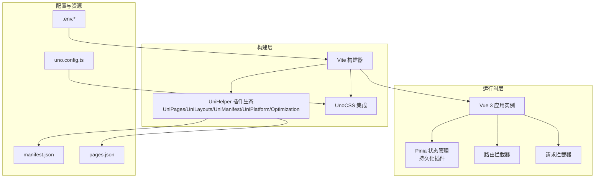
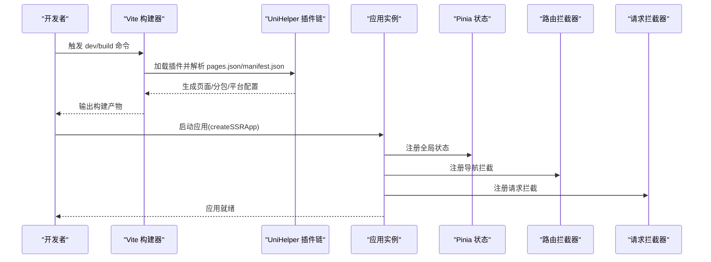
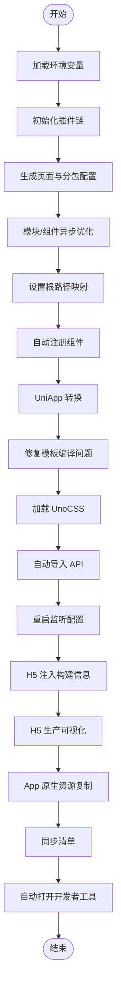
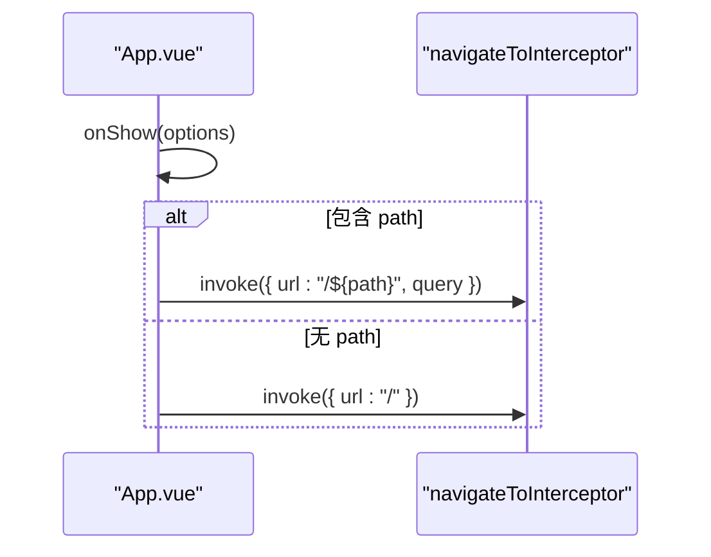
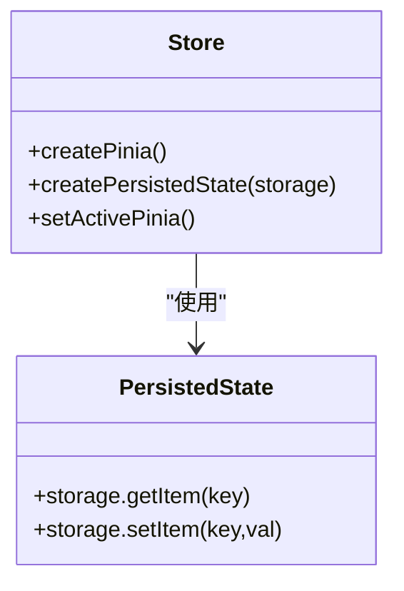
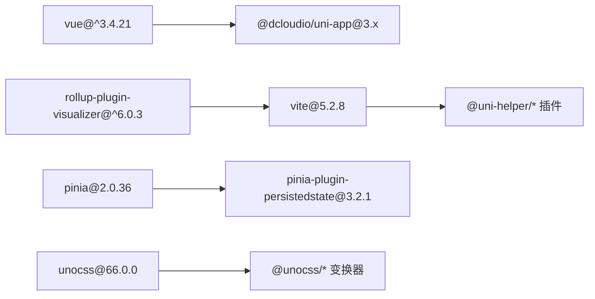

# 应用架构设计

<cite>
**本文引用的文件**   
- [vite.config.ts](file://frontend/admin-uniapp/vite.config.ts)
- [uno.config.ts](file://frontend/admin-uniapp/uno.config.ts)
- [main.ts](file://frontend/admin-uniapp/src/main.ts)
- [App.vue](file://frontend/admin-uniapp/src/App.vue)
- [package.json](file://frontend/admin-uniapp/package.json)
- [store/index.ts](file://frontend/admin-uniapp/src/store/index.ts)
- [manifest.json](file://frontend/admin-uniapp/src/manifest.json)
- [pages.json](file://frontend/admin-uniapp/src/pages.json)
- [.env.development](file://frontend/admin-uniapp/env/.env.development)
</cite>

## 目录
1. [引言](#引言)
2. [项目结构](#项目结构)
3. [核心组件](#核心组件)
4. [架构总览](#架构总览)
5. [详细组件分析](#详细组件分析)
6. [依赖关系分析](#依赖关系分析)
7. [性能考量](#性能考量)
8. [故障排查指南](#故障排查指南)
9. [结论](#结论)
10. [附录](#附录)

## 引言
本文件面向基于 Vue 3 + UniApp + Vite 的跨平台移动端应用，系统化阐述应用的整体架构设计与实现细节。内容覆盖应用初始化流程、SSR 应用创建、插件注册机制与全局配置；文档化 Vite 构建配置、UnoCSS 样式系统集成与开发环境配置；解释跨平台编译原理、运行时环境差异与性能优化策略；并给出应用生命周期管理、全局状态注入与依赖注入模式的实践方案。最后总结架构决策、技术选型理由与扩展性考虑。

## 项目结构
该前端工程位于 frontend/admin-uniapp 目录，采用“多端同构 + 统一构建”的组织方式：
- 构建层：Vite 驱动，配合一系列 UniHelper 生态插件完成页面、布局、清单与平台的自动化处理，并集成 UnoCSS 与自动导入能力。
- 运行时层：Vue 3 + Pinia（带持久化）+ 路由拦截器 + 请求拦截器，形成统一的应用启动与运行时控制面。
- 资源与配置：manifest.json 与 pages.json 驱动多端打包与页面分包策略；UnoCSS 配置提供原子化样式与主题能力；环境变量集中于 env 目录并通过 Vite 注入。

图表来源
- [vite.config.ts:33-214](file://frontend/admin-uniapp/vite.config.ts#L33-L214)
- [uno.config.ts:17-120](file://frontend/admin-uniapp/uno.config.ts#L17-L120)
- [main.ts:10-19](file://frontend/admin-uniapp/src/main.ts#L10-L19)
- [store/index.ts:1-23](file://frontend/admin-uniapp/src/store/index.ts#L1-L23)
- [manifest.json:1-136](file://frontend/admin-uniapp/src/manifest.json#L1-L136)
- [pages.json:1-800](file://frontend/admin-uniapp/src/pages.json#L1-L800)

章节来源
- [package.json:29-98](file://frontend/admin-uniapp/package.json#L29-L98)
- [vite.config.ts:33-214](file://frontend/admin-uniapp/vite.config.ts#L33-L214)
- [uno.config.ts:17-120](file://frontend/admin-uniapp/uno.config.ts#L17-L120)
- [main.ts:10-19](file://frontend/admin-uniapp/src/main.ts#L10-L19)
- [store/index.ts:1-23](file://frontend/admin-uniapp/src/store/index.ts#L1-L23)
- [manifest.json:1-136](file://frontend/admin-uniapp/src/manifest.json#L1-L136)
- [pages.json:1-800](file://frontend/admin-uniapp/src/pages.json#L1-L800)

## 核心组件
- SSR 应用创建与插件注册
  - 通过 createSSRApp 创建应用实例，集中注册 Pinia、路由拦截器与请求拦截器，形成统一的启动装配。
- 全局状态注入与持久化
  - 使用 Pinia 并启用持久化插件，存储后端接口数据与用户态信息，结合 uni 存储 API 实现跨端一致的本地持久化。
- 页面与分包管理
  - pages.json 与 UniPages 插件联动，自动生成页面与分包配置，提升大型项目的可维护性。
- 清单与平台配置
  - manifest.json 配置各端能力、权限与图标资源，支撑多端分发。
- UnoCSS 原子化样式
  - 通过 presetUni、presetIcons、presetLegacyCompat 与多种 transformer，提供跨端兼容与高效样式开发体验。

章节来源
- [main.ts:10-19](file://frontend/admin-uniapp/src/main.ts#L10-L19)
- [store/index.ts:1-23](file://frontend/admin-uniapp/src/store/index.ts#L1-L23)
- [pages.json:1-800](file://frontend/admin-uniapp/src/pages.json#L1-L800)
- [manifest.json:1-136](file://frontend/admin-uniapp/src/manifest.json#L1-L136)
- [uno.config.ts:17-120](file://frontend/admin-uniapp/uno.config.ts#L17-L120)

## 架构总览
应用采用“构建期自动化 + 运行时装配”的双层架构：
- 构建期：Vite + UniHelper 插件链完成页面扫描、分包优化、平台适配与清单同步；UnoCSS 提供原子化样式与主题能力。
- 运行期：Vue 3 应用通过 createSSRApp 初始化，按序挂载状态、路由与请求拦截器，随后进入生命周期管理与页面渲染。

图表来源
- [vite.config.ts:67-164](file://frontend/admin-uniapp/vite.config.ts#L67-L164)
- [main.ts:10-19](file://frontend/admin-uniapp/src/main.ts#L10-L19)
- [store/index.ts:1-23](file://frontend/admin-uniapp/src/store/index.ts#L1-L23)

## 详细组件分析

### Vite 构建配置与插件体系
- 插件顺序与职责
  - UniPages：扫描页面与分包，生成路由与类型声明；需在 Optimization 之前，保证 pages.json 已生成。
  - Optimization：对模块异步加载、跨包调用与组件异步引用进行优化。
  - UniKuRoot：在变更 pages.json 的插件之后使用，确保根路径与页面映射正确。
  - Components（两次）：自动注册组件与解析器（含 WotResolver），生成类型声明。
  - Uni：核心 UniApp 转换插件。
  - fix-vite-plugin-vue：修复官方编译器的模板编译问题。
  - UnoCSS：加载 UnoCSS 插件。
  - AutoImport：自动导入 Vue 与 uni-app API，支持 hooks 目录扫描。
  - ViteRestart：热重载配置文件变更。
  - html-transform：H5 环境注入构建时间与标题。
  - visualizer：H5 生产环境可视化打包体积。
  - copy-native-resources：App 平台原生资源复制（条件启用）。
  - sync-manifest-plugin：清单同步。
  - openDevTools：自动打开开发者工具（条件启用）。
- 开发服务器与代理
  - 仅 H5 端生效的 devServer，支持端口与代理配置，代理前缀与目标地址由环境变量控制。
- 编译与压缩
  - 目标 ES6；开发环境不压缩，生产环境使用 esbuild 压缩；可按需删除 console 与 debugger。
- 别名与全局常量
  - @ 与 @img 别名；通过 define 暴露代理开关常量。

图表来源
- [vite.config.ts:67-164](file://frontend/admin-uniapp/vite.config.ts#L67-L164)
- [.env.development:1-10](file://frontend/admin-uniapp/env/.env.development#L1-L10)

章节来源
- [vite.config.ts:33-214](file://frontend/admin-uniapp/vite.config.ts#L33-L214)
- [.env.development:1-10](file://frontend/admin-uniapp/env/.env.development#L1-L10)

### UnoCSS 样式系统集成
- 预设与主题
  - presetUni：为 UniApp 提供跨端样式适配。
  - presetIcons：本地 SVG 图标集，自动注入 currentColor 与尺寸适配。
  - presetLegacyCompat：低端安卓兼容，将 rgb()/hsl() 空格分隔转逗号分隔。
- 变换器
  - transformerDirectives：支持 @apply、@screen 等指令。
  - transformerVariantGroup：支持组合类名分组语法。
- 快捷方式与安全区
  - shortcuts：常用布局快捷类。
  - safelist：动态图标白名单。
  - rules：安全区内边距规则，适配刘海屏。
- 主题与字号
  - colors.primary：主题色变量。
  - fontSize.2xs/3xs：rpx 对应的细体字大小。

章节来源
- [uno.config.ts:17-120](file://frontend/admin-uniapp/uno.config.ts#L17-L120)

### 应用初始化与生命周期
- SSR 应用创建
  - 通过 createSSRApp 创建应用实例，随后依次注册 Pinia、路由拦截器与请求拦截器。
- 生命周期钩子
  - App.vue 在 onShow 阶段处理直接进入页面的路由跳转，确保首次进入时的导航一致性。
- 全局样式与 UnoCSS
  - 在入口引入全局 SCSS 与 UnoCSS 虚拟模块，保证样式在应用启动时已加载。

图表来源
- [App.vue:5-18](file://frontend/admin-uniapp/src/App.vue#L5-L18)

章节来源
- [main.ts:10-19](file://frontend/admin-uniapp/src/main.ts#L10-L19)
- [App.vue:1-27](file://frontend/admin-uniapp/src/App.vue#L1-L27)

### 全局状态注入与持久化
- Pinia 实例与持久化
  - 创建 Pinia 实例并启用持久化插件，存储后端接口数据与用户态信息，使用 uni 存储 API 实现跨端一致的本地持久化。
- 立即激活
  - 通过 setActivePinia 在 app.use(store) 之前即可使用 store，避免 APP 端白屏问题。

图表来源
- [store/index.ts:1-23](file://frontend/admin-uniapp/src/store/index.ts#L1-L23)

章节来源
- [store/index.ts:1-23](file://frontend/admin-uniapp/src/store/index.ts#L1-L23)

### 页面与分包管理
- pages.json
  - 定义全局样式、easycom 自动扫描规则与页面列表；通过 subPackages 实现分包策略，降低首屏体积。
- UniPages 插件
  - 与 pages.json 联动，扫描指定目录生成页面与类型声明，支持排除组件路径与自定义 d.ts 输出位置。

章节来源
- [pages.json:1-800](file://frontend/admin-uniapp/src/pages.json#L1-L800)
- [vite.config.ts:71-82](file://frontend/admin-uniapp/vite.config.ts#L71-L82)

### 清单与多端配置
- manifest.json
  - 配置 app-plus、mp-weixin、mp-alipay 等平台的权限、图标、编译选项与分包优化策略；h5 端配置路由 base。
- 与 Vite 插件协同
  - UniManifest 与 sync-manifest-plugin 确保清单与构建产物一致。

章节来源
- [manifest.json:1-136](file://frontend/admin-uniapp/src/manifest.json#L1-L136)
- [vite.config.ts:69-70](file://frontend/admin-uniapp/vite.config.ts#L69-L70)
- [vite.config.ts:154](file://frontend/admin-uniapp/vite.config.ts#L154)

### 跨平台编译原理与运行时差异
- 平台选择与命令
  - 通过 uni -p 指定平台，如 app、mp-weixin、h5 等；命令在 package.json 中统一定义。
- 编译差异
  - 不同平台在模板编译、组件解析与资源打包上存在差异；Vite 插件链负责将 Vue 单文件组件转换为各端可执行代码。
- 运行时差异
  - API 能力、存储机制与网络栈在不同平台存在差异，需通过条件编译与平台检测规避风险。

章节来源
- [package.json:34-90](file://frontend/admin-uniapp/package.json#L34-L90)
- [vite.config.ts:48-49](file://frontend/admin-uniapp/vite.config.ts#L48-L49)

### 开发环境配置与调试
- 环境变量
  - 通过 env 目录与 loadEnv 加载；Vite 仅暴露以 VITE_ 前缀的变量。
- 代理与端口
  - H5 端支持代理后端服务，代理前缀与目标地址由环境变量控制；端口亦由环境变量配置。
- 自动打开开发者工具
  - openDevTools 插件在满足条件时自动打开对应平台开发者工具。

章节来源
- [vite.config.ts:51-61](file://frontend/admin-uniapp/vite.config.ts#L51-L61)
- [vite.config.ts:185-200](file://frontend/admin-uniapp/vite.config.ts#L185-L200)
- [vite.config.ts:162-163](file://frontend/admin-uniapp/vite.config.ts#L162-L163)
- [.env.development:1-10](file://frontend/admin-uniapp/env/.env.development#L1-L10)

## 依赖关系分析
- 技术栈与版本
  - Vue 3、UniApp 3、Vite 5、Pinia 2、UnoCSS 66、AutoImport 与 Components 插件等。
- 关键依赖
  - @dcloudio/uni-app 系列：提供多端运行时与编译支持。
  - @uni-helper 生态：提供页面、布局、清单、平台与分包优化插件。
  - @unocss/*：提供预设与变换器，支撑原子化样式。
  - rollup-plugin-visualizer：构建产物可视化分析。

图表来源
- [package.json:99-177](file://frontend/admin-uniapp/package.json#L99-L177)

章节来源
- [package.json:99-177](file://frontend/admin-uniapp/package.json#L99-L177)

## 性能考量
- 分包与异步加载
  - 通过 UniPages 与 Optimization 插件，将登录、系统管理、基础设施、工作流程等模块拆分为分包，减少首屏体积。
- 构建优化
  - 生产环境启用 esbuild 压缩；可按需删除 console 与 debugger；H5 生产环境可视化分析包体构成。
- 样式优化
  - UnoCSS 原子化减少重复样式；presetLegacyCompat 提升低端设备兼容性；safe-area 规则适配刘海屏。
- 存储与缓存
  - Pinia 持久化结合 uni 存储 API，减少重复请求与状态重建成本。

章节来源
- [vite.config.ts:84-94](file://frontend/admin-uniapp/vite.config.ts#L84-L94)
- [vite.config.ts:204-211](file://frontend/admin-uniapp/vite.config.ts#L204-L211)
- [uno.config.ts:55-59](file://frontend/admin-uniapp/uno.config.ts#L55-L59)
- [store/index.ts:5-12](file://frontend/admin-uniapp/src/store/index.ts#L5-L12)

## 故障排查指南
- H5 端代理无效
  - 检查 VITE_APP_PROXY_ENABLE 是否为 true，代理前缀与目标地址是否正确。
- App 端白屏
  - 确认 Pinia 已通过 setActivePinia 立即激活，避免在 app.use(store) 之前访问 store。
- 小程序端样式异常
  - 检查 presetLegacyCompat 是否启用，确认 rgb()/hsl() 表达式格式。
- 页面未生效或路由错误
  - 确认 UniPages 插件已生成 pages.json，且未将分包目录配置在 pages 目录内。
- 构建体积过大
  - 使用 visualizer 生成报告，定位大体积模块并评估分包与异步加载策略。

章节来源
- [vite.config.ts:191-198](file://frontend/admin-uniapp/vite.config.ts#L191-L198)
- [store/index.ts:13-14](file://frontend/admin-uniapp/src/store/index.ts#L13-L14)
- [uno.config.ts:55-59](file://frontend/admin-uniapp/uno.config.ts#L55-L59)
- [vite.config.ts:71-82](file://frontend/admin-uniapp/vite.config.ts#L71-L82)
- [vite.config.ts:141-146](file://frontend/admin-uniapp/vite.config.ts#L141-L146)

## 结论
该架构以 Vite 为核心构建引擎，结合 UniHelper 生态与 UnoCSS，实现了页面与分包的自动化管理、跨端编译与样式原子化。运行时通过 createSSRApp 与插件化注册，将状态、路由与请求拦截器统一装配，形成高内聚、低耦合的应用骨架。在性能方面，分包、异步加载与构建优化相结合，兼顾首屏体验与长期可维护性。建议在后续迭代中持续关注平台差异与生态演进，保持插件与依赖的版本更新与兼容性验证。

## 附录
- 常用脚本
  - 开发：dev、dev:h5、dev:mp-weixin、dev:app 等。
  - 构建：build、build:h5、build:mp-weixin、build:app 等。
  - SSR：dev:h5:ssr、build:h5:ssr。
- 环境变量
  - VITE_APP_PORT、VITE_SERVER_BASEURL、VITE_APP_TITLE、VITE_DELETE_CONSOLE、VITE_APP_PUBLIC_BASE、VITE_APP_PROXY_ENABLE、VITE_APP_PROXY_PREFIX、VITE_COPY_NATIVE_RES_ENABLE。

章节来源
- [package.json:29-98](file://frontend/admin-uniapp/package.json#L29-L98)
- [.env.development:1-10](file://frontend/admin-uniapp/env/.env.development#L1-L10)