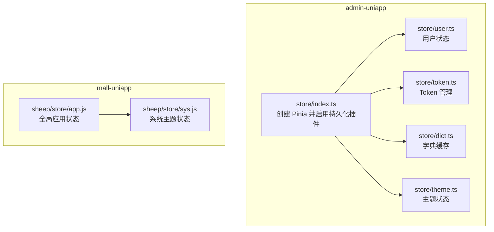
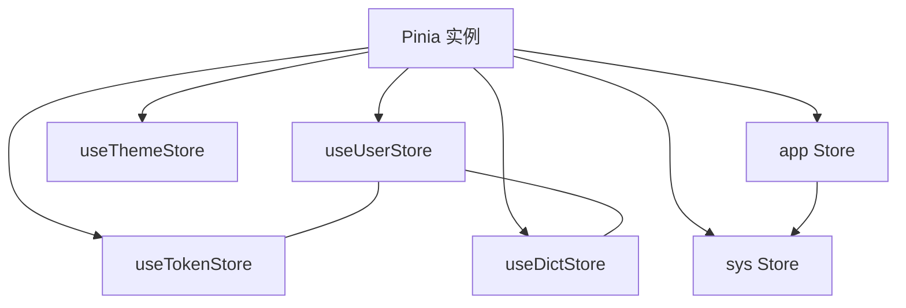
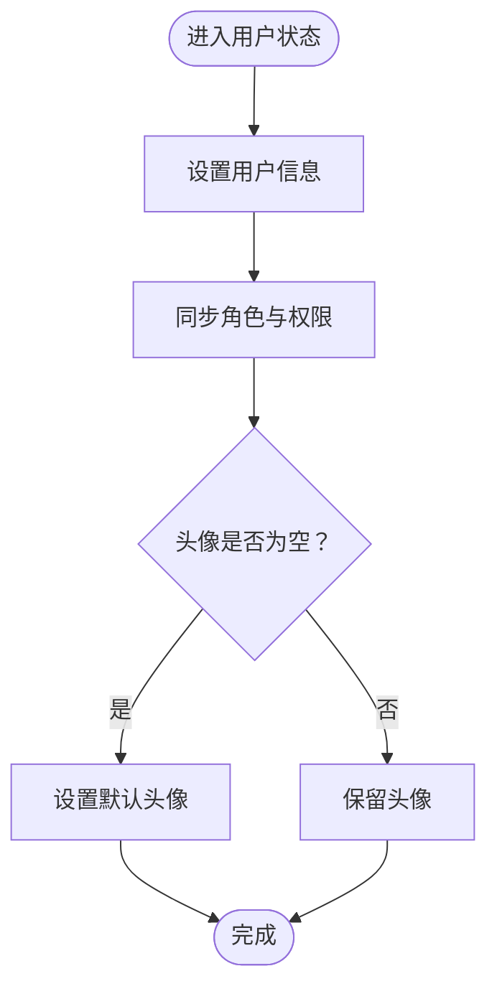
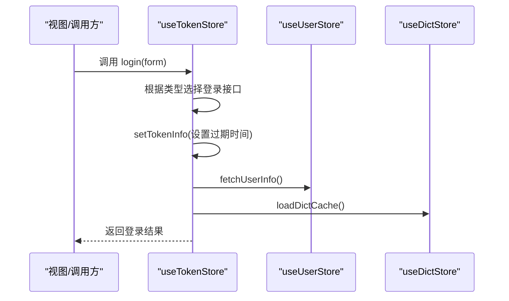
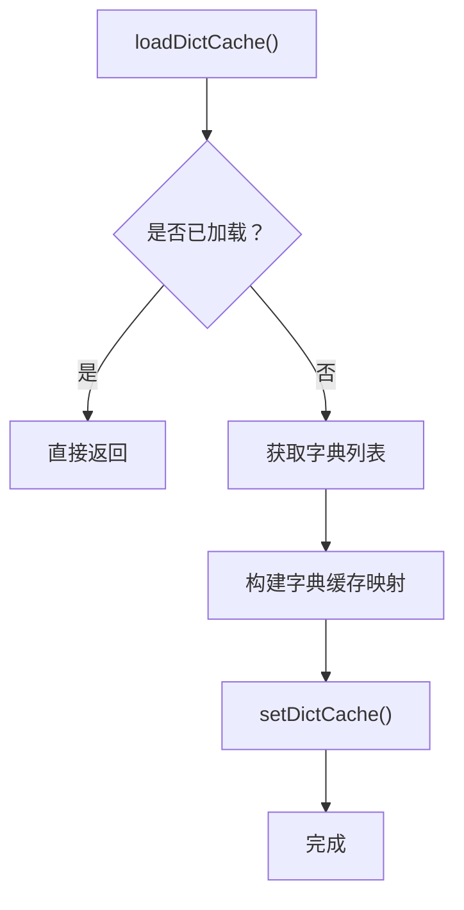
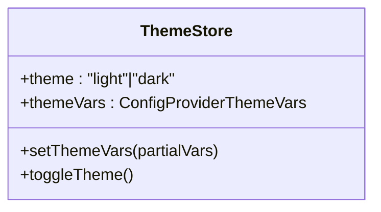
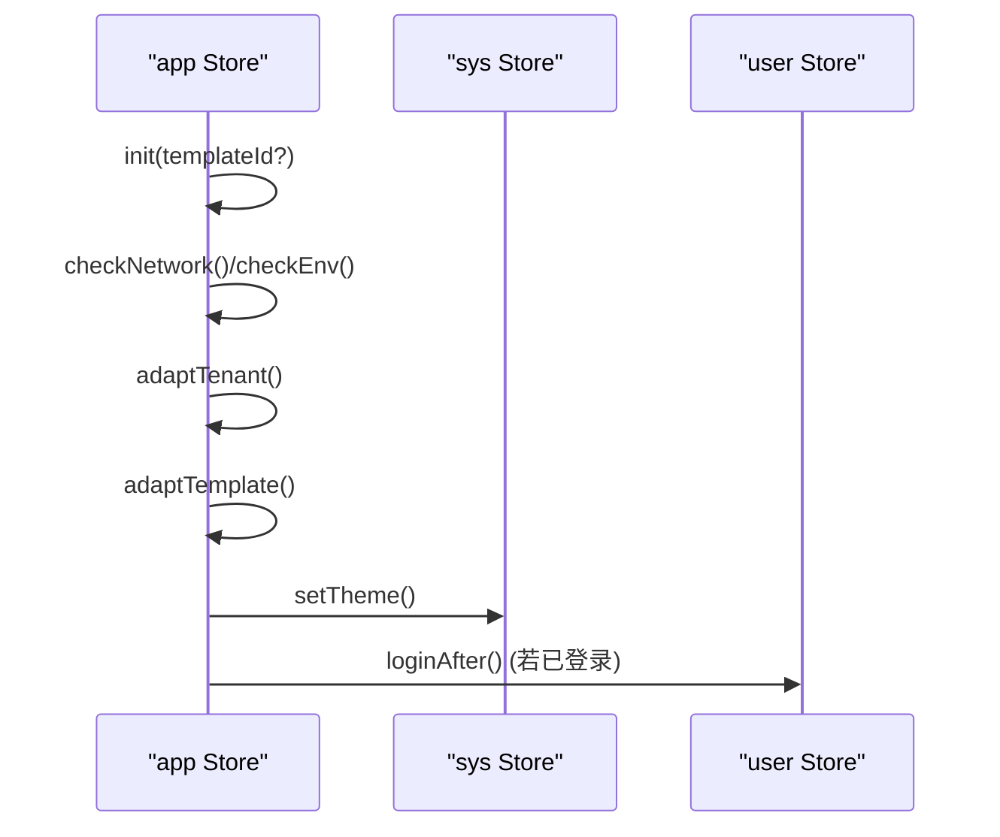
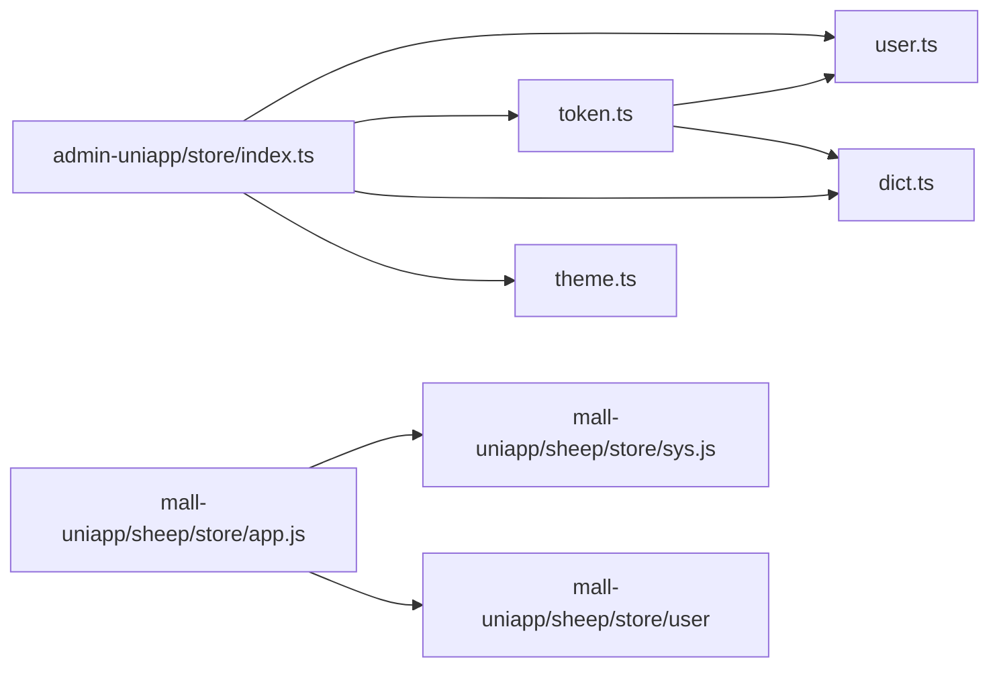

# 状态管理

<cite>
**本文引用的文件**
- [frontend/admin-uniapp/src/store/index.ts](file://frontend/admin-uniapp/src/store/index.ts)
- [frontend/admin-uniapp/src/store/user.ts](file://frontend/admin-uniapp/src/store/user.ts)
- [frontend/admin-uniapp/src/store/token.ts](file://frontend/admin-uniapp/src/store/token.ts)
- [frontend/admin-uniapp/src/store/dict.ts](file://frontend/admin-uniapp/src/store/dict.ts)
- [frontend/admin-uniapp/src/store/theme.ts](file://frontend/admin-uniapp/src/store/theme.ts)
- [frontend/mall-uniapp/sheep/store/app.js](file://frontend/mall-uniapp/sheep/store/app.js)
- [frontend/mall-uniapp/sheep/store/sys.js](file://frontend/mall-uniapp/sheep/store/sys.js)
- [frontend/admin-vue3/src/store/index.ts](file://frontend/admin-vue3/src/store/index.ts)
</cite>

## 目录
1. [简介](#简介)
2. [项目结构](#项目结构)
3. [核心组件](#核心组件)
4. [架构总览](#架构总览)
5. [组件详解](#组件详解)
6. [依赖关系分析](#依赖关系分析)
7. [性能考量](#性能考量)
8. [故障排查指南](#故障排查指南)
9. [结论](#结论)
10. [附录](#附录)

## 简介
本文件系统性梳理基于 Pinia 的状态管理架构与 Store 设计模式，覆盖用户状态、Token 管理、主题切换与全局状态，并详细说明状态持久化、状态同步与响应式更新机制。同时结合移动端（uni-app）场景，给出内存管理、离线状态与性能优化建议，并提供调试工具使用、状态变更追踪与副作用处理的最佳实践。

## 项目结构
本仓库包含两套前端工程：admin-uniapp（基于 uni-app + Pinia + wot-design-uni）与 mall-uniapp（sheep 框架 + Pinia）。二者均采用 Pinia 进行状态管理，但持久化策略与模块划分略有差异。admin-uniapp 在入口集中配置持久化插件并通过 store 文件统一导出；mall-uniapp 则在具体 Store 上声明持久化策略。

**图表来源**
- [frontend/admin-uniapp/src/store/index.ts:1-23](file://frontend/admin-uniapp/src/store/index.ts#L1-L23)
- [frontend/admin-uniapp/src/store/user.ts:1-90](file://frontend/admin-uniapp/src/store/user.ts#L1-L90)
- [frontend/admin-uniapp/src/store/token.ts:1-342](file://frontend/admin-uniapp/src/store/token.ts#L1-L342)
- [frontend/admin-uniapp/src/store/dict.ts:1-87](file://frontend/admin-uniapp/src/store/dict.ts#L1-L87)
- [frontend/admin-uniapp/src/store/theme.ts:1-42](file://frontend/admin-uniapp/src/store/theme.ts#L1-L42)
- [frontend/mall-uniapp/sheep/store/app.js:1-215](file://frontend/mall-uniapp/sheep/store/app.js#L1-L215)
- [frontend/mall-uniapp/sheep/store/sys.js:1-33](file://frontend/mall-uniapp/sheep/store/sys.js#L1-L33)

**章节来源**
- [frontend/admin-uniapp/src/store/index.ts:1-23](file://frontend/admin-uniapp/src/store/index.ts#L1-L23)
- [frontend/mall-uniapp/sheep/store/app.js:1-215](file://frontend/mall-uniapp/sheep/store/app.js#L1-L215)

## 核心组件
- 用户状态（user）：封装用户信息、角色权限、收藏菜单、租户等，支持拉取用户信息与清理用户态。
- Token 管理（token）：统一处理登录、登出、刷新 Token、过期判断与有效 Token 获取，支持单/双 Token 模式。
- 字典缓存（dict）：按类型缓存字典项，提供查询与加载能力，避免重复请求。
- 主题状态（theme）：管理明暗主题与主题变量，支持切换与持久化。
- 全局应用状态（app）：封装租户适配、模板初始化、平台能力等全局配置。
- 系统主题（sys）：承接模板主题并持久化。

这些组件共同构成 Pinia 的模块化状态体系，通过响应式 ref/computed 与 actions 组织业务逻辑，配合持久化策略实现跨会话的状态保持。

**章节来源**
- [frontend/admin-uniapp/src/store/user.ts:1-90](file://frontend/admin-uniapp/src/store/user.ts#L1-L90)
- [frontend/admin-uniapp/src/store/token.ts:1-342](file://frontend/admin-uniapp/src/store/token.ts#L1-L342)
- [frontend/admin-uniapp/src/store/dict.ts:1-87](file://frontend/admin-uniapp/src/store/dict.ts#L1-L87)
- [frontend/admin-uniapp/src/store/theme.ts:1-42](file://frontend/admin-uniapp/src/store/theme.ts#L1-L42)
- [frontend/mall-uniapp/sheep/store/app.js:1-215](file://frontend/mall-uniapp/sheep/store/app.js#L1-L215)
- [frontend/mall-uniapp/sheep/store/sys.js:1-33](file://frontend/mall-uniapp/sheep/store/sys.js#L1-L33)

## 架构总览
Pinia 在 admin-uniapp 中通过入口集中启用持久化插件，并在各 Store 上声明持久化策略；mall-uniapp 则在 app/sys Store 上显式配置持久化策略。用户与 Token Store 在 admin-uniapp 中均开启持久化，确保刷新后仍保持登录态与用户信息。

**图表来源**
- [frontend/admin-uniapp/src/store/index.ts:1-23](file://frontend/admin-uniapp/src/store/index.ts#L1-L23)
- [frontend/admin-uniapp/src/store/user.ts:86-88](file://frontend/admin-uniapp/src/store/user.ts#L86-L88)
- [frontend/admin-uniapp/src/store/token.ts:337-340](file://frontend/admin-uniapp/src/store/token.ts#L337-L340)
- [frontend/admin-uniapp/src/store/dict.ts:83-85](file://frontend/admin-uniapp/src/store/dict.ts#L83-L85)
- [frontend/admin-uniapp/src/store/theme.ts:39-41](file://frontend/admin-uniapp/src/store/theme.ts#L39-L41)
- [frontend/mall-uniapp/sheep/store/app.js:125-132](file://frontend/mall-uniapp/sheep/store/app.js#L125-L132)
- [frontend/mall-uniapp/sheep/store/sys.js:22-29](file://frontend/mall-uniapp/sheep/store/sys.js#L22-L29)

## 组件详解

### 用户状态（user）
- 状态结构：用户信息、租户 ID、角色列表、权限列表、常用菜单键集合。
- 关键行为：
  - 设置用户信息与头像更新
  - 清理用户信息（含本地存储清理）
  - 拉取用户信息（兼容后端字段）
  - 设置租户与常用菜单
- 响应式与持久化：该 Store 开启持久化，确保刷新后用户信息可用。

**图表来源**
- [frontend/admin-uniapp/src/store/user.ts:27-43](file://frontend/admin-uniapp/src/store/user.ts#L27-L43)

**章节来源**
- [frontend/admin-uniapp/src/store/user.ts:1-90](file://frontend/admin-uniapp/src/store/user.ts#L1-L90)

### Token 管理（token）
- 状态结构：单 Token 或双 Token（含过期时间戳）。
- 关键行为：
  - 登录（账号/注册/短信/微信）与登录后处理（设置 Token、拉取用户信息、加载字典）
  - 登出（删除过期时间、清理 Token 与用户信息、清空字典缓存）
  - 刷新 Token（双 Token 模式）
  - 过期判断与有效 Token 获取
  - 有效 Token 获取（必要时自动刷新）
- 响应式与持久化：该 Store 开启持久化，确保刷新后 Token 与过期时间可用。

**图表来源**
- [frontend/admin-uniapp/src/store/token.ts:122-161](file://frontend/admin-uniapp/src/store/token.ts#L122-L161)
- [frontend/admin-uniapp/src/store/token.ts:104-113](file://frontend/admin-uniapp/src/store/token.ts#L104-L113)
- [frontend/admin-uniapp/src/store/user.ts:64-70](file://frontend/admin-uniapp/src/store/user.ts#L64-L70)
- [frontend/admin-uniapp/src/store/dict.ts:30-52](file://frontend/admin-uniapp/src/store/dict.ts#L30-L52)

**章节来源**
- [frontend/admin-uniapp/src/store/token.ts:1-342](file://frontend/admin-uniapp/src/store/token.ts#L1-L342)

### 字典缓存（dict）
- 状态结构：字典缓存映射与加载状态。
- 关键行为：
  - 通过 API 加载字典并归类到缓存
  - 提供按类型查询选项与按值查找条目
  - 清空缓存
- 响应式与持久化：该 Store 开启持久化，避免频繁请求。

**图表来源**
- [frontend/admin-uniapp/src/store/dict.ts:30-52](file://frontend/admin-uniapp/src/store/dict.ts#L30-L52)

**章节来源**
- [frontend/admin-uniapp/src/store/dict.ts:1-87](file://frontend/admin-uniapp/src/store/dict.ts#L1-L87)

### 主题状态（theme）
- 状态结构：主题模式（明/暗）、主题变量。
- 关键行为：
  - 切换主题
  - 合并/设置主题变量
- 响应式与持久化：该 Store 开启持久化，确保主题偏好跨会话保持。

**图表来源**
- [frontend/admin-uniapp/src/store/theme.ts:5-41](file://frontend/admin-uniapp/src/store/theme.ts#L5-L41)

**章节来源**
- [frontend/admin-uniapp/src/store/theme.ts:1-42](file://frontend/admin-uniapp/src/store/theme.ts#L1-L42)

### 全局应用状态（app）与系统主题（sys）
- app Store：
  - 初始化流程：网络检查、环境检查、租户适配、模板适配、主题设置、用户登录后处理
  - 全局分享信息、平台能力开关、模板数据等
  - 持久化策略：自定义 key 与启用标志
- sys Store：
  - 主题设置：从模板基础主题继承或指定主题
  - 持久化策略：自定义 key 与启用标志

**图表来源**
- [frontend/mall-uniapp/sheep/store/app.js:54-116](file://frontend/mall-uniapp/sheep/store/app.js#L54-L116)
- [frontend/mall-uniapp/sheep/store/sys.js:14-20](file://frontend/mall-uniapp/sheep/store/sys.js#L14-L20)

**章节来源**
- [frontend/mall-uniapp/sheep/store/app.js:1-215](file://frontend/mall-uniapp/sheep/store/app.js#L1-L215)
- [frontend/mall-uniapp/sheep/store/sys.js:1-33](file://frontend/mall-uniapp/sheep/store/sys.js#L1-L33)

## 依赖关系分析
- admin-uniapp：
  - store/index.ts 创建 Pinia 并启用持久化插件，随后在 user/token/dict/theme 中声明持久化。
  - token 依赖 user/dict，用于登录后拉取用户信息与加载字典。
- mall-uniapp：
  - app 依赖 sys 与 user，负责初始化与主题设置。
  - sys 依赖 app 模板主题，实现主题联动。

**图表来源**
- [frontend/admin-uniapp/src/store/index.ts:1-23](file://frontend/admin-uniapp/src/store/index.ts#L1-L23)
- [frontend/admin-uniapp/src/store/token.ts:23-24](file://frontend/admin-uniapp/src/store/token.ts#L23-L24)
- [frontend/mall-uniapp/sheep/store/app.js:1-10](file://frontend/mall-uniapp/sheep/store/app.js#L1-L10)

**章节来源**
- [frontend/admin-uniapp/src/store/index.ts:1-23](file://frontend/admin-uniapp/src/store/index.ts#L1-L23)
- [frontend/admin-uniapp/src/store/token.ts:23-24](file://frontend/admin-uniapp/src/store/token.ts#L23-L24)
- [frontend/mall-uniapp/sheep/store/app.js:1-10](file://frontend/mall-uniapp/sheep/store/app.js#L1-L10)

## 性能考量
- 响应式与计算属性
  - 使用 computed 管理过期判断与有效 Token，避免在渲染中执行昂贵逻辑。
  - 字典缓存按类型聚合，减少重复请求与遍历成本。
- 持久化策略
  - admin-uniapp：集中启用持久化插件，Store 层仅声明持久化开关，降低重复配置。
  - mall-uniapp：在具体 Store 上声明持久化 key，便于细粒度控制。
- 移动端特殊考虑
  - 内存管理：避免在 Store 中缓存大对象；及时清理过期数据（如 Token 过期时间）。
  - 离线状态：利用持久化恢复用户态；在网络异常时提供降级提示与本地兜底。
  - 启动性能：懒加载字典与模板初始化，避免阻塞首屏。
- 代码分割与模块化
  - 将 Store 按功能域拆分（用户、认证、字典、主题），提升可维护性与按需加载能力。
  - 对大型 Store（如 app）拆分职责，减少热更新范围。

[本节为通用指导，无需列出具体文件来源]

## 故障排查指南
- 登录后无用户信息
  - 检查登录后处理流程是否调用用户信息拉取与字典加载。
  - 确认 user/token/dict Store 已开启持久化且未被意外清空。
- Token 过期导致请求失败
  - 核对过期时间存储与读取逻辑；在双 Token 模式下，确保刷新流程正确执行。
  - 对于单 Token 模式，确认 expiresIn 转换为毫秒并正确写入本地存储。
- 主题不生效
  - 确认主题变量合并逻辑与持久化开关；检查 sys 主题继承逻辑。
- 初始化失败
  - 检查网络状态与环境变量；确认模板适配与租户切换逻辑。

**章节来源**
- [frontend/admin-uniapp/src/store/token.ts:50-65](file://frontend/admin-uniapp/src/store/token.ts#L50-L65)
- [frontend/admin-uniapp/src/store/token.ts:289-298](file://frontend/admin-uniapp/src/store/token.ts#L289-L298)
- [frontend/mall-uniapp/sheep/store/app.js:54-116](file://frontend/mall-uniapp/sheep/store/app.js#L54-L116)
- [frontend/mall-uniapp/sheep/store/sys.js:14-20](file://frontend/mall-uniapp/sheep/store/sys.js#L14-L20)

## 结论
本项目采用 Pinia 实现模块化的状态管理，围绕用户、Token、字典与主题构建了清晰的 Store 生态。通过集中或分散的持久化策略，实现了跨会话的状态保持；借助响应式与计算属性，保证了状态同步与高效更新。在移动端场景下，建议进一步细化持久化粒度、优化启动路径与内存占用，并完善离线兜底与错误提示。

[本节为总结性内容，无需列出具体文件来源]

## 附录

### 状态调试与追踪
- 使用浏览器/开发者工具的 Vue DevTools/Pinia 插件观察 Store 状态变化与 action 调用。
- 在关键流程（登录、登出、刷新 Token、模板初始化）添加日志，定位异常。
- 对异步流程（用户信息拉取、字典加载）增加超时与重试策略。

[本节为通用指导，无需列出具体文件来源]

### 最佳实践清单
- 模块化组织
  - 将 Store 按领域拆分，避免巨型 Store。
  - 明确 Store 间依赖关系，避免循环依赖。
- 响应式与副作用
  - 将副作用集中在 actions；在 getters/computed 中保持纯函数特性。
- 持久化与安全
  - 仅持久化必要状态；敏感信息避免持久化或加密存储。
  - 明确持久化 key 与版本迁移策略。
- 性能与体验
  - 懒加载与按需初始化；对大列表与图片资源延迟加载。
  - 提供离线提示与本地兜底方案。

[本节为通用指导，无需列出具体文件来源]