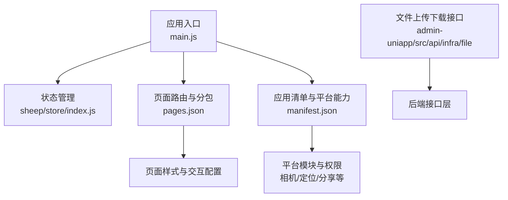
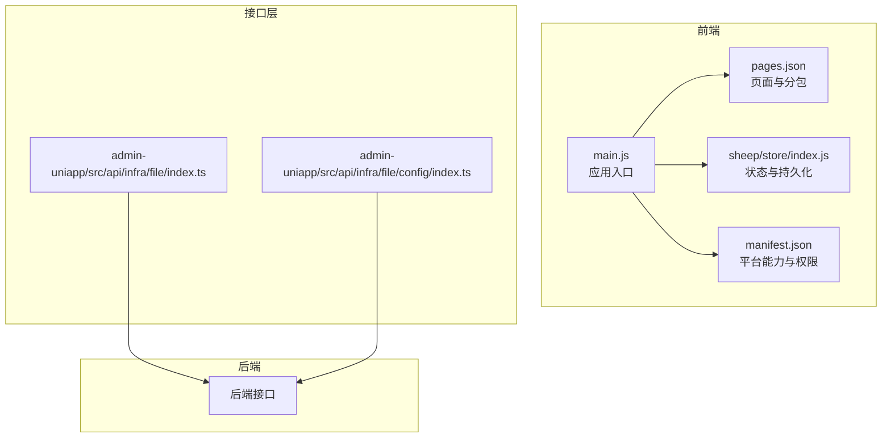
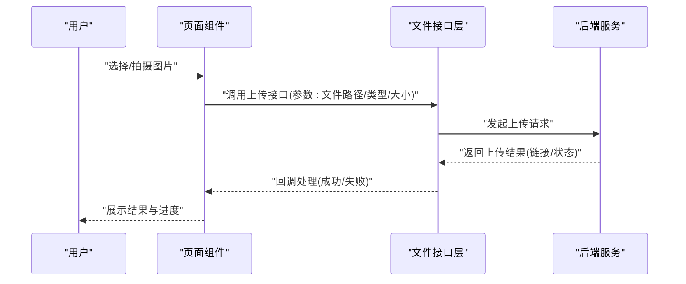
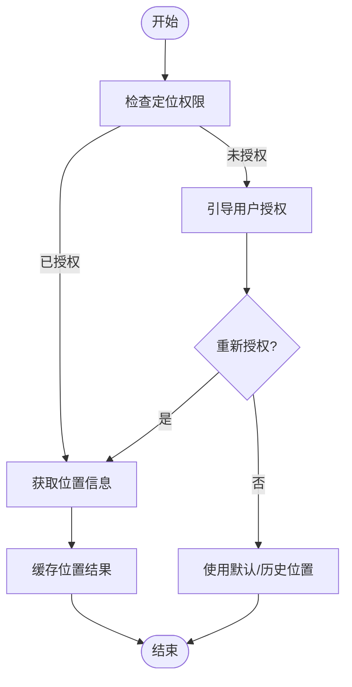
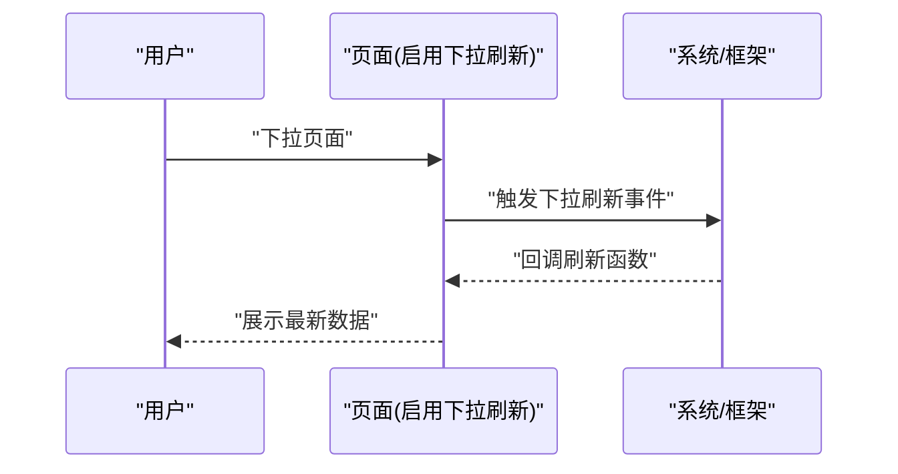
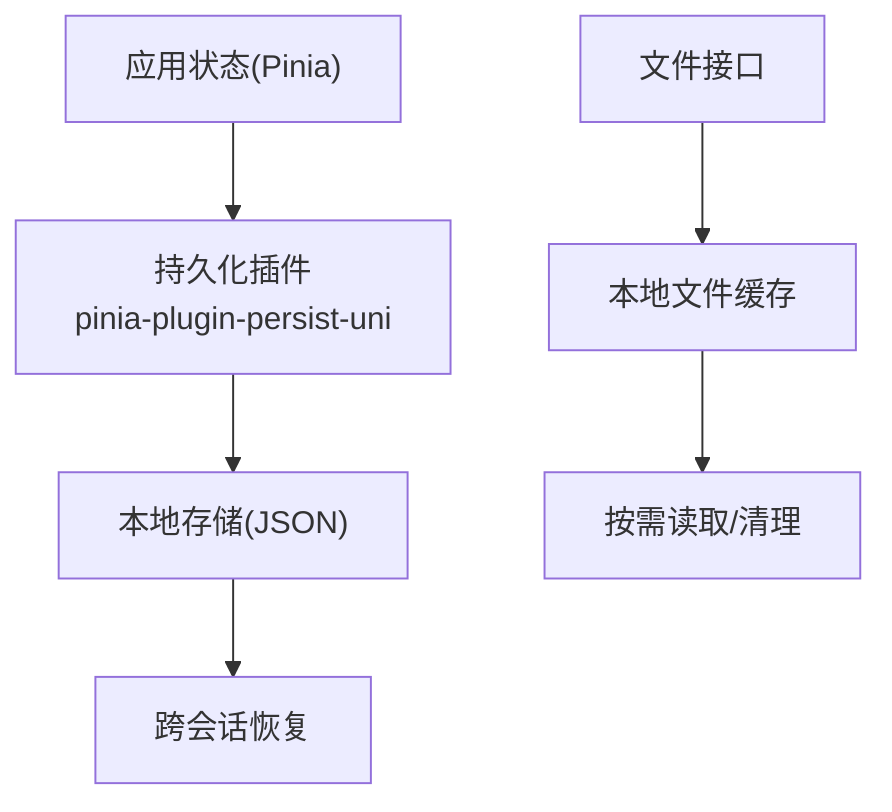
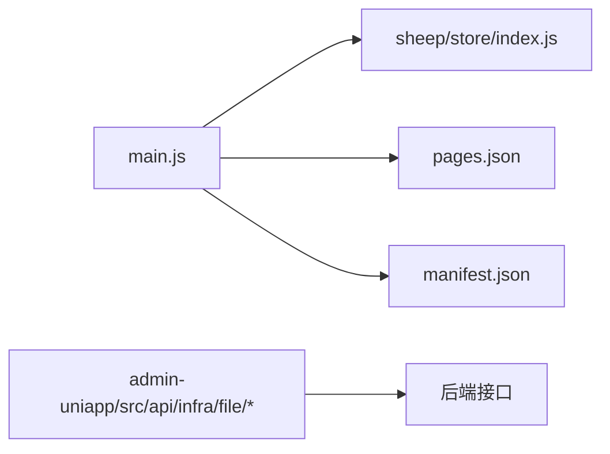

# 移动端特有功能

<cite>
**本文引用的文件**
- [main.js](file://frontend/mall-uniapp/main.js)
- [manifest.json](file://frontend/mall-uniapp/manifest.json)
- [pages.json](file://frontend/mall-uniapp/pages.json)
- [index.js](file://frontend/mall-uniapp/sheep/store/index.js)
- [index.ts](file://frontend/admin-uniapp/src/api/infra/file/index.ts)
- [index.ts](file://frontend/admin-uniapp/src/api/infra/file/config/index.ts)
</cite>

## 目录
1. [简介](#简介)
2. [项目结构](#项目结构)
3. [核心组件](#核心组件)
4. [架构总览](#架构总览)
5. [详细组件分析](#详细组件分析)
6. [依赖关系分析](#依赖关系分析)
7. [性能考虑](#性能考虑)
8. [故障排查指南](#故障排查指南)
9. [结论](#结论)
10. [附录](#附录)

## 简介
本文件聚焦于移动端特有功能的实现与优化策略，结合仓库中现有的 uni-app 前端工程，系统梳理以下能力：
- 文件上传下载与图片处理
- 地理位置获取与设备信息读取
- 下拉刷新、上拉加载、无限滚动与手势操作
- 移动端存储机制（LocalStorage、文件存储）与缓存策略
- 性能监控、内存管理与电量优化
- 开发最佳实践、兼容性处理与用户体验优化建议

说明：仓库中未发现专门的“手势操作”或“无限滚动”组件实现，因此本节以现有配置与通用实践进行指导。

## 项目结构
移动端工程采用 uni-app 架构，入口为 mall-uniapp，核心配置包括：
- 应用清单与平台能力声明：manifest.json
- 页面路由与分包配置：pages.json
- 状态管理与持久化：sheep/store/index.js
- 应用启动入口：main.js
- 文件上传下载接口：admin-uniapp/src/api/infra/file

**图表来源**
- [main.js:1-16](file://frontend/mall-uniapp/main.js#L1-L16)
- [pages.json:1-704](file://frontend/mall-uniapp/pages.json#L1-L704)
- [manifest.json:1-225](file://frontend/mall-uniapp/manifest.json#L1-L225)
- [index.js:1-21](file://frontend/mall-uniapp/sheep/store/index.js#L1-L21)

**章节来源**
- [main.js:1-16](file://frontend/mall-uniapp/main.js#L1-L16)
- [pages.json:1-704](file://frontend/mall-uniapp/pages.json#L1-L704)
- [manifest.json:1-225](file://frontend/mall-uniapp/manifest.json#L1-L225)
- [index.js:1-21](file://frontend/mall-uniapp/sheep/store/index.js#L1-L21)

## 核心组件
- 应用启动与状态管理
  - 通过 createSSRApp 初始化应用，并注册 Pinia 及持久化插件，确保移动端状态跨会话保留。
- 页面与分包
  - pages.json 中启用多子包与分包懒加载，减少首屏体积；部分页面开启下拉刷新。
- 平台能力与权限
  - manifest.json 声明 Android/iOS 权限与模块（相机、定位、支付、分享、视频播放、OAuth），并配置隐私说明与 SDK 集成。

**章节来源**
- [main.js:1-16](file://frontend/mall-uniapp/main.js#L1-L16)
- [pages.json:1-704](file://frontend/mall-uniapp/pages.json#L1-L704)
- [manifest.json:1-225](file://frontend/mall-uniapp/manifest.json#L1-L225)
- [index.js:1-21](file://frontend/mall-uniapp/sheep/store/index.js#L1-L21)

## 架构总览
移动端架构围绕 uni-app 的“一套代码多端运行”理念构建，前端通过 pages.json 组织页面与分包，manifest.json 声明平台能力，sheep/store 提供状态与持久化，文件上传下载通过 admin-uniapp 的 API 层对接后端。

**图表来源**
- [main.js:1-16](file://frontend/mall-uniapp/main.js#L1-L16)
- [pages.json:1-704](file://frontend/mall-uniapp/pages.json#L1-L704)
- [index.js:1-21](file://frontend/mall-uniapp/sheep/store/index.js#L1-L21)
- [manifest.json:1-225](file://frontend/mall-uniapp/manifest.json#L1-L225)
- [index.ts](file://frontend/admin-uniapp/src/api/infra/file/index.ts)
- [index.ts](file://frontend/admin-uniapp/src/api/infra/file/config/index.ts)

## 详细组件分析

### 文件上传下载与图片处理
- 能力基础
  - manifest.json 声明相机、相册、网络、存储等权限，满足图片选择与上传场景。
  - pages.json 在聊天页配置软键盘弹起时页面适配模式，有助于图片预览与输入场景的交互。
- 实现要点
  - 使用 uni.uploadFile/uni.downloadFile 进行文件传输，结合后端接口完成业务流程。
  - 图片处理建议：
    - 上传前压缩尺寸与质量，降低带宽与存储压力。
    - 采用 CDN 缓存与懒加载策略，提升首屏与滚动性能。
- 优化策略
  - 分片上传与断点续传（如需大文件）。
  - 本地缩略图与占位图，避免白块与重绘。
  - 离线缓存与版本控制，减少重复请求。

**图表来源**
- [index.ts](file://frontend/admin-uniapp/src/api/infra/file/index.ts)
- [index.ts](file://frontend/admin-uniapp/src/api/infra/file/config/index.ts)

**章节来源**
- [manifest.json:33-66](file://frontend/mall-uniapp/manifest.json#L33-L66)
- [pages.json:548-564](file://frontend/mall-uniapp/pages.json#L548-L564)

### 地理位置获取与设备信息读取
- 能力基础
  - manifest.json 声明粗略/精确位置权限，支持定位能力。
  - 支付、分享、视频播放、OAuth 等模块可用于扩展业务场景。
- 实现要点
  - 使用 uni.getLocation 获取经纬度与精度信息，结合 uni.openLocation 打开地图。
  - 设备信息可通过 uni.getSystemInfoSync 获取品牌、型号、操作系统、屏幕尺寸等。
- 优化策略
  - 合并定位请求，避免频繁调用；对位置结果做去抖与缓存。
  - 对隐私授权进行引导与降级处理，保证无权限时的可用性。

**图表来源**
- [manifest.json:36-65](file://frontend/mall-uniapp/manifest.json#L36-L65)

**章节来源**
- [manifest.json:36-65](file://frontend/mall-uniapp/manifest.json#L36-L65)

### 下拉刷新、上拉加载、无限滚动与手势操作
- 下拉刷新
  - pages.json 在首页与订单页等页面开启 enablePullDownRefresh，实现标准下拉刷新。
- 上拉加载/无限滚动
  - 仓库未直接提供无限滚动组件实现，可结合 z-paging 或 uni-load-more 等组件实现。
- 手势操作
  - 仓库未发现专用手势组件，可使用 uni-gesture 或自定义 touch 事件处理。
- 优化策略
  - 控制刷新频率与加载阈值，避免频繁触发。
  - 列表项高度固定或预估高度，减少布局抖动。
  - 滚动区域局部化，避免全局滚动引发的重排。

**图表来源**
- [pages.json:14](file://frontend/mall-uniapp/pages.json#L14)
- [pages.json:188](file://frontend/mall-uniapp/pages.json#L188)

**章节来源**
- [pages.json:14](file://frontend/mall-uniapp/pages.json#L14)
- [pages.json:188](file://frontend/mall-uniapp/pages.json#L188)

### 移动端存储机制与缓存策略
- 状态与持久化
  - shee/store 使用 Pinia 与 pinia-plugin-persist-uni，实现跨页面与跨会话的状态持久化，适合用户偏好、购物车等数据。
- 本地存储
  - uni.setStorageSync/uni.getStorageSync 用于小体量键值对缓存；注意容量限制与清理策略。
- 文件存储
  - uni.saveFile/uni.openDocument 等用于本地文件管理；结合权限与隐私政策使用。
- 缓存策略
  - 针对图片与静态资源采用 CDN 与浏览器缓存头；对动态数据采用内存缓存+过期时间控制。
  - 对离线场景提供兜底数据与增量更新。

**图表来源**
- [index.js:1-21](file://frontend/mall-uniapp/sheep/store/index.js#L1-L21)

**章节来源**
- [index.js:1-21](file://frontend/mall-uniapp/sheep/store/index.js#L1-L21)

## 依赖关系分析
- 应用入口依赖状态管理与页面配置，状态管理依赖持久化插件。
- 页面配置依赖 manifest 中的平台能力与权限声明。
- 文件上传下载接口依赖后端服务。

**图表来源**
- [main.js:1-16](file://frontend/mall-uniapp/main.js#L1-L16)
- [pages.json:1-704](file://frontend/mall-uniapp/pages.json#L1-L704)
- [manifest.json:1-225](file://frontend/mall-uniapp/manifest.json#L1-L225)
- [index.ts](file://frontend/admin-uniapp/src/api/infra/file/index.ts)
- [index.ts](file://frontend/admin-uniapp/src/api/infra/file/config/index.ts)

**章节来源**
- [main.js:1-16](file://frontend/mall-uniapp/main.js#L1-L16)
- [pages.json:1-704](file://frontend/mall-uniapp/pages.json#L1-L704)
- [manifest.json:1-225](file://frontend/mall-uniapp/manifest.json#L1-L225)
- [index.ts](file://frontend/admin-uniapp/src/api/infra/file/index.ts)
- [index.ts](file://frontend/admin-uniapp/src/api/infra/file/config/index.ts)

## 性能考虑
- 启动与渲染
  - 使用 manifest.json 的 nvueLaunchMode 与 fast 模式加速启动。
  - 合理设置 transformPx 与 px 转换策略，减少样式计算。
- 网络与缓存
  - 对图片与静态资源启用 CDN 与强缓存；对接口数据采用内存缓存与过期控制。
- 内存与电量
  - 避免长列表全量渲染，采用虚拟滚动与懒加载。
  - 控制后台任务与定位频率，降低电量消耗。
- 体积与分包
  - pages.json 的分包与懒加载策略减少首屏体积，提升冷启动速度。

**章节来源**
- [manifest.json:8-13](file://frontend/mall-uniapp/manifest.json#L8-L13)
- [pages.json:87-671](file://frontend/mall-uniapp/pages.json#L87-L671)

## 故障排查指南
- 权限相关
  - 若定位/相机/相册不可用，检查 manifest.json 中权限声明与隐私说明是否完整。
- 页面刷新
  - 若下拉刷新无效，确认对应页面在 pages.json 中已启用 enablePullDownRefresh。
- 存储与缓存
  - 若状态丢失，检查 pinia 插件是否正确安装与初始化。
- 文件上传
  - 若上传失败，核对后端接口签名与鉴权逻辑，以及文件大小与格式限制。

**章节来源**
- [manifest.json:33-86](file://frontend/mall-uniapp/manifest.json#L33-L86)
- [pages.json:14](file://frontend/mall-uniapp/pages.json#L14)
- [index.js:1-21](file://frontend/mall-uniapp/sheep/store/index.js#L1-L21)

## 结论
本项目在移动端特性方面具备良好的基础设施：通过 manifest.json 明确平台能力与权限，pages.json 提供页面与分包组织，sheep/store 提供状态与持久化，配合 admin-uniapp 的文件接口实现上传下载。建议在此基础上补充无限滚动与手势组件，完善性能监控与内存管理策略，持续优化用户体验与稳定性。

## 附录
- 最佳实践清单
  - 权限最小化与透明化：仅申请必要权限并在首次使用时引导授权。
  - 图片处理：上传前压缩、CDN 缓存、懒加载与骨架屏。
  - 刷新与滚动：控制触发频率、使用虚拟滚动、局部滚动容器。
  - 存储策略：区分内存缓存与持久化存储，定期清理过期数据。
  - 性能监控：埋点关键指标（首屏、交互延迟、崩溃率），结合日志与上报。
  - 兼容性：针对不同平台（iOS/Android/小程序/H5）差异进行适配与降级。