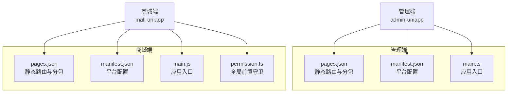
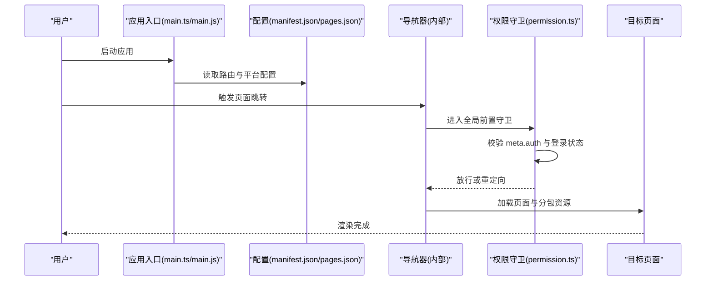
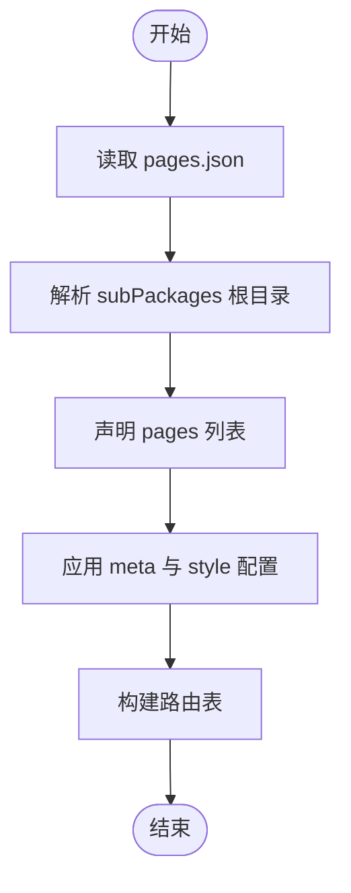
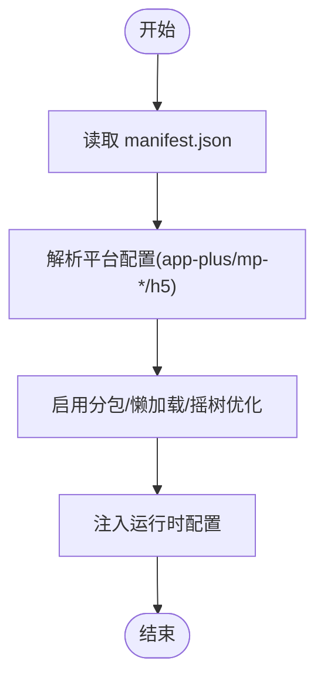
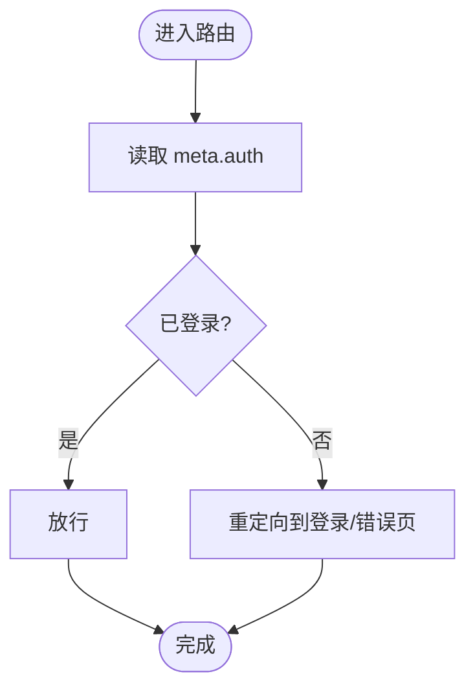
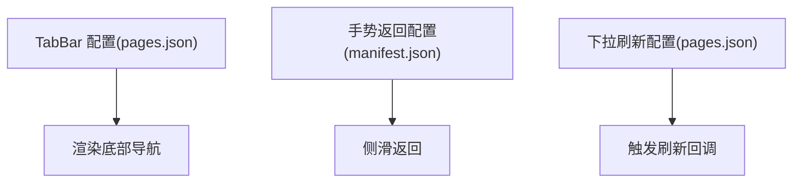
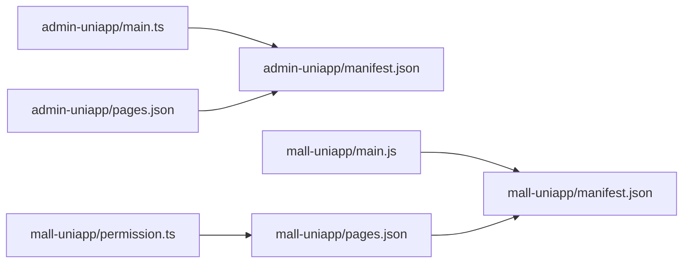

# 路由与导航

<cite>
**本文引用的文件**
- [admin-uniapp/pages.json](file://frontend/admin-uniapp/src/pages.json)
- [mall-uniapp/pages.json](file://frontend/mall-uniapp/pages.json)
- [admin-uniapp/manifest.json](file://frontend/admin-uniapp/src/manifest.json)
- [mall-uniapp/manifest.json](file://frontend/mall-uniapp/manifest.json)
- [admin-uniapp/main.ts](file://frontend/admin-uniapp/src/main.ts)
- [mall-uniapp/main.js](file://frontend/mall-uniapp/main.js)
- [mall-uniapp/permission.ts](file://frontend/admin-vue3/src/permission.ts)
</cite>

## 目录
1. [简介](#简介)
2. [项目结构](#项目结构)
3. [核心组件](#核心组件)
4. [架构总览](#架构总览)
5. [详细组件分析](#详细组件分析)
6. [依赖分析](#依赖分析)
7. [性能考虑](#性能考虑)
8. [故障排查指南](#故障排查指南)
9. [结论](#结论)
10. [附录](#附录)

## 简介
本文件系统性梳理并文档化本仓库中 UniApp 路由与导航体系，覆盖以下主题：
- 路由配置与页面路由管理：pages.json 的静态路由声明、分包策略、全局样式与平台特定配置
- 导航拦截与权限控制：通过路由元信息 meta 字段与全局前置守卫实现的权限校验与页面跳转控制
- 动态路由与面包屑：基于元信息的动态生成与导航路径展示建议
- 页面缓存策略：结合页面栈与生命周期的缓存与恢复机制
- 移动端特有导航模式：TabBar、侧滑返回与手势导航
- 性能优化：分包、懒加载、预加载与按需资源加载
- 最佳实践与调试技巧：配置规范、常见问题定位与排障方法

## 项目结构
本仓库包含两个前端工程：
- 管理端（admin-uniapp）：采用 pages.json 声明式路由，支持分包与自定义组件扫描
- 商城端（mall-uniapp）：同样以 pages.json 声明式路由为主，内置 TabBar、下拉刷新等移动端特性，并在 manifest.json 中配置了多平台优化参数

图表来源
- [admin-uniapp/pages.json:1-1042](file://frontend/admin-uniapp/src/pages.json#L1-L1042)
- [admin-uniapp/manifest.json:1-136](file://frontend/admin-uniapp/src/manifest.json#L1-L136)
- [admin-uniapp/main.ts](file://frontend/admin-uniapp/src/main.ts)
- [mall-uniapp/pages.json:1-704](file://frontend/mall-uniapp/pages.json#L1-L704)
- [mall-uniapp/manifest.json:1-225](file://frontend/mall-uniapp/manifest.json#L1-L225)
- [mall-uniapp/main.js](file://frontend/mall-uniapp/main.js)
- [mall-uniapp/permission.ts](file://frontend/admin-vue3/src/permission.ts)

章节来源
- [admin-uniapp/pages.json:1-1042](file://frontend/admin-uniapp/src/pages.json#L1-L1042)
- [mall-uniapp/pages.json:1-704](file://frontend/mall-uniapp/pages.json#L1-L704)
- [admin-uniapp/manifest.json:1-136](file://frontend/admin-uniapp/src/manifest.json#L1-L136)
- [mall-uniapp/manifest.json:1-225](file://frontend/mall-uniapp/manifest.json#L1-L225)
- [admin-uniapp/main.ts](file://frontend/admin-uniapp/src/main.ts)
- [mall-uniapp/main.js](file://frontend/mall-uniapp/main.js)
- [mall-uniapp/permission.ts](file://frontend/admin-vue3/src/permission.ts)

## 核心组件
- 静态路由与分包：通过 pages.json 的 pages 与 subPackages 字段声明页面与分包，支持 style 与 meta 扩展字段
- 平台配置：通过 manifest.json 的 app-plus、mp-* 等节点配置平台能力与优化参数
- 应用入口：main.ts/main.js 初始化应用与运行时环境
- 全局前置守卫：permission.ts 实现路由拦截与权限校验（在 admin-vue3 工程中）

章节来源
- [admin-uniapp/pages.json:1-1042](file://frontend/admin-uniapp/src/pages.json#L1-L1042)
- [mall-uniapp/pages.json:1-704](file://frontend/mall-uniapp/pages.json#L1-L704)
- [admin-uniapp/manifest.json:1-136](file://frontend/admin-uniapp/src/manifest.json#L1-L136)
- [mall-uniapp/manifest.json:1-225](file://frontend/mall-uniapp/manifest.json#L1-L225)
- [admin-uniapp/main.ts](file://frontend/admin-uniapp/src/main.ts)
- [mall-uniapp/main.js](file://frontend/mall-uniapp/main.js)
- [mall-uniapp/permission.ts](file://frontend/admin-vue3/src/permission.ts)

## 架构总览
UniApp 路由与导航在本仓库中的整体工作流如下：
- 应用启动：main.ts/main.js 加载运行时与平台配置
- 路由声明：pages.json 声明页面与分包；manifest.json 提供平台级优化
- 导航触发：页面内或外部入口触发跳转
- 权限校验：全局前置守卫根据 meta.auth 与登录状态进行放行/拦截
- 页面渲染：按需加载分包与页面资源，结合生命周期实现缓存与恢复

图表来源
- [admin-uniapp/main.ts](file://frontend/admin-uniapp/src/main.ts)
- [mall-uniapp/main.js](file://frontend/mall-uniapp/main.js)
- [mall-uniapp/permission.ts](file://frontend/admin-vue3/src/permission.ts)
- [admin-uniapp/pages.json:1-1042](file://frontend/admin-uniapp/src/pages.json#L1-L1042)
- [mall-uniapp/pages.json:1-704](file://frontend/mall-uniapp/pages.json#L1-L704)
- [admin-uniapp/manifest.json:1-136](file://frontend/admin-uniapp/src/manifest.json#L1-L136)
- [mall-uniapp/manifest.json:1-225](file://frontend/mall-uniapp/manifest.json#L1-L225)

## 详细组件分析

### 静态路由与页面管理（pages.json）
- 声明式路由：pages.json 的 pages 与 subPackages 字段定义页面集合与分包根目录
- 页面样式与元信息：每个页面可配置 style（如导航栏标题、下拉刷新）与 meta（如 auth、sync、title、group），用于权限与面包屑等扩展
- 分包策略：通过 root 字段划分业务域，减少首屏包体，提升加载速度
- 平台特定配置：globalStyle 中的 navigationStyle、mp-alipay 的 gestureBack 等

图表来源
- [admin-uniapp/pages.json:1-1042](file://frontend/admin-uniapp/src/pages.json#L1-L1042)
- [mall-uniapp/pages.json:1-704](file://frontend/mall-uniapp/pages.json#L1-L704)

章节来源
- [admin-uniapp/pages.json:1-1042](file://frontend/admin-uniapp/src/pages.json#L1-L1042)
- [mall-uniapp/pages.json:1-704](file://frontend/mall-uniapp/pages.json#L1-L704)

### 平台配置与优化（manifest.json）
- app-plus：统一配置 nvue 编译器、splashscreen、modules、distribute 等
- mp-weixin/mp-alipay/mp-baidu 等：针对小程序平台的优化开关（如 lazyCodeLoading、optimization.subPackages）
- h5：router.mode 与 base 配置，以及 async 超时与 treeShaking 开启
- 移动端导航：mp-alipay 的 gestureBack、allowsBounceVertical、navigationStyle 等

图表来源
- [admin-uniapp/manifest.json:1-136](file://frontend/admin-uniapp/src/manifest.json#L1-L136)
- [mall-uniapp/manifest.json:1-225](file://frontend/mall-uniapp/manifest.json#L1-L225)

章节来源
- [admin-uniapp/manifest.json:1-136](file://frontend/admin-uniapp/src/manifest.json#L1-L136)
- [mall-uniapp/manifest.json:1-225](file://frontend/mall-uniapp/manifest.json#L1-L225)

### 全局前置守卫与权限控制（permission.ts）
- 守卫入口：在进入任意路由前执行
- 校验逻辑：依据页面 meta.auth 与当前登录状态决定是否放行
- 控制手段：允许放行、重定向至登录页或错误页
- 与页面联动：配合 pages.json 的 meta.auth 字段实现细粒度权限控制

图表来源
- [mall-uniapp/permission.ts](file://frontend/admin-vue3/src/permission.ts)

章节来源
- [mall-uniapp/permission.ts](file://frontend/admin-vue3/src/permission.ts)

### 移动端导航模式与手势
- TabBar：mall-uniapp 在 pages.json 的 tabBar 字段中声明底部导航项
- 侧滑返回与手势：通过 manifest.json 的 mp-alipay.gestureBack 等配置启用原生手势返回
- 下拉刷新：部分页面在 style 中开启 enablePullDownRefresh，结合页面生命周期实现刷新逻辑

图表来源
- [mall-uniapp/pages.json:688-702](file://frontend/mall-uniapp/pages.json#L688-L702)
- [mall-uniapp/manifest.json:679-686](file://frontend/mall-uniapp/manifest.json#L679-L686)

章节来源
- [mall-uniapp/pages.json:688-702](file://frontend/mall-uniapp/pages.json#L688-L702)
- [mall-uniapp/manifest.json:679-686](file://frontend/mall-uniapp/manifest.json#L679-L686)

### 页面缓存策略
- 页面栈与生命周期：利用页面 onShow/onHide/onUnload 等生命周期实现缓存与释放
- 分包与懒加载：通过 manifest.json 的 subPackages 与 lazyCodeLoading 减少初始包体积
- 预加载：在进入页面前预取必要数据，降低感知延迟

章节来源
- [mall-uniapp/manifest.json:178-182](file://frontend/mall-uniapp/manifest.json#L178-L182)
- [admin-uniapp/pages.json:1-1042](file://frontend/admin-uniapp/src/pages.json#L1-L1042)

### 动态路由与面包屑
- 动态路由：可通过 meta.group/title 等字段在运行时动态生成导航菜单
- 面包屑：结合 meta.group 与页面标题，构建层级导航路径，便于用户定位

章节来源
- [mall-uniapp/pages.json:16-84](file://frontend/mall-uniapp/pages.json#L16-L84)

## 依赖分析
- 应用入口依赖 manifest.json 的平台配置与 pages.json 的路由声明
- 权限守卫依赖页面 meta.auth 字段与登录状态存储
- 移动端导航依赖 manifest.json 的 mp-* 平台配置与 pages.json 的 tabBar 声明

图表来源
- [admin-uniapp/main.ts](file://frontend/admin-uniapp/src/main.ts)
- [mall-uniapp/main.js](file://frontend/mall-uniapp/main.js)
- [mall-uniapp/permission.ts](file://frontend/admin-vue3/src/permission.ts)
- [admin-uniapp/pages.json:1-1042](file://frontend/admin-uniapp/src/pages.json#L1-L1042)
- [mall-uniapp/pages.json:1-704](file://frontend/mall-uniapp/pages.json#L1-L704)
- [admin-uniapp/manifest.json:1-136](file://frontend/admin-uniapp/src/manifest.json#L1-L136)
- [mall-uniapp/manifest.json:1-225](file://frontend/mall-uniapp/manifest.json#L1-L225)

章节来源
- [admin-uniapp/main.ts](file://frontend/admin-uniapp/src/main.ts)
- [mall-uniapp/main.js](file://frontend/mall-uniapp/main.js)
- [mall-uniapp/permission.ts](file://frontend/admin-vue3/src/permission.ts)
- [admin-uniapp/pages.json:1-1042](file://frontend/admin-uniapp/src/pages.json#L1-L1042)
- [mall-uniapp/pages.json:1-704](file://frontend/mall-uniapp/pages.json#L1-L704)
- [admin-uniapp/manifest.json:1-136](file://frontend/admin-uniapp/src/manifest.json#L1-L136)
- [mall-uniapp/manifest.json:1-225](file://frontend/mall-uniapp/manifest.json#L1-L225)

## 性能考虑
- 分包策略：通过 subPackages 将大模块拆分，降低首屏加载压力
- 懒加载：启用 lazyCodeLoading 与按需组件加载，减少初始包体
- 摇树优化：H5 平台开启 treeShaking，剔除未使用代码
- 平台优化：各小程序平台开启 optimization.subPackages 与相关优化开关
- 页面缓存：合理使用生命周期与分包，避免重复加载

章节来源
- [admin-uniapp/manifest.json:100-101](file://frontend/admin-uniapp/src/manifest.json#L100-L101)
- [mall-uniapp/manifest.json:178-182](file://frontend/mall-uniapp/manifest.json#L178-L182)
- [mall-uniapp/manifest.json:214-218](file://frontend/mall-uniapp/manifest.json#L214-L218)

## 故障排查指南
- 页面无法显示或白屏
  - 检查 pages.json 中页面路径与 style 配置是否正确
  - 确认 manifest.json 的 app-plus splashscreen 与 modules 配置
- 分包资源加载失败
  - 核对 subPackages.root 与页面路径映射关系
  - 检查小程序平台 optimization.subPackages 是否开启
- 登录后仍被拦截
  - 确认 permission.ts 中 meta.auth 与登录状态判断逻辑
  - 检查页面 meta.auth 字段是否正确标注
- 手势返回异常
  - 检查 manifest.json 的 mp-alipay.gestureBack 与 navigationStyle 配置
- 下拉刷新无效
  - 确认页面 style.enablePullDownRefresh 是否开启
  - 检查页面 onPullDownRefresh 生命周期绑定

章节来源
- [admin-uniapp/pages.json:1-1042](file://frontend/admin-uniapp/src/pages.json#L1-L1042)
- [mall-uniapp/pages.json:1-704](file://frontend/mall-uniapp/pages.json#L1-L704)
- [admin-uniapp/manifest.json:1-136](file://frontend/admin-uniapp/src/manifest.json#L1-L136)
- [mall-uniapp/manifest.json:1-225](file://frontend/mall-uniapp/manifest.json#L1-L225)
- [mall-uniapp/permission.ts](file://frontend/admin-vue3/src/permission.ts)

## 结论
本仓库的路由与导航体系以 pages.json 为核心，结合 manifest.json 的平台优化与 permission.ts 的全局守卫，实现了清晰的页面管理、灵活的权限控制与良好的移动端体验。通过分包、懒加载与摇树优化，兼顾了首屏性能与功能扩展性。建议在后续迭代中持续完善 meta 元信息与权限模型，确保路由与导航的可维护性与可扩展性。

## 附录
- 最佳实践
  - 使用 meta.auth 统一管理页面权限
  - 为高频页面开启分包与懒加载
  - 在 manifest.json 中按平台启用相应优化
  - 为 TabBar 页面提供明确的别名与标题
- 调试技巧
  - 使用 H5 history 模式进行本地调试
  - 通过 console 输出与断点定位路由拦截问题
  - 在小程序开发者工具中检查分包与懒加载效果