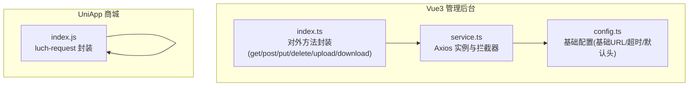
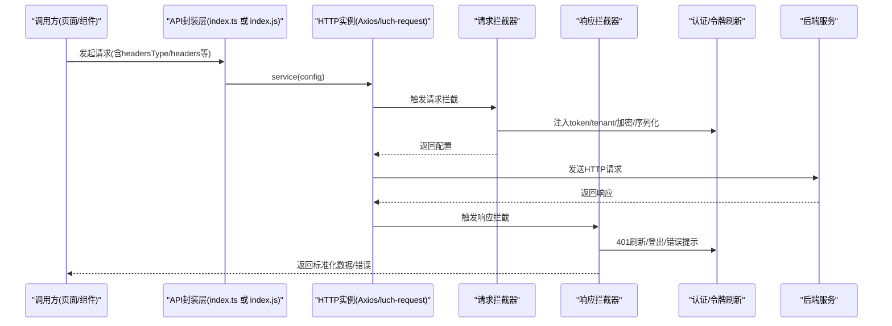
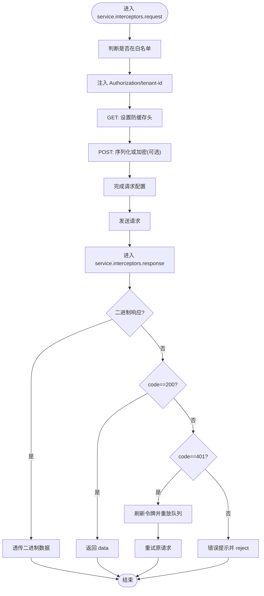
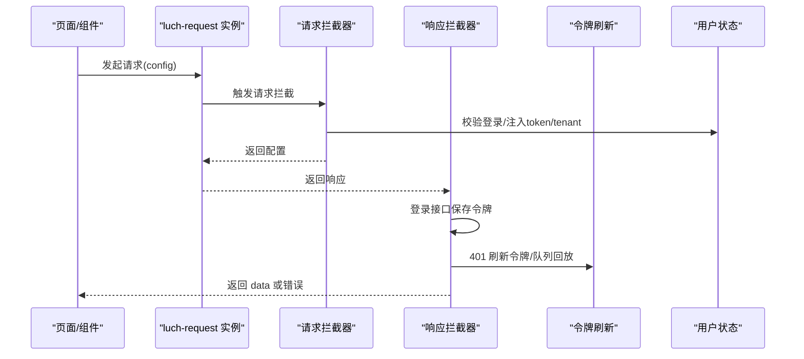
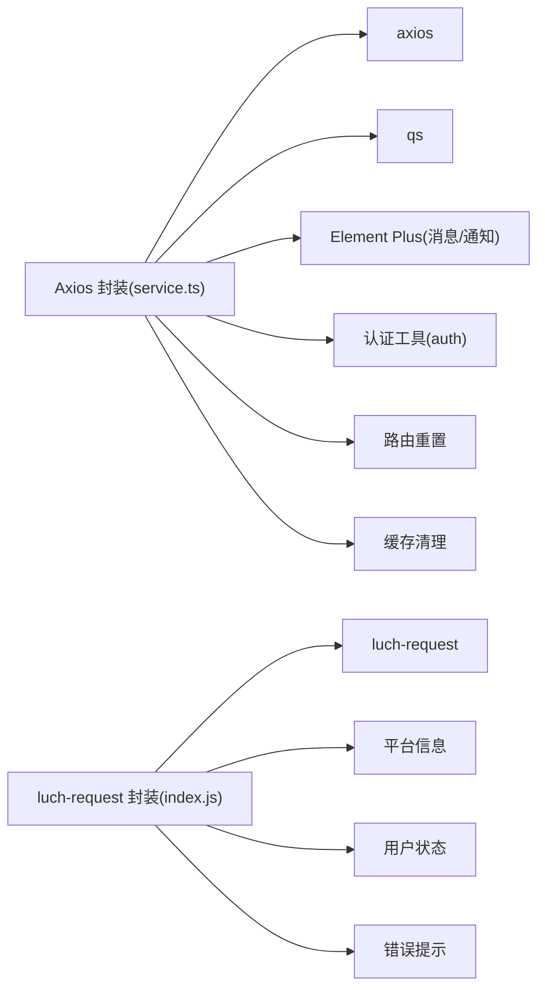

# API 集成

<cite>
**本文引用的文件**
- [frontend/admin-vue3/src/config/axios/index.ts](file://frontend/admin-vue3/src/config/axios/index.ts)
- [frontend/admin-vue3/src/config/axios/service.ts](file://frontend/admin-vue3/src/config/axios/service.ts)
- [frontend/admin-vue3/src/config/axios/config.ts](file://frontend/admin-vue3/src/config/axios/config.ts)
- [frontend/mall-uniapp/sheep/request/index.js](file://frontend/mall-uniapp/sheep/request/index.js)
</cite>

## 目录
1. [引言](#引言)
2. [项目结构](#项目结构)
3. [核心组件](#核心组件)
4. [架构总览](#架构总览)
5. [详细组件分析](#详细组件分析)
6. [依赖关系分析](#依赖关系分析)
7. [性能考量](#性能考量)
8. [故障排查指南](#故障排查指南)
9. [结论](#结论)
10. [附录](#附录)

## 引言
本文件面向前端工程师与后端对接人员，系统化梳理本仓库中的 API 集成架构与实践，覆盖以下主题：
- 前后端数据交互架构与控制流
- Axios 配置、请求/响应拦截器与认证令牌管理
- API 模块化组织、接口定义规范与数据类型约束建议
- 分页处理、文件上传下载、批量操作与实时数据更新的实现思路
- API 调试工具、Mock 数据与性能优化实用技巧

## 项目结构
本仓库包含多套前端工程，其中与 API 集成最相关的为 Vue3 管理后台与 UniApp 商城应用：
- Vue3 管理后台：采用 Axios 封装，统一配置基础地址、超时、序列化、加密与拦截器
- UniApp 商城应用：采用 luch-request 封装，内置鉴权、加载、错误提示与无感刷新令牌

图表来源
- [frontend/admin-vue3/src/config/axios/index.ts:1-48](file://frontend/admin-vue3/src/config/axios/index.ts#L1-L48)
- [frontend/admin-vue3/src/config/axios/service.ts:1-274](file://frontend/admin-vue3/src/config/axios/service.ts#L1-L274)
- [frontend/admin-vue3/src/config/axios/config.ts:1-29](file://frontend/admin-vue3/src/config/axios/config.ts#L1-L29)
- [frontend/mall-uniapp/sheep/request/index.js:1-311](file://frontend/mall-uniapp/sheep/request/index.js#L1-L311)

章节来源
- [frontend/admin-vue3/src/config/axios/index.ts:1-48](file://frontend/admin-vue3/src/config/axios/index.ts#L1-L48)
- [frontend/admin-vue3/src/config/axios/service.ts:1-274](file://frontend/admin-vue3/src/config/axios/service.ts#L1-L274)
- [frontend/admin-vue3/src/config/axios/config.ts:1-29](file://frontend/admin-vue3/src/config/axios/config.ts#L1-L29)
- [frontend/mall-uniapp/sheep/request/index.js:1-311](file://frontend/mall-uniapp/sheep/request/index.js#L1-L311)

## 核心组件
- Axios 封装层（Vue3）
  - 对外方法：get、post、put、delete、upload、download、postOriginal
  - 统一设置 Content-Type 与自定义 headers
  - 通过 service.ts 中的 Axios 实例与拦截器处理认证、租户、加密、错误与重试
- luch-request 封装层（UniApp）
  - 统一 baseURL、超时、平台头、withCredentials 等
  - 请求拦截：鉴权、加载、token/tenant 注入
  - 响应拦截：登录态处理、错误提示、成功提示、无感刷新令牌
  - 支持 /auth 登录场景自动保存令牌

章节来源
- [frontend/admin-vue3/src/config/axios/index.ts:7-47](file://frontend/admin-vue3/src/config/axios/index.ts#L7-L47)
- [frontend/admin-vue3/src/config/axios/service.ts:39-108](file://frontend/admin-vue3/src/config/axios/service.ts#L39-L108)
- [frontend/mall-uniapp/sheep/request/index.js:50-220](file://frontend/mall-uniapp/sheep/request/index.js#L50-L220)

## 架构总览
下图展示两类前端工程的 API 调用链路与关键节点。

图表来源
- [frontend/admin-vue3/src/config/axios/index.ts:7-16](file://frontend/admin-vue3/src/config/axios/index.ts#L7-L16)
- [frontend/admin-vue3/src/config/axios/service.ts:49-108](file://frontend/admin-vue3/src/config/axios/service.ts#L49-L108)
- [frontend/mall-uniapp/sheep/request/index.js:72-220](file://frontend/mall-uniapp/sheep/request/index.js#L72-L220)

## 详细组件分析

### Axios 封装（Vue3）
- 配置项
  - 基础地址、超时、默认 Content-Type、状态码约定
- 请求拦截
  - 白名单跳过 token 注入
  - 自动注入 Authorization 与 tenant-id（按开关）
  - GET 防缓存头
  - 表单序列化与请求体加密（可选）
- 响应拦截
  - 二进制响应透传（如 Excel 导出）
  - 统一错误码映射与提示
  - 401 无感刷新令牌与请求重放
  - 500/901 特殊提示
- 对外方法
  - get/post/put/delete：返回 data 字段
  - upload/download：分别设置 headersType 与 responseType
  - postOriginal：返回完整响应对象

图表来源
- [frontend/admin-vue3/src/config/axios/service.ts:49-241](file://frontend/admin-vue3/src/config/axios/service.ts#L49-L241)

章节来源
- [frontend/admin-vue3/src/config/axios/config.ts:1-29](file://frontend/admin-vue3/src/config/axios/config.ts#L1-L29)
- [frontend/admin-vue3/src/config/axios/service.ts:39-108](file://frontend/admin-vue3/src/config/axios/service.ts#L39-L108)
- [frontend/admin-vue3/src/config/axios/service.ts:110-241](file://frontend/admin-vue3/src/config/axios/service.ts#L110-L241)
- [frontend/admin-vue3/src/config/axios/index.ts:7-47](file://frontend/admin-vue3/src/config/axios/index.ts#L7-L47)

### luch-request 封装（UniApp）
- 基础配置
  - baseURL、timeout、header、平台信息、withCredentials
- 请求拦截
  - 权限接口鉴权弹窗、loading 控制
  - 注入 Authorization、terminal、tenant-id
- 响应拦截
  - 登录接口自动保存 accessToken/refreshToken
  - 401 无感刷新令牌与队列回放
  - 统一错误提示与网络错误分类
- 工具函数
  - getAccessToken/getRefreshToken/getTenantId

图表来源
- [frontend/mall-uniapp/sheep/request/index.js:72-220](file://frontend/mall-uniapp/sheep/request/index.js#L72-L220)

章节来源
- [frontend/mall-uniapp/sheep/request/index.js:50-311](file://frontend/mall-uniapp/sheep/request/index.js#L50-L311)

### 认证与令牌管理
- Vue3（Axios）
  - 通过 Authorization 头注入访问令牌
  - 401 时触发刷新流程，支持请求队列回放
  - 支持租户隔离与访问租户头
- UniApp（luch-request）
  - 同样注入 Authorization/tenant-id
  - 登录接口自动保存令牌
  - 401 时刷新令牌或登出并弹窗

章节来源
- [frontend/admin-vue3/src/config/axios/service.ts:50-108](file://frontend/admin-vue3/src/config/axios/service.ts#L50-L108)
- [frontend/admin-vue3/src/config/axios/service.ts:154-196](file://frontend/admin-vue3/src/config/axios/service.ts#L154-L196)
- [frontend/mall-uniapp/sheep/request/index.js:112-155](file://frontend/mall-uniapp/sheep/request/index.js#L112-L155)
- [frontend/mall-uniapp/sheep/request/index.js:225-275](file://frontend/mall-uniapp/sheep/request/index.js#L225-L275)

### 文件上传与下载
- Vue3（Axios）
  - upload：强制 multipart/form-data，返回完整响应
  - download：强制 blob 响应，返回二进制数据
- UniApp（luch-request）
  - 通过 luch-request 的底层能力支持文件上传/下载（具体使用方式以业务为准）

章节来源
- [frontend/admin-vue3/src/config/axios/index.ts:42-46](file://frontend/admin-vue3/src/config/axios/index.ts#L42-L46)
- [frontend/admin-vue3/src/config/axios/service.ts:138-147](file://frontend/admin-vue3/src/config/axios/service.ts#L138-L147)
- [frontend/mall-uniapp/sheep/request/index.js:1-311](file://frontend/mall-uniapp/sheep/request/index.js#L1-L311)

### 批量操作与分页处理
- 批量操作
  - 建议通过统一的批量接口提交数组 ID，后端返回批处理结果
  - 前端对每个子任务进行进度反馈与汇总
- 分页处理
  - 建议统一 page/size 参数，后端返回 total/page/items 结构
  - 前端在列表组件中统一处理 loading、空态与触底加载

说明：以上为通用实践建议，具体实现需结合后端接口规范与业务场景。

### 实时数据更新
- WebSocket/Server-Sent Events：在需要实时推送的场景引入
- 轮询：轻量场景可用定时轮询，注意节流与去重
- 乐观更新：在提交成功后立即更新本地状态，失败时回滚

说明：本仓库未发现专门的实时模块实现，建议按业务需求扩展。

## 依赖关系分析
- Axios 封装依赖
  - axios、qs、Element Plus（通知/消息）、加密工具
  - 与认证工具、路由重置、缓存清理等模块协作
- luch-request 封装依赖
  - luch-request、平台信息、用户状态、错误提示

图表来源
- [frontend/admin-vue3/src/config/axios/service.ts:1-18](file://frontend/admin-vue3/src/config/axios/service.ts#L1-L18)
- [frontend/mall-uniapp/sheep/request/index.js:6-12](file://frontend/mall-uniapp/sheep/request/index.js#L6-L12)

章节来源
- [frontend/admin-vue3/src/config/axios/service.ts:1-18](file://frontend/admin-vue3/src/config/axios/service.ts#L1-L18)
- [frontend/mall-uniapp/sheep/request/index.js:6-12](file://frontend/mall-uniapp/sheep/request/index.js#L6-L12)

## 性能考量
- 请求合并与去抖
  - 对高频查询使用防抖/节流，减少不必要的请求
- 缓存策略
  - GET 请求合理利用浏览器缓存（本项目已设置防缓存头），对长列表分页结果可做内存缓存
- 传输优化
  - 大文件上传采用分片与断点续传
  - 响应二进制数据直接透传，避免额外解析
- 超时与重试
  - 合理设置超时时间；对幂等请求允许有限次重试
- 图标与资源
  - 懒加载与按需引入，减少首屏压力

## 故障排查指南
- 常见问题定位
  - 网络错误：检查 baseURL、跨域、证书与 withCredentials
  - 401 未授权：确认 token 是否存在、是否过期、刷新流程是否成功
  - 403 拒绝访问：核对权限与租户头
  - 超时：提升超时阈值或优化后端性能
- 日志与调试
  - 在拦截器中输出关键配置与响应摘要
  - 使用浏览器/开发者工具 Network 面板查看请求头与响应体
- Mock 与联调
  - 前端可使用 Mock 数据快速验证 UI 与交互
  - 后端提供 OpenAPI/Swagger 文档，统一接口契约

章节来源
- [frontend/admin-vue3/src/config/axios/service.ts:227-241](file://frontend/admin-vue3/src/config/axios/service.ts#L227-L241)
- [frontend/mall-uniapp/sheep/request/index.js:156-220](file://frontend/mall-uniapp/sheep/request/index.js#L156-L220)

## 结论
本仓库提供了两套成熟的前端 API 封装方案：
- Vue3 端基于 Axios 的统一配置与拦截器，具备完善的认证、租户、加密与错误处理能力
- UniApp 端基于 luch-request 的封装，内置鉴权、加载与无感刷新令牌机制

建议在实际项目中：
- 明确接口规范与数据类型约束，统一分页与批量操作协议
- 在复杂场景引入实时通信或轮询策略
- 结合 Mock 与联调工具，提升开发与测试效率

## 附录

### 接口定义规范与数据类型约束（建议）
- 请求参数
  - 必填字段在 TS 类型中明确标注
  - 可选字段提供默认值或空值处理
- 响应结构
  - 统一 code/msg/data 结构
  - 二进制响应单独处理（如 Excel 导出）
- 错误码
  - 明确 200、401、500、901 等场景的处理策略
- 分页
  - page/size/total/items 固定字段名
- 批量
  - ids 数组、批量结果汇总

### API 调试与 Mock 实践
- 调试工具
  - 浏览器 Network 面板、Postman、Charles/Fiddler
- Mock
  - 前端 Mock：快速验证 UI 与交互
  - 后端 Mock：提供 OpenAPI/Swagger 文档
- 性能优化
  - 合理设置超时、缓存与重试
  - 大文件分片上传与断点续传