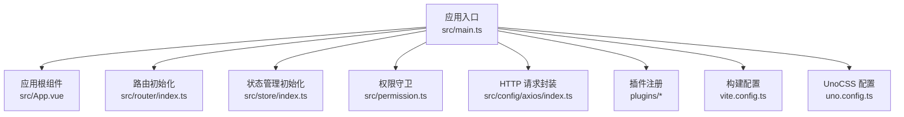
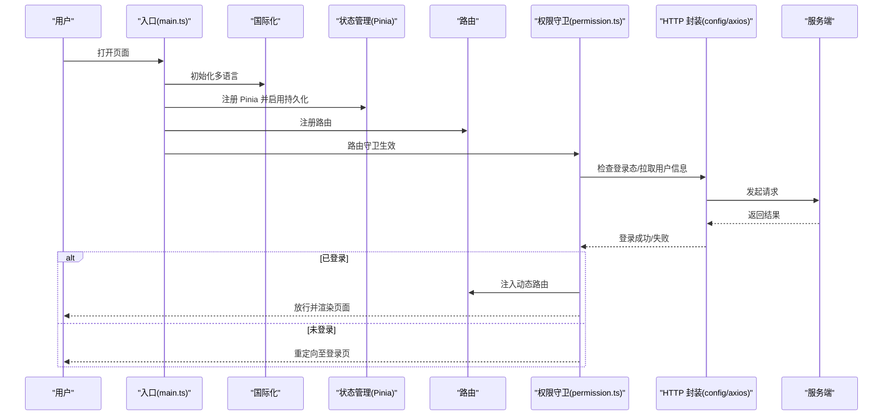
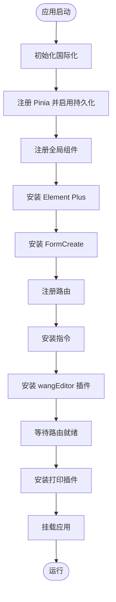
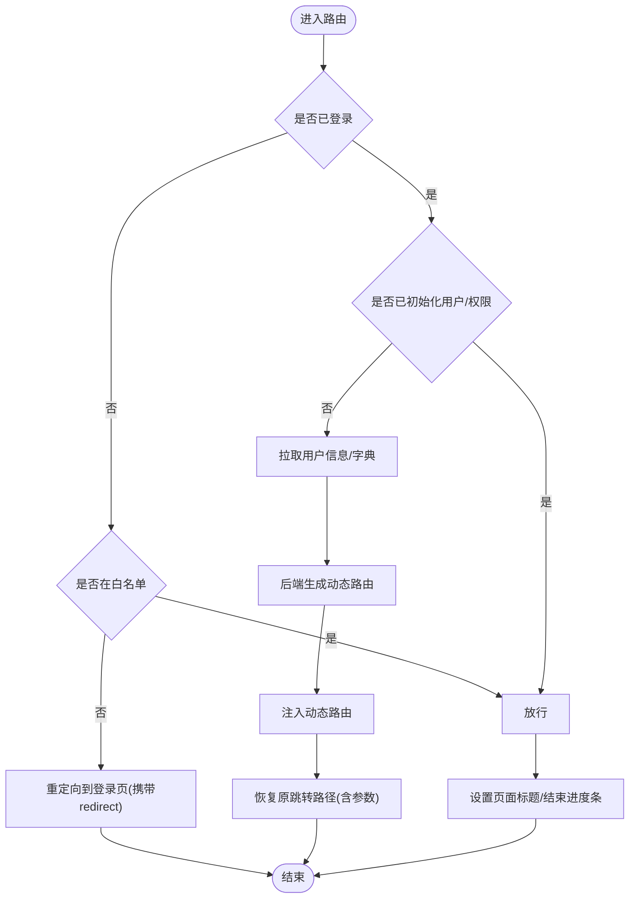
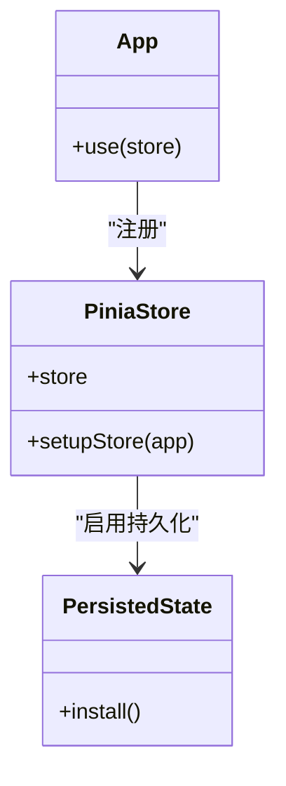
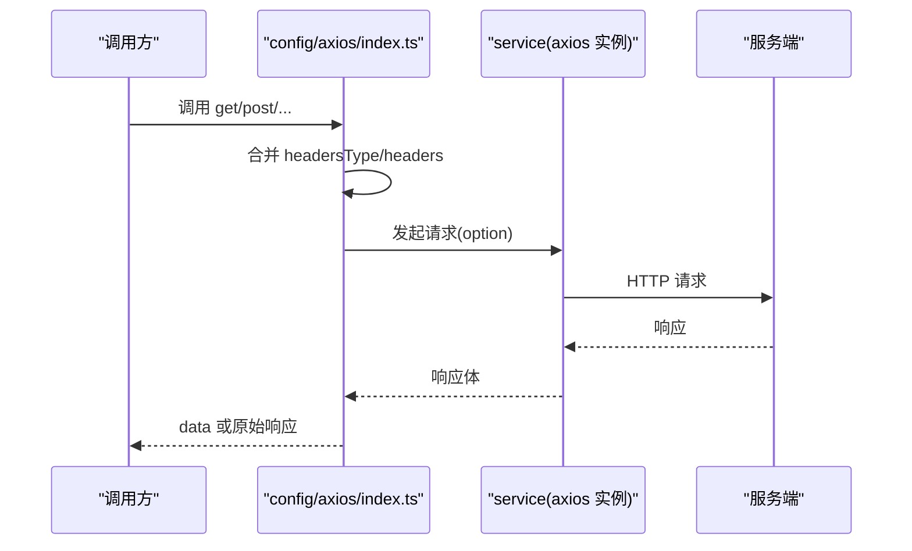
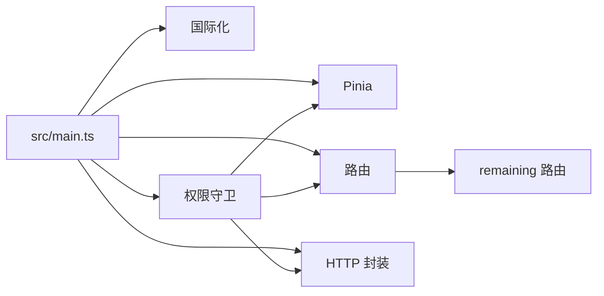

# Vue 3 管理后台

<cite>
**本文引用的文件**
- [package.json](file://frontend/admin-vue3/package.json)
- [vite.config.ts](file://frontend/admin-vue3/vite.config.ts)
- [main.ts](file://frontend/admin-vue3/src/main.ts)
- [App.vue](file://frontend/admin-vue3/src/App.vue)
- [router/index.ts](file://frontend/admin-vue3/src/router/index.ts)
- [store/index.ts](file://frontend/admin-vue3/src/store/index.ts)
- [permission.ts](file://frontend/admin-vue3/src/permission.ts)
- [config/axios/index.ts](file://frontend/admin-vue3/src/config/axios/index.ts)
</cite>

## 目录
1. [简介](#简介)
2. [项目结构](#项目结构)
3. [核心组件](#核心组件)
4. [架构总览](#架构总览)
5. [详细组件分析](#详细组件分析)
6. [依赖关系分析](#依赖关系分析)
7. [性能考虑](#性能考虑)
8. [故障排查指南](#故障排查指南)
9. [结论](#结论)
10. [附录](#附录)

## 简介
本项目是一个基于 Vue 3 + Element Plus + Vite 的现代化前端管理后台解决方案。其目标是提供一套高可用、可扩展、易维护的后台界面与交互体验，覆盖路由权限、国际化、状态管理、表单设计器、图表可视化、富文本编辑、打印、SVG 图标、UnoCSS 原子化样式、主题与暗色模式、构建优化与多环境配置等能力。

## 项目结构
前端工程位于 frontend/admin-vue3，采用“按功能域分层 + 组件化”的组织方式：
- 应用入口与初始化：main.ts、App.vue
- 路由与权限：router、permission.ts
- 状态管理：store（Pinia）
- 插件体系：plugins（Element Plus、FormCreate、SVG 图标、国际化、动画、统计等）
- API 层：config/axios（封装 axios 请求）
- 构建与优化：vite.config.ts、build/vite、uno.config.ts
- 工具与钩子：hooks、utils
- 国际化资源：locales
- 样式与主题：styles、uni.scss、design tokens

图示来源
- [main.ts:1-86](file://frontend/admin-vue3/src/main.ts#L1-L86)
- [router/index.ts:1-37](file://frontend/admin-vue3/src/router/index.ts#L1-L37)
- [store/index.ts:1-13](file://frontend/admin-vue3/src/store/index.ts#L1-L13)
- [permission.ts:1-108](file://frontend/admin-vue3/src/permission.ts#L1-L108)
- [config/axios/index.ts:1-48](file://frontend/admin-vue3/src/config/axios/index.ts#L1-L48)
- [vite.config.ts:1-89](file://frontend/admin-vue3/vite.config.ts#L1-L89)

章节来源
- [main.ts:1-86](file://frontend/admin-vue3/src/main.ts#L1-L86)
- [vite.config.ts:1-89](file://frontend/admin-vue3/vite.config.ts#L1-L89)

## 核心组件
- 应用入口与初始化：在入口文件中统一注册国际化、状态管理、全局组件、Element Plus、表单设计器、路由、指令、wangEditor 插件、打印插件等，并在路由就绪后挂载应用。
- 路由与权限：使用 Vue Router 创建路由实例，定义白名单与动态路由注入逻辑；在 beforeEach 中进行登录态校验、用户信息与菜单拉取、进度条与页面加载状态管理。
- 状态管理：基于 Pinia，启用持久化插件，提供全局状态（如主题、尺寸、灰度模式、用户信息、权限、字典等）。
- API 与 HTTP：对 axios 进行二次封装，提供 GET/POST/PUT/DELETE/UPLOAD/DOWNLOAD 等方法，统一处理 Content-Type 与 headers。
- 插件系统：通过 plugins 目录集中管理各类插件（Element Plus、FormCreate、SVG 图标、国际化、动画、统计、wangEditor、打印等），在入口中按序初始化。

章节来源
- [main.ts:1-86](file://frontend/admin-vue3/src/main.ts#L1-L86)
- [router/index.ts:1-37](file://frontend/admin-vue3/src/router/index.ts#L1-L37)
- [store/index.ts:1-13](file://frontend/admin-vue3/src/store/index.ts#L1-L13)
- [permission.ts:1-108](file://frontend/admin-vue3/src/permission.ts#L1-L108)
- [config/axios/index.ts:1-48](file://frontend/admin-vue3/src/config/axios/index.ts#L1-L48)

## 架构总览
下图展示了应用启动与请求调用的关键流程：

图示来源
- [main.ts:1-86](file://frontend/admin-vue3/src/main.ts#L1-L86)
- [permission.ts:1-108](file://frontend/admin-vue3/src/permission.ts#L1-L108)
- [config/axios/index.ts:1-48](file://frontend/admin-vue3/src/config/axios/index.ts#L1-L48)

## 详细组件分析

### 应用初始化流程
- 初始化顺序：国际化 → 状态管理 → 全局组件 → Element Plus → 表单设计器 → 路由 → 指令 → wangEditor 插件 → 路由就绪 → 打印插件 → 挂载应用。
- 关键点：确保路由在挂载前完成就绪；在挂载前完成所有插件与状态的初始化，避免运行时异常。

图示来源
- [main.ts:1-86](file://frontend/admin-vue3/src/main.ts#L1-L86)

章节来源
- [main.ts:1-86](file://frontend/admin-vue3/src/main.ts#L1-L86)

### 路由与权限控制
- 路由：使用 History 模式，定义滚动行为，提供 resetRouter 方法用于重置路由。
- 权限：白名单放行；登录态校验失败统一重定向；已登录且首次进入时异步拉取用户信息与后端生成的动态路由并注入；设置页面标题与进度条。

图示来源
- [router/index.ts:1-37](file://frontend/admin-vue3/src/router/index.ts#L1-L37)
- [permission.ts:1-108](file://frontend/admin-vue3/src/permission.ts#L1-L108)

章节来源
- [router/index.ts:1-37](file://frontend/admin-vue3/src/router/index.ts#L1-L37)
- [permission.ts:1-108](file://frontend/admin-vue3/src/permission.ts#L1-L108)

### 状态管理（Pinia）架构
- 创建与注册：在 store/index.ts 中创建 Pinia 实例并启用持久化插件，通过 setupStore(app) 注册到应用。
- 使用场景：主题、尺寸、灰度模式、用户信息、权限、字典等状态均在此集中管理，配合 hooks 与组件使用。

图示来源
- [store/index.ts:1-13](file://frontend/admin-vue3/src/store/index.ts#L1-L13)

章节来源
- [store/index.ts:1-13](file://frontend/admin-vue3/src/store/index.ts#L1-L13)

### API 集成模式与 HTTP 拦截器
- 封装方式：以 config/axios/index.ts 为核心，导出 get/post/put/delete/upload/download 等方法，内部统一设置 Content-Type 与 headers。
- 认证机制：在权限守卫中通过工具函数检查 Token；请求封装未直接内置拦截器，通常在 service 层或 axios 拦截器中处理鉴权与错误统一处理（本仓库未展示具体拦截器实现，建议在 service 层补充）。

图示来源
- [config/axios/index.ts:1-48](file://frontend/admin-vue3/src/config/axios/index.ts#L1-L48)

章节来源
- [config/axios/index.ts:1-48](file://frontend/admin-vue3/src/config/axios/index.ts#L1-L48)

### 插件系统集成
- UnoCSS：通过 vite.config.ts 加载插件，结合 uno.config.ts 提供原子化样式能力。
- SVG 图标：在入口中引入 svgIcon 插件，统一管理图标资源。
- 国际化：setupI18n(app) 初始化 vue-i18n，支持多语言切换。
- 状态管理：setupStore(app) 完成 Pinia 注册与持久化。
- 全局组件：setupGlobCom(app) 注册全局组件。
- Element Plus：setupElementPlus(app) 安装 Element Plus。
- 表单设计器：setupFormCreate(app) 安装 FormCreate。
- 指令：setupAuth(app)/setupMountedFocus(app) 安装自定义指令。
- wangEditor：setupWangEditorPlugin() 安装富文本编辑器插件。
- 打印：app.use(print) 安装打印插件。

章节来源
- [main.ts:1-86](file://frontend/admin-vue3/src/main.ts#L1-L86)
- [vite.config.ts:1-89](file://frontend/admin-vue3/vite.config.ts#L1-L89)

### 布局组件与主题设计
- App.vue 作为根组件，使用 ConfigGlobal 包裹 RouterView，并根据灰度模式与尺寸动态应用样式类名。
- 主题与暗色模式：通过 hooks/web/useDesign 与缓存机制，结合 App.vue 中的灰度模式与暗色判断，实现主题切换与适配。
- 响应式设计：结合 UnoCSS 与 Element Plus 的尺寸系统，实现不同屏幕下的布局与间距适配。

章节来源
- [App.vue:1-58](file://frontend/admin-vue3/src/App.vue#L1-L58)

### 多语言支持
- 在入口中调用 setupI18n(app) 初始化国际化；在路由守卫中设置页面标题，提升用户体验。
- 建议在 locales 目录下维护各语言资源文件，并通过 vue-i18n 的解析机制实现动态切换。

章节来源
- [main.ts:1-86](file://frontend/admin-vue3/src/main.ts#L1-L86)
- [permission.ts:1-108](file://frontend/admin-vue3/src/permission.ts#L1-L108)

### 构建优化策略
- Vite 构建：通过 vite.config.ts 配置 base、端口、代理、别名、CSS 预处理器、解析扩展、构建选项（压缩、sourcemap、terserOptions）、Rollup 分包策略与依赖预构建。
- 依赖分包：针对大体积第三方库（如 echarts、@form-create/element-ui、@form-create/designer）单独拆包，减少首屏体积。
- 依赖预构建：optimizeDeps.include/exclude 控制预构建范围，加速冷启动与热更新。
- 插件生态：集成 UnoCSS、自动导入、组件自动注册、SVG 图标、EJS、ESLint、进度条、压缩等插件，提升开发与构建效率。

章节来源
- [vite.config.ts:1-89](file://frontend/admin-vue3/vite.config.ts#L1-L89)
- [package.json:1-160](file://frontend/admin-vue3/package.json#L1-L160)

## 依赖关系分析
- 入口依赖：main.ts 依赖所有插件与模块（国际化、状态管理、路由、指令、wangEditor、打印等），并在路由就绪后挂载。
- 路由依赖：router/index.ts 依赖 remaining 路由集合；permission.ts 依赖路由、用户/权限/字典 store、进度条与页面加载状态。
- 状态管理：store/index.ts 仅负责创建与注册 Pinia，具体模块在 store/modules 下按功能划分。
- API 依赖：config/axios/index.ts 依赖 service（axios 实例）与 config（默认 headers）。

图示来源
- [main.ts:1-86](file://frontend/admin-vue3/src/main.ts#L1-L86)
- [router/index.ts:1-37](file://frontend/admin-vue3/src/router/index.ts#L1-L37)
- [permission.ts:1-108](file://frontend/admin-vue3/src/permission.ts#L1-L108)
- [config/axios/index.ts:1-48](file://frontend/admin-vue3/src/config/axios/index.ts#L1-L48)

章节来源
- [main.ts:1-86](file://frontend/admin-vue3/src/main.ts#L1-L86)
- [router/index.ts:1-37](file://frontend/admin-vue3/src/router/index.ts#L1-L37)
- [permission.ts:1-108](file://frontend/admin-vue3/src/permission.ts#L1-L108)
- [config/axios/index.ts:1-48](file://frontend/admin-vue3/src/config/axios/index.ts#L1-L48)

## 性能考虑
- 代码分割：通过 Rollup manualChunks 将大体积库独立打包，降低首屏依赖。
- 依赖预构建：optimizeDeps 控制预构建范围，减少重复扫描与编译时间。
- 构建压缩：开启 Terser 去除调试语句与 console，按需开启 sourcemap。
- 运行时优化：在入口中按需引入插件，避免不必要的初始化；路由守卫中仅在必要时拉取用户信息与动态路由。
- 样式优化：UnoCSS 原子化样式减少冗余 CSS，结合 Element Plus 的按需加载与主题变量，提升渲染性能。

章节来源
- [vite.config.ts:1-89](file://frontend/admin-vue3/vite.config.ts#L1-L89)

## 故障排查指南
- 登录态失效或被顶号：在权限守卫中检查 Token，若不存在则重定向至登录页；若 Token 过期，建议在 service 层增加拦截器统一处理 401/403。
- 动态路由未注入：确认 permission.ts 中 generateRoutes 是否正确执行，以及 addRoute 是否被调用；检查 resetRouter 是否误删白名单路由。
- 页面标题与进度条异常：确认 permission.ts 中 beforeEach/afterEach 的调用顺序与条件分支。
- 打包体积过大：检查 manualChunks 配置与 optimizeDeps.include/exclude；确认未将大体积库打入公共 chunk。
- 国际化资源缺失：确认 locales 资源文件存在且命名规范一致；检查 setupI18n 初始化是否成功。

章节来源
- [permission.ts:1-108](file://frontend/admin-vue3/src/permission.ts#L1-L108)
- [vite.config.ts:1-89](file://frontend/admin-vue3/vite.config.ts#L1-L89)

## 结论
该管理后台以 Vue 3 为核心，结合 Element Plus、Vite、Pinia、FormCreate、国际化与 UnoCSS 等技术栈，形成了模块清晰、扩展性强、性能友好的前端架构。通过统一的入口初始化、完善的路由权限控制、可持久化的状态管理与灵活的插件体系，能够快速支撑复杂后台业务场景。建议后续在 service 层完善 axios 拦截器与错误处理，并持续优化构建配置与运行时性能。

## 附录
- 开发脚本与构建模式：通过 package.json 中的 scripts 定义多环境构建与预览命令，结合 vite.config.ts 的环境变量加载实现差异化配置。
- 依赖清单：项目依赖包含 axios、vue-router、pinia、element-plus、vue-i18n、@form-create 系列、wangEditor、echarts、UnoCSS 等，满足后台常用功能需求。

章节来源
- [package.json:1-160](file://frontend/admin-vue3/package.json#L1-L160)
- [vite.config.ts:1-89](file://frontend/admin-vue3/vite.config.ts#L1-L89)