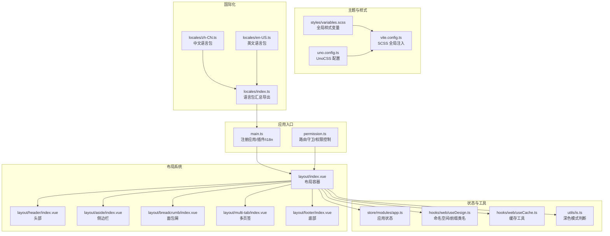
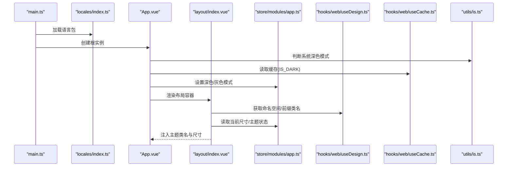
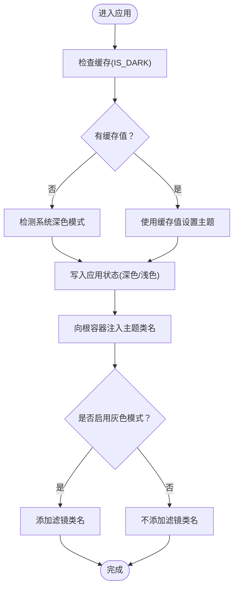
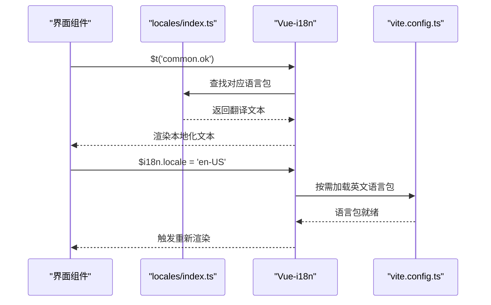
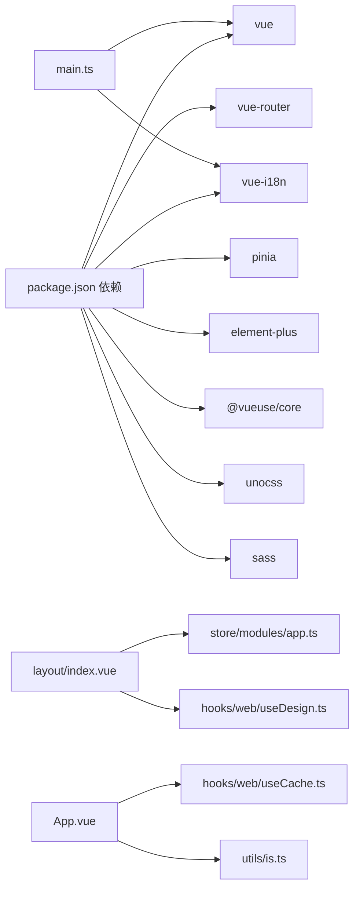

# 布局与主题

<cite>
**本文引用的文件**
- [App.vue](file://frontend/admin-vue3/src/App.vue)
- [main.ts](file://frontend/admin-vue3/src/main.ts)
- [permission.ts](file://frontend/admin-vue3/src/permission.ts)
- [layout/index.vue](file://frontend/admin-vue3/src/layout/index.vue)
- [layout/header/index.vue](file://frontend/admin-vue3/src/layout/header/index.vue)
- [layout/aside/index.vue](file://frontend/admin-vue3/src/layout/aside/index.vue)
- [layout/breadcrumb/index.vue](file://frontend/admin-vue3/src/layout/breadcrumb/index.vue)
- [layout/multi-tab/index.vue](file://frontend/admin-vue3/src/layout/multi-tab/index.vue)
- [layout/footer/index.vue](file://frontend/admin-vue3/src/layout/footer/index.vue)
- [store/modules/app.ts](file://frontend/admin-vue3/src/store/modules/app.ts)
- [utils/is.ts](file://frontend/admin-vue3/src/utils/is.ts)
- [hooks/web/useDesign.ts](file://frontend/admin-vue3/src/hooks/web/useDesign.ts)
- [hooks/web/useCache.ts](file://frontend/admin-vue3/src/hooks/web/useCache.ts)
- [locales/zh-CN.ts](file://frontend/admin-vue3/src/locales/zh-CN.ts)
- [locales/en-US.ts](file://frontend/admin-vue3/src/locales/en-US.ts)
- [locales/index.ts](file://frontend/admin-vue3/src/locales/index.ts)
- [styles/variables.scss](file://frontend/admin-vue3/src/styles/variables.scss)
- [uno.config.ts](file://frontend/admin-vue3/src/uno.config.ts)
- [vite.config.ts](file://frontend/admin-vue3/vite.config.ts)
- [package.json](file://frontend/admin-vue3/package.json)
</cite>

## 目录
1. [简介](#简介)
2. [项目结构](#项目结构)
3. [核心组件](#核心组件)
4. [架构总览](#架构总览)
5. [详细组件分析](#详细组件分析)
6. [依赖关系分析](#依赖关系分析)
7. [性能考虑](#性能考虑)
8. [故障排查指南](#故障排查指南)
9. [结论](#结论)
10. [附录](#附录)

## 简介
本文件聚焦于前端布局与主题系统，涵盖响应式布局设计、主题切换机制、布局组件结构（头部、侧边栏、面包屑、多页签、内容区、底部）、主题配置与颜色系统、样式变量管理、多语言支持（语言包管理、动态切换、本地化最佳实践）、响应式断点与移动端适配、无障碍访问实现以及样式架构与主题定制开发指南。文档以 Vue 3 + Element Plus + UnoCSS 技术栈为背景，结合仓库中的实际实现进行说明。

## 项目结构
前端采用模块化布局与主题设计，关键目录与职责如下：
- 布局层：src/layout 下包含 header、aside、breadcrumb、multi-tab、footer 等子组件，统一由 layout/index.vue 组织。
- 主题与样式：src/styles/variables.scss 提供全局样式变量；UnoCSS 作为原子化样式引擎；vite.config.ts 中配置 SCSS 全局注入。
- 应用入口与权限：src/main.ts 注册应用、插件与 i18n；src/permission.ts 控制路由守卫与页面权限。
- 状态管理：src/store/modules/app.ts 管理尺寸、深色模式、灰色模式等应用状态。
- 多语言：src/locales 下维护 zh-CN.ts、en-US.ts 语言包，并通过 locales/index.ts 汇总导出。
- 工具与钩子：hooks/web/useDesign.ts 提供命名空间与前缀类名；hooks/web/useCache.ts 提供缓存；utils/is.ts 判断深色模式。

图表来源
- [main.ts](file://frontend/admin-vue3/src/main.ts)
- [permission.ts](file://frontend/admin-vue3/src/permission.ts)
- [layout/index.vue](file://frontend/admin-vue3/src/layout/index.vue)
- [layout/header/index.vue](file://frontend/admin-vue3/src/layout/header/index.vue)
- [layout/aside/index.vue](file://frontend/admin-vue3/src/layout/aside/index.vue)
- [layout/breadcrumb/index.vue](file://frontend/admin-vue3/src/layout/breadcrumb/index.vue)
- [layout/multi-tab/index.vue](file://frontend/admin-vue3/src/layout/multi-tab/index.vue)
- [layout/footer/index.vue](file://frontend/admin-vue3/src/layout/footer/index.vue)
- [store/modules/app.ts](file://frontend/admin-vue3/src/store/modules/app.ts)
- [hooks/web/useDesign.ts](file://frontend/admin-vue3/src/hooks/web/useDesign.ts)
- [hooks/web/useCache.ts](file://frontend/admin-vue3/src/hooks/web/useCache.ts)
- [utils/is.ts](file://frontend/admin-vue3/src/utils/is.ts)
- [locales/zh-CN.ts](file://frontend/admin-vue3/src/locales/zh-CN.ts)
- [locales/en-US.ts](file://frontend/admin-vue3/src/locales/en-US.ts)
- [locales/index.ts](file://frontend/admin-vue3/src/locales/index.ts)
- [styles/variables.scss](file://frontend/admin-vue3/src/styles/variables.scss)
- [uno.config.ts](file://frontend/admin-vue3/src/uno.config.ts)
- [vite.config.ts](file://frontend/admin-vue3/vite.config.ts)

章节来源
- [App.vue](file://frontend/admin-vue3/src/App.vue)
- [main.ts](file://frontend/admin-vue3/src/main.ts)
- [permission.ts](file://frontend/admin-vue3/src/permission.ts)
- [layout/index.vue](file://frontend/admin-vue3/src/layout/index.vue)
- [layout/header/index.vue](file://frontend/admin-vue3/src/layout/header/index.vue)
- [layout/aside/index.vue](file://frontend/admin-vue3/src/layout/aside/index.vue)
- [layout/breadcrumb/index.vue](file://frontend/admin-vue3/src/layout/breadcrumb/index.vue)
- [layout/multi-tab/index.vue](file://frontend/admin-vue3/src/layout/multi-tab/index.vue)
- [layout/footer/index.vue](file://frontend/admin-vue3/src/layout/footer/index.vue)
- [store/modules/app.ts](file://frontend/admin-vue3/src/store/modules/app.ts)
- [hooks/web/useDesign.ts](file://frontend/admin-vue3/src/hooks/web/useDesign.ts)
- [hooks/web/useCache.ts](file://frontend/admin-vue3/src/hooks/web/useCache.ts)
- [utils/is.ts](file://frontend/admin-vue3/src/utils/is.ts)
- [locales/zh-CN.ts](file://frontend/admin-vue3/src/locales/zh-CN.ts)
- [locales/en-US.ts](file://frontend/admin-vue3/src/locales/en-US.ts)
- [locales/index.ts](file://frontend/admin-vue3/src/locales/index.ts)
- [styles/variables.scss](file://frontend/admin-vue3/src/styles/variables.scss)
- [uno.config.ts](file://frontend/admin-vue3/src/uno.config.ts)
- [vite.config.ts](file://frontend/admin-vue3/vite.config.ts)
- [package.json](file://frontend/admin-vue3/package.json)

## 核心组件
- 应用根组件 App.vue：初始化命名空间、主题色、尺寸与灰色模式，挂载 RouterView 并提供全局 ConfigGlobal 包裹。
- 布局容器 layout/index.vue：统一承载头部、侧边栏、面包屑、多页签、内容区与底部，负责响应式布局与主题类名注入。
- 应用状态 store/modules/app.ts：管理当前尺寸、深色模式、灰色模式、标签页等状态。
- 设计与缓存钩子：hooks/web/useDesign.ts 提供命名空间与前缀类名；hooks/web/useCache.ts 提供缓存能力；utils/is.ts 判断系统深色模式。
- 国际化：locales/zh-CN.ts、locales/en-US.ts 语言包；locales/index.ts 汇总导出；vite.config.ts 配置别名与按需加载。

章节来源
- [App.vue](file://frontend/admin-vue3/src/App.vue)
- [layout/index.vue](file://frontend/admin-vue3/src/layout/index.vue)
- [store/modules/app.ts](file://frontend/admin-vue3/src/store/modules/app.ts)
- [hooks/web/useDesign.ts](file://frontend/admin-vue3/src/hooks/web/useDesign.ts)
- [hooks/web/useCache.ts](file://frontend/admin-vue3/src/hooks/web/useCache.ts)
- [utils/is.ts](file://frontend/admin-vue3/src/utils/is.ts)
- [locales/zh-CN.ts](file://frontend/admin-vue3/src/locales/zh-CN.ts)
- [locales/en-US.ts](file://frontend/admin-vue3/src/locales/en-US.ts)
- [locales/index.ts](file://frontend/admin-vue3/src/locales/index.ts)
- [vite.config.ts](file://frontend/admin-vue3/vite.config.ts)

## 架构总览
下图展示从应用入口到布局、主题与样式的整体交互流程：

图表来源
- [main.ts](file://frontend/admin-vue3/src/main.ts)
- [locales/index.ts](file://frontend/admin-vue3/src/locales/index.ts)
- [App.vue](file://frontend/admin-vue3/src/App.vue)
- [layout/index.vue](file://frontend/admin-vue3/src/layout/index.vue)
- [store/modules/app.ts](file://frontend/admin-vue3/src/store/modules/app.ts)
- [hooks/web/useDesign.ts](file://frontend/admin-vue3/src/hooks/web/useDesign.ts)
- [hooks/web/useCache.ts](file://frontend/admin-vue3/src/hooks/web/useCache.ts)
- [utils/is.ts](file://frontend/admin-vue3/src/utils/is.ts)

## 详细组件分析

### 布局容器与响应式组织
- 布局容器负责组织头部、侧边栏、面包屑、多页签、内容区与底部，同时根据应用状态注入尺寸与主题类名。
- 响应式断点与移动端适配建议：
  - 使用 UnoCSS 的断点前缀（如 sm:、md:、lg:、xl:）在组件内声明不同屏幕下的样式。
  - 在 layout/index.vue 中为侧边栏与内容区设置折叠/展开逻辑，配合媒体查询实现移动端抽屉式导航。
  - 通过 store/modules/app.ts 维护屏幕尺寸状态，驱动布局行为变化。

章节来源
- [layout/index.vue](file://frontend/admin-vue3/src/layout/index.vue)
- [store/modules/app.ts](file://frontend/admin-vue3/src/store/modules/app.ts)

### 头部区域（Header）
- 功能职责：用户信息、全局搜索、语言切换、主题切换、通知中心、退出登录等。
- 响应式策略：在窄屏下将部分操作项折叠至下拉菜单或侧滑面板；使用 UnoCSS 的响应式修饰符控制显示隐藏。
- 无障碍：为按钮与下拉菜单提供可访问性属性（aria-*），确保键盘可达与屏幕阅读器友好。

章节来源
- [layout/header/index.vue](file://frontend/admin-vue3/src/layout/header/index.vue)

### 侧边栏导航（Aside）
- 结构：顶部 Logo、主导航菜单、折叠开关、底部工具区。
- 交互：点击菜单项触发路由跳转；根据当前路由激活对应菜单；支持多级菜单与图标。
- 移动端：窄屏时侧边栏抽屉化，避免遮挡内容区；提供手势滑动关闭。
- 无障碍：菜单项具备 role="menuitem"、aria-selected 等属性；支持键盘导航（Tab、方向键）。

章节来源
- [layout/aside/index.vue](file://frontend/admin-vue3/src/layout/aside/index.vue)

### 面包屑与多页签
- 面包屑（Breadcrumb）：根据路由层级生成路径，支持自定义显示规则与链接跳转。
- 多页签（Multi-Tab）：记录打开的页面标签，支持关闭当前/其他/全部标签，拖拽排序与右键菜单。
- 状态管理：store/modules/app.ts 维护标签列表与当前激活标签，布局组件订阅状态更新视图。

章节来源
- [layout/breadcrumb/index.vue](file://frontend/admin-vue3/src/layout/breadcrumb/index.vue)
- [layout/multi-tab/index.vue](file://frontend/admin-vue3/src/layout/multi-tab/index.vue)
- [store/modules/app.ts](file://frontend/admin-vue3/src/store/modules/app.ts)

### 内容区与底部
- 内容区：RouterView 承载页面内容，支持过渡动画与骨架屏占位。
- 底部：版权信息、备案号、快速链接等，固定在页面底部或随内容滚动。
- 响应式：在小屏设备上调整内边距与字号，保证可读性与触达性。

章节来源
- [layout/index.vue](file://frontend/admin-vue3/src/layout/index.vue)
- [layout/footer/index.vue](file://frontend/admin-vue3/src/layout/footer/index.vue)

### 主题系统与颜色变量
- 主题开关：App.vue 初始化时根据缓存或系统偏好设置深色模式；store/modules/app.ts 提供切换接口。
- 灰色模式：通过给根容器添加特定类名实现滤镜效果，用于特殊场景（如纪念日）。
- 样式变量：styles/variables.scss 定义主色、辅色、中性色、阴影、圆角、间距、字体等变量；vite.config.ts 在编译期注入全局 SCSS。
- UnoCSS：uno.config.ts 提供原子化样式扩展，与变量体系协同，减少重复样式。

图表来源
- [App.vue](file://frontend/admin-vue3/src/App.vue)
- [store/modules/app.ts](file://frontend/admin-vue3/src/store/modules/app.ts)
- [hooks/web/useCache.ts](file://frontend/admin-vue3/src/hooks/web/useCache.ts)
- [utils/is.ts](file://frontend/admin-vue3/src/utils/is.ts)
- [styles/variables.scss](file://frontend/admin-vue3/src/styles/variables.scss)
- [vite.config.ts](file://frontend/admin-vue3/vite.config.ts)

章节来源
- [App.vue](file://frontend/admin-vue3/src/App.vue)
- [store/modules/app.ts](file://frontend/admin-vue3/src/store/modules/app.ts)
- [hooks/web/useCache.ts](file://frontend/admin-vue3/src/hooks/web/useCache.ts)
- [utils/is.ts](file://frontend/admin-vue3/src/utils/is.ts)
- [styles/variables.scss](file://frontend/admin-vue3/src/styles/variables.scss)
- [vite.config.ts](file://frontend/admin-vue3/vite.config.ts)

### 多语言支持（i18n）
- 语言包管理：locales/zh-CN.ts、locales/en-US.ts 分别维护中英语言资源；locales/index.ts 汇总导出，供 i18n 插件加载。
- 动态切换：通过 store/modules/app.ts 或全局状态管理切换语言；vite.config.ts 配置别名与按需加载，避免打包冗余。
- 最佳实践：
  - 使用命名空间分组（如 common、menu、form）便于维护；
  - 文本拼接使用占位符，避免硬编码；
  - 图标与文案分离，确保可替换性；
  - 对日期、数字、货币等格式化使用 i18n 提供的过滤器或工具函数。

图表来源
- [locales/zh-CN.ts](file://frontend/admin-vue3/src/locales/zh-CN.ts)
- [locales/en-US.ts](file://frontend/admin-vue3/src/locales/en-US.ts)
- [locales/index.ts](file://frontend/admin-vue3/src/locales/index.ts)
- [vite.config.ts](file://frontend/admin-vue3/vite.config.ts)

章节来源
- [locales/zh-CN.ts](file://frontend/admin-vue3/src/locales/zh-CN.ts)
- [locales/en-US.ts](file://frontend/admin-vue3/src/locales/en-US.ts)
- [locales/index.ts](file://frontend/admin-vue3/src/locales/index.ts)
- [vite.config.ts](file://frontend/admin-vue3/vite.config.ts)

### 样式架构与主题定制
- 样式变量：在 styles/variables.scss 中集中定义颜色、字体、间距、阴影、圆角等，供组件与 UnoCSS 使用。
- 全局注入：vite.config.ts 在 css.preprocessorOptions.scss 中配置 additionalData，使变量在任意 SCSS 文件可用。
- UnoCSS：通过 uno.config.ts 扩展原子类，与变量体系协同，提升样式复用与一致性。
- 开发指南：
  - 新增颜色变量时，同步更新变量文件并在组件中通过 $variable 使用；
  - 优先使用 UnoCSS 原子类，减少自定义样式；
  - 为组件提供明暗两套样式，确保主题切换兼容；
  - 为交互状态（hover、focus、active）提供明确的视觉反馈。

章节来源
- [styles/variables.scss](file://frontend/admin-vue3/src/styles/variables.scss)
- [vite.config.ts](file://frontend/admin-vue3/vite.config.ts)
- [uno.config.ts](file://frontend/admin-vue3/src/uno.config.ts)

## 依赖关系分析
- 应用入口依赖 i18n 语言包与全局插件；布局组件依赖设计钩子与状态管理；主题系统依赖缓存与系统偏好。
- 关键外部依赖：vue、vue-router、pinia、element-plus、vue-i18n、@vueuse/core、uno-css、sass 等。

图表来源
- [package.json](file://frontend/admin-vue3/package.json)
- [main.ts](file://frontend/admin-vue3/src/main.ts)
- [layout/index.vue](file://frontend/admin-vue3/src/layout/index.vue)
- [store/modules/app.ts](file://frontend/admin-vue3/src/store/modules/app.ts)
- [hooks/web/useDesign.ts](file://frontend/admin-vue3/src/hooks/web/useDesign.ts)
- [hooks/web/useCache.ts](file://frontend/admin-vue3/src/hooks/web/useCache.ts)
- [utils/is.ts](file://frontend/admin-vue3/src/utils/is.ts)

章节来源
- [package.json](file://frontend/admin-vue3/package.json)
- [main.ts](file://frontend/admin-vue3/src/main.ts)
- [layout/index.vue](file://frontend/admin-vue3/src/layout/index.vue)
- [store/modules/app.ts](file://frontend/admin-vue3/src/store/modules/app.ts)
- [hooks/web/useDesign.ts](file://frontend/admin-vue3/src/hooks/web/useDesign.ts)
- [hooks/web/useCache.ts](file://frontend/admin-vue3/src/hooks/web/useCache.ts)
- [utils/is.ts](file://frontend/admin-vue3/src/utils/is.ts)

## 性能考虑
- 代码分割：vite.config.ts 中对大体积依赖（如 echarts、form-create 系列）进行手动分包，降低首屏体积。
- 构建优化：开启 Terser 压缩，按需移除调试语句与控制台输出；生产环境启用 SourceMap。
- 样式优化：通过 UnoCSS 生成最小化原子类，减少重复样式；全局变量注入避免重复 import。
- 缓存策略：hooks/web/useCache.ts 提供持久化缓存，减少重复计算与网络请求。

章节来源
- [vite.config.ts](file://frontend/admin-vue3/vite.config.ts)
- [hooks/web/useCache.ts](file://frontend/admin-vue3/src/hooks/web/useCache.ts)

## 故障排查指南
- 主题不生效
  - 检查 App.vue 是否正确读取缓存与系统偏好；确认 store/modules/app.ts 的主题状态已更新。
  - 确认根容器是否注入了主题类名；检查样式变量是否正确编译。
- 语言切换无效
  - 检查 locales/index.ts 导出的语言包是否完整；确认 vite.config.ts 的别名与按需加载配置。
  - 在组件中使用 $i18n.locale 切换后，确认页面已重新渲染。
- 响应式异常
  - 检查 UnoCSS 断点前缀是否正确；确认 layout/index.vue 的布局逻辑与 store 的尺寸状态一致。
- 样式冲突
  - 检查 styles/variables.scss 的变量覆盖顺序；确认 vite.config.ts 的 additionalData 生效范围。

章节来源
- [App.vue](file://frontend/admin-vue3/src/App.vue)
- [store/modules/app.ts](file://frontend/admin-vue3/src/store/modules/app.ts)
- [locales/index.ts](file://frontend/admin-vue3/src/locales/index.ts)
- [vite.config.ts](file://frontend/admin-vue3/vite.config.ts)
- [styles/variables.scss](file://frontend/admin-vue3/src/styles/variables.scss)

## 结论
本布局与主题系统以模块化布局容器为核心，结合状态管理、设计钩子与样式变量，实现了响应式布局、主题切换与多语言支持。通过 UnoCSS 与全局变量体系，提升了样式一致性与开发效率。建议在后续迭代中进一步完善移动端交互细节、增强无障碍能力，并持续优化构建与缓存策略。

## 附录
- 快速定位
  - 布局容器：[layout/index.vue](file://frontend/admin-vue3/src/layout/index.vue)
  - 应用状态：[store/modules/app.ts](file://frontend/admin-vue3/src/store/modules/app.ts)
  - 主题初始化：[App.vue](file://frontend/admin-vue3/src/App.vue)
  - 样式变量：[styles/variables.scss](file://frontend/admin-vue3/src/styles/variables.scss)
  - UnoCSS 配置：[uno.config.ts](file://frontend/admin-vue3/src/uno.config.ts)
  - 多语言：[locales/index.ts](file://frontend/admin-vue3/src/locales/index.ts)
  - 构建配置：[vite.config.ts](file://frontend/admin-vue3/vite.config.ts)
  - 依赖清单：[package.json](file://frontend/admin-vue3/package.json)