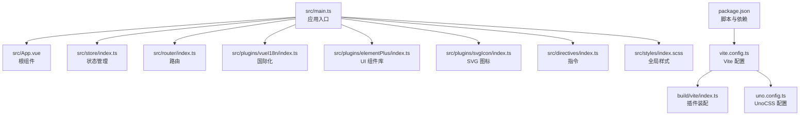
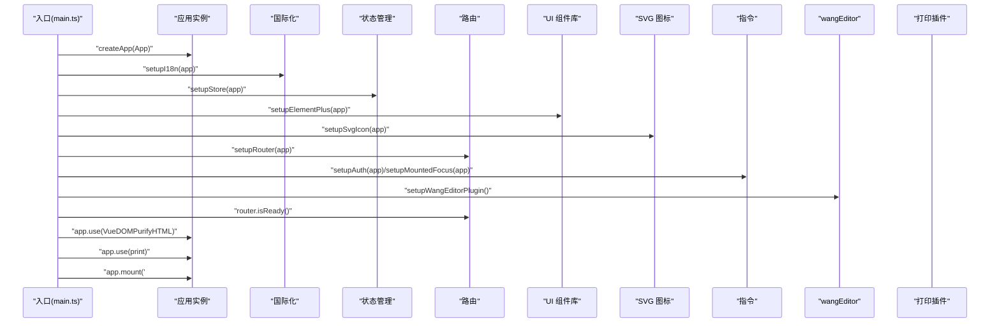
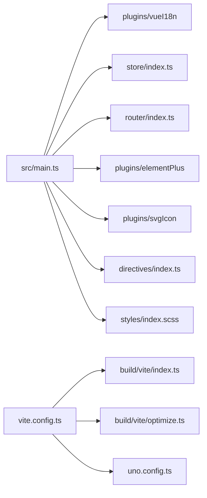

# 应用初始化与配置

<cite>
**本文引用的文件**
- [main.ts](file://frontend/admin-vue3/src/main.ts)
- [App.vue](file://frontend/admin-vue3/src/App.vue)
- [vite.config.ts](file://frontend/admin-vue3/vite.config.ts)
- [uno.config.ts](file://frontend/admin-vue3/uno.config.ts)
- [package.json](file://frontend/admin-vue3/package.json)
- [build/vite/index.ts](file://frontend/admin-vue3/build/vite/index.ts)
- [build/vite/optimize.ts](file://frontend/admin-vue3/build/vite/optimize.ts)
- [store/index.ts](file://frontend/admin-vue3/src/store/index.ts)
- [router/index.ts](file://frontend/admin-vue3/src/router/index.ts)
- [plugins/vueI18n/index.ts](file://frontend/admin-vue3/src/plugins/vueI18n/index.ts)
- [plugins/elementPlus/index.ts](file://frontend/admin-vue3/src/plugins/elementPlus/index.ts)
- [plugins/svgIcon/index.ts](file://frontend/admin-vue3/src/plugins/svgIcon/index.ts)
- [directives/index.ts](file://frontend/admin-vue3/src/directives/index.ts)
- [styles/index.scss](file://frontend/admin-vue3/src/styles/index.scss)
</cite>

## 目录
1. [简介](#简介)
2. [项目结构](#项目结构)
3. [核心组件](#核心组件)
4. [架构总览](#架构总览)
5. [详细组件分析](#详细组件分析)
6. [依赖关系分析](#依赖关系分析)
7. [性能考虑](#性能考虑)
8. [故障排查指南](#故障排查指南)
9. [结论](#结论)
10. [附录](#附录)

## 简介
本文件面向 Vue 3 + Vite 前端工程，系统性梳理应用初始化与配置流程，覆盖以下主题：
- 应用启动流程与插件初始化顺序
- 依赖注入机制与应用生命周期管理
- Vite 构建配置、环境变量管理、开发服务器与生产构建优化
- 根组件 App.vue 的结构设计、全局样式与基础配置
- 插件系统集成：UnoCSS、SVG 图标、国际化、状态管理、指令等
- 开发环境配置、构建优化策略与性能监控建议

## 项目结构
该工程采用“按功能分层 + 模块化插件”的组织方式：
- 启动入口位于 src/main.ts，负责创建应用实例并依次安装插件与中间件
- 构建配置集中在 vite.config.ts，并通过 build/vite/index.ts 统一装配 Vite 插件生态
- 插件与能力以模块形式分布在 src/plugins 下，便于扩展与维护
- 根组件 App.vue 负责主题、尺寸、灰度模式等全局状态的承载与渲染

图表来源
- [main.ts:1-86](file://frontend/admin-vue3/src/main.ts#L1-L86)
- [App.vue:1-58](file://frontend/admin-vue3/src/App.vue#L1-L58)
- [vite.config.ts:1-89](file://frontend/admin-vue3/vite.config.ts#L1-L89)
- [uno.config.ts:1-108](file://frontend/admin-vue3/uno.config.ts#L1-L108)
- [build/vite/index.ts:1-100](file://frontend/admin-vue3/build/vite/index.ts#L1-L100)
- [package.json:1-160](file://frontend/admin-vue3/package.json#L1-L160)

章节来源
- [main.ts:1-86](file://frontend/admin-vue3/src/main.ts#L1-L86)
- [vite.config.ts:1-89](file://frontend/admin-vue3/vite.config.ts#L1-L89)
- [uno.config.ts:1-108](file://frontend/admin-vue3/uno.config.ts#L1-L108)
- [build/vite/index.ts:1-100](file://frontend/admin-vue3/build/vite/index.ts#L1-L100)
- [package.json:1-160](file://frontend/admin-vue3/package.json#L1-L160)

## 核心组件
- 应用入口与初始化顺序
  - 在入口文件中，先进行全局样式与 UnoCSS 的导入，随后按需安装国际化、状态管理、全局组件、UI 组件库、表单设计器、路由、指令、wangEditor 插件、打印插件等，最后挂载应用。
  - 关键路径：[入口初始化顺序:51-81](file://frontend/admin-vue3/src/main.ts#L51-L81)

- 根组件 App.vue
  - 使用设计系统钩子生成命名空间前缀，结合 Pinia 中的应用状态决定尺寸与灰度模式；默认根据浏览器深色模式设置深色主题。
  - 关键路径：[根组件结构与主题设置:1-58](file://frontend/admin-vue3/src/App.vue#L1-L58)

- 状态管理（Pinia）
  - 创建 Pinia 实例并启用持久化插件，通过 setupStore 注入到应用。
  - 关键路径：[状态管理初始化:1-13](file://frontend/admin-vue3/src/store/index.ts#L1-L13)

- 路由（Vue Router）
  - 基于 History 模式，统一滚动行为至顶部；提供重置路由能力。
  - 关键路径：[路由初始化与重置:1-37](file://frontend/admin-vue3/src/router/index.ts#L1-L37)

- 国际化（vue-i18n）
  - 动态加载当前语言包，设置 HTML 语言属性，启用同步与回退策略。
  - 关键路径：[国际化初始化:1-43](file://frontend/admin-vue3/src/plugins/vueI18n/index.ts#L1-L43)

- UI 组件库（Element Plus）
  - 全局注册 Loading 服务与部分常用组件，保证下拉等场景样式一致。
  - 关键路径：[Element Plus 初始化:1-18](file://frontend/admin-vue3/src/plugins/elementPlus/index.ts#L1-L18)

- SVG 图标
  - 通过虚拟模块注册与 PurgeIcons 生成图标集合，实现按需引入。
  - 关键路径：[SVG 图标初始化:1-4](file://frontend/admin-vue3/src/plugins/svgIcon/index.ts#L1-L4)

- 指令
  - 权限指令与 mounted 自动聚焦指令，集中注册。
  - 关键路径：[指令初始化:1-25](file://frontend/admin-vue3/src/directives/index.ts#L1-L25)

- 全局样式
  - 引入主题变量、表单设计器样式、暗色主题变量与进度条适配。
  - 关键路径：[全局样式入口:1-38](file://frontend/admin-vue3/src/styles/index.scss#L1-L38)

章节来源
- [main.ts:51-81](file://frontend/admin-vue3/src/main.ts#L51-L81)
- [App.vue:1-58](file://frontend/admin-vue3/src/App.vue#L1-L58)
- [store/index.ts:1-13](file://frontend/admin-vue3/src/store/index.ts#L1-L13)
- [router/index.ts:1-37](file://frontend/admin-vue3/src/router/index.ts#L1-L37)
- [plugins/vueI18n/index.ts:1-43](file://frontend/admin-vue3/src/plugins/vueI18n/index.ts#L1-L43)
- [plugins/elementPlus/index.ts:1-18](file://frontend/admin-vue3/src/plugins/elementPlus/index.ts#L1-L18)
- [plugins/svgIcon/index.ts:1-4](file://frontend/admin-vue3/src/plugins/svgIcon/index.ts#L1-L4)
- [directives/index.ts:1-25](file://frontend/admin-vue3/src/directives/index.ts#L1-L25)
- [styles/index.scss:1-38](file://frontend/admin-vue3/src/styles/index.scss#L1-L38)

## 架构总览
应用启动流程遵循“入口 -> 插件装配 -> 生命周期挂载”的标准模式，确保依赖注入与运行时行为的一致性。

图表来源
- [main.ts:51-81](file://frontend/admin-vue3/src/main.ts#L51-L81)

章节来源
- [main.ts:51-81](file://frontend/admin-vue3/src/main.ts#L51-L81)

## 详细组件分析

### Vite 构建配置与环境变量
- 环境变量加载
  - 非构建模式下从命令行参数解析 mode 并加载对应 .env.* 文件；构建模式下直接按 mode 加载。
  - 关键路径：[环境变量加载逻辑:15-22](file://frontend/admin-vue3/vite.config.ts#L15-L22)

- 服务端配置
  - 支持端口、主机、自动打开浏览器等；当前未启用代理，跨域由后端处理。
  - 关键路径：[开发服务器配置:27-40](file://frontend/admin-vue3/vite.config.ts#L27-L40)

- 插件装配
  - 通过统一工厂函数 createVitePlugins 装配 Vue、JSX、UnoCSS、进度条、ESLint、图标清理、Element Plus 自动导入、组件自动注册、压缩、EJS、顶层 await 等插件。
  - 关键路径：[插件装配工厂:19-99](file://frontend/admin-vue3/build/vite/index.ts#L19-L99)

- CSS 预处理器
  - 全局注入 SCSS 变量，开启 Dart Sass 兼容选项，避免弃用警告。
  - 关键路径：[SCSS 全局注入:43-51](file://frontend/admin-vue3/vite.config.ts#L43-L51)

- 路径别名与解析
  - 别名映射 @/ 到 src；针对 vue-i18n 指向 cjs 版本以兼容运行时。
  - 关键路径：[路径别名与解析:52-64](file://frontend/admin-vue3/vite.config.ts#L52-L64)

- 生产构建优化
  - Terser 压缩：可按环境变量移除 debugger 与 console
  - Rollup 分包：将 echarts、form-create 等大包单独拆分
  - 依赖预构建：通过 optimizeDeps.include/exclude 控制预构建范围
  - 关键路径：[生产构建配置:65-87](file://frontend/admin-vue3/vite.config.ts#L65-L87)、[依赖优化清单:1-125](file://frontend/admin-vue3/build/vite/optimize.ts#L1-L125)

- UnoCSS 配置
  - 自定义规则与快捷类，预设 Uno，支持暗色模式 class 选择器。
  - 关键路径：[UnoCSS 规则与预设:1-108](file://frontend/admin-vue3/uno.config.ts#L1-L108)

- 脚本与依赖
  - 提供多环境构建脚本与 lint、格式化、预览等常用命令；依赖版本与引擎要求明确。
  - 关键路径：[脚本与依赖:7-26](file://frontend/admin-vue3/package.json#L7-L26)、(file://frontend/admin-vue3/package.json#L27-L144)

章节来源
- [vite.config.ts:15-87](file://frontend/admin-vue3/vite.config.ts#L15-L87)
- [build/vite/index.ts:19-99](file://frontend/admin-vue3/build/vite/index.ts#L19-L99)
- [build/vite/optimize.ts:1-125](file://frontend/admin-vue3/build/vite/optimize.ts#L1-L125)
- [uno.config.ts:1-108](file://frontend/admin-vue3/uno.config.ts#L1-L108)
- [package.json:7-26](file://frontend/admin-vue3/package.json#L7-L26)
- [package.json:27-144](file://frontend/admin-vue3/package.json#L27-L144)

### 插件系统初始化流程
- 国际化（vue-i18n）
  - 动态按需加载语言包，设置 HTML lang，启用同步与回退，避免大量告警。
  - 关键路径：[国际化初始化:38-42](file://frontend/admin-vue3/src/plugins/vueI18n/index.ts#L38-L42)

- 状态管理（Pinia）
  - 创建实例并启用持久化插件，注入应用。
  - 关键路径：[状态管理注入:8-10](file://frontend/admin-vue3/src/store/index.ts#L8-L10)

- UI 组件库（Element Plus）
  - 注册 Loading 服务与常用组件，保证下拉等场景样式一致。
  - 关键路径：[UI 注册:9-17](file://frontend/admin-vue3/src/plugins/elementPlus/index.ts#L9-L17)

- SVG 图标
  - 通过虚拟模块注册与 PurgeIcons 生成图标集合。
  - 关键路径：[SVG 注册:1-4](file://frontend/admin-vue3/src/plugins/svgIcon/index.ts#L1-L4)

- 指令
  - 权限指令与 mounted 自动聚焦指令集中注册。
  - 关键路径：[指令注册:10-24](file://frontend/admin-vue3/src/directives/index.ts#L10-L24)

- 路由
  - 注册路由并提供重置能力，History 模式与滚动行为统一。
  - 关键路径：[路由注册与重置:32-34](file://frontend/admin-vue3/src/router/index.ts#L32-L34)、(file://frontend/admin-vue3/src/router/index.ts#L22-L30)

- 全局样式与动画
  - 全局样式入口引入主题与第三方样式；引入 animate.css 动画库。
  - 关键路径：[全局样式入口:1-38](file://frontend/admin-vue3/src/styles/index.scss#L1-L38)

章节来源
- [plugins/vueI18n/index.ts:38-42](file://frontend/admin-vue3/src/plugins/vueI18n/index.ts#L38-L42)
- [store/index.ts:8-10](file://frontend/admin-vue3/src/store/index.ts#L8-L10)
- [plugins/elementPlus/index.ts:9-17](file://frontend/admin-vue3/src/plugins/elementPlus/index.ts#L9-L17)
- [plugins/svgIcon/index.ts:1-4](file://frontend/admin-vue3/src/plugins/svgIcon/index.ts#L1-L4)
- [directives/index.ts:10-24](file://frontend/admin-vue3/src/directives/index.ts#L10-L24)
- [router/index.ts:32-34](file://frontend/admin-vue3/src/router/index.ts#L32-L34)
- [router/index.ts:22-30](file://frontend/admin-vue3/src/router/index.ts#L22-L30)
- [styles/index.scss:1-38](file://frontend/admin-vue3/src/styles/index.scss#L1-L38)

### 根组件 App.vue 结构设计
- 设计系统与命名空间
  - 使用设计钩子生成前缀，结合命名空间常量形成组件类名体系。
  - 关键路径：[命名空间生成:10-11](file://frontend/admin-vue3/src/App.vue#L10-L11)

- 全局尺寸与灰度模式
  - 从 Pinia 获取当前尺寸与灰度模式，动态切换类名。
  - 关键路径：[尺寸与灰度绑定:13-14](file://frontend/admin-vue3/src/App.vue#L13-L14)

- 主题默认值
  - 根据浏览器深色模式设置默认深色主题，优先使用缓存值。
  - 关键路径：[默认主题设置:18-25](file://frontend/admin-vue3/src/App.vue#L18-L25)

- 全局样式与布局
  - 重置页面尺寸、隐藏滚动条、适配进度条颜色等。
  - 关键路径：[全局样式与布局:33-57](file://frontend/admin-vue3/src/App.vue#L33-L57)

章节来源
- [App.vue:1-58](file://frontend/admin-vue3/src/App.vue#L1-L58)

## 依赖关系分析
- 入口对各子系统的依赖
  - 入口文件对国际化、状态管理、UI 组件库、SVG 图标、路由、指令、wangEditor、打印插件存在显式依赖。
  - 关键路径：[入口依赖装配:51-81](file://frontend/admin-vue3/src/main.ts#L51-L81)

- Vite 插件生态
  - 通过 createVitePlugins 统一装配，涵盖 Vue、JSX、UnoCSS、ESLint、图标清理、自动导入、组件扫描、压缩、EJS、顶层 await 等。
  - 关键路径：[插件装配:19-99](file://frontend/admin-vue3/build/vite/index.ts#L19-L99)

- 依赖预构建与分包
  - optimizeDeps.include 明确预构建列表，Rollup manualChunks 将大包独立打包，提升缓存命中与首屏性能。
  - 关键路径：[依赖优化:1-125](file://frontend/admin-vue3/build/vite/optimize.ts#L1-L125)、[手动分包:76-84](file://frontend/admin-vue3/vite.config.ts#L76-L84)

图表来源
- [main.ts:51-81](file://frontend/admin-vue3/src/main.ts#L51-L81)
- [build/vite/index.ts:19-99](file://frontend/admin-vue3/build/vite/index.ts#L19-L99)
- [build/vite/optimize.ts:1-125](file://frontend/admin-vue3/build/vite/optimize.ts#L1-L125)
- [vite.config.ts:15-87](file://frontend/admin-vue3/vite.config.ts#L15-L87)
- [uno.config.ts:1-108](file://frontend/admin-vue3/uno.config.ts#L1-L108)

章节来源
- [main.ts:51-81](file://frontend/admin-vue3/src/main.ts#L51-L81)
- [build/vite/index.ts:19-99](file://frontend/admin-vue3/build/vite/index.ts#L19-L99)
- [build/vite/optimize.ts:1-125](file://frontend/admin-vue3/build/vite/optimize.ts#L1-L125)
- [vite.config.ts:15-87](file://frontend/admin-vue3/vite.config.ts#L15-L87)
- [uno.config.ts:1-108](file://frontend/admin-vue3/uno.config.ts#L1-L108)

## 性能考虑
- 依赖预构建与缓存
  - 通过 optimizeDeps.include 明确预构建范围，减少冷启动时间；合理分包提升缓存命中率。
  - 关键路径：[依赖优化清单:1-125](file://frontend/admin-vue3/build/vite/optimize.ts#L1-L125)

- 生产构建压缩与调试
  - Terser 压缩可按环境变量移除 debugger 与 console；可选开启 source map。
  - 关键路径：[压缩与 SourceMap:65-75](file://frontend/admin-vue3/vite.config.ts#L65-L75)、(file://frontend/admin-vue3/vite.config.ts#L68-L68)

- 大包独立打包
  - 将 echarts、form-create 等大包独立分包，降低主包体积，提升二次加载性能。
  - 关键路径：[手动分包配置:76-84](file://frontend/admin-vue3/vite.config.ts#L76-L84)

- UnoCSS 与图标按需
  - UnoCSS 规则与快捷类减少重复样式；SVG 图标按需生成，避免冗余资源。
  - 关键路径：[UnoCSS 规则:6-107](file://frontend/admin-vue3/uno.config.ts#L6-L107)、[SVG 图标:1-4](file://frontend/admin-vue3/src/plugins/svgIcon/index.ts#L1-L4)

- 运行时优化建议
  - 使用 keep-alive 缓存页面组件；懒加载路由视图；按需加载第三方库。
  - 关键路径：[路由注册:32-34](file://frontend/admin-vue3/src/router/index.ts#L32-L34)

[本节为通用性能指导，无需列出具体文件来源]

## 故障排查指南
- 国际化语言包缺失或加载失败
  - 确认语言包文件存在且路径正确；检查 locale store 的当前语言与可用语言列表。
  - 关键路径：[语言包加载与回退:13-35](file://frontend/admin-vue3/src/plugins/vueI18n/index.ts#L13-L35)

- 路由滚动行为异常
  - 检查滚动容器选择器是否匹配；确认路由 isReady 已完成再挂载应用。
  - 关键路径：[滚动行为与挂载时机:11-19](file://frontend/admin-vue3/src/router/index.ts#L11-L19)、(file://frontend/admin-vue3/src/main.ts#L73-L73)

- UnoCSS 样式未生效
  - 检查自定义规则与预设配置；确认命名空间与类名拼接正确。
  - 关键路径：[UnoCSS 配置:1-108](file://frontend/admin-vue3/uno.config.ts#L1-L108)、(file://frontend/admin-vue3/src/App.vue#L34-L56)

- SVG 图标未显示
  - 确认图标目录与 symbolId 配置；检查虚拟模块注册是否执行。
  - 关键路径：[SVG 注册与图标目录:1-4](file://frontend/admin-vue3/src/plugins/svgIcon/index.ts#L1-L4)、(file://frontend/admin-vue3/build/vite/index.ts#L78-L81)

- 状态持久化失效
  - 检查持久化插件是否已安装；确认存储键名与作用域。
  - 关键路径：[状态持久化安装:5-6](file://frontend/admin-vue3/src/store/index.ts#L5-L6)

- 开发服务器跨域问题
  - 当前未启用代理，跨域由后端处理；若需本地联调可临时启用代理。
  - 关键路径：[开发服务器配置:27-40](file://frontend/admin-vue3/vite.config.ts#L27-L40)

章节来源
- [plugins/vueI18n/index.ts:13-35](file://frontend/admin-vue3/src/plugins/vueI18n/index.ts#L13-L35)
- [router/index.ts:11-19](file://frontend/admin-vue3/src/router/index.ts#L11-L19)
- [uno.config.ts:1-108](file://frontend/admin-vue3/uno.config.ts#L1-L108)
- [src/App.vue:34-56](file://frontend/admin-vue3/src/App.vue#L34-L56)
- [plugins/svgIcon/index.ts:1-4](file://frontend/admin-vue3/src/plugins/svgIcon/index.ts#L1-L4)
- [build/vite/index.ts:78-81](file://frontend/admin-vue3/build/vite/index.ts#L78-L81)
- [store/index.ts:5-6](file://frontend/admin-vue3/src/store/index.ts#L5-L6)
- [vite.config.ts:27-40](file://frontend/admin-vue3/vite.config.ts#L27-L40)

## 结论
本工程在 Vue 3 + Vite 基础上，建立了清晰的初始化与配置体系：
- 入口文件严格控制插件初始化顺序，确保依赖注入与运行时行为一致
- Vite 配置通过工厂化插件装配与依赖优化，兼顾开发体验与生产性能
- UnoCSS、国际化、状态管理、指令与路由等模块职责明确，易于扩展与维护
- 根组件承担全局主题与样式适配，配合全局样式实现一致的视觉与交互体验

建议在后续迭代中持续关注：
- 逐步启用代理以简化联调
- 对第三方库进行更细粒度的懒加载与分包
- 建立构建产物分析与性能监控指标

[本节为总结性内容，无需列出具体文件来源]

## 附录
- 开发与构建命令
  - 开发：使用指定 .env.* 模式启动开发服务器
  - 构建：支持 local/dev/test/stage/prod 多环境构建
  - 预览：构建后本地预览
  - 关键路径：[脚本定义:7-26](file://frontend/admin-vue3/package.json#L7-L26)

- 环境变量示例字段
  - VITE_BASE_PATH、VITE_PORT、VITE_OPEN、VITE_BASE_URL、VITE_OUT_DIR、VITE_SOURCEMAP、VITE_DROP_DEBUGGER、VITE_DROP_CONSOLE
  - 关键路径：[环境变量加载:15-22](file://frontend/admin-vue3/vite.config.ts#L15-L22)

章节来源
- [package.json:7-26](file://frontend/admin-vue3/package.json#L7-L26)
- [vite.config.ts:15-22](file://frontend/admin-vue3/vite.config.ts#L15-L22)