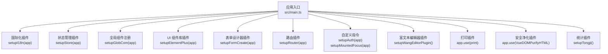
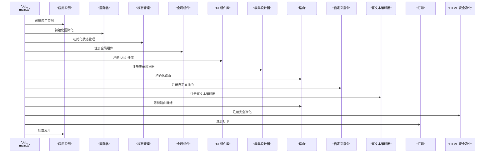
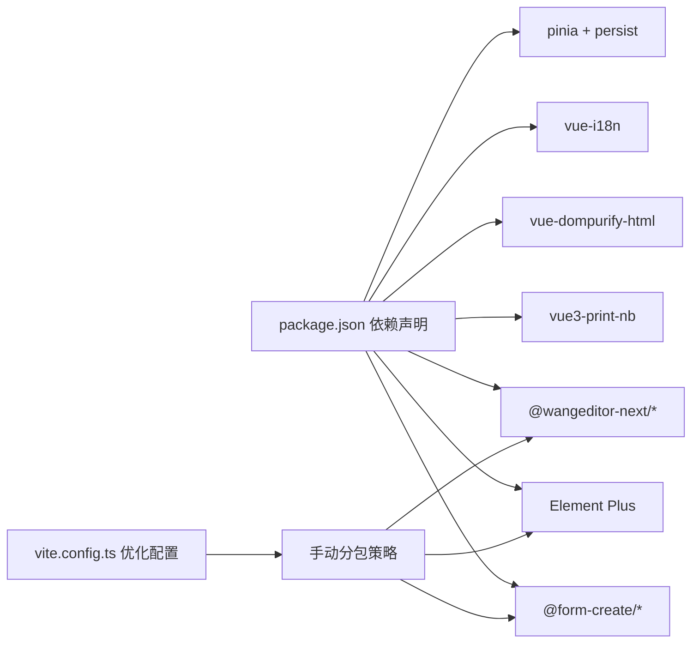

# 插件系统

<cite>
**本文引用的文件**
- [main.ts](file://frontend/admin-vue3/src/main.ts)
- [vite.config.ts](file://frontend/admin-vue3/vite.config.ts)
- [package.json](file://frontend/admin-vue3/package.json)
- [formCreate.ts](file://frontend/admin-vue3/src/utils/formCreate.ts)
</cite>

## 目录
1. [简介](#简介)
2. [项目结构](#项目结构)
3. [核心组件](#核心组件)
4. [架构总览](#架构总览)
5. [详细组件分析](#详细组件分析)
6. [依赖分析](#依赖分析)
7. [性能考虑](#性能考虑)
8. [故障排查指南](#故障排查指南)
9. [结论](#结论)
10. [附录](#附录)

## 简介
本文件系统性梳理前端 admin-vue3 项目的插件体系与自定义指令设计，覆盖插件注册机制、生命周期钩子与依赖注入方式；详解 UnoCSS、SVG 图标、国际化、表单设计器、富文本编辑器等插件的功能与集成路径；总结自定义指令的开发规范与最佳实践；并提供配置、性能优化与兼容性处理建议，以及开发与调试技巧。

## 项目结构
该工程采用 Vite + Vue 3 + TypeScript 构建，插件与指令通过应用启动阶段统一初始化与注册。入口文件负责按序装配各功能模块，确保依赖注入与生命周期钩子在应用挂载前完成。

图表来源
- [main.ts:51-81](file://frontend/admin-vue3/src/main.ts#L51-L81)

章节来源
- [main.ts:1-86](file://frontend/admin-vue3/src/main.ts#L1-L86)

## 核心组件
- 应用创建与统一注册：在入口文件中集中调用各插件初始化函数，保证注册顺序与依赖关系清晰可控。
- 国际化插件：通过独立的 setupI18n 函数完成 i18n 实例创建与全局注入。
- 表单设计器插件：通过 setupFormCreate 完成表单设计器相关依赖与 UI 注册。
- 富文本编辑器插件：通过 setupWangEditorPlugin 完成编辑器插件注册。
- 自定义指令：权限指令与挂载焦点指令分别通过 setupAuth 与 setupMountedFocus 注入。
- 第三方插件：打印与 HTML 安全净化分别通过 app.use 方式注册。

章节来源
- [main.ts:51-81](file://frontend/admin-vue3/src/main.ts#L51-L81)

## 架构总览
下图展示应用启动时的插件装配流程与关键依赖关系：

图表来源
- [main.ts:51-81](file://frontend/admin-vue3/src/main.ts#L51-L81)

## 详细组件分析

### UnoCSS 插件
- 功能定位：原子化 CSS 框架，提供便捷的类名生成与按需构建能力。
- 集成方式：在入口文件中引入样式入口以启用 UnoCSS 规则与主题变量。
- 配置要点：Vite 中通过插件链与别名配置确保类名解析与样式编译一致。

章节来源
- [main.ts:1-2](file://frontend/admin-vue3/src/main.ts#L1-L2)
- [vite.config.ts:42](file://frontend/admin-vue3/vite.config.ts#L42)

### SVG 图标插件
- 功能定位：集中管理 SVG 图标资源，按需生成组件，减少打包体积。
- 集成方式：在入口文件中引入图标插件入口，自动扫描与注册图标组件。

章节来源
- [main.ts:4-5](file://frontend/admin-vue3/src/main.ts#L4-L5)

### 国际化插件（Vue I18n）
- 功能定位：提供多语言切换与文案翻译能力。
- 集成方式：通过 setupI18n(app) 创建并注入 i18n 实例，随后在组件中使用 $t/$rt 等 API。
- 生命周期：在应用创建后立即初始化，确保后续组件可直接访问翻译上下文。

章节来源
- [main.ts:7-8](file://frontend/admin-vue3/src/main.ts#L7-L8)

### 状态管理插件（Pinia）
- 功能定位：集中式状态管理，提供模块化 store 与持久化能力。
- 集成方式：通过 setupStore(app) 完成 store 实例创建与全局注入。
- 持久化：依赖 pinia-plugin-persistedstate 实现状态持久化。

章节来源
- [main.ts:10-11](file://frontend/admin-vue3/src/main.ts#L10-L11)
- [package.json:65-66](file://frontend/admin-vue3/package.json#L65-L66)

### 全局组件插件
- 功能定位：统一注册业务通用组件，避免重复导入。
- 集成方式：通过 setupGlobCom(app) 批量注册组件，提升复用性与一致性。

章节来源
- [main.ts:13-14](file://frontend/admin-vue3/src/main.ts#L13-L14)

### UI 组件库插件（Element Plus）
- 功能定位：提供丰富的桌面端组件与主题定制能力。
- 集成方式：通过 setupElementPlus(app) 完成组件注册与主题配置。

章节来源
- [main.ts:16-17](file://frontend/admin-vue3/src/main.ts#L16-L17)

### 表单设计器插件（form-create）
- 功能定位：可视化拖拽生成动态表单，支持规则校验与数据绑定。
- 集成方式：通过 setupFormCreate(app) 完成设计器与 UI 组件的注册。
- 依赖关系：依赖 @form-create/designer 与 @form-create/element-ui。

章节来源
- [main.ts:19-20](file://frontend/admin-vue3/src/main.ts#L19-L20)
- [package.json:29-30](file://frontend/admin-vue3/package.json#L29-L30)
- [formCreate.ts](file://frontend/admin-vue3/src/utils/formCreate.ts)

### 路由插件（Vue Router）
- 功能定位：页面级导航与权限控制的基础能力。
- 集成方式：通过 setupRouter(app) 初始化路由，入口等待 router.isReady() 后再挂载应用。

章节来源
- [main.ts:28-29](file://frontend/admin-vue3/src/main.ts#L28-L29)

### 自定义指令
- 权限指令：通过 setupAuth(app) 注册，用于根据用户权限控制元素显示/交互。
- 挂载焦点指令：通过 setupMountedFocus(app) 注册，用于在元素挂载后自动聚焦。
- 集成方式：在入口文件中统一调用，确保全局可用。

章节来源
- [main.ts:31-32](file://frontend/admin-vue3/src/main.ts#L31-L32)

### 富文本编辑器插件（wangEditor）
- 功能定位：提供可视化富文本编辑与内容渲染能力。
- 集成方式：通过 setupWangEditorPlugin() 完成编辑器插件注册。
- 依赖关系：依赖 @wangeditor-next/editor 与 @wangeditor-next/editor-for-vue。

章节来源
- [main.ts:45-46](file://frontend/admin-vue3/src/main.ts#L45-L46)
- [package.json:35-36](file://frontend/admin-vue3/package.json#L35-L36)

### 打印插件（vue3-print-nb）
- 功能定位：提供浏览器端打印能力，支持样式与布局控制。
- 集成方式：通过 app.use(print) 注册为全局插件。

章节来源
- [main.ts:48](file://frontend/admin-vue3/src/main.ts#L48)
- [package.json:79](file://frontend/admin-vue3/package.json#L79)

### HTML 安全净化插件（vue-dompurify-html）
- 功能定位：对 v-html 内容进行安全净化，防止 XSS 攻击。
- 集成方式：在路由就绪后通过 app.use(VueDOMPurifyHTML) 注册。

章节来源
- [main.ts:75](file://frontend/admin-vue3/src/main.ts#L75)
- [package.json:75](file://frontend/admin-vue3/package.json#L75)

### 统计插件（百度统计）
- 功能定位：前端埋点与访问统计。
- 集成方式：在入口文件中引入统计插件入口。

章节来源
- [main.ts:40](file://frontend/admin-vue3/src/main.ts#L40)

## 依赖分析
- 插件耦合：入口文件承担“编排者”角色，各插件相对独立，通过统一的初始化函数接入。
- 外部依赖：项目通过 package.json 明确声明了各插件版本，如 Element Plus、form-create、wangEditor、打印与安全净化等。
- 构建优化：Vite 侧通过 optimizeDeps 与手动分包策略，将大型依赖（如 echarts、form-create、form-designer）拆分，降低首屏体积。

图表来源
- [package.json:27-83](file://frontend/admin-vue3/package.json#L27-L83)
- [vite.config.ts:76-83](file://frontend/admin-vue3/vite.config.ts#L76-L83)

章节来源
- [package.json:27-83](file://frontend/admin-vue3/package.json#L27-L83)
- [vite.config.ts:76-83](file://frontend/admin-vue3/vite.config.ts#L76-L83)

## 性能考虑
- 依赖拆分：针对大体积第三方库（如 echarts、form-create、form-designer）采用手动分包，减少主包体积。
- 依赖预构建：通过 optimizeDeps.include/exclude 控制预构建范围，缩短冷启动时间。
- 构建压缩：开启 Terser 压缩与按需移除调试语句/控制台输出，降低产物体积与运行时开销。
- 资源懒加载：结合路由与组件层面的异步加载策略，进一步优化首屏性能。

章节来源
- [vite.config.ts:76-86](file://frontend/admin-vue3/vite.config.ts#L76-L86)
- [vite.config.ts:86](file://frontend/admin-vue3/vite.config.ts#L86)

## 故障排查指南
- 插件未生效
  - 检查入口文件是否正确调用对应初始化函数。
  - 确认插件依赖已安装且版本匹配。
- 路由跳转异常
  - 确保在 app.mount 前调用 router.isReady() 并等待其完成。
- 国际化文案不显示
  - 检查 i18n 实例是否成功创建与注入。
- 表单设计器报错
  - 核对 @form-create 与 Element Plus 版本兼容性。
- 富文本编辑器样式丢失
  - 确认 wangEditor 插件注册顺序与样式引入位置。
- 打印或安全净化无效
  - 确认 app.use 调用顺序与作用域。

章节来源
- [main.ts:51-81](file://frontend/admin-vue3/src/main.ts#L51-L81)

## 结论
该插件系统通过“入口集中编排 + 插件独立初始化”的模式，实现了高内聚、低耦合的扩展架构。配合 Vite 的优化策略与完善的依赖声明，能够在保证开发体验的同时获得良好的运行性能与可维护性。建议在新增插件时遵循统一的初始化规范与命名约定，确保生命周期与依赖注入的一致性。

## 附录
- 开发规范建议
  - 插件初始化函数应返回 Promise 或在内部处理异步逻辑，确保入口等待完成后再挂载。
  - 插件内部尽量避免全局副作用，必要时提供卸载/重置接口。
  - 对于大型第三方库，优先采用按需引入与分包策略。
- 调试技巧
  - 使用浏览器开发者工具检查插件注册顺序与全局实例状态。
  - 在入口文件中增加日志输出，定位初始化失败环节。
  - 利用 Vite Dev Server 的热更新特性快速验证插件变更。