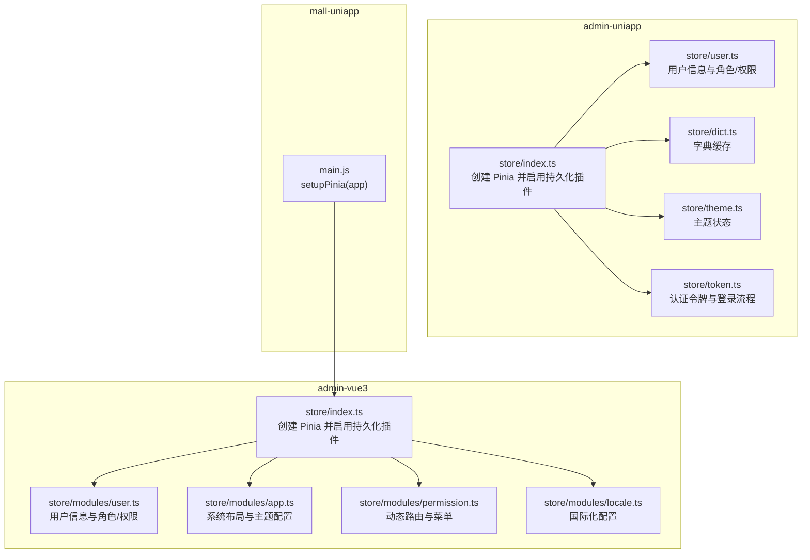
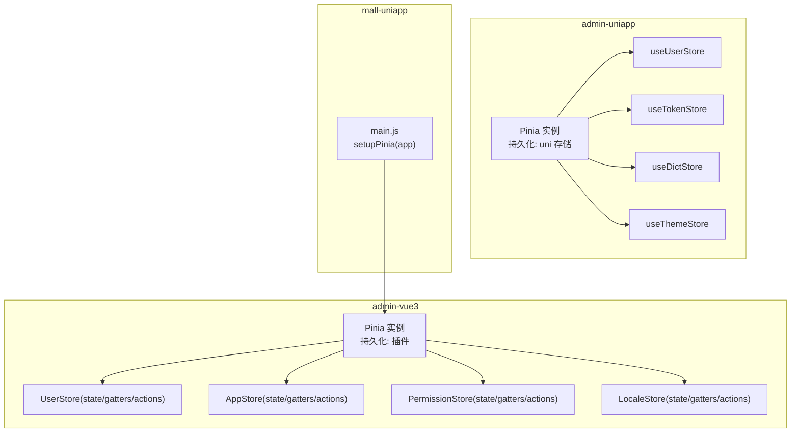
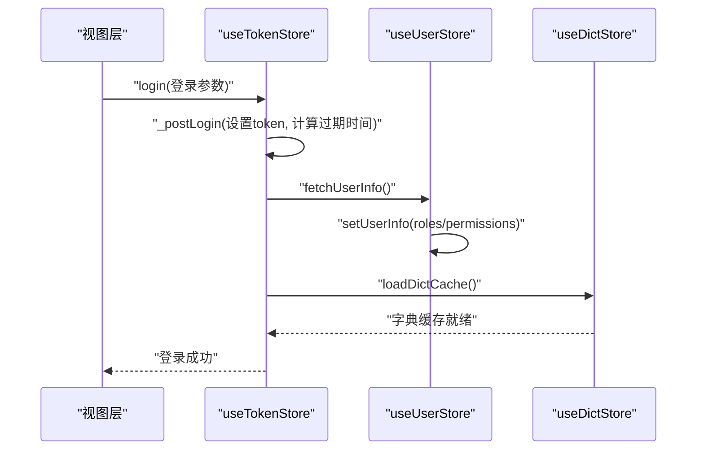
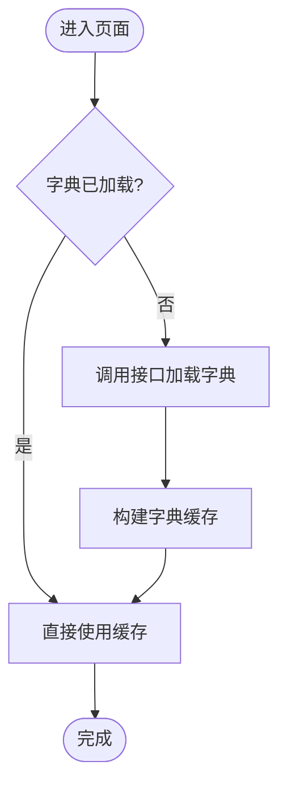
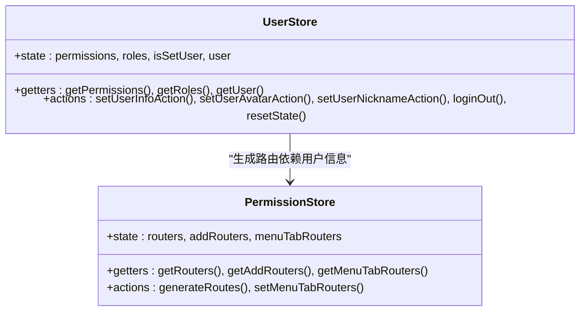
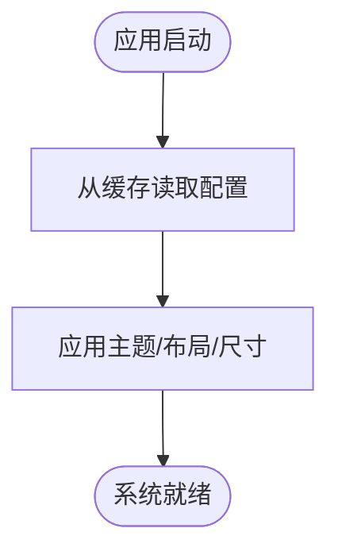
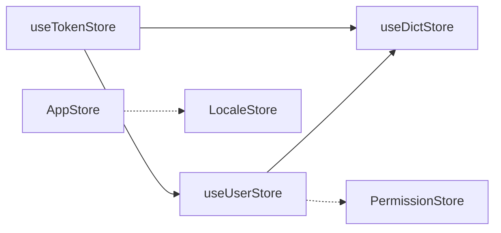

# 状态管理

<cite>
**本文引用的文件**
- [frontend/admin-uniapp/src/store/index.ts](file://frontend/admin-uniapp/src/store/index.ts)
- [frontend/admin-uniapp/src/store/user.ts](file://frontend/admin-uniapp/src/store/user.ts)
- [frontend/admin-uniapp/src/store/dict.ts](file://frontend/admin-uniapp/src/store/dict.ts)
- [frontend/admin-uniapp/src/store/theme.ts](file://frontend/admin-uniapp/src/store/theme.ts)
- [frontend/admin-uniapp/src/store/token.ts](file://frontend/admin-uniapp/src/store/token.ts)
- [frontend/admin-vue3/src/store/index.ts](file://frontend/admin-vue3/src/store/index.ts)
- [frontend/admin-vue3/src/store/modules/user.ts](file://frontend/admin-vue3/src/store/modules/user.ts)
- [frontend/admin-vue3/src/store/modules/app.ts](file://frontend/admin-vue3/src/store/modules/app.ts)
- [frontend/admin-vue3/src/store/modules/permission.ts](file://frontend/admin-vue3/src/store/modules/permission.ts)
- [frontend/admin-vue3/src/store/modules/locale.ts](file://frontend/admin-vue3/src/store/modules/locale.ts)
- [frontend/mall-uniapp/main.js](file://frontend/mall-uniapp/main.js)
</cite>

## 目录
1. [简介](#简介)
2. [项目结构](#项目结构)
3. [核心组件](#核心组件)
4. [架构总览](#架构总览)
5. [详细组件分析](#详细组件分析)
6. [依赖关系分析](#依赖关系分析)
7. [性能考量](#性能考量)
8. [故障排查指南](#故障排查指南)
9. [结论](#结论)
10. [附录](#附录)

## 简介
本文件系统性梳理基于 Pinia 的状态管理架构，覆盖以下方面：
- Store 模块化组织与职责划分
- 全局状态与模块间通信机制
- 状态持久化策略与平台适配
- 最佳实践：状态设计、异步处理、订阅与调试
- 权限状态、用户信息、系统配置等核心状态管理方案
- 性能优化与内存管理技巧

## 项目结构
本仓库包含多套前端工程，其中与状态管理相关的关键目录如下：
- admin-uniapp（基于 uni-app 的移动端应用）
  - store：全局状态入口与模块化 Store
- admin-vue3（基于 Vue3 + Element Plus 的后台管理）
  - store：全局状态入口与模块化 Store（modules 下按功能拆分）
- mall-uniapp（另一套 uni-app 应用）
  - main.js：应用启动时初始化 Pinia

图表来源
- [frontend/admin-uniapp/src/store/index.ts:1-23](file://frontend/admin-uniapp/src/store/index.ts#L1-L23)
- [frontend/admin-uniapp/src/store/user.ts:1-90](file://frontend/admin-uniapp/src/store/user.ts#L1-L90)
- [frontend/admin-uniapp/src/store/dict.ts:1-87](file://frontend/admin-uniapp/src/store/dict.ts#L1-L87)
- [frontend/admin-uniapp/src/store/theme.ts:1-43](file://frontend/admin-uniapp/src/store/theme.ts#L1-L43)
- [frontend/admin-uniapp/src/store/token.ts:1-342](file://frontend/admin-uniapp/src/store/token.ts#L1-L342)
- [frontend/admin-vue3/src/store/index.ts:1-13](file://frontend/admin-vue3/src/store/index.ts#L1-L13)
- [frontend/admin-vue3/src/store/modules/user.ts:1-109](file://frontend/admin-vue3/src/store/modules/user.ts#L1-L109)
- [frontend/admin-vue3/src/store/modules/app.ts:1-323](file://frontend/admin-vue3/src/store/modules/app.ts#L1-L323)
- [frontend/admin-vue3/src/store/modules/permission.ts:1-72](file://frontend/admin-vue3/src/store/modules/permission.ts#L1-L72)
- [frontend/admin-vue3/src/store/modules/locale.ts:1-60](file://frontend/admin-vue3/src/store/modules/locale.ts#L1-L60)
- [frontend/mall-uniapp/main.js:1-16](file://frontend/mall-uniapp/main.js#L1-L16)

章节来源
- [frontend/admin-uniapp/src/store/index.ts:1-23](file://frontend/admin-uniapp/src/store/index.ts#L1-L23)
- [frontend/admin-vue3/src/store/index.ts:1-13](file://frontend/admin-vue3/src/store/index.ts#L1-L13)
- [frontend/mall-uniapp/main.js:1-16](file://frontend/mall-uniapp/main.js#L1-L16)

## 核心组件
- 全局 Pinia 实例与持久化
  - admin-uniapp：在 store/index.ts 中创建 Pinia，并通过 createPersistedState 配置 uni 存储，立即激活实例以避免白屏。
  - admin-vue3：在 store/index.ts 中创建 Pinia 并启用持久化插件，通过 setupStore(app) 在应用挂载时注入。
  - mall-uniapp：通过 main.js 调用 setupPinia(app) 初始化 Pinia。

- 用户与认证
  - admin-uniapp：user.ts 提供用户信息、角色/权限、收藏菜单；token.ts 提供登录、登出、刷新令牌、有效性判断与联动拉取用户信息、字典缓存。
  - admin-vue3：modules/user.ts 使用 state/gatters/actions 管理用户信息与头像/昵称更新，结合缓存与后端接口。

- 系统配置与主题
  - admin-uniapp：theme.ts 管理明/暗主题与主题变量。
  - admin-vue3：modules/app.ts 管理布局、主题色、尺寸、暗色模式、移动端适配等。

- 字典与国际化
  - admin-uniapp：dict.ts 提供字典缓存、按类型查询、加载与清理。
  - admin-vue3：modules/locale.ts 管理当前语言与 Element Plus 语言包映射。

章节来源
- [frontend/admin-uniapp/src/store/index.ts:1-23](file://frontend/admin-uniapp/src/store/index.ts#L1-L23)
- [frontend/admin-uniapp/src/store/user.ts:1-90](file://frontend/admin-uniapp/src/store/user.ts#L1-L90)
- [frontend/admin-uniapp/src/store/token.ts:1-342](file://frontend/admin-uniapp/src/store/token.ts#L1-L342)
- [frontend/admin-uniapp/src/store/theme.ts:1-43](file://frontend/admin-uniapp/src/store/theme.ts#L1-L43)
- [frontend/admin-uniapp/src/store/dict.ts:1-87](file://frontend/admin-uniapp/src/store/dict.ts#L1-L87)
- [frontend/admin-vue3/src/store/modules/user.ts:1-109](file://frontend/admin-vue3/src/store/modules/user.ts#L1-L109)
- [frontend/admin-vue3/src/store/modules/app.ts:1-323](file://frontend/admin-vue3/src/store/modules/app.ts#L1-L323)
- [frontend/admin-vue3/src/store/modules/locale.ts:1-60](file://frontend/admin-vue3/src/store/modules/locale.ts#L1-L60)
- [frontend/mall-uniapp/main.js:1-16](file://frontend/mall-uniapp/main.js#L1-L16)

## 架构总览
Pinia 在三套前端工程中的使用方式略有差异，但整体遵循“全局 Pinia 实例 + 模块化 Store”的组织方式。admin-uniapp 与 mall-uniapp 更偏向于“单页应用 + uni 生态”，admin-vue3 则采用“模块化 Store + 缓存 + 后端接口”的组合。

图表来源
- [frontend/admin-uniapp/src/store/index.ts:1-23](file://frontend/admin-uniapp/src/store/index.ts#L1-L23)
- [frontend/admin-uniapp/src/store/user.ts:1-90](file://frontend/admin-uniapp/src/store/user.ts#L1-L90)
- [frontend/admin-uniapp/src/store/token.ts:1-342](file://frontend/admin-uniapp/src/store/token.ts#L1-L342)
- [frontend/admin-uniapp/src/store/dict.ts:1-87](file://frontend/admin-uniapp/src/store/dict.ts#L1-L87)
- [frontend/admin-uniapp/src/store/theme.ts:1-43](file://frontend/admin-uniapp/src/store/theme.ts#L1-L43)
- [frontend/admin-vue3/src/store/index.ts:1-13](file://frontend/admin-vue3/src/store/index.ts#L1-L13)
- [frontend/admin-vue3/src/store/modules/user.ts:1-109](file://frontend/admin-vue3/src/store/modules/user.ts#L1-L109)
- [frontend/admin-vue3/src/store/modules/app.ts:1-323](file://frontend/admin-vue3/src/store/modules/app.ts#L1-L323)
- [frontend/admin-vue3/src/store/modules/permission.ts:1-72](file://frontend/admin-vue3/src/store/modules/permission.ts#L1-L72)
- [frontend/admin-vue3/src/store/modules/locale.ts:1-60](file://frontend/admin-vue3/src/store/modules/locale.ts#L1-L60)
- [frontend/mall-uniapp/main.js:1-16](file://frontend/mall-uniapp/main.js#L1-L16)

## 详细组件分析

### admin-uniapp：认证与用户状态流
该模块以 useTokenStore 为核心，串联登录、令牌有效期判断、刷新、用户信息拉取与字典缓存加载。useUserStore 负责用户信息与角色/权限的持久化与清理。

图表来源
- [frontend/admin-uniapp/src/store/token.ts:104-113](file://frontend/admin-uniapp/src/store/token.ts#L104-L113)
- [frontend/admin-uniapp/src/store/user.ts:64-70](file://frontend/admin-uniapp/src/store/user.ts#L64-L70)
- [frontend/admin-uniapp/src/store/dict.ts:30-52](file://frontend/admin-uniapp/src/store/dict.ts#L30-L52)

章节来源
- [frontend/admin-uniapp/src/store/token.ts:1-342](file://frontend/admin-uniapp/src/store/token.ts#L1-L342)
- [frontend/admin-uniapp/src/store/user.ts:1-90](file://frontend/admin-uniapp/src/store/user.ts#L1-L90)
- [frontend/admin-uniapp/src/store/dict.ts:1-87](file://frontend/admin-uniapp/src/store/dict.ts#L1-L87)

### admin-uniapp：主题与字典状态
- 主题状态：提供明/暗主题切换与主题变量合并更新，支持持久化。
- 字典状态：按类型缓存字典项，提供查询与加载接口，避免重复请求。

图表来源
- [frontend/admin-uniapp/src/store/dict.ts:30-52](file://frontend/admin-uniapp/src/store/dict.ts#L30-L52)

章节来源
- [frontend/admin-uniapp/src/store/theme.ts:1-43](file://frontend/admin-uniapp/src/store/theme.ts#L1-L43)
- [frontend/admin-uniapp/src/store/dict.ts:1-87](file://frontend/admin-uniapp/src/store/dict.ts#L1-L87)

### admin-vue3：用户与权限状态
- 用户状态：使用 state/gatters/actions 管理用户信息、角色/权限集合与头像/昵称更新；结合缓存与后端接口，支持离线兜底。
- 权限状态：根据用户角色生成动态路由与菜单，支持扁平化多级路由与 404 页面追加。

图表来源
- [frontend/admin-vue3/src/store/modules/user.ts:24-103](file://frontend/admin-vue3/src/store/modules/user.ts#L24-L103)
- [frontend/admin-vue3/src/store/modules/permission.ts:16-66](file://frontend/admin-vue3/src/store/modules/permission.ts#L16-L66)

章节来源
- [frontend/admin-vue3/src/store/modules/user.ts:1-109](file://frontend/admin-vue3/src/store/modules/user.ts#L1-L109)
- [frontend/admin-vue3/src/store/modules/permission.ts:1-72](file://frontend/admin-vue3/src/store/modules/permission.ts#L1-L72)

### admin-vue3：系统配置与国际化
- 系统配置：管理面包屑、折叠菜单、标签页、布局、主题色、暗色模式、移动端适配等，支持持久化到缓存。
- 国际化：维护当前语言与 Element Plus 语言包映射，支持切换并持久化。

图表来源
- [frontend/admin-vue3/src/store/modules/app.ts:44-104](file://frontend/admin-vue3/src/store/modules/app.ts#L44-L104)
- [frontend/admin-vue3/src/store/modules/locale.ts:20-37](file://frontend/admin-vue3/src/store/modules/locale.ts#L20-L37)

章节来源
- [frontend/admin-vue3/src/store/modules/app.ts:1-323](file://frontend/admin-vue3/src/store/modules/app.ts#L1-L323)
- [frontend/admin-vue3/src/store/modules/locale.ts:1-60](file://frontend/admin-vue3/src/store/modules/locale.ts#L1-L60)

## 依赖关系分析
- 模块耦合
  - admin-uniapp：token 依赖 user 与 dict；user 与 dict 独立，theme 与 token/user 无直接依赖。
  - admin-vue3：user 与 permission 存在生成路由的依赖；app 与 locale 独立。
- 外部依赖
  - admin-uniapp：pinia-plugin-persistedstate（uni 存储）、wot-design-uni（toast）。
  - admin-vue3：pinia-plugin-persistedstate、Element Plus、wsCache（自定义缓存封装）。
- 持久化策略
  - admin-uniapp：通过 createPersistedState 指定 uni 存储，store/index.ts 中启用。
  - admin-vue3：通过插件启用持久化，app 与 locale 使用 wsCache 作为持久化载体。

图表来源
- [frontend/admin-uniapp/src/store/token.ts:108-112](file://frontend/admin-uniapp/src/store/token.ts#L108-L112)
- [frontend/admin-vue3/src/store/modules/user.ts:56-69](file://frontend/admin-vue3/src/store/modules/user.ts#L56-L69)
- [frontend/admin-vue3/src/store/modules/permission.ts:34-60](file://frontend/admin-vue3/src/store/modules/permission.ts#L34-L60)

章节来源
- [frontend/admin-uniapp/src/store/index.ts:1-23](file://frontend/admin-uniapp/src/store/index.ts#L1-L23)
- [frontend/admin-vue3/src/store/index.ts:1-13](file://frontend/admin-vue3/src/store/index.ts#L1-L13)

## 性能考量
- 状态粒度与拆分
  - 将用户、字典、主题、认证等拆分为独立 Store，降低耦合与不必要的响应式开销。
- 异步与缓存
  - 对字典与用户信息采用缓存与兜底策略，减少重复请求与网络抖动影响。
- 计算属性与派生状态
  - 使用 computed 判断令牌有效性、主题切换等，避免重复计算。
- 持久化范围
  - 仅对必要状态启用持久化，避免存储过多数据导致体积膨胀与序列化成本上升。
- 内存管理
  - 登出时清理 token 与用户缓存，释放引用，防止内存泄漏。
- UI 交互
  - 使用 toast 或消息组件反馈异步结果，避免阻塞主线程。

## 故障排查指南
- 登录后白屏或状态未生效（admin-uniapp）
  - 确认已调用 setActivePinia 并在 app.use(store) 之前即可使用 store。
  - 检查持久化插件是否正确配置 uni 存储。
- 令牌过期导致请求失败
  - 使用 hasValidLogin 与 tryGetValidToken 判断与刷新；双令牌模式下注意刷新逻辑。
- 用户信息未更新
  - 确保 _postLogin 中调用了 userStore.fetchUserInfo；检查后端返回字段兼容性。
- 字典未加载
  - 确认 loadDictCache 仅在未加载时触发；检查接口返回格式与类型转换。
- 主题切换无效
  - 确认 setThemeVars 与 toggleTheme 调用顺序；检查主题变量是否正确合并。
- 路由权限异常（admin-vue3）
  - 检查 generateRoutes 中角色路由生成与 remaining 路由拼接；确认 404 路由位置。

章节来源
- [frontend/admin-uniapp/src/store/index.ts:13-14](file://frontend/admin-uniapp/src/store/index.ts#L13-L14)
- [frontend/admin-uniapp/src/store/token.ts:289-298](file://frontend/admin-uniapp/src/store/token.ts#L289-L298)
- [frontend/admin-uniapp/src/store/user.ts:64-70](file://frontend/admin-uniapp/src/store/user.ts#L64-L70)
- [frontend/admin-uniapp/src/store/dict.ts:30-52](file://frontend/admin-uniapp/src/store/dict.ts#L30-L52)
- [frontend/admin-vue3/src/store/modules/app.ts:284-294](file://frontend/admin-vue3/src/store/modules/app.ts#L284-L294)
- [frontend/admin-vue3/src/store/modules/permission.ts:34-60](file://frontend/admin-vue3/src/store/modules/permission.ts#L34-L60)

## 结论
本仓库在不同前端工程中实现了统一的 Pinia 状态管理范式：以模块化 Store 组织状态，结合持久化与缓存提升可用性与性能；在 admin-uniapp 中强调认证与用户状态的联动，在 admin-vue3 中强调系统配置与权限路由的解耦。通过合理的状态设计、异步处理与订阅机制，能够满足多端、多场景下的状态管理需求。

## 附录
- 最佳实践清单
  - 状态设计：单一职责、明确边界、最小化响应式范围
  - 异步处理：统一错误处理、超时与重试、加载态与兜底
  - 订阅与调试：利用浏览器开发工具查看 Pinia 状态变更；必要时打印关键路径
  - 持久化：仅持久化必要状态；注意序列化与版本迁移
  - 性能：避免在计算属性中执行异步；合理拆分模块；及时清理无用缓存
- 关键实现参考路径
  - [admin-uniapp：store/index.ts:1-23](file://frontend/admin-uniapp/src/store/index.ts#L1-L23)
  - [admin-uniapp：store/token.ts:104-113](file://frontend/admin-uniapp/src/store/token.ts#L104-L113)
  - [admin-uniapp：store/user.ts:64-70](file://frontend/admin-uniapp/src/store/user.ts#L64-L70)
  - [admin-uniapp：store/dict.ts:30-52](file://frontend/admin-uniapp/src/store/dict.ts#L30-L52)
  - [admin-vue3：store/index.ts:1-13](file://frontend/admin-vue3/src/store/index.ts#L1-L13)
  - [admin-vue3：store/modules/user.ts:50-71](file://frontend/admin-vue3/src/store/modules/user.ts#L50-L71)
  - [admin-vue3：store/modules/app.ts:284-294](file://frontend/admin-vue3/src/store/modules/app.ts#L284-L294)
  - [admin-vue3：store/modules/permission.ts:34-60](file://frontend/admin-vue3/src/store/modules/permission.ts#L34-L60)
  - [admin-vue3：store/modules/locale.ts:47-53](file://frontend/admin-vue3/src/store/modules/locale.ts#L47-L53)
  - [mall-uniapp：main.js:1-16](file://frontend/mall-uniapp/main.js#L1-L16)