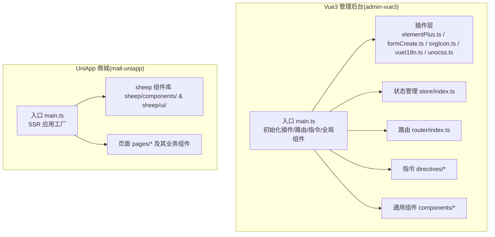
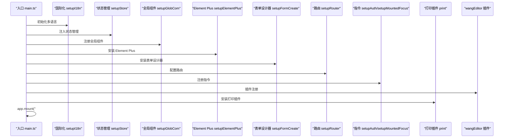
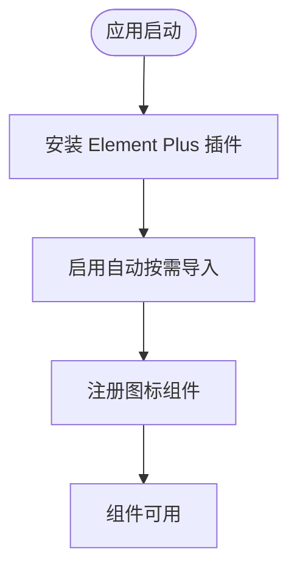
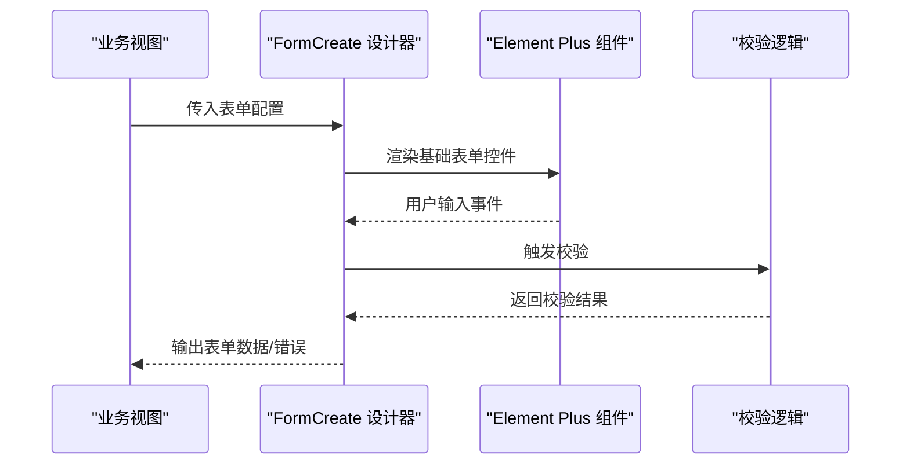
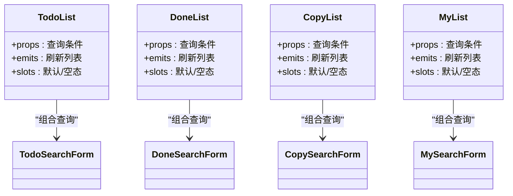
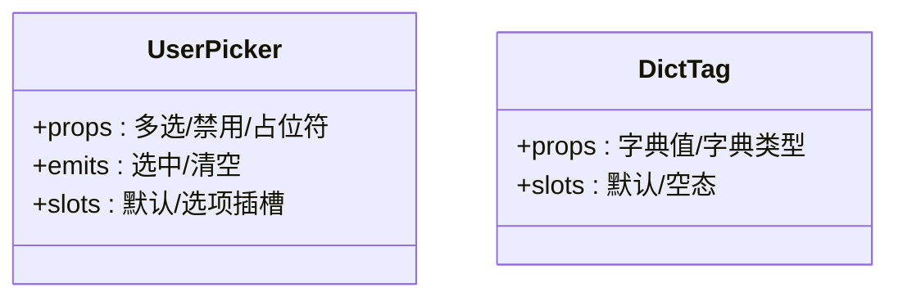
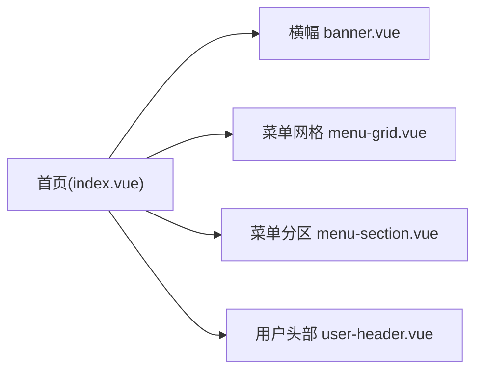
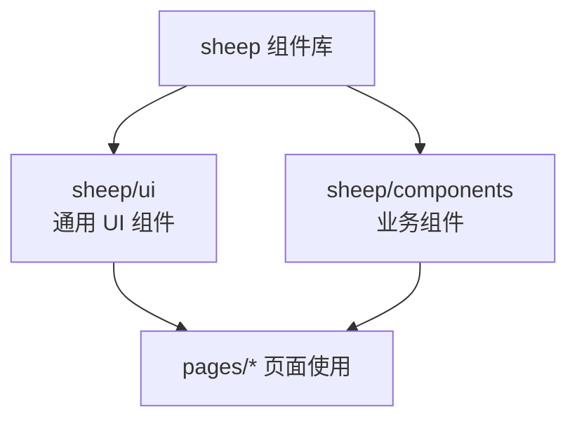
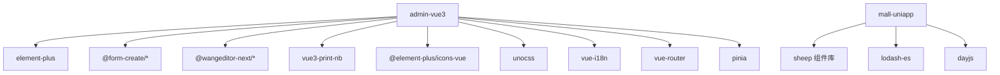

# 组件系统

<cite>
**本文引用的文件**
- [frontend/admin-vue3/src/main.ts](file://frontend/admin-vue3/src/main.ts)
- [frontend/admin-vue3/package.json](file://frontend/admin-vue3/package.json)
- [frontend/admin-uniapp/src/main.ts](file://frontend/admin-uniapp/src/main.ts)
- [frontend/mall-uniapp/package.json](file://frontend/mall-uniapp/package.json)
- [frontend/admin-vue3/src/plugins/elementPlus.ts](file://frontend/admin-vue3/src/plugins/elementPlus.ts)
- [frontend/admin-vue3/src/plugins/formCreate.ts](file://frontend/admin-vue3/src/plugins/formCreate.ts)
- [frontend/admin-vue3/src/plugins/unocss.ts](file://frontend/admin-vue3/src/plugins/unocss.ts)
- [frontend/admin-vue3/src/plugins/svgIcon.ts](file://frontend/admin-vue3/src/plugins/svgIcon.ts)
- [frontend/admin-vue3/src/plugins/vueI18n.ts](file://frontend/admin-vue3/src/plugins/vueI18n.ts)
- [frontend/admin-vue3/src/plugins/animate.css](file://frontend/admin-vue3/src/plugins/animate.css)
- [frontend/admin-vue3/src/store/index.ts](file://frontend/admin-vue3/src/store/index.ts)
- [frontend/admin-vue3/src/router/index.ts](file://frontend/admin-vue3/src/router/index.ts)
- [frontend/admin-vue3/src/directives/auth.ts](file://frontend/admin-vue3/src/directives/auth.ts)
- [frontend/admin-vue3/src/directives/mountedFocus.ts](file://frontend/admin-vue3/src/directives/mountedFocus.ts)
- [frontend/admin-vue3/src/views/bpm/model/form/PrintTemplate.ts](file://frontend/admin-vue3/src/views/bpm/model/form/PrintTemplate.ts)
- [frontend/admin-vue3/src/utils/Logger.ts](file://frontend/admin-vue3/src/utils/Logger.ts)
- [frontend/admin-uniapp/src/App.vue](file://frontend/admin-uniapp/src/App.vue)
- [frontend/admin-uniapp/src/pages/index/components/banner.vue](file://frontend/admin-uniapp/src/pages/index/components/banner.vue)
- [frontend/admin-uniapp/src/pages/index/components/menu-grid.vue](file://frontend/admin-uniapp/src/pages/index/components/menu-grid.vue)
- [frontend/admin-uniapp/src/pages/index/components/menu-section.vue](file://frontend/admin-uniapp/src/pages/index/components/menu-section.vue)
- [frontend/admin-uniapp/src/pages/index/components/user-header.vue](file://frontend/admin-uniapp/src/pages/index/components/user-header.vue)
- [frontend/admin-uniapp/src/components/system-select/user-picker.vue](file://frontend/admin-uniapp/src/components/system-select/user-picker.vue)
- [frontend/admin-uniapp/src/components/dict-tag/dict-tag.vue](file://frontend/admin-uniapp/src/components/dict-tag/dict-tag.vue)
- [frontend/admin-uniapp/src/pages/bpm/components/todo-list.vue](file://frontend/admin-uniapp/src/pages/bpm/components/todo-list.vue)
- [frontend/admin-uniapp/src/pages/bpm/components/todo-search-form.vue](file://frontend/admin-uniapp/src/pages/bpm/components/todo-search-form.vue)
- [frontend/admin-uniapp/src/pages/bpm/components/done-list.vue](file://frontend/admin-uniapp/src/pages/bpm/components/done-list.vue)
- [frontend/admin-uniapp/src/pages/bpm/components/done-search-form.vue](file://frontend/admin-uniapp/src/pages/bpm/components/done-search-form.vue)
- [frontend/admin-uniapp/src/pages/bpm/components/my-list.vue](file://frontend/admin-uniapp/src/pages/bpm/components/my-list.vue)
- [frontend/admin-uniapp/src/pages/bpm/components/my-search-form.vue](file://frontend/admin-uniapp/src/pages/bpm/components/my-search-form.vue)
- [frontend/admin-uniapp/src/pages/bpm/components/copy-list.vue](file://frontend/admin-uniapp/src/pages/bpm/components/copy-list.vue)
- [frontend/admin-uniapp/src/pages/bpm/components/copy-search-form.vue](file://frontend/admin-uniapp/src/pages/bpm/components/copy-search-form.vue)
- [frontend/mall-uniapp/sheep/components/README.md](file://frontend/mall-uniapp/sheep/components/README.md)
- [frontend/mall-uniapp/sheep/ui/README.md](file://frontend/mall-uniapp/sheep/ui/README.md)
</cite>

## 目录
1. [引言](#引言)
2. [项目结构](#项目结构)
3. [核心组件](#核心组件)
4. [架构总览](#架构总览)
5. [详细组件分析](#详细组件分析)
6. [依赖分析](#依赖分析)
7. [性能考虑](#性能考虑)
8. [故障排查指南](#故障排查指南)
9. [结论](#结论)
10. [附录](#附录)

## 引言
本文件系统性梳理 AgenticCPS 前端组件体系，覆盖 Vue3 管理后台与 UniApp 商城两套前端工程的组件设计与组织方式。重点阐述：
- 组件分类：通用组件、业务组件、页面组件的职责边界与组织策略
- 组件库集成：Element Plus、FormCreate、wangEditor、打印插件等生态集成
- 全局组件注册与导入优化：按需加载、自动注册、插件化装配
- 开发规范：Props 定义、事件处理、插槽使用、类型约束
- 常用业务组件：表格、表单、弹窗、图表等的实现与使用建议
- 复用、性能与可维护性最佳实践

## 项目结构
前端工程分为两大子项目：
- Vue3 管理后台（admin-vue3）：采用 Vite + TypeScript + Element Plus + Pinia + Vue Router
- UniApp 商城（admin-uniapp / mall-uniapp）：采用 Vue3 + Vite + UnoCSS + 自研组件体系

图示来源
- [frontend/admin-vue3/src/main.ts:51-81](file://frontend/admin-vue3/src/main.ts#L51-L81)
- [frontend/admin-uniapp/src/main.ts:10-19](file://frontend/admin-uniapp/src/main.ts#L10-L19)

章节来源
- [frontend/admin-vue3/src/main.ts:1-86](file://frontend/admin-vue3/src/main.ts#L1-L86)
- [frontend/admin-uniapp/src/main.ts:1-20](file://frontend/admin-uniapp/src/main.ts#L1-L20)

## 核心组件
- 通用组件：跨页面复用的基础 UI 组件，如标签、选择器、分页、按钮等
- 业务组件：面向具体业务域的复合组件，如用户选择器、流程任务列表、搜索表单等
- 页面组件：页面级容器组件，负责布局、数据流编排与业务交互

在 admin-uniapp 中，页面组件与业务组件并存于 pages/* 与 components/* 目录；在 mall-uniapp 中，sheep/ui 与 sheep/components 提供统一的 UI 与业务组件。

章节来源
- [frontend/admin-uniapp/src/pages/index/components/banner.vue](file://frontend/admin-uniapp/src/pages/index/components/banner.vue)
- [frontend/admin-uniapp/src/pages/index/components/menu-grid.vue](file://frontend/admin-uniapp/src/pages/index/components/menu-grid.vue)
- [frontend/admin-uniapp/src/pages/index/components/menu-section.vue](file://frontend/admin-uniapp/src/pages/index/components/menu-section.vue)
- [frontend/admin-uniapp/src/pages/index/components/user-header.vue](file://frontend/admin-uniapp/src/pages/index/components/user-header.vue)
- [frontend/admin-uniapp/src/components/system-select/user-picker.vue](file://frontend/admin-uniapp/src/components/system-select/user-picker.vue)
- [frontend/admin-uniapp/src/components/dict-tag/dict-tag.vue](file://frontend/admin-uniapp/src/components/dict-tag/dict-tag.vue)
- [frontend/admin-uniapp/src/pages/bpm/components/todo-list.vue](file://frontend/admin-uniapp/src/pages/bpm/components/todo-list.vue)
- [frontend/admin-uniapp/src/pages/bpm/components/todo-search-form.vue](file://frontend/admin-uniapp/src/pages/bpm/components/todo-search-form.vue)
- [frontend/admin-uniapp/src/pages/bpm/components/done-list.vue](file://frontend/admin-uniapp/src/pages/bpm/components/done-list.vue)
- [frontend/admin-uniapp/src/pages/bpm/components/done-search-form.vue](file://frontend/admin-uniapp/src/pages/bpm/components/done-search-form.vue)
- [frontend/admin-uniapp/src/pages/bpm/components/my-list.vue](file://frontend/admin-uniapp/src/pages/bpm/components/my-list.vue)
- [frontend/admin-uniapp/src/pages/bpm/components/my-search-form.vue](file://frontend/admin-uniapp/src/pages/bpm/components/my-search-form.vue)
- [frontend/admin-uniapp/src/pages/bpm/components/copy-list.vue](file://frontend/admin-uniapp/src/pages/bpm/components/copy-list.vue)
- [frontend/admin-uniapp/src/pages/bpm/components/copy-search-form.vue](file://frontend/admin-uniapp/src/pages/bpm/components/copy-search-form.vue)

## 架构总览
组件系统通过“插件化装配 + 全局注册 + 按需引入”的方式实现高内聚、低耦合的组件生态。

图示来源
- [frontend/admin-vue3/src/main.ts:51-81](file://frontend/admin-vue3/src/main.ts#L51-L81)

章节来源
- [frontend/admin-vue3/src/main.ts:1-86](file://frontend/admin-vue3/src/main.ts#L1-L86)

## 详细组件分析

### Element Plus 集成与全局注册
- 通过独立插件文件集中安装与配置 Element Plus，便于版本升级与主题定制
- 结合自动按需导入与图标资源，减少打包体积

图示来源
- [frontend/admin-vue3/src/plugins/elementPlus.ts](file://frontend/admin-vue3/src/plugins/elementPlus.ts)
- [frontend/admin-vue3/package.json:27-84](file://frontend/admin-vue3/package.json#L27-L84)

章节来源
- [frontend/admin-vue3/src/plugins/elementPlus.ts](file://frontend/admin-vue3/src/plugins/elementPlus.ts)
- [frontend/admin-vue3/package.json:27-84](file://frontend/admin-vue3/package.json#L27-L84)

### 表单组件与表单设计器集成
- 使用 FormCreate 作为可视化表单设计器，结合 Element Plus 组件构建复杂表单
- 支持动态渲染、校验规则与事件绑定

图示来源
- [frontend/admin-vue3/src/plugins/formCreate.ts](file://frontend/admin-vue3/src/plugins/formCreate.ts)
- [frontend/admin-vue3/src/plugins/elementPlus.ts](file://frontend/admin-vue3/src/plugins/elementPlus.ts)

章节来源
- [frontend/admin-vue3/src/plugins/formCreate.ts](file://frontend/admin-vue3/src/plugins/formCreate.ts)
- [frontend/admin-vue3/src/plugins/elementPlus.ts](file://frontend/admin-vue3/src/plugins/elementPlus.ts)

### 流程任务列表组件族（业务组件）
以 BPM 任务为中心的业务组件群，包含“待办/已办/抄送/我的”等列表与其对应的搜索表单，形成“列表 + 查询条件”的标准业务交互模式。

图示来源
- [frontend/admin-uniapp/src/pages/bpm/components/todo-list.vue](file://frontend/admin-uniapp/src/pages/bpm/components/todo-list.vue)
- [frontend/admin-uniapp/src/pages/bpm/components/todo-search-form.vue](file://frontend/admin-uniapp/src/pages/bpm/components/todo-search-form.vue)
- [frontend/admin-uniapp/src/pages/bpm/components/done-list.vue](file://frontend/admin-uniapp/src/pages/bpm/components/done-list.vue)
- [frontend/admin-uniapp/src/pages/bpm/components/done-search-form.vue](file://frontend/admin-uniapp/src/pages/bpm/components/done-search-form.vue)
- [frontend/admin-uniapp/src/pages/bpm/components/my-list.vue](file://frontend/admin-uniapp/src/pages/bpm/components/my-list.vue)
- [frontend/admin-uniapp/src/pages/bpm/components/my-search-form.vue](file://frontend/admin-uniapp/src/pages/bpm/components/my-search-form.vue)
- [frontend/admin-uniapp/src/pages/bpm/components/copy-list.vue](file://frontend/admin-uniapp/src/pages/bpm/components/copy-list.vue)
- [frontend/admin-uniapp/src/pages/bpm/components/copy-search-form.vue](file://frontend/admin-uniapp/src/pages/bpm/components/copy-search-form.vue)

章节来源
- [frontend/admin-uniapp/src/pages/bpm/components/todo-list.vue](file://frontend/admin-uniapp/src/pages/bpm/components/todo-list.vue)
- [frontend/admin-uniapp/src/pages/bpm/components/todo-search-form.vue](file://frontend/admin-uniapp/src/pages/bpm/components/todo-search-form.vue)
- [frontend/admin-uniapp/src/pages/bpm/components/done-list.vue](file://frontend/admin-uniapp/src/pages/bpm/components/done-list.vue)
- [frontend/admin-uniapp/src/pages/bpm/components/done-search-form.vue](file://frontend/admin-uniapp/src/pages/bpm/components/done-search-form.vue)
- [frontend/admin-uniapp/src/pages/bpm/components/my-list.vue](file://frontend/admin-uniapp/src/pages/bpm/components/my-list.vue)
- [frontend/admin-uniapp/src/pages/bpm/components/my-search-form.vue](file://frontend/admin-uniapp/src/pages/bpm/components/my-search-form.vue)
- [frontend/admin-uniapp/src/pages/bpm/components/copy-list.vue](file://frontend/admin-uniapp/src/pages/bpm/components/copy-list.vue)
- [frontend/admin-uniapp/src/pages/bpm/components/copy-search-form.vue](file://frontend/admin-uniapp/src/pages/bpm/components/copy-search-form.vue)

### 通用组件：用户选择器与字典标签
- 用户选择器：用于在表单或筛选中选择用户，支持多选、搜索、清空等能力
- 字典标签：根据字典值渲染友好标签，支持颜色、尺寸等样式扩展

图示来源
- [frontend/admin-uniapp/src/components/system-select/user-picker.vue](file://frontend/admin-uniapp/src/components/system-select/user-picker.vue)
- [frontend/admin-uniapp/src/components/dict-tag/dict-tag.vue](file://frontend/admin-uniapp/src/components/dict-tag/dict-tag.vue)

章节来源
- [frontend/admin-uniapp/src/components/system-select/user-picker.vue](file://frontend/admin-uniapp/src/components/system-select/user-picker.vue)
- [frontend/admin-uniapp/src/components/dict-tag/dict-tag.vue](file://frontend/admin-uniapp/src/components/dict-tag/dict-tag.vue)

### 页面组件：首页模块化布局
首页页面由多个页面组件拼装而成，体现“页面组件负责布局，业务组件负责功能”的分层思想。

图示来源
- [frontend/admin-uniapp/src/pages/index/components/banner.vue](file://frontend/admin-uniapp/src/pages/index/components/banner.vue)
- [frontend/admin-uniapp/src/pages/index/components/menu-grid.vue](file://frontend/admin-uniapp/src/pages/index/components/menu-grid.vue)
- [frontend/admin-uniapp/src/pages/index/components/menu-section.vue](file://frontend/admin-uniapp/src/pages/index/components/menu-section.vue)
- [frontend/admin-uniapp/src/pages/index/components/user-header.vue](file://frontend/admin-uniapp/src/pages/index/components/user-header.vue)

章节来源
- [frontend/admin-uniapp/src/pages/index/components/banner.vue](file://frontend/admin-uniapp/src/pages/index/components/banner.vue)
- [frontend/admin-uniapp/src/pages/index/components/menu-grid.vue](file://frontend/admin-uniapp/src/pages/index/components/menu-grid.vue)
- [frontend/admin-uniapp/src/pages/index/components/menu-section.vue](file://frontend/admin-uniapp/src/pages/index/components/menu-section.vue)
- [frontend/admin-uniapp/src/pages/index/components/user-header.vue](file://frontend/admin-uniapp/src/pages/index/components/user-header.vue)

### 商城组件库（sheep）概览
mall-uniapp 提供了 sheep 组件库与 sheep/ui，用于支撑多端一致的 UI 体验与业务组件复用。

图示来源
- [frontend/mall-uniapp/sheep/components/README.md](file://frontend/mall-uniapp/sheep/components/README.md)
- [frontend/mall-uniapp/sheep/ui/README.md](file://frontend/mall-uniapp/sheep/ui/README.md)

章节来源
- [frontend/mall-uniapp/sheep/components/README.md](file://frontend/mall-uniapp/sheep/components/README.md)
- [frontend/mall-uniapp/sheep/ui/README.md](file://frontend/mall-uniapp/sheep/ui/README.md)

## 依赖分析
- 组件库与生态
  - Element Plus：基础 UI 组件库
  - FormCreate：可视化表单设计器
  - wangEditor：富文本编辑器
  - 打印插件：vue3-print-nb
  - 图标与样式：@element-plus/icons-vue、UnoCSS、Animate.css
- 状态与路由：Pinia、Vue Router
- 工具与类型：dayjs、lodash-es、vue-types、TypeScript

图示来源
- [frontend/admin-vue3/package.json:27-84](file://frontend/admin-vue3/package.json#L27-L84)
- [frontend/mall-uniapp/package.json:90-102](file://frontend/mall-uniapp/package.json#L90-L102)

章节来源
- [frontend/admin-vue3/package.json:27-84](file://frontend/admin-vue3/package.json#L27-L84)
- [frontend/mall-uniapp/package.json:90-102](file://frontend/mall-uniapp/package.json#L90-L102)

## 性能考虑
- 按需加载与自动注册：通过插件与自动导入减少初始包体
- 组件懒加载：对重型组件（如图表、编辑器）采用异步加载
- 缓存与持久化：结合 Pinia 持久化插件缓存用户偏好与查询条件
- 图标与样式：统一 SVG 图标与 UnoCSS，避免重复样式
- 打印与富文本：仅在需要时引入打印插件与编辑器，避免全局污染

## 故障排查指南
- 插件未生效
  - 检查插件初始化顺序是否正确，确保在 app.mount 之前完成
  - 章节来源
    - [frontend/admin-vue3/src/main.ts:51-81](file://frontend/admin-vue3/src/main.ts#L51-L81)
- Element Plus 样式异常
  - 确认插件安装与图标注册顺序
  - 章节来源
    - [frontend/admin-vue3/src/plugins/elementPlus.ts](file://frontend/admin-vue3/src/plugins/elementPlus.ts)
- 表单设计器无法渲染
  - 校验配置项与 Element Plus 组件映射关系
  - 章节来源
    - [frontend/admin-vue3/src/plugins/formCreate.ts](file://frontend/admin-vue3/src/plugins/formCreate.ts)
- 打印功能无效
  - 确认打印插件安装与调用时机
  - 章节来源
    - [frontend/admin-vue3/src/main.ts:75-79](file://frontend/admin-vue3/src/main.ts#L75-L79)
- 日志与监控
  - 使用 Logger 输出启动信息与关键日志
  - 章节来源
    - [frontend/admin-vue3/src/utils/Logger.ts](file://frontend/admin-vue3/src/utils/Logger.ts)

## 结论
该组件系统通过“插件化装配 + 业务组件复用 + 页面组件编排”的方式，实现了跨端、可扩展、易维护的前端组件生态。建议在后续迭代中持续完善组件文档、统一 Props/事件/插槽规范，并引入自动化测试与组件 Storybook，进一步提升团队协作效率与组件质量。

## 附录
- 组件开发规范建议
  - Props：明确类型、默认值与必填项；使用 vue-types 或 TypeScript 进行约束
  - Events：遵循语义化命名，统一返回数据结构
  - Slots：提供默认与具名插槽，保持向后兼容
  - 文档：为每个组件编写使用说明与变更记录
- 常用业务组件清单
  - 表格：支持排序、筛选、分页、批量操作
  - 表单：支持动态字段、联动校验、重置与提交
  - 弹窗：支持拖拽、遮罩关闭、内容区滚动
  - 图表：按需引入，支持主题切换与响应式
- 复用与可维护性
  - 将通用逻辑抽离为 Composables/Hooks
  - 对重型组件进行懒加载与缓存
  - 统一错误处理与加载状态管理