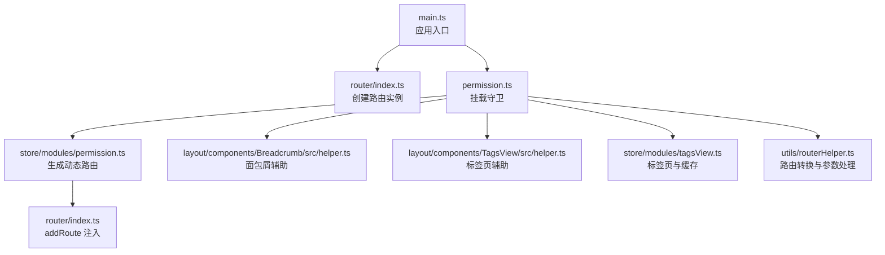
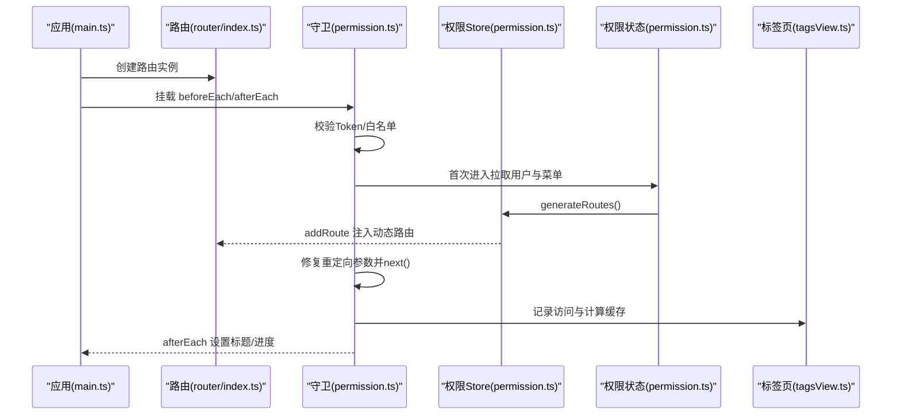
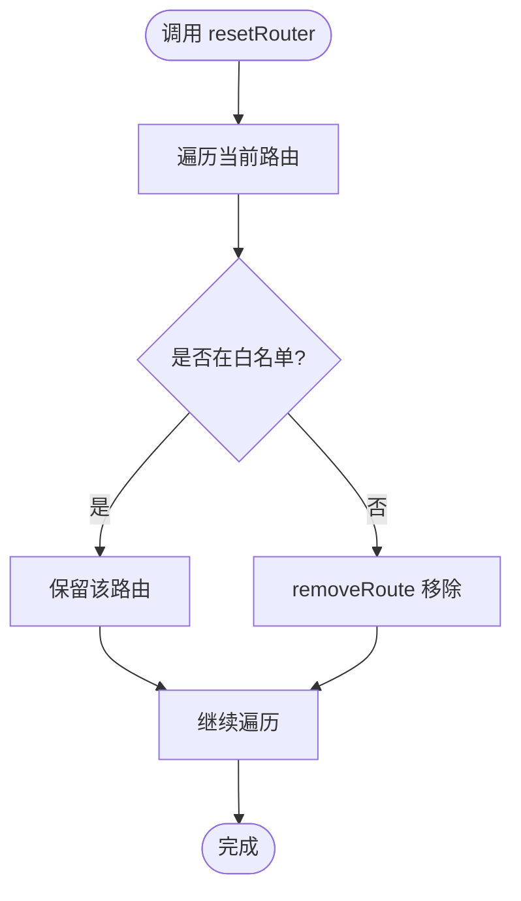
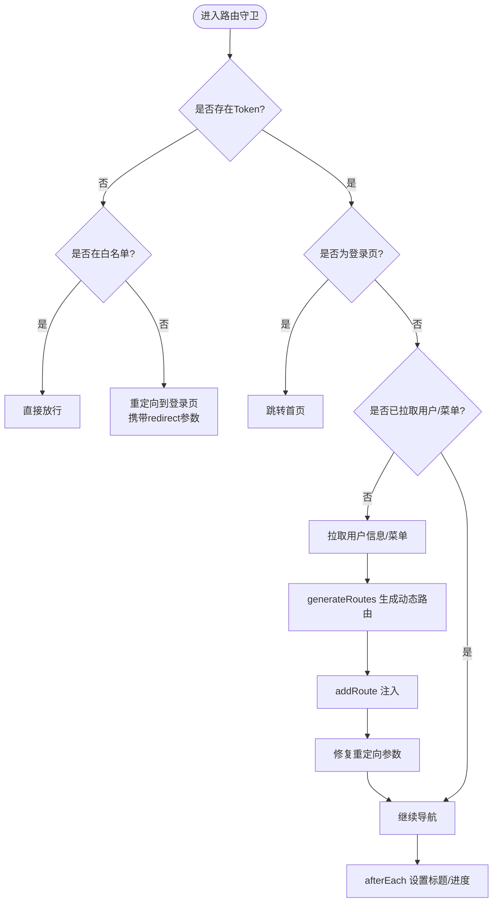
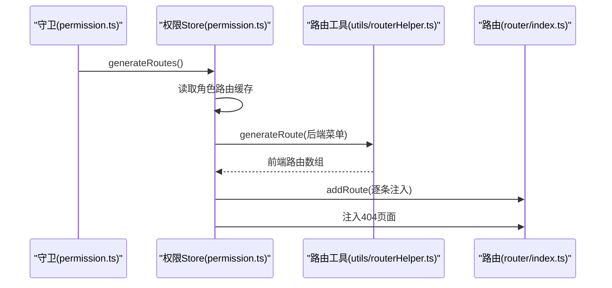
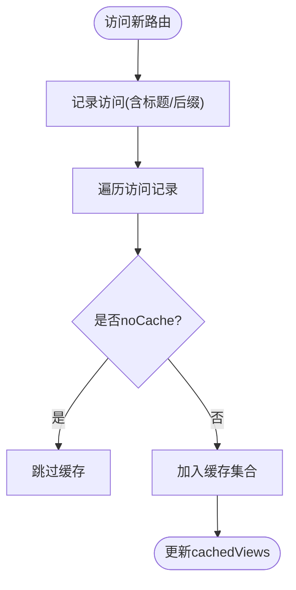
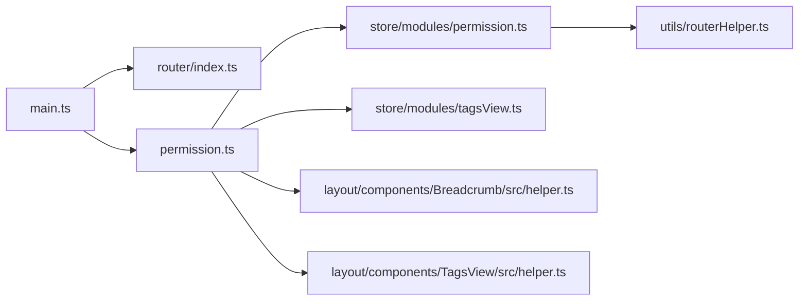

# 路由系统

<cite>
**本文引用的文件**
- [router/index.ts](file://frontend/admin-vue3/src/router/index.ts)
- [permission.ts](file://frontend/admin-vue3/src/permission.ts)
- [main.ts](file://frontend/admin-vue3/src/main.ts)
- [store/modules/permission.ts](file://frontend/admin-vue3/src/store/modules/permission.ts)
- [store/modules/tagsView.ts](file://frontend/admin-vue3/src/store/modules/tagsView.ts)
- [utils/routerHelper.ts](file://frontend/admin-vue3/src/utils/routerHelper.ts)
- [layout/components/Breadcrumb/src/helper.ts](file://frontend/admin-vue3/src/layout/components/Breadcrumb/src/helper.ts)
- [layout/components/TagsView/src/helper.ts](file://frontend/admin-vue3/src/layout/components/TagsView/src/helper.ts)
- [config/axios/service.ts](file://frontend/admin-vue3/src/config/axios/service.ts)
</cite>

## 目录
1. [简介](#简介)
2. [项目结构](#项目结构)
3. [核心组件](#核心组件)
4. [架构总览](#架构总览)
5. [详细组件分析](#详细组件分析)
6. [依赖关系分析](#依赖关系分析)
7. [性能考量](#性能考量)
8. [故障排查指南](#故障排查指南)
9. [结论](#结论)
10. [附录](#附录)

## 简介
本文件系统性梳理基于 Vue Router 的路由体系，覆盖路由配置、动态路由加载与嵌套路由、权限守卫与导航拦截、路由元信息与标题管理、模块化组织与懒加载策略、路由缓存与标签页视图、参数传递与查询字符串处理、以及面包屑导航等关键能力。目标是帮助开发者快速理解并高效扩展该路由系统。

## 项目结构
前端路由相关代码集中在 admin-vue3 前端工程中，采用“入口初始化 + 权限守卫 + 动态路由 + 缓存与标签页 + 工具函数”的分层组织方式：
- 路由入口与历史模式：在路由入口中创建 Router 实例，设置历史模式与滚动行为，并导出重置路由方法。
- 权限守卫：在应用启动时挂载 beforeEach/afterEach 守卫，完成登录态校验、动态路由注入、标题与进度更新。
- 动态路由与菜单：权限状态管理负责生成可访问路由集合，并将其注入到路由器中。
- 标签页与缓存：标签页视图维护访问记录并计算需要缓存的组件名；配合 keep-alive 实现页面缓存。
- 工具函数：路由辅助工具负责将后端菜单转换为前端路由结构、处理参数与查询串、生成命名等。

**图表来源**
- [main.ts:1-86](file://frontend/admin-vue3/src/main.ts#L1-L86)
- [router/index.ts:1-37](file://frontend/admin-vue3/src/router/index.ts#L1-L37)
- [permission.ts:1-108](file://frontend/admin-vue3/src/permission.ts#L1-L108)
- [store/modules/permission.ts:1-71](file://frontend/admin-vue3/src/store/modules/permission.ts#L1-L71)
- [store/modules/tagsView.ts:41-80](file://frontend/admin-vue3/src/store/modules/tagsView.ts#L41-L80)
- [utils/routerHelper.ts:80-111](file://frontend/admin-vue3/src/utils/routerHelper.ts#L80-L111)
- [layout/components/Breadcrumb/src/helper.ts:0-1](file://frontend/admin-vue3/src/layout/components/Breadcrumb/src/helper.ts#L0-L1)
- [layout/components/TagsView/src/helper.ts:0-1](file://frontend/admin-vue3/src/layout/components/TagsView/src/helper.ts#L0-L1)

**章节来源**
- [main.ts:28-39](file://frontend/admin-vue3/src/main.ts#L28-L39)
- [router/index.ts:6-20](file://frontend/admin-vue3/src/router/index.ts#L6-L20)
- [permission.ts:59-107](file://frontend/admin-vue3/src/permission.ts#L59-L107)

## 核心组件
- 路由器实例与历史模式
  - 使用 createWebHistory 并支持 VITE_BASE_PATH 基础路径配置，严格模式开启，滚动行为统一回到顶部。
  - 提供 resetRouter 方法，按白名单保留固定路由，移除其余动态路由，便于登出或角色切换后重建路由。
- 权限守卫
  - beforeEach：校验 Token、白名单放行、首次进入拉取用户与菜单、动态注入路由、修复重定向参数、统一进度与页面加载状态。
  - afterEach：设置页面标题、结束进度与页面加载。
- 动态路由与菜单
  - 权限 Store 生成路由映射，拼接 remaining 固定路由，注入 404 页面，扁平化多级路由以便菜单渲染。
- 标签页与缓存
  - 标签页 Store 维护访问记录，计算需要缓存的组件名集合，结合 keep-alive 实现缓存。
- 路由工具
  - 路由转换：将后端菜单结构转换为前端路由记录，处理顶级非目录路由、命名与重定向。
  - 参数与查询串：解析 URL 查询串，支持动态路由参数透传与重定向修复。

**章节来源**
- [router/index.ts:6-30](file://frontend/admin-vue3/src/router/index.ts#L6-L30)
- [permission.ts:59-107](file://frontend/admin-vue3/src/permission.ts#L59-L107)
- [store/modules/permission.ts:33-61](file://frontend/admin-vue3/src/store/modules/permission.ts#L33-L61)
- [store/modules/tagsView.ts:62-77](file://frontend/admin-vue3/src/store/modules/tagsView.ts#L62-L77)
- [utils/routerHelper.ts:80-111](file://frontend/admin-vue3/src/utils/routerHelper.ts#L80-L111)

## 架构总览
下图展示从应用启动到路由生效的关键流程：入口初始化 -> 安装路由 -> 挂载守卫 -> 动态注入路由 -> 标题与进度更新 -> 标签页与缓存维护。

**图表来源**
- [main.ts:28-39](file://frontend/admin-vue3/src/main.ts#L28-L39)
- [router/index.ts:6-20](file://frontend/admin-vue3/src/router/index.ts#L6-L20)
- [permission.ts:59-107](file://frontend/admin-vue3/src/permission.ts#L59-L107)
- [store/modules/permission.ts:33-61](file://frontend/admin-vue3/src/store/modules/permission.ts#L33-L61)
- [store/modules/tagsView.ts:62-77](file://frontend/admin-vue3/src/store/modules/tagsView.ts#L62-L77)

## 详细组件分析

### 路由器与历史模式
- 历史模式与基座路径
  - 使用 createWebHistory 并读取环境变量 VITE_BASE_PATH，支持部署在子路径场景。
  - 严格模式确保路由匹配更严谨。
- 滚动行为
  - 每次导航滚动到顶部，保证新开标签或返回时滚动位置一致。
- 重置路由
  - 保留固定路由名白名单，移除其余动态路由，用于登出或角色切换后的路由重建。

**图表来源**
- [router/index.ts:22-30](file://frontend/admin-vue3/src/router/index.ts#L22-L30)

**章节来源**
- [router/index.ts:6-20](file://frontend/admin-vue3/src/router/index.ts#L6-L20)
- [router/index.ts:22-30](file://frontend/admin-vue3/src/router/index.ts#L22-L30)

### 权限守卫与导航拦截
- 白名单机制
  - 登录、社交登录、授权回调、绑定、注册、第三方登录等无需登录即可访问。
- 登录态校验
  - 若存在 Token，进入业务分支；否则根据白名单决定放行或重定向至登录页并携带 redirect 参数。
- 首次进入与动态注入
  - 首次进入时异步拉取用户信息与菜单，生成可访问路由并逐条 addRoute 注入。
  - 修复重定向路径与查询参数，避免参数丢失。
- 标题与进度
  - afterEach 中设置页面标题，结束进度与页面加载状态。

**图表来源**
- [permission.ts:59-107](file://frontend/admin-vue3/src/permission.ts#L59-L107)

**章节来源**
- [permission.ts:59-107](file://frontend/admin-vue3/src/permission.ts#L59-L107)

### 动态路由与菜单生成
- 路由生成
  - 从缓存读取角色路由映射，调用 generateRoute 转换为前端路由记录。
  - 将 remaining 固定路由与动态路由拼接，注入 404 页面。
  - 使用 flatMultiLevelRoutes 扁平化多级路由，便于菜单渲染。
- 路由注入
  - 通过 permissionStore.getAddRouters 获取扁平化后的动态路由，逐条 addRoute 注入。

**图表来源**
- [store/modules/permission.ts:33-61](file://frontend/admin-vue3/src/store/modules/permission.ts#L33-L61)
- [utils/routerHelper.ts:80-111](file://frontend/admin-vue3/src/utils/routerHelper.ts#L80-L111)
- [router/index.ts:80-83](file://frontend/admin-vue3/src/permission.ts#L80-L83)

**章节来源**
- [store/modules/permission.ts:33-61](file://frontend/admin-vue3/src/store/modules/permission.ts#L33-L61)
- [utils/routerHelper.ts:80-111](file://frontend/admin-vue3/src/utils/routerHelper.ts#L80-L111)

### 路由元信息与页面标题
- 元信息管理
  - 路由元信息包含标题、隐藏、面包屑、缓存控制等字段，用于菜单、面包屑与缓存策略。
- 标题设置
  - afterEach 中读取 to.meta.title 并设置页面标题，确保每次导航都同步更新。

**章节来源**
- [permission.ts:103-107](file://frontend/admin-vue3/src/permission.ts#L103-L107)

### 路由模块化组织与懒加载
- 模块化组织
  - 路由按功能模块拆分，入口仅引入 remaining 模块，其余动态路由通过权限 Store 生成并注入。
- 懒加载策略
  - 动态路由的组件采用动态导入方式，实现按需加载与代码分割，减少初始包体积。
- 嵌套路由
  - 通过 Layout 包裹顶级路由，形成嵌套结构；对顶级非目录路由自动包裹 Layout 并设置 alwaysShow。

**章节来源**
- [router/index.ts:4](file://frontend/admin-vue3/src/router/index.ts#L4)
- [store/modules/permission.ts:49-56](file://frontend/admin-vue3/src/store/modules/permission.ts#L49-L56)
- [utils/routerHelper.ts:101-111](file://frontend/admin-vue3/src/utils/routerHelper.ts#L101-L111)

### 路由缓存机制与标签页
- 标签页记录
  - 访问记录包含标题与标题后缀，避免同路径多实例标题冲突。
- 缓存计算
  - 遍历访问记录，提取未标记 noCache 的路由名称，去重后形成缓存集合。
- 与 keep-alive 配合
  - 标签页 Store 维护 cachedViews，结合组件的 keep-alive 属性实现页面缓存。

**图表来源**
- [store/modules/tagsView.ts:41-77](file://frontend/admin-vue3/src/store/modules/tagsView.ts#L41-L77)

**章节来源**
- [store/modules/tagsView.ts:41-77](file://frontend/admin-vue3/src/store/modules/tagsView.ts#L41-L77)

### 路由参数传递、查询字符串与重定向修复
- 参数解析
  - 自定义 parseURL 支持从 URL 中解析 basePath 与查询参数对象，便于重定向时修复参数。
- 重定向修复
  - 从 from.query.redirect 或 to.path 获取重定向路径，解码并解析查询串，确保 next 时携带正确参数。
- 查询串处理
  - 在动态路由注入时，若组件声明包含查询串，会解析并写入 meta.query，供页面组件使用。

**章节来源**
- [permission.ts:16-47](file://frontend/admin-vue3/src/permission.ts#L16-L47)
- [permission.ts:84-89](file://frontend/admin-vue3/src/permission.ts#L84-L89)
- [utils/routerHelper.ts:80-86](file://frontend/admin-vue3/src/utils/routerHelper.ts#L80-L86)

### 面包屑导航与页面标题管理
- 面包屑
  - 面包屑辅助工具依赖路由元信息与路径解析，生成层级导航。
- 页面标题
  - 守卫 afterEach 中统一设置标题，确保与路由元信息保持一致。

**章节来源**
- [layout/components/Breadcrumb/src/helper.ts:0-1](file://frontend/admin-vue3/src/layout/components/Breadcrumb/src/helper.ts#L0-L1)
- [permission.ts:103-107](file://frontend/admin-vue3/src/permission.ts#L103-L107)

## 依赖关系分析
- 入口依赖
  - main.ts 依赖 router 与 permission，先安装路由再挂载守卫。
- 守卫依赖
  - permission.ts 依赖用户、字典、权限 Store，以及 axios 服务判断重新登录。
- 动态路由依赖
  - permission.ts 依赖 permission.ts 生成动态路由并注入。
- 标签页依赖
  - tagsView.ts 依赖 visitedViews 与 keep-alive 缓存策略。

**图表来源**
- [main.ts:28-39](file://frontend/admin-vue3/src/main.ts#L28-L39)
- [permission.ts:1-11](file://frontend/admin-vue3/src/permission.ts#L1-L11)
- [store/modules/permission.ts:1-6](file://frontend/admin-vue3/src/store/modules/permission.ts#L1-L6)
- [utils/routerHelper.ts:80-111](file://frontend/admin-vue3/src/utils/routerHelper.ts#L80-L111)
- [store/modules/tagsView.ts:62-77](file://frontend/admin-vue3/src/store/modules/tagsView.ts#L62-L77)
- [layout/components/Breadcrumb/src/helper.ts:0-1](file://frontend/admin-vue3/src/layout/components/Breadcrumb/src/helper.ts#L0-L1)
- [layout/components/TagsView/src/helper.ts:0-1](file://frontend/admin-vue3/src/layout/components/TagsView/src/helper.ts#L0-L1)

**章节来源**
- [main.ts:28-39](file://frontend/admin-vue3/src/main.ts#L28-L39)
- [permission.ts:1-11](file://frontend/admin-vue3/src/permission.ts#L1-L11)

## 性能考量
- 懒加载与代码分割
  - 动态路由组件采用动态导入，减少首屏加载体积。
- 路由扁平化
  - 多级路由扁平化后注入，降低菜单渲染与导航复杂度。
- 缓存策略
  - 标签页缓存仅针对未标记 noCache 的路由，避免不必要的缓存占用。
- 滚动行为
  - 每次导航滚动到顶部，减少跨页面滚动状态干扰。

[本节为通用建议，无需特定文件引用]

## 故障排查指南
- 登录后无法进入业务页
  - 检查 Token 是否存在与有效；确认首次进入是否成功拉取用户与菜单；查看 generateRoutes 是否成功注入。
- 重定向丢失参数
  - 检查 parseURL 与重定向修复逻辑，确保 redirect 参数被正确解码与透传。
- 动态路由未生效
  - 确认 permissionStore.getAddRouters 是否包含目标路由；确认 addRoute 是否被调用。
- 标签页不缓存
  - 检查路由 meta.noCache 标记；确认 cachedViews 是否包含对应路由名称。
- 登录态失效导致循环重定向
  - 检查 axios 服务中的 resetRouter 调用与路由守卫逻辑，确保 Token 清理后再次进入守卫。

**章节来源**
- [permission.ts:59-107](file://frontend/admin-vue3/src/permission.ts#L59-L107)
- [store/modules/permission.ts:33-61](file://frontend/admin-vue3/src/store/modules/permission.ts#L33-L61)
- [store/modules/tagsView.ts:62-77](file://frontend/admin-vue3/src/store/modules/tagsView.ts#L62-L77)
- [config/axios/service.ts:266](file://frontend/admin-vue3/src/config/axios/service.ts#L266)

## 结论
该路由系统以 Vue Router 为核心，结合权限守卫、动态路由注入、标签页与缓存策略，形成了完整的前端路由解决方案。通过模块化组织与懒加载，兼顾了可维护性与性能。建议在扩展新功能时遵循现有模式：后端菜单 → 路由转换 → 动态注入 → 标签页与缓存联动，并在守卫中统一处理标题与进度。

[本节为总结，无需特定文件引用]

## 附录
- 最佳实践
  - 路由元信息：统一维护 title、hidden、breadcrumb、noCache 等字段。
  - 动态路由：优先使用动态导入组件，避免一次性加载过多资源。
  - 重定向：始终使用 parseURL 修复参数，确保 next 时携带完整查询串。
  - 缓存：谨慎使用 noCache，避免重要页面频繁重复请求。
  - 标题：afterEach 中统一设置，避免页面内手动修改导致不同步。

[本节为通用建议，无需特定文件引用]