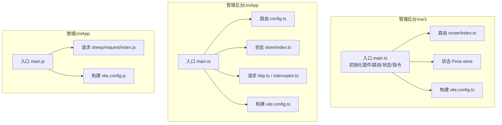
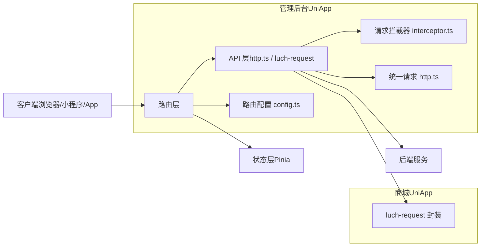
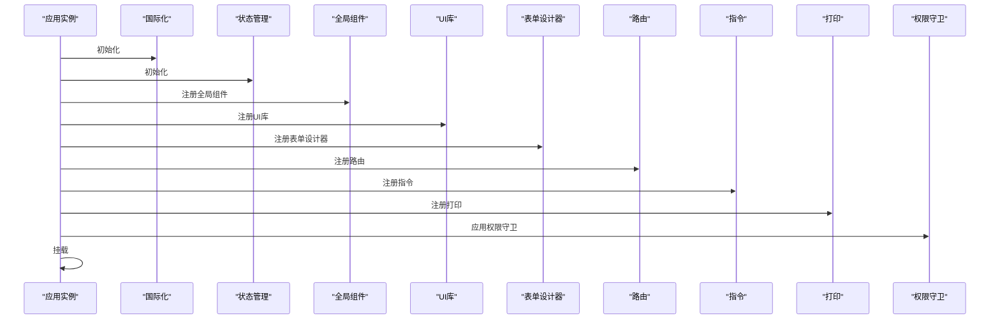
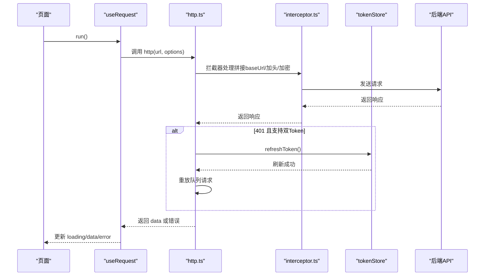
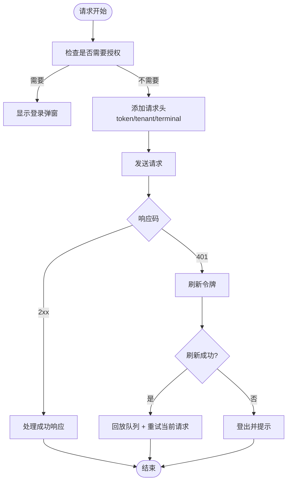
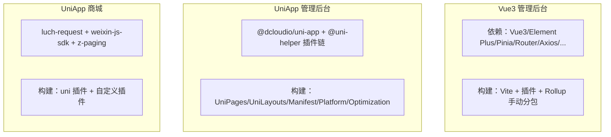

# 前端应用架构

<cite>
**本文档引用的文件**
- [frontend/admin-vue3/package.json](file://frontend/admin-vue3/package.json)
- [frontend/admin-vue3/vite.config.ts](file://frontend/admin-vue3/vite.config.ts)
- [frontend/admin-vue3/src/main.ts](file://frontend/admin-vue3/src/main.ts)
- [frontend/admin-vue3/src/router/index.ts](file://frontend/admin-vue3/src/router/index.ts)
- [frontend/admin-uniapp/package.json](file://frontend/admin-uniapp/package.json)
- [frontend/admin-uniapp/vite.config.ts](file://frontend/admin-uniapp/vite.config.ts)
- [frontend/admin-uniapp/src/main.ts](file://frontend/admin-uniapp/src/main.ts)
- [frontend/admin-uniapp/src/router/config.ts](file://frontend/admin-uniapp/src/router/config.ts)
- [frontend/admin-uniapp/src/store/index.ts](file://frontend/admin-uniapp/src/store/index.ts)
- [frontend/admin-uniapp/src/http/http.ts](file://frontend/admin-uniapp/src/http/http.ts)
- [frontend/admin-uniapp/src/http/interceptor.ts](file://frontend/admin-uniapp/src/http/interceptor.ts)
- [frontend/admin-uniapp/src/hooks/useRequest.ts](file://frontend/admin-uniapp/src/hooks/useRequest.ts)
- [frontend/mall-uniapp/package.json](file://frontend/mall-uniapp/package.json)
- [frontend/mall-uniapp/vite.config.js](file://frontend/mall-uniapp/vite.config.js)
- [frontend/mall-uniapp/main.js](file://frontend/mall-uniapp/main.js)
- [frontend/mall-uniapp/sheep/request/index.js](file://frontend/mall-uniapp/sheep/request/index.js)
</cite>

## 目录
1. [简介](#简介)
2. [项目结构](#项目结构)
3. [核心组件](#核心组件)
4. [架构总览](#架构总览)
5. [详细组件分析](#详细组件分析)
6. [依赖关系分析](#依赖关系分析)
7. [性能考量](#性能考量)
8. [故障排查指南](#故障排查指南)
9. [结论](#结论)
10. [附录](#附录)

## 简介
本文件面向前端团队，系统性梳理管理后台（Vue3 + Element Plus）与移动端应用（UniApp）的前端架构，覆盖技术栈选择、组件库与UI策略、路由与状态管理、多端适配、性能优化、用户体验设计原则、API封装与错误处理、开发与构建部署流程。目标是帮助开发者快速上手并高效扩展功能。

## 项目结构
- 管理后台（Vue3 + Element Plus）
  - 技术栈：Vue3、Vite5、TypeScript、Element Plus、Pinia、Vue Router、UnoCSS、ESLint/Prettier/Stylelint
  - 构建与开发：通过 Vite 配置与脚本进行本地开发、多环境构建与预览
  - 应用入口：在入口中集中初始化国际化、状态管理、全局组件、UI库、路由、指令、打印、富文本等
- 移动端应用（UniApp）
  - 技术栈：Vue3、Vite、Pinia、uni-app、UnoCSS、AutoImport、Components、Pages/Layouts/Manifest 插件
  - 多端适配：通过 @uni-helper 系列插件实现页面、布局、清单、平台差异化配置
  - 请求与拦截：基于 uni.request 的统一请求封装与拦截器，支持双 Token 无感刷新、加密传输、多端代理
- 商城（UniApp）示例
  - 技术栈：Vue3、Vite、luch-request、Pinia、weixin-js-sdk、z-paging 等
  - 请求与拦截：内置请求拦截器、加载控制、401 刷新令牌、错误提示与重试队列

图表来源
- [frontend/admin-vue3/src/main.ts:1-86](file://frontend/admin-vue3/src/main.ts#L1-L86)
- [frontend/admin-vue3/src/router/index.ts:1-37](file://frontend/admin-vue3/src/router/index.ts#L1-L37)
- [frontend/admin-uniapp/src/main.ts:1-20](file://frontend/admin-uniapp/src/main.ts#L1-L20)
- [frontend/admin-uniapp/src/router/config.ts:1-46](file://frontend/admin-uniapp/src/router/config.ts#L1-L46)
- [frontend/admin-uniapp/src/store/index.ts:1-23](file://frontend/admin-uniapp/src/store/index.ts#L1-L23)
- [frontend/admin-uniapp/src/http/http.ts:1-224](file://frontend/admin-uniapp/src/http/http.ts#L1-L224)
- [frontend/mall-uniapp/main.js:1-16](file://frontend/mall-uniapp/main.js#L1-L16)
- [frontend/mall-uniapp/sheep/request/index.js:1-311](file://frontend/mall-uniapp/sheep/request/index.js#L1-L311)

章节来源
- [frontend/admin-vue3/package.json:1-160](file://frontend/admin-vue3/package.json#L1-L160)
- [frontend/admin-vue3/vite.config.ts:1-89](file://frontend/admin-vue3/vite.config.ts#L1-L89)
- [frontend/admin-uniapp/package.json:1-194](file://frontend/admin-uniapp/package.json#L1-L194)
- [frontend/admin-uniapp/vite.config.ts:1-214](file://frontend/admin-uniapp/vite.config.ts#L1-L214)
- [frontend/mall-uniapp/package.json:1-104](file://frontend/mall-uniapp/package.json#L1-L104)
- [frontend/mall-uniapp/vite.config.js:1-35](file://frontend/mall-uniapp/vite.config.js#L1-L35)

## 核心组件
- 管理后台（Vue3）
  - 入口初始化：国际化、全局组件、Element Plus、表单设计器、路由、指令、打印、富文本、权限守卫、统计
  - 路由：基于 History 模式，统一滚动行为，提供重置路由能力
  - 构建：按需拆分大体积依赖（如 ECharts、form-create），开启 Terser 压缩与 SourceMap 控制
- 管理后台（UniApp）
  - 入口：SSR App 工厂，注入 store、路由拦截器、请求拦截器
  - 路由：登录策略、登录页/404/仅PC提示等路径配置，支持小程序/H5/App 多端差异化
  - 状态：Pinia + 持久化插件，统一存储实现
  - 请求：统一 http 封装，支持双 Token 无感刷新、响应解密、错误提示、超时控制
  - Hook：useRequest 钩子，统一 loading/error/data/run 流程
- 商城（UniApp）
  - 入口：SSR App 工厂，初始化 Pinia
  - 请求：luch-request 封装，内置拦截器、加载控制、401 刷新令牌、错误提示与队列回放

章节来源
- [frontend/admin-vue3/src/main.ts:1-86](file://frontend/admin-vue3/src/main.ts#L1-L86)
- [frontend/admin-vue3/src/router/index.ts:1-37](file://frontend/admin-vue3/src/router/index.ts#L1-L37)
- [frontend/admin-uniapp/src/main.ts:1-20](file://frontend/admin-uniapp/src/main.ts#L1-L20)
- [frontend/admin-uniapp/src/router/config.ts:1-46](file://frontend/admin-uniapp/src/router/config.ts#L1-L46)
- [frontend/admin-uniapp/src/store/index.ts:1-23](file://frontend/admin-uniapp/src/store/index.ts#L1-L23)
- [frontend/admin-uniapp/src/http/http.ts:1-224](file://frontend/admin-uniapp/src/http/http.ts#L1-L224)
- [frontend/admin-uniapp/src/hooks/useRequest.ts:1-55](file://frontend/admin-uniapp/src/hooks/useRequest.ts#L1-L55)
- [frontend/mall-uniapp/main.js:1-16](file://frontend/mall-uniapp/main.js#L1-L16)
- [frontend/mall-uniapp/sheep/request/index.js:1-311](file://frontend/mall-uniapp/sheep/request/index.js#L1-L311)

## 架构总览
- 多端适配策略
  - 管理后台（UniApp）：通过 @uni-helper 插件链实现页面、布局、清单、平台的自动化与差异化；支持分包优化与异步跨包调用
  - 管理后台（Vue3）：H5 端通过 Vite 代理与环境变量控制跨域；其他端走构建产物
  - 商城（UniApp）：通过 luch-request 与平台差异宏指令实现多端一致的请求体验
- 组件库与UI
  - 管理后台（Vue3）：Element Plus + 自定义主题与 UnoCSS
  - 管理后台（UniApp）：Wot Design Uni + UnoCSS + 组件自动导入
- 状态管理
  - 管理后台（Vue3）：Pinia（持久化可选）
  - 管理后台（UniApp）：Pinia + 持久化至 uni.storage
  - 商城（UniApp）：sheep/store + Pinia
- API 与错误处理
  - 管理后台（UniApp）：统一 http 封装 + 拦截器，支持双 Token 无感刷新、响应解密、错误提示
  - 商城（UniApp）：luch-request 拦截器，内置 401 刷新令牌、加载控制、错误提示与队列回放

图表来源
- [frontend/admin-uniapp/src/router/config.ts:1-46](file://frontend/admin-uniapp/src/router/config.ts#L1-L46)
- [frontend/admin-uniapp/src/http/interceptor.ts:1-105](file://frontend/admin-uniapp/src/http/interceptor.ts#L1-L105)
- [frontend/admin-uniapp/src/http/http.ts:1-224](file://frontend/admin-uniapp/src/http/http.ts#L1-L224)
- [frontend/mall-uniapp/sheep/request/index.js:1-311](file://frontend/mall-uniapp/sheep/request/index.js#L1-L311)

## 详细组件分析

### 管理后台（Vue3）组件分析
- 入口初始化流程
  - 顺序：国际化 → 状态管理 → 全局组件 → UI库 → 表单设计器 → 路由 → 指令 → 富文本 → 打印 → 权限守卫 → 统计
  - 作用：确保应用启动时各插件按需初始化，避免运行时缺失
- 路由与滚动行为
  - History 模式，统一滚动到顶部，提升多标签切换体验
  - 提供重置路由能力，便于动态权限场景
- 构建优化
  - 依赖拆分：将 ECharts、form-create、form-designer 独立打包，降低首屏体积
  - Terser 压缩与条件 SourceMap，兼顾可调试与体积

图表来源
- [frontend/admin-vue3/src/main.ts:1-86](file://frontend/admin-vue3/src/main.ts#L1-L86)

章节来源
- [frontend/admin-vue3/src/main.ts:1-86](file://frontend/admin-vue3/src/main.ts#L1-L86)
- [frontend/admin-vue3/src/router/index.ts:1-37](file://frontend/admin-vue3/src/router/index.ts#L1-L37)
- [frontend/admin-vue3/vite.config.ts:65-86](file://frontend/admin-vue3/vite.config.ts#L65-L86)

### 管理后台（UniApp）组件分析
- 入口与拦截器
  - SSR App 工厂，注入 store、路由拦截器、请求拦截器，保证多端一致性
- 路由配置
  - 登录策略：白名单/黑名单两种策略，支持默认需要登录
  - 登录页/注册页/短信登录/忘记密码/404/仅PC提示等路径集中管理
- 状态管理
  - Pinia + 持久化插件，存储实现统一使用 uni.get/setStorageSync
- 请求与拦截
  - 统一 http 封装：支持 GET/POST/PUT/DELETE，原生 uni.request
  - 拦截器：拼接 baseUrl、超时、白名单、Authorization、租户头、API 加密
  - 双 Token 无感刷新：401 时排队重试，刷新成功后批量回放
  - 响应解密：根据响应头判断是否需要解密
- Hook：useRequest
  - 统一 loading/error/data/run，支持 immediate 立即执行

图表来源
- [frontend/admin-uniapp/src/hooks/useRequest.ts:1-55](file://frontend/admin-uniapp/src/hooks/useRequest.ts#L1-L55)
- [frontend/admin-uniapp/src/http/http.ts:1-224](file://frontend/admin-uniapp/src/http/http.ts#L1-L224)
- [frontend/admin-uniapp/src/http/interceptor.ts:1-105](file://frontend/admin-uniapp/src/http/interceptor.ts#L1-L105)

章节来源
- [frontend/admin-uniapp/src/main.ts:1-20](file://frontend/admin-uniapp/src/main.ts#L1-L20)
- [frontend/admin-uniapp/src/router/config.ts:1-46](file://frontend/admin-uniapp/src/router/config.ts#L1-L46)
- [frontend/admin-uniapp/src/store/index.ts:1-23](file://frontend/admin-uniapp/src/store/index.ts#L1-L23)
- [frontend/admin-uniapp/src/http/http.ts:1-224](file://frontend/admin-uniapp/src/http/http.ts#L1-L224)
- [frontend/admin-uniapp/src/http/interceptor.ts:1-105](file://frontend/admin-uniapp/src/http/interceptor.ts#L1-L105)
- [frontend/admin-uniapp/src/hooks/useRequest.ts:1-55](file://frontend/admin-uniapp/src/hooks/useRequest.ts#L1-L55)

### 商城（UniApp）组件分析
- 入口与状态
  - SSR App 工厂，初始化 sheep/store
- 请求封装
  - luch-request：统一 baseURL、超时、请求头、平台标识、租户头
  - 拦截器：登录授权、loading 控制、401 刷新令牌、错误提示、成功提示
  - 队列回放：刷新令牌期间排队请求，成功后统一回放

图表来源
- [frontend/mall-uniapp/sheep/request/index.js:1-311](file://frontend/mall-uniapp/sheep/request/index.js#L1-L311)

章节来源
- [frontend/mall-uniapp/main.js:1-16](file://frontend/mall-uniapp/main.js#L1-L16)
- [frontend/mall-uniapp/sheep/request/index.js:1-311](file://frontend/mall-uniapp/sheep/request/index.js#L1-L311)

## 依赖关系分析
- 管理后台（Vue3）
  - 依赖：Vue3、Element Plus、Pinia、Vue Router、Axios、Day.js、ECharts、Vue I18n、UnoCSS、ESLint/Prettier/Stylelint
  - 构建：Vite 插件链、optimizeDeps、Rollup 手动分包
- 管理后台（UniApp）
  - 依赖：uni-app、Pinia、Vue Router、wot-design-uni、z-paging、UnoCSS、@uni-helper 系列插件
  - 构建：UniPages/UniLayouts/UniManifest/UniPlatform/Optimization/Components/AutoImport/ViteRestart/Visualizer
- 商城（UniApp）
  - 依赖：luch-request、Pinia、weixin-js-sdk、dayjs、lodash、z-paging
  - 构建：uni 插件、uni-read-pages-v3、mplive-manifest-plugin

图表来源
- [frontend/admin-vue3/package.json:27-84](file://frontend/admin-vue3/package.json#L27-L84)
- [frontend/admin-vue3/vite.config.ts:42-86](file://frontend/admin-vue3/vite.config.ts#L42-L86)
- [frontend/admin-uniapp/package.json:99-127](file://frontend/admin-uniapp/package.json#L99-L127)
- [frontend/admin-uniapp/vite.config.ts:67-164](file://frontend/admin-uniapp/vite.config.ts#L67-L164)
- [frontend/mall-uniapp/package.json:90-98](file://frontend/mall-uniapp/package.json#L90-L98)
- [frontend/mall-uniapp/vite.config.js:10-35](file://frontend/mall-uniapp/vite.config.js#L10-L35)

章节来源
- [frontend/admin-vue3/package.json:1-160](file://frontend/admin-vue3/package.json#L1-L160)
- [frontend/admin-uniapp/package.json:1-194](file://frontend/admin-uniapp/package.json#L1-L194)
- [frontend/mall-uniapp/package.json:1-104](file://frontend/mall-uniapp/package.json#L1-L104)

## 性能考量
- 代码分割与懒加载
  - Vue3 管理后台：对 ECharts、form-create、form-designer 独立打包，减少首屏依赖
  - UniApp 管理后台：通过 @uni-helper 的 Optimization 插件进行分包优化、异步跨包调用与组件异步引用
- 构建与压缩
  - Vue3：Terser 压缩、可选 SourceMap、条件 drop console/debugger
  - UniApp：按环境选择 minify（开发不压缩、生产使用 esbuild）
- 请求层面
  - 管理后台（UniApp）：双 Token 无感刷新，避免重复登录带来的抖动
  - 商城（UniApp）：401 刷新令牌队列回放，提升弱网与并发场景稳定性
- 缓存与持久化
  - 管理后台（UniApp）：Pinia 持久化至 uni.storage，减少重复登录成本
- 图标与样式
  - 使用 UnoCSS 与 SVG 图标按需加载，减少无关资源

章节来源
- [frontend/admin-vue3/vite.config.ts:65-86](file://frontend/admin-vue3/vite.config.ts#L65-L86)
- [frontend/admin-uniapp/vite.config.ts:84-94](file://frontend/admin-uniapp/vite.config.ts#L84-L94)
- [frontend/admin-uniapp/src/http/http.ts:52-112](file://frontend/admin-uniapp/src/http/http.ts#L52-L112)
- [frontend/mall-uniapp/sheep/request/index.js:222-275](file://frontend/mall-uniapp/sheep/request/index.js#L222-L275)

## 故障排查指南
- 登录与鉴权
  - 管理后台（UniApp）：登录策略配置、登录页路径、404/仅PC提示页面路径
  - 商城（UniApp）：/member/auth/ 登录接口自动写入令牌，401 统一处理
- 请求失败与超时
  - 管理后台（UniApp）：拦截器统一拼接 baseUrl、白名单、超时 60s；H5 端支持代理前缀
  - 商城（UniApp）：统一错误提示、网络状态检测、不同错误码对应文案
- 401 与令牌刷新
  - 管理后台（UniApp）：双 Token 无感刷新，刷新失败跳转登录页
  - 商城（UniApp）：刷新失败统一登出并弹出登录弹窗
- 多端差异
  - 管理后台（UniApp）：H5 端代理开关、平台宏指令、分包与异步组件
  - 商城（UniApp）：平台标识、证书校验（APP）、H5 凭证开关

章节来源
- [frontend/admin-uniapp/src/router/config.ts:1-46](file://frontend/admin-uniapp/src/router/config.ts#L1-L46)
- [frontend/admin-uniapp/src/http/interceptor.ts:1-105](file://frontend/admin-uniapp/src/http/interceptor.ts#L1-L105)
- [frontend/admin-uniapp/src/http/http.ts:14-152](file://frontend/admin-uniapp/src/http/http.ts#L14-L152)
- [frontend/mall-uniapp/sheep/request/index.js:112-220](file://frontend/mall-uniapp/sheep/request/index.js#L112-L220)

## 结论
本架构以“多端同构、统一请求、状态持久化、按需构建”为核心，结合 @uni-helper 插件链实现 UniApp 的高可维护性与高性能；Vue3 管理后台强调工程化与可扩展性，通过插件化初始化与构建优化保障开发效率与运行性能。建议在后续迭代中持续完善错误监控、埋点与国际化扩展，保持多端一致的用户体验。

## 附录
- 开发与构建
  - 管理后台（Vue3）：dev/build/test/prod 多环境脚本，TypeScript 类型检查，ESLint/Prettier/Stylelint
  - 管理后台（UniApp）：dev/build 多端命令、H5 代理、分包优化、打包分析
  - 商城（UniApp）：uni 插件、自定义 pages 读取与 manifest 插件
- 样式与主题
  - UnoCSS 与 SCSS 变量，组件级样式隔离与主题定制
- 部署建议
  - H5 端：静态资源 CDN + Gzip/Brotli 压缩；代理仅开发阶段使用
  - 小程序/App：按平台要求配置域名与安全策略；分包体积与首屏加载优先

章节来源
- [frontend/admin-vue3/package.json:7-26](file://frontend/admin-vue3/package.json#L7-L26)
- [frontend/admin-vue3/vite.config.ts:24-86](file://frontend/admin-vue3/vite.config.ts#L24-L86)
- [frontend/admin-uniapp/package.json:29-98](file://frontend/admin-uniapp/package.json#L29-L98)
- [frontend/admin-uniapp/vite.config.ts:33-214](file://frontend/admin-uniapp/vite.config.ts#L33-L214)
- [frontend/mall-uniapp/package.json:1-104](file://frontend/mall-uniapp/package.json#L1-L104)
- [frontend/mall-uniapp/vite.config.js:10-35](file://frontend/mall-uniapp/vite.config.js#L10-L35)