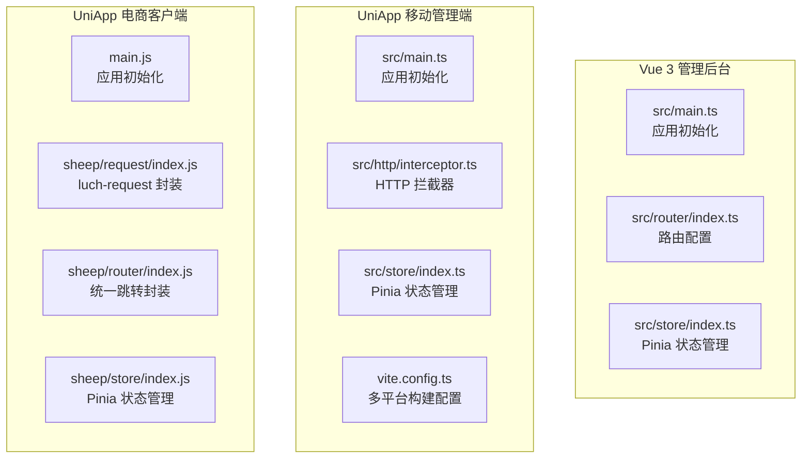
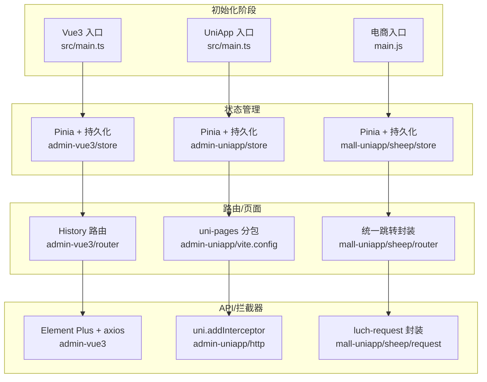
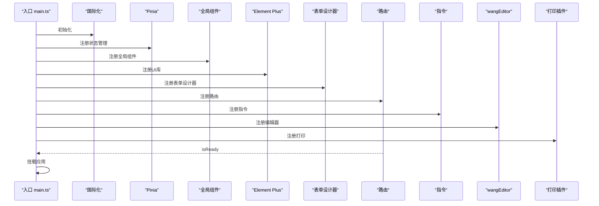
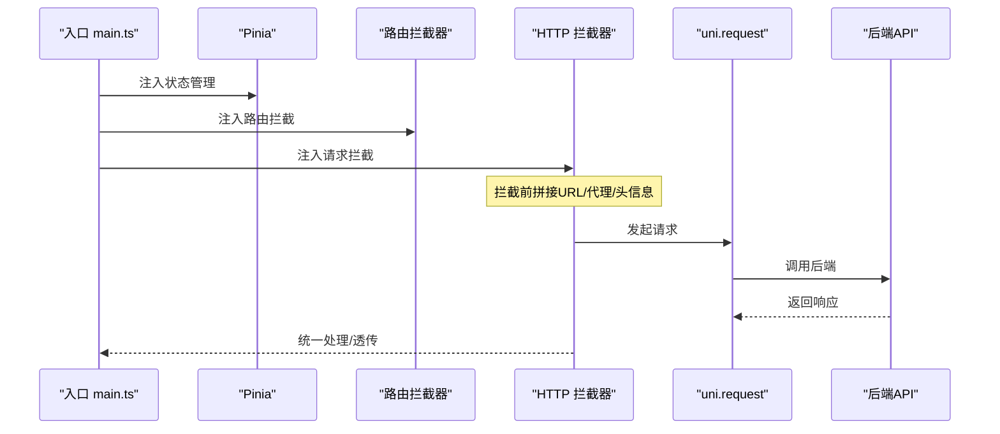
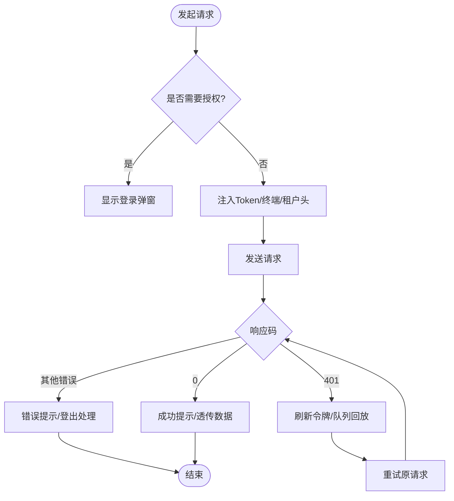
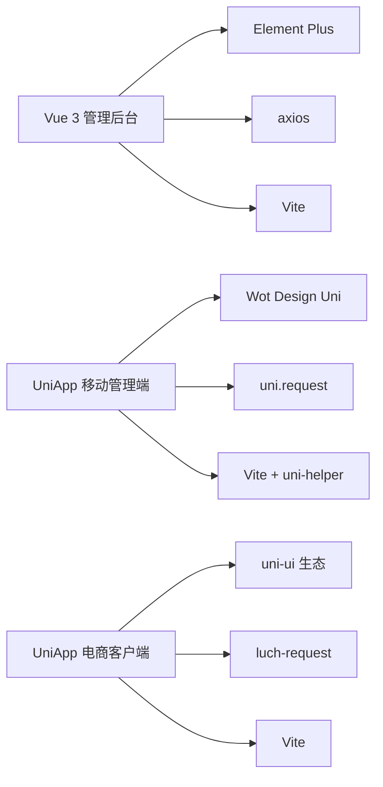

# 前端应用架构

<cite>
**本文档引用的文件**
- [frontend/admin-vue3/package.json](file://frontend/admin-vue3/package.json)
- [frontend/admin-vue3/vite.config.ts](file://frontend/admin-vue3/vite.config.ts)
- [frontend/admin-vue3/src/main.ts](file://frontend/admin-vue3/src/main.ts)
- [frontend/admin-vue3/src/router/index.ts](file://frontend/admin-vue3/src/router/index.ts)
- [frontend/admin-vue3/src/store/index.ts](file://frontend/admin-vue3/src/store/index.ts)
- [frontend/admin-uniapp/package.json](file://frontend/admin-uniapp/package.json)
- [frontend/admin-uniapp/vite.config.ts](file://frontend/admin-uniapp/vite.config.ts)
- [frontend/admin-uniapp/src/main.ts](file://frontend/admin-uniapp/src/main.ts)
- [frontend/admin-uniapp/src/http/interceptor.ts](file://frontend/admin-uniapp/src/http/interceptor.ts)
- [frontend/admin-uniapp/src/store/index.ts](file://frontend/admin-uniapp/src/store/index.ts)
- [frontend/mall-uniapp/package.json](file://frontend/mall-uniapp/package.json)
- [frontend/mall-uniapp/main.js](file://frontend/mall-uniapp/main.js)
- [frontend/mall-uniapp/sheep/request/index.js](file://frontend/mall-uniapp/sheep/request/index.js)
- [frontend/mall-uniapp/sheep/router/index.js](file://frontend/mall-uniapp/sheep/router/index.js)
- [frontend/mall-uniapp/sheep/store/index.js](file://frontend/mall-uniapp/sheep/store/index.js)
</cite>

## 目录
1. [引言](#引言)
2. [项目结构](#项目结构)
3. [核心组件](#核心组件)
4. [架构总览](#架构总览)
5. [详细组件分析](#详细组件分析)
6. [依赖关系分析](#依赖关系分析)
7. [性能考虑](#性能考虑)
8. [故障排查指南](#故障排查指南)
9. [结论](#结论)
10. [附录](#附录)

## 引言
本文件面向前端团队与技术管理者，系统性梳理并文档化三个前端应用的架构设计与实现要点：Vue 3 管理后台、UniApp 移动管理端、UniApp 电商客户端。内容涵盖应用初始化流程、构建配置、部署策略、组件库与UI生态、状态管理模式（Pinia）、路由配置、API 集成与HTTP拦截器、认证与鉴权机制、移动端适配与响应式设计、用户体验优化、开发规范与性能优化建议。

## 项目结构
三个前端应用采用“多入口、多平台”的工程化组织方式：
- Vue 3 管理后台：基于 Vite + Vue 3 + Element Plus + TypeScript，强调桌面端管理场景的高交互与可视化能力。
- UniApp 移动管理端：基于 uni-app 3.x，统一开发多端（H5/小程序/App），强调跨平台一致性与原生体验。
- UniApp 电商客户端：以“Shopro”为基础的电商模板，强调商品、订单、支付、会员等业务闭环与移动端体验。

图表来源
- [frontend/admin-vue3/src/main.ts:1-86](file://frontend/admin-vue3/src/main.ts#L1-L86)
- [frontend/admin-vue3/src/router/index.ts:1-37](file://frontend/admin-vue3/src/router/index.ts#L1-L37)
- [frontend/admin-vue3/src/store/index.ts:1-13](file://frontend/admin-vue3/src/store/index.ts#L1-L13)
- [frontend/admin-uniapp/src/main.ts:1-20](file://frontend/admin-uniapp/src/main.ts#L1-L20)
- [frontend/admin-uniapp/src/http/interceptor.ts:1-105](file://frontend/admin-uniapp/src/http/interceptor.ts#L1-L105)
- [frontend/admin-uniapp/src/store/index.ts:1-23](file://frontend/admin-uniapp/src/store/index.ts#L1-L23)
- [frontend/admin-uniapp/vite.config.ts:1-214](file://frontend/admin-uniapp/vite.config.ts#L1-L214)
- [frontend/mall-uniapp/main.js:1-16](file://frontend/mall-uniapp/main.js#L1-L16)
- [frontend/mall-uniapp/sheep/request/index.js:1-311](file://frontend/mall-uniapp/sheep/request/index.js#L1-L311)
- [frontend/mall-uniapp/sheep/router/index.js:1-204](file://frontend/mall-uniapp/sheep/router/index.js#L1-L204)
- [frontend/mall-uniapp/sheep/store/index.js:1-21](file://frontend/mall-uniapp/sheep/store/index.js#L1-L21)

章节来源
- [frontend/admin-vue3/package.json:1-160](file://frontend/admin-vue3/package.json#L1-L160)
- [frontend/admin-vue3/vite.config.ts:1-89](file://frontend/admin-vue3/vite.config.ts#L1-L89)
- [frontend/admin-uniapp/package.json:1-194](file://frontend/admin-uniapp/package.json#L1-L194)
- [frontend/admin-uniapp/vite.config.ts:1-214](file://frontend/admin-uniapp/vite.config.ts#L1-L214)
- [frontend/mall-uniapp/package.json:1-104](file://frontend/mall-uniapp/package.json#L1-L104)

## 核心组件
- 应用初始化与插件装配
  - Vue 3 管理后台：在入口集中初始化国际化、状态管理、全局组件、Element Plus、表单设计器、路由、指令、打印插件等，确保启动顺序与依赖注入一致。
  - UniApp 移动管理端：在入口集中注入 Pinia、路由拦截器、HTTP 拦截器，保证跨端一致的拦截链路。
  - 电商客户端：在入口集中注入 Pinia，统一状态管理，便于后续按模块扩展。
- 状态管理（Pinia）
  - Vue 3 管理后台：创建 Pinia 实例并启用持久化插件，结合 SSR 场景下的初始化策略。
  - UniApp 移动管理端：创建 Pinia 实例并启用持久化插件，明确存储介质为 uni 存储，提前激活实例以避免白屏。
  - 电商客户端：通过自动扫描注册模块的方式，统一注入 Pinia 并启用 uni 平台的持久化插件。
- 路由配置
  - Vue 3 管理后台：基于 History 模式，内置滚动行为与动态重置路由能力，便于权限切换后的路由重建。
  - UniApp 移动管理端：采用 uni-app 的页面路由体系，结合分包策略与平台差异化配置。
  - 电商客户端：提供统一的 go/redirect/back 等跳转封装，支持 H5 与小程序平台差异处理。
- API 集成与 HTTP 拦截器
  - Vue 3 管理后台：通过 axios 与 Element Plus 生态集成，拦截器在入口处集中装配。
  - UniApp 移动管理端：基于 uni.addInterceptor，实现请求与上传拦截，支持代理拼接、租户头、加密头等。
  - 电商客户端：基于 luch-request 封装，统一请求/响应拦截、加载态、错误提示、401 刷新令牌、终端与租户头注入。
- 认证与鉴权
  - 三端均通过 Token 注入与刷新机制保障安全访问；移动管理端与电商客户端对 401 场景进行队列回放与登出处理。

章节来源
- [frontend/admin-vue3/src/main.ts:1-86](file://frontend/admin-vue3/src/main.ts#L1-L86)
- [frontend/admin-vue3/src/store/index.ts:1-13](file://frontend/admin-vue3/src/store/index.ts#L1-L13)
- [frontend/admin-vue3/src/router/index.ts:1-37](file://frontend/admin-vue3/src/router/index.ts#L1-L37)
- [frontend/admin-uniapp/src/main.ts:1-20](file://frontend/admin-uniapp/src/main.ts#L1-L20)
- [frontend/admin-uniapp/src/http/interceptor.ts:1-105](file://frontend/admin-uniapp/src/http/interceptor.ts#L1-L105)
- [frontend/admin-uniapp/src/store/index.ts:1-23](file://frontend/admin-uniapp/src/store/index.ts#L1-L23)
- [frontend/mall-uniapp/main.js:1-16](file://frontend/mall-uniapp/main.js#L1-L16)
- [frontend/mall-uniapp/sheep/request/index.js:1-311](file://frontend/mall-uniapp/sheep/request/index.js#L1-L311)
- [frontend/mall-uniapp/sheep/router/index.js:1-204](file://frontend/mall-uniapp/sheep/router/index.js#L1-L204)
- [frontend/mall-uniapp/sheep/store/index.js:1-21](file://frontend/mall-uniapp/sheep/store/index.js#L1-L21)

## 架构总览
三端在“初始化 → 插件装配 → 状态管理 → 路由/页面 → API 调用 → 认证鉴权”的主干流程上保持一致，但在构建工具、UI 组件库、状态持久化与平台适配上各有侧重。

图表来源
- [frontend/admin-vue3/src/main.ts:1-86](file://frontend/admin-vue3/src/main.ts#L1-L86)
- [frontend/admin-vue3/src/store/index.ts:1-13](file://frontend/admin-vue3/src/store/index.ts#L1-L13)
- [frontend/admin-vue3/src/router/index.ts:1-37](file://frontend/admin-vue3/src/router/index.ts#L1-L37)
- [frontend/admin-uniapp/src/main.ts:1-20](file://frontend/admin-uniapp/src/main.ts#L1-L20)
- [frontend/admin-uniapp/src/http/interceptor.ts:1-105](file://frontend/admin-uniapp/src/http/interceptor.ts#L1-L105)
- [frontend/admin-uniapp/src/store/index.ts:1-23](file://frontend/admin-uniapp/src/store/index.ts#L1-L23)
- [frontend/admin-uniapp/vite.config.ts:70-82](file://frontend/admin-uniapp/vite.config.ts#L70-L82)
- [frontend/mall-uniapp/main.js:1-16](file://frontend/mall-uniapp/main.js#L1-L16)
- [frontend/mall-uniapp/sheep/request/index.js:1-311](file://frontend/mall-uniapp/sheep/request/index.js#L1-L311)
- [frontend/mall-uniapp/sheep/router/index.js:1-204](file://frontend/mall-uniapp/sheep/router/index.js#L1-L204)
- [frontend/mall-uniapp/sheep/store/index.js:1-21](file://frontend/mall-uniapp/sheep/store/index.js#L1-L21)

## 详细组件分析

### Vue 3 管理后台
- 初始化流程
  - 在入口集中初始化 i18n、全局组件、Element Plus、表单设计器、路由、指令、wangEditor、打印插件等，最后挂载应用。
- 路由配置
  - 使用 History 模式，内置滚动行为，提供动态重置路由能力，便于权限变更后重建路由。
- 状态管理
  - 创建 Pinia 实例并启用持久化插件，结合 SSR 场景下的初始化策略。
- 构建配置
  - Vite 配置包含别名、CSS 预处理器、依赖预构建与手动分包策略，优化大依赖拆分。

图表来源
- [frontend/admin-vue3/src/main.ts:50-81](file://frontend/admin-vue3/src/main.ts#L50-L81)

章节来源
- [frontend/admin-vue3/src/main.ts:1-86](file://frontend/admin-vue3/src/main.ts#L1-L86)
- [frontend/admin-vue3/src/router/index.ts:1-37](file://frontend/admin-vue3/src/router/index.ts#L1-L37)
- [frontend/admin-vue3/src/store/index.ts:1-13](file://frontend/admin-vue3/src/store/index.ts#L1-L13)
- [frontend/admin-vue3/vite.config.ts:52-86](file://frontend/admin-vue3/vite.config.ts#L52-L86)

### UniApp 移动管理端
- 初始化流程
  - 在入口集中注入 Pinia、路由拦截器、HTTP 拦截器，保证跨端一致的拦截链路。
- HTTP 拦截器
  - 基于 uni.addInterceptor，支持：
    - 动态拼接 baseUrl 或代理前缀（H5 条件启用）。
    - 自动注入 Authorization 头与租户头。
    - 可选的 API 加密头与请求体加密。
    - 白名单免 Token。
- 状态管理
  - 创建 Pinia 实例并启用持久化插件，明确存储介质为 uni 存储，提前激活实例以避免白屏。
- 构建配置
  - 通过 uni-helper 系列插件实现页面自动生成、分包优化、组件自动导入、UnoCSS、平台差异化配置与打包分析。

图表来源
- [frontend/admin-uniapp/src/main.ts:1-20](file://frontend/admin-uniapp/src/main.ts#L1-L20)
- [frontend/admin-uniapp/src/http/interceptor.ts:19-94](file://frontend/admin-uniapp/src/http/interceptor.ts#L19-L94)

章节来源
- [frontend/admin-uniapp/src/main.ts:1-20](file://frontend/admin-uniapp/src/main.ts#L1-L20)
- [frontend/admin-uniapp/src/http/interceptor.ts:1-105](file://frontend/admin-uniapp/src/http/interceptor.ts#L1-L105)
- [frontend/admin-uniapp/src/store/index.ts:1-23](file://frontend/admin-uniapp/src/store/index.ts#L1-L23)
- [frontend/admin-uniapp/vite.config.ts:67-164](file://frontend/admin-uniapp/vite.config.ts#L67-L164)

### UniApp 电商客户端
- 初始化流程
  - 在入口集中注入 Pinia，统一状态管理。
- API 封装
  - 基于 luch-request，提供：
    - 统一请求/响应拦截。
    - 加载态控制、错误提示、成功提示。
    - 401 无感刷新令牌与请求队列回放。
    - 终端与租户头注入。
- 路由封装
  - 提供 go/redirect/back 等统一路由方法，支持 H5 与小程序平台差异处理（如 switchTab、webview）。
- 状态管理
  - 通过自动扫描注册模块的方式，统一注入 Pinia 并启用 uni 平台的持久化插件。

图表来源
- [frontend/mall-uniapp/sheep/request/index.js:112-275](file://frontend/mall-uniapp/sheep/request/index.js#L112-L275)

章节来源
- [frontend/mall-uniapp/main.js:1-16](file://frontend/mall-uniapp/main.js#L1-L16)
- [frontend/mall-uniapp/sheep/request/index.js:1-311](file://frontend/mall-uniapp/sheep/request/index.js#L1-L311)
- [frontend/mall-uniapp/sheep/router/index.js:1-204](file://frontend/mall-uniapp/sheep/router/index.js#L1-L204)
- [frontend/mall-uniapp/sheep/store/index.js:1-21](file://frontend/mall-uniapp/sheep/store/index.js#L1-L21)

## 依赖关系分析
- 通用依赖
  - Vue 3、Pinia、Vue Router、TypeScript（部分项目）。
- UI 组件库
  - Vue 3 管理后台：Element Plus。
  - UniApp 移动管理端：Wot Design Uni。
  - 电商客户端：大量 uni-ui 组件生态。
- HTTP 客户端
  - Vue 3 管理后台：axios。
  - UniApp 移动管理端：uni.request + 自定义拦截器。
  - 电商客户端：luch-request。
- 构建工具
  - Vue 3 管理后台：Vite。
  - UniApp 移动管理端：Vite + uni-helper 插件生态。
  - 电商客户端：Vite（部分）或 uni-app 内置构建。

图表来源
- [frontend/admin-vue3/package.json:27-83](file://frontend/admin-vue3/package.json#L27-L83)
- [frontend/admin-uniapp/package.json:99-126](file://frontend/admin-uniapp/package.json#L99-L126)
- [frontend/mall-uniapp/package.json:90-98](file://frontend/mall-uniapp/package.json#L90-L98)

章节来源
- [frontend/admin-vue3/package.json:1-160](file://frontend/admin-vue3/package.json#L1-L160)
- [frontend/admin-uniapp/package.json:1-194](file://frontend/admin-uniapp/package.json#L1-L194)
- [frontend/mall-uniapp/package.json:1-104](file://frontend/mall-uniapp/package.json#L1-L104)

## 性能考虑
- 依赖拆分与预构建
  - Vue 3 管理后台对大依赖进行手动分包，减少首屏体积。
  - Vite optimizeDeps 预构建提升冷启动速度。
- 构建优化
  - 生产环境启用压缩与 SourceMap 控制，按需开启。
  - UniApp 管理端在 H5 生产环境提供打包分析可视化。
- 状态持久化
  - 三端均启用持久化插件，减少重复加载与登录态丢失。
- 请求优化
  - 电商客户端对 401 场景进行队列回放，避免重复请求与体验中断。
- 移动端适配
  - 使用 UnoCSS 与平台差异化配置，结合分包策略降低包体与提升首屏速度。

章节来源
- [frontend/admin-vue3/vite.config.ts:65-86](file://frontend/admin-vue3/vite.config.ts#L65-L86)
- [frontend/admin-uniapp/vite.config.ts:138-146](file://frontend/admin-uniapp/vite.config.ts#L138-L146)
- [frontend/mall-uniapp/sheep/request/index.js:222-275](file://frontend/mall-uniapp/sheep/request/index.js#L222-L275)

## 故障排查指南
- 401 未授权
  - 电商客户端：当响应码为 401 时，尝试刷新令牌；若刷新失败则登出并弹出登录弹窗。
  - 移动管理端：在拦截器中统一处理 401，必要时进行队列回放。
- 跨端兼容
  - H5 与小程序平台差异：电商客户端在跳转时区分 H5 与小程序平台行为；UniApp 管理端在拦截器中针对 H5 与非 H5 拼接不同 URL。
- 代理与域名
  - 移动管理端在 H5 环境可通过代理前缀自动拼接，避免 CORS 问题；非 H5 端直接拼接基准地址。
- 白屏与初始化
  - UniApp 移动管理端提前激活 Pinia 实例，避免 APP 端初始化顺序导致的白屏。

章节来源
- [frontend/mall-uniapp/sheep/request/index.js:112-275](file://frontend/mall-uniapp/sheep/request/index.js#L112-L275)
- [frontend/admin-uniapp/src/http/interceptor.ts:32-48](file://frontend/admin-uniapp/src/http/interceptor.ts#L32-L48)
- [frontend/admin-uniapp/src/store/index.ts:13-14](file://frontend/admin-uniapp/src/store/index.ts#L13-L14)

## 结论
三端在统一的初始化、状态管理、路由与 API 拦截框架下，分别针对桌面端交互、跨平台一致性和电商业务场景进行了定制化增强。通过 Pinia 持久化、Vite 构建优化与平台差异化配置，实现了良好的开发体验与运行性能。建议在后续迭代中持续完善跨端一致性测试、监控埋点与自动化部署流程。

## 附录
- 开发与构建脚本
  - Vue 3 管理后台：提供多环境构建与预览脚本，支持 TypeScript 类型检查。
  - UniApp 移动管理端：提供多端开发与构建脚本，支持 H5/小程序/App。
  - 电商客户端：提供基础构建与格式化脚本。
- 环境变量与平台配置
  - 三端均通过环境变量控制端口、代理、输出目录、SourceMap 等，便于本地与 CI/CD 集成。

章节来源
- [frontend/admin-vue3/package.json:7-26](file://frontend/admin-vue3/package.json#L7-L26)
- [frontend/admin-uniapp/package.json:29-98](file://frontend/admin-uniapp/package.json#L29-L98)
- [frontend/mall-uniapp/package.json:7-9](file://frontend/mall-uniapp/package.json#L7-L9)