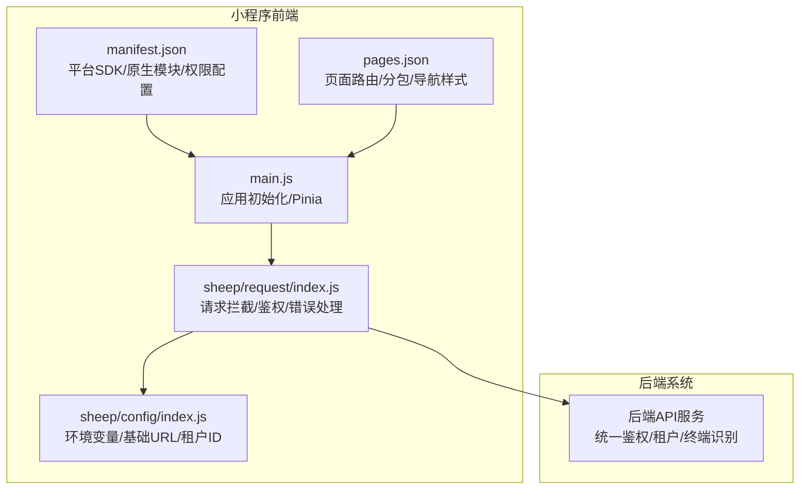
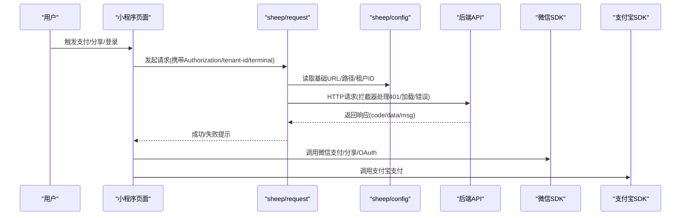
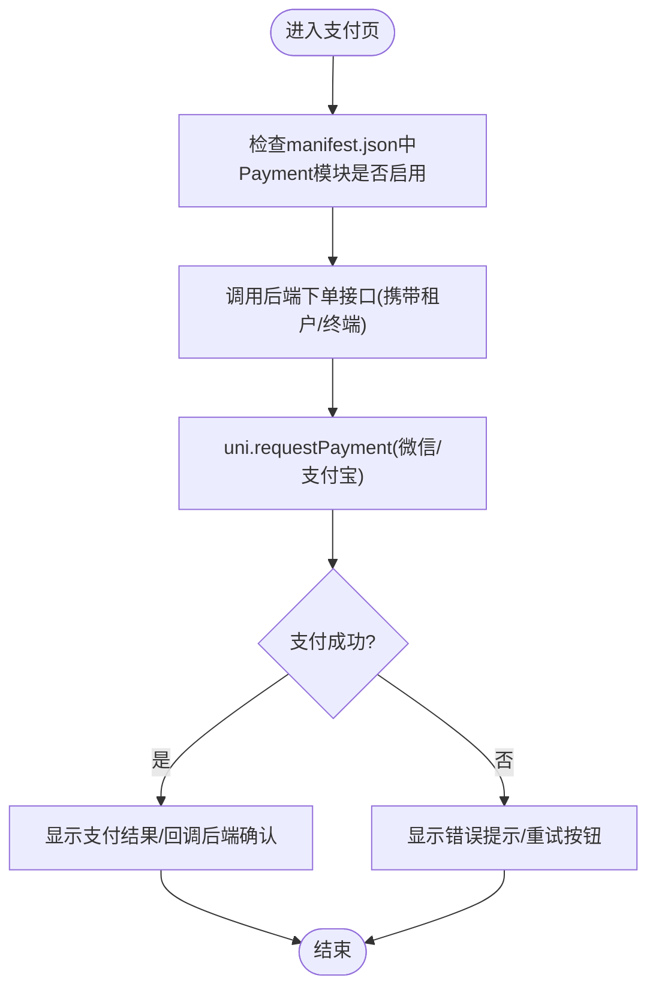
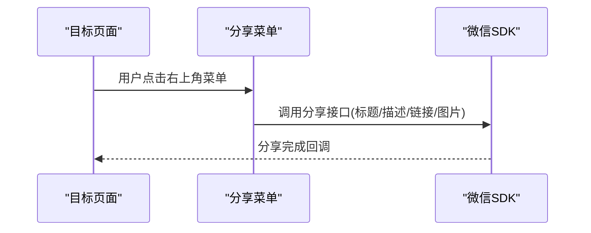
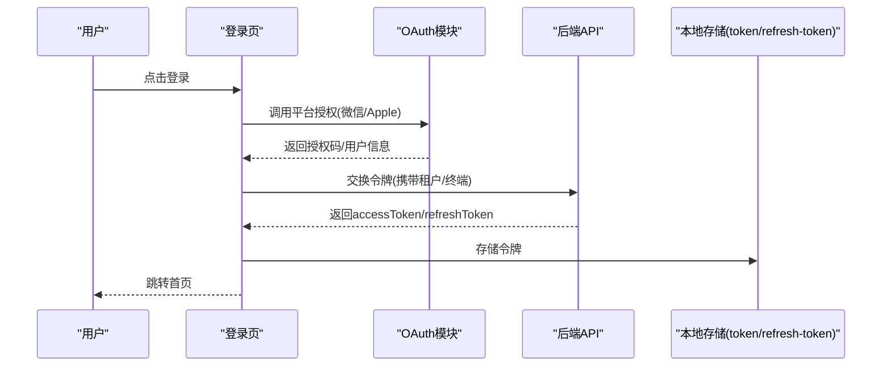
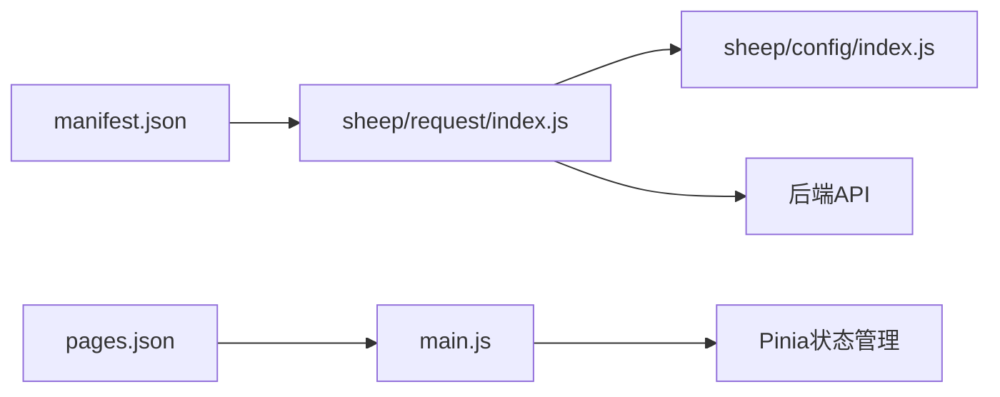

# 平台集成与优化

<cite>
**本文引用的文件**
- [README.md](file://README.md)
- [manifest.json](file://frontend/mall-uniapp/manifest.json)
- [main.js](file://frontend/mall-uniapp/main.js)
- [pages.json](file://frontend/mall-uniapp/pages.json)
- [index.js](file://frontend/mall-uniapp/sheep/request/index.js)
- [index.js](file://frontend/mall-uniapp/sheep/config/index.js)
</cite>

## 目录
1. [简介](#简介)
2. [项目结构](#项目结构)
3. [核心组件](#核心组件)
4. [架构总览](#架构总览)
5. [详细组件分析](#详细组件分析)
6. [依赖关系分析](#依赖关系分析)
7. [性能考虑](#性能考虑)
8. [故障排查指南](#故障排查指南)
9. [结论](#结论)
10. [附录](#附录)

## 简介
本文件面向电商小程序平台的集成与优化，聚焦微信小程序与支付宝小程序的平台集成实现，涵盖支付接口集成、分享功能实现、授权登录处理、平台 API 调用、原生能力使用、性能优化策略、小程序审核要求与发布流程、版本管理、平台兼容性处理与用户体验优化方案。文档以仓库中的前端 uni-app 电商小程序为核心，结合后端模块与整体系统定位，提供可操作的集成与优化建议。

## 项目结构
- 本项目包含后端模块与前端 uni-app 小程序两大部分。前端小程序位于 frontend/mall-uniapp，采用 Vue 3 + UniApp 技术栈，支持多端编译（微信小程序、支付宝小程序、H5、App 等）。
- 小程序配置集中在 manifest.json 与 pages.json，分别负责平台 SDK 配置、原生模块启用、页面路由与分包策略、导航栏样式等。
- 请求封装与配置位于 sheep/request 与 sheep/config，统一处理鉴权、租户、终端、加载与错误提示等横切逻辑。

**图表来源**
- [manifest.json:1-225](file://frontend/mall-uniapp/manifest.json#L1-L225)
- [pages.json:1-704](file://frontend/mall-uniapp/pages.json#L1-L704)
- [index.js:1-311](file://frontend/mall-uniapp/sheep/request/index.js#L1-L311)
- [index.js:1-32](file://frontend/mall-uniapp/sheep/config/index.js#L1-L32)
- [main.js:1-16](file://frontend/mall-uniapp/main.js#L1-L16)

**章节来源**
- [README.md:267-302](file://README.md#L267-L302)
- [manifest.json:1-225](file://frontend/mall-uniapp/manifest.json#L1-L225)
- [pages.json:1-704](file://frontend/mall-uniapp/pages.json#L1-L704)
- [index.js:1-311](file://frontend/mall-uniapp/sheep/request/index.js#L1-L311)
- [index.js:1-32](file://frontend/mall-uniapp/sheep/config/index.js#L1-L32)
- [main.js:1-16](file://frontend/mall-uniapp/main.js#L1-L16)

## 核心组件
- 平台 SDK 与原生模块配置：在 manifest.json 中启用 Payment、Share、OAuth 等模块，并配置微信/支付宝支付、分享、OAuth 的 AppID 与 Universal Links。
- 页面路由与分包：pages.json 定义首页、商品、订单、用户中心、分销、支付等页面分包策略，提升首屏加载性能。
- 请求封装：sheep/request/index.js 统一注入 Authorization、tenant-id、terminal 等头部，处理 401 刷新令牌、全局加载与错误提示。
- 环境配置：sheep/config/index.js 读取环境变量，提供基础 URL、API 路径、静态资源、租户 ID、WebSocket 路径、H5 URL 等。

**章节来源**
- [manifest.json:87-113](file://frontend/mall-uniapp/manifest.json#L87-L113)
- [pages.json:87-671](file://frontend/mall-uniapp/pages.json#L87-L671)
- [index.js:14-31](file://frontend/mall-uniapp/sheep/request/index.js#L14-L31)
- [index.js:50-67](file://frontend/mall-uniapp/sheep/request/index.js#L50-L67)
- [index.js:72-107](file://frontend/mall-uniapp/sheep/request/index.js#L72-L107)
- [index.js:112-155](file://frontend/mall-uniapp/sheep/request/index.js#L112-L155)
- [index.js:5-22](file://frontend/mall-uniapp/sheep/config/index.js#L5-L22)

## 架构总览
小程序前端通过统一请求封装与后端 API 交互，后端依据请求头中的 terminal 与 tenant-id 进行终端识别与租户隔离。平台 SDK（微信/支付宝）与原生模块（支付、分享、OAuth）在 manifest.json 中集中配置，pages.json 控制页面加载与分包策略。

**图表来源**
- [index.js:72-107](file://frontend/mall-uniapp/sheep/request/index.js#L72-L107)
- [index.js:112-155](file://frontend/mall-uniapp/sheep/request/index.js#L112-L155)
- [index.js:5-22](file://frontend/mall-uniapp/sheep/config/index.js#L5-L22)
- [manifest.json:87-113](file://frontend/mall-uniapp/manifest.json#L87-L113)

## 详细组件分析

### 支付接口集成（微信/支付宝）
- 配置位置：manifest.json 的 sdkConfigs.payment 节点，分别配置微信与支付宝 AppID、Universal Links、平台支持范围。
- 原生模块：manifest.json 的 modules 节点启用 Payment 模块，确保 uni.requestPayment 可用。
- 调用流程：页面触发支付后，通过 uni.requestPayment 调用对应平台 SDK；后端统一鉴权与租户识别，避免跨租户风险。
- 优化建议：
  - 使用分包策略减少首屏体积，提升支付页加载速度。
  - 在 pages.json 中对支付相关页面启用懒加载与必要时才加载。
  - 统一错误提示与埋点上报，便于问题定位。

**图表来源**
- [manifest.json:25-30](file://frontend/mall-uniapp/manifest.json#L25-L30)
- [manifest.json:97-106](file://frontend/mall-uniapp/manifest.json#L97-L106)
- [pages.json:566-604](file://frontend/mall-uniapp/pages.json#L566-L604)

**章节来源**
- [manifest.json:25-30](file://frontend/mall-uniapp/manifest.json#L25-L30)
- [manifest.json:97-106](file://frontend/mall-uniapp/manifest.json#L97-L106)
- [pages.json:566-604](file://frontend/mall-uniapp/pages.json#L566-L604)

### 分享功能实现（微信）
- 配置位置：manifest.json 的 sdkConfigs.share.weixin 节点，配置 AppID 与 Universal Links。
- 页面配置：pages.json 中的页面 meta 字段可控制是否需要授权与同步数据，分享入口通常在页面右上角菜单。
- 优化建议：
  - 分享文案与封面图动态生成，结合后端商品信息。
  - 使用分包与懒加载，避免分享页首屏过大。
  - 对分享事件埋点，统计分享来源与转化。

**图表来源**
- [manifest.json:107-112](file://frontend/mall-uniapp/manifest.json#L107-L112)
- [pages.json:87-671](file://frontend/mall-uniapp/pages.json#L87-L671)

**章节来源**
- [manifest.json:107-112](file://frontend/mall-uniapp/manifest.json#L107-L112)
- [pages.json:87-671](file://frontend/mall-uniapp/pages.json#L87-L671)

### 授权登录处理（微信/Apple OAuth）
- 配置位置：manifest.json 的 sdkConfigs.oauth 节点，配置微信与 Apple 的 AppID 与 Universal Links。
- 原生模块：manifest.json 的 modules.OAuth 启用 OAuth 模块。
- 请求拦截：sheep/request/index.js 在请求拦截器中注入 Authorization 与租户信息；对 401 错误进行无感刷新令牌与登出处理。
- 优化建议：
  - 登录页与授权页使用分包，降低首屏体积。
  - 对刷新令牌失败进行兜底登出与引导重新登录。
  - 统一错误提示与埋点，便于风控与审计。

**图表来源**
- [manifest.json:90-96](file://frontend/mall-uniapp/manifest.json#L90-L96)
- [manifest.json:29](file://frontend/mall-uniapp/manifest.json#L29)
- [index.js:72-107](file://frontend/mall-uniapp/sheep/request/index.js#L72-L107)
- [index.js:225-275](file://frontend/mall-uniapp/sheep/request/index.js#L225-L275)

**章节来源**
- [manifest.json:90-96](file://frontend/mall-uniapp/manifest.json#L90-L96)
- [manifest.json:29](file://frontend/mall-uniapp/manifest.json#L29)
- [index.js:72-107](file://frontend/mall-uniapp/sheep/request/index.js#L72-L107)
- [index.js:225-275](file://frontend/mall-uniapp/sheep/request/index.js#L225-L275)

### 平台 API 调用与原生能力使用
- 平台 API：通过 uni.$u.api.* 或自定义封装的 API 模块调用后端接口，请求头统一注入 Authorization、tenant-id、terminal。
- 原生能力：manifest.json 中启用 Payment、Share、OAuth、VideoPlayer 等模块，页面中通过 uni.xxx 调用。
- 优化建议：
  - 对高频接口使用缓存与节流，避免重复请求。
  - 对网络异常与超时进行重试与降级处理。
  - 对地理位置、相机等敏感权限进行明确提示与引导。

**章节来源**
- [index.js:50-67](file://frontend/mall-uniapp/sheep/request/index.js#L50-L67)
- [index.js:94-101](file://frontend/mall-uniapp/sheep/request/index.js#L94-L101)
- [manifest.json:25-30](file://frontend/mall-uniapp/manifest.json#L25-L30)

### 页面路由与分包策略
- 分包：pages.json 中通过 subPackages 定义 pages/goods、pages/order、pages/user、pages/commission、pages/pay、pages/activity 等分包，减少主包体积。
- 页面元信息：meta 字段控制是否需要授权、是否同步数据、分组与标题，便于统一权限与数据策略。
- 优化建议：
  - 将非首屏页面放入分包，提升首屏加载速度。
  - 对支付、订单详情等关键页面启用懒加载与必要的预加载。
  - 使用 tabBar 页面尽量保持轻量化，避免引入重型组件。

**章节来源**
- [pages.json:87-671](file://frontend/mall-uniapp/pages.json#L87-L671)

## 依赖关系分析
- 小程序应用初始化：main.js 负责创建应用与安装 Pinia。
- 请求封装：sheep/request/index.js 依赖 sheep/config 的基础配置，注入平台名称、租户与终端信息，拦截请求与响应，处理 401 刷新令牌。
- 平台配置：manifest.json 与 pages.json 为平台能力与页面策略提供基础。

**图表来源**
- [main.js:1-16](file://frontend/mall-uniapp/main.js#L1-L16)
- [index.js:1-311](file://frontend/mall-uniapp/sheep/request/index.js#L1-L311)
- [index.js:1-32](file://frontend/mall-uniapp/sheep/config/index.js#L1-L32)
- [manifest.json:1-225](file://frontend/mall-uniapp/manifest.json#L1-L225)
- [pages.json:1-704](file://frontend/mall-uniapp/pages.json#L1-L704)

**章节来源**
- [main.js:1-16](file://frontend/mall-uniapp/main.js#L1-L16)
- [index.js:1-311](file://frontend/mall-uniapp/sheep/request/index.js#L1-L311)
- [index.js:1-32](file://frontend/mall-uniapp/sheep/config/index.js#L1-L32)
- [manifest.json:1-225](file://frontend/mall-uniapp/manifest.json#L1-L225)
- [pages.json:1-704](file://frontend/mall-uniapp/pages.json#L1-L704)

## 性能考虑
- 分包与懒加载：利用 pages.json 的 subPackages 与 lazyCodeLoading，减少首屏体积与加载时间。
- 请求优化：统一超时与重试策略，避免并发风暴；对 401 进行无感刷新令牌，减少用户感知。
- 缓存与本地存储：合理使用 uni.setStorageSync 与缓存策略，降低重复请求。
- 图片与资源：使用静态资源域名与压缩策略，配合后端 CDN 优化加载。
- 导航与渲染：自定义导航样式与 tabBar 页面轻量化，减少不必要的渲染。

## 故障排查指南
- 登录失效与 401 处理：sheep/request/index.js 对 401 错误进行刷新令牌与兜底登出，若刷新失败则引导重新登录。
- 网络错误提示：根据错误码映射不同提示语，H5 环境下区分网络异常与服务器异常。
- 加载与遮罩：统一的 loading 显示与关闭逻辑，避免重复遮罩与内存泄漏。
- 平台配置核对：确认 manifest.json 中的 AppID、Universal Links、modules 与 sdkConfigs 是否正确配置。

**章节来源**
- [index.js:112-155](file://frontend/mall-uniapp/sheep/request/index.js#L112-L155)
- [index.js:156-220](file://frontend/mall-uniapp/sheep/request/index.js#L156-L220)
- [index.js:225-275](file://frontend/mall-uniapp/sheep/request/index.js#L225-L275)

## 结论
本项目通过 manifest.json 与 pages.json 的平台配置与页面策略，结合 sheep/request 与 sheep/config 的统一请求封装，实现了微信与支付宝小程序的支付、分享与授权登录的标准化集成。建议在实际上线前，完善平台审核材料、版本管理与灰度发布流程，并持续优化性能与用户体验。

## 附录
- 平台审核与发布：根据小程序平台要求准备应用图标、隐私政策、用户协议与权限说明；在 manifest.json 中完善 app-plus 与 mp-* 节点配置；使用分包与懒加载满足审核对首屏体积的要求。
- 版本管理：通过 manifest.json 的 versionName 与 versionCode 管理版本；在 pages.json 中对页面进行分包与懒加载优化；在 sheep/config 中通过环境变量区分开发/生产环境。
- 兼容性处理：针对不同平台的差异（如导航样式、手势返回、透明标题等），在 pages.json 与 manifest.json 中进行差异化配置；对敏感权限进行明确提示与引导。