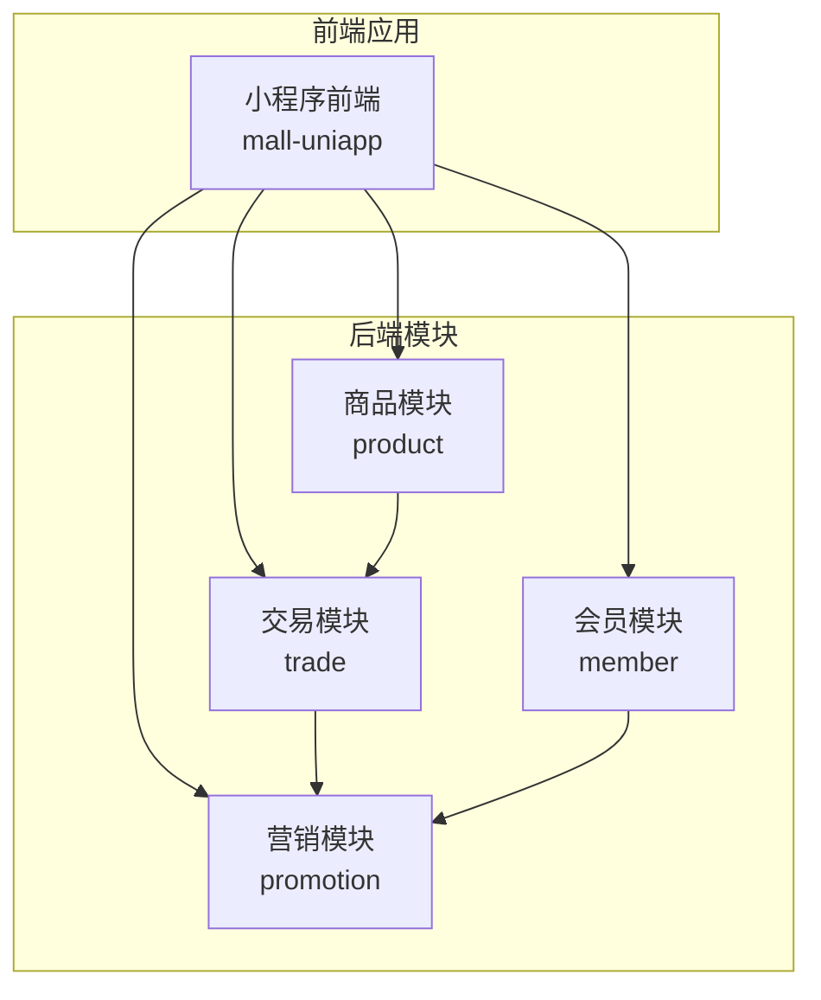
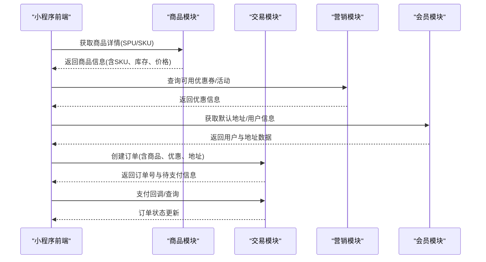
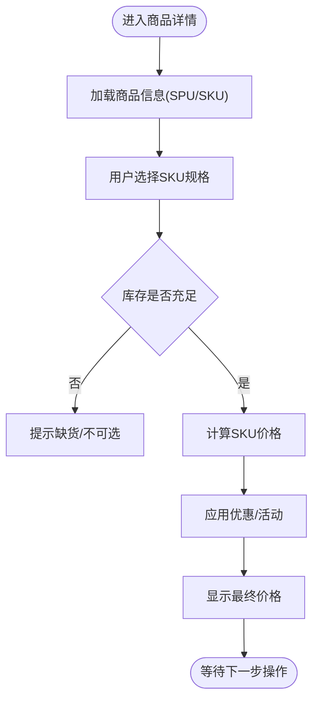
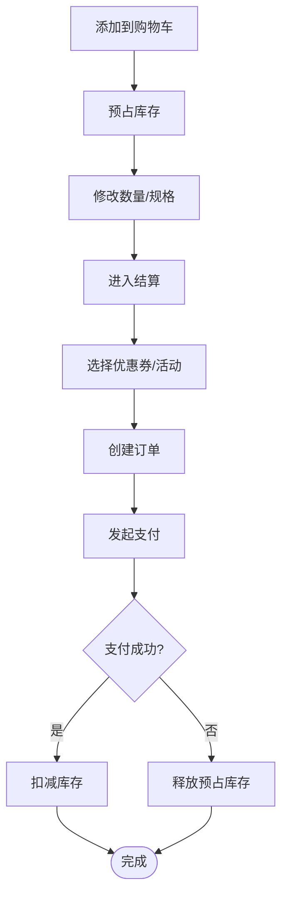
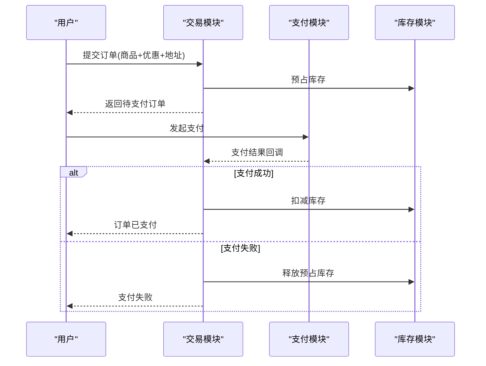
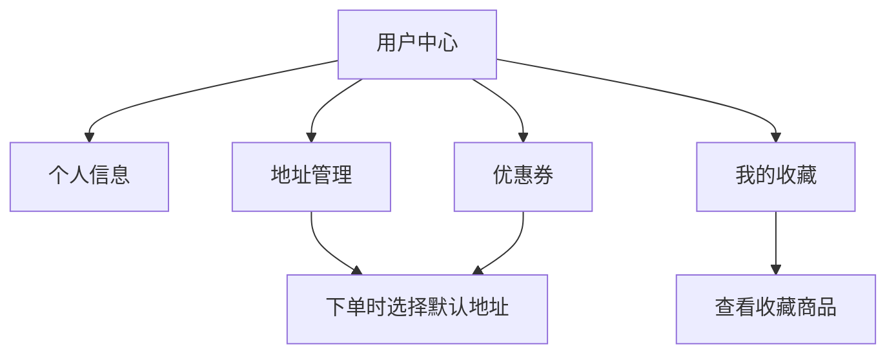
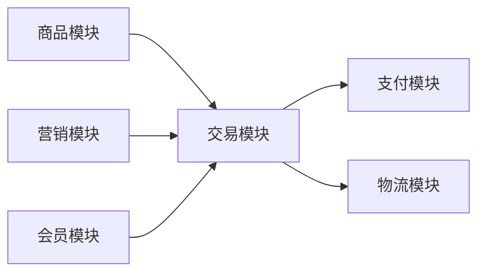

# 核心业务模块

<cite>
**本文引用的文件**
- [package-info.java](file://backend/yudao-module-mall/yudao-module-product/src/main/java/cn/iocoder/yudao/module/product/package-info.java)
- [package-info.java](file://backend/yudao-module-mall/yudao-module-promotion/src/main/java/cn/iocoder/yudao/module/promotion/package-info.java)
- [package-info.java](file://backend/yudao-module-mall/yudao-module-trade/src/main/java/cn/iocoder/yudao/module/trade/package-info.java)
- [package-info.java](file://backend/yudao-module-member/src/main/java/cn/iocoder/yudao/module/member/package-info.java)
- [README.md](file://README.md)
- [CPS系统PRD文档.md](file://docs/CPS系统PRD文档.md)
</cite>

## 目录
1. [简介](#简介)
2. [项目结构](#项目结构)
3. [核心组件](#核心组件)
4. [架构总览](#架构总览)
5. [详细组件分析](#详细组件分析)
6. [依赖分析](#依赖分析)
7. [性能考虑](#性能考虑)
8. [故障排除指南](#故障排除指南)
9. [结论](#结论)

## 简介
本文件面向电商小程序的核心业务模块，围绕商品展示、购物车、订单管理、用户中心等关键能力进行系统化梳理与说明。结合后端模块划分与项目背景资料，重点阐述以下方面：
- 商品详情展示、SKU 选择、价格计算、库存管理
- 购物车操作、下单流程、支付集成、订单状态跟踪
- 用户个人信息管理、地址管理、收藏功能、优惠券使用
- 业务逻辑实现、用户体验优化、性能优化方案

## 项目结构
基于后端模块划分，核心业务由多个模块协同完成：
- 商品模块（product）：负责商品相关实体与接口，如 SPU/SKU、品牌、分类等
- 交易模块（trade）：负责交易相关流程，如下单、订单状态流转
- 营销模块（promotion）：负责营销活动、优惠券等促销能力
- 会员模块（member）：负责用户中心、地址、收藏等用户侧能力

图表来源
- [package-info.java:1-9](file://backend/yudao-module-mall/yudao-module-product/src/main/java/cn/iocoder/yudao/module/product/package-info.java#L1-L9)
- [package-info.java:1-9](file://backend/yudao-module-mall/yudao-module-trade/src/main/java/cn/iocoder/yudao/module/trade/package-info.java#L1-L9)
- [package-info.java:1-9](file://backend/yudao-module-mall/yudao-module-promotion/src/main/java/cn/iocoder/yudao/module/promotion/package-info.java#L1-L9)
- [package-info.java:1-9](file://backend/yudao-module-member/src/main/java/cn/iocoder/yudao/module/member/package-info.java#L1-L9)

章节来源
- [package-info.java:1-9](file://backend/yudao-module-mall/yudao-module-product/src/main/java/cn/iocoder/yudao/module/product/package-info.java#L1-L9)
- [package-info.java:1-9](file://backend/yudao-module-mall/yudao-module-trade/src/main/java/cn/iocoder/yudao/module/trade/package-info.java#L1-L9)
- [package-info.java:1-9](file://backend/yudao-module-mall/yudao-module-promotion/src/main/java/cn/iocoder/yudao/module/promotion/package-info.java#L1-L9)
- [package-info.java:1-9](file://backend/yudao-module-member/src/main/java/cn/iocoder/yudao/module/member/package-info.java#L1-L9)

## 核心组件
本节从后端模块职责出发，概述各模块在核心业务中的定位与边界。

- 商品模块（product）
  - 职责：商品基础信息、SPU/SKU、品牌、分类等
  - 关键点：为购物车、下单、营销活动提供商品数据支撑
- 交易模块（trade）
  - 职责：订单创建、支付、发货、收货、售后等全流程
  - 关键点：承接商品与营销结果，生成最终订单并驱动状态流转
- 营销模块（promotion）
  - 职责：优惠券、满减、折扣、限时购等营销策略
  - 关键点：对商品价格与订单金额进行动态调整
- 会员模块（member）
  - 职责：用户信息、地址、收藏、积分等
  - 关键点：为下单提供默认地址、用户画像与营销触达

章节来源
- [package-info.java:1-9](file://backend/yudao-module-mall/yudao-module-product/src/main/java/cn/iocoder/yudao/module/product/package-info.java#L1-L9)
- [package-info.java:1-9](file://backend/yudao-module-mall/yudao-module-trade/src/main/java/cn/iocoder/yudao/module/trade/package-info.java#L1-L9)
- [package-info.java:1-9](file://backend/yudao-module-mall/yudao-module-promotion/src/main/java/cn/iocoder/yudao/module/promotion/package-info.java#L1-L9)
- [package-info.java:1-9](file://backend/yudao-module-member/src/main/java/cn/iocoder/yudao/module/member/package-info.java#L1-L9)

## 架构总览
从前端到后端的整体交互如下：

图表来源
- [package-info.java:1-9](file://backend/yudao-module-mall/yudao-module-product/src/main/java/cn/iocoder/yudao/module/product/package-info.java#L1-L9)
- [package-info.java:1-9](file://backend/yudao-module-mall/yudao-module-trade/src/main/java/cn/iocoder/yudao/module/trade/package-info.java#L1-L9)
- [package-info.java:1-9](file://backend/yudao-module-mall/yudao-module-promotion/src/main/java/cn/iocoder/yudao/module/promotion/package-info.java#L1-L9)
- [package-info.java:1-9](file://backend/yudao-module-member/src/main/java/cn/iocoder/yudao/module/member/package-info.java#L1-L9)

## 详细组件分析

### 商品展示模块
- 商品详情页
  - 展示维度：主图轮播、SKU 规格、价格区间、库存状态、卖点文案
  - 交互要点：SKU 选择联动、库存实时校验、价格动态刷新
- SKU 选择与价格计算
  - 选择逻辑：按规格维度逐项选择，过滤不可选组合
  - 价格计算：取对应 SKU 的销售价；若存在营销活动，叠加优惠后的应付价
- 库存管理
  - 实时库存：下单前校验可用库存，锁定预占库存
  - 库存扣减：支付成功后正式扣减，失败则释放预占

图表来源
- [package-info.java:1-9](file://backend/yudao-module-mall/yudao-module-product/src/main/java/cn/iocoder/yudao/module/product/package-info.java#L1-L9)
- [package-info.java:1-9](file://backend/yudao-module-mall/yudao-module-promotion/src/main/java/cn/iocoder/yudao/module/promotion/package-info.java#L1-L9)

章节来源
- [package-info.java:1-9](file://backend/yudao-module-mall/yudao-module-product/src/main/java/cn/iocoder/yudao/module/product/package-info.java#L1-L9)
- [package-info.java:1-9](file://backend/yudao-module-mall/yudao-module-promotion/src/main/java/cn/iocoder/yudao/module/promotion/package-info.java#L1-L9)

### 购物车功能
- 购物车操作
  - 添加：校验 SKU 可售性与库存，支持合并同款不同规格
  - 修改：变更数量、切换选中状态
  - 删除：批量删除或清空
- 结算流程
  - 选择商品 → 计算小计 → 应用优惠 → 生成订单
- 预占库存与超时释放
  - 加入购物车即预占库存，超时自动释放，避免超卖

图表来源
- [package-info.java:1-9](file://backend/yudao-module-mall/yudao-module-product/src/main/java/cn/iocoder/yudao/module/product/package-info.java#L1-L9)
- [package-info.java:1-9](file://backend/yudao-module-mall/yudao-module-trade/src/main/java/cn/iocoder/yudao/module/trade/package-info.java#L1-L9)
- [package-info.java:1-9](file://backend/yudao-module-mall/yudao-module-promotion/src/main/java/cn/iocoder/yudao/module/promotion/package-info.java#L1-L9)

章节来源
- [package-info.java:1-9](file://backend/yudao-module-mall/yudao-module-product/src/main/java/cn/iocoder/yudao/module/product/package-info.java#L1-L9)
- [package-info.java:1-9](file://backend/yudao-module-mall/yudao-module-trade/src/main/java/cn/iocoder/yudao/module/trade/package-info.java#L1-L9)
- [package-info.java:1-9](file://backend/yudao-module-mall/yudao-module-promotion/src/main/java/cn/iocoder/yudao/module/promotion/package-info.java#L1-L9)

### 订单管理
- 下单流程
  - 选择收货地址、商品、优惠 → 校验库存与价格 → 生成待支付订单
- 支付集成
  - 统一支付入口，支持多种支付方式；支付完成后异步回调更新订单状态
- 订单状态跟踪
  - 待付款、已支付、待发货、已发货、已完成、已取消等状态机
- 售后与退款
  - 支持申请退款/退货，按规则处理并回滚库存

图表来源
- [package-info.java:1-9](file://backend/yudao-module-mall/yudao-module-trade/src/main/java/cn/iocoder/yudao/module/trade/package-info.java#L1-L9)

章节来源
- [package-info.java:1-9](file://backend/yudao-module-mall/yudao-module-trade/src/main/java/cn/iocoder/yudao/module/trade/package-info.java#L1-L9)

### 用户中心
- 个人信息管理
  - 基本资料、头像、绑定手机/邮箱等
- 地址管理
  - 新增/编辑/删除/设默认地址；下单时自动带入
- 收藏功能
  - 商品收藏、店铺收藏；支持批量管理
- 优惠券使用
  - 展示可用/已用/过期券；下单时自动匹配最优券

图表来源
- [package-info.java:1-9](file://backend/yudao-module-member/src/main/java/cn/iocoder/yudao/module/member/package-info.java#L1-L9)
- [package-info.java:1-9](file://backend/yudao-module-mall/yudao-module-promotion/src/main/java/cn/iocoder/yudao/module/promotion/package-info.java#L1-L9)

章节来源
- [package-info.java:1-9](file://backend/yudao-module-member/src/main/java/cn/iocoder/yudao/module/member/package-info.java#L1-L9)
- [package-info.java:1-9](file://backend/yudao-module-mall/yudao-module-promotion/src/main/java/cn/iocoder/yudao/module/promotion/package-info.java#L1-L9)

## 依赖分析
- 模块耦合关系
  - 商品模块为上游数据源，交易模块依赖其价格与库存信息
  - 营销模块对商品与订单进行价格层面的干预
  - 会员模块为交易提供地址与用户画像
- 外部依赖
  - 支付网关、物流查询、短信/邮件通知等通过统一接入层对外调用

图表来源
- [package-info.java:1-9](file://backend/yudao-module-mall/yudao-module-product/src/main/java/cn/iocoder/yudao/module/product/package-info.java#L1-L9)
- [package-info.java:1-9](file://backend/yudao-module-mall/yudao-module-trade/src/main/java/cn/iocoder/yudao/module/trade/package-info.java#L1-L9)
- [package-info.java:1-9](file://backend/yudao-module-mall/yudao-module-promotion/src/main/java/cn/iocoder/yudao/module/promotion/package-info.java#L1-L9)
- [package-info.java:1-9](file://backend/yudao-module-member/src/main/java/cn/iocoder/yudao/module/member/package-info.java#L1-L9)

章节来源
- [package-info.java:1-9](file://backend/yudao-module-mall/yudao-module-product/src/main/java/cn/iocoder/yudao/module/product/package-info.java#L1-L9)
- [package-info.java:1-9](file://backend/yudao-module-mall/yudao-module-trade/src/main/java/cn/iocoder/yudao/module/trade/package-info.java#L1-L9)
- [package-info.java:1-9](file://backend/yudao-module-mall/yudao-module-promotion/src/main/java/cn/iocoder/yudao/module/promotion/package-info.java#L1-L9)
- [package-info.java:1-9](file://backend/yudao-module-member/src/main/java/cn/iocoder/yudao/module/member/package-info.java#L1-L9)

## 性能考虑
- 缓存策略
  - 商品详情与热门商品列表缓存，降低数据库压力
  - SKU 价格与库存采用短时缓存，结合事件驱动的异步刷新
- 分布式锁与幂等
  - 下单与支付流程使用分布式锁，防止超卖与重复提交
- 异步解耦
  - 支付回调、发货通知、库存扣减等通过消息队列异步处理
- 前端优化
  - 图片懒加载、骨架屏、分页加载、本地存储购物车

## 故障排除指南
- 常见问题
  - 库存不足：下单前严格校验可用库存，提示用户可选规格
  - 支付失败：记录回调日志，触发重试或人工介入
  - 订单状态不一致：对账与补偿任务定期扫描异常订单
- 日志与监控
  - 关键链路埋点与链路追踪，快速定位瓶颈与异常

## 结论
本项目通过清晰的模块划分与前后端协作，构建了覆盖商品、交易、营销、会员的完整电商闭环。建议在后续迭代中持续完善：
- 价格计算与库存一致性保障
- 订单状态机与售后流程的标准化
- 用户体验与性能的持续优化
- 支付与物流的多渠道适配