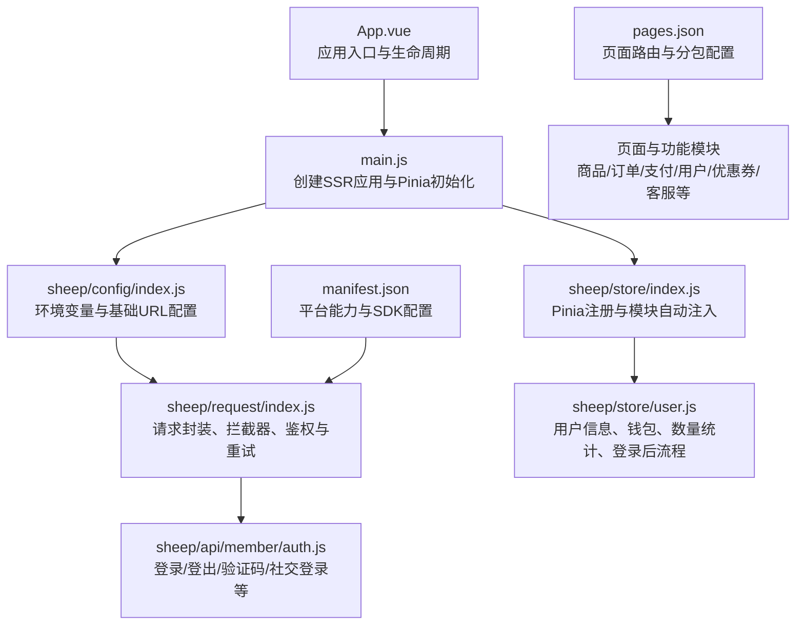
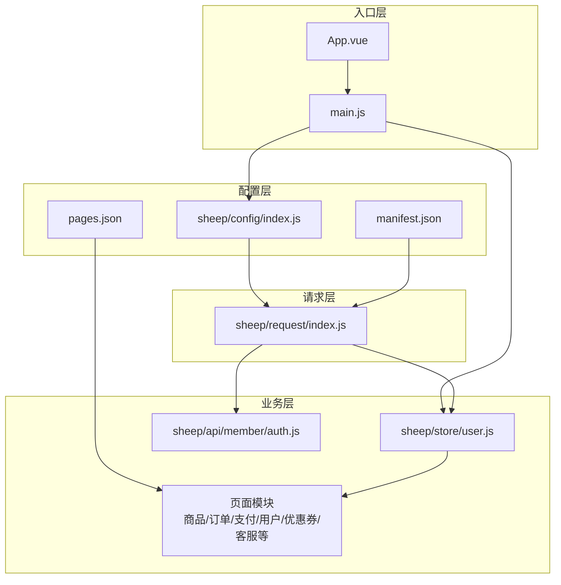
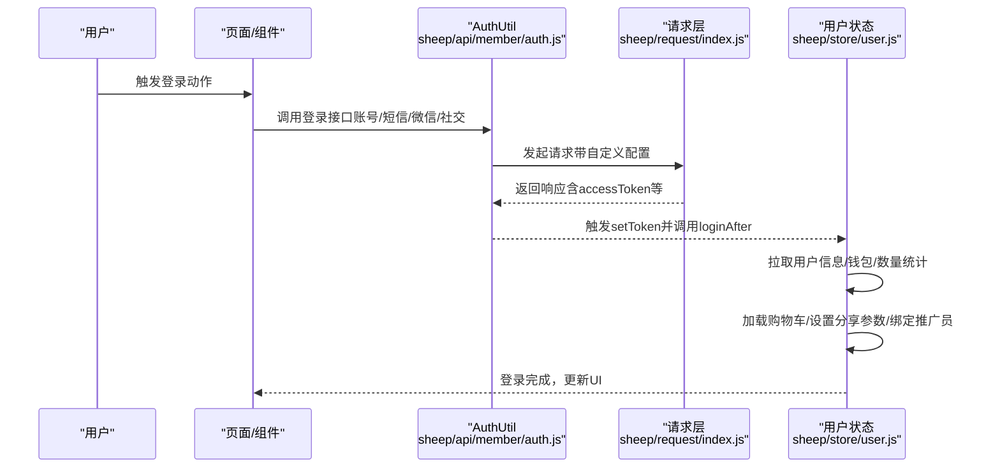
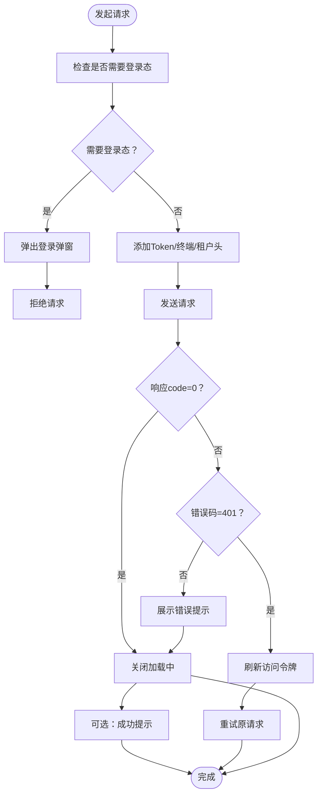
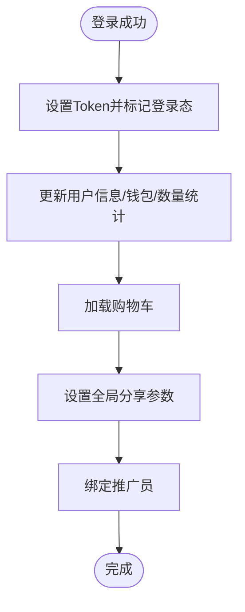
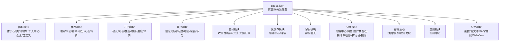
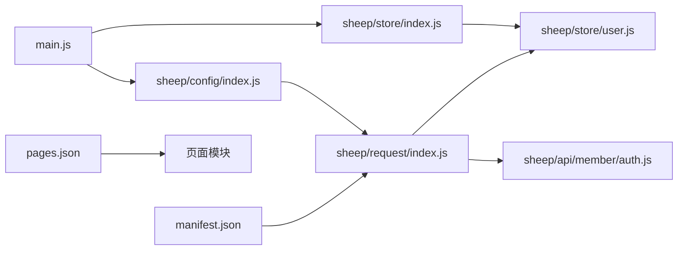

# 电商小程序应用

<cite>
**本文引用的文件**
- [App.vue](file://frontend/mall-uniapp/App.vue)
- [main.js](file://frontend/mall-uniapp/main.js)
- [manifest.json](file://frontend/mall-uniapp/manifest.json)
- [pages.json](file://frontend/mall-uniapp/pages.json)
- [package.json](file://frontend/mall-uniapp/package.json)
- [sheep/store/index.js](file://frontend/mall-uniapp/sheep/store/index.js)
- [sheep/config/index.js](file://frontend/mall-uniapp/sheep/config/index.js)
- [sheep/request/index.js](file://frontend/mall-uniapp/sheep/request/index.js)
- [sheep/api/member/auth.js](file://frontend/mall-uniapp/sheep/api/member/auth.js)
- [sheep/store/user.js](file://frontend/mall-uniapp/sheep/store/user.js)
</cite>

## 目录
1. [简介](#简介)
2. [项目结构](#项目结构)
3. [核心组件](#核心组件)
4. [架构总览](#架构总览)
5. [详细组件分析](#详细组件分析)
6. [依赖关系分析](#依赖关系分析)
7. [性能考虑](#性能考虑)
8. [故障排查指南](#故障排查指南)
9. [结论](#结论)
10. [附录](#附录)

## 简介
本项目是一个基于 uni-app 的电商小程序应用，采用 Vue3 + Pinia 架构，支持多端发布（App、H5、微信小程序等）。应用围绕“商品展示、购物车、订单管理、支付流程”等核心业务展开，并集成用户登录、地址管理、优惠券系统、客服功能等模块。本文档从架构设计、模块实现、用户体验优化、平台特性利用与性能优化等方面进行系统化梳理，帮助开发者快速理解与扩展系统。

## 项目结构
前端工程位于 frontend/mall-uniapp，核心入口与配置如下：
- 应用入口与生命周期：App.vue、main.js
- 平台配置与多端能力：manifest.json
- 页面路由与分包配置：pages.json
- 依赖与多端兼容：package.json
- 状态管理与持久化：sheep/store/*
- 网络请求与拦截：sheep/request/*
- 配置中心：sheep/config/*
- 会员与登录相关 API：sheep/api/member/*

**图表来源**
- [App.vue:1-33](file://frontend/mall-uniapp/App.vue#L1-L33)
- [main.js:1-16](file://frontend/mall-uniapp/main.js#L1-L16)
- [sheep/store/index.js:1-21](file://frontend/mall-uniapp/sheep/store/index.js#L1-L21)
- [sheep/config/index.js:1-32](file://frontend/mall-uniapp/sheep/config/index.js#L1-L32)
- [sheep/request/index.js:1-311](file://frontend/mall-uniapp/sheep/request/index.js#L1-L311)
- [sheep/api/member/auth.js:1-133](file://frontend/mall-uniapp/sheep/api/member/auth.js#L1-L133)
- [sheep/store/user.js:1-165](file://frontend/mall-uniapp/sheep/store/user.js#L1-L165)
- [manifest.json:1-225](file://frontend/mall-uniapp/manifest.json#L1-L225)
- [pages.json:1-704](file://frontend/mall-uniapp/pages.json#L1-L704)

**章节来源**
- [App.vue:1-33](file://frontend/mall-uniapp/App.vue#L1-L33)
- [main.js:1-16](file://frontend/mall-uniapp/main.js#L1-L16)
- [manifest.json:1-225](file://frontend/mall-uniapp/manifest.json#L1-L225)
- [pages.json:1-704](file://frontend/mall-uniapp/pages.json#L1-L704)
- [package.json:1-104](file://frontend/mall-uniapp/package.json#L1-L104)

## 核心组件
- 应用入口与生命周期
  - 在应用启动时隐藏原生 TabBar，使用自定义导航；初始化底层依赖；在 App 平台获取运行参数与剪贴板数据。
- SSR 应用与状态管理
  - 通过 createSSRApp 创建应用，统一注册 Pinia，并启用持久化插件。
- 配置中心
  - 基于环境变量动态选择开发/生产基础 URL、API 路径、静态资源路径、租户 ID、WebSocket 路径与 H5 URL。
- 请求层
  - 封装 luch-request，统一设置请求头（平台、终端、租户）、加载中提示、错误提示、401 自动刷新令牌、登录后自动设置 Token。
- 用户状态
  - 统一维护用户信息、钱包、订单与优惠券数量统计；登录后拉取用户资料、钱包、数量统计、购物车、全局分享参数与推广员绑定。

**章节来源**
- [App.vue:1-33](file://frontend/mall-uniapp/App.vue#L1-L33)
- [main.js:1-16](file://frontend/mall-uniapp/main.js#L1-L16)
- [sheep/config/index.js:1-32](file://frontend/mall-uniapp/sheep/config/index.js#L1-L32)
- [sheep/request/index.js:1-311](file://frontend/mall-uniapp/sheep/request/index.js#L1-L311)
- [sheep/store/user.js:1-165](file://frontend/mall-uniapp/sheep/store/user.js#L1-L165)

## 架构总览
整体采用“入口层 → 配置层 → 请求层 → 业务层（页面/模块）”的分层架构。页面路由由 pages.json 管理，按功能拆分为多个子包，便于按需加载与性能优化。多端能力由 manifest.json 配置，包含支付、分享、OAuth、微信/支付宝等 SDK。

**图表来源**
- [App.vue:1-33](file://frontend/mall-uniapp/App.vue#L1-L33)
- [main.js:1-16](file://frontend/mall-uniapp/main.js#L1-L16)
- [sheep/config/index.js:1-32](file://frontend/mall-uniapp/sheep/config/index.js#L1-L32)
- [manifest.json:1-225](file://frontend/mall-uniapp/manifest.json#L1-L225)
- [pages.json:1-704](file://frontend/mall-uniapp/pages.json#L1-L704)
- [sheep/request/index.js:1-311](file://frontend/mall-uniapp/sheep/request/index.js#L1-L311)
- [sheep/store/user.js:1-165](file://frontend/mall-uniapp/sheep/store/user.js#L1-L165)
- [sheep/api/member/auth.js:1-133](file://frontend/mall-uniapp/sheep/api/member/auth.js#L1-L133)

## 详细组件分析

### 用户登录与鉴权流程
用户登录涉及多种方式（账号密码、短信验证码、微信一键登录、社交授权），登录成功后自动设置 Token 并触发登录后流程（拉取用户信息、钱包、数量统计、购物车、分享参数、推广员绑定）。

**图表来源**
- [sheep/api/member/auth.js:1-133](file://frontend/mall-uniapp/sheep/api/member/auth.js#L1-L133)
- [sheep/request/index.js:1-311](file://frontend/mall-uniapp/sheep/request/index.js#L1-L311)
- [sheep/store/user.js:1-165](file://frontend/mall-uniapp/sheep/store/user.js#L1-L165)

**章节来源**
- [sheep/api/member/auth.js:1-133](file://frontend/mall-uniapp/sheep/api/member/auth.js#L1-L133)
- [sheep/store/user.js:1-165](file://frontend/mall-uniapp/sheep/store/user.js#L1-L165)
- [sheep/request/index.js:1-311](file://frontend/mall-uniapp/sheep/request/index.js#L1-L311)

### 请求拦截与401无感刷新
请求层对登录态、加载中、错误提示、401 刷新令牌等进行统一处理，避免在各页面重复实现。

**图表来源**
- [sheep/request/index.js:1-311](file://frontend/mall-uniapp/sheep/request/index.js#L1-L311)

**章节来源**
- [sheep/request/index.js:1-311](file://frontend/mall-uniapp/sheep/request/index.js#L1-L311)

### 用户状态与登录后流程
用户状态模块负责用户信息、钱包、订单与优惠券数量统计的拉取与更新，并在登录后执行一系列初始化动作。

**图表来源**
- [sheep/store/user.js:1-165](file://frontend/mall-uniapp/sheep/store/user.js#L1-L165)

**章节来源**
- [sheep/store/user.js:1-165](file://frontend/mall-uniapp/sheep/store/user.js#L1-L165)

### 页面与模块组织
pages.json 对页面进行分组与权限控制，核心模块包括：
- 商城首页、分类、购物车、个人中心、搜索、自定义页面
- 商品模块：详情、拼团、秒杀、积分、列表、评价
- 订单模块：确认订单、订单列表、售后申请/物流/进度/详情
- 用户模块：信息、收藏、足迹、地址、余额、积分
- 支付模块：收银台、支付结果、余额充值、充值记录
- 优惠券模块：领券中心、优惠券详情
- 客服模块：客服聊天
- 分销模块：分销中心、佣金、推广商品、分销订单、团队、排行榜、提现
- 营销活动：拼团、秒杀、积分商城
- 应用：签到中心
- 公共：设置、富文本、FAQ、错误页面、WebView

**图表来源**
- [pages.json:1-704](file://frontend/mall-uniapp/pages.json#L1-L704)

**章节来源**
- [pages.json:1-704](file://frontend/mall-uniapp/pages.json#L1-L704)

## 依赖关系分析
- 应用入口依赖 main.js 注入 Pinia；Pinia 通过 sheep/store/index.js 自动注册模块并启用持久化。
- 请求层依赖配置中心提供的基础 URL、API 路径、租户 ID 等；同时依赖平台信息与用户 Token。
- 用户状态依赖请求层获取用户信息、钱包、订单数量与优惠券数量。
- manifest.json 与 pages.json 决定平台能力与页面路由，影响请求层的跨域、证书验证、H5 cookies 等行为。

**图表来源**
- [main.js:1-16](file://frontend/mall-uniapp/main.js#L1-L16)
- [sheep/store/index.js:1-21](file://frontend/mall-uniapp/sheep/store/index.js#L1-L21)
- [sheep/config/index.js:1-32](file://frontend/mall-uniapp/sheep/config/index.js#L1-L32)
- [sheep/request/index.js:1-311](file://frontend/mall-uniapp/sheep/request/index.js#L1-L311)
- [sheep/store/user.js:1-165](file://frontend/mall-uniapp/sheep/store/user.js#L1-L165)
- [sheep/api/member/auth.js:1-133](file://frontend/mall-uniapp/sheep/api/member/auth.js#L1-L133)
- [manifest.json:1-225](file://frontend/mall-uniapp/manifest.json#L1-L225)
- [pages.json:1-704](file://frontend/mall-uniapp/pages.json#L1-L704)

**章节来源**
- [main.js:1-16](file://frontend/mall-uniapp/main.js#L1-L16)
- [sheep/store/index.js:1-21](file://frontend/mall-uniapp/sheep/store/index.js#L1-L21)
- [sheep/config/index.js:1-32](file://frontend/mall-uniapp/sheep/config/index.js#L1-L32)
- [sheep/request/index.js:1-311](file://frontend/mall-uniapp/sheep/request/index.js#L1-L311)
- [sheep/store/user.js:1-165](file://frontend/mall-uniapp/sheep/store/user.js#L1-L165)
- [sheep/api/member/auth.js:1-133](file://frontend/mall-uniapp/sheep/api/member/auth.js#L1-L133)
- [manifest.json:1-225](file://frontend/mall-uniapp/manifest.json#L1-L225)
- [pages.json:1-704](file://frontend/mall-uniapp/pages.json#L1-L704)

## 性能考虑
- 分包加载与懒加载
  - pages.json 中使用 subPackages 对页面进行分包，配合 lazyCodeLoading 与分包配置，减少首屏体积与加载时间。
- 路由与页面优化
  - 启用下拉刷新、树摇优化（H5）、历史路由模式等，降低无效渲染与网络请求。
- 请求层优化
  - 统一加载中提示与错误提示，避免重复 UI 逻辑；401 无感刷新令牌，减少用户感知的登录中断。
- 平台差异
  - H5 端关闭 withCredentials，App 端关闭 sslVerify，按平台特性调整网络行为，兼顾安全与可用性。
- 状态持久化
  - Pinia 结合持久化插件，减少重复拉取用户信息与购物车数据的成本。

**章节来源**
- [pages.json:1-704](file://frontend/mall-uniapp/pages.json#L1-L704)
- [sheep/request/index.js:1-311](file://frontend/mall-uniapp/sheep/request/index.js#L1-L311)
- [sheep/store/index.js:1-21](file://frontend/mall-uniapp/sheep/store/index.js#L1-L21)

## 故障排查指南
- 登录态失效或 401
  - 现象：接口返回 401 或提示登录过期。
  - 处理：请求层会尝试刷新访问令牌；若刷新失败则触发登出并弹出登录弹窗。
- 网络错误与超时
  - 现象：不同 HTTP 状态码对应不同提示；H5 网络断开时有明确提示。
  - 处理：检查网络状态、请求超时阈值、跨域与证书配置。
- 加载中未关闭
  - 现象：请求异常或错误时仍显示加载中。
  - 处理：确认 custom.showLoading 配置与异常分支是否正确关闭。
- 平台能力缺失
  - 现象：App/小程序特定能力（如支付、分享、OAuth）未生效。
  - 处理：核对 manifest.json 中 app-plus/sdkConfigs/modules 配置与平台 SDK 集成情况。

**章节来源**
- [sheep/request/index.js:1-311](file://frontend/mall-uniapp/sheep/request/index.js#L1-L311)
- [manifest.json:1-225](file://frontend/mall-uniapp/manifest.json#L1-L225)

## 结论
本项目以 uni-app 为基础，构建了覆盖电商核心业务的多端应用。通过清晰的分层架构、统一的请求与鉴权机制、完善的用户状态管理以及合理的页面与分包组织，实现了良好的可维护性与扩展性。建议在后续迭代中持续关注平台能力适配、性能监控与用户体验优化，确保在多端环境下保持一致的高质量体验。

## 附录
- 平台能力与 SDK 配置
  - 支付、分享、视频播放、OAuth 等模块在 manifest.json 中声明；微信/支付宝/Apple/微博等第三方 SDK 已接入。
- 多端兼容
  - package.json 明确支持 Vue3、H5 PC/移动端、小程序（微信等）等平台，便于多端发布与调试。
- 页面与模块清单
  - pages.json 中列出全部页面与分包，便于定位与扩展新功能模块。

**章节来源**
- [manifest.json:1-225](file://frontend/mall-uniapp/manifest.json#L1-L225)
- [package.json:1-104](file://frontend/mall-uniapp/package.json#L1-L104)
- [pages.json:1-704](file://frontend/mall-uniapp/pages.json#L1-L704)