# 自定义组件库

<cite>
**本文引用的文件**
- [pages.json](file://frontend/mall-uniapp/pages.json)
- [manifest.json](file://frontend/mall-uniapp/manifest.json)
- [uni-card 包信息](file://frontend/mall-uniapp/uni_modules/uni-card/package.json)
- [uni-forms 包信息](file://frontend/mall-uniapp/uni_modules/uni-forms/package.json)
- [uni-load-more 包信息](file://frontend/mall-uniapp/uni_modules/uni-load-more/package.json)
- [uni-search-bar 包信息](file://frontend/mall-uniapp/uni_modules/uni-search-bar/package.json)
- [uni-nav-bar 包信息](file://frontend/mall-uniapp/uni_modules/uni-nav-bar/package.json)
- [uni-grid 包信息](file://frontend/mall-uniapp/uni_modules/uni-grid/package.json)
- [uni-swiper-dot 包信息](file://frontend/mall-uniapp/uni_modules/uni-swiper-dot/package.json)
- [uni-tag 包信息](file://frontend/mall-uniapp/uni_modules/uni-tag/package.json)
- [uni-transition 包信息](file://frontend/mall-uniapp/uni_modules/uni-transition/package.json)
- [uni-badge 包信息](file://frontend/mall-uniapp/uni_modules/uni-badge/package.json)
- [mp-html 包信息](file://frontend/mall-uniapp/uni_modules/mp-html/package.json)
- [lime-painter 包信息](file://frontend/mall-uniapp/uni_modules/lime-painter/package.json)
</cite>

## 目录
1. [简介](#简介)
2. [项目结构](#项目结构)
3. [核心组件](#核心组件)
4. [架构总览](#架构总览)
5. [组件详解](#组件详解)
6. [依赖关系分析](#依赖关系分析)
7. [性能考量](#性能考量)
8. [故障排查指南](#故障排查指南)
9. [结论](#结论)
10. [附录](#附录)

## 简介
本文件面向电商小程序场景，系统化梳理并输出“自定义组件库”的设计与实现要点，覆盖通用组件封装、样式系统、主题切换、属性与事件设计、复用策略与性能优化。文档聚焦以下典型组件族：商品卡片、轮播图与指示点、分类导航、搜索栏、弹窗、表单、加载、空状态、富文本与海报生成等，并给出可落地的开发规范与最佳实践。

## 项目结构
该小程序采用 uni-app 架构，页面与组件通过 pages.json 的 easycom 自动扫描与命名规则进行统一注册；manifest.json 提供平台配置与运行时能力开关。组件生态主要来源于 uni_modules 内置组件与第三方富文本、海报生成组件包。

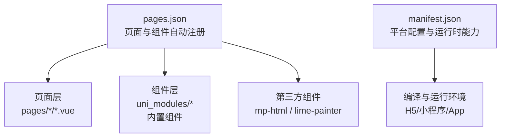

**图表来源**
- [pages.json:1-704](file://frontend/mall-uniapp/pages.json#L1-L704)
- [manifest.json:1-225](file://frontend/mall-uniapp/manifest.json#L1-L225)

**章节来源**
- [pages.json:1-704](file://frontend/mall-uniapp/pages.json#L1-L704)
- [manifest.json:1-225](file://frontend/mall-uniapp/manifest.json#L1-L225)

## 核心组件
- 商品卡片族：用于商品列表与详情页的商品信息展示，强调图文、价格、标签、操作区的组合与可定制性。
- 轮播图与指示点：提供图片轮播与指示点样式，支持多种指示形态与交互。
- 分类导航：用于顶部或侧边的分类入口，强调层级清晰与高点击效率。
- 搜索栏：提供关键词输入、清空、历史、快捷入口等能力，适配不同业务场景。
- 弹窗：用于提示、确认、抽屉式面板等，强调遮罩、动画与内容区隔离。
- 表单：包含输入、选择、校验、联动等，强调易用性与一致性。
- 加载与空状态：用于列表/页面在数据未就绪或为空时的占位与引导。
- 富文本与海报生成：富文本渲染与海报绘制，满足图文详情与分享场景。

**章节来源**
- [uni-card 包信息:1-91](file://frontend/mall-uniapp/uni_modules/uni-card/package.json#L1-L91)
- [uni-swiper-dot 包信息:1-87](file://frontend/mall-uniapp/uni_modules/uni-swiper-dot/package.json#L1-L87)
- [uni-search-bar 包信息:1-89](file://frontend/mall-uniapp/uni_modules/uni-search-bar/package.json#L1-L89)
- [uni-nav-bar 包信息:1-89](file://frontend/mall-uniapp/uni_modules/uni-nav-bar/package.json#L1-L89)
- [uni-forms 包信息:1-91](file://frontend/mall-uniapp/uni_modules/uni-forms/package.json#L1-L91)
- [uni-load-more 包信息:1-86](file://frontend/mall-uniapp/uni_modules/uni-load-more/package.json#L1-L86)
- [uni-tag 包信息:1-87](file://frontend/mall-uniapp/uni_modules/uni-tag/package.json#L1-L87)
- [uni-transition 包信息:1-87](file://frontend/mall-uniapp/uni_modules/uni-transition/package.json#L1-L87)
- [uni-badge 包信息:1-85](file://frontend/mall-uniapp/uni_modules/uni-badge/package.json#L1-L85)
- [mp-html 包信息:1-76](file://frontend/mall-uniapp/uni_modules/mp-html/package.json#L1-L76)
- [lime-painter 包信息:1-94](file://frontend/mall-uniapp/uni_modules/lime-painter/package.json#L1-L94)

## 架构总览
组件库围绕“页面-组件-样式-主题”四层展开：
- 页面层：通过 pages.json 统一注册与路由组织。
- 组件层：内置 uni-ui 组件与第三方组件，按需引入与复用。
- 样式层：基于 uni-scss 变量体系与平台差异化样式适配。
- 主题层：通过全局变量与运行时切换实现主题与品牌色系统一。

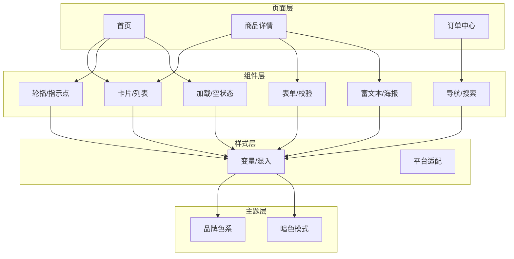

**图表来源**
- [pages.json:1-704](file://frontend/mall-uniapp/pages.json#L1-L704)
- [uni-card 包信息:1-91](file://frontend/mall-uniapp/uni_modules/uni-card/package.json#L1-L91)
- [uni-forms 包信息:1-91](file://frontend/mall-uniapp/uni_modules/uni-forms/package.json#L1-L91)
- [uni-search-bar 包信息:1-89](file://frontend/mall-uniapp/uni_modules/uni-search-bar/package.json#L1-L89)
- [uni-nav-bar 包信息:1-89](file://frontend/mall-uniapp/uni_modules/uni-nav-bar/package.json#L1-L89)
- [uni-swiper-dot 包信息:1-87](file://frontend/mall-uniapp/uni_modules/uni-swiper-dot/package.json#L1-L87)
- [uni-load-more 包信息:1-86](file://frontend/mall-uniapp/uni_modules/uni-load-more/package.json#L1-L86)
- [uni-tag 包信息:1-87](file://frontend/mall-uniapp/uni_modules/uni-tag/package.json#L1-L87)
- [uni-transition 包信息:1-87](file://frontend/mall-uniapp/uni_modules/uni-transition/package.json#L1-L87)
- [uni-badge 包信息:1-85](file://frontend/mall-uniapp/uni_modules/uni-badge/package.json#L1-L85)
- [mp-html 包信息:1-76](file://frontend/mall-uniapp/uni_modules/mp-html/package.json#L1-L76)
- [lime-painter 包信息:1-94](file://frontend/mall-uniapp/uni_modules/lime-painter/package.json#L1-L94)

## 组件详解

### 商品卡片（Card）
- 设计目标：统一商品信息展示，支持图片、标题、价格、标签、操作区。
- 属性建议：图片、标题、价格、标签集合、销量、收藏状态、操作按钮集合。
- 事件建议：点击、加入购物车、收藏切换、更多菜单。
- 样式建议：圆角、阴影、间距、对齐、响应式断点。
- 复用策略：抽象基础卡片，衍生“促销”“拼团”“秒杀”等变体卡片。

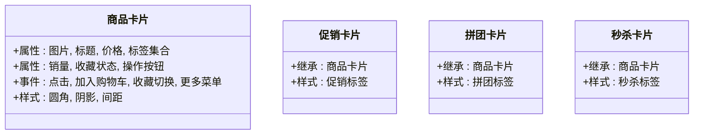

**图表来源**
- [uni-card 包信息:1-91](file://frontend/mall-uniapp/uni_modules/uni-card/package.json#L1-L91)

**章节来源**
- [uni-card 包信息:1-91](file://frontend/mall-uniapp/uni_modules/uni-card/package.json#L1-L91)

### 轮播图与指示点（Swiper + SwiperDot）
- 设计目标：图片轮播与指示点样式统一，支持多种指示形态。
- 属性建议：图片数组、指示点位置与形状、自动播放、循环、点击回调。
- 事件建议：切换完成、点击项。
- 样式建议：指示点尺寸、颜色、激活态、间距。
- 性能建议：懒加载、预加载、避免频繁重排。

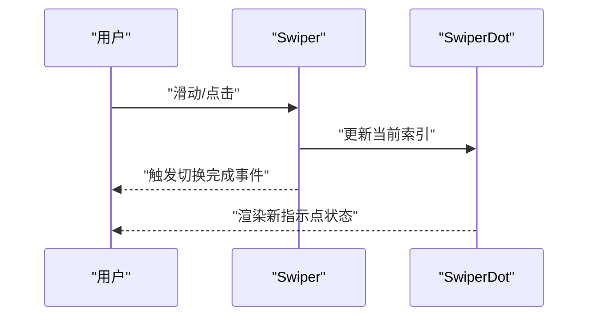

**图表来源**
- [uni-swiper-dot 包信息:1-87](file://frontend/mall-uniapp/uni_modules/uni-swiper-dot/package.json#L1-L87)

**章节来源**
- [uni-swiper-dot 包信息:1-87](file://frontend/mall-uniapp/uni_modules/uni-swiper-dot/package.json#L1-L87)

### 分类导航（NavBar + Grid）
- 设计目标：顶部导航与分类宫格，兼顾信息密度与点击效率。
- 属性建议：标题、返回按钮、胶囊/按钮样式；宫格行列数、图标、标题、点击回调。
- 事件建议：返回、点击分类项。
- 样式建议：胶囊高度、宫格间距、图标尺寸、选中态。

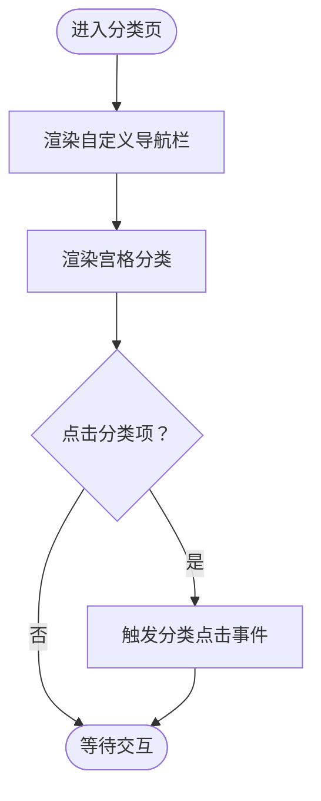

**图表来源**
- [uni-nav-bar 包信息:1-89](file://frontend/mall-uniapp/uni_modules/uni-nav-bar/package.json#L1-L89)
- [uni-grid 包信息:1-87](file://frontend/mall-uniapp/uni_modules/uni-grid/package.json#L1-L87)

**章节来源**
- [uni-nav-bar 包信息:1-89](file://frontend/mall-uniapp/uni_modules/uni-nav-bar/package.json#L1-L89)
- [uni-grid 包信息:1-87](file://frontend/mall-uniapp/uni_modules/uni-grid/package.json#L1-L87)

### 搜索框（SearchBar）
- 设计目标：关键词输入、清空、历史、快捷入口。
- 属性建议：占位符、清空按钮、历史记录、取消按钮。
- 事件建议：输入、清空、取消、搜索提交。
- 样式建议：圆角、内边距、图标尺寸、键盘弹起适配。

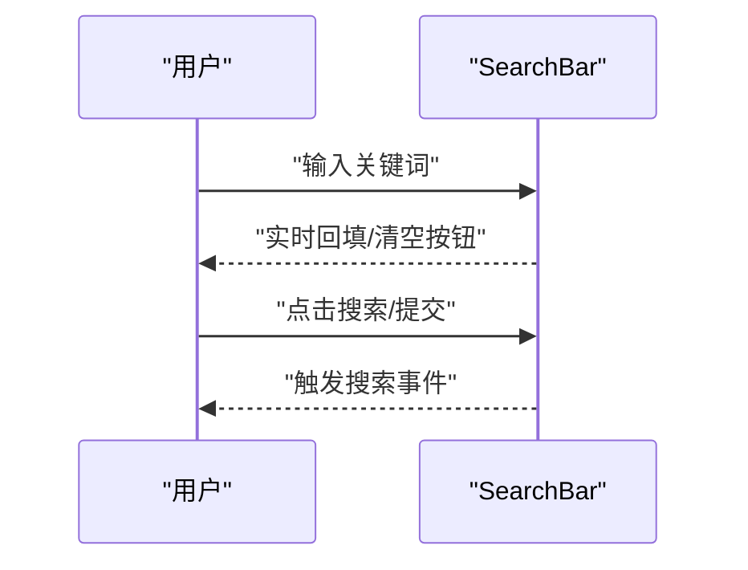

**图表来源**
- [uni-search-bar 包信息:1-89](file://frontend/mall-uniapp/uni_modules/uni-search-bar/package.json#L1-L89)

**章节来源**
- [uni-search-bar 包信息:1-89](file://frontend/mall-uniapp/uni_modules/uni-search-bar/package.json#L1-L89)

### 弹窗（Transition + Badge/Tag）
- 设计目标：遮罩层、动画过渡、内容区隔离。
- 属性建议：显示/隐藏、遮罩点击关闭、动画类型、内容区样式。
- 事件建议：打开/关闭、遮罩点击。
- 样式建议：z-index、动画缓动、内容区圆角与阴影。

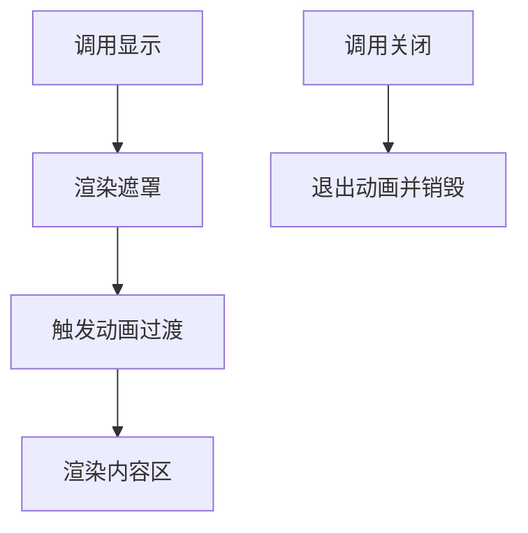

**图表来源**
- [uni-transition 包信息:1-87](file://frontend/mall-uniapp/uni_modules/uni-transition/package.json#L1-L87)
- [uni-badge 包信息:1-85](file://frontend/mall-uniapp/uni_modules/uni-badge/package.json#L1-L85)
- [uni-tag 包信息:1-87](file://frontend/mall-uniapp/uni_modules/uni-tag/package.json#L1-L87)

**章节来源**
- [uni-transition 包信息:1-87](file://frontend/mall-uniapp/uni_modules/uni-transition/package.json#L1-L87)
- [uni-badge 包信息:1-85](file://frontend/mall-uniapp/uni_modules/uni-badge/package.json#L1-L85)
- [uni-tag 包信息:1-87](file://frontend/mall-uniapp/uni_modules/uni-tag/package.json#L1-L87)

### 表单（Forms）
- 设计目标：输入、选择、校验、联动。
- 属性建议：模型对象、规则集、布局、标签宽度。
- 事件建议：输入变更、校验结果、提交。
- 样式建议：必填星号、错误提示、禁用态。

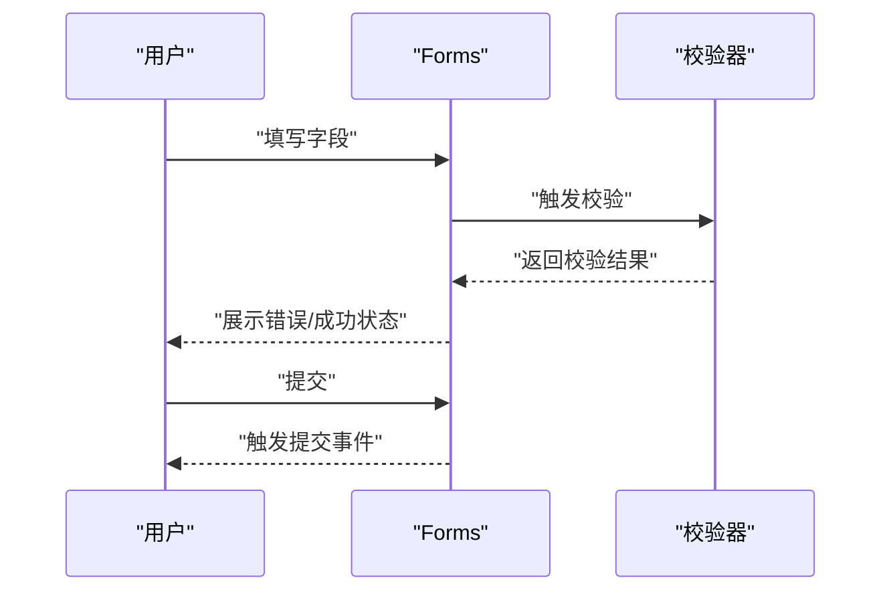

**图表来源**
- [uni-forms 包信息:1-91](file://frontend/mall-uniapp/uni_modules/uni-forms/package.json#L1-L91)

**章节来源**
- [uni-forms 包信息:1-91](file://frontend/mall-uniapp/uni_modules/uni-forms/package.json#L1-L91)

### 加载与空状态（LoadMore + 空状态模板）
- 设计目标：长列表滚动加载与空状态占位。
- 属性建议：状态（加载中/结束/无数据）、文案、图标。
- 事件建议：加载更多。
- 样式建议：底部留白、图标尺寸、文案颜色。

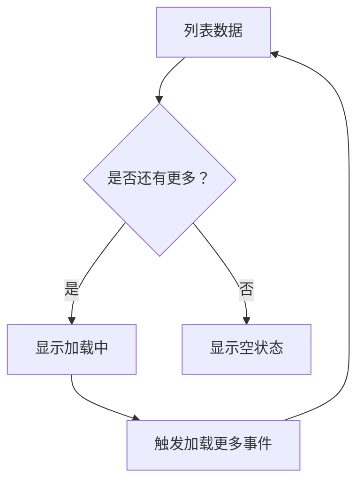

**图表来源**
- [uni-load-more 包信息:1-86](file://frontend/mall-uniapp/uni_modules/uni-load-more/package.json#L1-L86)

**章节来源**
- [uni-load-more 包信息:1-86](file://frontend/mall-uniapp/uni_modules/uni-load-more/package.json#L1-L86)

### 富文本与海报（mp-html + lime-painter）
- 设计目标：商品详情富文本渲染与海报生成分享。
- 属性建议：富文本 HTML、图片懒加载、链接处理；海报 JSON 结构、尺寸、保存。
- 事件建议：图片加载完成、海报生成完成。
- 样式建议：字体、行高、图片最大宽高、容器内边距。

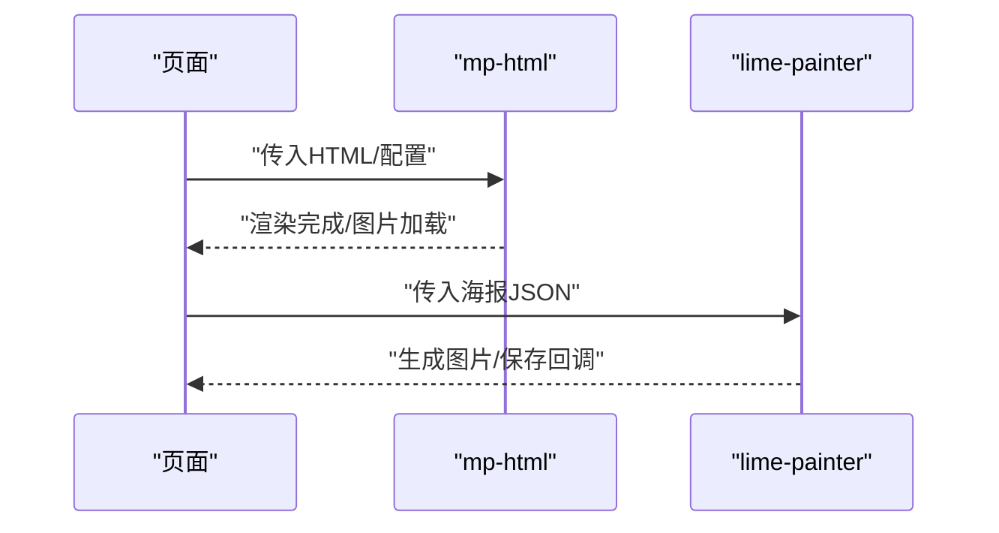

**图表来源**
- [mp-html 包信息:1-76](file://frontend/mall-uniapp/uni_modules/mp-html/package.json#L1-L76)
- [lime-painter 包信息:1-94](file://frontend/mall-uniapp/uni_modules/lime-painter/package.json#L1-L94)

**章节来源**
- [mp-html 包信息:1-76](file://frontend/mall-uniapp/uni_modules/mp-html/package.json#L1-L76)
- [lime-painter 包信息:1-94](file://frontend/mall-uniapp/uni_modules/lime-painter/package.json#L1-L94)

## 依赖关系分析
- 组件依赖：部分组件声明了 uni-scss、uni-icons 等依赖，确保样式与图标的一致性。
- 平台兼容：各组件包声明了小程序、H5、App 等平台支持情况，便于按需启用。
- 页面注册：pages.json 的 easycom 规则自动扫描与命名映射，降低手动注册成本。

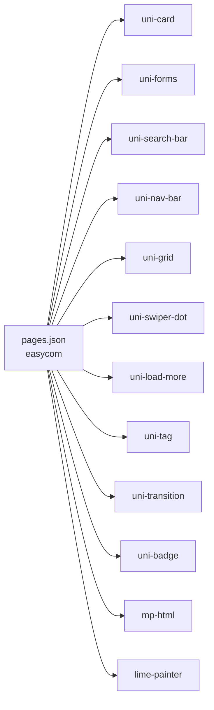

**图表来源**
- [pages.json:1-704](file://frontend/mall-uniapp/pages.json#L1-L704)
- [uni-card 包信息:1-91](file://frontend/mall-uniapp/uni_modules/uni-card/package.json#L1-L91)
- [uni-forms 包信息:1-91](file://frontend/mall-uniapp/uni_modules/uni-forms/package.json#L1-L91)
- [uni-search-bar 包信息:1-89](file://frontend/mall-uniapp/uni_modules/uni-search-bar/package.json#L1-L89)
- [uni-nav-bar 包信息:1-89](file://frontend/mall-uniapp/uni_modules/uni-nav-bar/package.json#L1-L89)
- [uni-grid 包信息:1-87](file://frontend/mall-uniapp/uni_modules/uni-grid/package.json#L1-L87)
- [uni-swiper-dot 包信息:1-87](file://frontend/mall-uniapp/uni_modules/uni-swiper-dot/package.json#L1-L87)
- [uni-load-more 包信息:1-86](file://frontend/mall-uniapp/uni_modules/uni-load-more/package.json#L1-L86)
- [uni-tag 包信息:1-87](file://frontend/mall-uniapp/uni_modules/uni-tag/package.json#L1-L87)
- [uni-transition 包信息:1-87](file://frontend/mall-uniapp/uni_modules/uni-transition/package.json#L1-L87)
- [uni-badge 包信息:1-85](file://frontend/mall-uniapp/uni_modules/uni-badge/package.json#L1-L85)
- [mp-html 包信息:1-76](file://frontend/mall-uniapp/uni_modules/mp-html/package.json#L1-L76)
- [lime-painter 包信息:1-94](file://frontend/mall-uniapp/uni_modules/lime-painter/package.json#L1-L94)

**章节来源**
- [pages.json:1-704](file://frontend/mall-uniapp/pages.json#L1-L704)
- [uni-card 包信息:1-91](file://frontend/mall-uniapp/uni_modules/uni-card/package.json#L1-L91)
- [uni-forms 包信息:1-91](file://frontend/mall-uniapp/uni_modules/uni-forms/package.json#L1-L91)
- [uni-search-bar 包信息:1-89](file://frontend/mall-uniapp/uni_modules/uni-search-bar/package.json#L1-L89)
- [uni-nav-bar 包信息:1-89](file://frontend/mall-uniapp/uni_modules/uni-nav-bar/package.json#L1-L89)
- [uni-grid 包信息:1-87](file://frontend/mall-uniapp/uni_modules/uni-grid/package.json#L1-L87)
- [uni-swiper-dot 包信息:1-87](file://frontend/mall-uniapp/uni_modules/uni-swiper-dot/package.json#L1-L87)
- [uni-load-more 包信息:1-86](file://frontend/mall-uniapp/uni_modules/uni-load-more/package.json#L1-L86)
- [uni-tag 包信息:1-87](file://frontend/mall-uniapp/uni_modules/uni-tag/package.json#L1-L87)
- [uni-transition 包信息:1-87](file://frontend/mall-uniapp/uni_modules/uni-transition/package.json#L1-L87)
- [uni-badge 包信息:1-85](file://frontend/mall-uniapp/uni_modules/uni-badge/package.json#L1-L85)
- [mp-html 包信息:1-76](file://frontend/mall-uniapp/uni_modules/mp-html/package.json#L1-L76)
- [lime-painter 包信息:1-94](file://frontend/mall-uniapp/uni_modules/lime-painter/package.json#L1-L94)

## 性能考量
- 组件懒加载：对非首屏组件采用动态导入，减少初始包体。
- 列表虚拟化：长列表使用虚拟滚动或分页加载，避免一次性渲染过多节点。
- 图片优化：富文本图片懒加载、尺寸裁剪、格式选择 WebP。
- 动画与过渡：合理使用过渡组件，避免复杂动画造成掉帧。
- 缓存策略：本地缓存搜索历史、分类筛选条件，减少重复请求。
- 平台差异：针对小程序与 H5 的渲染差异进行差异化优化。

## 故障排查指南
- 组件不生效
  - 检查 pages.json 中的 easycom 规则与组件命名是否一致。
  - 确认组件包已正确安装并在 manifest.json 中启用。
- 样式异常
  - 检查 uni-scss 变量是否被覆盖，平台样式隔离是否正确。
  - 确认主题切换逻辑未误删关键样式类。
- 事件未触发
  - 核对事件绑定与冒泡阻止逻辑，避免被父级拦截。
  - 对于表单组件，检查校验规则与模型对象是否同步。
- 性能问题
  - 使用开发者工具分析渲染耗时，定位重排/重绘热点。
  - 对长列表进行分页或虚拟化处理。

## 结论
本组件库以 uni-app 为基础，结合 uni-ui 与第三方组件，形成覆盖电商核心场景的组件矩阵。通过统一的属性与事件设计、样式变量体系与主题切换机制，实现跨端一致性与高复用性。建议在实际项目中遵循本文档的开发规范与优化策略，持续沉淀组件能力与最佳实践。

## 附录
- 开发规范
  - 命名规范：组件名采用语义化前缀（如 s-），属性与事件采用驼峰命名。
  - 文档规范：每个组件提供属性表、事件表、使用示例与注意事项。
  - 版本管理：组件升级遵循语义化版本，破坏性变更需标注。
- 复用策略
  - 抽象通用能力，提供可配置的外观与行为开关。
  - 封装业务变体，保持接口一致，内部差异化处理。
- 主题与样式
  - 基于 uni-scss 变量体系，统一色板、字号、间距、圆角。
  - 支持明暗主题切换，优先使用系统级暗色模式。