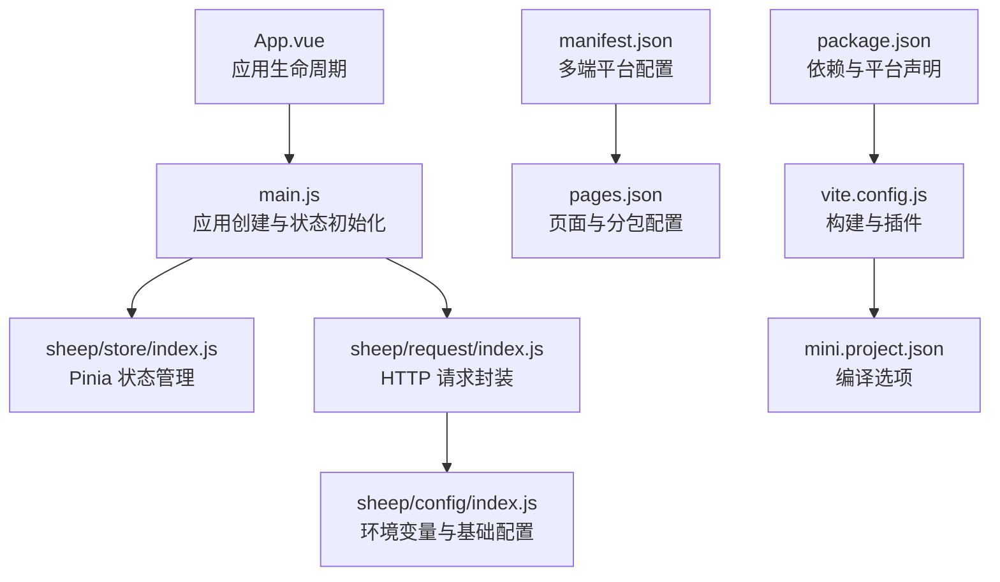
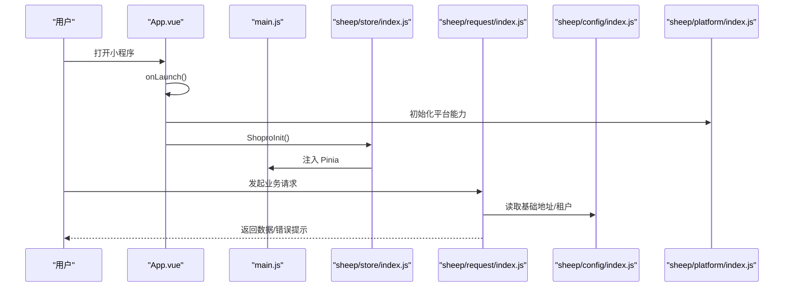
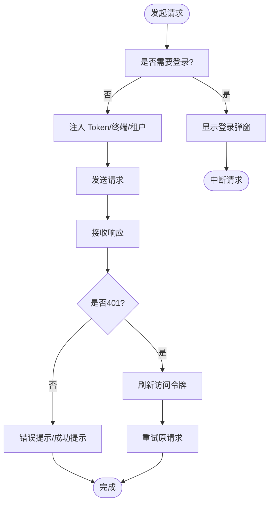
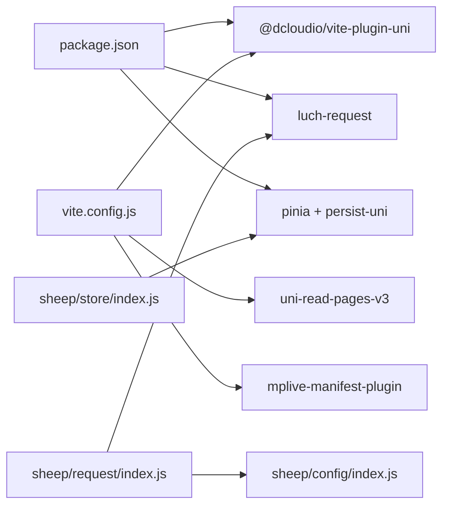

# 项目配置与基础设置

<cite>
**本文档引用的文件**
- [manifest.json](file://frontend/mall-uniapp/manifest.json)
- [pages.json](file://frontend/mall-uniapp/pages.json)
- [App.vue](file://frontend/mall-uniapp/App.vue)
- [main.js](file://frontend/mall-uniapp/main.js)
- [mini.project.json](file://frontend/mall-uniapp/mini.project.json)
- [sheep/config/index.js](file://frontend/mall-uniapp/sheep/config/index.js)
- [sheep/platform/index.js](file://frontend/mall-uniapp/sheep/platform/index.js)
- [sheep/request/index.js](file://frontend/mall-uniapp/sheep/request/index.js)
- [sheep/store/index.js](file://frontend/mall-uniapp/sheep/store/index.js)
- [package.json](file://frontend/mall-uniapp/package.json)
- [vite.config.js](file://frontend/mall-uniapp/vite.config.js)
</cite>

## 目录
1. [简介](#简介)
2. [项目结构](#项目结构)
3. [核心组件](#核心组件)
4. [架构总览](#架构总览)
5. [详细组件分析](#详细组件分析)
6. [依赖关系分析](#依赖关系分析)
7. [性能考虑](#性能考虑)
8. [故障排除指南](#故障排除指南)
9. [结论](#结论)
10. [附录](#附录)

## 简介
本文件面向电商小程序项目，系统化梳理项目初始化、配置文件设置与页面路由配置，重点覆盖以下方面：
- manifest.json 小程序平台特性与多端配置
- pages.json 页面与分包配置、导航栏与 TabBar 设置
- 小程序生命周期与条件编译实践
- 平台 API 调用与第三方 SDK 集成
- 开发工具使用、调试技巧与发布流程
- 开发环境搭建、最佳实践与常见问题

## 项目结构
电商小程序采用 uni-app 多端统一工程，前端目录 frontend/mall-uniapp 包含核心配置与运行入口：
- 应用入口与生命周期：App.vue、main.js
- 配置文件：manifest.json、pages.json、mini.project.json、vite.config.js、package.json
- 平台能力与请求封装：sheep/platform/index.js、sheep/request/index.js、sheep/config/index.js、sheep/store/index.js

**图表来源**
- [App.vue:1-33](file://frontend/mall-uniapp/App.vue#L1-L33)
- [main.js:1-16](file://frontend/mall-uniapp/main.js#L1-L16)
- [sheep/store/index.js:1-21](file://frontend/mall-uniapp/sheep/store/index.js#L1-L21)
- [sheep/request/index.js:1-311](file://frontend/mall-uniapp/sheep/request/index.js#L1-L311)
- [sheep/config/index.js:1-32](file://frontend/mall-uniapp/sheep/config/index.js#L1-L32)
- [manifest.json:1-225](file://frontend/mall-uniapp/manifest.json#L1-L225)
- [pages.json:1-704](file://frontend/mall-uniapp/pages.json#L1-L704)
- [vite.config.js:1-35](file://frontend/mall-uniapp/vite.config.js#L1-L35)
- [mini.project.json:1-9](file://frontend/mall-uniapp/mini.project.json#L1-L9)
- [package.json:1-104](file://frontend/mall-uniapp/package.json#L1-L104)

**章节来源**
- [manifest.json:1-225](file://frontend/mall-uniapp/manifest.json#L1-L225)
- [pages.json:1-704](file://frontend/mall-uniapp/pages.json#L1-L704)
- [App.vue:1-33](file://frontend/mall-uniapp/App.vue#L1-L33)
- [main.js:1-16](file://frontend/mall-uniapp/main.js#L1-L16)
- [mini.project.json:1-9](file://frontend/mall-uniapp/mini.project.json#L1-L9)
- [vite.config.js:1-35](file://frontend/mall-uniapp/vite.config.js#L1-L35)
- [package.json:1-104](file://frontend/mall-uniapp/package.json#L1-L104)

## 核心组件
- 应用入口与生命周期：在 App.vue 中注册 onLaunch/onShow 等生命周期，隐藏原生 TabBar 并初始化底层依赖。
- 应用创建：main.js 通过 createSSRApp 创建应用并挂载 Pinia。
- 配置中心：sheep/config/index.js 从环境变量读取基础地址、API 路径、静态资源等。
- 平台适配：sheep/platform/index.js 统一封装微信/支付宝/Apple/H5/App 等平台能力检测与调用。
- 请求封装：sheep/request/index.js 提供统一拦截器、鉴权、错误处理与 Token 刷新策略。
- 状态管理：sheep/store/index.js 自动注入各模块 Store，并启用持久化。

**章节来源**
- [App.vue:1-33](file://frontend/mall-uniapp/App.vue#L1-L33)
- [main.js:1-16](file://frontend/mall-uniapp/main.js#L1-L16)
- [sheep/config/index.js:1-32](file://frontend/mall-uniapp/sheep/config/index.js#L1-L32)
- [sheep/platform/index.js:1-193](file://frontend/mall-uniapp/sheep/platform/index.js#L1-L193)
- [sheep/request/index.js:1-311](file://frontend/mall-uniapp/sheep/request/index.js#L1-L311)
- [sheep/store/index.js:1-21](file://frontend/mall-uniapp/sheep/store/index.js#L1-L21)

## 架构总览
下图展示从应用启动到页面渲染的关键路径，以及平台能力与请求层的交互：

**图表来源**
- [App.vue:1-33](file://frontend/mall-uniapp/App.vue#L1-L33)
- [main.js:1-16](file://frontend/mall-uniapp/main.js#L1-L16)
- [sheep/store/index.js:1-21](file://frontend/mall-uniapp/sheep/store/index.js#L1-L21)
- [sheep/request/index.js:1-311](file://frontend/mall-uniapp/sheep/request/index.js#L1-L311)
- [sheep/config/index.js:1-32](file://frontend/mall-uniapp/sheep/config/index.js#L1-L32)
- [sheep/platform/index.js:1-193](file://frontend/mall-uniapp/sheep/platform/index.js#L1-L193)

## 详细组件分析

### manifest.json 配置详解
- 基础信息：名称、版本号、描述、多语言回退等。
- app-plus（App 端）：组件化、nvue 编译器版本、启动屏、安全区域、模块权限、分发配置（Android/iOS 权限、隐私说明、Universal Links、IDFA）、图标资源。
- 各小程序平台：微信、支付宝、百度、头条、京东等平台的 setting、optimization、usingComponents 等。
- H5：路由模式、SDK 配置、异步加载超时、标题优化与 Tree Shaking。
- Vue 版本与本地化。

建议关注点：
- Android 权限清单与隐私说明需与实际业务一致。
- iOS Universal Links 与关联域名需正确配置以支持深度链接。
- 微信小程序 setting 中 urlCheck、压缩与 PostCSS 优化按需开启。
- H5 的 tree shaking 与异步加载可显著减小包体。

**章节来源**
- [manifest.json:1-225](file://frontend/mall-uniapp/manifest.json#L1-L225)

### pages.json 页面与分包配置
- pages：根页面集合，包含导航栏标题、下拉刷新等样式与 meta 信息（如权限、同步、分组）。
- subPackages：按模块拆分子包，减少首屏体积，提升加载速度。
- globalStyle：全局导航栏样式与部分平台（如支付宝）特有配置。
- tabBar：底部 Tab 列表，对应页面路径。

最佳实践：
- 将高频访问页面置于根包，低频页面放入子包。
- meta 字段可用于权限控制与页面分组统计。
- 导航栏样式与平台差异配置需在对应平台段落中维护。

**章节来源**
- [pages.json:1-704](file://frontend/mall-uniapp/pages.json#L1-L704)

### 小程序生命周期与条件编译
- 生命周期：onLaunch（应用启动）、onShow（应用显示）、onError（错误捕获）等。
- 条件编译：通过 #ifdef/#ifndef 区分 H5、APP-PLUS、MP-WEIXIN、MP-ALIPAY 等平台，实现差异化逻辑。
- 平台检测：sheep/platform/index.js 统一识别当前运行平台，加载对应 SDK 与能力。

使用建议：
- 在 App.vue 中集中处理平台差异初始化。
- 将平台特定 API 调用封装在平台模块中，避免散落在业务代码。

**章节来源**
- [App.vue:1-33](file://frontend/mall-uniapp/App.vue#L1-L33)
- [sheep/platform/index.js:1-193](file://frontend/mall-uniapp/sheep/platform/index.js#L1-L193)

### 平台 API 调用与第三方 SDK
- 平台能力：网络检测、胶囊按钮尺寸、标题栏高度、落地页、微信客户端安装检测等。
- 支付与分享：Pay 与 share 模块抽象，统一跨平台调用。
- 第三方 SDK：微信 JS-SDK、支付 SDK、OAuth 等在 manifest.json 中配置，平台模块按需加载。

注意：
- iOS 微信安装检测用于 App 上架合规性。
- H5 环境下的微信浏览器检测用于公众号场景签名与兼容处理。

**章节来源**
- [sheep/platform/index.js:1-193](file://frontend/mall-uniapp/sheep/platform/index.js#L1-L193)
- [manifest.json:1-225](file://frontend/mall-uniapp/manifest.json#L1-L225)

### 请求封装与鉴权
- 统一拦截器：请求前注入 Token、终端类型、租户 ID；响应后处理 401 刷新、错误提示与成功提示。
- Token 刷新：无感刷新策略，避免重复登录对用户体验的影响。
- 平台差异：App 端禁用 SSL 校验，H5 端跨域配置按需开启。

关键流程如下：

**图表来源**
- [sheep/request/index.js:1-311](file://frontend/mall-uniapp/sheep/request/index.js#L1-L311)

**章节来源**
- [sheep/request/index.js:1-311](file://frontend/mall-uniapp/sheep/request/index.js#L1-L311)

### 环境变量与构建配置
- 环境变量：通过 Vite loadEnv 读取以 SHOPRO_ 前缀的变量，如基础地址、API 路径、端口等。
- 构建插件：uni 插件、页面扫描插件、小程序直播插件等。
- 编译选项：mini.project.json 控制 component2、Node 模块转译与全局对象模式。

**章节来源**
- [vite.config.js:1-35](file://frontend/mall-uniapp/vite.config.js#L1-L35)
- [sheep/config/index.js:1-32](file://frontend/mall-uniapp/sheep/config/index.js#L1-L32)
- [mini.project.json:1-9](file://frontend/mall-uniapp/mini.project.json#L1-L9)

## 依赖关系分析
- package.json 声明 uni-app 生态依赖与平台支持范围。
- sheep/request 依赖 luch-request、sheep/config 与平台信息。
- sheep/store 依赖 Pinia 与持久化插件。
- vite.config 依赖 @dcloudio/vite-plugin-uni 与自研插件。

**图表来源**
- [package.json:1-104](file://frontend/mall-uniapp/package.json#L1-L104)
- [vite.config.js:1-35](file://frontend/mall-uniapp/vite.config.js#L1-L35)
- [sheep/request/index.js:1-311](file://frontend/mall-uniapp/sheep/request/index.js#L1-L311)
- [sheep/store/index.js:1-21](file://frontend/mall-uniapp/sheep/store/index.js#L1-L21)

**章节来源**
- [package.json:1-104](file://frontend/mall-uniapp/package.json#L1-L104)
- [vite.config.js:1-35](file://frontend/mall-uniapp/vite.config.js#L1-L35)
- [sheep/request/index.js:1-311](file://frontend/mall-uniapp/sheep/request/index.js#L1-L311)
- [sheep/store/index.js:1-21](file://frontend/mall-uniapp/sheep/store/index.js#L1-L21)

## 性能考虑
- 分包策略：将非首屏页面放入子包，结合 pages.json 的 subPackages 配置降低首屏加载时间。
- H5 优化：开启 tree shaking 与异步加载，合理拆分代码。
- App 端：禁用 SSL 校验仅在开发阶段使用，生产环境建议开启校验。
- 请求层：统一超时与重试策略，避免频繁请求导致卡顿。
- 图标与资源：按平台提供多分辨率图标，减少缩放带来的性能损耗。

## 故障排除指南
- 网络异常：通过平台模块的网络检测函数判断网络状态，必要时提示用户检查网络。
- 401 未授权：触发无感刷新令牌流程，若失败则引导登录或退出。
- 平台不支持：当无法识别平台时，统一提示“暂不支持该平台”，便于定位问题。
- H5 微信浏览器：公众号场景需确保落地页与签名配置正确，避免分享与 JS-SDK 功能异常。

**章节来源**
- [sheep/platform/index.js:1-193](file://frontend/mall-uniapp/sheep/platform/index.js#L1-L193)
- [sheep/request/index.js:1-311](file://frontend/mall-uniapp/sheep/request/index.js#L1-L311)

## 结论
本项目通过规范化的配置文件与模块化封装，实现了多端一致的开发体验与稳定的运行表现。建议在后续迭代中持续完善：
- 补充开发环境变量示例文件，明确各环境的基础地址与端口。
- 对接小程序审核与发布流程，确保 manifest.json 中的隐私与权限声明完整准确。
- 建立平台能力白名单与条件编译规范，减少平台差异带来的维护成本。

## 附录
- 开发工具与调试：使用 uni-app 开发工具进行真机预览与调试，结合 vconsole 在 H5 环境辅助排查。
- 发布流程：按平台要求准备证书、图标与隐私说明，确保 manifest.json 与 pages.json 配置与实际业务一致。