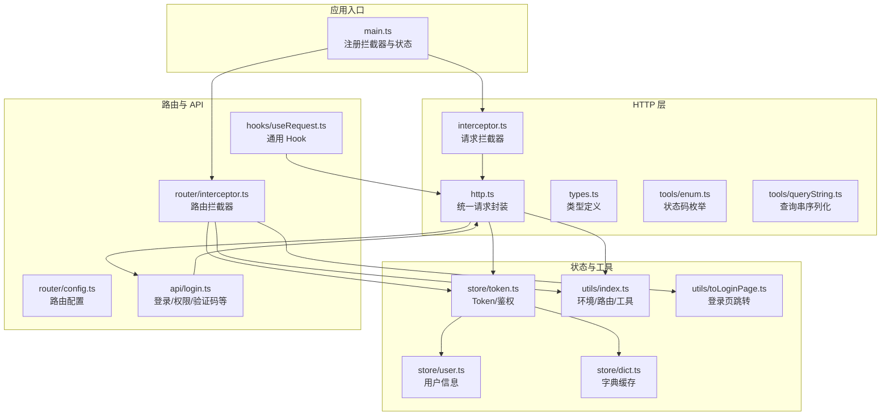
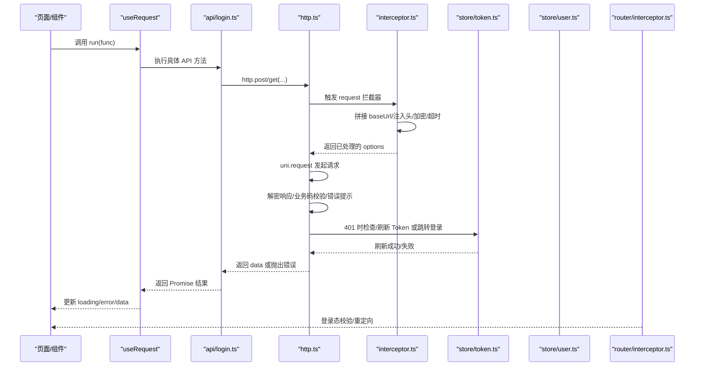
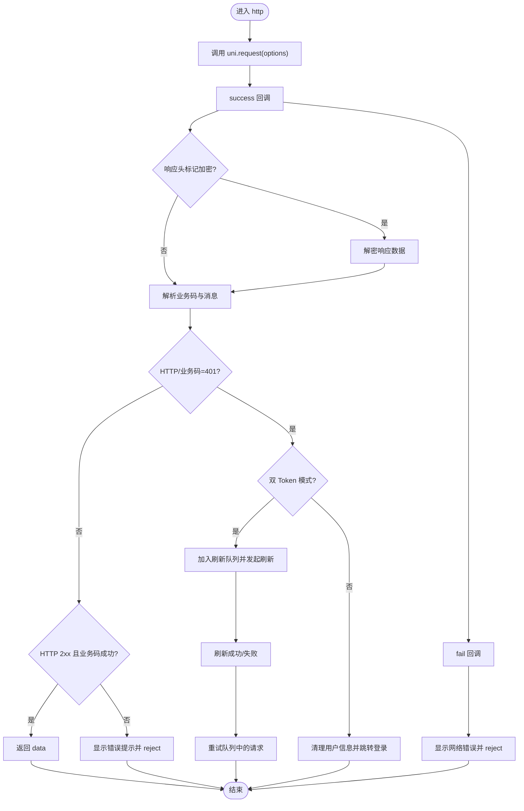
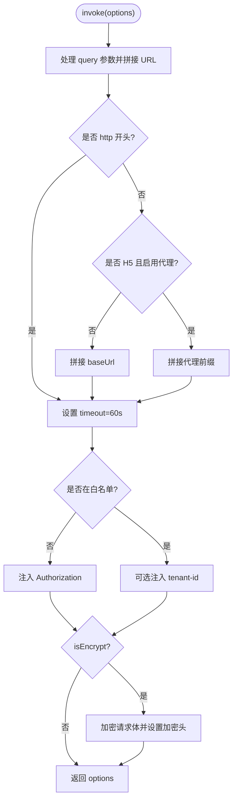
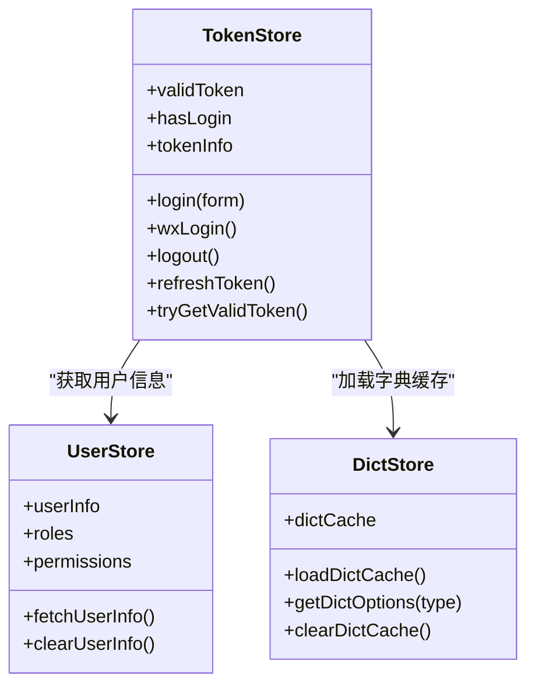
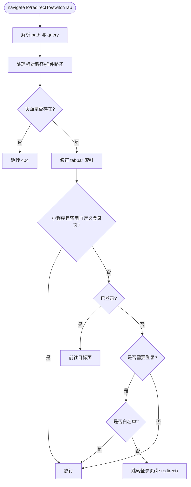
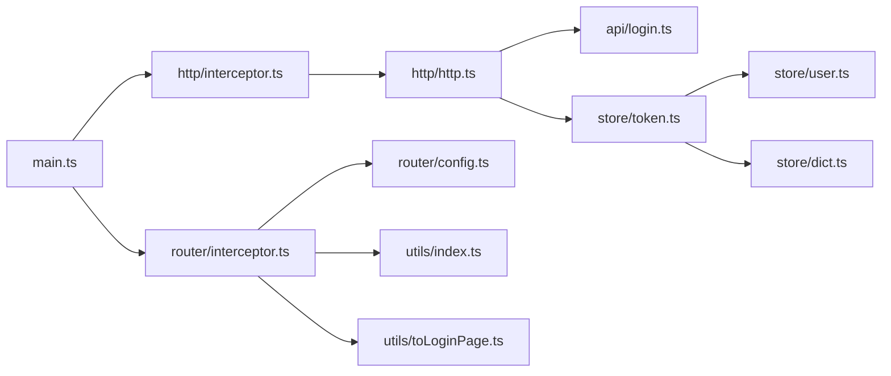

# API 接口集成

<cite>
**本文引用的文件**
- [http.ts](file://frontend/admin-uniapp/src/http/http.ts)
- [interceptor.ts](file://frontend/admin-uniapp/src/http/interceptor.ts)
- [types.ts](file://frontend/admin-uniapp/src/http/types.ts)
- [enum.ts](file://frontend/admin-uniapp/src/http/tools/enum.ts)
- [queryString.ts](file://frontend/admin-uniapp/src/http/tools/queryString.ts)
- [useRequest.ts](file://frontend/admin-uniapp/src/hooks/useRequest.ts)
- [token.ts](file://frontend/admin-uniapp/src/store/token.ts)
- [user.ts](file://frontend/admin-uniapp/src/store/user.ts)
- [dict.ts](file://frontend/admin-uniapp/src/store/dict.ts)
- [toLoginPage.ts](file://frontend/admin-uniapp/src/utils/toLoginPage.ts)
- [index.ts](file://frontend/admin-uniapp/src/utils/index.ts)
- [main.ts](file://frontend/admin-uniapp/src/main.ts)
- [login.ts](file://frontend/admin-uniapp/src/api/login.ts)
- [interceptor.ts](file://frontend/admin-uniapp/src/router/interceptor.ts)
- [config.ts](file://frontend/admin-uniapp/src/router/config.ts)
</cite>

## 目录
1. [简介](#简介)
2. [项目结构](#项目结构)
3. [核心组件](#核心组件)
4. [架构总览](#架构总览)
5. [详细组件分析](#详细组件分析)
6. [依赖关系分析](#依赖关系分析)
7. [性能考量](#性能考量)
8. [故障排查指南](#故障排查指南)
9. [结论](#结论)
10. [附录](#附录)

## 简介
本文件面向 UniApp 应用的 API 接口集成，系统性阐述网络请求封装、接口调用策略、数据处理方案，以及鉴权与 Token 管理、请求/响应拦截器、错误处理机制、跨端适配与性能优化、通用 Hook 与最佳实践。目标是帮助开发者快速理解并高效扩展 API 层，确保在多端（H5、小程序、App）环境下保持一致的行为与体验。

## 项目结构
前端采用模块化组织，API 层位于 http 子目录，配合 store（token/user/dict）、hooks（useRequest）、router（拦截器）与 utils（环境与工具函数）。应用入口在 main.ts 中注册拦截器与全局状态。

**图表来源**
- [main.ts:10-19](file://frontend/admin-uniapp/src/main.ts#L10-L19)
- [interceptor.ts:97-104](file://frontend/admin-uniapp/src/http/interceptor.ts#L97-L104)
- [interceptor.ts:19-94](file://frontend/admin-uniapp/src/http/interceptor.ts#L19-L94)
- [http.ts:14-152](file://frontend/admin-uniapp/src/http/http.ts#L14-L152)
- [types.ts:4-42](file://frontend/admin-uniapp/src/http/types.ts#L4-L42)
- [enum.ts:1-69](file://frontend/admin-uniapp/src/http/tools/enum.ts#L1-L69)
- [queryString.ts:7-29](file://frontend/admin-uniapp/src/http/tools/queryString.ts#L7-L29)
- [token.ts:40-341](file://frontend/admin-uniapp/src/store/token.ts#L40-L341)
- [user.ts:17-89](file://frontend/admin-uniapp/src/store/user.ts#L17-L89)
- [dict.ts:18-86](file://frontend/admin-uniapp/src/store/dict.ts#L18-L86)
- [index.ts:120-175](file://frontend/admin-uniapp/src/utils/index.ts#L120-L175)
- [toLoginPage.ts:24-48](file://frontend/admin-uniapp/src/utils/toLoginPage.ts#L24-L48)
- [interceptor.ts:138-145](file://frontend/admin-uniapp/src/router/interceptor.ts#L138-L145)
- [config.ts:3-46](file://frontend/admin-uniapp/src/router/config.ts#L3-L46)
- [login.ts:66-148](file://frontend/admin-uniapp/src/api/login.ts#L66-L148)
- [useRequest.ts:26-54](file://frontend/admin-uniapp/src/hooks/useRequest.ts#L26-L54)

**章节来源**
- [main.ts:10-19](file://frontend/admin-uniapp/src/main.ts#L10-L19)
- [interceptor.ts:97-104](file://frontend/admin-uniapp/src/http/interceptor.ts#L97-L104)
- [http.ts:14-152](file://frontend/admin-uniapp/src/http/http.ts#L14-L152)

## 核心组件
- 统一请求封装：提供 http、httpGet、httpPost、httpPut、httpDelete 等方法，并内置响应解密、业务码校验、错误提示与 401 处理。
- 请求拦截器：自动拼接 baseUrl、注入 Authorization、租户标识、查询串拼接、API 加密、超时控制等。
- 响应处理：统一业务码 Success/401/4xx/5xx 处理，错误 Toast 提示，原始数据透传支持。
- 鉴权与 Token 管理：支持单/双 Token 模式，Token 过期检测、刷新队列、静默刷新、登出清理。
- 通用 Hook：useRequest 提供 loading/error/data/run 的统一请求流程封装。
- 路由拦截器：结合登录策略与白/黑名单，实现登录态校验与重定向。
- 工具与环境：环境基地址解析、页面路径解析、登录后跳转、防抖跳转登录等。

**章节来源**
- [http.ts:14-152](file://frontend/admin-uniapp/src/http/http.ts#L14-L152)
- [interceptor.ts:19-94](file://frontend/admin-uniapp/src/http/interceptor.ts#L19-L94)
- [types.ts:4-42](file://frontend/admin-uniapp/src/http/types.ts#L4-L42)
- [token.ts:40-341](file://frontend/admin-uniapp/src/store/token.ts#L40-L341)
- [useRequest.ts:26-54](file://frontend/admin-uniapp/src/hooks/useRequest.ts#L26-L54)
- [interceptor.ts:138-145](file://frontend/admin-uniapp/src/router/interceptor.ts#L138-L145)
- [index.ts:120-175](file://frontend/admin-uniapp/src/utils/index.ts#L120-L175)

## 架构总览
下图展示从页面调用 API 到最终渲染的关键交互链路，包括请求拦截、鉴权、响应处理、错误与登录态处理。

**图表来源**
- [useRequest.ts:33-47](file://frontend/admin-uniapp/src/hooks/useRequest.ts#L33-L47)
- [login.ts:76-88](file://frontend/admin-uniapp/src/api/login.ts#L76-L88)
- [http.ts:14-152](file://frontend/admin-uniapp/src/http/http.ts#L14-L152)
- [interceptor.ts:19-94](file://frontend/admin-uniapp/src/http/interceptor.ts#L19-L94)
- [token.ts:228-250](file://frontend/admin-uniapp/src/store/token.ts#L228-L250)
- [interceptor.ts:138-145](file://frontend/admin-uniapp/src/router/interceptor.ts#L138-L145)

## 详细组件分析

### 组件一：HTTP 工具类与请求封装
- 统一入口：http<T>() 返回 Promise，内部使用 uni.request，按平台差异设置 dataType/responseType。
- 响应处理：
  - 解密：若响应头标记加密，则对字符串响应进行解密。
  - 401 判定：HTTP 状态码或业务 code 为 401 时触发鉴权处理。
  - 成功分支：original 为真时返回原始数据；否则仅返回 data；业务码非成功时统一提示并 reject。
  - 失败分支：网络错误统一提示。
- 方法族：httpGet/httpPost/httpPut/httpDelete，以及 http.get/post/put/delete 与 axios 类似的 API。

**图表来源**
- [http.ts:14-152](file://frontend/admin-uniapp/src/http/http.ts#L14-L152)

**章节来源**
- [http.ts:14-152](file://frontend/admin-uniapp/src/http/http.ts#L14-L152)

### 组件二：请求拦截器配置
- 基础地址：优先使用环境变量，H5 下支持代理前缀拼接；非 H5 直接拼接 baseUrl。
- 查询串：支持在 options.query 中传入对象，自动序列化并拼接到 URL。
- 超时：统一设置为 60 秒。
- 认证头：根据白名单与有效 Token 注入 Authorization。
- 租户：开启租户开关时，注入 tenant-id。
- 加密：当 isEncrypt 为真时，对请求体加密并在请求头设置加密标识。
- 文件上传：同时拦截 uploadFile，复用同一拦截逻辑。

**图表来源**
- [interceptor.ts:19-94](file://frontend/admin-uniapp/src/http/interceptor.ts#L19-L94)
- [queryString.ts:7-29](file://frontend/admin-uniapp/src/http/tools/queryString.ts#L7-L29)

**章节来源**
- [interceptor.ts:19-94](file://frontend/admin-uniapp/src/http/interceptor.ts#L19-L94)
- [queryString.ts:7-29](file://frontend/admin-uniapp/src/http/tools/queryString.ts#L7-L29)

### 组件三：响应数据处理与错误处理
- 业务码：ResultEnum 统一成功/错误/未授权等状态码，兼容 0 与 200。
- 通用响应：IResponse 支持 message/msg 两种字段，便于后端兼容。
- 错误提示：默认显示 Toast，可通过 hideErrorToast 控制。
- 原始数据：original 为真时返回原始响应，适用于验证码等特殊接口。

**章节来源**
- [enum.ts:1-69](file://frontend/admin-uniapp/src/http/tools/enum.ts#L1-L69)
- [types.ts:14-25](file://frontend/admin-uniapp/src/http/types.ts#L14-L25)

### 组件四：鉴权管理与 Token 管理
- 模式：支持单 Token 与双 Token（access/refresh）模式，通过环境变量切换。
- 过期判断：基于本地存储的过期时间戳判断；双 Token 模式下以刷新 Token 是否过期为准。
- 登录流程：login/register/smsLogin/wxLogin 统一调用 _postLogin，设置 Token、拉取用户信息与字典缓存。
- 刷新：双 Token 模式下，401 时自动刷新并重试队列；刷新失败则跳转登录页。
- 退出：_logout 后清理本地存储、用户信息与字典缓存。

**图表来源**
- [token.ts:40-341](file://frontend/admin-uniapp/src/store/token.ts#L40-L341)
- [user.ts:17-89](file://frontend/admin-uniapp/src/store/user.ts#L17-L89)
- [dict.ts:18-86](file://frontend/admin-uniapp/src/store/dict.ts#L18-L86)

**章节来源**
- [token.ts:40-341](file://frontend/admin-uniapp/src/store/token.ts#L40-L341)
- [user.ts:17-89](file://frontend/admin-uniapp/src/store/user.ts#L17-L89)
- [dict.ts:18-86](file://frontend/admin-uniapp/src/store/dict.ts#L18-L86)

### 组件五：通用 Hook（useRequest）
- 功能：封装异步请求，提供 loading/error/data/run，支持 immediate 立即执行。
- 流程：run 调用时 loading=true，成功赋值 data 并清空错误，失败记录错误并抛出；finally 统一关闭 loading。

**章节来源**
- [useRequest.ts:26-54](file://frontend/admin-uniapp/src/hooks/useRequest.ts#L26-L54)

### 组件六：路由拦截器与登录策略
- 登录策略：白名单/黑名单两种模式，通过配置决定默认是否需要登录。
- 白名单：EXCLUDE_LOGIN_PATH_LIST 中的页面可免登录直通。
- 黑名单：除白名单外均需登录，未登录自动跳转登录页并携带 redirect。
- 小程序：可配置是否在小程序内使用 H5 登录页。
- 页面跳转：toLoginPage 带防抖，支持 navigateTo/reLaunch 与 redirect 参数。

**图表来源**
- [interceptor.ts:36-135](file://frontend/admin-uniapp/src/router/interceptor.ts#L36-L135)
- [config.ts:3-46](file://frontend/admin-uniapp/src/router/config.ts#L3-L46)
- [toLoginPage.ts:24-48](file://frontend/admin-uniapp/src/utils/toLoginPage.ts#L24-L48)

**章节来源**
- [interceptor.ts:36-135](file://frontend/admin-uniapp/src/router/interceptor.ts#L36-L135)
- [config.ts:3-46](file://frontend/admin-uniapp/src/router/config.ts#L3-L46)
- [toLoginPage.ts:24-48](file://frontend/admin-uniapp/src/utils/toLoginPage.ts#L24-L48)

### 组件七：跨端 API 调用与平台差异处理
- 平台差异：在 http.ts 中对非 H5 平台设置 responseType 为 json，确保跨端一致性。
- 环境基地址：getEnvBaseUrl 根据微信小程序的开发/体验/正式版动态选择不同后端地址。
- H5 代理：在 H5 且启用代理时，自动拼接代理前缀，便于开发联调。
- 导航栏高度：getNavbarHeight 根据平台差异返回不同导航高度，辅助 UI 适配。

**章节来源**
- [http.ts:20-22](file://frontend/admin-uniapp/src/http/http.ts#L20-L22)
- [index.ts:120-175](file://frontend/admin-uniapp/src/utils/index.ts#L120-L175)

### 组件八：API 示例与最佳实践
- 验证码：getCode/checkCaptcha 使用 original: true 返回原始数据。
- 登录/注册/短信登录：login/register/smsLogin 统一返回 IAuthLoginRes，随后调用 _postLogin。
- 权限信息：getAuthPermissionInfo 拉取用户角色/权限等信息。
- 最佳实践：
  - 统一通过 http.ts 发起请求，避免直接使用 uni.request。
  - 需要登录的页面使用路由拦截器保护。
  - 业务错误统一由 http.ts 的业务码处理，避免在业务层重复判断。
  - 双 Token 模式下，401 时无需手动处理，框架自动刷新并重试。
  - 需要特殊返回格式的接口使用 original: true。

**章节来源**
- [login.ts:66-148](file://frontend/admin-uniapp/src/api/login.ts#L66-L148)

## 依赖关系分析
- 入口依赖：main.ts 注册 request 与 route 拦截器。
- 请求链路：interceptor.ts → http.ts → api/login.ts → store/token.ts 与 utils/index.ts。
- 鉴权链路：store/token.ts 依赖 store/user.ts 与 store/dict.ts。
- 路由链路：router/interceptor.ts 依赖 router/config.ts 与 utils/index.ts、toLoginPage.ts。

**图表来源**
- [main.ts:10-19](file://frontend/admin-uniapp/src/main.ts#L10-L19)
- [interceptor.ts:97-104](file://frontend/admin-uniapp/src/http/interceptor.ts#L97-L104)
- [interceptor.ts:138-145](file://frontend/admin-uniapp/src/router/interceptor.ts#L138-L145)
- [http.ts:14-152](file://frontend/admin-uniapp/src/http/http.ts#L14-L152)
- [login.ts:66-148](file://frontend/admin-uniapp/src/api/login.ts#L66-L148)
- [token.ts:40-341](file://frontend/admin-uniapp/src/store/token.ts#L40-L341)
- [user.ts:17-89](file://frontend/admin-uniapp/src/store/user.ts#L17-L89)
- [dict.ts:18-86](file://frontend/admin-uniapp/src/store/dict.ts#L18-L86)
- [config.ts:3-46](file://frontend/admin-uniapp/src/router/config.ts#L3-L46)
- [index.ts:120-175](file://frontend/admin-uniapp/src/utils/index.ts#L120-L175)
- [toLoginPage.ts:24-48](file://frontend/admin-uniapp/src/utils/toLoginPage.ts#L24-L48)

**章节来源**
- [main.ts:10-19](file://frontend/admin-uniapp/src/main.ts#L10-L19)
- [interceptor.ts:97-104](file://frontend/admin-uniapp/src/http/interceptor.ts#L97-L104)
- [interceptor.ts:138-145](file://frontend/admin-uniapp/src/router/interceptor.ts#L138-L145)

## 性能考量
- 请求超时：统一 60 秒，避免长时间阻塞。
- 队列重试：双 Token 刷新期间将待重试请求入队，刷新完成后批量重试，减少重复请求。
- 本地缓存：Token 过期时间与用户/字典信息持久化，减少重复拉取。
- 跨端适配：按平台设置 responseType，避免不必要的转换开销。
- 体积优化：自定义 queryString 序列化，避免引入第三方库。

[本节为通用建议，不直接分析具体文件]

## 故障排查指南
- 登录态异常（频繁跳转登录页）
  - 检查是否启用双 Token 模式与刷新接口是否可用。
  - 查看刷新队列是否被正确清空，确认刷新失败后的兜底逻辑。
  - 参考：[token.ts:228-250](file://frontend/admin-uniapp/src/store/token.ts#L228-L250)，[http.ts:40-112](file://frontend/admin-uniapp/src/http/http.ts#L40-L112)
- 业务错误未提示
  - 确认 hideErrorToast 未被设为 true。
  - 检查后端返回的 msg/message 字段是否正确。
  - 参考：[http.ts:123-129](file://frontend/admin-uniapp/src/http/http.ts#L123-L129)，[types.ts:14-25](file://frontend/admin-uniapp/src/http/types.ts#L14-L25)
- H5 无法访问后端
  - 确认代理开关与代理前缀配置。
  - 参考：[interceptor.ts:34-42](file://frontend/admin-uniapp/src/http/interceptor.ts#L34-L42)
- 小程序环境基地址不正确
  - 检查微信小程序的 envVersion 与对应基地址映射。
  - 参考：[index.ts:120-149](file://frontend/admin-uniapp/src/utils/index.ts#L120-L149)
- 路由拦截未生效
  - 检查登录策略与白名单配置，确认 toLoginPage 的 queryString 传递。
  - 参考：[interceptor.ts:106-121](file://frontend/admin-uniapp/src/router/interceptor.ts#L106-L121)，[config.ts:33-40](file://frontend/admin-uniapp/src/router/config.ts#L33-L40)，[toLoginPage.ts:24-48](file://frontend/admin-uniapp/src/utils/toLoginPage.ts#L24-L48)

**章节来源**
- [token.ts:228-250](file://frontend/admin-uniapp/src/store/token.ts#L228-L250)
- [http.ts:40-112](file://frontend/admin-uniapp/src/http/http.ts#L40-L112)
- [http.ts:123-129](file://frontend/admin-uniapp/src/http/http.ts#L123-L129)
- [types.ts:14-25](file://frontend/admin-uniapp/src/http/types.ts#L14-L25)
- [interceptor.ts:34-42](file://frontend/admin-uniapp/src/http/interceptor.ts#L34-L42)
- [index.ts:120-149](file://frontend/admin-uniapp/src/utils/index.ts#L120-L149)
- [interceptor.ts:106-121](file://frontend/admin-uniapp/src/router/interceptor.ts#L106-L121)
- [config.ts:33-40](file://frontend/admin-uniapp/src/router/config.ts#L33-L40)
- [toLoginPage.ts:24-48](file://frontend/admin-uniapp/src/utils/toLoginPage.ts#L24-L48)

## 结论
该 API 集成方案以拦截器与统一请求封装为核心，结合鉴权与路由拦截，形成从请求到渲染的闭环。通过双 Token 模式与刷新队列机制，有效提升登录态稳定性；通过环境与平台差异处理，保障多端一致性。配合通用 Hook 与工具函数，可快速构建稳定、可维护的接口层。

[本节为总结性内容，不直接分析具体文件]

## 附录
- 关键类型与枚举
  - IResponse：统一响应结构，兼容 message/msg。
  - ResultEnum：业务码枚举，包含成功/错误/未授权等。
  - CustomRequestOptions：扩展 query、hideErrorToast、original、isEncrypt 等。
- 常用工具
  - stringifyQuery：轻量查询串序列化。
  - getEnvBaseUrl：按平台与环境动态选择基地址。
  - toLoginPage：带防抖的登录页跳转工具。

**章节来源**
- [types.ts:4-42](file://frontend/admin-uniapp/src/http/types.ts#L4-L42)
- [enum.ts:1-69](file://frontend/admin-uniapp/src/http/tools/enum.ts#L1-L69)
- [queryString.ts:7-29](file://frontend/admin-uniapp/src/http/tools/queryString.ts#L7-L29)
- [index.ts:120-175](file://frontend/admin-uniapp/src/utils/index.ts#L120-L175)
- [toLoginPage.ts:24-48](file://frontend/admin-uniapp/src/utils/toLoginPage.ts#L24-L48)