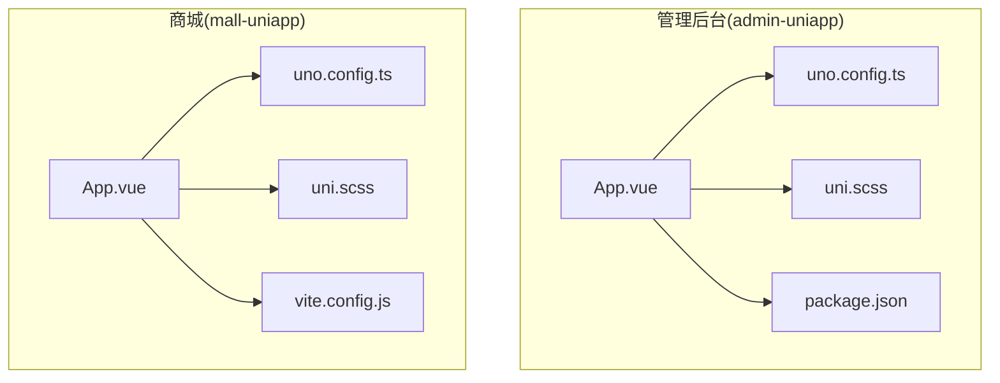
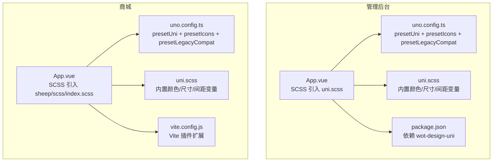
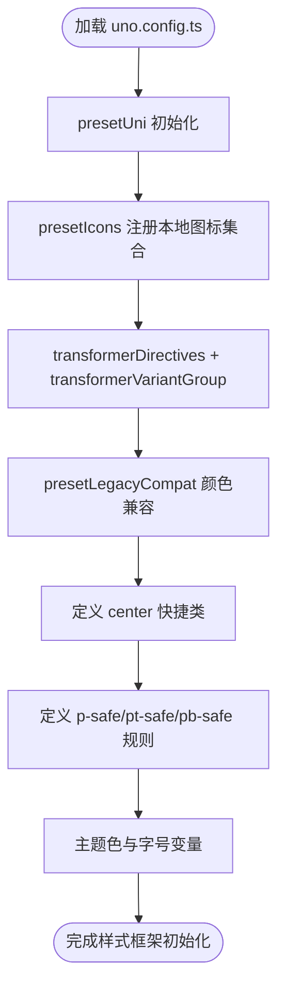
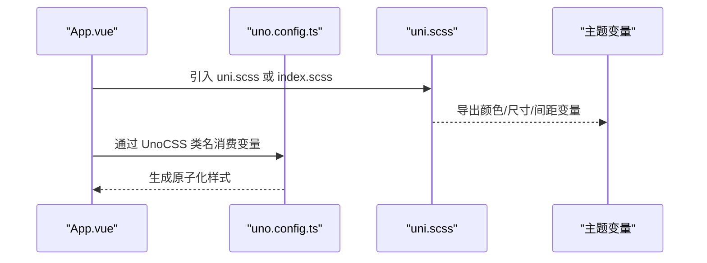
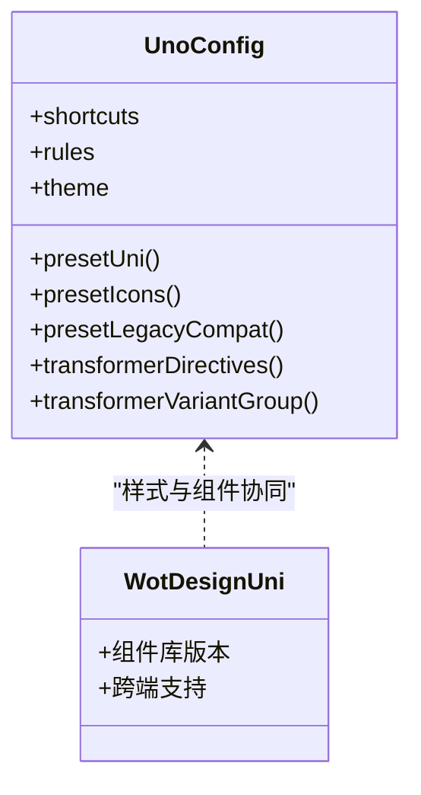
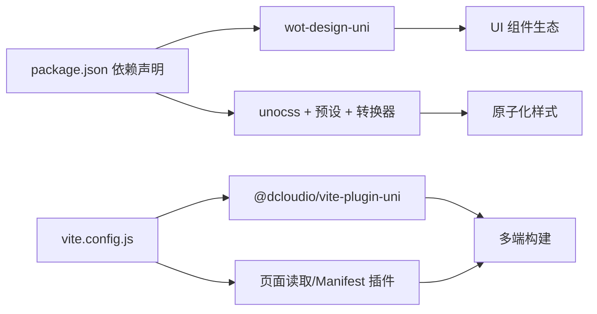

# UI 组件与样式系统

<cite>
**本文引用的文件**
- [frontend/admin-uniapp/uno.config.ts](file://frontend/admin-uniapp/uno.config.ts)
- [frontend/admin-uniapp/src/uni.scss](file://frontend/admin-uniapp/src/uni.scss)
- [frontend/admin-uniapp/src/App.vue](file://frontend/admin-uniapp/src/App.vue)
- [frontend/admin-uniapp/package.json](file://frontend/admin-uniapp/package.json)
- [frontend/mall-uniapp/uno.config.ts](file://frontend/mall-uniapp/uno.config.ts)
- [frontend/mall-uniapp/uni.scss](file://frontend/mall-uniapp/uni.scss)
- [frontend/mall-uniapp/App.vue](file://frontend/mall-uniapp/App.vue)
- [frontend/mall-uniapp/vite.config.js](file://frontend/mall-uniapp/vite.config.js)
</cite>

## 目录
1. [简介](#简介)
2. [项目结构](#项目结构)
3. [核心组件](#核心组件)
4. [架构总览](#架构总览)
5. [组件与样式深度解析](#组件与样式深度解析)
6. [依赖关系分析](#依赖关系分析)
7. [性能考量](#性能考量)
8. [故障排查指南](#故障排查指南)
9. [结论](#结论)
10. [附录](#附录)

## 简介
本文件面向 UniApp 跨端前端工程，系统化梳理 UI 组件与样式体系，覆盖以下主题：
- 组件库使用与自定义组件开发
- 样式系统设计与 UnoCSS 集成
- 跨端组件兼容性与样式单位转换
- 主题定制与安全区域适配
- 常用业务组件封装思路（表单、弹窗）
- 图标系统与动画、响应式布局
- 组件开发规范与样式最佳实践
- Wot Design Uni 组件库与 UnoCSS 的协同

## 项目结构
本仓库包含两个主要前端工程：admin-uniapp（管理后台）与 mall-uniapp（商城）。两者均采用 Vite + UniApp 架构，统一引入 UnoCSS 作为原子化样式框架，并通过 SCSS 提供主题变量与基础样式。

**图示来源**
- [frontend/admin-uniapp/src/App.vue:1-27](file://frontend/admin-uniapp/src/App.vue#L1-L27)
- [frontend/admin-uniapp/uno.config.ts:1-120](file://frontend/admin-uniapp/uno.config.ts#L1-L120)
- [frontend/admin-uniapp/src/uni.scss:1-78](file://frontend/admin-uniapp/src/uni.scss#L1-L78)
- [frontend/admin-uniapp/package.json:1-194](file://frontend/admin-uniapp/package.json#L1-L194)
- [frontend/mall-uniapp/App.vue:1-33](file://frontend/mall-uniapp/App.vue#L1-L33)
- [frontend/mall-uniapp/uno.config.ts:1-120](file://frontend/mall-uniapp/uno.config.ts#L1-L120)
- [frontend/mall-uniapp/uni.scss:1-77](file://frontend/mall-uniapp/uni.scss#L1-L77)
- [frontend/mall-uniapp/vite.config.js:1-35](file://frontend/mall-uniapp/vite.config.js#L1-L35)

**章节来源**
- [frontend/admin-uniapp/src/App.vue:1-27](file://frontend/admin-uniapp/src/App.vue#L1-L27)
- [frontend/mall-uniapp/App.vue:1-33](file://frontend/mall-uniapp/App.vue#L1-L33)

## 核心组件
- 应用入口与生命周期
  - 管理后台与商城应用均在入口文件中初始化运行环境与生命周期钩子，管理后台额外处理路由拦截逻辑。
- 组件库与样式框架
  - 管理后台与商城均引入 Wot Design Uni 作为 UI 组件库；样式系统以 UnoCSS 为核心，辅以 SCSS 变量与主题定制。
- 构建与平台能力
  - 商城工程通过 Vite 插件扩展页面读取与 Manifest 处理；管理后台通过脚本命令行进行多端编译与构建。

**章节来源**
- [frontend/admin-uniapp/src/App.vue:1-27](file://frontend/admin-uniapp/src/App.vue#L1-L27)
- [frontend/mall-uniapp/App.vue:1-33](file://frontend/mall-uniapp/App.vue#L1-L33)
- [frontend/admin-uniapp/package.json:125-126](file://frontend/admin-uniapp/package.json#L125-L126)

## 架构总览
下图展示 UnoCSS 与组件库在两套工程中的协作关系，以及样式变量与主题的注入路径。

**图示来源**
- [frontend/admin-uniapp/src/App.vue:24-26](file://frontend/admin-uniapp/src/App.vue#L24-L26)
- [frontend/admin-uniapp/uno.config.ts:17-67](file://frontend/admin-uniapp/uno.config.ts#L17-L67)
- [frontend/admin-uniapp/src/uni.scss:1-78](file://frontend/admin-uniapp/src/uni.scss#L1-L78)
- [frontend/admin-uniapp/package.json:125-126](file://frontend/admin-uniapp/package.json#L125-L126)
- [frontend/mall-uniapp/App.vue:30-32](file://frontend/mall-uniapp/App.vue#L30-L32)
- [frontend/mall-uniapp/uno.config.ts:17-67](file://frontend/mall-uniapp/uno.config.ts#L17-L67)
- [frontend/mall-uniapp/uni.scss:1-77](file://frontend/mall-uniapp/uni.scss#L1-L77)
- [frontend/mall-uniapp/vite.config.js:10-34](file://frontend/mall-uniapp/vite.config.js#L10-L34)

## 组件与样式深度解析

### UnoCSS 配置与图标系统
- 预设与转换器
  - presetUni：为 UniApp 平台提供原子化类名与属性化模式支持。
  - presetIcons：集成图标集，支持本地 SVG 批量加载与动态图标注册。
  - presetLegacyCompat：将颜色函数格式转换为兼容旧设备的逗号分隔形式，提升 App 端兼容性。
  - transformerDirectives 与 transformerVariantGroup：启用 @apply、theme() 等指令与变体组合语法。
- 本地图标集合
  - 通过 FileSystemIconLoader 从本地文件系统批量注册图标集合，自动为无 fill 的 SVG 注入 currentColor，保证颜色可继承；同时将宽高属性标准化为 1em，确保显示一致性。
- 安全区域与快捷方式
  - 提供 p-safe、pt-safe、pb-safe 等规则，快速适配刘海屏与安全区域。
  - 定义 center 快捷类，简化居中布局。
- 主题色与字号
  - 定义 primary 主题色变量与 2xs/3xs 字号，满足细粒度排版需求。

**图示来源**
- [frontend/admin-uniapp/uno.config.ts:17-96](file://frontend/admin-uniapp/uno.config.ts#L17-L96)
- [frontend/mall-uniapp/uno.config.ts:17-96](file://frontend/mall-uniapp/uno.config.ts#L17-L96)

**章节来源**
- [frontend/admin-uniapp/uno.config.ts:1-120](file://frontend/admin-uniapp/uno.config.ts#L1-L120)
- [frontend/mall-uniapp/uno.config.ts:1-120](file://frontend/mall-uniapp/uno.config.ts#L1-L120)

### SCSS 主题变量与样式注入
- 管理后台
  - uni.scss 提供 uni-app 内置颜色、文字、背景、边框、尺寸、间距、透明度等变量，便于全局主题定制。
- 商城
  - uni.scss 引入 sheep/scss/_var.scss，统一品牌与业务变量；同时 App.vue 中引入 sheep/scss/index.scss，形成完整的样式注入链路。

**图示来源**
- [frontend/admin-uniapp/src/App.vue:24-26](file://frontend/admin-uniapp/src/App.vue#L24-L26)
- [frontend/admin-uniapp/src/uni.scss:1-78](file://frontend/admin-uniapp/src/uni.scss#L1-L78)
- [frontend/mall-uniapp/App.vue:30-32](file://frontend/mall-uniapp/App.vue#L30-L32)
- [frontend/mall-uniapp/uni.scss:1-77](file://frontend/mall-uniapp/uni.scss#L1-L77)
- [frontend/admin-uniapp/uno.config.ts:17-96](file://frontend/admin-uniapp/uno.config.ts#L17-L96)
- [frontend/mall-uniapp/uno.config.ts:17-96](file://frontend/mall-uniapp/uno.config.ts#L17-L96)

**章节来源**
- [frontend/admin-uniapp/src/uni.scss:1-78](file://frontend/admin-uniapp/src/uni.scss#L1-L78)
- [frontend/mall-uniapp/uni.scss:1-77](file://frontend/mall-uniapp/uni.scss#L1-L77)
- [frontend/mall-uniapp/App.vue:30-32](file://frontend/mall-uniapp/App.vue#L30-L32)

### 组件库与跨端兼容
- 组件库
  - 管理后台明确依赖 Wot Design Uni，用于提供统一的 UI 组件生态。
- 跨端兼容
  - UnoCSS 的 presetLegacyCompat 与属性化模式配置，降低 App 端样式兼容成本。
  - 通过安全区域规则与尺寸变量，适配不同设备的安全区域与屏幕密度。

**图示来源**
- [frontend/admin-uniapp/uno.config.ts:17-96](file://frontend/admin-uniapp/uno.config.ts#L17-L96)
- [frontend/admin-uniapp/package.json:125-126](file://frontend/admin-uniapp/package.json#L125-L126)

**章节来源**
- [frontend/admin-uniapp/package.json:125-126](file://frontend/admin-uniapp/package.json#L125-L126)
- [frontend/admin-uniapp/uno.config.ts:50-60](file://frontend/admin-uniapp/uno.config.ts#L50-L60)

### 常用业务组件封装思路
- 表单组件
  - 基于 Wot Design Uni 的表单控件，结合 UnoCSS 的原子化类名与 SCSS 变量，实现统一的校验提示、尺寸与主题风格。
- 弹窗组件
  - 利用 UnoCSS 的定位与动画类名，配合组件库的弹层组件，实现跨端一致的弹窗交互与视觉体验。
- 自定义组件开发
  - 建议遵循“最小可用”原则，优先复用组件库与 UnoCSS 能力；对差异化需求，通过 SCSS 变量与主题定制实现统一风格。

（本节为概念性指导，不直接分析具体文件）

### 图标系统与动画效果
- 图标系统
  - 通过 presetIcons 与本地 SVG 批量加载，实现图标字体与 SVG 图标的统一管理；利用 currentColor 与 1em 规范，确保图标颜色与尺寸的一致性。
- 动画效果
  - 建议使用 UnoCSS 的动画与过渡类名，结合组件库提供的过渡组件，实现跨端一致的动效体验。

（本节为概念性指导，不直接分析具体文件）

### 响应式布局与单位转换
- 响应式布局
  - 通过 UnoCSS 的断点与布局类名，结合 SCSS 变量实现响应式栅格与间距。
- 单位转换
  - 管理后台的 uni.scss 提供 rpx/px 相关变量；在 UnoCSS 中可通过主题变量与规则进行统一转换与适配。

**章节来源**
- [frontend/admin-uniapp/src/uni.scss:40-78](file://frontend/admin-uniapp/src/uni.scss#L40-L78)
- [frontend/mall-uniapp/uno.config.ts:86-96](file://frontend/mall-uniapp/uno.config.ts#L86-L96)

## 依赖关系分析
- 组件库依赖
  - 管理后台显式依赖 Wot Design Uni，用于提供 UI 组件生态。
- 样式框架依赖
  - 两套工程均依赖 UnoCSS 及其预设与转换器，形成统一的原子化样式体系。
- 构建与平台
  - 商城工程通过 Vite 插件增强页面读取与 Manifest 处理；管理后台通过脚本命令行进行多端编译。

**图示来源**
- [frontend/admin-uniapp/package.json:125-126](file://frontend/admin-uniapp/package.json#L125-L126)
- [frontend/admin-uniapp/uno.config.ts:17-67](file://frontend/admin-uniapp/uno.config.ts#L17-L67)
- [frontend/mall-uniapp/vite.config.js:10-34](file://frontend/mall-uniapp/vite.config.js#L10-L34)

**章节来源**
- [frontend/admin-uniapp/package.json:125-126](file://frontend/admin-uniapp/package.json#L125-L126)
- [frontend/mall-uniapp/vite.config.js:10-34](file://frontend/mall-uniapp/vite.config.js#L10-L34)

## 性能考量
- 构建体积
  - UnoCSS 的内容扫描与规则生成需平衡构建时间与产物体积；建议按需开启 safelist 与规则，避免过度生成。
- App 端兼容
  - presetLegacyCompat 能有效减少颜色函数格式差异带来的渲染问题，但需关注生成样式规模。
- 图标加载
  - 本地 SVG 批量加载可减少网络请求，但需控制图标数量与体积，避免首屏阻塞。

（本节提供通用建议，不直接分析具体文件）

## 故障排查指南
- App 端颜色异常
  - 检查 presetLegacyCompat 是否正确启用，确认颜色函数格式是否被转换为逗号分隔。
- 图标不显示或颜色不生效
  - 确认本地 SVG 是否已正确注册为图标集合；检查是否注入了 currentColor 与 1em 规则。
- 安全区域适配
  - 使用 p-safe/pt-safe/pb-safe 等规则，确保内容不被刘海屏遮挡。
- 构建报错
  - 若出现内容扫描或管道配置相关错误，参考注释中的防御性配置说明，调整 include/exclude 范围。

**章节来源**
- [frontend/admin-uniapp/uno.config.ts:50-60](file://frontend/admin-uniapp/uno.config.ts#L50-L60)
- [frontend/admin-uniapp/uno.config.ts:74-85](file://frontend/admin-uniapp/uno.config.ts#L74-L85)
- [frontend/mall-uniapp/uno.config.ts:50-60](file://frontend/mall-uniapp/uno.config.ts#L50-L60)
- [frontend/mall-uniapp/uno.config.ts:74-85](file://frontend/mall-uniapp/uno.config.ts#L74-L85)

## 结论
本项目通过 Wot Design Uni 与 UnoCSS 的协同，构建了统一、可扩展且跨端兼容的 UI 组件与样式体系。结合 SCSS 主题变量与安全区域规则，能够高效支撑管理后台与商城两类业务场景的界面开发与迭代。建议在后续开发中持续沉淀组件规范与样式最佳实践，强化跨端一致性与性能表现。

## 附录
- 组件开发规范
  - 优先使用组件库与 UnoCSS 能力，保持风格一致；对差异化需求通过 SCSS 变量与主题定制实现。
- 样式最佳实践
  - 使用原子化类名提升可维护性；合理组织 SCSS 变量与规则；避免过度嵌套与重复定义。
- 跨端兼容性处理
  - 启用 presetLegacyCompat 与安全区域规则；在 App 端重点验证颜色与布局表现。

（本节为通用建议，不直接分析具体文件）