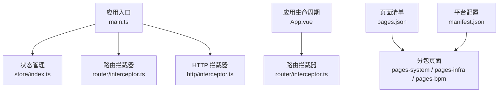
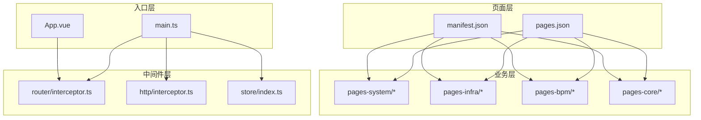
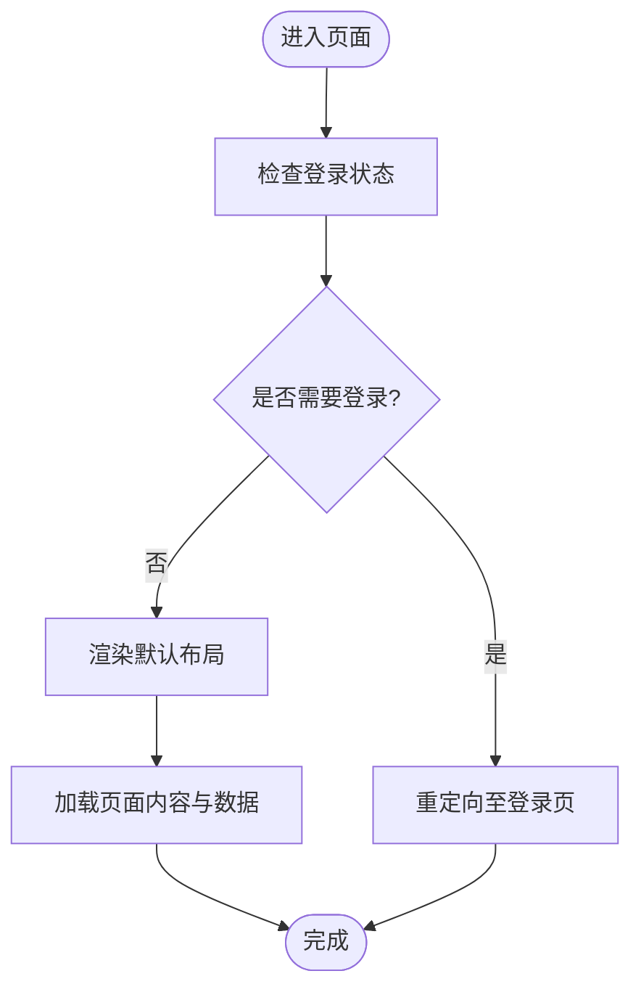
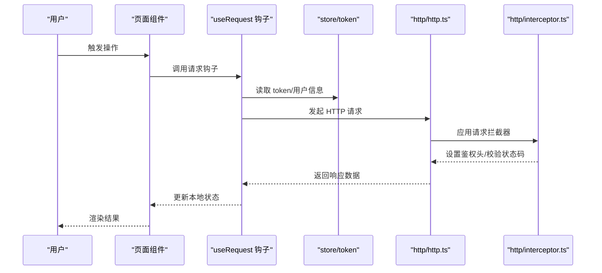
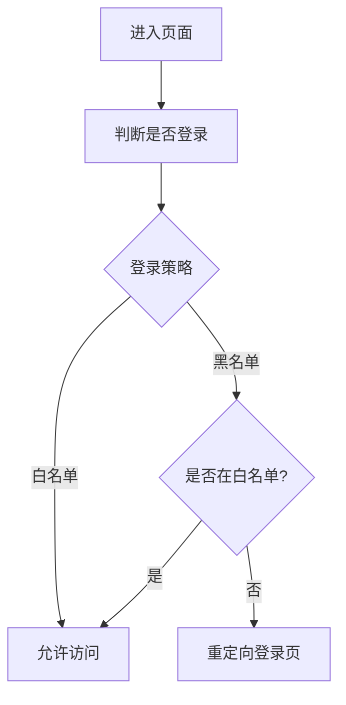
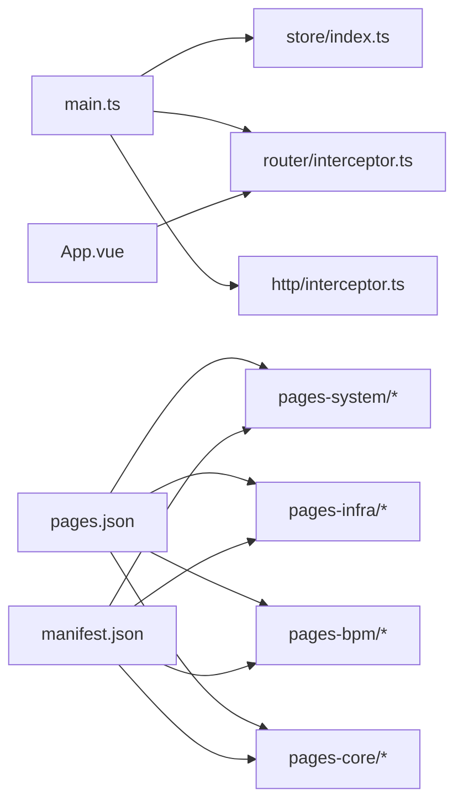

# 业务模块开发

<cite>
**本文引用的文件**
- [frontend/admin-uniapp/src/main.ts](file://frontend/admin-uniapp/src/main.ts)
- [frontend/admin-uniapp/src/App.vue](file://frontend/admin-uniapp/src/App.vue)
- [frontend/admin-uniapp/src/pages.json](file://frontend/admin-uniapp/src/pages.json)
- [frontend/admin-uniapp/src/manifest.json](file://frontend/admin-uniapp/src/manifest.json)
- [frontend/admin-uniapp/src/router/config.ts](file://frontend/admin-uniapp/src/router/config.ts)
- [frontend/admin-uniapp/src/store/index.ts](file://frontend/admin-uniapp/src/store/index.ts)
- [frontend/admin-uniapp/src/http/interceptor.ts](file://frontend/admin-uniapp/src/http/interceptor.ts)
- [frontend/admin-uniapp/src/http/http.ts](file://frontend/admin-uniapp/src/http/http.ts)
- [frontend/admin-uniapp/src/hooks/useRequest.ts](file://frontend/admin-uniapp/src/hooks/useRequest.ts)
- [frontend/admin-uniapp/src/hooks/useAccess.ts](file://frontend/admin-uniapp/src/hooks/useAccess.ts)
- [frontend/admin-uniapp/src/utils/index.ts](file://frontend/admin-uniapp/src/utils/index.ts)
- [frontend/admin-uniapp/src/layouts/default.vue](file://frontend/admin-uniapp/src/layouts/default.vue)
</cite>

## 目录
1. [引言](#引言)
2. [项目结构](#项目结构)
3. [核心组件](#核心组件)
4. [架构总览](#架构总览)
5. [详细组件分析](#详细组件分析)
6. [依赖关系分析](#依赖关系分析)
7. [性能考虑](#性能考虑)
8. [故障排查指南](#故障排查指南)
9. [结论](#结论)
10. [附录](#附录)

## 引言
本文件面向 UniApp 业务模块开发，聚焦系统管理模块、基础设施模块与工作流模块的实现与最佳实践。内容覆盖页面组件设计、业务逻辑封装、数据绑定处理、权限控制、菜单配置、页面布局、模块化开发、组件复用与代码组织结构，并提供数据交互处理方案与常见问题排查建议。

## 项目结构
前端采用多包分包策略，通过 pages.json 的 subPackages 字段划分业务域：
- pages-core：核心页面（认证、错误页、用户中心）
- pages-system：系统管理模块（用户、角色、菜单、字典、部门等）
- pages-infra：基础设施模块（配置、定时任务、文件、日志等）
- pages-bpm：工作流模块（流程分类、OA 请假、流程实例、监听器、表达式、任务管理、用户组等）

应用入口与全局配置：
- 应用入口：main.ts 创建应用并挂载插件
- 应用生命周期：App.vue 处理启动、显示、隐藏与路由拦截
- 页面清单：pages.json 声明全局样式、easycom 组件自动扫描规则与各包页面
- 平台配置：manifest.json 定义应用信息、平台差异化配置与分包策略

**图表来源**
- [frontend/admin-uniapp/src/main.ts:1-20](file://frontend/admin-uniapp/src/main.ts#L1-L20)
- [frontend/admin-uniapp/src/App.vue:1-27](file://frontend/admin-uniapp/src/App.vue#L1-L27)
- [frontend/admin-uniapp/src/pages.json:1-800](file://frontend/admin-uniapp/src/pages.json#L1-L800)
- [frontend/admin-uniapp/src/manifest.json:1-136](file://frontend/admin-uniapp/src/manifest.json#L1-L136)

**章节来源**
- [frontend/admin-uniapp/src/main.ts:1-20](file://frontend/admin-uniapp/src/main.ts#L1-L20)
- [frontend/admin-uniapp/src/App.vue:1-27](file://frontend/admin-uniapp/src/App.vue#L1-L27)
- [frontend/admin-uniapp/src/pages.json:1-800](file://frontend/admin-uniapp/src/pages.json#L1-L800)
- [frontend/admin-uniapp/src/manifest.json:1-136](file://frontend/admin-uniapp/src/manifest.json#L1-L136)

## 核心组件
- 应用入口与插件挂载：在 main.ts 中创建应用实例，注册 store、路由拦截器与请求拦截器，确保全局可用性与一致性。
- 应用生命周期：App.vue 在 onShow 中触发导航拦截器，处理直接通过链接或分享进入的场景，保证路由正确跳转。
- 页面清单与分包：pages.json 统一声明全局样式与 easycom 规则，subPackages 将系统管理、基础设施、工作流等模块拆分为独立包，提升加载效率与可维护性。
- 平台配置：manifest.json 提供多端差异化配置（H5、小程序、App），并启用分包优化。
- 状态管理：store/index.ts 使用 Pinia 并集成持久化插件，支持跨端存储。
- 路由与登录策略：router/config.ts 定义登录策略、登录页与 404 页面路径，支持白名单/黑名单策略与小程序登录页复用。
- HTTP 层：http.ts 封装请求方法，interceptor.ts 提供请求/响应拦截与错误处理。
- 业务钩子：hooks/useRequest.ts 提供通用请求封装，useAccess.ts 提供权限判断能力。
- 工具函数：utils/index.ts 提供通用工具方法。

**章节来源**
- [frontend/admin-uniapp/src/main.ts:1-20](file://frontend/admin-uniapp/src/main.ts#L1-L20)
- [frontend/admin-uniapp/src/App.vue:1-27](file://frontend/admin-uniapp/src/App.vue#L1-L27)
- [frontend/admin-uniapp/src/pages.json:1-800](file://frontend/admin-uniapp/src/pages.json#L1-L800)
- [frontend/admin-uniapp/src/manifest.json:1-136](file://frontend/admin-uniapp/src/manifest.json#L1-L136)
- [frontend/admin-uniapp/src/store/index.ts:1-23](file://frontend/admin-uniapp/src/store/index.ts#L1-L23)
- [frontend/admin-uniapp/src/router/config.ts:1-46](file://frontend/admin-uniapp/src/router/config.ts#L1-L46)
- [frontend/admin-uniapp/src/http/http.ts](file://frontend/admin-uniapp/src/http/http.ts)
- [frontend/admin-uniapp/src/http/interceptor.ts](file://frontend/admin-uniapp/src/http/interceptor.ts)
- [frontend/admin-uniapp/src/hooks/useRequest.ts](file://frontend/admin-uniapp/src/hooks/useRequest.ts)
- [frontend/admin-uniapp/src/hooks/useAccess.ts](file://frontend/admin-uniapp/src/hooks/useAccess.ts)
- [frontend/admin-uniapp/src/utils/index.ts](file://frontend/admin-uniapp/src/utils/index.ts)

## 架构总览
整体采用“入口应用 + 分包页面 + 插件化中间件”的架构模式：
- 入口层：main.ts 初始化应用与插件
- 生命周期层：App.vue 处理启动与路由拦截
- 页面层：pages.json + manifest.json 管理页面与平台配置
- 业务层：各模块页面按需加载，共享 hooks、store、http、utils
- 权限层：路由拦截器结合登录策略与权限钩子进行控制

**图表来源**
- [frontend/admin-uniapp/src/main.ts:1-20](file://frontend/admin-uniapp/src/main.ts#L1-L20)
- [frontend/admin-uniapp/src/App.vue:1-27](file://frontend/admin-uniapp/src/App.vue#L1-L27)
- [frontend/admin-uniapp/src/pages.json:1-800](file://frontend/admin-uniapp/src/pages.json#L1-L800)
- [frontend/admin-uniapp/src/manifest.json:1-136](file://frontend/admin-uniapp/src/manifest.json#L1-L136)

## 详细组件分析

### 系统管理模块（pages-system）
职责与范围
- 用户管理：用户增删改查、详情、表单
- 角色管理：角色增删改查、详情、表单
- 菜单管理：菜单树形展示、新增/编辑/删除
- 字典管理：字典类型与字典数据管理
- 部门管理：组织架构与部门管理
- 日志管理：登录日志、操作日志详情与查询
- 通知管理：站内信、模板管理
- 租户管理：租户与套餐管理
- 其他：岗位、邮件、短信、社交等管理

页面组织
- 通过 pages.json 的 subPackages.root: pages-system 声明模块页面
- 各页面遵循统一的 detail/index、form/index 结构，便于复用布局与逻辑

开发要点
- 统一的数据表格与表单组件：基于 easycom 自动扫描，减少重复开发
- 权限控制：结合 useAccess 与路由拦截器，确保菜单与页面访问安全
- 数据交互：通过 hooks/useRequest 与 http/http.ts 封装请求，统一处理 loading、错误与缓存

**章节来源**
- [frontend/admin-uniapp/src/pages.json:180-640](file://frontend/admin-uniapp/src/pages.json#L180-L640)

### 基础设施模块（pages-infra）
职责与范围
- 配置管理：系统参数配置的增删改查与详情
- 数据源配置：数据库连接配置管理
- 文件管理：文件上传、存储与详情
- 定时任务：任务管理、执行日志与调度
- API 访问/错误日志：接口访问与异常记录
- WebSocket：实时通信页面

页面组织
- 通过 subPackages.root: pages-infra 声明模块页面
- 支持详情与表单页面的统一结构，便于扩展

开发要点
- 文件上传：结合 useUpload 与后端接口，实现多端一致的上传体验
- 任务调度：通过定时任务页面统一管理 Cron 表达式与执行状态
- 日志查询：提供搜索表单与分页列表，支持条件筛选与导出

**章节来源**
- [frontend/admin-uniapp/src/pages.json:640-800](file://frontend/admin-uniapp/src/pages.json#L640-L800)

### 工作流模块（pages-bpm）
职责与范围
- 流程分类：流程类别管理
- OA 请假：请假流程发起与审批
- 流程实例：流程运行实例监控
- 监听器：流程监听器配置
- 表达式：流程表达式管理
- 任务管理：待办/已办任务处理
- 用户组：流程用户组配置

页面组织
- 通过 subPackages.root: pages-bpm 声明模块页面
- 页面结构与系统管理模块保持一致，便于统一开发与维护

开发要点
- 流程图展示：结合可视化流程设计器，提供流程实例跟踪
- 任务处理：统一的任务列表与处理表单，支持加签、转办、退回等操作
- 表达式与监听器：提供表达式语法高亮与监听器调试能力

**章节来源**
- [frontend/admin-uniapp/src/pages.json:60-120](file://frontend/admin-uniapp/src/pages.json#L60-L120)

### 页面组件设计与布局
- 默认布局：layouts/default.vue 提供统一头部、侧边栏与内容区域布局，支持主题切换与菜单折叠
- 页面样式：pages.json 全局样式统一设置导航栏风格与背景色
- 组件复用：通过 easycom 自动扫描规则，减少组件引入成本，提升开发效率

**图表来源**
- [frontend/admin-uniapp/src/router/config.ts:1-46](file://frontend/admin-uniapp/src/router/config.ts#L1-L46)
- [frontend/admin-uniapp/src/layouts/default.vue](file://frontend/admin-uniapp/src/layouts/default.vue)

**章节来源**
- [frontend/admin-uniapp/src/layouts/default.vue](file://frontend/admin-uniapp/src/layouts/default.vue)
- [frontend/admin-uniapp/src/pages.json:1-800](file://frontend/admin-uniapp/src/pages.json#L1-L800)

### 业务逻辑封装与数据绑定
- 请求封装：hooks/useRequest.ts 提供统一的请求钩子，支持 loading、错误处理与缓存策略
- HTTP 层：http/http.ts 封装 GET/POST/DELETE 等方法，interceptor.ts 统一处理鉴权头、错误提示与重定向
- 状态管理：store/index.ts 使用 Pinia 并持久化 token、用户信息与主题设置
- 数据绑定：页面通过响应式数据与计算属性绑定 UI，结合 v-model、v-for 等指令实现动态渲染

**图表来源**
- [frontend/admin-uniapp/src/hooks/useRequest.ts](file://frontend/admin-uniapp/src/hooks/useRequest.ts)
- [frontend/admin-uniapp/src/store/index.ts:1-23](file://frontend/admin-uniapp/src/store/index.ts#L1-L23)
- [frontend/admin-uniapp/src/http/http.ts](file://frontend/admin-uniapp/src/http/http.ts)
- [frontend/admin-uniapp/src/http/interceptor.ts](file://frontend/admin-uniapp/src/http/interceptor.ts)

**章节来源**
- [frontend/admin-uniapp/src/hooks/useRequest.ts](file://frontend/admin-uniapp/src/hooks/useRequest.ts)
- [frontend/admin-uniapp/src/store/index.ts:1-23](file://frontend/admin-uniapp/src/store/index.ts#L1-L23)
- [frontend/admin-uniapp/src/http/http.ts](file://frontend/admin-uniapp/src/http/http.ts)
- [frontend/admin-uniapp/src/http/interceptor.ts](file://frontend/admin-uniapp/src/http/interceptor.ts)

### 权限控制与菜单配置
- 登录策略：router/config.ts 定义白名单/黑名单策略，默认需要登录；支持小程序登录页复用
- 菜单访问：结合 useAccess 钩子与路由拦截器，控制菜单项显示与页面访问
- 页面排除：在 definePage 中配置 excludeLoginPath 或在 EXCLUDE_LOGIN_PATH_LIST 中维护白名单

**图表来源**
- [frontend/admin-uniapp/src/router/config.ts:1-46](file://frontend/admin-uniapp/src/router/config.ts#L1-L46)

**章节来源**
- [frontend/admin-uniapp/src/router/config.ts:1-46](file://frontend/admin-uniapp/src/router/config.ts#L1-L46)

## 依赖关系分析
- 入口依赖：main.ts 依赖 store、router/interceptor、http/interceptor
- 生命周期依赖：App.vue 依赖 router/interceptor
- 页面依赖：pages.json 依赖各模块页面与 manifest.json 的平台配置
- 业务依赖：各模块页面依赖 hooks、store、http、utils

**图表来源**
- [frontend/admin-uniapp/src/main.ts:1-20](file://frontend/admin-uniapp/src/main.ts#L1-L20)
- [frontend/admin-uniapp/src/App.vue:1-27](file://frontend/admin-uniapp/src/App.vue#L1-L27)
- [frontend/admin-uniapp/src/pages.json:1-800](file://frontend/admin-uniapp/src/pages.json#L1-L800)
- [frontend/admin-uniapp/src/manifest.json:1-136](file://frontend/admin-uniapp/src/manifest.json#L1-L136)

**章节来源**
- [frontend/admin-uniapp/src/main.ts:1-20](file://frontend/admin-uniapp/src/main.ts#L1-L20)
- [frontend/admin-uniapp/src/App.vue:1-27](file://frontend/admin-uniapp/src/App.vue#L1-L27)
- [frontend/admin-uniapp/src/pages.json:1-800](file://frontend/admin-uniapp/src/pages.json#L1-L800)
- [frontend/admin-uniapp/src/manifest.json:1-136](file://frontend/admin-uniapp/src/manifest.json#L1-L136)

## 性能考虑
- 分包加载：通过 pages.json 的 subPackages 将大模块拆分，减少首屏体积
- 组件复用：easycom 自动扫描降低组件引入成本，提升开发效率
- 状态持久化：store 使用持久化插件，避免频繁重新登录
- 请求缓存：hooks/useRequest 提供缓存策略，减少重复请求
- 平台优化：manifest.json 针对 H5、小程序启用分包优化与组件化配置

## 故障排查指南
- 登录失败或循环跳转
  - 检查 router/config.ts 的登录策略与登录页路径配置
  - 确认 App.vue 的路由拦截器是否正确处理直接进入页面的场景
- 页面无法访问或 404
  - 核对 pages.json 中 subPackages 与页面路径是否匹配
  - 检查 excludeLoginPath 配置是否正确
- 请求失败或鉴权失败
  - 查看 http/interceptor.ts 是否正确设置鉴权头与错误处理
  - 确认 token 存储与刷新逻辑
- 组件不生效或样式异常
  - 检查 easycom 规则与组件命名是否符合约定
  - 确认 UnoCSS 与全局样式加载顺序

**章节来源**
- [frontend/admin-uniapp/src/router/config.ts:1-46](file://frontend/admin-uniapp/src/router/config.ts#L1-L46)
- [frontend/admin-uniapp/src/App.vue:1-27](file://frontend/admin-uniapp/src/App.vue#L1-L27)
- [frontend/admin-uniapp/src/pages.json:1-800](file://frontend/admin-uniapp/src/pages.json#L1-L800)
- [frontend/admin-uniapp/src/http/interceptor.ts](file://frontend/admin-uniapp/src/http/interceptor.ts)

## 结论
本项目以模块化为核心，通过分包策略与统一的中间件体系，实现了系统管理、基础设施与工作流三大业务域的清晰边界与高效协作。配合权限控制、页面布局与组件复用机制，能够快速构建稳定、可维护的多端应用。建议在后续开发中持续完善权限颗粒度、优化请求缓存与错误处理，并加强模块间接口契约的文档化与版本演进管理。

## 附录
- 最佳实践清单
  - 页面结构：统一 detail/index 与 form/index 结构，便于复用
  - 权限控制：在路由与菜单层面双重保障
  - 数据交互：通过 hooks/useRequest 统一封装，避免重复逻辑
  - 组件复用：利用 easycom 与公共组件库，减少重复开发
  - 状态管理：合理拆分 store 模块，避免状态污染
  - 平台适配：在 manifest.json 中针对不同平台进行差异化配置