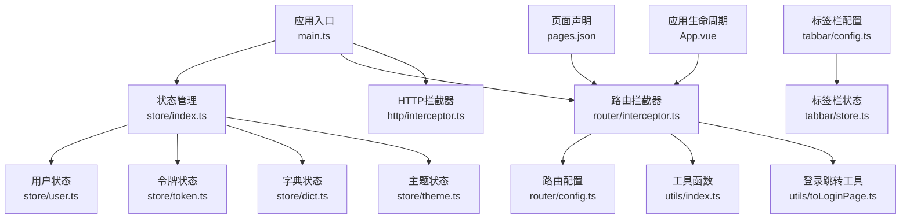
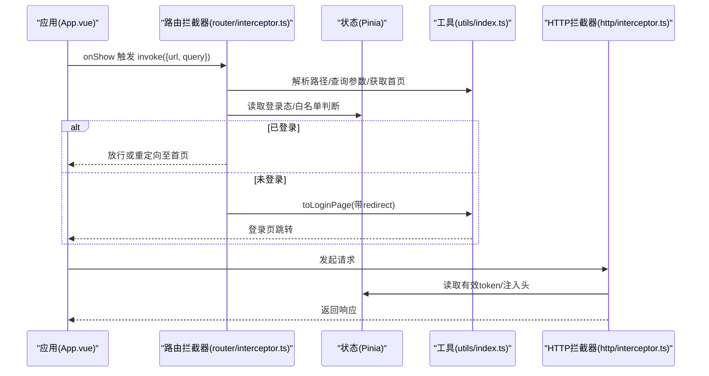
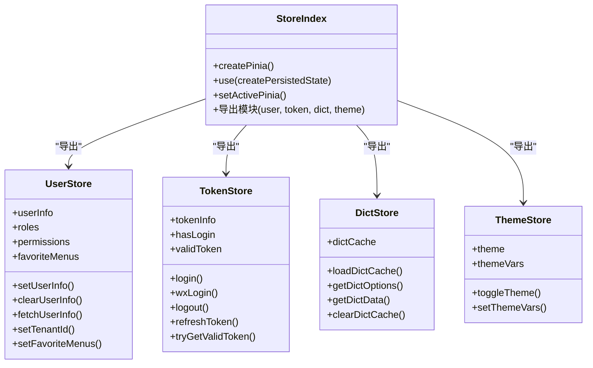
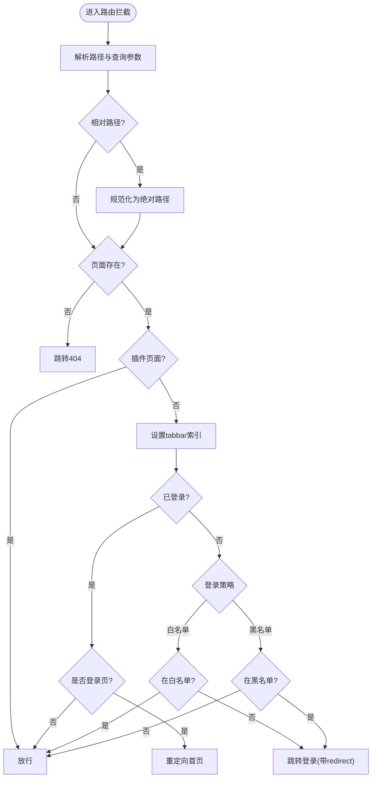
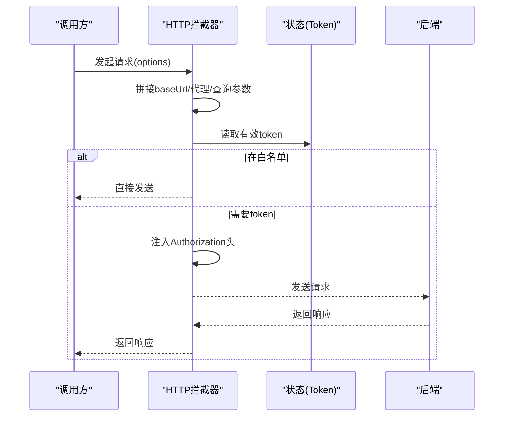
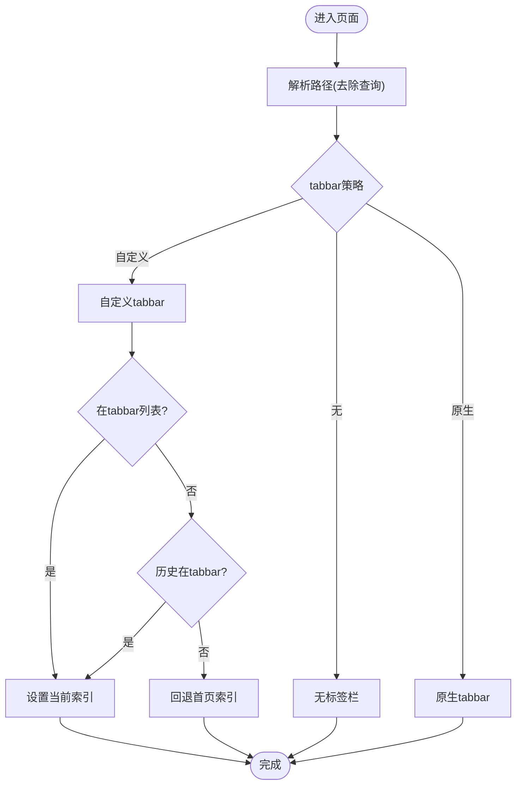
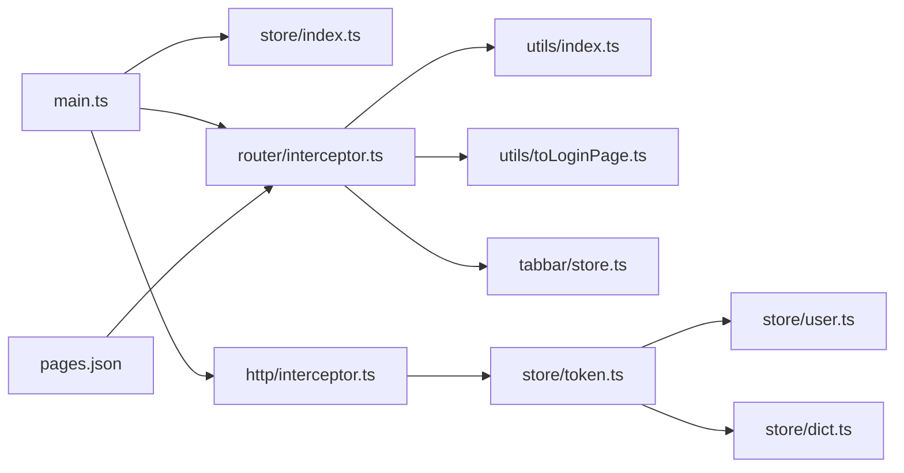

# 状态管理与导航

<cite>
**本文档引用的文件**
- [store/index.ts](file://frontend/admin-uniapp/src/store/index.ts)
- [store/user.ts](file://frontend/admin-uniapp/src/store/user.ts)
- [store/token.ts](file://frontend/admin-uniapp/src/store/token.ts)
- [store/dict.ts](file://frontend/admin-uniapp/src/store/dict.ts)
- [store/theme.ts](file://frontend/admin-uniapp/src/store/theme.ts)
- [router/config.ts](file://frontend/admin-uniapp/src/router/config.ts)
- [router/interceptor.ts](file://frontend/admin-uniapp/src/router/interceptor.ts)
- [http/interceptor.ts](file://frontend/admin-uniapp/src/http/interceptor.ts)
- [utils/toLoginPage.ts](file://frontend/admin-uniapp/src/utils/toLoginPage.ts)
- [utils/index.ts](file://frontend/admin-uniapp/src/utils/index.ts)
- [tabbar/store.ts](file://frontend/admin-uniapp/src/tabbar/store.ts)
- [tabbar/config.ts](file://frontend/admin-uniapp/src/tabbar/config.ts)
- [pages.json](file://frontend/admin-uniapp/src/pages.json)
- [main.ts](file://frontend/admin-uniapp/src/main.ts)
- [App.vue](file://frontend/admin-uniapp/src/App.vue)
- [layouts/default.vue](file://frontend/admin-uniapp/src/layouts/default.vue)
</cite>

## 目录
1. [简介](#简介)
2. [项目结构](#项目结构)
3. [核心组件](#核心组件)
4. [架构总览](#架构总览)
5. [详细组件分析](#详细组件分析)
6. [依赖关系分析](#依赖关系分析)
7. [性能考量](#性能考量)
8. [故障排查指南](#故障排查指南)
9. [结论](#结论)
10. [附录](#附录)

## 简介
本文件面向 UniApp 应用的状态管理与导航体系，围绕 Pinia 状态管理、路由配置与拦截、布局组件设计展开，重点阐述全局状态设计、模块化状态组织、导航守卫实现、页面跳转与参数传递、页面缓存策略、权限控制与菜单生成、标签页管理、路由拦截器与动态路由加载、面包屑导航实现等主题。同时提供状态管理最佳实践、导航优化技巧与用户体验提升方案。

## 项目结构
前端采用模块化组织，核心目录与职责：
- store：Pinia 状态模块（用户、令牌、字典、主题）
- router：路由配置与拦截器
- http：HTTP 请求拦截器
- utils：通用工具函数（解析路由、环境适配、导航辅助）
- tabbar：自定义/原生标签栏配置与状态
- pages.json：页面与分包声明
- main.ts：应用入口与插件安装
- App.vue：应用生命周期与启动路由处理
- layouts/default.vue：默认布局插槽

**图表来源**
- [main.ts:1-20](file://frontend/admin-uniapp/src/main.ts#L1-L20)
- [store/index.ts:1-23](file://frontend/admin-uniapp/src/store/index.ts#L1-L23)
- [router/interceptor.ts:1-146](file://frontend/admin-uniapp/src/router/interceptor.ts#L1-L146)
- [http/interceptor.ts:1-105](file://frontend/admin-uniapp/src/http/interceptor.ts#L1-L105)
- [store/user.ts:1-90](file://frontend/admin-uniapp/src/store/user.ts#L1-L90)
- [store/token.ts:1-342](file://frontend/admin-uniapp/src/store/token.ts#L1-L342)
- [store/dict.ts:1-87](file://frontend/admin-uniapp/src/store/dict.ts#L1-L87)
- [store/theme.ts:1-43](file://frontend/admin-uniapp/src/store/theme.ts#L1-L43)
- [router/config.ts:1-46](file://frontend/admin-uniapp/src/router/config.ts#L1-L46)
- [utils/index.ts:1-244](file://frontend/admin-uniapp/src/utils/index.ts#L1-L244)
- [utils/toLoginPage.ts:1-49](file://frontend/admin-uniapp/src/utils/toLoginPage.ts#L1-L49)
- [pages.json:1-1042](file://frontend/admin-uniapp/src/pages.json#L1-L1042)
- [App.vue:1-27](file://frontend/admin-uniapp/src/App.vue#L1-L27)
- [tabbar/config.ts:1-170](file://frontend/admin-uniapp/src/tabbar/config.ts#L1-L170)
- [tabbar/store.ts:1-88](file://frontend/admin-uniapp/src/tabbar/store.ts#L1-L88)

**章节来源**
- [main.ts:1-20](file://frontend/admin-uniapp/src/main.ts#L1-L20)
- [pages.json:1-1042](file://frontend/admin-uniapp/src/pages.json#L1-L1042)

## 核心组件
- Pinia 状态管理：统一在 store/index.ts 创建实例并启用持久化插件；模块化导出用户、令牌、字典、主题状态。
- 路由拦截器：在 router/interceptor.ts 中实现导航守卫、登录态判断、白/黑名单策略、相对路径处理、tabbar 自动索引。
- HTTP 拦截器：在 http/interceptor.ts 中统一注入 Authorization、租户头、查询参数拼接、API 加密等。
- 工具函数：utils/index.ts 提供路由解析、环境适配、首页路径、增强返回等；utils/toLoginPage.ts 提供登录跳转与防抖。
- 标签栏：tabbar/config.ts 定义策略与列表；tabbar/store.ts 管理当前索引、徽标、自动索引恢复。
- 页面声明：pages.json 声明主包与分包页面、排除登录页标记、导航样式等。

**章节来源**
- [store/index.ts:1-23](file://frontend/admin-uniapp/src/store/index.ts#L1-L23)
- [router/interceptor.ts:1-146](file://frontend/admin-uniapp/src/router/interceptor.ts#L1-L146)
- [http/interceptor.ts:1-105](file://frontend/admin-uniapp/src/http/interceptor.ts#L1-L105)
- [utils/index.ts:1-244](file://frontend/admin-uniapp/src/utils/index.ts#L1-L244)
- [utils/toLoginPage.ts:1-49](file://frontend/admin-uniapp/src/utils/toLoginPage.ts#L1-L49)
- [tabbar/config.ts:1-170](file://frontend/admin-uniapp/src/tabbar/config.ts#L1-L170)
- [tabbar/store.ts:1-88](file://frontend/admin-uniapp/src/tabbar/store.ts#L1-L88)
- [pages.json:1-1042](file://frontend/admin-uniapp/src/pages.json#L1-L1042)

## 架构总览
整体架构围绕“应用启动 → 状态初始化 → 路由拦截 → 请求拦截 → 页面渲染”的流程展开。Pinia 提供全局状态，路由拦截器负责权限与登录态控制，HTTP 拦截器负责请求层统一处理，工具函数贯穿于导航与环境适配。

**图表来源**
- [App.vue:1-27](file://frontend/admin-uniapp/src/App.vue#L1-L27)
- [router/interceptor.ts:1-146](file://frontend/admin-uniapp/src/router/interceptor.ts#L1-L146)
- [utils/index.ts:1-244](file://frontend/admin-uniapp/src/utils/index.ts#L1-L244)
- [utils/toLoginPage.ts:1-49](file://frontend/admin-uniapp/src/utils/toLoginPage.ts#L1-L49)
- [http/interceptor.ts:1-105](file://frontend/admin-uniapp/src/http/interceptor.ts#L1-L105)

## 详细组件分析

### Pinia 状态管理
- store/index.ts
  - 创建 Pinia 实例并启用持久化插件，存储介质使用 uni.getStorageSync/uni.setStorageSync。
  - 立即激活实例，避免 APP 端白屏问题。
  - 统一导出用户、令牌、字典、主题模块，便于按需引入。
- store/user.ts
  - 用户信息、角色、权限、常用菜单等状态；支持头像设置、信息清理、租户 ID 设置。
  - 持久化配置，刷新后保留。
- store/token.ts
  - 单/双令牌模式支持；过期时间计算与存储；登录/登出/刷新逻辑；对外暴露 hasLogin、validToken、tryGetValidToken 等。
  - 登录后联动拉取用户信息与字典缓存。
- store/dict.ts
  - 字典缓存结构与加载、查询、清理；按类型返回选项列表与单项映射。
- store/theme.ts
  - 主题与主题变量管理，支持切换与局部覆盖。

**图表来源**
- [store/index.ts:1-23](file://frontend/admin-uniapp/src/store/index.ts#L1-L23)
- [store/user.ts:1-90](file://frontend/admin-uniapp/src/store/user.ts#L1-L90)
- [store/token.ts:1-342](file://frontend/admin-uniapp/src/store/token.ts#L1-L342)
- [store/dict.ts:1-87](file://frontend/admin-uniapp/src/store/dict.ts#L1-L87)
- [store/theme.ts:1-43](file://frontend/admin-uniapp/src/store/theme.ts#L1-L43)

**章节来源**
- [store/index.ts:1-23](file://frontend/admin-uniapp/src/store/index.ts#L1-L23)
- [store/user.ts:1-90](file://frontend/admin-uniapp/src/store/user.ts#L1-L90)
- [store/token.ts:1-342](file://frontend/admin-uniapp/src/store/token.ts#L1-L342)
- [store/dict.ts:1-87](file://frontend/admin-uniapp/src/store/dict.ts#L1-L87)
- [store/theme.ts:1-43](file://frontend/admin-uniapp/src/store/theme.ts#L1-L43)

### 路由配置与拦截器
- router/config.ts
  - 登录策略：白名单/黑名单两种模式；默认白名单策略。
  - 登录页与错误页路径常量；小程序登录页启用开关。
  - 白/黑名单列表（EXCLUDE_LOGIN_PATH_LIST）与动态补充逻辑。
- router/interceptor.ts
  - judgeIsExcludePath：非开发环境一次性补充、开发环境实时获取。
  - navigateToInterceptor.invoke：相对路径处理、路由存在性校验、插件页面支持、tabbar 自动索引。
  - 登录态判断：已登录直行、未登录按策略重定向至登录页（携带 redirect）。
  - 支持 navigateTo、redirectTo、reLaunch、switchTab 拦截。
- utils/toLoginPage.ts
  - 防抖跳转登录页；携带 redirect 参数时强制 reLaunch 以确保登录后页面刷新。
- utils/index.ts
  - parseUrlToObj：解析路径与查询参数。
  - getAllPages：聚合主包与分包页面，支持按键过滤（如 excludeLoginPath）。
  - HOME_PAGE：根据 pages.json 中 type 为 home 的页面确定首页。
  - redirectAfterLogin/navigateBackPlus：登录后跳转与增强返回逻辑。
- App.vue
  - onShow 时处理直接进入路由（如 H5 直链、微信分享）并触发拦截器。

**图表来源**
- [router/interceptor.ts:1-146](file://frontend/admin-uniapp/src/router/interceptor.ts#L1-L146)
- [utils/toLoginPage.ts:1-49](file://frontend/admin-uniapp/src/utils/toLoginPage.ts#L1-L49)
- [utils/index.ts:1-244](file://frontend/admin-uniapp/src/utils/index.ts#L1-L244)
- [router/config.ts:1-46](file://frontend/admin-uniapp/src/router/config.ts#L1-L46)
- [App.vue:1-27](file://frontend/admin-uniapp/src/App.vue#L1-L27)

**章节来源**
- [router/config.ts:1-46](file://frontend/admin-uniapp/src/router/config.ts#L1-L46)
- [router/interceptor.ts:1-146](file://frontend/admin-uniapp/src/router/interceptor.ts#L1-L146)
- [utils/toLoginPage.ts:1-49](file://frontend/admin-uniapp/src/utils/toLoginPage.ts#L1-L49)
- [utils/index.ts:1-244](file://frontend/admin-uniapp/src/utils/index.ts#L1-L244)
- [App.vue:1-27](file://frontend/admin-uniapp/src/App.vue#L1-L27)

### HTTP 请求拦截器
- http/interceptor.ts
  - 基准地址拼接（支持代理与多环境）。
  - 查询参数拼接与请求头注入（Authorization、tenant-id）。
  - 白名单豁免（无需 token 的接口）。
  - API 加密开关与数据加密头设置。
  - 统一超时时间与拦截器安装。

**图表来源**
- [http/interceptor.ts:1-105](file://frontend/admin-uniapp/src/http/interceptor.ts#L1-L105)
- [store/token.ts:1-342](file://frontend/admin-uniapp/src/store/token.ts#L1-L342)

**章节来源**
- [http/interceptor.ts:1-105](file://frontend/admin-uniapp/src/http/interceptor.ts#L1-L105)

### 标签栏与页面缓存
- tabbar/config.ts
  - 策略枚举：无 tabbar、原生 tabbar、自定义带缓存、自定义无缓存。
  - 原生与自定义列表配置；缓存与隐藏原生 tabbar 开关。
- tabbar/store.ts
  - reactive 管理当前/前一索引，支持徽标设置。
  - setAutoCurIdx：根据目标路径自动设置当前索引；处理首页与不在 tabbar 列表时回退。
  - 与登录态、白/黑名单策略结合，确保索引一致性。

**图表来源**
- [tabbar/config.ts:1-170](file://frontend/admin-uniapp/src/tabbar/config.ts#L1-L170)
- [tabbar/store.ts:1-88](file://frontend/admin-uniapp/src/tabbar/store.ts#L1-L88)

**章节来源**
- [tabbar/config.ts:1-170](file://frontend/admin-uniapp/src/tabbar/config.ts#L1-L170)
- [tabbar/store.ts:1-88](file://frontend/admin-uniapp/src/tabbar/store.ts#L1-L88)

### 页面声明与动态路由
- pages.json
  - 全局样式与 easycom 自动扫描。
  - 主包与多分包页面声明，支持 excludeLoginPath 标记用于登录策略。
  - 页面样式（导航栏标题、样式）与类型（home/page）标注。
- 动态路由加载
  - getAllPages：聚合主包与分包页面，支持按键过滤（如 excludeLoginPath）。
  - 在拦截器中动态补充 EXCLUDE_LOGIN_PATH_LIST，避免硬编码。

**章节来源**
- [pages.json:1-1042](file://frontend/admin-uniapp/src/pages.json#L1-L1042)
- [utils/index.ts:76-103](file://frontend/admin-uniapp/src/utils/index.ts#L76-L103)
- [router/interceptor.ts:17-34](file://frontend/admin-uniapp/src/router/interceptor.ts#L17-L34)

### 布局组件设计
- layouts/default.vue
  - 默认布局插槽，便于统一容器包装与样式继承。
- 与导航配合
  - 页面样式在 pages.json 中配置，支持自定义导航栏样式与标题文本。

**章节来源**
- [layouts/default.vue:1-4](file://frontend/admin-uniapp/src/layouts/default.vue#L1-L4)
- [pages.json:1-1042](file://frontend/admin-uniapp/src/pages.json#L1-L1042)

## 依赖关系分析
- 应用入口 main.ts 依赖 store、router/interceptor、http/interceptor，并在应用启动时安装。
- 路由拦截器依赖 utils（解析路径、获取首页）、toLoginPage（登录跳转）、tabbar/store（tabbar 索引）。
- 状态模块之间存在耦合：tokenStore 登录后联动 userStore 与 dictStore；HTTP 拦截器依赖 tokenStore 获取有效 token。
- 页面声明 pages.json 与拦截器策略紧密关联，excludeLoginPath 影响白/黑名单判定。

**图表来源**
- [main.ts:1-20](file://frontend/admin-uniapp/src/main.ts#L1-L20)
- [store/index.ts:1-23](file://frontend/admin-uniapp/src/store/index.ts#L1-L23)
- [router/interceptor.ts:1-146](file://frontend/admin-uniapp/src/router/interceptor.ts#L1-L146)
- [http/interceptor.ts:1-105](file://frontend/admin-uniapp/src/http/interceptor.ts#L1-L105)
- [utils/index.ts:1-244](file://frontend/admin-uniapp/src/utils/index.ts#L1-L244)
- [utils/toLoginPage.ts:1-49](file://frontend/admin-uniapp/src/utils/toLoginPage.ts#L1-L49)
- [tabbar/store.ts:1-88](file://frontend/admin-uniapp/src/tabbar/store.ts#L1-L88)
- [store/token.ts:1-342](file://frontend/admin-uniapp/src/store/token.ts#L1-L342)
- [store/user.ts:1-90](file://frontend/admin-uniapp/src/store/user.ts#L1-L90)
- [store/dict.ts:1-87](file://frontend/admin-uniapp/src/store/dict.ts#L1-L87)
- [pages.json:1-1042](file://frontend/admin-uniapp/src/pages.json#L1-L1042)

**章节来源**
- [main.ts:1-20](file://frontend/admin-uniapp/src/main.ts#L1-L20)
- [router/interceptor.ts:1-146](file://frontend/admin-uniapp/src/router/interceptor.ts#L1-L146)
- [http/interceptor.ts:1-105](file://frontend/admin-uniapp/src/http/interceptor.ts#L1-L105)

## 性能考量
- 状态持久化：Pinia 持久化插件减少刷新后状态丢失，建议合理拆分模块，避免大对象频繁序列化。
- 路由拦截缓存：非开发环境一次性补充 excludeLoginPath 列表，降低重复计算。
- 请求拦截：白名单快速放行，避免不必要的头注入；查询参数拼接与代理开关按环境启用。
- 标签栏索引：reactive 管理当前索引，避免 Pinia 大对象开销；仅在必要时更新存储。
- 页面缓存：根据 tabbar 策略决定是否启用缓存，平衡内存占用与切换体验。

## 故障排查指南
- 登录后仍停留在登录页
  - 检查 toLoginPage 是否携带 redirect 参数并使用 reLaunch。
  - 确认 tokenStore.hasLogin 判断逻辑与登录回调。
- 路由拦截异常
  - 检查 judgeIsExcludePath 是否正确补充 excludeLoginPath 列表。
  - 确认相对路径规范化与页面存在性校验。
- 404 页面跳转
  - 检查 getAllPages 是否正确聚合主包与分包页面。
  - 确认 pages.json 中页面声明与路径一致。
- token 过期或刷新失败
  - 单令牌模式不支持刷新；双令牌模式需确保 refreshToken 存在。
  - tryGetValidToken 失败时应引导重新登录。
- 标签栏索引不正确
  - 检查 setAutoCurIdx 逻辑与 tabbar 列表匹配。
  - 确认登录态与白/黑名单策略影响。

**章节来源**
- [utils/toLoginPage.ts:1-49](file://frontend/admin-uniapp/src/utils/toLoginPage.ts#L1-L49)
- [router/interceptor.ts:1-146](file://frontend/admin-uniapp/src/router/interceptor.ts#L1-L146)
- [utils/index.ts:76-103](file://frontend/admin-uniapp/src/utils/index.ts#L76-L103)
- [store/token.ts:228-250](file://frontend/admin-uniapp/src/store/token.ts#L228-L250)
- [tabbar/store.ts:57-78](file://frontend/admin-uniapp/src/tabbar/store.ts#L57-L78)

## 结论
该 UniApp 项目通过 Pinia 实现模块化状态管理，结合路由拦截器与 HTTP 拦截器构建了完善的权限控制与请求层统一处理机制。配合灵活的标签栏策略与页面声明，实现了良好的导航体验与可维护性。建议持续优化状态粒度、完善错误处理与日志记录，并在多端环境（H5/小程序/App）下进行稳定性验证。

## 附录
- 最佳实践
  - 状态设计：按领域拆分模块，避免跨模块强耦合；敏感状态持久化需谨慎。
  - 路由策略：明确白/黑名单策略并统一维护 excludeLoginPath 列表。
  - 请求层：严格区分白名单接口，统一注入 token 与租户头。
  - 导航优化：合理使用 switchTab 与 navigateBackPlus，提升页面切换效率。
  - 用户体验：登录跳转使用防抖与 reLaunch，确保页面刷新与数据一致性。
- 扩展方向
  - 动态路由：结合后端菜单动态生成路由与权限控制。
  - 面包屑：基于 pages.json 与当前路由路径生成面包屑导航。
  - 缓存策略：针对高频页面与数据制定缓存与失效策略。