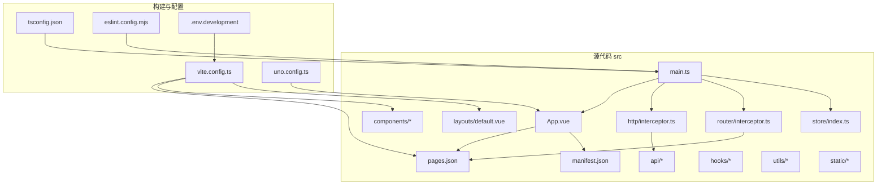
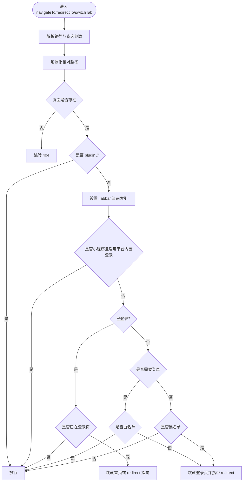
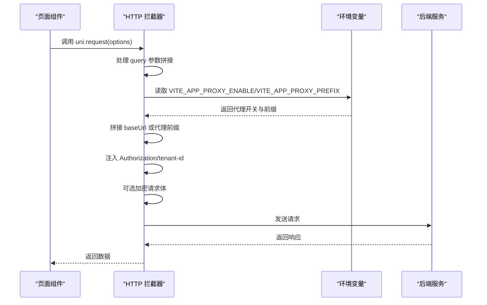
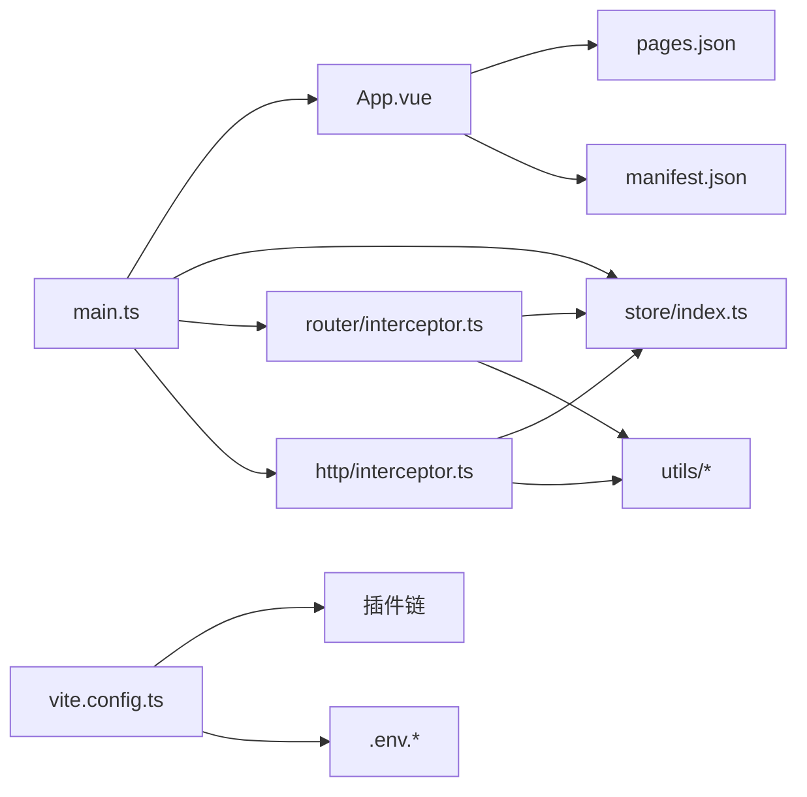

# 管理后台 UniApp 应用

<cite>
**本文档引用的文件**
- [package.json](file://frontend/admin-uniapp/package.json)
- [vite.config.ts](file://frontend/admin-uniapp/vite.config.ts)
- [tsconfig.json](file://frontend/admin-uniapp/tsconfig.json)
- [eslint.config.mjs](file://frontend/admin-uniapp/eslint.config.mjs)
- [uno.config.ts](file://frontend/admin-uniapp/uno.config.ts)
- [.env.development](file://frontend/admin-uniapp/env/.env.development)
- [main.ts](file://frontend/admin-uniapp/src/main.ts)
- [App.vue](file://frontend/admin-uniapp/src/App.vue)
- [manifest.json](file://frontend/admin-uniapp/src/manifest.json)
- [pages.json](file://frontend/admin-uniapp/src/pages.json)
- [interceptor.ts（路由）](file://frontend/admin-uniapp/src/router/interceptor.ts)
- [interceptor.ts（HTTP）](file://frontend/admin-uniapp/src/http/interceptor.ts)
- [store/index.ts](file://frontend/admin-uniapp/src/store/index.ts)
- [default.vue（布局）](file://frontend/admin-uniapp/src/layouts/default.vue)
- [sync-manifest-plugins.ts](file://frontend/admin-uniapp/vite-plugins/sync-manifest-plugins.ts)
</cite>

## 目录
1. [简介](#简介)
2. [项目结构](#项目结构)
3. [核心组件](#核心组件)
4. [架构总览](#架构总览)
5. [详细组件分析](#详细组件分析)
6. [依赖关系分析](#依赖关系分析)
7. [性能考虑](#性能考虑)
8. [故障排查指南](#故障排查指南)
9. [结论](#结论)
10. [附录](#附录)

## 简介
本项目是一个基于 Vue 3 + UniApp 3 的多端统一开发管理后台前端应用，采用 Vite 作为构建工具，结合 TypeScript、UnoCSS、Pinia、Vue Router、Wot Design Uni 组件库与 z-paging 等生态，实现 H5、小程序（含微信、支付宝、百度、头条、QQ、快手、飞书、小红书等）、App（Android/iOS/Harmony）等多端一致体验。项目强调工程化规范（ESLint、Prettier、CommitLint）、类型安全（TS）、样式原子化（UnoCSS）、自动页面与组件注册（uni-pages、uni-components）、分包优化（uni-ku bundle-optimizer）以及跨端兼容与性能优化。

## 项目结构
前端管理后台位于 frontend/admin-uniapp，核心目录与职责如下：
- env：环境变量配置，按模式区分开发/生产
- src：源代码
  - api：接口封装与模块化
  - components：通用业务组件
  - hooks：自定义组合式逻辑
  - http：网络层拦截器与请求工具
  - layouts：布局容器
  - pages-core、pages-system、pages-infra、pages-bpm：按功能域划分的页面分包
  - router：路由拦截与全局守卫
  - store：状态管理（Pinia + 持久化）
  - static：静态资源
  - tabbar：底部导航相关
  - utils：工具函数
  - App.vue、main.ts：应用入口与引导
  - manifest.json、pages.json：多端清单与页面配置
- vite.config.ts：Vite 构建配置与插件体系
- tsconfig.json：TypeScript 编译配置
- eslint.config.mjs：ESLint 规则与格式化
- uno.config.ts：UnoCSS 原子化样式配置
- vite-plugins：自定义 Vite 插件（如 manifest 同步）



**图表来源**
- [vite.config.ts:1-214](file://frontend/admin-uniapp/vite.config.ts#L1-L214)
- [tsconfig.json:1-46](file://frontend/admin-uniapp/tsconfig.json#L1-L46)
- [eslint.config.mjs:1-65](file://frontend/admin-uniapp/eslint.config.mjs#L1-L65)
- [uno.config.ts:1-120](file://frontend/admin-uniapp/uno.config.ts#L1-L120)
- [main.ts:1-20](file://frontend/admin-uniapp/src/main.ts#L1-L20)
- [App.vue:1-27](file://frontend/admin-uniapp/src/App.vue#L1-L27)
- [manifest.json:1-136](file://frontend/admin-uniapp/src/manifest.json#L1-L136)
- [pages.json:1-800](file://frontend/admin-uniapp/src/pages.json#L1-L800)

**章节来源**
- [package.json:1-194](file://frontend/admin-uniapp/package.json#L1-L194)
- [vite.config.ts:1-214](file://frontend/admin-uniapp/vite.config.ts#L1-L214)
- [tsconfig.json:1-46](file://frontend/admin-uniapp/tsconfig.json#L1-L46)
- [eslint.config.mjs:1-65](file://frontend/admin-uniapp/eslint.config.mjs#L1-L65)
- [uno.config.ts:1-120](file://frontend/admin-uniapp/uno.config.ts#L1-L120)
- [main.ts:1-20](file://frontend/admin-uniapp/src/main.ts#L1-L20)
- [App.vue:1-27](file://frontend/admin-uniapp/src/App.vue#L1-L27)
- [manifest.json:1-136](file://frontend/admin-uniapp/src/manifest.json#L1-L136)
- [pages.json:1-800](file://frontend/admin-uniapp/src/pages.json#L1-L800)

## 核心组件
- 应用入口与引导：在 main.ts 中创建 SSR 应用实例，挂载 store、路由拦截器与请求拦截器，并引入全局样式与 UnoCSS。
- 应用生命周期：App.vue 使用 uni-app 生命周期钩子 onLaunch/onShow/onHide，处理直接通过链接或分享进入时的路由跳转。
- 页面与分包：pages.json 定义全局样式、easycom 组件映射与分包结构；vite.config.ts 通过 uni-pages 插件扫描并生成路由，同时配置 subPackages。
- 路由拦截：router/interceptor.ts 实现统一导航拦截，支持白/黑名单策略、登录态判断、tabbar 自动索引、小程序平台特殊处理。
- HTTP 拦截：http/interceptor.ts 统一注入 Authorization、租户头、查询参数拼接、条件代理与 API 加密。
- 状态管理：store/index.ts 使用 Pinia 并集成持久化插件，确保 APP 端首次渲染稳定。
- 布局容器：layouts/default.vue 提供默认布局插槽。
- 构建与样式：vite.config.ts 集成 uni-layouts、uni-platform、uni-manifest、uni-pages、uni-ku 优化、Components 自动注册、UnoCSS、AutoImport、ViteRestart、打包分析、原生资源复制与 manifest 同步插件；uno.config.ts 提供 presetUni、presetIcons、presetLegacyCompat 与主题/快捷方式配置。

**章节来源**
- [main.ts:1-20](file://frontend/admin-uniapp/src/main.ts#L1-L20)
- [App.vue:1-27](file://frontend/admin-uniapp/src/App.vue#L1-L27)
- [pages.json:1-800](file://frontend/admin-uniapp/src/pages.json#L1-L800)
- [vite.config.ts:1-214](file://frontend/admin-uniapp/vite.config.ts#L1-L214)
- [interceptor.ts（路由）:1-146](file://frontend/admin-uniapp/src/router/interceptor.ts#L1-L146)
- [interceptor.ts（HTTP）:1-105](file://frontend/admin-uniapp/src/http/interceptor.ts#L1-L105)
- [store/index.ts:1-23](file://frontend/admin-uniapp/src/store/index.ts#L1-L23)
- [default.vue（布局）:1-4](file://frontend/admin-uniapp/src/layouts/default.vue#L1-L4)
- [uno.config.ts:1-120](file://frontend/admin-uniapp/uno.config.ts#L1-L120)

## 架构总览
该架构围绕“多端统一 + 工程化规范 + 性能优化”展开，核心链路如下：

```mermaid
sequenceDiagram
participant Dev as "开发者"
participant Vite as "Vite 构建"
participant UniPages as "uni-pages 插件"
participant Opt as "bundle-optimizer 插件"
participant App as "应用入口 main.ts"
participant Router as "路由拦截器"
participant Store as "Pinia 状态"
participant HTTP as "HTTP 拦截器"
participant Server as "后端服务"
Dev->>Vite : 运行脚本dev/build
Vite->>UniPages : 扫描 pages.json 与分包
UniPages-->>Vite : 生成路由与类型
Vite->>Opt : 分包优化与异步导入
Vite-->>App : 启动应用
App->>Store : 初始化 Pinia 与持久化
App->>Router : 注册导航拦截
App->>HTTP : 注册请求拦截
Dev->>Router : 导航到某页面
Router->>Router : 判断登录态/白/黑名单
Router-->>Dev : 跳转或重定向
Dev->>HTTP : 发起请求
HTTP->>HTTP : 注入头/代理/加密
HTTP->>Server : 发送请求
Server-->>HTTP : 返回响应
HTTP-->>Dev : 返回数据
```

**图表来源**
- [vite.config.ts:67-164](file://frontend/admin-uniapp/vite.config.ts#L67-L164)
- [main.ts:10-19](file://frontend/admin-uniapp/src/main.ts#L10-L19)
- [interceptor.ts（路由）:138-146](file://frontend/admin-uniapp/src/router/interceptor.ts#L138-L146)
- [interceptor.ts（HTTP）:97-105](file://frontend/admin-uniapp/src/http/interceptor.ts#L97-L105)

## 详细组件分析

### 路由拦截器（登录与导航）
- 功能要点
  - 支持白/黑名单两种登录策略，动态从 pages.json 的 excludeLoginPath 字段补充白名单
  - 对相对路径进行解析与规范化
  - 登录态判断与重定向至登录页，携带 redirect 参数
  - 小程序平台可选择启用内置登录流程
  - Tabbar 页面自动设置当前索引
- 关键流程



**图表来源**
- [interceptor.ts（路由）:36-136](file://frontend/admin-uniapp/src/router/interceptor.ts#L36-L136)

**章节来源**
- [interceptor.ts（路由）:1-146](file://frontend/admin-uniapp/src/router/interceptor.ts#L1-L146)
- [pages.json:65-800](file://frontend/admin-uniapp/src/pages.json#L65-L800)

### HTTP 请求拦截器（条件编译与加密）
- 功能要点
  - 自动拼接 baseUrl 或代理前缀（H5 条件编译）
  - 注入 Authorization 与租户头
  - 查询参数拼接到 URL
  - 可选 API 加密（按接口标记 isEncrypt）
  - 统一超时时间
- 关键流程



**图表来源**
- [interceptor.ts（HTTP）:19-94](file://frontend/admin-uniapp/src/http/interceptor.ts#L19-L94)

**章节来源**
- [interceptor.ts（HTTP）:1-105](file://frontend/admin-uniapp/src/http/interceptor.ts#L1-L105)
- [.env.development:1-10](file://frontend/admin-uniapp/env/.env.development#L1-L10)

### 状态管理（Pinia + 持久化）
- 特性
  - 使用 createPinia 并立即 setActivePinia，避免 APP 端白屏
  - 通过 pinia-plugin-persistedstate 将状态持久化到 uni.get/setStorageSync
- 适用范围
  - 用户信息、Token、主题、字典等

**章节来源**
- [store/index.ts:1-23](file://frontend/admin-uniapp/src/store/index.ts#L1-L23)

### 构建与插件体系（Vite）
- 插件链
  - uni-layouts、uni-platform、uni-manifest、uni-pages（含 subPackages）、uni-ku 优化、Components 自动注册、UnoCSS、AutoImport、ViteRestart
  - H5 环境注入 BUILD_TIME 与标题占位符
  - 打包分析（H5 生产）
  - 原生资源复制（App 平台）
  - manifest 同步（构建阶段）
- 关键配置
  - 别名 @ 与 @img
  - HMR、端口、代理（H5）
  - esbuild 删除 console（可选）
  - 构建目标 ES6、按模式控制压缩

**章节来源**
- [vite.config.ts:67-164](file://frontend/admin-uniapp/vite.config.ts#L67-L164)
- [sync-manifest-plugins.ts:1-69](file://frontend/admin-uniapp/vite-plugins/sync-manifest-plugins.ts#L1-L69)

### 类型系统与 ESLint
- TypeScript
  - 路径别名、类型声明、Volar 插件、类型文件自动导入
- ESLint
  - 基于 @uni-helper/eslint-config，启用 UnoCSS、Vue 规则，忽略自动生成文件与特定目录

**章节来源**
- [tsconfig.json:1-46](file://frontend/admin-uniapp/tsconfig.json#L1-L46)
- [eslint.config.mjs:1-65](file://frontend/admin-uniapp/eslint.config.mjs#L1-L65)

### 样式与主题（UnoCSS）
- 预设
  - presetUni：多端适配
  - presetIcons：图标集合与自动填充/尺寸
  - presetLegacyCompat：低端安卓兼容
- 变换器
  - transformerDirectives、transformerVariantGroup
- 快捷方式与安全区域
  - center、p-safe、pt-safe、pb-safe
  - 主题色 primary、字号 2xs/3xs

**章节来源**
- [uno.config.ts:17-120](file://frontend/admin-uniapp/uno.config.ts#L17-L120)

### 多端清单与页面配置
- manifest.json
  - App Plus 权限、图标、最小/目标 SDK
  - 各平台（微信、支付宝、百度、头条、QQ、快手、飞书、小红书、H5）差异化配置
- pages.json
  - easycom 组件映射（wot-design-uni、z-paging）
  - 分包配置（pages-core、pages-system、pages-infra、pages-bpm）
  - 页面样式与导航栏配置

**章节来源**
- [manifest.json:1-136](file://frontend/admin-uniapp/src/manifest.json#L1-L136)
- [pages.json:1-800](file://frontend/admin-uniapp/src/pages.json#L1-L800)

## 依赖关系分析
- 依赖耦合
  - main.ts 依赖 App.vue、store、router/http 拦截器
  - App.vue 依赖路由拦截器以处理直接进入场景
  - router/interceptor.ts 依赖 store 与 utils（页面枚举、tabbar）
  - http/interceptor.ts 依赖 store、utils、加密工具
  - vite.config.ts 依赖各插件与环境变量
- 外部依赖
  - @dcloudio/uni-app 生态、wot-design-uni、z-paging、pinia、vue-router、uno、eslint 等



**图表来源**
- [main.ts:1-20](file://frontend/admin-uniapp/src/main.ts#L1-L20)
- [App.vue:1-27](file://frontend/admin-uniapp/src/App.vue#L1-L27)
- [store/index.ts:1-23](file://frontend/admin-uniapp/src/store/index.ts#L1-L23)
- [interceptor.ts（路由）:1-146](file://frontend/admin-uniapp/src/router/interceptor.ts#L1-L146)
- [interceptor.ts（HTTP）:1-105](file://frontend/admin-uniapp/src/http/interceptor.ts#L1-L105)
- [vite.config.ts:1-214](file://frontend/admin-uniapp/vite.config.ts#L1-L214)

**章节来源**
- [package.json:99-177](file://frontend/admin-uniapp/package.json#L99-L177)
- [vite.config.ts:1-214](file://frontend/admin-uniapp/vite.config.ts#L1-L214)

## 性能考虑
- 分包与异步加载
  - 通过 uni-pages 与 uni-ku 优化插件，将登录页、系统管理、基础设施、工作流等模块拆分为独立分包，减少首屏体积
- 组件与页面自动注册
  - Components 插件自动扫描并生成类型，减少手动引入成本
- 构建优化
  - esbuild 压缩（生产），HMR（开发），按平台注入构建时间与标题
- 样式优化
  - UnoCSS 按需生成，presetLegacyCompat 提升低端机兼容性
- 资源与清单
  - 原生资源复制插件（App 平台），manifest 同步插件（构建后同步插件配置）

**章节来源**
- [vite.config.ts:67-164](file://frontend/admin-uniapp/vite.config.ts#L67-L164)
- [uno.config.ts:55-59](file://frontend/admin-uniapp/uno.config.ts#L55-L59)
- [sync-manifest-plugins.ts:19-68](file://frontend/admin-uniapp/vite-plugins/sync-manifest-plugins.ts#L19-L68)

## 故障排查指南
- 路由跳转异常
  - 检查 pages.json 中页面路径与分包配置是否正确
  - 确认路由拦截器是否误判白/黑名单或登录态
- 登录重定向循环
  - 核对 EXCLUDE_LOGIN_PATH_LIST 与 pages.json 的 excludeLoginPath
  - 确认 redirect 参数是否正确传递
- H5 代理无效
  - 检查 .env 中 VITE_APP_PROXY_ENABLE/VITE_APP_PROXY_PREFIX
  - 确认 devServer 代理配置与后端 API 前缀
- App 端白屏
  - 确认 store/index.ts 已调用 setActivePinia
  - 检查 manifest 同步插件是否正确写入 dist/dev/app/manifest.json
- 样式异常（低端机）
  - 启用 presetLegacyCompat，确认颜色函数与色空间配置
- 类型错误
  - 清理类型生成文件（如 uni-pages.d.ts、components.d.ts），重新生成
  - 确认 tsconfig.json 中类型声明与 Volar 插件

**章节来源**
- [interceptor.ts（路由）:16-34](file://frontend/admin-uniapp/src/router/interceptor.ts#L16-L34)
- [.env.development:1-10](file://frontend/admin-uniapp/env/.env.development#L1-L10)
- [store/index.ts:13-14](file://frontend/admin-uniapp/src/store/index.ts#L13-L14)
- [sync-manifest-plugins.ts:24-68](file://frontend/admin-uniapp/vite-plugins/sync-manifest-plugins.ts#L24-L68)
- [uno.config.ts:55-59](file://frontend/admin-uniapp/uno.config.ts#L55-L59)

## 结论
本项目通过完善的工程化配置与多端适配策略，实现了管理后台在多平台的一致体验与高可维护性。借助 Vite 插件链、TypeScript、UnoCSS、Pinia、路由与 HTTP 拦截器，项目在开发效率、构建性能与运行稳定性方面均达到较高水准。建议在后续迭代中持续完善分包策略、监控与埋点、国际化与无障碍能力，并保持依赖版本与插件生态的及时升级。

## 附录
- 常用命令
  - 开发：dev、dev:h5、dev:mp-weixin、dev:app、dev:app-android、dev:app-ios
  - 构建：build、build:h5、build:mp-weixin、build:app、build:app-android、build:app-ios
  - 类型检查：type-check
  - Lint：lint、lint:fix
- 环境变量
  - VITE_APP_PORT、VITE_SERVER_BASEURL、VITE_APP_TITLE、VITE_DELETE_CONSOLE、VITE_APP_PUBLIC_BASE、VITE_APP_PROXY_ENABLE、VITE_APP_PROXY_PREFIX、VITE_COPY_NATIVE_RES_ENABLE

**章节来源**
- [package.json:29-97](file://frontend/admin-uniapp/package.json#L29-L97)
- [.env.development:1-10](file://frontend/admin-uniapp/env/.env.development#L1-L10)