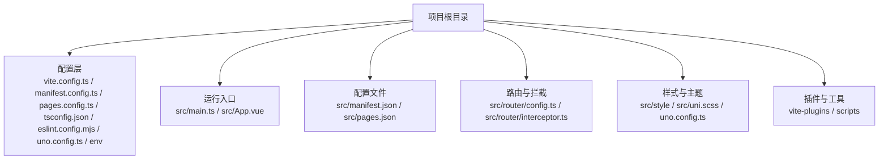
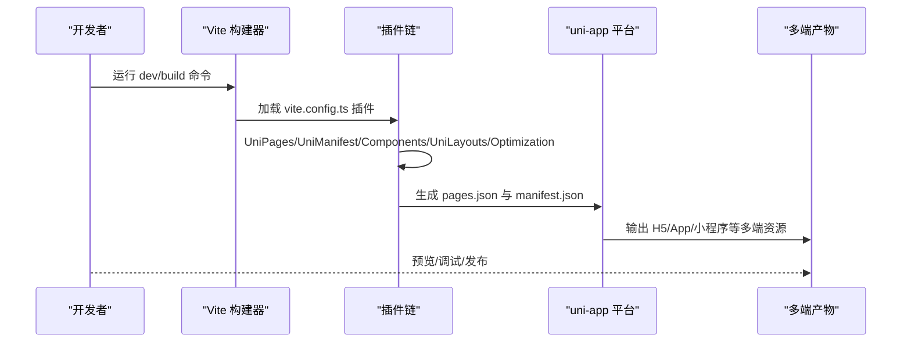
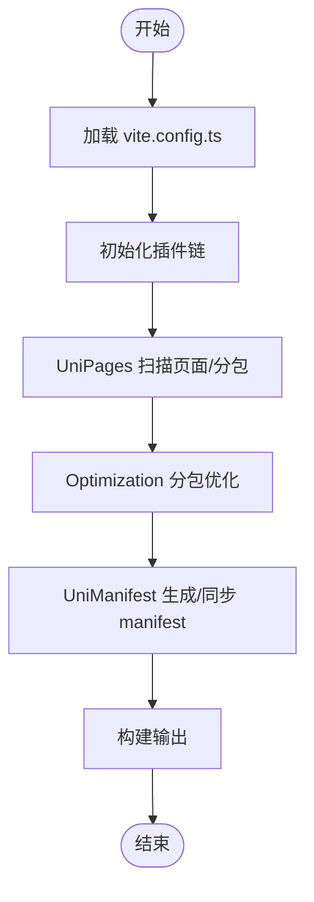
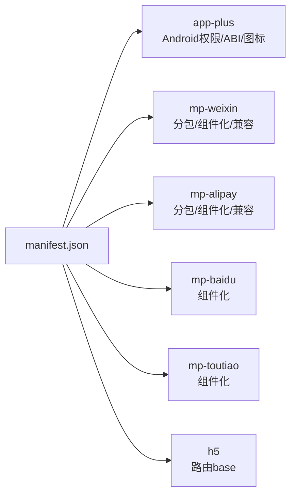
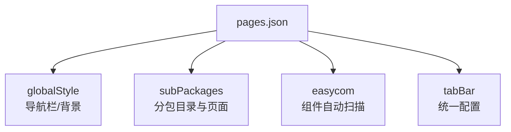
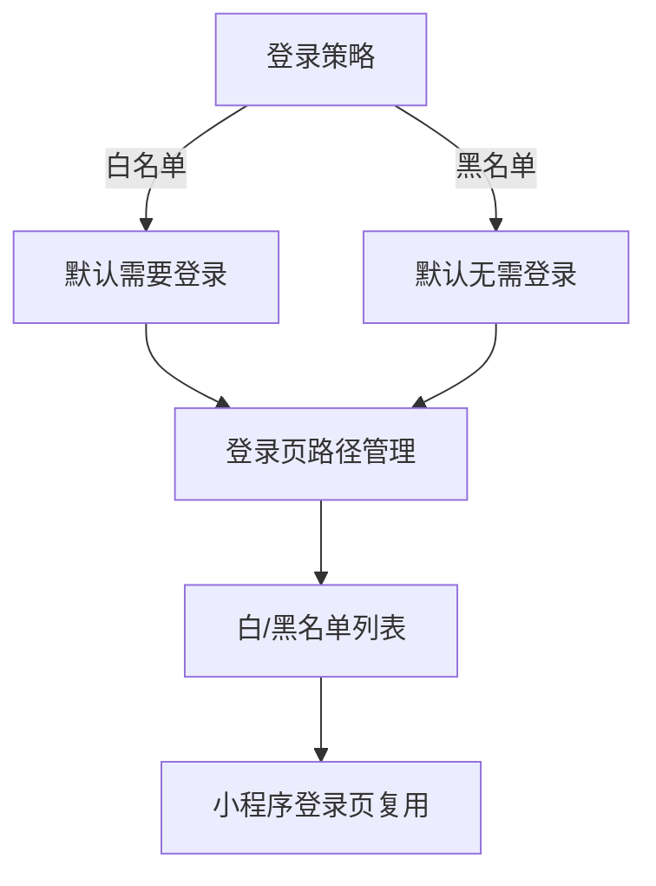
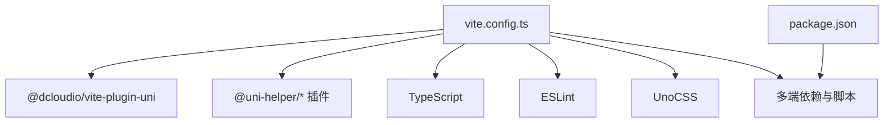

# 项目配置与多端适配

<cite>
**本文档引用的文件**
- [manifest.json](file://frontend/admin-uniapp/src/manifest.json)
- [pages.json](file://frontend/admin-uniapp/src/pages.json)
- [vite.config.ts](file://frontend/admin-uniapp/vite.config.ts)
- [package.json](file://frontend/admin-uniapp/package.json)
- [tsconfig.json](file://frontend/admin-uniapp/tsconfig.json)
- [eslint.config.mjs](file://frontend/admin-uniapp/eslint.config.mjs)
- [uno.config.ts](file://frontend/admin-uniapp/uno.config.ts)
- [router/config.ts](file://frontend/admin-uniapp/src/router/config.ts)
- [main.ts](file://frontend/admin-uniapp/src/main.ts)
- [.env.development](file://frontend/admin-uniapp/env/.env.development)
- [manifest.config.ts](file://frontend/admin-uniapp/manifest.config.ts)
- [pages.config.ts](file://frontend/admin-uniapp/pages.config.ts)
</cite>

## 目录
1. [简介](#简介)
2. [项目结构](#项目结构)
3. [核心组件](#核心组件)
4. [架构总览](#架构总览)
5. [详细组件分析](#详细组件分析)
6. [依赖关系分析](#依赖关系分析)
7. [性能考虑](#性能考虑)
8. [故障排查指南](#故障排查指南)
9. [结论](#结论)
10. [附录](#附录)

## 简介
本文件面向 UniApp 项目，围绕“项目初始化配置、多端编译配置、条件编译使用、manifest.json 配置、pages.json 页面配置、路由导航设置、平台差异处理、条件编译指令、平台 API 调用、跨端兼容性策略、性能优化方案、调试工具使用、多端适配最佳实践、平台特性利用、版本兼容性处理、Vite 构建配置、TypeScript 类型系统、ESLint 代码规范配置”等主题，提供系统化、可操作的配置与适配指南。文档基于仓库中的实际配置文件进行分析与总结，帮助开发者快速理解并落地多端适配。

## 项目结构
该前端工程采用“多端一体化”架构，以 Vite 为构建引擎，结合 uni-app CLI 与一系列官方及社区插件，实现 H5、App、微信小程序、支付宝小程序、百度小程序、字节小程序等多个平台的一致开发体验。关键目录与文件如下：
- 配置层：vite.config.ts、manifest.config.ts、pages.config.ts、tsconfig.json、eslint.config.mjs、uno.config.ts、env 环境变量
- 运行入口：src/main.ts、src/App.vue（入口应用）
- 配置文件：src/manifest.json、src/pages.json
- 路由与拦截：src/router/config.ts、src/router/interceptor.ts
- 样式与主题：src/style、src/uni.scss、uno.config.ts
- 插件与工具：vite-plugins、scripts

**图表来源**
- [vite.config.ts:1-214](file://frontend/admin-uniapp/vite.config.ts#L1-L214)
- [manifest.config.ts:1-165](file://frontend/admin-uniapp/manifest.config.ts#L1-L165)
- [pages.config.ts:1-24](file://frontend/admin-uniapp/pages.config.ts#L1-L24)
- [tsconfig.json:1-46](file://frontend/admin-uniapp/tsconfig.json#L1-L46)
- [eslint.config.mjs:1-65](file://frontend/admin-uniapp/eslint.config.mjs#L1-L65)
- [uno.config.ts:1-120](file://frontend/admin-uniapp/uno.config.ts#L1-L120)
- [main.ts:1-20](file://frontend/admin-uniapp/src/main.ts#L1-L20)
- [manifest.json:1-136](file://frontend/admin-uniapp/src/manifest.json#L1-L136)
- [pages.json:1-800](file://frontend/admin-uniapp/src/pages.json#L1-L800)

**章节来源**
- [vite.config.ts:1-214](file://frontend/admin-uniapp/vite.config.ts#L1-L214)
- [package.json:1-194](file://frontend/admin-uniapp/package.json#L1-L194)

## 核心组件
- Vite 构建配置：统一管理插件链、别名、代理、构建目标、最小化策略、SourceMap 等，支持多端差异化能力注入。
- Manifest 配置：集中管理应用元信息、平台特定配置（Android 权限、iOS 配置、图标、H5 路由 base）、模块与兼容性策略。
- Pages 配置：全局样式、分包策略、TabBar、组件自动扫描与映射规则。
- TypeScript 类型系统：路径别名、类型声明、Vue 编译器选项、类型生成。
- ESLint 代码规范：基于 @uni-helper/eslint-config，统一风格、忽略生成文件、格式化 CSS/HTML。
- UnoCSS：原子化工具链，提供主题色、安全区域、图标集、兼容性预设与转换器。
- 路由与拦截：登录策略、页面白/黑名单、登录页路径、PC 专用页等。
- 环境变量：通过 env 目录与 Vite 加载，支持开发/生产/测试模式。

**章节来源**
- [vite.config.ts:64-213](file://frontend/admin-uniapp/vite.config.ts#L64-L213)
- [manifest.json:1-136](file://frontend/admin-uniapp/src/manifest.json#L1-L136)
- [pages.json:1-800](file://frontend/admin-uniapp/src/pages.json#L1-L800)
- [tsconfig.json:1-46](file://frontend/admin-uniapp/tsconfig.json#L1-L46)
- [eslint.config.mjs:1-65](file://frontend/admin-uniapp/eslint.config.mjs#L1-L65)
- [uno.config.ts:1-120](file://frontend/admin-uniapp/uno.config.ts#L1-L120)
- [router/config.ts:1-46](file://frontend/admin-uniapp/src/router/config.ts#L1-L46)
- [.env.development:1-10](file://frontend/admin-uniapp/env/.env.development#L1-L10)

## 架构总览
下图展示从开发到构建的关键流程：Vite 读取配置 → 插件链处理 → 生成多端产物；Manifest 与 Pages 配置驱动平台差异；TypeScript/ESLint/UnoCSS 提升开发体验与质量。

**图表来源**
- [vite.config.ts:67-164](file://frontend/admin-uniapp/vite.config.ts#L67-L164)
- [manifest.config.ts:24-164](file://frontend/admin-uniapp/manifest.config.ts#L24-L164)
- [pages.config.ts:4-23](file://frontend/admin-uniapp/pages.config.ts#L4-L23)

## 详细组件分析

### Vite 构建配置（多端编译与优化）
- 插件链
  - UniPages：扫描页面、生成 pages.json、支持分包目录与类型声明。
  - Optimization：分包优化、异步跨包调用与组件引用。
  - UniManifest/UniLayouts/UniPlatform：动态生成/同步 manifest 与布局、平台注入。
  - Components/AutoImport：自动导入组件与钩子，生成类型声明。
  - UnoCSS：原子化样式，支持图标与兼容性预设。
  - ViteRestart：热重载配置变更。
  - 自定义修复插件：解决官方编译器的模板内联问题。
  - 打包分析：H5 生产环境可视化。
  - 原生资源复制：App 平台按需复制。
  - 开发者工具自动打开：按需启用。
- 别名与服务
  - 路径别名：@、@img。
  - 服务器：H5 端代理后端接口，支持按前缀重写。
  - 构建目标：ES6，开发不压缩，生产使用 esbuild。
- 环境变量
  - 通过 env 目录加载，支持 NODE_ENV、代理开关、标题、端口等。

**图表来源**
- [vite.config.ts:67-164](file://frontend/admin-uniapp/vite.config.ts#L67-L164)

**章节来源**
- [vite.config.ts:33-213](file://frontend/admin-uniapp/vite.config.ts#L33-L213)
- [package.json:29-97](file://frontend/admin-uniapp/package.json#L29-L97)

### Manifest 配置（应用元信息与平台差异）
- 全局信息：应用名、版本、px 转 rpx 策略、Vue 版本、H5 路由 base。
- 平台特定
  - app-plus：组件化、nvue 编译器版本、启动屏、兼容策略、Android 权限与 ABI、图标。
  - mp-weixin/mp-alipay/mp-baidu/mp-toutiao：小程序平台设置、分包优化、组件化、兼容策略。
  - h5：路由 base。
- 统计开关：uniStatistics 关闭。

**图表来源**
- [manifest.json:8-136](file://frontend/admin-uniapp/src/manifest.json#L8-L136)

**章节来源**
- [manifest.json:1-136](file://frontend/admin-uniapp/src/manifest.json#L1-L136)
- [manifest.config.ts:24-164](file://frontend/admin-uniapp/manifest.config.ts#L24-L164)

### Pages 配置（页面与分包）
- 全局样式：导航栏标题、背景、文字颜色、背景色。
- 分包策略：pages-core、pages-system、pages-infra、pages-bpm 等，提升首屏与包体效率。
- 组件自动扫描：easycom 自动匹配组件，减少手动引入。
- TabBar：统一在 tabbar/config.ts 集中配置。

**图表来源**
- [pages.json:2-800](file://frontend/admin-uniapp/src/pages.json#L2-L800)
- [pages.config.ts:4-23](file://frontend/admin-uniapp/pages.config.ts#L4-L23)

**章节来源**
- [pages.json:1-800](file://frontend/admin-uniapp/src/pages.json#L1-L800)
- [pages.config.ts:1-24](file://frontend/admin-uniapp/pages.config.ts#L1-L24)

### 路由与导航（登录策略与页面守卫）
- 登录策略：支持“默认无需登录”与“默认需要登录”，可通过常量切换。
- 登录页路径：统一管理登录、注册、短信登录、忘记密码、404、仅 PC 页面。
- 白/黑名单：通过 EXCLUDE_LOGIN_PATH_LIST 或页面级 excludeLoginPath 控制。
- 小程序登录页复用：可在 mp 环境复用 H5 登录逻辑。

**图表来源**
- [router/config.ts:3-46](file://frontend/admin-uniapp/src/router/config.ts#L3-L46)

**章节来源**
- [router/config.ts:1-46](file://frontend/admin-uniapp/src/router/config.ts#L1-L46)

### TypeScript 类型系统
- 路径别名：@、@img。
- 类型声明：@dcloudio/types、@uni-helper/uni-types、miniprogram-api-typings、wot-design-uni、z-paging、自定义 async-component/async-import 类型。
- Vue 编译器插件：@uni-helper/uni-types/volar-plugin。
- include/exclude：覆盖 .ts/.js/.d.ts/.vue/.json 等。

**章节来源**
- [tsconfig.json:1-46](file://frontend/admin-uniapp/tsconfig.json#L1-L46)

### ESLint 代码规范
- 基于 @uni-helper/eslint-config，启用 Vue、UnoCSS、Markdown 等规则。
- 忽略生成文件：uni_modules、nativeplugins、dist、自动生成的类型文件、pages.json/manifest.json。
- 自定义规则：关闭部分严格规则，统一 block 顺序、brace 风格等。
- 格式化：CSS/HTML 使用 Prettier。

**章节来源**
- [eslint.config.mjs:1-65](file://frontend/admin-uniapp/eslint.config.mjs#L1-L65)

### UnoCSS 原子化样式
- 预设：presetUni、presetIcons、presetLegacyCompat（兼容低端安卓）。
- 变换器：transformerDirectives、transformerVariantGroup。
- 动态图标：本地 SVG 图标集 my-icons。
- 主题：primary 颜色、字号体系、安全区域类、safelist。
- Windows 兼容：注释掉 content 配置以规避构建错误。

**章节来源**
- [uno.config.ts:1-120](file://frontend/admin-uniapp/uno.config.ts#L1-L120)

### 环境变量与调试
- .env.development：控制是否删除 console、是否开启 sourcemap、后端地址占位。
- Vite 代理：H5 端按前缀重写转发至后端。
- 开发者工具：自动打开微信开发者工具（需配置 VITE_WX_APPID）。

**章节来源**
- [.env.development:1-10](file://frontend/admin-uniapp/env/.env.development#L1-L10)
- [vite.config.ts:185-200](file://frontend/admin-uniapp/vite.config.ts#L185-L200)

## 依赖关系分析
- 构建与运行
  - Vite 5 + @dcloudio/vite-plugin-uni + @uni-helper 插件生态。
  - uni-app 3.x 核心依赖，覆盖 H5/App/小程序等多端。
- 类型与规范
  - @dcloudio/types、@uni-helper/uni-types、miniprogram-api-typings。
  - ESLint + @uni-helper/eslint-config。
- 样式与工具
  - UnoCSS + presetUni + presetLegacyCompat。
  - AutoImport、Components、ViteRestart、rollup-plugin-visualizer。
- 环境与脚本
  - package.json 提供多端 dev/build 脚本，支持 ssr、测试、生产模式。

**图表来源**
- [vite.config.ts:1-31](file://frontend/admin-uniapp/vite.config.ts#L1-L31)
- [package.json:99-177](file://frontend/admin-uniapp/package.json#L99-L177)

**章节来源**
- [package.json:1-194](file://frontend/admin-uniapp/package.json#L1-L194)

## 性能考虑
- 分包策略：pages-core（登录/错误页）、pages-system、pages-infra、pages-bpm 等，降低首屏体积。
- 异步优化：Optimization 插件启用 async-import/async-component，减少包体与加载时间。
- 构建目标：ES6，生产环境使用 esbuild 压缩。
- H5 代理：按前缀重写，避免后端无前缀时的额外处理。
- UnoCSS：按需生成，safelist 与本地图标集减少冗余。
- SourceMap：开发可关闭，生产按需开启，平衡调试与体积。

**章节来源**
- [vite.config.ts:84-94](file://frontend/admin-uniapp/vite.config.ts#L84-L94)
- [vite.config.ts:204-211](file://frontend/admin-uniapp/vite.config.ts#L204-L211)
- [uno.config.ts:74-75](file://frontend/admin-uniapp/uno.config.ts#L74-L75)

## 故障排查指南
- H5 端样式兼容
  - 低端安卓样式问题：启用 presetLegacyCompat，将 rgb()/hsl() 空格分隔转为逗号分隔。
  - Windows 构建报错：注释掉 content 配置，避免覆盖零长度范围。
- 小程序编译问题
  - 支付宝小程序 globalThis 报错：启用 compileOptions.globalObjectMode 并忽略 node_modules。
  - 微信小程序组件虚拟节点属性合并：mergeVirtualHostAttributes=true。
- 构建器模板内联问题
  - 自定义插件禁用 vite:vue 的 devToolsEnabled，强制 inline 为 true。
- 打包分析
  - H5 生产环境可视化：visualizer 插件自动生成 stats.html 并自动打开。
- 原生资源复制
  - App 平台按需复制 native 资源，需开启 VITE_COPY_NATIVE_RES_ENABLE。

**章节来源**
- [uno.config.ts:55-59](file://frontend/admin-uniapp/uno.config.ts#L55-L59)
- [uno.config.ts:97-118](file://frontend/admin-uniapp/uno.config.ts#L97-L118)
- [vite.config.ts:108-119](file://frontend/admin-uniapp/vite.config.ts#L108-L119)
- [vite.config.ts:139-146](file://frontend/admin-uniapp/vite.config.ts#L139-L146)
- [vite.config.ts:148-153](file://frontend/admin-uniapp/vite.config.ts#L148-L153)
- [manifest.config.ts:144-152](file://frontend/admin-uniapp/manifest.config.ts#L144-L152)
- [manifest.config.ts:132-136](file://frontend/admin-uniapp/manifest.config.ts#L132-L136)

## 结论
本项目通过 Vite + uni-app 插件生态实现了高效的多端一体化开发。借助 Manifest 与 Pages 的集中配置、TypeScript 与 ESLint 的质量保障、UnoCSS 的样式一致性与兼容性策略，以及分包与异步优化的性能方案，能够在 H5、App、微信/支付宝/百度/字节小程序等多端保持一致体验与高质量交付。建议在团队协作中统一遵循本指南的配置与最佳实践，持续迭代优化。

## 附录
- 多端命令参考（来自 package.json scripts）
  - 开发：dev、dev:h5、dev:mp-weixin、dev:app 等。
  - 构建：build、build:h5、build:mp-weixin、build:app 等。
  - 测试/生产：带 --mode test/production。
  - SSR：dev:h5:ssr、build:h5:ssr。
- 环境变量
  - VITE_APP_PORT、VITE_SERVER_BASEURL、VITE_APP_TITLE、VITE_DELETE_CONSOLE、VITE_APP_PUBLIC_BASE、VITE_APP_PROXY_ENABLE、VITE_APP_PROXY_PREFIX、VITE_COPY_NATIVE_RES_ENABLE 等。

**章节来源**
- [package.json:29-97](file://frontend/admin-uniapp/package.json#L29-L97)
- [.env.development:1-10](file://frontend/admin-uniapp/env/.env.development#L1-L10)