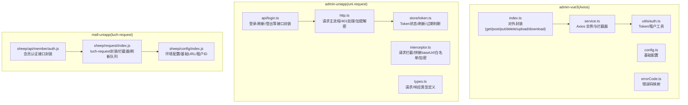
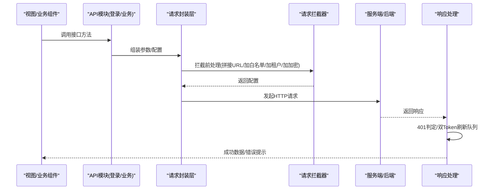
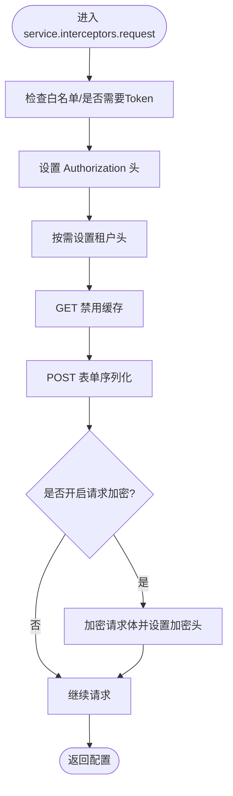
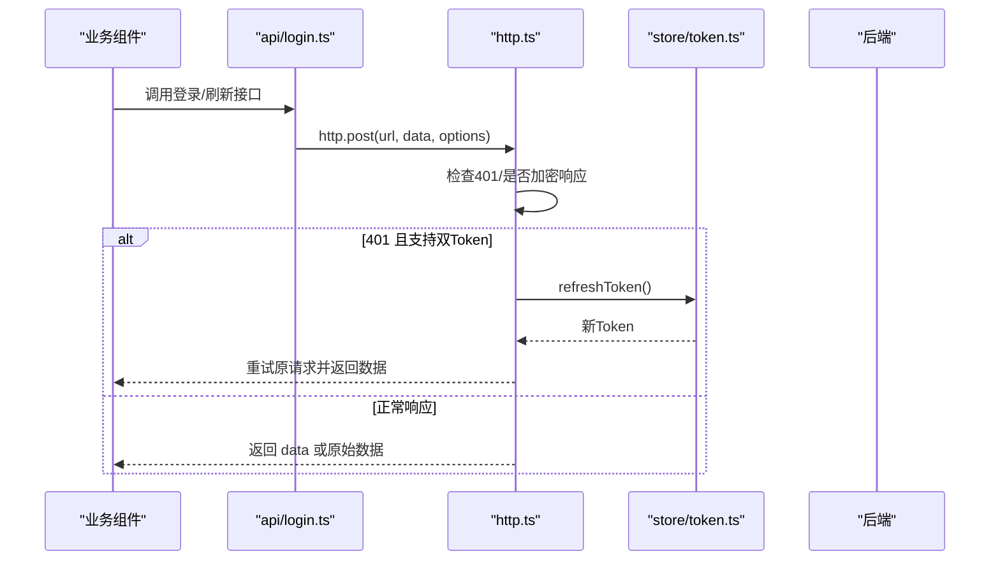
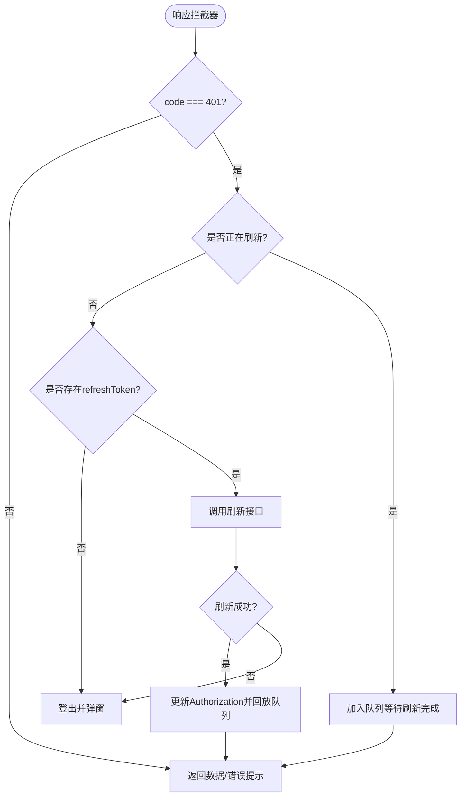
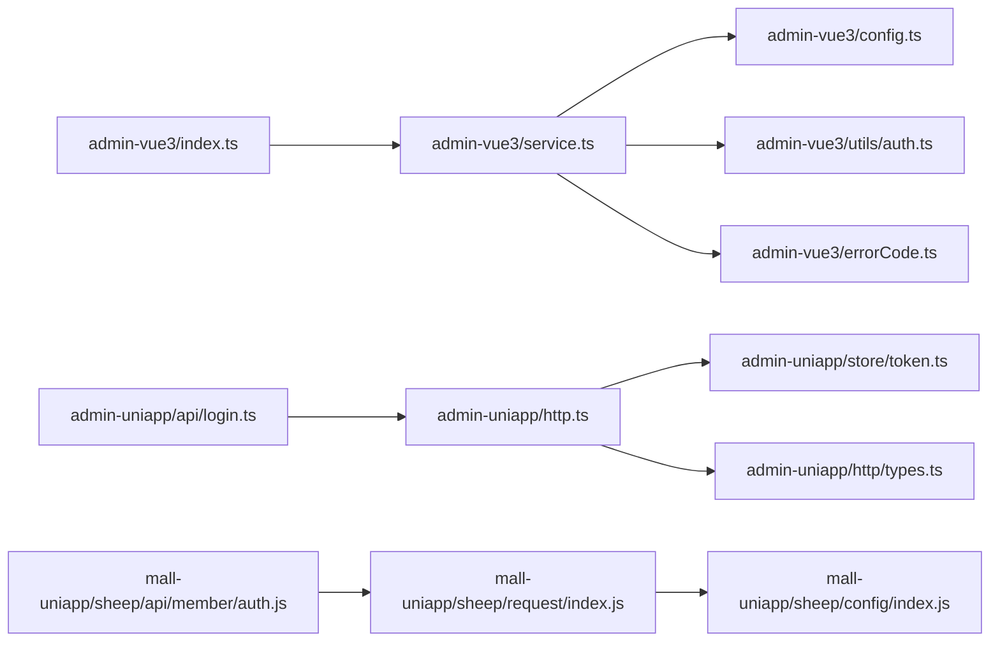

# API 接口集成

<cite>
**本文引用的文件**
- [frontend/admin-vue3/src/config/axios/index.ts](file://frontend/admin-vue3/src/config/axios/index.ts)
- [frontend/admin-vue3/src/config/axios/service.ts](file://frontend/admin-vue3/src/config/axios/service.ts)
- [frontend/admin-vue3/src/config/axios/config.ts](file://frontend/admin-vue3/src/config/axios/config.ts)
- [frontend/admin-vue3/src/config/axios/errorCode.ts](file://frontend/admin-vue3/src/config/axios/errorCode.ts)
- [frontend/admin-vue3/src/utils/auth.ts](file://frontend/admin-vue3/src/utils/auth.ts)
- [frontend/admin-uniapp/src/http/http.ts](file://frontend/admin-uniapp/src/http/http.ts)
- [frontend/admin-uniapp/src/http/interceptor.ts](file://frontend/admin-uniapp/src/http/interceptor.ts)
- [frontend/admin-uniapp/src/http/types.ts](file://frontend/admin-uniapp/src/http/types.ts)
- [frontend/admin-uniapp/src/store/token.ts](file://frontend/admin-uniapp/src/store/token.ts)
- [frontend/mall-uniapp/sheep/request/index.js](file://frontend/mall-uniapp/sheep/request/index.js)
- [frontend/mall-uniapp/sheep/config/index.js](file://frontend/mall-uniapp/sheep/config/index.js)
- [frontend/admin-uniapp/src/api/login.ts](file://frontend/admin-uniapp/src/api/login.ts)
- [frontend/mall-uniapp/sheep/api/member/auth.js](file://frontend/mall-uniapp/sheep/api/member/auth.js)
</cite>

## 目录
1. [简介](#简介)
2. [项目结构](#项目结构)
3. [核心组件](#核心组件)
4. [架构总览](#架构总览)
5. [详细组件分析](#详细组件分析)
6. [依赖关系分析](#依赖关系分析)
7. [性能考量](#性能考量)
8. [故障排查指南](#故障排查指南)
9. [结论](#结论)
10. [附录](#附录)

## 简介
本文件面向 Vue3 与 UniApp 生态下的 API 接口集成，系统性梳理 Axios 配置与拦截器、请求封装策略、响应处理机制、鉴权与 Token 管理、刷新与重试策略、数据格式转换与类型定义、接口测试方法以及最佳实践与性能优化建议。内容覆盖 admin-vue3（基于 Element Plus + Axios）与 admin-uniapp、mall-uniapp（基于 uni.request/luch-request）两套实现，帮助读者快速理解并落地安全、稳定、可维护的 API 集成方案。

## 项目结构
本仓库前端部分包含三套 API 集成实现：
- admin-vue3：基于 Axios 的完整封装，包含请求/响应拦截器、错误码映射、双 Token 刷新、加密开关、多租户头注入等。
- admin-uniapp：基于 uni.request 的封装，支持加密、双 Token 刷新、队列重试、白名单免 Token、H5 代理拼接等。
- mall-uniapp：基于 luch-request 的封装，提供统一拦截器、401 刷新、错误提示、加载控制、租户与终端头注入等。

图表来源
- [frontend/admin-vue3/src/config/axios/index.ts:1-48](file://frontend/admin-vue3/src/config/axios/index.ts#L1-L48)
- [frontend/admin-vue3/src/config/axios/service.ts:1-274](file://frontend/admin-vue3/src/config/axios/service.ts#L1-L274)
- [frontend/admin-vue3/src/config/axios/config.ts:1-29](file://frontend/admin-vue3/src/config/axios/config.ts#L1-L29)
- [frontend/admin-vue3/src/config/axios/errorCode.ts:1-7](file://frontend/admin-vue3/src/config/axios/errorCode.ts#L1-L7)
- [frontend/admin-vue3/src/utils/auth.ts:1-81](file://frontend/admin-vue3/src/utils/auth.ts#L1-L81)
- [frontend/admin-uniapp/src/http/http.ts:1-224](file://frontend/admin-uniapp/src/http/http.ts#L1-L224)
- [frontend/admin-uniapp/src/http/interceptor.ts:1-105](file://frontend/admin-uniapp/src/http/interceptor.ts#L1-L105)
- [frontend/admin-uniapp/src/http/types.ts:1-42](file://frontend/admin-uniapp/src/http/types.ts#L1-L42)
- [frontend/admin-uniapp/src/store/token.ts:1-342](file://frontend/admin-uniapp/src/store/token.ts#L1-L342)
- [frontend/admin-uniapp/src/api/login.ts:1-149](file://frontend/admin-uniapp/src/api/login.ts#L1-L149)
- [frontend/mall-uniapp/sheep/request/index.js:1-311](file://frontend/mall-uniapp/sheep/request/index.js#L1-L311)
- [frontend/mall-uniapp/sheep/config/index.js:1-32](file://frontend/mall-uniapp/sheep/config/index.js#L1-L32)
- [frontend/mall-uniapp/sheep/api/member/auth.js:1-133](file://frontend/mall-uniapp/sheep/api/member/auth.js#L1-L133)

章节来源
- [frontend/admin-vue3/src/config/axios/index.ts:1-48](file://frontend/admin-vue3/src/config/axios/index.ts#L1-L48)
- [frontend/admin-vue3/src/config/axios/service.ts:1-274](file://frontend/admin-vue3/src/config/axios/service.ts#L1-L274)
- [frontend/admin-vue3/src/config/axios/config.ts:1-29](file://frontend/admin-vue3/src/config/axios/config.ts#L1-L29)
- [frontend/admin-vue3/src/config/axios/errorCode.ts:1-7](file://frontend/admin-vue3/src/config/axios/errorCode.ts#L1-L7)
- [frontend/admin-vue3/src/utils/auth.ts:1-81](file://frontend/admin-vue3/src/utils/auth.ts#L1-L81)
- [frontend/admin-uniapp/src/http/http.ts:1-224](file://frontend/admin-uniapp/src/http/http.ts#L1-L224)
- [frontend/admin-uniapp/src/http/interceptor.ts:1-105](file://frontend/admin-uniapp/src/http/interceptor.ts#L1-L105)
- [frontend/admin-uniapp/src/http/types.ts:1-42](file://frontend/admin-uniapp/src/http/types.ts#L1-L42)
- [frontend/admin-uniapp/src/store/token.ts:1-342](file://frontend/admin-uniapp/src/store/token.ts#L1-L342)
- [frontend/admin-uniapp/src/api/login.ts:1-149](file://frontend/admin-uniapp/src/api/login.ts#L1-L149)
- [frontend/mall-uniapp/sheep/request/index.js:1-311](file://frontend/mall-uniapp/sheep/request/index.js#L1-L311)
- [frontend/mall-uniapp/sheep/config/index.js:1-32](file://frontend/mall-uniapp/sheep/config/index.js#L1-L32)
- [frontend/mall-uniapp/sheep/api/member/auth.js:1-133](file://frontend/mall-uniapp/sheep/api/member/auth.js#L1-L133)

## 核心组件
- Axios 封装（admin-vue3）
  - 对外暴露 get/post/put/delete/upload/download 等方法，统一设置 Content-Type 与 headers。
  - 通过 service.ts 创建 Axios 实例，内置请求/响应拦截器，支持双 Token 刷新、加密/解密、GET 缓存禁用、表单序列化、多租户头注入、错误码映射与国际化提示。
- uni.request 封装（admin-uniapp）
  - http.ts 主流程：统一处理加密响应、401 判定与双 Token 刷新、业务错误提示、原始数据透传、网络错误 Toast。
  - interceptor.ts：拼接 baseUrl、白名单免 Token、H5 代理前缀、租户头、请求加密。
  - store/token.ts：Token 状态管理、过期判断、刷新、登出、tryGetValidToken。
- luch-request 封装（mall-uniapp）
  - sheep/request/index.js：统一拦截器、401 刷新队列、错误提示、加载控制、租户与终端头注入、登录后自动写入 Token。
  - sheep/config/index.js：环境变量配置与基础 URL。

章节来源
- [frontend/admin-vue3/src/config/axios/index.ts:1-48](file://frontend/admin-vue3/src/config/axios/index.ts#L1-L48)
- [frontend/admin-vue3/src/config/axios/service.ts:1-274](file://frontend/admin-vue3/src/config/axios/service.ts#L1-L274)
- [frontend/admin-uniapp/src/http/http.ts:1-224](file://frontend/admin-uniapp/src/http/http.ts#L1-L224)
- [frontend/admin-uniapp/src/http/interceptor.ts:1-105](file://frontend/admin-uniapp/src/http/interceptor.ts#L1-L105)
- [frontend/admin-uniapp/src/store/token.ts:1-342](file://frontend/admin-uniapp/src/store/token.ts#L1-L342)
- [frontend/mall-uniapp/sheep/request/index.js:1-311](file://frontend/mall-uniapp/sheep/request/index.js#L1-L311)
- [frontend/mall-uniapp/sheep/config/index.js:1-32](file://frontend/mall-uniapp/sheep/config/index.js#L1-L32)

## 架构总览
以下图展示三套实现的请求链路与关键节点：

图表来源
- [frontend/admin-uniapp/src/http/interceptor.ts:1-105](file://frontend/admin-uniapp/src/http/interceptor.ts#L1-L105)
- [frontend/admin-uniapp/src/http/http.ts:1-224](file://frontend/admin-uniapp/src/http/http.ts#L1-L224)
- [frontend/admin-vue3/src/config/axios/service.ts:1-274](file://frontend/admin-vue3/src/config/axios/service.ts#L1-L274)
- [frontend/mall-uniapp/sheep/request/index.js:1-311](file://frontend/mall-uniapp/sheep/request/index.js#L1-L311)

## 详细组件分析

### Axios 配置与拦截器（admin-vue3）
- 基础配置
  - 基础 URL、默认 Content-Type、超时时间、成功状态码约定等集中于 config.ts。
- 请求拦截器
  - 白名单过滤、Authorization 注入、多租户头注入、GET 禁缓存、表单序列化、请求加密开关与加密头设置。
- 响应拦截器
  - 响应解密、二进制数据处理、业务码判定、401 无感刷新、错误码映射与国际化提示、网络错误统一提示。
- Token 管理
  - 通过 utils/auth.ts 读取/设置/删除 Token，支持双 Token 模式与访问/刷新过期时间计算。
- 错误码映射
  - errorCode.ts 提供常见错误码到提示文本的映射，便于统一处理。

图表来源
- [frontend/admin-vue3/src/config/axios/service.ts:49-108](file://frontend/admin-vue3/src/config/axios/service.ts#L49-L108)
- [frontend/admin-vue3/src/config/axios/config.ts:1-29](file://frontend/admin-vue3/src/config/axios/config.ts#L1-L29)
- [frontend/admin-vue3/src/utils/auth.ts:1-81](file://frontend/admin-vue3/src/utils/auth.ts#L1-L81)

章节来源
- [frontend/admin-vue3/src/config/axios/config.ts:1-29](file://frontend/admin-vue3/src/config/axios/config.ts#L1-L29)
- [frontend/admin-vue3/src/config/axios/service.ts:1-274](file://frontend/admin-vue3/src/config/axios/service.ts#L1-L274)
- [frontend/admin-vue3/src/utils/auth.ts:1-81](file://frontend/admin-vue3/src/utils/auth.ts#L1-L81)
- [frontend/admin-vue3/src/config/axios/errorCode.ts:1-7](file://frontend/admin-vue3/src/config/axios/errorCode.ts#L1-L7)

### 请求封装策略（admin-vue3）
- 对外封装
  - index.ts 暴露 get/post/put/delete/upload/download 等方法，统一设置 headersType 与 headers，简化调用侧使用。
- 类型与数据流
  - 泛型约束返回值类型，自动提取 data 字段；download/upload 保留原生行为以便处理二进制与文件上传。
- 与拦截器配合
  - 通过 service.ts 的拦截器完成鉴权、加密、租户、序列化等横切逻辑，封装层专注语义化方法名。

章节来源
- [frontend/admin-vue3/src/config/axios/index.ts:1-48](file://frontend/admin-vue3/src/config/axios/index.ts#L1-L48)
- [frontend/admin-vue3/src/config/axios/service.ts:1-274](file://frontend/admin-vue3/src/config/axios/service.ts#L1-L274)

### 响应处理机制（admin-vue3）
- 401 无感刷新
  - 通过 requestList 队列保存等待刷新后的请求，刷新成功后批量回放；刷新失败则引导登出。
- 业务错误处理
  - code 非 200 时统一提示，忽略特定提示（如刷新令牌过期）以避免循环 401。
- 二进制与 JSON
  - 对 blob/arraybuffer 做类型判断，防止导出失败时仍返回 JSON。
- 国际化与提示
  - 错误码映射 + i18n 提示 + Element Plus 通知/消息提示。

章节来源
- [frontend/admin-vue3/src/config/axios/service.ts:110-241](file://frontend/admin-vue3/src/config/axios/service.ts#L110-L241)
- [frontend/admin-vue3/src/config/axios/errorCode.ts:1-7](file://frontend/admin-vue3/src/config/axios/errorCode.ts#L1-L7)

### API 模块化组织与接口封装（admin-uniapp）
- 模块化
  - api/login.ts 将登录、注册、短信登录、刷新 Token、登出等接口集中管理，统一调用 http.ts。
- 类型定义
  - types.ts 定义 CustomRequestOptions、IResponse、分页参数与结果等，保证请求/响应一致性。
- 统一入口
  - http.ts 对 uni.request 进行统一封装，处理加密响应、401 刷新、业务错误提示、原始数据透传、网络错误提示。

图表来源
- [frontend/admin-uniapp/src/api/login.ts:1-149](file://frontend/admin-uniapp/src/api/login.ts#L1-L149)
- [frontend/admin-uniapp/src/http/http.ts:1-224](file://frontend/admin-uniapp/src/http/http.ts#L1-L224)
- [frontend/admin-uniapp/src/store/token.ts:1-342](file://frontend/admin-uniapp/src/store/token.ts#L1-L342)

章节来源
- [frontend/admin-uniapp/src/api/login.ts:1-149](file://frontend/admin-uniapp/src/api/login.ts#L1-L149)
- [frontend/admin-uniapp/src/http/http.ts:1-224](file://frontend/admin-uniapp/src/http/http.ts#L1-L224)
- [frontend/admin-uniapp/src/http/types.ts:1-42](file://frontend/admin-uniapp/src/http/types.ts#L1-L42)
- [frontend/admin-uniapp/src/store/token.ts:1-342](file://frontend/admin-uniapp/src/store/token.ts#L1-L342)

### 鉴权机制与 Token 管理（admin-uniapp）
- Token 存储与过期判断
  - token.ts 维护 accessToken/refreshToken/expiresTime 或 token/expiresIn，计算过期时间并提供 hasValidLogin、getValidToken、tryGetValidToken。
- 双 Token 刷新
  - 401 时若存在 refreshToken，加入 taskQueue，串行刷新后批量回放；刷新失败则登出并跳转登录页。
- 白名单与免 Token
  - 白名单包含 /login、/refresh-token、/system/tenant/get-id-by-name 等，避免不必要的鉴权头。

章节来源
- [frontend/admin-uniapp/src/store/token.ts:1-342](file://frontend/admin-uniapp/src/store/token.ts#L1-L342)
- [frontend/admin-uniapp/src/http/interceptor.ts:1-105](file://frontend/admin-uniapp/src/http/interceptor.ts#L1-L105)
- [frontend/admin-uniapp/src/http/http.ts:1-224](file://frontend/admin-uniapp/src/http/http.ts#L1-L224)

### luch-request 封装与刷新策略（mall-uniapp）
- 统一拦截器
  - request.interceptors.request：鉴权头、租户头、终端头、加载控制、授权校验。
  - request.interceptors.response：登录接口自动写入 Token、401 刷新队列、错误提示、成功提示。
- 刷新策略
  - isRefreshToken 标志 + requestList 队列，避免并发刷新；刷新失败统一登出并弹窗提示。
- 配置中心
  - sheep/config/index.js 读取环境变量，提供 baseUrl、apiPath、tenantId 等。

图表来源
- [frontend/mall-uniapp/sheep/request/index.js:112-275](file://frontend/mall-uniapp/sheep/request/index.js#L112-L275)

章节来源
- [frontend/mall-uniapp/sheep/request/index.js:1-311](file://frontend/mall-uniapp/sheep/request/index.js#L1-L311)
- [frontend/mall-uniapp/sheep/config/index.js:1-32](file://frontend/mall-uniapp/sheep/config/index.js#L1-L32)
- [frontend/mall-uniapp/sheep/api/member/auth.js:1-133](file://frontend/mall-uniapp/sheep/api/member/auth.js#L1-L133)

### 数据格式转换与类型定义
- admin-vue3
  - 通过 config.ts 设置默认 Content-Type；service.ts 在 POST 时对 application/x-www-form-urlencoded 做 qs 序列化。
  - 二进制响应通过 responseType 判断，防止 JSON 导出失败。
- admin-uniapp
  - types.ts 定义 IResponse 兼容 msg/message 字段，支持 original 透传原始数据。
- mall-uniapp
  - luch-request 默认 header 与平台信息注入，custom 字段承载业务开关（如 showLoading、showError、auth）。

章节来源
- [frontend/admin-vue3/src/config/axios/config.ts:1-29](file://frontend/admin-vue3/src/config/axios/config.ts#L1-L29)
- [frontend/admin-vue3/src/config/axios/service.ts:78-86](file://frontend/admin-vue3/src/config/axios/service.ts#L78-L86)
- [frontend/admin-uniapp/src/http/types.ts:1-42](file://frontend/admin-uniapp/src/http/types.ts#L1-L42)
- [frontend/mall-uniapp/sheep/request/index.js:50-67](file://frontend/mall-uniapp/sheep/request/index.js#L50-L67)

### 接口测试方法
- 单元测试
  - admin-vue3：可 mock service.ts 的 request/response 拦截器，断言 401 刷新队列、错误码提示、二进制导出分支。
  - admin-uniapp：mock http.ts 的 success/fail 分支，验证 401 刷新、白名单、加密开关。
  - mall-uniapp：mock luch-request 的 response 拦截器，断言 401 刷新队列与错误提示。
- E2E 测试
  - 使用 http-client.env.json 或 Postman 环境变量，覆盖不同租户、加密开关、H5 代理等场景。
- 端到端验证
  - 在 admin-uniapp 的 script/idea/http-client.env.json 中配置环境变量，结合 H5 代理与多后端拼接验证。

章节来源
- [frontend/admin-vue3/src/config/axios/service.ts:110-241](file://frontend/admin-vue3/src/config/axios/service.ts#L110-L241)
- [frontend/admin-uniapp/src/http/http.ts:1-224](file://frontend/admin-uniapp/src/http/http.ts#L1-L224)
- [frontend/mall-uniapp/sheep/request/index.js:112-275](file://frontend/mall-uniapp/sheep/request/index.js#L112-L275)
- [backend/script/idea/http-client.env.json](file://backend/script/idea/http-client.env.json)

## 依赖关系分析
- admin-vue3
  - index.ts 依赖 service.ts；service.ts 依赖 config.ts、utils/auth.ts、errorCode.ts。
- admin-uniapp
  - api/login.ts 依赖 http.ts；http.ts 依赖 store/token.ts、http/types.ts、utils/encrypt、工具函数。
- mall-uniapp
  - sheep/api/member/auth.js 依赖 sheep/request/index.js；sheep/request/index.js 依赖 sheep/config/index.js。

图表来源
- [frontend/admin-vue3/src/config/axios/index.ts:1-48](file://frontend/admin-vue3/src/config/axios/index.ts#L1-L48)
- [frontend/admin-vue3/src/config/axios/service.ts:1-274](file://frontend/admin-vue3/src/config/axios/service.ts#L1-L274)
- [frontend/admin-vue3/src/config/axios/config.ts:1-29](file://frontend/admin-vue3/src/config/axios/config.ts#L1-L29)
- [frontend/admin-vue3/src/utils/auth.ts:1-81](file://frontend/admin-vue3/src/utils/auth.ts#L1-L81)
- [frontend/admin-vue3/src/config/axios/errorCode.ts:1-7](file://frontend/admin-vue3/src/config/axios/errorCode.ts#L1-L7)
- [frontend/admin-uniapp/src/api/login.ts:1-149](file://frontend/admin-uniapp/src/api/login.ts#L1-L149)
- [frontend/admin-uniapp/src/http/http.ts:1-224](file://frontend/admin-uniapp/src/http/http.ts#L1-L224)
- [frontend/admin-uniapp/src/store/token.ts:1-342](file://frontend/admin-uniapp/src/store/token.ts#L1-L342)
- [frontend/admin-uniapp/src/http/types.ts:1-42](file://frontend/admin-uniapp/src/http/types.ts#L1-L42)
- [frontend/mall-uniapp/sheep/api/member/auth.js:1-133](file://frontend/mall-uniapp/sheep/api/member/auth.js#L1-L133)
- [frontend/mall-uniapp/sheep/request/index.js:1-311](file://frontend/mall-uniapp/sheep/request/index.js#L1-L311)
- [frontend/mall-uniapp/sheep/config/index.js:1-32](file://frontend/mall-uniapp/sheep/config/index.js#L1-L32)

章节来源
- [frontend/admin-vue3/src/config/axios/index.ts:1-48](file://frontend/admin-vue3/src/config/axios/index.ts#L1-L48)
- [frontend/admin-vue3/src/config/axios/service.ts:1-274](file://frontend/admin-vue3/src/config/axios/service.ts#L1-L274)
- [frontend/admin-uniapp/src/api/login.ts:1-149](file://frontend/admin-uniapp/src/api/login.ts#L1-L149)
- [frontend/admin-uniapp/src/http/http.ts:1-224](file://frontend/admin-uniapp/src/http/http.ts#L1-L224)
- [frontend/mall-uniapp/sheep/request/index.js:1-311](file://frontend/mall-uniapp/sheep/request/index.js#L1-L311)

## 性能考量
- 请求缓存规避
  - admin-vue3 在 GET 请求中设置 no-cache 头，避免浏览器缓存导致的数据陈旧。
- 序列化优化
  - admin-vue3 对 application/x-www-form-urlencoded 做显式序列化，减少后端解析成本。
- 二进制处理
  - admin-vue3 对 blob/arraybuffer 做类型判断，避免错误导出；mall-uniapp 对 Excel 等导出场景更友好。
- 加载与提示
  - mall-uniapp 通过 custom.showLoading 控制全局 loading，避免频繁 UI 抖动；admin-uniapp 通过 hideErrorToast 控制错误提示频率。
- 超时与代理
  - admin-vue3 设置合理超时；admin-uniapp 在 H5 下支持代理前缀拼接，降低跨域与开发调试成本。

章节来源
- [frontend/admin-vue3/src/config/axios/service.ts:72-86](file://frontend/admin-vue3/src/config/axios/service.ts#L72-L86)
- [frontend/admin-vue3/src/config/axios/service.ts:138-147](file://frontend/admin-vue3/src/config/axios/service.ts#L138-L147)
- [frontend/mall-uniapp/sheep/request/index.js:72-107](file://frontend/mall-uniapp/sheep/request/index.js#L72-L107)
- [frontend/admin-uniapp/src/http/interceptor.ts:34-48](file://frontend/admin-uniapp/src/http/interceptor.ts#L34-L48)

## 故障排查指南
- 401 未登录/过期
  - admin-vue3：检查刷新接口是否可用、刷新队列是否正确回放、忽略提示（如刷新令牌过期）是否影响登出流程。
  - admin-uniapp：确认双 Token 模式下 refreshToken 是否存在，taskQueue 是否清空；必要时手动登出并记录 lastPage。
  - mall-uniapp：确认 refreshToken 是否存在、刷新失败是否触发登出弹窗。
- 加密/解密失败
  - admin-vue3/admin-uniapp：检查 ApiEncrypt.getEncryptHeader() 与响应头一致，请求体加密失败时抛出错误并阻断请求。
- 网络错误
  - admin-vue3：统一提示 Network Error/timeout；admin-uniapp：Toast 提示网络错误；mall-uniapp：根据 statusCode 与 errMsg 映射提示。
- 跨域与代理
  - admin-uniapp：H5 下检查 VITE_APP_PROXY_ENABLE/VITE_APP_PROXY_PREFIX 是否正确；非 H5 直接拼接 baseUrl。
- 租户头缺失
  - admin-vue3/admin-uniapp：确认 VITE_APP_TENANT_ENABLE 与 useUserStore().tenantId 是否正确注入。

章节来源
- [frontend/admin-vue3/src/config/axios/service.ts:154-196](file://frontend/admin-vue3/src/config/axios/service.ts#L154-L196)
- [frontend/admin-uniapp/src/http/http.ts:40-112](file://frontend/admin-uniapp/src/http/http.ts#L40-L112)
- [frontend/admin-uniapp/src/http/interceptor.ts:70-91](file://frontend/admin-uniapp/src/http/interceptor.ts#L70-L91)
- [frontend/mall-uniapp/sheep/request/index.js:222-275](file://frontend/mall-uniapp/sheep/request/index.js#L222-L275)

## 结论
本项目提供了三套可复用的 API 集成方案：admin-vue3 的 Axios 完整封装、admin-uniapp 的 uni.request 统一封装、mall-uniapp 的 luch-request 封装。它们共同具备以下能力：
- 统一的鉴权与 Token 管理（含双 Token 刷新与过期判断）
- 请求/响应拦截器与横切能力（加密/解密、租户头、序列化、超时）
- 401 无感刷新与请求队列回放
- 类型定义与模块化组织
- 可扩展的错误处理与国际化提示
- 针对不同运行环境（H5/小程序/APP）的适配

建议在实际项目中：
- 优先采用 Axios（admin-vue3）以获得更强的拦截器生态与社区支持；
- 在 UniApp/H5 场景选择 admin-uniapp 或 mall-uniapp，结合业务特性选择 luch-request 或 uni.request；
- 将 Token 刷新、加密开关、租户头注入等横切逻辑下沉至拦截器，保持业务接口清晰；
- 通过类型定义与单元测试保障接口契约稳定。

## 附录
- 最佳实践清单
  - 所有请求均通过统一封装层发起，避免散落的请求调用。
  - 401 与业务错误统一处理，避免调用方重复判断。
  - 加密开关与响应解密在拦截器内完成，业务侧透明。
  - 分页接口统一 PageParam/PageResult 类型，便于复用。
  - H5 代理与多后端拼接在拦截器中集中处理，减少业务耦合。
- 调试工具
  - 使用浏览器 Network 面板观察 Authorization、tenant-id、加密头；在 uni-app 中通过 Toast/日志定位问题。
  - 在 mall-uniapp 中利用 custom.showLoading/showError 控制 UI 提示，便于定位错误来源。