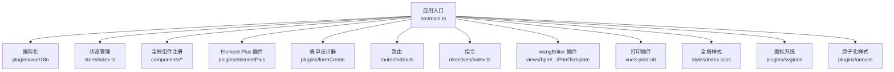
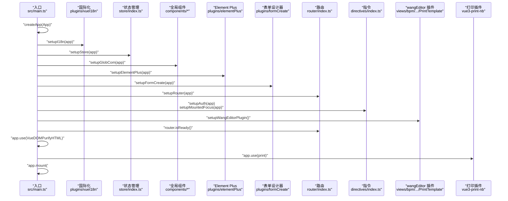
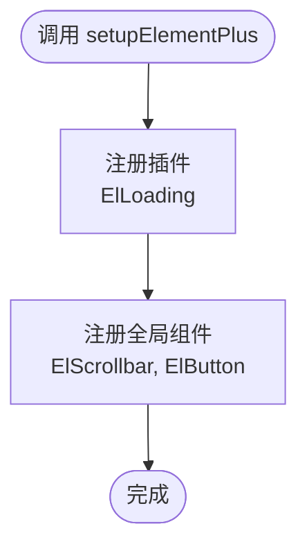
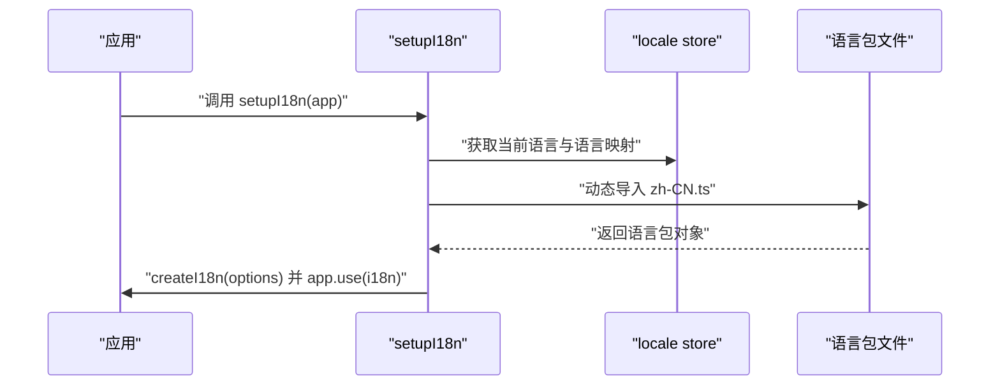
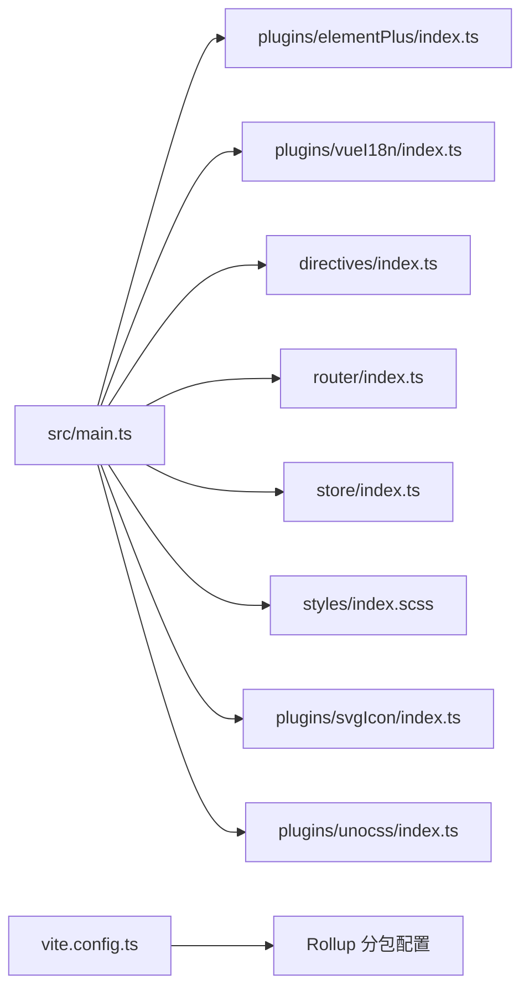

# UI 组件与设计系统

<cite>
**本文档引用的文件**
- [main.ts](file://frontend/admin-vue3/src/main.ts)
- [package.json](file://frontend/admin-vue3/package.json)
- [vite.config.ts](file://frontend/admin-vue3/vite.config.ts)
- [elementPlus/index.ts](file://frontend/admin-vue3/src/plugins/elementPlus/index.ts)
- [vueI18n/index.ts](file://frontend/admin-vue3/src/plugins/vueI18n/index.ts)
- [svgIcon/index.ts](file://frontend/admin-vue3/src/plugins/svgIcon/index.ts)
- [unocss/index.ts](file://frontend/admin-vue3/src/plugins/unocss/index.ts)
- [directives/index.ts](file://frontend/admin-vue3/src/directives/index.ts)
- [styles/index.scss](file://frontend/admin-vue3/src/styles/index.scss)
- [store/index.ts](file://frontend/admin-vue3/src/store/index.ts)
- [router/index.ts](file://frontend/admin-vue3/src/router/index.ts)
- [locales/zh-CN.ts](file://frontend/admin-vue3/src/locales/zh-CN.ts)
</cite>

## 目录
1. [引言](#引言)
2. [项目结构](#项目结构)
3. [核心组件](#核心组件)
4. [架构总览](#架构总览)
5. [详细组件分析](#详细组件分析)
6. [依赖关系分析](#依赖关系分析)
7. [性能考虑](#性能考虑)
8. [故障排查指南](#故障排查指南)
9. [结论](#结论)
10. [附录](#附录)

## 引言
本文件面向 Vue3 UI 组件与设计系统的使用者与维护者，系统化梳理项目中的组件库使用策略、插件体系、样式主题与国际化等关键能力，并给出常见业务场景（表单、表格、弹窗）的封装建议与最佳实践。文档以仓库现有实现为基础，结合架构图与流程图帮助读者快速理解从应用启动到组件运行的完整链路。

## 项目结构
前端采用 Vite + Vue3 + TypeScript 构建，核心入口在应用初始化阶段集中装配插件与全局能力：
- 应用入口负责初始化 i18n、状态管理、全局组件、Element Plus、表单设计器、路由、指令、wangEditor、打印插件等
- 插件层通过模块化函数统一注册，便于扩展与替换
- 样式层通过 UnoCSS、SCSS 变量与 Element Plus 主题变量协同，形成统一的设计系统基座
- 国际化采用 vue-i18n，按需加载语言包并同步 HTML 语言属性

图表来源
- [main.ts:51-81](file://frontend/admin-vue3/src/main.ts#L51-L81)
- [store/index.ts:8-10](file://frontend/admin-vue3/src/store/index.ts#L8-L10)
- [router/index.ts:32-34](file://frontend/admin-vue3/src/router/index.ts#L32-L34)
- [elementPlus/index.ts:9-17](file://frontend/admin-vue3/src/plugins/elementPlus/index.ts#L9-L17)
- [vueI18n/index.ts:38-42](file://frontend/admin-vue3/src/plugins/vueI18n/index.ts#L38-L42)
- [directives/index.ts:10-24](file://frontend/admin-vue3/src/directives/index.ts#L10-L24)
- [styles/index.scss:1-38](file://frontend/admin-vue3/src/styles/index.scss#L1-L38)
- [svgIcon/index.ts:1-4](file://frontend/admin-vue3/src/plugins/svgIcon/index.ts#L1-L4)
- [unocss/index.ts:1-2](file://frontend/admin-vue3/src/plugins/unocss/index.ts#L1-L2)

章节来源
- [main.ts:1-86](file://frontend/admin-vue3/src/main.ts#L1-L86)
- [vite.config.ts:15-89](file://frontend/admin-vue3/vite.config.ts#L15-L89)

## 核心组件
- 插件系统
  - Element Plus：按需注册 Loading 插件与部分全局组件，确保下拉等交互样式稳定
  - 国际化：动态加载当前语言包，设置 HTML 语言属性，支持多语言切换
  - 图标系统：SVG 图标注册与 PurgeIcons 生成
  - 原子化样式：UnoCSS 虚拟模块引入
- 状态管理：Pinia + 持久化插件
- 路由：History 模式，滚动行为统一处理
- 指令：权限指令与挂载焦点指令
- 样式：SCSS 变量注入、主题变量覆盖、进度条适配

章节来源
- [elementPlus/index.ts:1-18](file://frontend/admin-vue3/src/plugins/elementPlus/index.ts#L1-L18)
- [vueI18n/index.ts:1-43](file://frontend/admin-vue3/src/plugins/vueI18n/index.ts#L1-L43)
- [svgIcon/index.ts:1-4](file://frontend/admin-vue3/src/plugins/svgIcon/index.ts#L1-L4)
- [unocss/index.ts:1-2](file://frontend/admin-vue3/src/plugins/unocss/index.ts#L1-L2)
- [store/index.ts:1-13](file://frontend/admin-vue3/src/store/index.ts#L1-L13)
- [router/index.ts:1-37](file://frontend/admin-vue3/src/router/index.ts#L1-L37)
- [directives/index.ts:1-25](file://frontend/admin-vue3/src/directives/index.ts#L1-L25)
- [styles/index.scss:1-38](file://frontend/admin-vue3/src/styles/index.scss#L1-L38)

## 架构总览
应用启动流程从入口函数开始，依次装配各子系统，最终挂载到 DOM。该流程体现了“插件化装配”的设计思想，便于后续扩展与替换。

图表来源
- [main.ts:51-81](file://frontend/admin-vue3/src/main.ts#L51-L81)
- [vueI18n/index.ts:38-42](file://frontend/admin-vue3/src/plugins/vueI18n/index.ts#L38-L42)
- [store/index.ts:8-10](file://frontend/admin-vue3/src/store/index.ts#L8-L10)
- [elementPlus/index.ts:9-17](file://frontend/admin-vue3/src/plugins/elementPlus/index.ts#L9-L17)
- [router/index.ts:32-34](file://frontend/admin-vue3/src/router/index.ts#L32-L34)
- [directives/index.ts:10-24](file://frontend/admin-vue3/src/directives/index.ts#L10-L24)

## 详细组件分析

### Element Plus 插件系统
- 注册策略：仅注册 Loading 插件，同时将部分全局组件（如滚动条、按钮）注册为全局组件，保证下拉等组件样式一致性
- 使用建议：遵循按需注册原则，避免一次性引入所有组件导致体积膨胀；对需要样式的组件进行全局注册

图表来源
- [elementPlus/index.ts:9-17](file://frontend/admin-vue3/src/plugins/elementPlus/index.ts#L9-L17)

章节来源
- [elementPlus/index.ts:1-18](file://frontend/admin-vue3/src/plugins/elementPlus/index.ts#L1-L18)

### 国际化系统
- 动态加载：根据当前语言从 locales 目录按需加载对应语言包
- 同步设置：设置 HTML 页面语言属性，保证语义正确
- 配置项：关闭翻译警告、启用回退语言、同步多语言状态

图表来源
- [vueI18n/index.ts:38-42](file://frontend/admin-vue3/src/plugins/vueI18n/index.ts#L38-L42)
- [locales/zh-CN.ts:1-458](file://frontend/admin-vue3/src/locales/zh-CN.ts#L1-L458)

章节来源
- [vueI18n/index.ts:1-43](file://frontend/admin-vue3/src/plugins/vueI18n/index.ts#L1-L43)
- [locales/zh-CN.ts:1-458](file://frontend/admin-vue3/src/locales/zh-CN.ts#L1-L458)

### 图标系统与动画
- SVG 图标：通过虚拟模块注册与 PurgeIcons 生成，减少未使用图标的体积
- 动画：引入 animate.css，可在组件中按需使用动画类

章节来源
- [svgIcon/index.ts:1-4](file://frontend/admin-vue3/src/plugins/svgIcon/index.ts#L1-L4)
- [main.ts:25-26](file://frontend/admin-vue3/src/main.ts#L25-L26)

### 原子化样式与主题
- UnoCSS：通过虚拟模块引入，提供原子化样式能力
- SCSS 变量：在 Vite 中注入 SCSS 变量，配合 Element Plus 主题变量实现统一风格

章节来源
- [unocss/index.ts:1-2](file://frontend/admin-vue3/src/plugins/unocss/index.ts#L1-L2)
- [vite.config.ts:43-51](file://frontend/admin-vue3/vite.config.ts#L43-L51)
- [styles/index.scss:1-38](file://frontend/admin-vue3/src/styles/index.scss#L1-L38)

### 指令系统
- 权限指令：v-hasRole、v-hasPermi，用于按钮级权限控制
- 行为指令：v-mountedFocus，在组件挂载后自动聚焦

章节来源
- [directives/index.ts:1-25](file://frontend/admin-vue3/src/directives/index.ts#L1-L25)

### 路由与状态管理
- 路由：History 模式，滚动行为统一归位，支持动态重置路由
- 状态：Pinia + 持久化插件，保障刷新后状态恢复

章节来源
- [router/index.ts:1-37](file://frontend/admin-vue3/src/router/index.ts#L1-L37)
- [store/index.ts:1-13](file://frontend/admin-vue3/src/store/index.ts#L1-L13)

## 依赖关系分析
- 应用入口依赖各插件模块与全局样式
- 插件模块之间低耦合，通过统一的 setup 函数接入
- 构建配置中对依赖进行分包优化，提升首屏性能

图表来源
- [main.ts:51-81](file://frontend/admin-vue3/src/main.ts#L51-L81)
- [vite.config.ts:76-84](file://frontend/admin-vue3/vite.config.ts#L76-L84)

章节来源
- [main.ts:1-86](file://frontend/admin-vue3/src/main.ts#L1-L86)
- [vite.config.ts:15-89](file://frontend/admin-vue3/vite.config.ts#L15-L89)

## 性能考虑
- 依赖分包：针对大型库（如 ECharts、form-create、form-designer）进行手动分包，降低主包体积
- 构建压缩：开启 Terser 压缩，按需移除调试与日志
- 依赖优化：optimizeDeps 预构建，缩短冷启动时间

章节来源
- [vite.config.ts:65-84](file://frontend/admin-vue3/vite.config.ts#L65-L84)
- [package.json:12-25](file://frontend/admin-vue3/package.json#L12-L25)

## 故障排查指南
- 国际化未生效
  - 检查当前语言是否正确加载，确认语言包文件存在且导出格式正确
  - 确认 HTML 语言属性已同步设置
- Element Plus 样式异常
  - 确认全局组件已注册（如滚动条、按钮）
  - 检查主题变量与样式覆盖是否冲突
- 路由滚动行为异常
  - 检查滚动容器选择器是否匹配实际结构
- 打印或富文本功能异常
  - 确认打印插件与 wangEditor 插件均已注册

章节来源
- [vueI18n/index.ts:38-42](file://frontend/admin-vue3/src/plugins/vueI18n/index.ts#L38-L42)
- [elementPlus/index.ts:9-17](file://frontend/admin-vue3/src/plugins/elementPlus/index.ts#L9-L17)
- [router/index.ts:11-19](file://frontend/admin-vue3/src/router/index.ts#L11-L19)
- [main.ts:75-79](file://frontend/admin-vue3/src/main.ts#L75-L79)

## 结论
本项目以“插件化装配”为核心，围绕 Element Plus、国际化、状态管理、路由与指令等模块构建了清晰的前端基础能力。通过 UnoCSS 与 SCSS 变量实现统一设计语言，结合依赖分包与构建优化保障性能。建议在后续扩展中延续该模式，保持模块边界清晰、职责单一，以便于维护与演进。

## 附录
- 组件开发最佳实践
  - 组件命名：采用语义化命名，避免缩写
  - 属性设计：明确默认值与校验规则，提供类型声明
  - 事件命名：使用动词短语，保持与业务一致
  - 样式组织：优先使用原子化样式与主题变量，避免内联样式
- 可访问性支持
  - 为交互元素提供键盘可达性
  - 为图片与图标提供替代文本
  - 保持足够的对比度与字号
- 跨浏览器兼容性
  - 使用 PostCSS 与 autoprefixer 自动补齐前缀
  - 对新特性进行降级处理或 polyfill