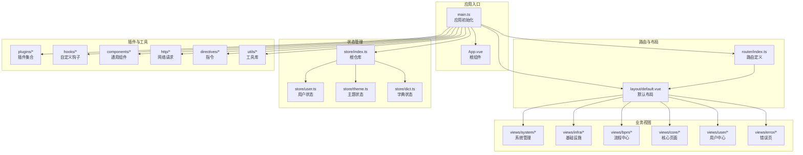
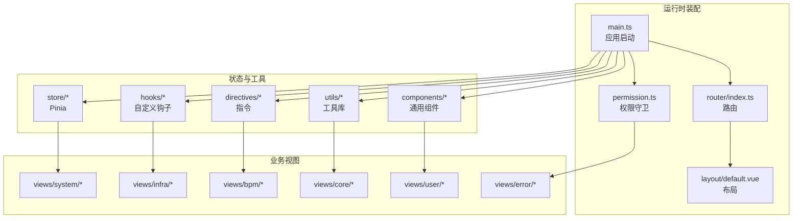
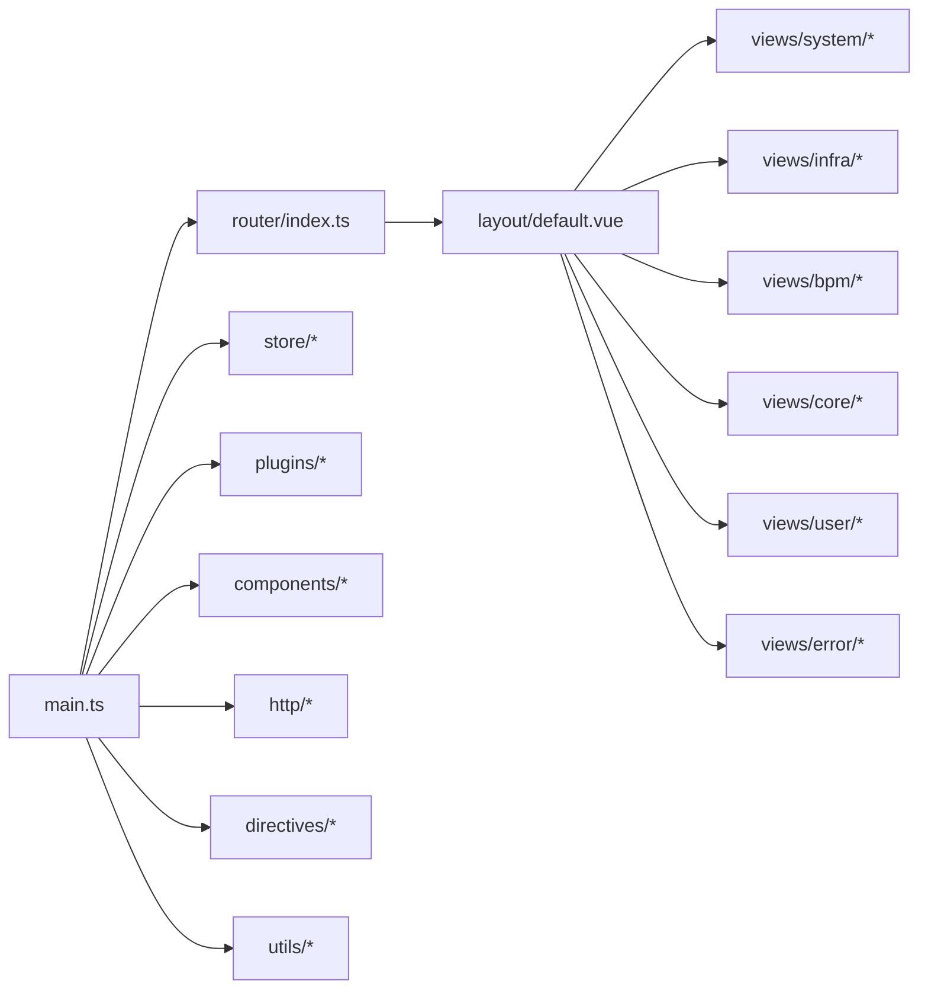

# 业务模块与页面

<cite>
**本文引用的文件**
- [package.json](file://frontend/admin-vue3/package.json)
- [main.ts](file://frontend/admin-vue3/src/main.ts)
- [index.ts](file://frontend/admin-vue3/src/router/index.ts)
- [App.vue](file://frontend/admin-vue3/src/App.vue)
- [permission.ts](file://frontend/admin-vue3/src/permission.ts)
- [store/index.ts](file://frontend/admin-vue3/src/store/index.ts)
- [store/user.ts](file://frontend/admin-vue3/src/store/user.ts)
- [store/theme.ts](file://frontend/admin-vue3/src/store/theme.ts)
- [store/dict.ts](file://frontend/admin-vue3/src/store/dict.ts)
- [hooks/useAccess.ts](file://frontend/admin-vue3/src/hooks/useAccess.ts)
- [hooks/useDict.ts](file://frontend/admin-vue3/src/hooks/useDict.ts)
- [hooks/useRequest.ts](file://frontend/admin-vue3/src/hooks/useRequest.ts)
- [hooks/useUpload.ts](file://frontend/admin-vue3/src/hooks/useUpload.ts)
- [components/system-select/](file://frontend/admin-vue3/src/components/system-select/)
- [components/dict-tag/](file://frontend/admin-vue3/src/components/dict-tag/)
- [layout/default.vue](file://frontend/admin-vue3/src/layout/default.vue)
- [views/system/](file://frontend/admin-vue3/src/views/system/)
- [views/infra/](file://frontend/admin-vue3/src/views/infra/)
- [views/bpm/](file://frontend/admin-vue3/src/views/bpm/)
- [views/core/](file://frontend/admin-vue3/src/views/core/)
- [views/user/](file://frontend/admin-vue3/src/views/user/)
- [views/error/](file://frontend/admin-vue3/src/views/error/)
- [plugins/elementPlus/](file://frontend/admin-vue3/src/plugins/elementPlus/)
- [plugins/formCreate/](file://frontend/admin-vue3/src/plugins/formCreate/)
- [plugins/vueI18n/](file://frontend/admin-vue3/src/plugins/vueI18n/)
- [plugins/unocss/](file://frontend/admin-vue3/src/plugins/unocss/)
- [plugins/svgIcon/](file://frontend/admin-vue3/src/plugins/svgIcon/)
- [plugins/tongji/](file://frontend/admin-vue3/src/plugins/tongji/)
- [directives/useAccess.ts](file://frontend/admin-vue3/src/directives/useAccess.ts)
- [directives/useMountedFocus.ts](file://frontend/admin-vue3/src/directives/useMountedFocus.ts)
- [http/http.ts](file://frontend/admin-vue3/src/http/http.ts)
- [http/interceptor.ts](file://frontend/admin-vue3/src/http/interceptor.ts)
- [http/types.ts](file://frontend/admin-vue3/src/http/types.ts)
- [utils/Logger.ts](file://frontend/admin-vue3/src/utils/Logger.ts)
- [utils/index.ts](file://frontend/admin-vue3/src/utils/index.ts)
- [types/global.d.ts](file://frontend/admin-vue3/src/types/global.d.ts)
- [types/router.d.ts](file://frontend/admin-vue3/src/types/router.d.ts)
- [types/components.d.ts](file://frontend/admin-vue3/src/types/components.d.ts)
- [locales/zh-CN.ts](file://frontend/admin-vue3/src/locales/zh-CN.ts)
- [locales/en.ts](file://frontend/admin-vue3/src/locales/en.ts)
- [styles/index.scss](file://frontend/admin-vue3/src/styles/index.scss)
- [uno.config.ts](file://frontend/admin-vue3/src/uno.config.ts)
- [vite.config.ts](file://frontend/admin-vue3/src/vite.config.ts)
</cite>

## 目录
1. [简介](#简介)
2. [项目结构](#项目结构)
3. [核心组件](#核心组件)
4. [架构总览](#架构总览)
5. [详细组件分析](#详细组件分析)
6. [依赖关系分析](#依赖关系分析)
7. [性能考虑](#性能考虑)
8. [故障排查指南](#故障排查指南)
9. [结论](#结论)
10. [附录](#附录)

## 简介
本文件面向 Vue3 业务模块与页面，聚焦系统管理、用户管理、权限管理、数据字典等核心业务页面的设计与实现，系统性阐述页面组件设计、表单验证、数据展示、操作反馈、业务流程封装、页面状态管理与用户体验优化，并提供可复用的组件策略与性能优化方案。文档以“从上到下”的方式组织：先看整体架构，再逐层拆解核心模块与页面，最后给出工程化最佳实践。

## 项目结构
Vue3 前端采用模块化组织方式，按功能域划分 views 与 plugins，配合 Pinia 状态管理、Vue Router 路由体系、Element Plus 组件库与国际化插件，形成清晰的分层与职责边界。

图表来源
- [main.ts:1-86](file://frontend/admin-vue3/src/main.ts#L1-L86)
- [index.ts:1-37](file://frontend/admin-vue3/src/router/index.ts#L1-L37)
- [store/index.ts](file://frontend/admin-vue3/src/store/index.ts)
- [store/user.ts](file://frontend/admin-vue3/src/store/user.ts)
- [store/theme.ts](file://frontend/admin-vue3/src/store/theme.ts)
- [store/dict.ts](file://frontend/admin-vue3/src/store/dict.ts)
- [layout/default.vue](file://frontend/admin-vue3/src/layout/default.vue)
- [views/system/](file://frontend/admin-vue3/src/views/system/)
- [views/infra/](file://frontend/admin-vue3/src/views/infra/)
- [views/bpm/](file://frontend/admin-vue3/src/views/bpm/)
- [views/core/](file://frontend/admin-vue3/src/views/core/)
- [views/user/](file://frontend/admin-vue3/src/views/user/)
- [views/error/](file://frontend/admin-vue3/src/views/error/)
- [plugins/elementPlus/](file://frontend/admin-vue3/src/plugins/elementPlus/)
- [hooks/useAccess.ts](file://frontend/admin-vue3/src/hooks/useAccess.ts)
- [hooks/useDict.ts](file://frontend/admin-vue3/src/hooks/useDict.ts)
- [hooks/useRequest.ts](file://frontend/admin-vue3/src/hooks/useRequest.ts)
- [hooks/useUpload.ts](file://frontend/admin-vue3/src/hooks/useUpload.ts)
- [components/system-select/](file://frontend/admin-vue3/src/components/system-select/)
- [components/dict-tag/](file://frontend/admin-vue3/src/components/dict-tag/)
- [http/http.ts](file://frontend/admin-vue3/src/http/http.ts)
- [http/interceptor.ts](file://frontend/admin-vue3/src/http/interceptor.ts)
- [directives/useAccess.ts](file://frontend/admin-vue3/src/directives/useAccess.ts)
- [directives/useMountedFocus.ts](file://frontend/admin-vue3/src/directives/useMountedFocus.ts)
- [utils/Logger.ts](file://frontend/admin-vue3/src/utils/Logger.ts)

章节来源
- [package.json:1-160](file://frontend/admin-vue3/package.json#L1-L160)
- [main.ts:1-86](file://frontend/admin-vue3/src/main.ts#L1-L86)
- [index.ts:1-37](file://frontend/admin-vue3/src/router/index.ts#L1-L37)

## 核心组件
- 应用初始化与插件装配：在入口中统一初始化 i18n、状态管理、全局组件、Element Plus、FormCreate、路由、指令、打印与安全净化插件，确保运行期一致性与可维护性。
- 路由与权限守卫：路由实例集中管理，提供重置路由能力；权限守卫在导航前进行角色/菜单/按钮级访问控制。
- 状态管理：Pinia 仓库按领域拆分，用户、主题、字典等状态独立管理，支持持久化插件。
- 通用组件与工具：系统选择器、字典标签、上传、字典钩子、访问控制钩子、HTTP 请求拦截器等，支撑页面复用与一致体验。
- 国际化与主题：多语言与 UnoCSS 主题系统，便于扩展与定制。

章节来源
- [main.ts:1-86](file://frontend/admin-vue3/src/main.ts#L1-L86)
- [index.ts:1-37](file://frontend/admin-vue3/src/router/index.ts#L1-L37)
- [store/index.ts](file://frontend/admin-vue3/src/store/index.ts)
- [store/user.ts](file://frontend/admin-vue3/src/store/user.ts)
- [store/theme.ts](file://frontend/admin-vue3/src/store/theme.ts)
- [store/dict.ts](file://frontend/admin-vue3/src/store/dict.ts)
- [hooks/useAccess.ts](file://frontend/admin-vue3/src/hooks/useAccess.ts)
- [hooks/useDict.ts](file://frontend/admin-vue3/src/hooks/useDict.ts)
- [hooks/useRequest.ts](file://frontend/admin-vue3/src/hooks/useRequest.ts)
- [hooks/useUpload.ts](file://frontend/admin-vue3/src/hooks/useUpload.ts)
- [components/system-select/](file://frontend/admin-vue3/src/components/system-select/)
- [components/dict-tag/](file://frontend/admin-vue3/src/components/dict-tag/)
- [http/http.ts](file://frontend/admin-vue3/src/http/http.ts)
- [http/interceptor.ts](file://frontend/admin-vue3/src/http/interceptor.ts)
- [directives/useAccess.ts](file://frontend/admin-vue3/src/directives/useAccess.ts)
- [directives/useMountedFocus.ts](file://frontend/admin-vue3/src/directives/useMountedFocus.ts)
- [utils/Logger.ts](file://frontend/admin-vue3/src/utils/Logger.ts)

## 架构总览
Vue3 业务模块与页面遵循“入口装配—路由—布局—视图—状态—插件—工具”的分层架构。系统通过 Element Plus 提供 UI 基础能力，FormCreate 支持动态表单，i18n 实现国际化，Pinia 管理状态，Axios 封装网络层，指令与钩子提升页面行为一致性。

图表来源
- [main.ts:1-86](file://frontend/admin-vue3/src/main.ts#L1-L86)
- [index.ts:1-37](file://frontend/admin-vue3/src/router/index.ts#L1-L37)
- [permission.ts](file://frontend/admin-vue3/src/permission.ts)
- [layout/default.vue](file://frontend/admin-vue3/src/layout/default.vue)
- [store/index.ts](file://frontend/admin-vue3/src/store/index.ts)
- [hooks/useAccess.ts](file://frontend/admin-vue3/src/hooks/useAccess.ts)
- [directives/useAccess.ts](file://frontend/admin-vue3/src/directives/useAccess.ts)
- [utils/Logger.ts](file://frontend/admin-vue3/src/utils/Logger.ts)
- [components/system-select/](file://frontend/admin-vue3/src/components/system-select/)
- [components/dict-tag/](file://frontend/admin-vue3/src/components/dict-tag/)
- [views/system/](file://frontend/admin-vue3/src/views/system/)
- [views/infra/](file://frontend/admin-vue3/src/views/infra/)
- [views/bpm/](file://frontend/admin-vue3/src/views/bpm/)
- [views/core/](file://frontend/admin-vue3/src/views/core/)
- [views/user/](file://frontend/admin-vue3/src/views/user/)
- [views/error/](file://frontend/admin-vue3/src/views/error/)

## 详细组件分析

### 系统管理页面（用户、角色、菜单、部门、岗位、字典）
系统管理是后台运营的核心，覆盖用户、角色、菜单、部门、岗位、字典等基础数据的增删改查与权限控制。

- 页面设计
  - 列表页：支持分页、筛选、排序、批量操作、行内编辑或抽屉式编辑。
  - 表单页：基于 FormCreate 动态表单，结合校验规则与字典联动。
  - 权限页：菜单与按钮级权限分配，支持树形选择与预览。
- 组件复用策略
  - 通用查询区与操作区抽象为可复用区块，减少重复代码。
  - 字典标签组件用于统一渲染枚举值，提升一致性与可维护性。
  - 系统选择器组件封装下拉选择与远程搜索，复用在多个实体中。
- 表单验证
  - 使用 Element Plus 表单校验与自定义校验器，结合字典钩子进行联动校验。
  - 对敏感字段（如密码）进行强度校验与提示。
- 数据展示
  - 表格采用懒加载与虚拟滚动，大数据量场景下保持流畅。
  - 状态列使用字典标签映射，避免硬编码。
- 操作反馈
  - 成功/失败统一提示，批量操作提供进度反馈。
  - 编辑/删除提供二次确认，防止误操作。
- 页面状态管理
  - 查询条件、选中项、展开状态等保存在 Pinia 中，刷新不丢失。
  - 字典状态集中管理，跨页面共享枚举数据。
- 用户体验优化
  - 快捷键支持、空状态占位、加载骨架屏。
  - 滚动定位与面包屑导航，提升连续操作效率。

章节来源
- [views/system/](file://frontend/admin-vue3/src/views/system/)
- [components/dict-tag/](file://frontend/admin-vue3/src/components/dict-tag/)
- [components/system-select/](file://frontend/admin-vue3/src/components/system-select/)
- [hooks/useDict.ts](file://frontend/admin-vue3/src/hooks/useDict.ts)
- [hooks/useRequest.ts](file://frontend/admin-vue3/src/hooks/useRequest.ts)
- [store/dict.ts](file://frontend/admin-vue3/src/store/dict.ts)
- [http/interceptor.ts](file://frontend/admin-vue3/src/http/interceptor.ts)

### 用户管理页面（用户、登录日志、操作日志）
用户管理围绕用户生命周期与审计需求展开，强调数据准确性与可追溯性。

- 页面设计
  - 用户列表：支持启用/禁用、重置密码、角色分配、登录状态查看。
  - 登录日志与操作日志：时间轴筛选、详情弹窗、导出能力。
- 组件复用策略
  - 日志详情弹窗复用同一模板，参数驱动渲染。
  - 时间范围选择器与状态标签统一风格。
- 表单验证
  - 新增/编辑用户时对手机号、邮箱等字段进行格式与唯一性校验。
- 数据展示
  - 日志表格按时间倒序排列，关键字段高亮显示。
- 操作反馈
  - 批量启用/禁用与重置密码提供批量确认与结果汇总。
- 页面状态管理
  - 日志分页与筛选条件本地持久化，提升回访效率。
- 用户体验优化
  - 导出按钮支持异步下载与进度提示。

章节来源
- [views/system/user/](file://frontend/admin-vue3/src/views/system/user/)
- [views/system/login-log/](file://frontend/admin-vue3/src/views/system/login-log/)
- [views/system/operate-log/](file://frontend/admin-vue3/src/views/system/operate-log/)
- [hooks/useRequest.ts](file://frontend/admin-vue3/src/hooks/useRequest.ts)
- [http/http.ts](file://frontend/admin-vue3/src/http/http.ts)

### 权限管理页面（菜单、角色）
权限管理是安全边界的关键，需保证最小权限与可审计。

- 页面设计
  - 菜单树：支持新增/编辑/删除节点，拖拽调整层级。
  - 角色授权：勾选菜单与按钮权限，支持一键复制。
- 组件复用策略
  - 菜单树组件抽取为可复用模块，支持多级展开与搜索过滤。
  - 权限勾选面板复用同一逻辑，按角色维度切换。
- 表单验证
  - 菜单名称与路径唯一性校验，按钮权限与菜单绑定校验。
- 数据展示
  - 菜单树采用懒加载，支持按权限过滤显示。
- 操作反馈
  - 授权变更后即时刷新角色权限树，避免缓存不一致。
- 页面状态管理
  - 当前选中角色与菜单树展开状态持久化。
- 用户体验优化
  - 快速复制权限模板，降低重复配置成本。

章节来源
- [views/system/menu/](file://frontend/admin-vue3/src/views/system/menu/)
- [views/system/role/](file://frontend/admin-vue3/src/views/system/role/)
- [hooks/useAccess.ts](file://frontend/admin-vue3/src/hooks/useAccess.ts)
- [directives/useAccess.ts](file://frontend/admin-vue3/src/directives/useAccess.ts)

### 数据字典页面（字典类型、字典数据）
数据字典是业务语义的中枢，需保证一致性与可扩展性。

- 页面设计
  - 类型管理：维护字典分类与描述。
  - 数据管理：按类型分组展示键值对，支持排序与状态切换。
- 组件复用策略
  - 字典标签组件在列表与表单中统一渲染。
  - 字典选择器支持远程搜索与分页加载。
- 表单验证
  - 键值唯一性校验，键名规范校验。
- 数据展示
  - 分类树与数据列表联动，支持快速跳转。
- 操作反馈
  - 删除字典数据前进行依赖检查与二次确认。
- 页面状态管理
  - 当前选中类型与数据列表状态本地持久化。
- 用户体验优化
  - 批量导入/导出，支持模板下载与校验提示。

章节来源
- [views/system/dict/](file://frontend/admin-vue3/src/views/system/dict/)
- [components/dict-tag/](file://frontend/admin-vue3/src/components/dict-tag/)
- [components/system-select/dict-select.vue](file://frontend/admin-vue3/src/components/system-select/dict-select.vue)
- [hooks/useDict.ts](file://frontend/admin-vue3/src/hooks/useDict.ts)
- [store/dict.ts](file://frontend/admin-vue3/src/store/dict.ts)

### 基础设施页面（定时任务、文件、数据源、WebSocket）
基础设施页面保障系统稳定运行与可观测性。

- 页面设计
  - 定时任务：可视化编辑 Cron 表达式，支持启停与执行历史查看。
  - 文件管理：文件上传、预览、删除与下载。
  - 数据源配置：连接信息校验与测试连通性。
  - WebSocket：消息收发与连接状态监控。
- 组件复用策略
  - 上传组件支持断点续传与进度条。
  - 任务调度面板复用同一编辑器。
- 表单验证
  - 连接串与 Cron 表达式格式校验。
- 数据展示
  - 任务执行日志表格支持实时刷新。
- 操作反馈
  - 测试连通性与执行任务提供异步反馈。
- 页面状态管理
  - 任务状态与日志分页本地持久化。
- 用户体验优化
  - 可视化 Cron 编辑器与语法高亮。

章节来源
- [views/infra/job/](file://frontend/admin-vue3/src/views/infra/job/)
- [views/infra/file/](file://frontend/admin-vue3/src/views/infra/file/)
- [views/infra/data-source-config/](file://frontend/admin-vue3/src/views/infra/data-source-config/)
- [views/infra/web-socket/](file://frontend/admin-vue3/src/views/infra/web-socket/)
- [hooks/useUpload.ts](file://frontend/admin-vue3/src/hooks/useUpload.ts)
- [http/interceptor.ts](file://frontend/admin-vue3/src/http/interceptor.ts)

### BPM 流程中心页面（流程模型、任务管理、流程实例）
BPM 页面强调流程可视化与可操作性。

- 页面设计
  - 流程模型：BPMN 图编辑器与属性面板。
  - 任务管理：待办/已办任务列表与审批操作。
  - 流程实例：实例状态跟踪与历史节点查看。
- 组件复用策略
  - 图编辑器与属性面板作为独立模块复用。
  - 审批表单基于动态表单生成。
- 表单验证
  - 审批意见必填校验，表单字段联动校验。
- 数据展示
  - 流程图支持缩放与节点高亮。
- 操作反馈
  - 审批成功后自动刷新任务列表。
- 页面状态管理
  - 当前打开流程与选中节点状态持久化。
- 用户体验优化
  - 拖拽式流程绘制与快捷键支持。

章节来源
- [views/bpm/](file://frontend/admin-vue3/src/views/bpm/)
- [plugins/formCreate/](file://frontend/admin-vue3/src/plugins/formCreate/)
- [plugins/elementPlus/](file://frontend/admin-vue3/src/plugins/elementPlus/)

### 核心页面与用户中心
核心页面包括登录、首页、错误页等；用户中心提供个人资料与设置。

- 页面设计
  - 登录：账号密码登录与第三方登录入口。
  - 首页：仪表盘与快捷入口。
  - 错误页：403/404/500 统一处理。
  - 用户中心：头像上传、密码修改、偏好设置。
- 组件复用策略
  - 登录表单与设置表单复用同一校验逻辑。
  - 头像上传组件支持裁剪与预览。
- 表单验证
  - 密码强度与邮箱格式校验。
- 数据展示
  - 仪表盘卡片按模块聚合展示。
- 操作反馈
  - 登录失败与设置更新统一提示。
- 页面状态管理
  - 登录态与用户信息持久化。
- 用户体验优化
  - 记住登录状态与主题切换。

章节来源
- [views/core/](file://frontend/admin-vue3/src/views/core/)
- [views/user/](file://frontend/admin-vue3/src/views/user/)
- [views/error/](file://frontend/admin-vue3/src/views/error/)
- [store/user.ts](file://frontend/admin-vue3/src/store/user.ts)
- [hooks/useUpload.ts](file://frontend/admin-vue3/src/hooks/useUpload.ts)

## 依赖关系分析
- 组件耦合
  - 通用组件与业务视图松耦合，通过 props/事件通信。
  - 状态管理对业务视图透明，仅暴露必要状态与动作。
- 外部依赖
  - Element Plus 提供 UI 基础能力；FormCreate 支持动态表单；i18n 提供国际化；Axios 提供网络层；Pinia 提供状态管理；UnoCSS 提供原子化样式。
- 循环依赖
  - 通过模块化拆分与接口抽象避免循环依赖。
- 插件与指令
  - 插件在入口集中装配，指令按需注册，避免全局污染。

图表来源
- [main.ts:1-86](file://frontend/admin-vue3/src/main.ts#L1-L86)
- [index.ts:1-37](file://frontend/admin-vue3/src/router/index.ts#L1-L37)
- [layout/default.vue](file://frontend/admin-vue3/src/layout/default.vue)
- [views/system/](file://frontend/admin-vue3/src/views/system/)
- [views/infra/](file://frontend/admin-vue3/src/views/infra/)
- [views/bpm/](file://frontend/admin-vue3/src/views/bpm/)
- [views/core/](file://frontend/admin-vue3/src/views/core/)
- [views/user/](file://frontend/admin-vue3/src/views/user/)
- [views/error/](file://frontend/admin-vue3/src/views/error/)

章节来源
- [package.json:1-160](file://frontend/admin-vue3/package.json#L1-L160)
- [main.ts:1-86](file://frontend/admin-vue3/src/main.ts#L1-L86)
- [index.ts:1-37](file://frontend/admin-vue3/src/router/index.ts#L1-L37)

## 性能考虑
- 资源加载
  - 使用 Vite 构建与按需加载，减少首屏体积。
  - UnoCSS 原子化样式按需生成，避免全局样式污染。
- 状态管理
  - Pinia 模块化拆分，避免大仓库导致的响应式开销。
  - 启用持久化插件，平衡性能与体验。
- 列表与表格
  - 大数据量场景采用虚拟滚动与懒加载。
  - 表单联动与字典加载使用防抖与缓存。
- 网络请求
  - Axios 拦截器统一处理 loading 与错误，避免重复请求。
  - 并发控制与请求去重，减少无效网络消耗。
- 图表与编辑器
  - 图表组件按需渲染，编辑器延迟初始化。
- 主题与国际化
  - 主题切换与语言切换采用缓存与懒加载策略。

## 故障排查指南
- 登录与权限
  - 检查权限守卫是否正确拦截无权访问；核对菜单与按钮权限配置。
- 表单校验
  - 校验规则与提示文案不一致时，检查校验器与国际化配置。
- 状态异常
  - 用户信息或字典数据为空时，检查状态初始化与持久化插件。
- 网络错误
  - 查看拦截器中的错误处理与重试策略；确认服务端返回格式。
- 组件渲染
  - 字典标签或选择器不显示时，检查字典数据是否加载完成。
- 日志与监控
  - 使用 Logger 输出关键路径日志，结合浏览器开发者工具定位问题。

章节来源
- [permission.ts](file://frontend/admin-vue3/src/permission.ts)
- [http/interceptor.ts](file://frontend/admin-vue3/src/http/interceptor.ts)
- [utils/Logger.ts](file://frontend/admin-vue3/src/utils/Logger.ts)
- [store/user.ts](file://frontend/admin-vue3/src/store/user.ts)
- [store/dict.ts](file://frontend/admin-vue3/src/store/dict.ts)

## 结论
本项目通过清晰的分层架构、模块化的业务视图、完善的通用组件与工具链，实现了系统管理、用户管理、权限管理、数据字典等核心业务页面的高复用与高可用。配合状态管理、权限守卫、国际化与主题系统，形成了良好的开发体验与用户体验。建议在后续迭代中持续完善动态表单与流程编辑器的能力，加强可观测性与自动化测试，进一步提升系统的稳定性与可维护性。

## 附录
- 开发与构建
  - 使用 Vite 与 TypeScript，支持多环境构建与预览。
  - ESLint、Stylelint、Prettier 保证代码质量。
- 国际化与主题
  - 支持中英切换与主题切换，便于国际化部署与个性化定制。
- 工程化最佳实践
  - 组件与页面按功能域拆分；状态按领域拆分；插件与指令集中装配；统一错误处理与日志输出。

章节来源
- [vite.config.ts](file://frontend/admin-vue3/src/vite.config.ts)
- [uno.config.ts](file://frontend/admin-vue3/src/uno.config.ts)
- [locales/zh-CN.ts](file://frontend/admin-vue3/src/locales/zh-CN.ts)
- [locales/en.ts](file://frontend/admin-vue3/src/locales/en.ts)
- [store/theme.ts](file://frontend/admin-vue3/src/store/theme.ts)