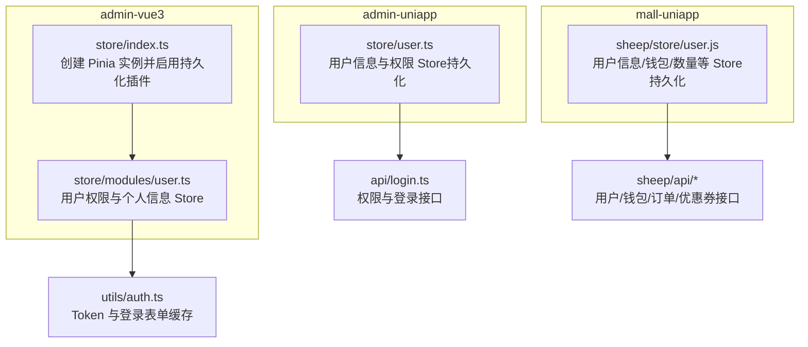
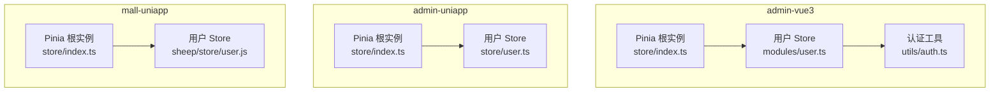
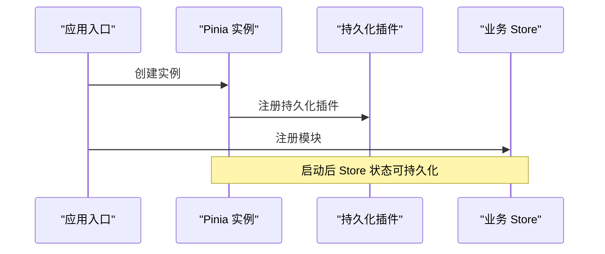
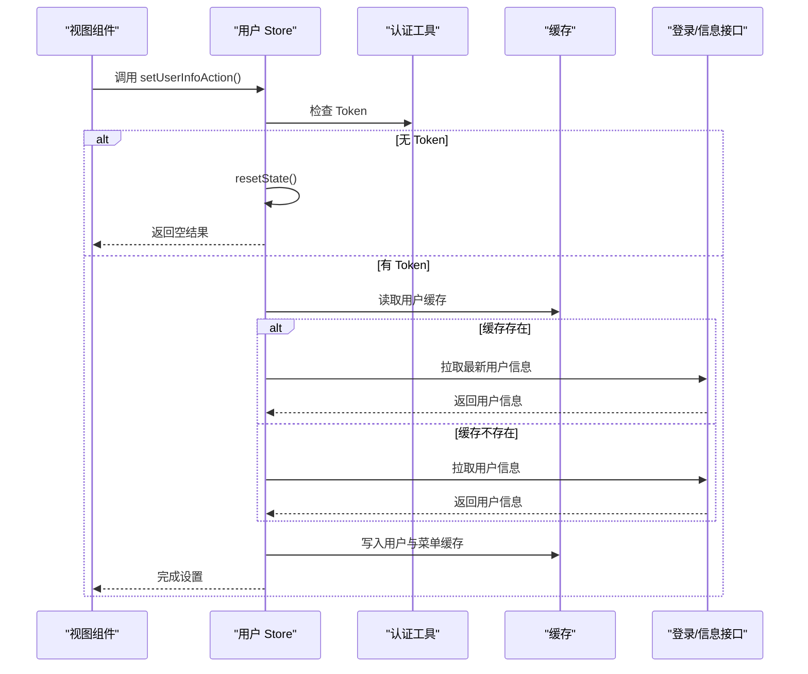
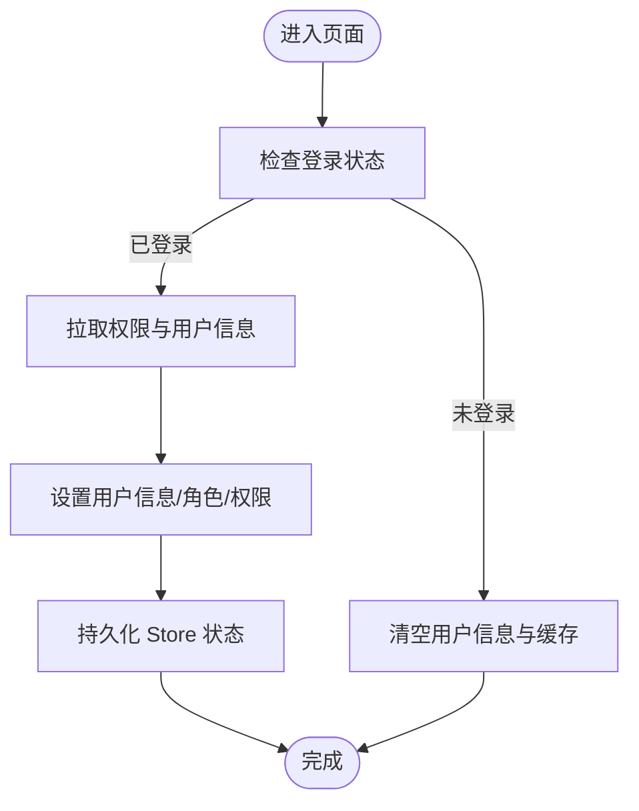
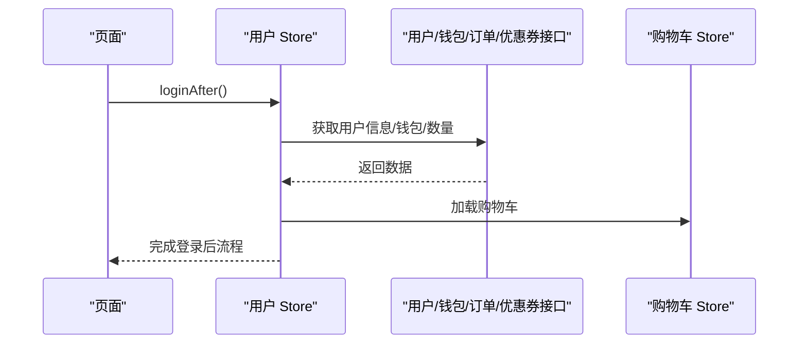
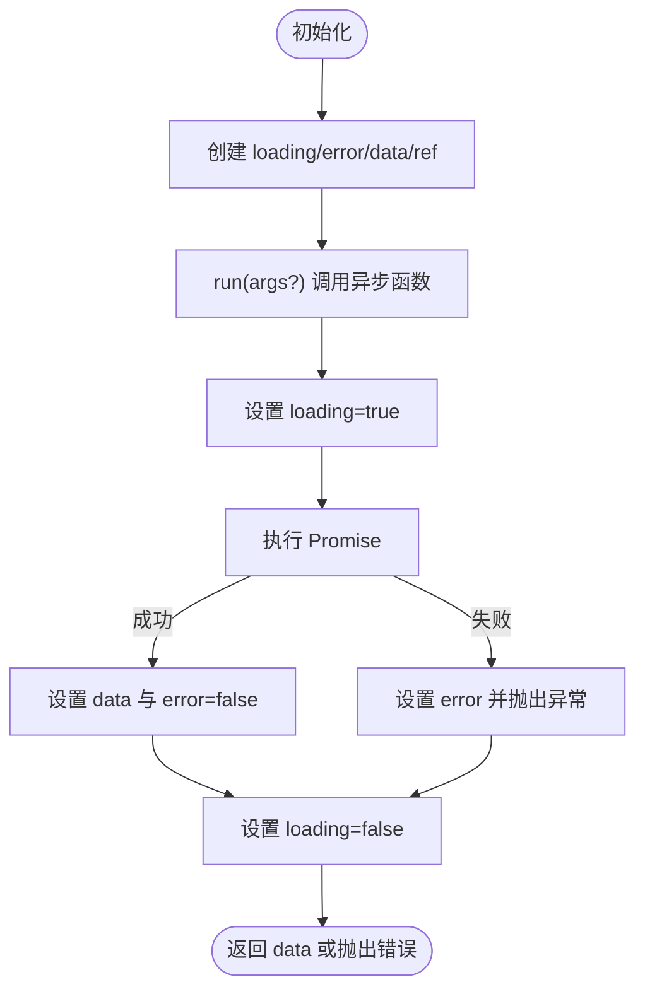
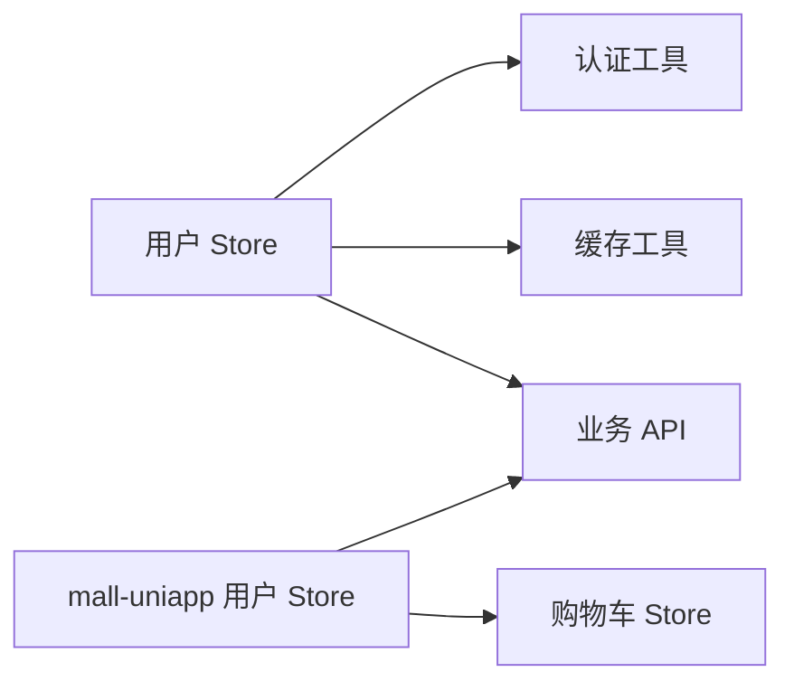

# 状态管理与数据流

<cite>
**本文引用的文件**
- [frontend/admin-vue3/src/store/index.ts](file://frontend/admin-vue3/src/store/index.ts)
- [frontend/admin-vue3/src/store/modules/user.ts](file://frontend/admin-vue3/src/store/modules/user.ts)
- [frontend/admin-vue3/src/utils/auth.ts](file://frontend/admin-vue3/src/utils/auth.ts)
- [frontend/admin-uniapp/src/store/user.ts](file://frontend/admin-uniapp/src/store/user.ts)
- [frontend/mall-uniapp/sheep/store/user.js](file://frontend/mall-uniapp/sheep/store/user.js)
- [frontend/admin-uniapp/src/hooks/useRequest.ts](file://frontend/admin-uniapp/src/hooks/useRequest.ts)
</cite>

## 目录
1. [简介](#简介)
2. [项目结构](#项目结构)
3. [核心组件](#核心组件)
4. [架构总览](#架构总览)
5. [详细组件分析](#详细组件分析)
6. [依赖分析](#依赖分析)
7. [性能考虑](#性能考虑)
8. [故障排查指南](#故障排查指南)
9. [结论](#结论)
10. [附录](#附录)

## 简介
本文件聚焦于 Vue3 状态管理与数据流，围绕 Pinia 状态管理库的使用、Store 模块设计、数据持久化策略展开，结合仓库中的多套前端工程（admin-vue3、admin-uniapp、mall-uniapp）中的实际实现，系统阐述全局状态设计、模块化 Store 组织、异步状态处理、VueUse 工具库与自定义 Hooks 的应用、响应式数据管理、状态同步机制、数据缓存策略以及权限状态管理，并给出最佳实践、调试技巧与团队协作规范。

## 项目结构
本仓库包含多个前端工程，其中与状态管理直接相关的关键目录如下：
- admin-vue3：基于 Vue3 + Vite 的管理后台，采用 Pinia 进行状态管理，支持持久化插件。
- admin-uniapp：基于 uni-app 的多端应用，同样使用 Pinia，部分 Store 使用了持久化配置。
- mall-uniapp：电商小程序/APP，使用 Pinia 并通过插件实现持久化，同时集成业务 Store（如用户、购物车等）。

图表来源
- [frontend/admin-vue3/src/store/index.ts:1-13](file://frontend/admin-vue3/src/store/index.ts#L1-L13)
- [frontend/admin-vue3/src/store/modules/user.ts:1-109](file://frontend/admin-vue3/src/store/modules/user.ts#L1-L109)
- [frontend/admin-vue3/src/utils/auth.ts:1-81](file://frontend/admin-vue3/src/utils/auth.ts#L1-L81)
- [frontend/admin-uniapp/src/store/user.ts:1-90](file://frontend/admin-uniapp/src/store/user.ts#L1-L90)
- [frontend/mall-uniapp/sheep/store/user.js:1-165](file://frontend/mall-uniapp/sheep/store/user.js#L1-L165)

章节来源
- [frontend/admin-vue3/src/store/index.ts:1-13](file://frontend/admin-vue3/src/store/index.ts#L1-L13)
- [frontend/admin-vue3/src/store/modules/user.ts:1-109](file://frontend/admin-vue3/src/store/modules/user.ts#L1-L109)
- [frontend/admin-vue3/src/utils/auth.ts:1-81](file://frontend/admin-vue3/src/utils/auth.ts#L1-L81)
- [frontend/admin-uniapp/src/store/user.ts:1-90](file://frontend/admin-uniapp/src/store/user.ts#L1-L90)
- [frontend/mall-uniapp/sheep/store/user.js:1-165](file://frontend/mall-uniapp/sheep/store/user.js#L1-L165)

## 核心组件
- Pinia 根实例与持久化插件
  - 在 admin-vue3 中，通过统一入口创建 Pinia 实例并启用持久化插件，确保后续各模块 Store 可按需持久化。
  - 在 admin-uniapp 与 mall-uniapp 中，部分 Store 显式配置了持久化策略，以提升用户体验与性能。
- 用户与权限 Store
  - admin-vue3 的用户 Store 聚合权限、角色、用户信息，并通过缓存与 Token 协同实现登录态与权限同步。
  - admin-uniapp 的用户 Store 使用持久化配置，简化跨页面/重启后的状态恢复。
  - mall-uniapp 的用户 Store 将用户信息、钱包、数量等聚合在一个 Store 内，便于业务侧统一管理。
- 请求 Hook 与异步状态
  - 自定义 useRequest Hook 提供统一的异步请求封装，包括 loading、error、data 与手动触发 run，适配多种业务场景。
- 认证与缓存工具
  - auth.ts 提供 Token 读取/设置/删除与登录表单加密存储，配合缓存工具实现安全与便捷的登录体验。

章节来源
- [frontend/admin-vue3/src/store/index.ts:1-13](file://frontend/admin-vue3/src/store/index.ts#L1-L13)
- [frontend/admin-vue3/src/store/modules/user.ts:1-109](file://frontend/admin-vue3/src/store/modules/user.ts#L1-L109)
- [frontend/admin-uniapp/src/store/user.ts:1-90](file://frontend/admin-uniapp/src/store/user.ts#L1-L90)
- [frontend/mall-uniapp/sheep/store/user.js:1-165](file://frontend/mall-uniapp/sheep/store/user.js#L1-L165)
- [frontend/admin-uniapp/src/hooks/useRequest.ts:1-55](file://frontend/admin-uniapp/src/hooks/useRequest.ts#L1-L55)
- [frontend/admin-vue3/src/utils/auth.ts:1-81](file://frontend/admin-vue3/src/utils/auth.ts#L1-L81)

## 架构总览
下图展示了三个前端工程中状态管理的整体关系：Pinia 根实例、持久化策略、认证与缓存、API 层以及业务 Store 的交互。

图表来源
- [frontend/admin-vue3/src/store/index.ts:1-13](file://frontend/admin-vue3/src/store/index.ts#L1-L13)
- [frontend/admin-vue3/src/store/modules/user.ts:1-109](file://frontend/admin-vue3/src/store/modules/user.ts#L1-L109)
- [frontend/admin-vue3/src/utils/auth.ts:1-81](file://frontend/admin-vue3/src/utils/auth.ts#L1-L81)
- [frontend/admin-uniapp/src/store/user.ts:1-90](file://frontend/admin-uniapp/src/store/user.ts#L1-L90)
- [frontend/mall-uniapp/sheep/store/user.js:1-165](file://frontend/mall-uniapp/sheep/store/user.js#L1-L165)

## 详细组件分析

### Pinia 根实例与持久化
- admin-vue3 在入口集中创建 Pinia 并启用持久化插件，后续模块可按需选择持久化策略，降低重复配置成本。
- admin-uniapp 与 mall-uniapp 的部分 Store 显式声明持久化，确保关键业务状态在刷新或重启后仍可用。

图表来源
- [frontend/admin-vue3/src/store/index.ts:1-13](file://frontend/admin-vue3/src/store/index.ts#L1-L13)
- [frontend/admin-uniapp/src/store/user.ts:86-89](file://frontend/admin-uniapp/src/store/user.ts#L86-L89)
- [frontend/mall-uniapp/sheep/store/user.js:154-161](file://frontend/mall-uniapp/sheep/store/user.js#L154-L161)

章节来源
- [frontend/admin-vue3/src/store/index.ts:1-13](file://frontend/admin-vue3/src/store/index.ts#L1-L13)
- [frontend/admin-uniapp/src/store/user.ts:86-89](file://frontend/admin-uniapp/src/store/user.ts#L86-L89)
- [frontend/mall-uniapp/sheep/store/user.js:154-161](file://frontend/mall-uniapp/sheep/store/user.js#L154-L161)

### 用户与权限 Store（admin-vue3）
- 状态结构
  - 权限集合、角色数组、是否已设置用户、用户对象等，getter 提供只读访问。
- 异步流程
  - 登录后优先从缓存读取用户信息；若无缓存或缓存失效，则调用接口拉取并回填缓存。
  - 支持头像/昵称等字段的在线更新，并同步到本地缓存。
  - 登出时清理 Token、缓存与 Store 状态。
- 缓存与 Token 协同
  - 通过认证工具与缓存工具协同，保障 Token 与用户信息的一致性与安全性。

图表来源
- [frontend/admin-vue3/src/store/modules/user.ts:50-71](file://frontend/admin-vue3/src/store/modules/user.ts#L50-L71)
- [frontend/admin-vue3/src/utils/auth.ts:10-15](file://frontend/admin-vue3/src/utils/auth.ts#L10-L15)

章节来源
- [frontend/admin-vue3/src/store/modules/user.ts:1-109](file://frontend/admin-vue3/src/store/modules/user.ts#L1-L109)
- [frontend/admin-vue3/src/utils/auth.ts:1-81](file://frontend/admin-vue3/src/utils/auth.ts#L1-L81)

### 用户与权限 Store（admin-uniapp）
- 状态结构
  - 用户信息、租户 ID、角色与权限集合、常用菜单等，均以 ref 响应式形式管理。
- 功能特性
  - 支持设置/清除用户信息、设置头像、设置租户、设置常用菜单。
  - 提供拉取权限与用户信息的异步方法，并兼容后端字段差异。
- 持久化
  - Store 层面开启持久化，减少跨页面/重启后的状态丢失。

图表来源
- [frontend/admin-uniapp/src/store/user.ts:17-89](file://frontend/admin-uniapp/src/store/user.ts#L17-L89)

章节来源
- [frontend/admin-uniapp/src/store/user.ts:1-90](file://frontend/admin-uniapp/src/store/user.ts#L1-L90)

### 用户与权限 Store（mall-uniapp）
- 状态结构
  - 用户信息、钱包、登录状态、各类数量统计等，统一在一个 Store 内管理，便于业务侧快速获取。
- 异步流程
  - 登录后自动更新用户信息、钱包、订单数量与优惠券数量，并加载购物车与分享参数。
  - 提供防抖更新逻辑，避免频繁请求导致性能问题。
- 持久化
  - Store 显式配置持久化策略，确保用户状态在小程序/APP 内部稳定可用。

图表来源
- [frontend/mall-uniapp/sheep/store/user.js:131-146](file://frontend/mall-uniapp/sheep/store/user.js#L131-L146)
- [frontend/mall-uniapp/sheep/store/user.js:69-81](file://frontend/mall-uniapp/sheep/store/user.js#L69-L81)

章节来源
- [frontend/mall-uniapp/sheep/store/user.js:1-165](file://frontend/mall-uniapp/sheep/store/user.js#L1-L165)

### 自定义 Hook：useRequest
- 设计目标
  - 统一处理异步请求的 loading、error、data 与手动触发 run，支持立即执行与初始数据。
- 使用建议
  - 对于需要手动触发的场景（如搜索、分页），使用 run 手动触发。
  - 对于需要自动加载的场景（如详情页），使用 immediate: true。

图表来源
- [frontend/admin-uniapp/src/hooks/useRequest.ts:26-54](file://frontend/admin-uniapp/src/hooks/useRequest.ts#L26-L54)

章节来源
- [frontend/admin-uniapp/src/hooks/useRequest.ts:1-55](file://frontend/admin-uniapp/src/hooks/useRequest.ts#L1-L55)

## 依赖分析
- 组件耦合
  - 用户 Store 与认证工具、缓存工具存在直接依赖，确保 Token 与用户信息一致。
  - mall-uniapp 的用户 Store 与其他业务 Store（如购物车）存在协作关系。
- 外部依赖
  - Pinia 与持久化插件是状态管理的核心依赖。
  - API 层提供用户、权限、钱包、订单等数据来源。

图表来源
- [frontend/admin-vue3/src/store/modules/user.ts:1-109](file://frontend/admin-vue3/src/store/modules/user.ts#L1-L109)
- [frontend/admin-vue3/src/utils/auth.ts:1-81](file://frontend/admin-vue3/src/utils/auth.ts#L1-L81)
- [frontend/mall-uniapp/sheep/store/user.js:1-165](file://frontend/mall-uniapp/sheep/store/user.js#L1-L165)

章节来源
- [frontend/admin-vue3/src/store/modules/user.ts:1-109](file://frontend/admin-vue3/src/store/modules/user.ts#L1-L109)
- [frontend/admin-vue3/src/utils/auth.ts:1-81](file://frontend/admin-vue3/src/utils/auth.ts#L1-L81)
- [frontend/mall-uniapp/sheep/store/user.js:1-165](file://frontend/mall-uniapp/sheep/store/user.js#L1-L165)

## 性能考虑
- 缓存与持久化
  - 优先从缓存读取用户信息，减少网络请求；在有 Token 但缓存缺失时再拉取，兼顾一致性与性能。
  - 对关键状态启用持久化，降低重启/刷新后的等待时间。
- 防抖与限流
  - mall-uniapp 的用户数据更新采用时间戳防抖，避免频繁请求。
- 响应式粒度
  - admin-uniapp 将用户信息拆分为多个 ref，便于细粒度更新与渲染优化。

## 故障排查指南
- 登录后状态未更新
  - 检查 Token 是否正确写入缓存与本地存储，确认用户 Store 的 setUserInfoAction 是否被调用。
  - 参考路径：[frontend/admin-vue3/src/store/modules/user.ts:50-71](file://frontend/admin-vue3/src/store/modules/user.ts#L50-L71)
- 登出后状态残留
  - 确认登出流程是否调用了 resetState、removeToken 与缓存清理。
  - 参考路径：[frontend/admin-vue3/src/store/modules/user.ts:86-102](file://frontend/admin-vue3/src/store/modules/user.ts#L86-L102)
- 请求状态未正确反馈
  - 检查 useRequest 的 immediate 与 run 使用方式，确认 loading/error/data 的赋值时机。
  - 参考路径：[frontend/admin-uniapp/src/hooks/useRequest.ts:26-54](file://frontend/admin-uniapp/src/hooks/useRequest.ts#L26-L54)
- 持久化未生效
  - 确认 Pinia 实例是否注册了持久化插件，或 Store 是否显式启用了持久化。
  - 参考路径：[frontend/admin-vue3/src/store/index.ts:1-13](file://frontend/admin-vue3/src/store/index.ts#L1-L13)，[frontend/admin-uniapp/src/store/user.ts:86-89](file://frontend/admin-uniapp/src/store/user.ts#L86-L89)，[frontend/mall-uniapp/sheep/store/user.js:154-161](file://frontend/mall-uniapp/sheep/store/user.js#L154-L161)

章节来源
- [frontend/admin-vue3/src/store/modules/user.ts:50-102](file://frontend/admin-vue3/src/store/modules/user.ts#L50-L102)
- [frontend/admin-uniapp/src/hooks/useRequest.ts:26-54](file://frontend/admin-uniapp/src/hooks/useRequest.ts#L26-L54)
- [frontend/admin-vue3/src/store/index.ts:1-13](file://frontend/admin-vue3/src/store/index.ts#L1-L13)
- [frontend/admin-uniapp/src/store/user.ts:86-89](file://frontend/admin-uniapp/src/store/user.ts#L86-L89)
- [frontend/mall-uniapp/sheep/store/user.js:154-161](file://frontend/mall-uniapp/sheep/store/user.js#L154-L161)

## 结论
本仓库在多端前端工程中统一采用了 Pinia 作为状态管理方案，并结合持久化插件与缓存工具，实现了稳定的全局状态与权限管理。通过模块化 Store 组织与自定义 Hook，提升了异步状态处理的可复用性与可维护性。建议在团队内统一状态命名规范、持久化策略与调试流程，持续优化缓存与请求策略，以获得更佳的用户体验与开发效率。

## 附录
- 最佳实践
  - 明确划分全局状态与局部状态，避免过度共享导致的耦合。
  - 对关键状态启用持久化，对敏感信息使用加密存储。
  - 使用统一的 Hook 封装异步请求，保持 loading/error/data 的一致性。
  - 为每个 Store 提供清晰的 resetState 方法，便于登出与切换账号场景。
- 团队协作规范
  - Store 命名采用语义化前缀（如 user、theme），避免冲突。
  - 持久化策略需明确 key 与过期策略，避免占用过多存储空间。
  - 新增 Store 时同步补充单元测试与调试日志，便于定位问题。