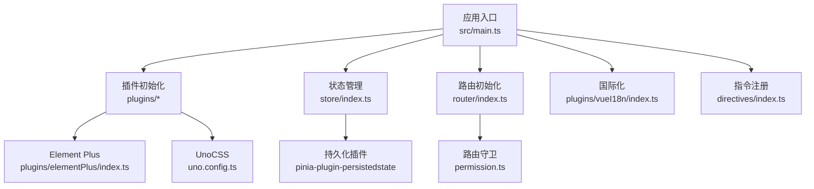
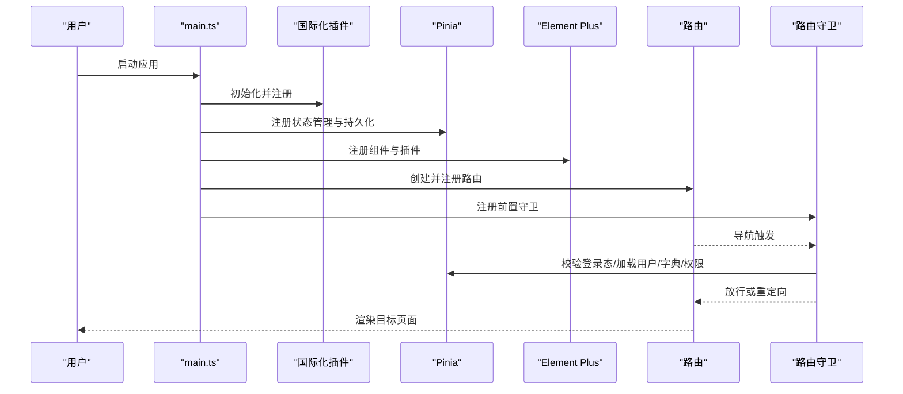
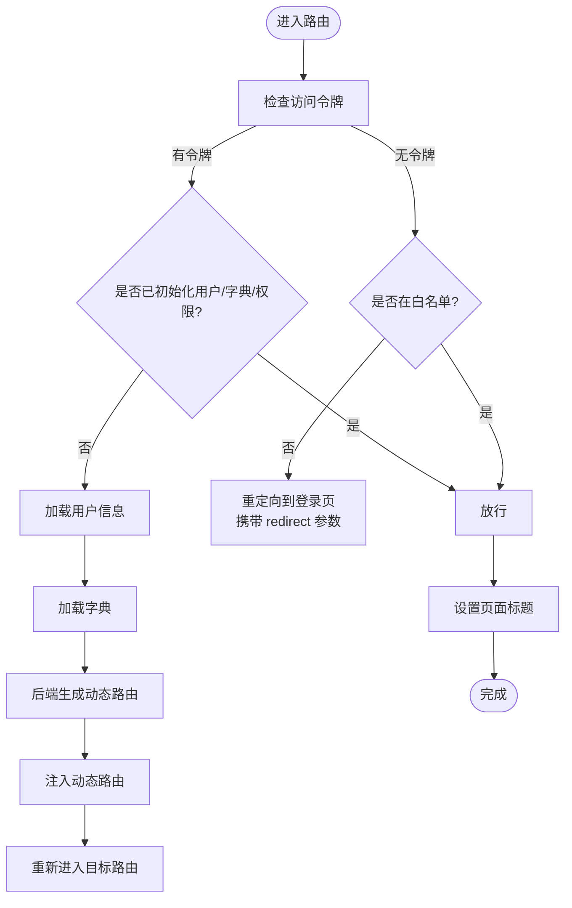
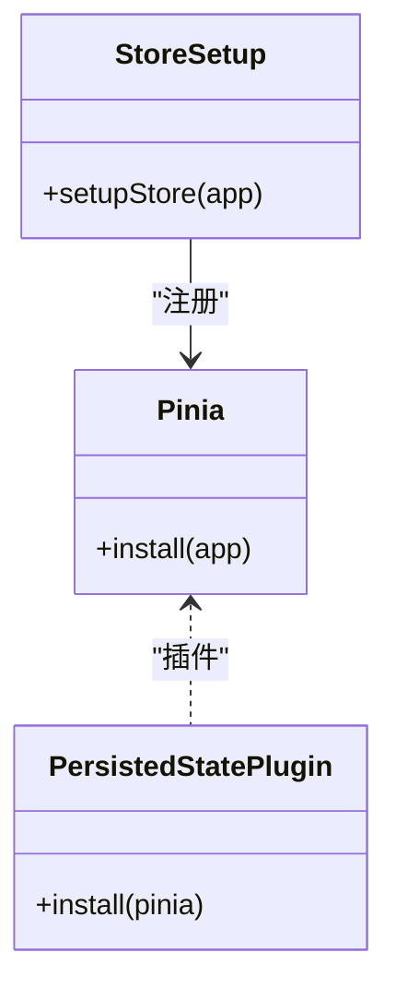
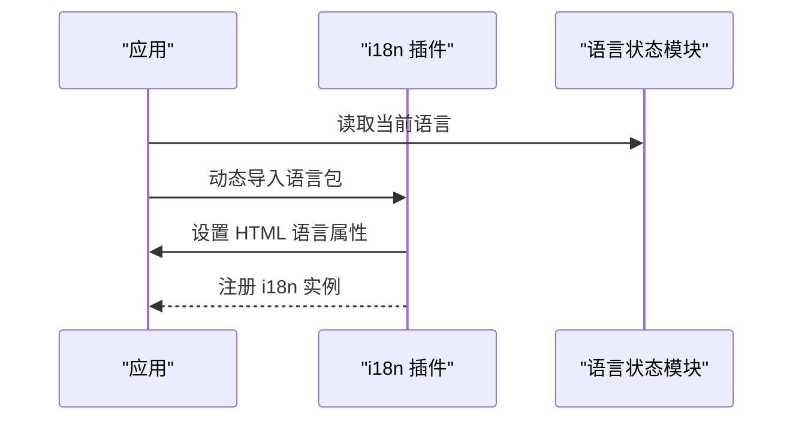
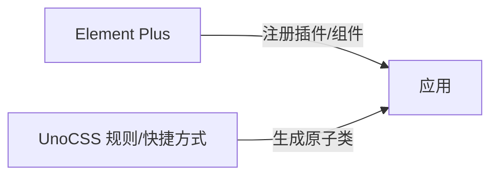
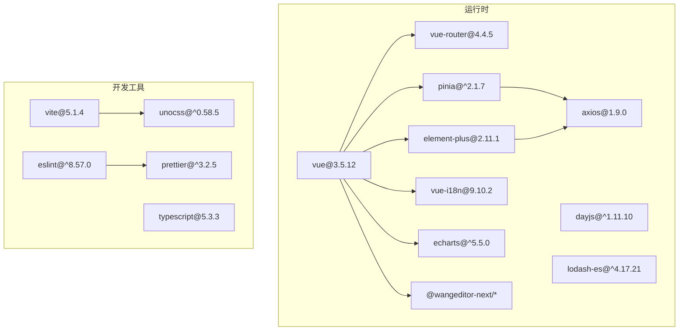

# 管理后台 Vue3 应用

<cite>
**本文引用的文件**
- [package.json](file://frontend/admin-vue3/package.json)
- [vite.config.ts](file://frontend/admin-vue3/vite.config.ts)
- [main.ts](file://frontend/admin-vue3/src/main.ts)
- [tsconfig.json](file://frontend/admin-vue3/tsconfig.json)
- [uno.config.ts](file://frontend/admin-vue3/uno.config.ts)
- [router/index.ts](file://frontend/admin-vue3/src/router/index.ts)
- [store/index.ts](file://frontend/admin-vue3/src/store/index.ts)
- [plugins/vueI18n/index.ts](file://frontend/admin-vue3/src/plugins/vueI18n/index.ts)
- [plugins/elementPlus/index.ts](file://frontend/admin-vue3/src/plugins/elementPlus/index.ts)
- [directives/index.ts](file://frontend/admin-vue3/src/directives/index.ts)
- [permission.ts](file://frontend/admin-vue3/src/permission.ts)
</cite>

## 目录
1. [简介](#简介)
2. [项目结构](#项目结构)
3. [核心组件](#核心组件)
4. [架构总览](#架构总览)
5. [详细组件分析](#详细组件分析)
6. [依赖关系分析](#依赖关系分析)
7. [性能考量](#性能考量)
8. [故障排查指南](#故障排查指南)
9. [结论](#结论)
10. [附录](#附录)

## 简介
本项目是一个基于 Vue 3.5.12 + Element Plus + Vite 5 的现代化管理后台前端应用。技术栈围绕 TypeScript、Pinia 状态管理、Vue Router 路由、UnoCSS 原子化样式、ESLint 与 Prettier 代码规范展开，并集成国际化（vue-i18n）、指令权限控制、动态路由与菜单生成、以及构建优化策略。本文档旨在帮助开发者快速理解并高效开发与维护该管理后台。

## 项目结构
前端工程位于 frontend/admin-vue3，采用按功能域分层的组织方式：
- src：核心源码
  - api：接口封装与类型定义
  - components：通用业务组件
  - directives：自定义指令（权限、聚焦等）
  - hooks：组合式工具函数
  - layout：布局容器
  - locales：国际化语言包
  - plugins：第三方插件初始化（i18n、Element Plus、wangEditor、打印等）
  - router：路由定义与守卫
  - store：Pinia 状态管理（含持久化）
  - styles：全局样式与变量
  - types：全局类型声明
  - utils：工具函数
  - views：页面级视图
  - App.vue、main.ts：应用入口
- 构建相关
  - vite.config.ts：Vite 配置（插件、别名、构建优化、依赖预构建）
  - uno.config.ts：UnoCSS 配置（原子类、规则、快捷方式）
  - tsconfig.json：TypeScript 编译选项
  - package.json：脚本、依赖与引擎版本

图表来源
- [main.ts:1-86](file://frontend/admin-vue3/src/main.ts#L1-L86)
- [store/index.ts:1-13](file://frontend/admin-vue3/src/store/index.ts#L1-L13)
- [router/index.ts:1-37](file://frontend/admin-vue3/src/router/index.ts#L1-L37)
- [plugins/vueI18n/index.ts:1-43](file://frontend/admin-vue3/src/plugins/vueI18n/index.ts#L1-L43)
- [directives/index.ts:1-25](file://frontend/admin-vue3/src/directives/index.ts#L1-L25)
- [permission.ts:1-108](file://frontend/admin-vue3/src/permission.ts#L1-L108)
- [plugins/elementPlus/index.ts:1-18](file://frontend/admin-vue3/src/plugins/elementPlus/index.ts#L1-L18)

章节来源
- [main.ts:1-86](file://frontend/admin-vue3/src/main.ts#L1-L86)
- [vite.config.ts:1-89](file://frontend/admin-vue3/vite.config.ts#L1-L89)
- [tsconfig.json:1-44](file://frontend/admin-vue3/tsconfig.json#L1-L44)
- [uno.config.ts:1-108](file://frontend/admin-vue3/uno.config.ts#L1-L108)

## 核心组件
- 应用启动与装配
  - 在应用入口中统一初始化：国际化、状态管理、全局组件、Element Plus、表单设计器、路由、指令、wangEditor 插件、打印插件等，并在路由就绪后挂载应用。
- 路由与权限
  - 使用 History 模式，结合路由守卫实现登录态校验、动态菜单注入、标题设置与进度条控制。
- 状态管理（Pinia）
  - 创建 Pinia 实例并启用持久化插件，便于用户信息、权限、字典等跨会话保持。
- 国际化（vue-i18n）
  - 动态加载当前语言包，设置 HTML 语言属性，支持多语言切换与回退策略。
- 组件库与样式
  - Element Plus 全局注册必要组件；UnoCSS 提供原子化样式与自定义规则、快捷方式。
- 指令与安全
  - 权限指令（角色/按钮级）与挂载焦点指令；通过 vue-dompurify-html 保障 v-html 安全。

章节来源
- [main.ts:1-86](file://frontend/admin-vue3/src/main.ts#L1-L86)
- [router/index.ts:1-37](file://frontend/admin-vue3/src/router/index.ts#L1-L37)
- [store/index.ts:1-13](file://frontend/admin-vue3/src/store/index.ts#L1-L13)
- [plugins/vueI18n/index.ts:1-43](file://frontend/admin-vue3/src/plugins/vueI18n/index.ts#L1-L43)
- [plugins/elementPlus/index.ts:1-18](file://frontend/admin-vue3/src/plugins/elementPlus/index.ts#L1-L18)
- [directives/index.ts:1-25](file://frontend/admin-vue3/src/directives/index.ts#L1-L25)
- [permission.ts:1-108](file://frontend/admin-vue3/src/permission.ts#L1-L108)

## 架构总览
应用采用“插件化装配 + 路由守卫 + 状态持久化”的架构模式，确保初始化顺序清晰、职责边界明确、扩展性强。

图表来源
- [main.ts:1-86](file://frontend/admin-vue3/src/main.ts#L1-L86)
- [permission.ts:1-108](file://frontend/admin-vue3/src/permission.ts#L1-L108)
- [store/index.ts:1-13](file://frontend/admin-vue3/src/store/index.ts#L1-L13)
- [plugins/elementPlus/index.ts:1-18](file://frontend/admin-vue3/src/plugins/elementPlus/index.ts#L1-L18)
- [router/index.ts:1-37](file://frontend/admin-vue3/src/router/index.ts#L1-L37)

## 详细组件分析

### 路由与权限控制
- 路由模式与行为
  - 使用 History 模式，严格模式，滚动行为统一回到顶部。
  - 提供重置路由能力，白名单包含重定向、登录、404、首页等。
- 路由守卫策略
  - 登录态校验：未登录且不在白名单则重定向至登录页并携带 redirect。
  - 已登录首次进入：异步加载字典、用户信息、后端生成的动态路由并注入。
  - 页面标题与进度条：每次导航完成后设置标题并结束进度。
  - URL 参数处理：解析 redirect 并正确回跳，避免参数丢失。

图表来源
- [permission.ts:1-108](file://frontend/admin-vue3/src/permission.ts#L1-L108)
- [router/index.ts:1-37](file://frontend/admin-vue3/src/router/index.ts#L1-L37)

章节来源
- [router/index.ts:1-37](file://frontend/admin-vue3/src/router/index.ts#L1-L37)
- [permission.ts:1-108](file://frontend/admin-vue3/src/permission.ts#L1-L108)

### 状态管理（Pinia）与持久化
- 初始化与插件
  - 创建 Pinia 实例并安装持久化插件，确保用户、权限、字典等状态在刷新后仍可用。
- 使用建议
  - 将用户信息、权限树、当前语言、主题等状态放入独立模块，按需拆分以降低耦合。

图表来源
- [store/index.ts:1-13](file://frontend/admin-vue3/src/store/index.ts#L1-L13)

章节来源
- [store/index.ts:1-13](file://frontend/admin-vue3/src/store/index.ts#L1-L13)

### 国际化（vue-i18n）与语言包
- 初始化流程
  - 从本地存储获取当前语言，动态导入对应语言包，设置 HTML 语言属性，同步当前语言。
  - 配置回退语言、可用语言列表、静默警告等。
- 切换策略
  - 通过状态模块切换语言，重新初始化 i18n 并更新页面语言属性。

图表来源
- [plugins/vueI18n/index.ts:1-43](file://frontend/admin-vue3/src/plugins/vueI18n/index.ts#L1-L43)

章节来源
- [plugins/vueI18n/index.ts:1-43](file://frontend/admin-vue3/src/plugins/vueI18n/index.ts#L1-L43)

### 组件库与样式（Element Plus + UnoCSS）
- Element Plus
  - 全局注册 Loading 插件与常用组件（滚动条、按钮），保证下拉与交互一致性。
- UnoCSS
  - 自定义规则（如布局边框、悬停样式）与快捷方式，支持深色模式适配。
  - 预设 Uno，关闭 attributify，开启 dark: 'class'。

图表来源
- [plugins/elementPlus/index.ts:1-18](file://frontend/admin-vue3/src/plugins/elementPlus/index.ts#L1-L18)
- [uno.config.ts:1-108](file://frontend/admin-vue3/uno.config.ts#L1-L108)

章节来源
- [plugins/elementPlus/index.ts:1-18](file://frontend/admin-vue3/src/plugins/elementPlus/index.ts#L1-L18)
- [uno.config.ts:1-108](file://frontend/admin-vue3/uno.config.ts#L1-L108)

### 指令与安全
- 权限指令
  - 角色指令与按钮权限指令，用于控制元素显示/交互。
- 挂载焦点指令
  - 在 mounted 生命周期自动聚焦，提升可访问性。
- 内容安全
  - 使用 vue-dompurify-html 过滤 v-html 输出，降低 XSS 风险。

章节来源
- [directives/index.ts:1-25](file://frontend/admin-vue3/src/directives/index.ts#L1-L25)
- [main.ts:1-86](file://frontend/admin-vue3/src/main.ts#L1-L86)

### 构建与开发配置
- Vite 配置要点
  - 环境变量加载、服务端口与自动打开、别名映射、CSS 预处理器、依赖预构建与手动分包。
  - 关键分包：图表库、表单设计器等大体积依赖单独打包。
- TypeScript
  - 严格模式、路径别名、类型根目录、包含/排除规则。
- 代码规范
  - ESLint + Prettier + Stylelint 组合，配合 lint-staged 与编辑器配置。
- UnoCSS
  - 自定义规则与快捷方式，支持暗色模式与选择器转义。

章节来源
- [vite.config.ts:1-89](file://frontend/admin-vue3/vite.config.ts#L1-L89)
- [tsconfig.json:1-44](file://frontend/admin-vue3/tsconfig.json#L1-L44)
- [uno.config.ts:1-108](file://frontend/admin-vue3/uno.config.ts#L1-L108)
- [package.json:1-160](file://frontend/admin-vue3/package.json#L1-L160)

## 依赖关系分析
- 运行时依赖
  - Vue 3.5.12、Vue Router 4.4.5、Pinia 2.x、Element Plus 2.11.1、vue-i18n 9.10.2、axios、dayjs、lodash-es、echarts、@wangeditor-next 等。
- 开发依赖
  - Vite 5、UnoCSS、ESLint、Prettier、Stylelint、TypeScript、unplugin-* 系列插件等。
- 构建与脚本
  - 多环境构建（local/dev/test/stage/prod）、预览、清理缓存、格式化与静态检查。

图表来源
- [package.json:1-160](file://frontend/admin-vue3/package.json#L1-L160)

章节来源
- [package.json:1-160](file://frontend/admin-vue3/package.json#L1-L160)

## 性能考量
- 依赖预构建与手动分包
  - 通过 optimizeDeps 与 Rollup manualChunks 将大体积库（如图表、表单设计器）独立打包，减少重复依赖与首屏体积。
- 构建压缩与调试开关
  - Terser 压缩、可选移除 console 与 debugger，按环境控制 SourceMap。
- 样式与资源
  - UnoCSS 原子化减少冗余样式；SVG 图标按需引入；图片与静态资源合理拆分。
- 路由与状态
  - 动态路由仅注入必要模块；Pinia 持久化避免重复请求；字典与用户信息懒加载。

章节来源
- [vite.config.ts:65-86](file://frontend/admin-vue3/vite.config.ts#L65-L86)
- [store/index.ts:1-13](file://frontend/admin-vue3/src/store/index.ts#L1-L13)
- [permission.ts:60-101](file://frontend/admin-vue3/src/permission.ts#L60-L101)

## 故障排查指南
- 登录后无法进入页面
  - 检查路由守卫是否正确加载用户信息与动态路由；确认白名单与重定向逻辑。
- 语言切换无效
  - 确认语言包导入路径与命名一致；检查 HTML 语言属性是否更新。
- 样式异常或类名冲突
  - 检查 UnoCSS 规则与快捷方式是否覆盖 Element Plus 默认样式；确认深色模式类名是否生效。
- 构建失败或内存不足
  - 增加 Node 内存限制（已通过脚本传参）；检查依赖版本兼容性与预构建缓存。
- ESLint/Prettier 报错
  - 按脚本修复或手动执行格式化；确保编辑器保存时触发 lint-staged。

章节来源
- [permission.ts:1-108](file://frontend/admin-vue3/src/permission.ts#L1-L108)
- [plugins/vueI18n/index.ts:1-43](file://frontend/admin-vue3/src/plugins/vueI18n/index.ts#L1-L43)
- [uno.config.ts:1-108](file://frontend/admin-vue3/uno.config.ts#L1-L108)
- [package.json:7-26](file://frontend/admin-vue3/package.json#L7-L26)

## 结论
本项目以 Vue 3 + Element Plus + Vite 为基础，结合 Pinia、vue-i18n、UnoCSS 与完善的构建与规范体系，形成了高可维护、高性能、易扩展的管理后台前端架构。通过路由守卫与动态权限、状态持久化与懒加载、样式原子化与分包优化等手段，能够满足复杂后台系统的开发需求。建议后续持续完善 API 层抽象、国际化语言包与主题体系、以及自动化测试与发布流程。

## 附录
- 开发与构建脚本
  - dev、dev-server、build:*、serve:*、preview、lint:*、clean/clean:cache 等。
- 环境变量
  - VITE_BASE_PATH、VITE_PORT、VITE_OPEN、VITE_OUT_DIR、VITE_SOURCEMAP、VITE_DROP_CONSOLE、VITE_DROP_DEBUGGER 等。
- TypeScript 与 UnoCSS 配置
  - 路径别名、类型根目录、预处理器、暗色模式、自定义规则与快捷方式。

章节来源
- [package.json:7-26](file://frontend/admin-vue3/package.json#L7-L26)
- [vite.config.ts:24-22](file://frontend/admin-vue3/vite.config.ts#L24-L22)
- [tsconfig.json:23-34](file://frontend/admin-vue3/tsconfig.json#L23-L34)
- [uno.config.ts:4-107](file://frontend/admin-vue3/uno.config.ts#L4-L107)