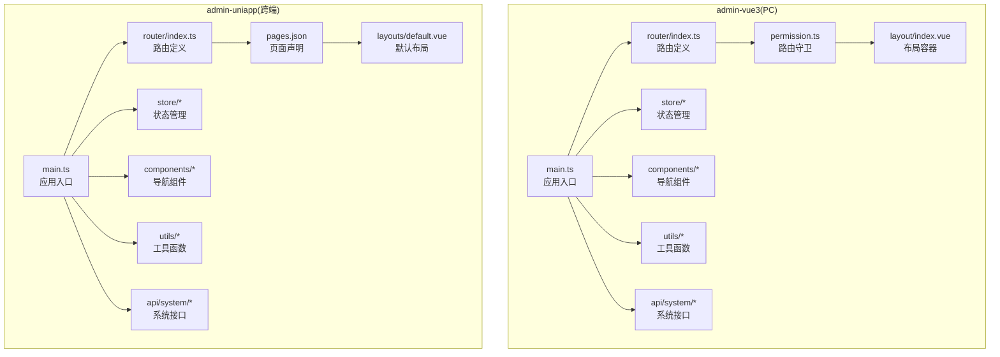
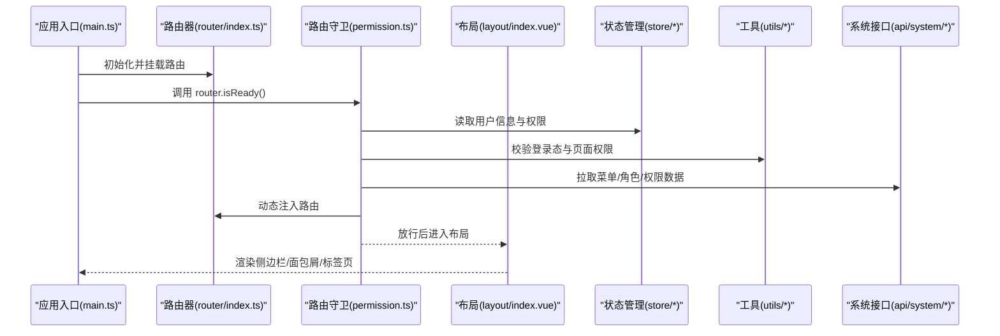
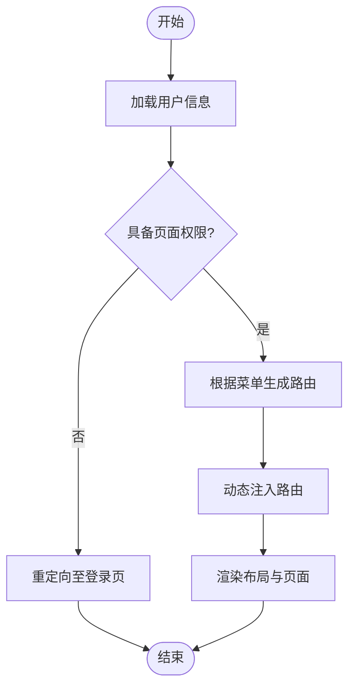
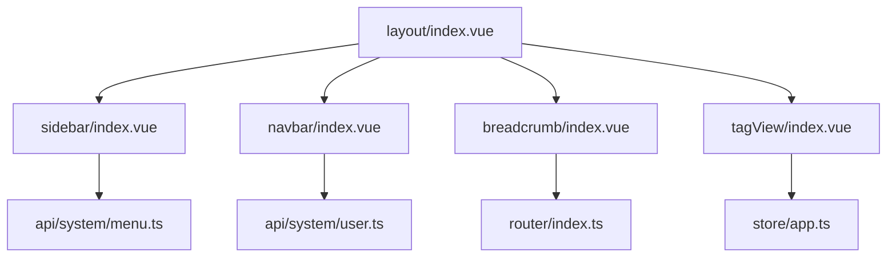
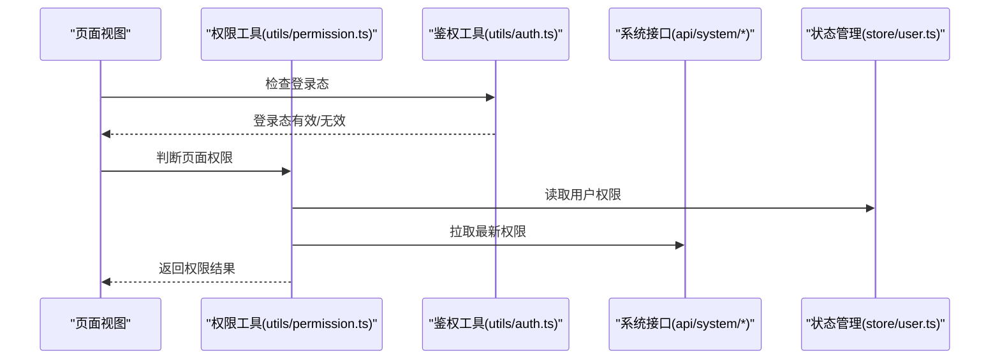
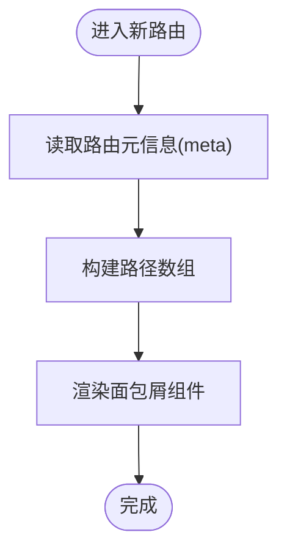
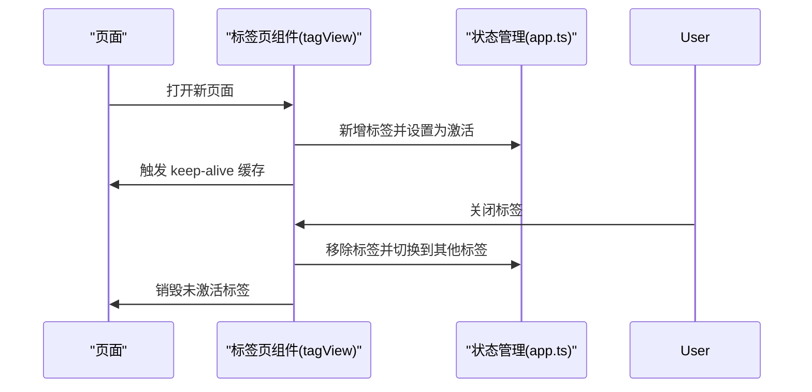
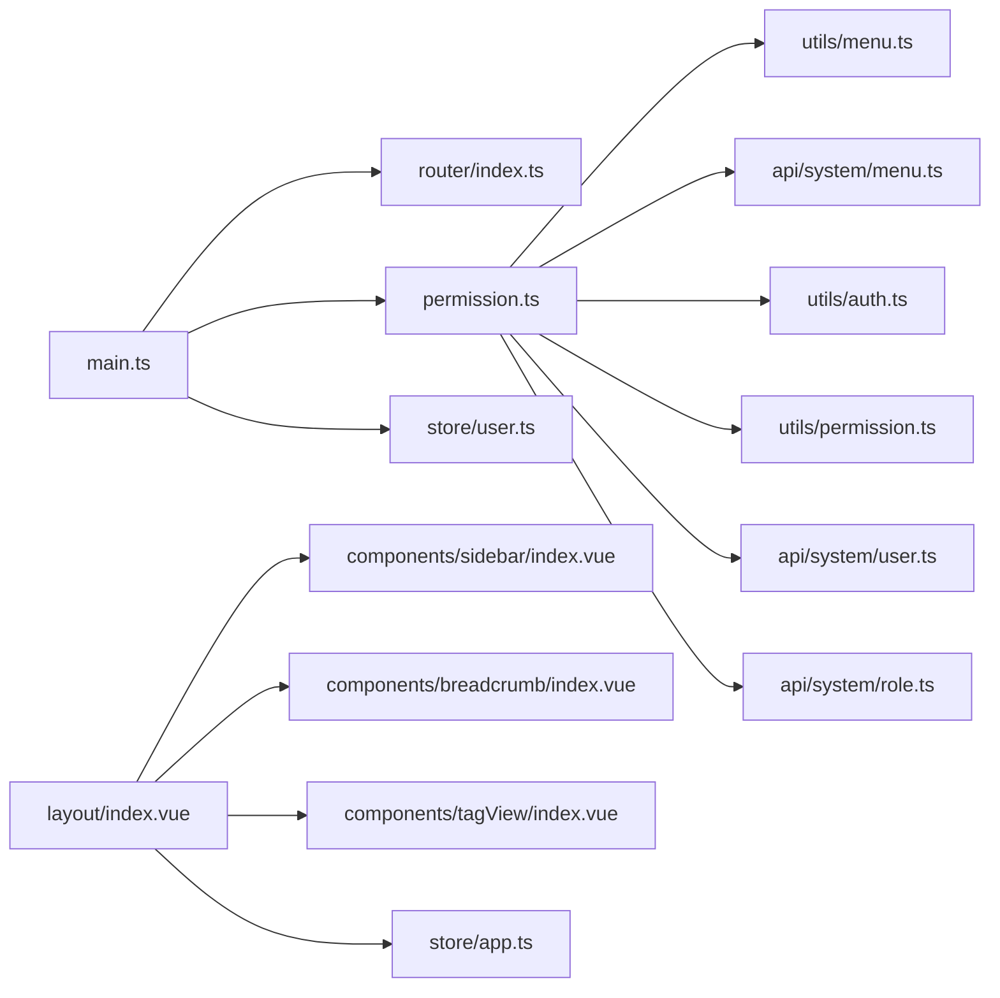

# 路由配置与导航

<cite>
**本文引用的文件**
- [main.ts](file://frontend/admin-vue3/src/main.ts)
- [permission.ts](file://frontend/admin-vue3/src/permission.ts)
- [router/index.ts](file://frontend/admin-vue3/src/router/index.ts)
- [layout/index.vue](file://frontend/admin-vue3/src/layout/index.vue)
- [directives/auth.ts](file://frontend/admin-vue3/src/directives/auth.ts)
- [store/user.ts](file://frontend/admin-vue3/src/store/user.ts)
- [store/app.ts](file://frontend/admin-vue3/src/store/app.ts)
- [views/system/menu/index.vue](file://frontend/admin-vue3/src/views/system/menu/index.vue)
- [views/system/role/index.vue](file://frontend/admin-vue3/src/views/system/role/index.vue)
- [views/system/user/index.vue](file://frontend/admin-vue3/src/views/system/user/index.vue)
- [components/tagView/index.vue](file://frontend/admin-vue3/src/components/tagView/index.vue)
- [components/breadcrumb/index.vue](file://frontend/admin-vue3/src/components/breadcrumb/index.vue)
- [components/sidebar/index.vue](file://frontend/admin-vue3/src/components/sidebar/index.vue)
- [components/navbar/index.vue](file://frontend/admin-vue3/src/components/navbar/index.vue)
- [utils/auth.ts](file://frontend/admin-vue3/src/utils/auth.ts)
- [utils/menu.ts](file://frontend/admin-vue3/src/utils/menu.ts)
- [utils/permission.ts](file://frontend/admin-vue3/src/utils/permission.ts)
- [api/system/menu.ts](file://frontend/admin-vue3/src/api/system/menu.ts)
- [api/system/user.ts](file://frontend/admin-vue3/src/api/system/user.ts)
- [api/system/role.ts](file://frontend/admin-vue3/src/api/system/role.ts)
- [router/index.ts](file://frontend/admin-uniapp/src/router/index.ts)
- [pages.json](file://frontend/admin-uniapp/src/pages.json)
- [layouts/default.vue](file://frontend/admin-uniapp/src/layouts/default.vue)
- [components/sidebar/index.vue](file://frontend/admin-uniapp/src/components/sidebar/index.vue)
- [components/breadcrumb/index.vue](file://frontend/admin-uniapp/src/components/breadcrumb/index.vue)
- [components/tagView/index.vue](file://frontend/admin-uniapp/src/components/tagView/index.vue)
- [store/user.ts](file://frontend/admin-uniapp/src/store/user.ts)
- [store/app.ts](file://frontend/admin-uniapp/src/store/app.ts)
- [utils/menu.ts](file://frontend/admin-uniapp/src/utils/menu.ts)
- [utils/auth.ts](file://frontend/admin-uniapp/src/utils/auth.ts)
- [utils/permission.ts](file://frontend/admin-uniapp/src/utils/permission.ts)
- [api/system/menu.ts](file://frontend/admin-uniapp/src/api/system/menu.ts)
- [api/system/user.ts](file://frontend/admin-uniapp/src/api/system/user.ts)
- [api/system/role.ts](file://frontend/admin-uniapp/src/api/system/role.ts)
</cite>

## 目录
1. [引言](#引言)
2. [项目结构](#项目结构)
3. [核心组件](#核心组件)
4. [架构总览](#架构总览)
5. [详细组件分析](#详细组件分析)
6. [依赖关系分析](#依赖关系分析)
7. [性能考虑](#性能考虑)
8. [故障排查指南](#故障排查指南)
9. [结论](#结论)
10. [附录](#附录)

## 引言
本文件面向 Vue3 + Vue Router 4 的路由配置与导航，结合仓库中的实际实现，系统性阐述以下主题：
- 路由设计与动态路由配置
- 权限路由控制与页面访问控制
- 布局组件设计与导航结构
- 面包屑导航与标签页管理
- 路由守卫与权限指令
- 路由懒加载与预加载策略
- 最佳实践与导航体验优化

## 项目结构
本仓库包含两套前端实现：admin-vue3（PC 端 Vue3 应用）与 admin-uniapp（跨端应用）。两者均采用 Vue Router 4，并在权限控制、布局与导航方面有相似的设计模式。

图表来源
- [main.ts:28-64](file://frontend/admin-vue3/src/main.ts#L28-L64)
- [router/index.ts](file://frontend/admin-vue3/src/router/index.ts)
- [permission.ts](file://frontend/admin-vue3/src/permission.ts)
- [layout/index.vue](file://frontend/admin-vue3/src/layout/index.vue)
- [store/user.ts](file://frontend/admin-vue3/src/store/user.ts)
- [store/app.ts](file://frontend/admin-vue3/src/store/app.ts)
- [components/sidebar/index.vue](file://frontend/admin-vue3/src/components/sidebar/index.vue)
- [components/breadcrumb/index.vue](file://frontend/admin-vue3/src/components/breadcrumb/index.vue)
- [components/tagView/index.vue](file://frontend/admin-vue3/src/components/tagView/index.vue)
- [utils/menu.ts](file://frontend/admin-vue3/src/utils/menu.ts)
- [utils/auth.ts](file://frontend/admin-vue3/src/utils/auth.ts)
- [utils/permission.ts](file://frontend/admin-vue3/src/utils/permission.ts)
- [api/system/menu.ts](file://frontend/admin-vue3/src/api/system/menu.ts)
- [api/system/user.ts](file://frontend/admin-vue3/src/api/system/user.ts)
- [api/system/role.ts](file://frontend/admin-vue3/src/api/system/role.ts)

章节来源
- [main.ts:28-64](file://frontend/admin-vue3/src/main.ts#L28-L64)
- [router/index.ts](file://frontend/admin-vue3/src/router/index.ts)
- [pages.json](file://frontend/admin-uniapp/src/pages.json)

## 核心组件
- 路由器初始化与挂载：应用入口负责初始化 i18n、状态管理、全局组件、UI 框架、路由等，并在 router.isReady 后挂载应用。
- 路由守卫：统一在 permission.ts 中实现前置守卫，进行登录态校验、权限校验与页面级访问控制。
- 动态路由：通过用户角色/菜单数据动态生成路由表，支持后端下发路由与权限。
- 布局容器：layout/index.vue 提供侧边栏、顶部导航、面包屑、内容区与标签页的整体布局。
- 导航组件：sidebar、breadcrumb、tagView 组件分别承担菜单导航、路径导航与多标签页管理。
- 权限指令：auth 指令用于元素级权限控制，避免无权限元素渲染。
- 状态管理：store/user.ts 保存用户信息与权限；store/app.ts 保存应用级状态（如标签页、菜单展开状态等）。
- 工具函数：menu.ts、auth.ts、permission.ts 提供菜单解析、鉴权令牌与权限判断逻辑。

章节来源
- [main.ts:50-81](file://frontend/admin-vue3/src/main.ts#L50-L81)
- [permission.ts](file://frontend/admin-vue3/src/permission.ts)
- [layout/index.vue](file://frontend/admin-vue3/src/layout/index.vue)
- [components/sidebar/index.vue](file://frontend/admin-vue3/src/components/sidebar/index.vue)
- [components/breadcrumb/index.vue](file://frontend/admin-vue3/src/components/breadcrumb/index.vue)
- [components/tagView/index.vue](file://frontend/admin-vue3/src/components/tagView/index.vue)
- [directives/auth.ts](file://frontend/admin-vue3/src/directives/auth.ts)
- [store/user.ts](file://frontend/admin-vue3/src/store/user.ts)
- [store/app.ts](file://frontend/admin-vue3/src/store/app.ts)
- [utils/menu.ts](file://frontend/admin-vue3/src/utils/menu.ts)
- [utils/auth.ts](file://frontend/admin-vue3/src/utils/auth.ts)
- [utils/permission.ts](file://frontend/admin-vue3/src/utils/permission.ts)

## 架构总览
Vue3 路由体系以“应用入口 -> 路由器 -> 路由守卫 -> 布局容器 -> 页面视图”为主线，配合状态管理与权限工具完成完整的导航闭环。

图表来源
- [main.ts:64-73](file://frontend/admin-vue3/src/main.ts#L64-L73)
- [permission.ts](file://frontend/admin-vue3/src/permission.ts)
- [router/index.ts](file://frontend/admin-vue3/src/router/index.ts)
- [layout/index.vue](file://frontend/admin-vue3/src/layout/index.vue)
- [store/user.ts](file://frontend/admin-vue3/src/store/user.ts)
- [utils/permission.ts](file://frontend/admin-vue3/src/utils/permission.ts)
- [api/system/menu.ts](file://frontend/admin-vue3/src/api/system/menu.ts)

## 详细组件分析

### 路由器与动态路由
- 路由定义：router/index.ts 负责定义基础路由与懒加载页面，同时提供动态添加路由的能力。
- 动态路由注入：permission.ts 在登录成功后根据用户权限与菜单数据动态生成路由并注入路由器。
- 跨端路由：admin-uniapp 使用 pages.json 声明页面，router/index.ts 与布局组件协同工作。

图表来源
- [permission.ts](file://frontend/admin-vue3/src/permission.ts)
- [router/index.ts](file://frontend/admin-vue3/src/router/index.ts)
- [utils/menu.ts](file://frontend/admin-vue3/src/utils/menu.ts)
- [api/system/menu.ts](file://frontend/admin-vue3/src/api/system/menu.ts)

章节来源
- [router/index.ts](file://frontend/admin-vue3/src/router/index.ts)
- [permission.ts](file://frontend/admin-vue3/src/permission.ts)
- [utils/menu.ts](file://frontend/admin-vue3/src/utils/menu.ts)
- [api/system/menu.ts](file://frontend/admin-vue3/src/api/system/menu.ts)

### 布局组件设计
- 布局容器：layout/index.vue 提供整体布局骨架，包含侧边栏、顶部导航、面包屑与内容区域。
- 侧边栏：components/sidebar/index.vue 展示菜单树，支持折叠与高亮当前路由。
- 顶部导航：components/navbar/index.vue 提供用户信息、切换语言、退出登录等操作。
- 面包屑：components/breadcrumb/index.vue 根据当前路由动态生成路径导航。
- 标签页：components/tagView/index.vue 实现多标签页浏览与关闭。

图表来源
- [layout/index.vue](file://frontend/admin-vue3/src/layout/index.vue)
- [components/sidebar/index.vue](file://frontend/admin-vue3/src/components/sidebar/index.vue)
- [components/navbar/index.vue](file://frontend/admin-vue3/src/components/navbar/index.vue)
- [components/breadcrumb/index.vue](file://frontend/admin-vue3/src/components/breadcrumb/index.vue)
- [components/tagView/index.vue](file://frontend/admin-vue3/src/components/tagView/index.vue)
- [api/system/menu.ts](file://frontend/admin-vue3/src/api/system/menu.ts)
- [api/system/user.ts](file://frontend/admin-vue3/src/api/system/user.ts)
- [store/app.ts](file://frontend/admin-vue3/src/store/app.ts)

章节来源
- [layout/index.vue](file://frontend/admin-vue3/src/layout/index.vue)
- [components/sidebar/index.vue](file://frontend/admin-vue3/src/components/sidebar/index.vue)
- [components/navbar/index.vue](file://frontend/admin-vue3/src/components/navbar/index.vue)
- [components/breadcrumb/index.vue](file://frontend/admin-vue3/src/components/breadcrumb/index.vue)
- [components/tagView/index.vue](file://frontend/admin-vue3/src/components/tagView/index.vue)

### 权限路由控制与页面权限
- 登录态校验：utils/auth.ts 提供令牌存储与校验逻辑。
- 页面权限：utils/permission.ts 提供页面级权限判断方法。
- 角色/菜单：views/system/role/index.vue 与 views/system/menu/index.vue 提供角色与菜单管理界面，支撑权限模型。
- 用户信息：views/system/user/index.vue 展示用户详情与关联角色。

图表来源
- [utils/permission.ts](file://frontend/admin-vue3/src/utils/permission.ts)
- [utils/auth.ts](file://frontend/admin-vue3/src/utils/auth.ts)
- [api/system/role.ts](file://frontend/admin-vue3/src/api/system/role.ts)
- [api/system/menu.ts](file://frontend/admin-vue3/src/api/system/menu.ts)
- [store/user.ts](file://frontend/admin-vue3/src/store/user.ts)

章节来源
- [utils/permission.ts](file://frontend/admin-vue3/src/utils/permission.ts)
- [utils/auth.ts](file://frontend/admin-vue3/src/utils/auth.ts)
- [views/system/role/index.vue](file://frontend/admin-vue3/src/views/system/role/index.vue)
- [views/system/menu/index.vue](file://frontend/admin-vue3/src/views/system/menu/index.vue)
- [views/system/user/index.vue](file://frontend/admin-vue3/src/views/system/user/index.vue)

### 面包屑导航实现
- 路由元信息：在路由配置中设置 meta 字段（如 title、icon），用于生成面包屑文本与图标。
- 动态计算：components/breadcrumb/index.vue 根据当前路由路径逐级生成面包屑项。
- 与布局集成：面包屑位于 layout/index.vue 的内容区域上方，随路由变化自动更新。

图表来源
- [components/breadcrumb/index.vue](file://frontend/admin-vue3/src/components/breadcrumb/index.vue)
- [layout/index.vue](file://frontend/admin-vue3/src/layout/index.vue)

章节来源
- [components/breadcrumb/index.vue](file://frontend/admin-vue3/src/components/breadcrumb/index.vue)
- [layout/index.vue](file://frontend/admin-vue3/src/layout/index.vue)

### 标签页管理
- 状态存储：store/app.ts 维护标签页列表、当前激活标签与缓存策略。
- 组件交互：components/tagView/index.vue 负责标签页的新增、切换、关闭与刷新。
- 生命周期：结合 keep-alive 与路由钩子，实现标签页的缓存与销毁策略。

图表来源
- [components/tagView/index.vue](file://frontend/admin-vue3/src/components/tagView/index.vue)
- [store/app.ts](file://frontend/admin-vue3/src/store/app.ts)

章节来源
- [components/tagView/index.vue](file://frontend/admin-vue3/src/components/tagView/index.vue)
- [store/app.ts](file://frontend/admin-vue3/src/store/app.ts)

### 路由懒加载与预加载策略
- 懒加载：router/index.ts 中对页面组件使用动态导入，实现按需加载。
- 预加载：在 permission.ts 中，于进入受保护路由前预拉取用户权限与菜单数据，减少首屏等待。
- 资源优化：结合打包工具的代码分割与路由级别的异步组件，提升首屏性能。

章节来源
- [router/index.ts](file://frontend/admin-vue3/src/router/index.ts)
- [permission.ts](file://frontend/admin-vue3/src/permission.ts)

### 权限指令实现
- 指令定义：directives/auth.ts 定义 v-auth 指令，用于元素级权限控制。
- 使用方式：在模板中通过 v-auth="code" 控制元素显示/隐藏。
- 实现原理：指令在绑定时读取当前用户权限，决定 DOM 节点的渲染。

章节来源
- [directives/auth.ts](file://frontend/admin-vue3/src/directives/auth.ts)

### 菜单自动生成
- 数据来源：api/system/menu.ts 提供菜单查询接口。
- 解析规则：utils/menu.ts 将后端返回的树形菜单转换为路由可用的扁平/层级结构。
- 注入流程：permission.ts 在登录后调用菜单解析与路由注入逻辑。

章节来源
- [api/system/menu.ts](file://frontend/admin-vue3/src/api/system/menu.ts)
- [utils/menu.ts](file://frontend/admin-vue3/src/utils/menu.ts)
- [permission.ts](file://frontend/admin-vue3/src/permission.ts)

## 依赖关系分析
- 应用入口依赖：main.ts 依赖 router、permission、store、directives、plugins 等模块。
- 路由依赖：router/index.ts 依赖 utils/menu.ts 与 api/system/menu.ts 生成动态路由。
- 布局依赖：layout/index.vue 依赖 sidebar、breadcrumb、tagView 组件与 store/app.ts。
- 权限依赖：permission.ts 依赖 store/user.ts、utils/permission.ts、utils/auth.ts、api/system/*。

图表来源
- [main.ts:28-64](file://frontend/admin-vue3/src/main.ts#L28-L64)
- [router/index.ts](file://frontend/admin-vue3/src/router/index.ts)
- [permission.ts](file://frontend/admin-vue3/src/permission.ts)
- [layout/index.vue](file://frontend/admin-vue3/src/layout/index.vue)
- [components/sidebar/index.vue](file://frontend/admin-vue3/src/components/sidebar/index.vue)
- [components/breadcrumb/index.vue](file://frontend/admin-vue3/src/components/breadcrumb/index.vue)
- [components/tagView/index.vue](file://frontend/admin-vue3/src/components/tagView/index.vue)
- [store/user.ts](file://frontend/admin-vue3/src/store/user.ts)
- [store/app.ts](file://frontend/admin-vue3/src/store/app.ts)
- [utils/menu.ts](file://frontend/admin-vue3/src/utils/menu.ts)
- [utils/auth.ts](file://frontend/admin-vue3/src/utils/auth.ts)
- [utils/permission.ts](file://frontend/admin-vue3/src/utils/permission.ts)
- [api/system/menu.ts](file://frontend/admin-vue3/src/api/system/menu.ts)
- [api/system/user.ts](file://frontend/admin-vue3/src/api/system/user.ts)
- [api/system/role.ts](file://frontend/admin-vue3/src/api/system/role.ts)

章节来源
- [main.ts:28-64](file://frontend/admin-vue3/src/main.ts#L28-L64)
- [router/index.ts](file://frontend/admin-vue3/src/router/index.ts)
- [permission.ts](file://frontend/admin-vue3/src/permission.ts)
- [layout/index.vue](file://frontend/admin-vue3/src/layout/index.vue)

## 性能考虑
- 代码分割：使用动态导入实现路由级懒加载，减少初始包体积。
- 预取策略：在路由守卫中预拉取权限与菜单，缩短首次渲染等待时间。
- 标签页缓存：结合 keep-alive 与标签页状态管理，避免重复渲染。
- 图标与资源：统一 SVG 图标与静态资源管理，降低网络请求次数。
- 打包优化：合理配置 Vite 与路由拆分，启用压缩与按需加载。

## 故障排查指南
- 登录后白屏或无限跳转
  - 检查 permission.ts 中的登录态校验与路由注入逻辑是否正确执行。
  - 确认 router.isReady() 是否在应用挂载前完成。
- 权限不生效
  - 检查 v-auth 指令绑定的权限码是否正确。
  - 确认 store/user.ts 中的权限数据是否已更新。
- 菜单不显示
  - 检查 api/system/menu.ts 的返回数据格式与 utils/menu.ts 的解析逻辑。
  - 确认 permission.ts 中的动态路由注入是否成功。
- 标签页异常
  - 检查 store/app.ts 中的标签页状态与组件的交互逻辑。
  - 确认路由命名与标签页标题生成规则一致。

章节来源
- [permission.ts](file://frontend/admin-vue3/src/permission.ts)
- [directives/auth.ts](file://frontend/admin-vue3/src/directives/auth.ts)
- [store/user.ts](file://frontend/admin-vue3/src/store/user.ts)
- [store/app.ts](file://frontend/admin-vue3/src/store/app.ts)
- [utils/menu.ts](file://frontend/admin-vue3/src/utils/menu.ts)
- [api/system/menu.ts](file://frontend/admin-vue3/src/api/system/menu.ts)

## 结论
本项目在 Vue3 + Vue Router 4 的基础上，构建了完善的路由与导航体系：通过动态路由与权限守卫实现灵活的页面访问控制；通过布局与导航组件提供一致的用户体验；通过标签页与面包屑增强多页面场景下的可发现性与可回溯性。结合懒加载与预取策略，兼顾了性能与交互体验。建议在实际项目中持续完善权限模型、优化路由拆分与缓存策略，并加强监控与日志以便快速定位问题。

## 附录
- 跨端路由差异：admin-uniapp 使用 pages.json 声明页面，router/index.ts 与布局组件协同工作，与 PC 端的动态路由注入略有不同。
- 接口规范：系统菜单、用户、角色接口遵循统一的数据结构与字段约定，便于权限解析与路由生成。

章节来源
- [pages.json](file://frontend/admin-uniapp/src/pages.json)
- [router/index.ts](file://frontend/admin-uniapp/src/router/index.ts)
- [layouts/default.vue](file://frontend/admin-uniapp/src/layouts/default.vue)