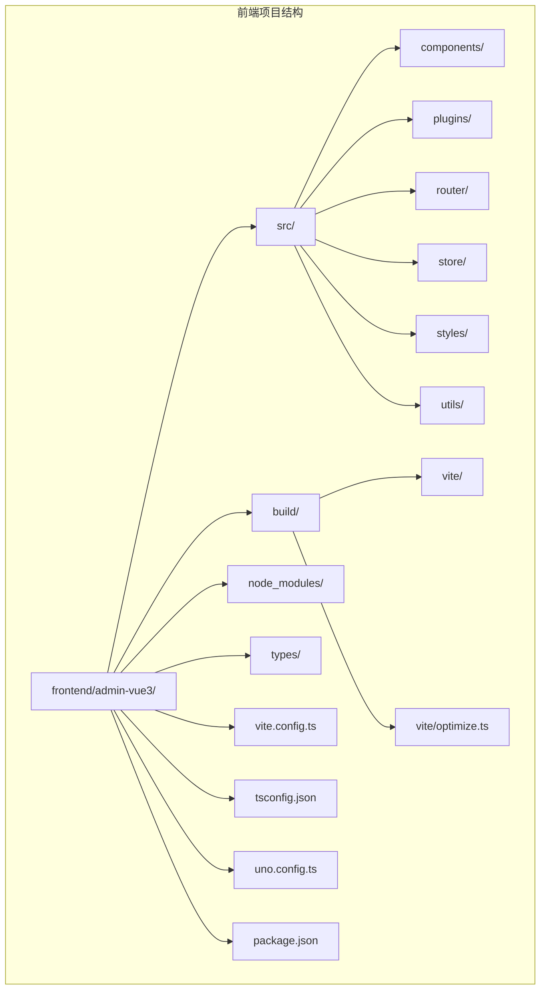
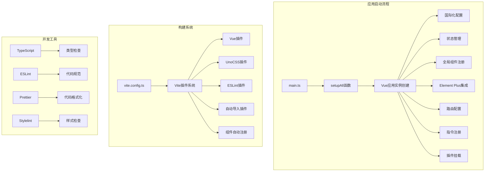
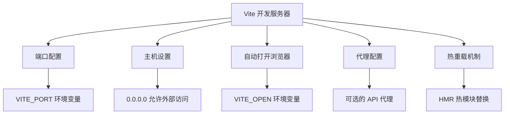
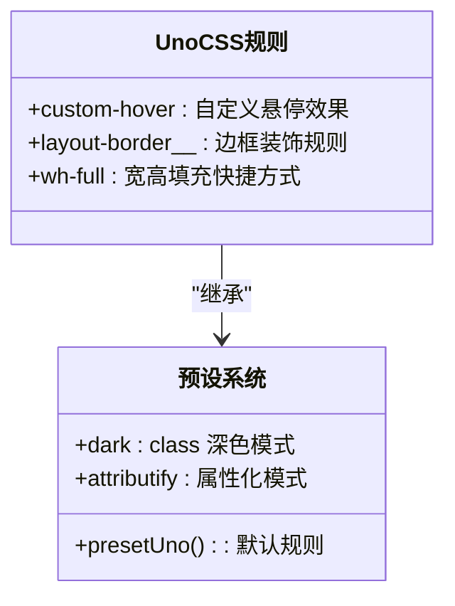
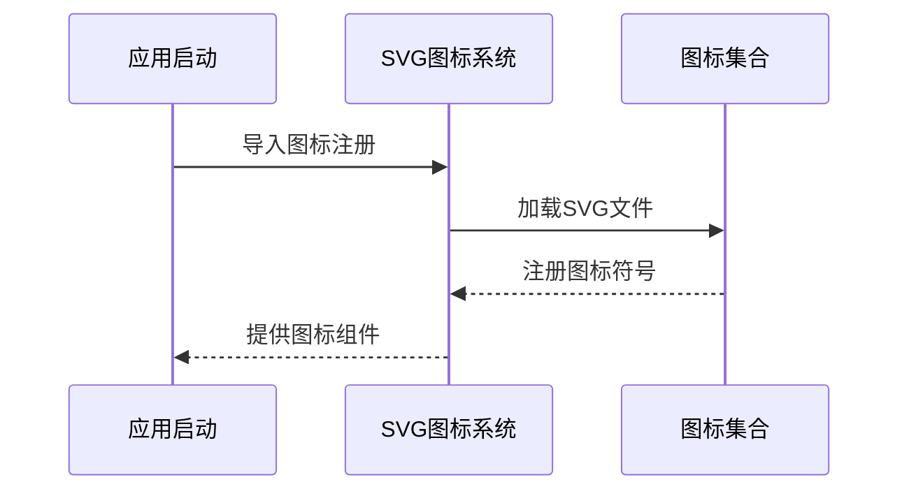
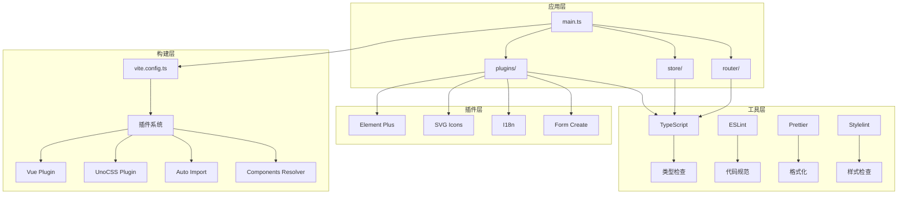

# 项目配置与环境搭建

<cite>
**本文档引用的文件**
- [package.json](file://frontend/admin-vue3/package.json)
- [vite.config.ts](file://frontend/admin-vue3/vite.config.ts)
- [tsconfig.json](file://frontend/admin-vue3/tsconfig.json)
- [uno.config.ts](file://frontend/admin-vue3/uno.config.ts)
- [prettier.config.js](file://frontend/admin-vue3/prettier.config.js)
- [stylelint.config.js](file://frontend/admin-vue3/stylelint.config.js)
- [main.ts](file://frontend/admin-vue3/src/main.ts)
- [index.ts](file://frontend/admin-vue3/build/vite/index.ts)
- [optimize.ts](file://frontend/admin-vue3/build/vite/optimize.ts)
- [elementPlus/index.ts](file://frontend/admin-vue3/src/plugins/elementPlus/index.ts)
- [svgIcon/index.ts](file://frontend/admin-vue3/src/plugins/svgIcon/index.ts)
- [vueI18n/index.ts](file://frontend/admin-vue3/src/plugins/vueI18n/index.ts)
- [store/index.ts](file://frontend/admin-vue3/src/store/index.ts)
- [.eslintrc.js](file://frontend/admin-vue3/.eslintrc.js)
- [postcss.config.js](file://frontend/admin-vue3/postcss.config.js)
- [router/index.ts](file://frontend/admin-vue3/src/router/index.ts)
</cite>

## 目录
1. [简介](#简介)
2. [项目结构](#项目结构)
3. [核心组件](#核心组件)
4. [架构概览](#架构概览)
5. [详细组件分析](#详细组件分析)
6. [依赖关系分析](#依赖关系分析)
7. [性能考虑](#性能考虑)
8. [故障排除指南](#故障排除指南)
9. [结论](#结论)
10. [附录](#附录)

## 简介

这是一个基于 Vue3、Vite5、Element Plus 和 TypeScript 的现代化前端项目。项目采用模块化架构设计，集成了丰富的开发工具链，包括 UnoCSS 原子化 CSS 框架、ESLint 代码规范检查、Prettier 代码格式化、Stylelint 样式检查等。

项目提供了完整的开发环境配置，包括开发服务器设置、热重载机制、代理配置和环境变量管理。同时集成了 Element Plus 组件库和图标系统，为开发者提供了高效的开发体验。

## 项目结构

前端项目采用清晰的模块化组织结构：



**图表来源**
- [package.json:1-160](file://frontend/admin-vue3/package.json#L1-L160)
- [vite.config.ts:1-89](file://frontend/admin-vue3/vite.config.ts#L1-L89)

**章节来源**
- [package.json:1-160](file://frontend/admin-vue3/package.json#L1-L160)
- [vite.config.ts:1-89](file://frontend/admin-vue3/vite.config.ts#L1-L89)

## 核心组件

### 依赖管理策略

项目采用 pnpm 作为包管理器，版本要求 Node.js >= 16.0.0，pnpm >= 8.6.0。依赖分为生产依赖和开发依赖两大类：

**生产依赖核心库：**
- Vue3 生态系统：vue@3.5.12、vue-router@4.4.5、pinia@^2.1.7
- UI 组件库：element-plus@2.11.1、@element-plus/icons-vue@2.3.2
- 工具库：axios@1.9.0、dayjs@^1.11.10、lodash-es@^4.17.21
- 图表库：echarts@^5.5.0、@wangeditor-next/editor@^5.6.46

**开发依赖核心工具：**
- 构建工具：vite@5.1.4、typescript@5.3.3
- 代码质量：eslint@^8.57.0、prettier@^3.2.5、stylelint@^16.2.1
- CSS 框架：unocss@^0.58.5、sass@^1.69.5
- 插件生态：unplugin-auto-import@^0.16.7、unplugin-vue-components@^0.25.2

**章节来源**
- [package.json:27-144](file://frontend/admin-vue3/package.json#L27-L144)

### 开发工具链设置

项目集成了完整的开发工具链，确保代码质量和开发效率：

**构建配置：**
- Vite5 作为主要构建工具，支持快速热重载和模块联邦
- TypeScript 类型检查，支持严格的类型安全
- UnoCSS 原子化 CSS 框架，提供高效的样式开发体验

**代码质量工具：**
- ESLint 配置，支持 Vue3 和 TypeScript 语法检查
- Prettier 格式化，统一代码风格
- Stylelint 样式检查，确保 CSS 代码质量

**章节来源**
- [package.json:7-26](file://frontend/admin-vue3/package.json#L7-L26)
- [.eslintrc.js:1-76](file://frontend/admin-vue3/.eslintrc.js#L1-L76)

## 架构概览

项目采用模块化的架构设计，各个组件通过依赖注入的方式集成：



**图表来源**
- [main.ts:51-83](file://frontend/admin-vue3/src/main.ts#L51-L83)
- [vite.config.ts:15-87](file://frontend/admin-vue3/vite.config.ts#L15-L87)
- [index.ts:19-99](file://frontend/admin-vue3/build/vite/index.ts#L19-L99)

## 详细组件分析

### Vite5 构建配置

Vite5 作为核心构建工具，提供了高性能的开发体验：

**核心配置特性：**
- 动态环境变量加载：支持多种模式的环境变量配置
- 服务器配置：端口、主机、自动打开浏览器等选项
- 插件系统：高度可扩展的插件架构
- CSS 预处理器：Sass 支持和全局变量注入
- 依赖优化：智能的依赖预构建和缓存

**开发服务器配置：**


**图表来源**
- [vite.config.ts:27-40](file://frontend/admin-vue3/vite.config.ts#L27-L40)

**章节来源**
- [vite.config.ts:15-87](file://frontend/admin-vue3/vite.config.ts#L15-L87)

### TypeScript 类型检查

项目采用严格的 TypeScript 配置，确保类型安全：

**编译选项配置：**
- 目标 ESNext，支持最新的 JavaScript 特性
- 启用严格模式，提高代码质量
- 支持 JSX 语法，适用于 Vue3 组件
- 路径映射配置，简化模块导入

**类型定义管理：**
- 自动导入类型声明
- 组件类型自动推断
- 环境变量类型支持

**章节来源**
- [tsconfig.json:1-44](file://frontend/admin-vue3/tsconfig.json#L1-L44)

### ESLint 代码规范

ESLint 配置确保代码风格的一致性和质量：

**配置特点：**
- Vue3 专用规则集，支持 Composition API
- TypeScript 集成，提供类型安全检查
- Prettier 集成，避免格式化冲突
- UnoCSS 规则支持，优化原子化 CSS 使用

**自定义规则：**
- 关闭部分严格规则，提升开发体验
- Vue 组件命名规范放宽
- ESLint 与 Prettier 协调工作

**章节来源**
- [.eslintrc.js:20-74](file://frontend/admin-vue3/.eslintrc.js#L20-L74)

### Prettier 格式化规则

Prettier 提供一致的代码格式化标准：

**格式化配置：**
- 行宽 100 字符，适合现代大屏开发
- 使用单引号，统一字符串格式
- 禁用分号，符合现代 JavaScript 标准
- 箭头函数参数始终使用括号

**支持的文件类型：**
- JavaScript/TypeScript 文件
- Vue 单文件组件
- JSON、CSS、SCSS、HTML、Markdown

**章节来源**
- [prettier.config.js:1-23](file://frontend/admin-vue3/prettier.config.js#L1-L23)

### Stylelint 样式检查

Stylelint 确保 CSS 代码的质量和一致性：

**样式检查配置：**
- 基于标准样式规范的扩展
- 支持 SCSS 和 CSS 语法
- Vue 单文件组件样式支持
- 属性排序规则定制

**特殊处理：**
- 忽略 rpx 单位，适配移动端开发
- Vue 深度选择器兼容
- 自定义属性和变量支持

**章节来源**
- [stylelint.config.js:1-236](file://frontend/admin-vue3/stylelint.config.js#L1-L236)

### UnoCSS 样式框架集成

UnoCSS 提供原子化 CSS 开发体验：

**核心功能：**
- 实时编译和热更新
- 自定义规则和快捷方式
- 深色主题支持
- 与 Element Plus 协同工作

**自定义规则：**


**图表来源**
- [uno.config.ts:6-107](file://frontend/admin-vue3/uno.config.ts#L6-L107)

**章节来源**
- [uno.config.ts:1-108](file://frontend/admin-vue3/uno.config.ts#L1-L108)

### Element Plus 组件库配置

Element Plus 提供丰富的 UI 组件：

**集成配置：**
- 全局组件注册
- 插件按需加载
- 国际化支持
- 样式自动导入

**核心组件：**
- ElLoading：全局加载指示器
- ElScrollbar：自定义滚动条
- ElButton：按钮组件

**章节来源**
- [elementPlus/index.ts:1-18](file://frontend/admin-vue3/src/plugins/elementPlus/index.ts#L1-L18)

### 图标系统使用

项目集成了多种图标解决方案：

**SVG 图标系统：**
- 自动导入 SVG 图标
- 虚拟模块支持
- 图标注册机制

**图标配置：**


**图表来源**
- [svgIcon/index.ts:1-4](file://frontend/admin-vue3/src/plugins/svgIcon/index.ts#L1-L4)

**章节来源**
- [svgIcon/index.ts:1-4](file://frontend/admin-vue3/src/plugins/svgIcon/index.ts#L1-L4)

### 状态管理集成

Pinia 提供响应式状态管理：

**配置特点：**
- TypeScript 优先
- 组合式 API 支持
- 持久化插件集成
- 自动类型推断

**持久化配置：**
- 自动保存状态到本地存储
- 支持自定义存储策略
- 页面刷新状态恢复

**章节来源**
- [store/index.ts:1-13](file://frontend/admin-vue3/src/store/index.ts#L1-L13)

### 路由配置

Vue Router 提供客户端路由管理：

**路由特性：**
- 历史模式路由
- 滚动行为控制
- 动态路由重置
- 权限路由管理

**路由配置：**
- 基础路径配置
- 滚动位置重置
- 路由守卫集成

**章节来源**
- [router/index.ts:1-37](file://frontend/admin-vue3/src/router/index.ts#L1-L37)

## 依赖关系分析

项目采用模块化依赖管理，各组件之间耦合度低：



**图表来源**
- [main.ts:1-86](file://frontend/admin-vue3/src/main.ts#L1-L86)
- [vite.config.ts:42-42](file://frontend/admin-vue3/vite.config.ts#L42-L42)

**章节来源**
- [main.ts:1-86](file://frontend/admin-vue3/src/main.ts#L1-L86)
- [index.ts:19-99](file://frontend/admin-vue3/build/vite/index.ts#L19-L99)

## 性能考虑

项目在多个层面进行了性能优化：

### 依赖预构建优化
- 智能的依赖包含和排除列表
- 增量构建支持
- 缓存机制优化

### 构建优化策略
- 按需加载大型库（如 echarts）
- 代码分割和懒加载
- 压缩和优化配置

### 运行时性能
- 热重载优化
- 开发服务器性能调优
- 内存使用优化

## 故障排除指南

### 常见问题解决

**开发服务器启动失败：**
1. 检查端口占用情况
2. 验证环境变量配置
3. 确认网络连接正常

**TypeScript 类型错误：**
1. 检查 tsconfig.json 配置
2. 验证类型声明文件
3. 清理类型缓存

**ESLint 规则冲突：**
1. 检查 .eslintrc.js 配置
2. 验证 VS Code ESLint 插件
3. 清理 ESLint 缓存

**UnoCSS 样式问题：**
1. 检查 uno.config.ts 配置
2. 验证原子化类名使用
3. 清理 UnoCSS 缓存

**章节来源**
- [vite.config.ts:18-22](file://frontend/admin-vue3/vite.config.ts#L18-L22)
- [.eslintrc.js:37-74](file://frontend/admin-vue3/.eslintrc.js#L37-L74)

## 结论

该项目提供了一个完整、现代化的 Vue3 开发环境配置方案。通过精心设计的模块化架构和完善的工具链集成，开发者可以获得高效的开发体验和高质量的代码输出。

项目的主要优势包括：
- 完善的开发工具链配置
- 高性能的构建系统
- 丰富的 UI 组件库集成
- 严格的代码质量保证
- 灵活的配置扩展能力

这些特性使得项目既适合快速原型开发，也适合大型项目的长期维护。

## 附录

### 开发环境搭建步骤

1. **环境准备**
   - 安装 Node.js >= 16.0.0
   - 安装 pnpm >= 8.6.0

2. **项目安装**
   ```bash
   pnpm install
   ```

3. **开发启动**
   ```bash
   pnpm dev
   ```

4. **构建部署**
   ```bash
   pnpm build:dev
   ```

### IDE 配置建议

**推荐的 VS Code 扩展：**
- Vue Language Features (Volar)
- ESLint
- Prettier
- Stylelint
- UnoCSS IntelliSense

**开发配置：**
- 启用 ESLint 自动修复
- 配置 Prettier 保存时格式化
- 设置 TypeScript 严格模式