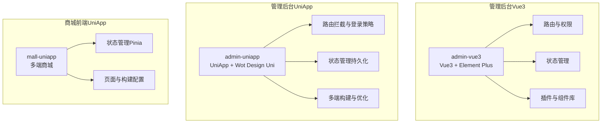
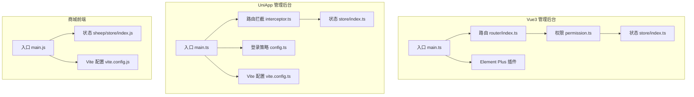
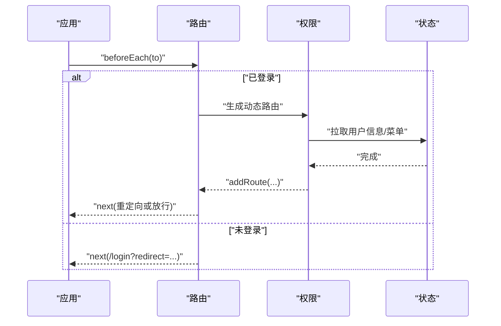
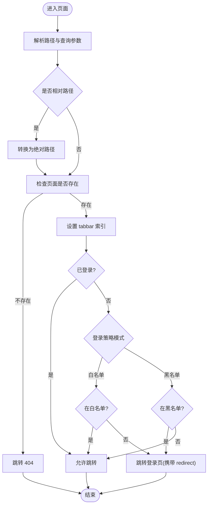
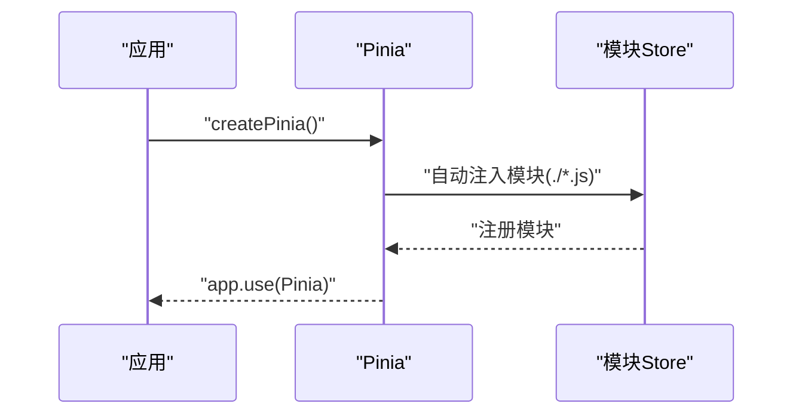
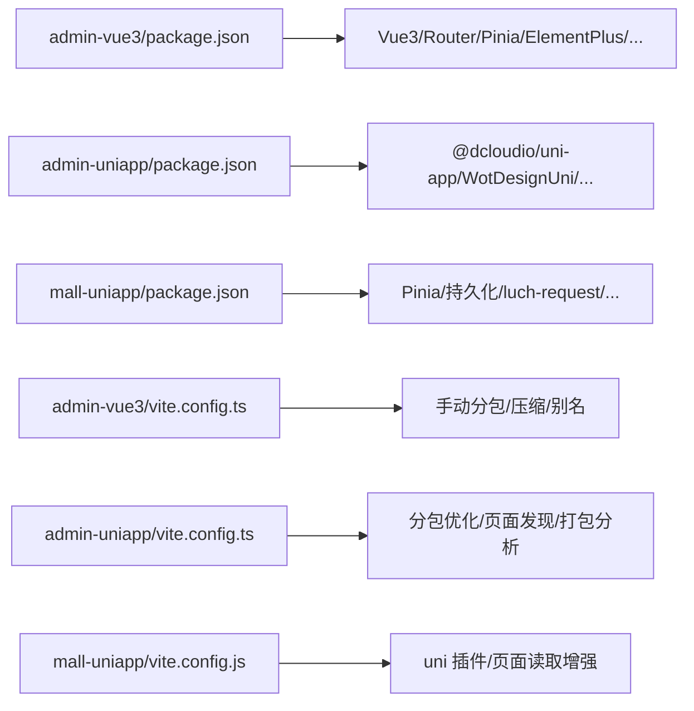

# 前端系统

<cite>
**本文引用的文件**
- [frontend/admin-vue3/package.json](file://frontend/admin-vue3/package.json)
- [frontend/admin-vue3/vite.config.ts](file://frontend/admin-vue3/vite.config.ts)
- [frontend/admin-vue3/src/main.ts](file://frontend/admin-vue3/src/main.ts)
- [frontend/admin-vue3/src/router/index.ts](file://frontend/admin-vue3/src/router/index.ts)
- [frontend/admin-vue3/src/permission.ts](file://frontend/admin-vue3/src/permission.ts)
- [frontend/admin-vue3/src/store/index.ts](file://frontend/admin-vue3/src/store/index.ts)
- [frontend/admin-vue3/src/plugins/elementPlus/index.ts](file://frontend/admin-vue3/src/plugins/elementPlus/index.ts)
- [frontend/admin-uniapp/package.json](file://frontend/admin-uniapp/package.json)
- [frontend/admin-uniapp/vite.config.ts](file://frontend/admin-uniapp/vite.config.ts)
- [frontend/admin-uniapp/src/main.ts](file://frontend/admin-uniapp/src/main.ts)
- [frontend/admin-uniapp/src/router/config.ts](file://frontend/admin-uniapp/src/router/config.ts)
- [frontend/admin-uniapp/src/router/interceptor.ts](file://frontend/admin-uniapp/src/router/interceptor.ts)
- [frontend/admin-uniapp/src/store/index.ts](file://frontend/admin-uniapp/src/store/index.ts)
- [frontend/mall-uniapp/package.json](file://frontend/mall-uniapp/package.json)
- [frontend/mall-uniapp/vite.config.js](file://frontend/mall-uniapp/vite.config.js)
- [frontend/mall-uniapp/main.js](file://frontend/mall-uniapp/main.js)
- [frontend/mall-uniapp/sheep/store/index.js](file://frontend/mall-uniapp/sheep/store/index.js)
</cite>

## 目录
1. [简介](#简介)
2. [项目结构](#项目结构)
3. [核心组件](#核心组件)
4. [架构总览](#架构总览)
5. [详细组件分析](#详细组件分析)
6. [依赖关系分析](#依赖关系分析)
7. [性能考虑](#性能考虑)
8. [故障排查指南](#故障排查指南)
9. [结论](#结论)
10. [附录](#附录)

## 简介
本技术文档面向 AgenticCPS 前端系统，覆盖三套前端工程：
- Vue3 + Element Plus 管理后台（admin-vue3）
- UniApp 管理后台（admin-uniapp）
- 商城前端（mall-uniapp）

文档重点阐述：
- 路由与权限管理（登录策略、动态路由、导航守卫）
- 状态管理设计（Pinia + 持久化）
- 组件库使用模式（Element Plus、Wot Design Uni 等）
- UniApp 多端适配（H5/App/小程序）、跨平台兼容与性能优化
- 商城前端架构（商品展示、购物车、订单、用户中心）
- 组件库使用指南（自定义组件、UI 样式、响应式）
- 前端性能优化策略、构建配置与部署流程
- 面向不同经验层次的开发实践建议

## 项目结构
前端系统采用“多工程并行”的组织方式，分别服务于管理后台与商城场景，并针对不同运行平台进行独立配置与优化。

图表来源
- [frontend/admin-vue3/src/main.ts:1-86](file://frontend/admin-vue3/src/main.ts#L1-L86)
- [frontend/admin-uniapp/src/main.ts:1-20](file://frontend/admin-uniapp/src/main.ts#L1-L20)
- [frontend/mall-uniapp/main.js:1-16](file://frontend/mall-uniapp/main.js#L1-L16)

章节来源
- [frontend/admin-vue3/package.json:1-160](file://frontend/admin-vue3/package.json#L1-L160)
- [frontend/admin-uniapp/package.json:1-194](file://frontend/admin-uniapp/package.json#L1-L194)
- [frontend/mall-uniapp/package.json:1-104](file://frontend/mall-uniapp/package.json#L1-L104)

## 核心组件
- 应用入口与初始化
  - Vue3 管理后台：在入口集中初始化 i18n、状态管理、全局组件、Element Plus、表单设计器、路由、指令、打印插件等。
  - UniApp 管理后台：在入口集中挂载 store、路由拦截器、请求拦截器，统一导出 createApp。
  - 商城前端：在入口集中初始化 Pinia（含持久化），统一导出 createApp。
- 路由与权限
  - Vue3：基于 History 模式的路由，全局 beforeEach 动态生成菜单与路由，白名单放行。
  - UniApp：基于拦截器的登录策略（白名单/黑名单），支持小程序平台差异化登录页。
- 状态管理
  - Vue3：Pinia + 持久化插件，集中初始化。
  - UniApp：Pinia + 本地存储持久化，setActivePinia 避免 APP 端白屏。
  - 商城：自动注入各模块 store，统一持久化。
- 组件库与插件
  - Vue3：Element Plus 全局注册与按需组件；wangEditor、打印插件等。
  - UniApp：Wot Design Uni 组件库；UnoCSS、自动导入、分包优化等。

章节来源
- [frontend/admin-vue3/src/main.ts:1-86](file://frontend/admin-vue3/src/main.ts#L1-L86)
- [frontend/admin-uniapp/src/main.ts:1-20](file://frontend/admin-uniapp/src/main.ts#L1-L20)
- [frontend/mall-uniapp/main.js:1-16](file://frontend/mall-uniapp/main.js#L1-L16)
- [frontend/admin-vue3/src/router/index.ts:1-37](file://frontend/admin-vue3/src/router/index.ts#L1-L37)
- [frontend/admin-vue3/src/permission.ts:1-108](file://frontend/admin-vue3/src/permission.ts#L1-L108)
- [frontend/admin-uniapp/src/router/interceptor.ts:1-146](file://frontend/admin-uniapp/src/router/interceptor.ts#L1-L146)
- [frontend/admin-vue3/src/store/index.ts:1-13](file://frontend/admin-vue3/src/store/index.ts#L1-L13)
- [frontend/admin-uniapp/src/store/index.ts:1-23](file://frontend/admin-uniapp/src/store/index.ts#L1-L23)
- [frontend/mall-uniapp/sheep/store/index.js:1-21](file://frontend/mall-uniapp/sheep/store/index.js#L1-L21)
- [frontend/admin-vue3/src/plugins/elementPlus/index.ts:1-18](file://frontend/admin-vue3/src/plugins/elementPlus/index.ts#L1-L18)

## 架构总览
以下图示展示三套前端工程的关键交互与职责边界：

图表来源
- [frontend/admin-vue3/src/main.ts:1-86](file://frontend/admin-vue3/src/main.ts#L1-L86)
- [frontend/admin-vue3/src/router/index.ts:1-37](file://frontend/admin-vue3/src/router/index.ts#L1-L37)
- [frontend/admin-vue3/src/permission.ts:1-108](file://frontend/admin-vue3/src/permission.ts#L1-L108)
- [frontend/admin-vue3/src/store/index.ts:1-13](file://frontend/admin-vue3/src/store/index.ts#L1-L13)
- [frontend/admin-uniapp/src/main.ts:1-20](file://frontend/admin-uniapp/src/main.ts#L1-L20)
- [frontend/admin-uniapp/src/router/config.ts:1-46](file://frontend/admin-uniapp/src/router/config.ts#L1-L46)
- [frontend/admin-uniapp/src/router/interceptor.ts:1-146](file://frontend/admin-uniapp/src/router/interceptor.ts#L1-L146)
- [frontend/admin-uniapp/src/store/index.ts:1-23](file://frontend/admin-uniapp/src/store/index.ts#L1-L23)
- [frontend/admin-uniapp/vite.config.ts:1-214](file://frontend/admin-uniapp/vite.config.ts#L1-L214)
- [frontend/mall-uniapp/main.js:1-16](file://frontend/mall-uniapp/main.js#L1-L16)
- [frontend/mall-uniapp/sheep/store/index.js:1-21](file://frontend/mall-uniapp/sheep/store/index.js#L1-L21)
- [frontend/mall-uniapp/vite.config.js:1-35](file://frontend/mall-uniapp/vite.config.js#L1-L35)

## 详细组件分析

### Vue3 管理后台（admin-vue3）
- 应用初始化流程
  - 顺序：i18n → store → 全局组件 → Element Plus → 表单设计器 → 路由 → 指令 → wangEditor → 打印插件 → 挂载。
  - 关键点：确保路由 ready 再挂载；全局 SVG 图标与动画引入；NProgress、页面加载进度条钩子。
- 路由与权限
  - History 模式，滚动行为统一回到顶部。
  - beforeEach：令牌存在时，首次进入拉取用户信息与动态路由，白名单放行；未登录则重定向至登录页（携带 redirect）。
- 状态管理
  - Pinia + 持久化插件，集中初始化与导出。
- 组件库与插件
  - Element Plus 全局注册 Loading 与常用组件；按需引入其他组件。
  - wangEditor、打印插件、DOM 安全清洗插件等。

图表来源
- [frontend/admin-vue3/src/permission.ts:60-101](file://frontend/admin-vue3/src/permission.ts#L60-L101)
- [frontend/admin-vue3/src/router/index.ts:22-30](file://frontend/admin-vue3/src/router/index.ts#L22-L30)

章节来源
- [frontend/admin-vue3/src/main.ts:1-86](file://frontend/admin-vue3/src/main.ts#L1-L86)
- [frontend/admin-vue3/src/router/index.ts:1-37](file://frontend/admin-vue3/src/router/index.ts#L1-L37)
- [frontend/admin-vue3/src/permission.ts:1-108](file://frontend/admin-vue3/src/permission.ts#L1-L108)
- [frontend/admin-vue3/src/store/index.ts:1-13](file://frontend/admin-vue3/src/store/index.ts#L1-L13)
- [frontend/admin-vue3/src/plugins/elementPlus/index.ts:1-18](file://frontend/admin-vue3/src/plugins/elementPlus/index.ts#L1-L18)

### UniApp 管理后台（admin-uniapp）
- 应用初始化
  - createApp 统一挂载 store、路由拦截器、请求拦截器，便于多端复用。
- 路由与登录策略
  - 登录策略：白名单/黑名单可配置；小程序平台可选择是否复用 H5 登录页。
  - 拦截器：支持 navigateTo/reLaunch/redirectTo/switchTab，处理相对路径、不存在路由、tabbar 自动索引、登录态判断与重定向。
- 状态管理
  - Pinia + 本地存储持久化；setActivePinia 提前激活，避免 APP 端白屏。
- 构建与优化
  - 多端页面自动发现与分包优化；H5 环境注入构建时间与标题；打包可视化分析（仅 H5 生产）。

图表来源
- [frontend/admin-uniapp/src/router/interceptor.ts:36-135](file://frontend/admin-uniapp/src/router/interceptor.ts#L36-L135)
- [frontend/admin-uniapp/src/router/config.ts:1-46](file://frontend/admin-uniapp/src/router/config.ts#L1-L46)

章节来源
- [frontend/admin-uniapp/src/main.ts:1-20](file://frontend/admin-uniapp/src/main.ts#L1-L20)
- [frontend/admin-uniapp/src/router/config.ts:1-46](file://frontend/admin-uniapp/src/router/config.ts#L1-L46)
- [frontend/admin-uniapp/src/router/interceptor.ts:1-146](file://frontend/admin-uniapp/src/router/interceptor.ts#L1-L146)
- [frontend/admin-uniapp/src/store/index.ts:1-23](file://frontend/admin-uniapp/src/store/index.ts#L1-L23)
- [frontend/admin-uniapp/vite.config.ts:1-214](file://frontend/admin-uniapp/vite.config.ts#L1-L214)

### 商城前端（mall-uniapp）
- 应用初始化
  - createApp 中初始化 Pinia（含持久化），统一导出。
- 状态管理
  - 自动注入各模块 store，模块以文件名导出；统一持久化插件。
- 构建与页面
  - 基于 @dcloudio/vite-plugin-uni；页面读取增强插件与直播插件；开发服务器配置。

图表来源
- [frontend/mall-uniapp/main.js:1-16](file://frontend/mall-uniapp/main.js#L1-L16)
- [frontend/mall-uniapp/sheep/store/index.js:1-21](file://frontend/mall-uniapp/sheep/store/index.js#L1-L21)

章节来源
- [frontend/mall-uniapp/main.js:1-16](file://frontend/mall-uniapp/main.js#L1-L16)
- [frontend/mall-uniapp/sheep/store/index.js:1-21](file://frontend/mall-uniapp/sheep/store/index.js#L1-L21)
- [frontend/mall-uniapp/vite.config.js:1-35](file://frontend/mall-uniapp/vite.config.js#L1-L35)

## 依赖关系分析
- 通用依赖
  - Vue3、Vue Router、Pinia、Element Plus（Vue3）、Wot Design Uni（UniApp）、UnoCSS、自动导入、分包优化等。
- 平台差异
  - Vue3：Vite + Terser 压缩、手动分包拆分（如 ECharts、表单设计器）。
  - UniApp：多端页面自动发现、分包优化、manifest 与平台插件集成、H5 环境注入构建信息。
  - 商城：Pinia + 持久化、luch-request、微信 SDK 等。

图表来源
- [frontend/admin-vue3/package.json:27-84](file://frontend/admin-vue3/package.json#L27-L84)
- [frontend/admin-uniapp/package.json:99-127](file://frontend/admin-uniapp/package.json#L99-L127)
- [frontend/mall-uniapp/package.json:90-98](file://frontend/mall-uniapp/package.json#L90-L98)
- [frontend/admin-vue3/vite.config.ts:65-86](file://frontend/admin-vue3/vite.config.ts#L65-L86)
- [frontend/admin-uniapp/vite.config.ts:67-164](file://frontend/admin-uniapp/vite.config.ts#L67-L164)
- [frontend/mall-uniapp/vite.config.js:10-24](file://frontend/mall-uniapp/vite.config.js#L10-L24)

章节来源
- [frontend/admin-vue3/package.json:1-160](file://frontend/admin-vue3/package.json#L1-L160)
- [frontend/admin-uniapp/package.json:1-194](file://frontend/admin-uniapp/package.json#L1-L194)
- [frontend/mall-uniapp/package.json:1-104](file://frontend/mall-uniapp/package.json#L1-L104)
- [frontend/admin-vue3/vite.config.ts:1-89](file://frontend/admin-vue3/vite.config.ts#L1-L89)
- [frontend/admin-uniapp/vite.config.ts:1-214](file://frontend/admin-uniapp/vite.config.ts#L1-L214)
- [frontend/mall-uniapp/vite.config.js:1-35](file://frontend/mall-uniapp/vite.config.js#L1-L35)

## 性能考虑
- 代码分割与懒加载
  - Vue3：手动拆分大依赖（如 ECharts、表单设计器）为独立 chunk，减少首屏体积。
  - UniApp：分包优化、异步跨包调用与组件引用，降低主包体积。
- 构建与压缩
  - Vue3：Terser 压缩、可选去除 console/debugger；Rollup 自定义分包。
  - UniApp：H5 生产环境打包分析；按需压缩与删除控制台输出。
- 运行时优化
  - 路由滚动回顶、NProgress 与页面加载进度条，提升感知性能。
  - Pinia 持久化减少重复请求与状态丢失。

章节来源
- [frontend/admin-vue3/vite.config.ts:65-86](file://frontend/admin-vue3/vite.config.ts#L65-L86)
- [frontend/admin-uniapp/vite.config.ts:83-94](file://frontend/admin-uniapp/vite.config.ts#L83-L94)
- [frontend/admin-vue3/src/permission.ts:103-107](file://frontend/admin-vue3/src/permission.ts#L103-L107)

## 故障排查指南
- 登录与路由
  - Vue3：确认白名单配置与动态路由生成是否成功；检查 redirect 参数传递。
  - UniApp：检查登录策略模式与白名单列表；小程序平台登录页开关；拦截器是否正确安装。
- 状态持久化
  - UniApp：确认持久化存储实现（uni.get/setStorageSync）；setActivePinia 是否提前激活。
  - 商城：确认模块自动注入是否正确；持久化插件版本匹配。
- 构建与多端
  - UniApp：H5 环境注入构建信息与打包分析插件；分包路径与页面声明一致性。
  - 商城：页面读取增强插件与 manifest 插件配置是否正确。

章节来源
- [frontend/admin-vue3/src/permission.ts:49-101](file://frontend/admin-vue3/src/permission.ts#L49-L101)
- [frontend/admin-uniapp/src/router/interceptor.ts:106-135](file://frontend/admin-uniapp/src/router/interceptor.ts#L106-L135)
- [frontend/admin-uniapp/src/store/index.ts:13-14](file://frontend/admin-uniapp/src/store/index.ts#L13-L14)
- [frontend/mall-uniapp/sheep/store/index.js:1-21](file://frontend/mall-uniapp/sheep/store/index.js#L1-L21)
- [frontend/admin-uniapp/vite.config.ts:131-146](file://frontend/admin-uniapp/vite.config.ts#L131-L146)

## 结论
本前端系统通过三套工程分别满足管理后台与商城的多端需求，采用统一的初始化与插件体系、完善的路由与权限控制、以及针对平台特性的构建优化策略。开发者可基于现有脚手架与插件生态快速扩展功能，同时遵循持久化、性能与跨平台兼容的最佳实践。

## 附录
- 开发与构建脚本
  - Vue3：dev/build/preview/lint 等脚本；支持多环境模式。
  - UniApp：多端 dev/build 脚本；H5/小程序/App 平台一键切换。
  - 商城：页面读取增强与直播插件配置。
- 环境变量与别名
  - Vue3：Vite 别名与 SCSS 全局变量注入；构建产物目录与 SourceMap 控制。
  - UniApp：UNI_PLATFORM、代理开关与前缀、公共基础路径等。
  - 商城：Vite 环境前缀 SHOPRO_，开发服务器端口与热更新。

章节来源
- [frontend/admin-vue3/package.json:7-26](file://frontend/admin-vue3/package.json#L7-L26)
- [frontend/admin-uniapp/package.json:29-98](file://frontend/admin-uniapp/package.json#L29-L98)
- [frontend/mall-uniapp/package.json:7-9](file://frontend/mall-uniapp/package.json#L7-L9)
- [frontend/admin-vue3/vite.config.ts:24-64](file://frontend/admin-vue3/vite.config.ts#L24-L64)
- [frontend/admin-uniapp/vite.config.ts:51-81](file://frontend/admin-uniapp/vite.config.ts#L51-L81)
- [frontend/mall-uniapp/vite.config.js:10-34](file://frontend/mall-uniapp/vite.config.js#L10-L34)