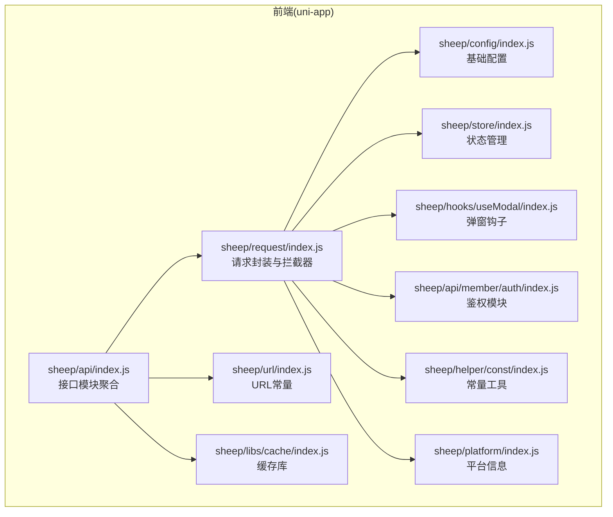
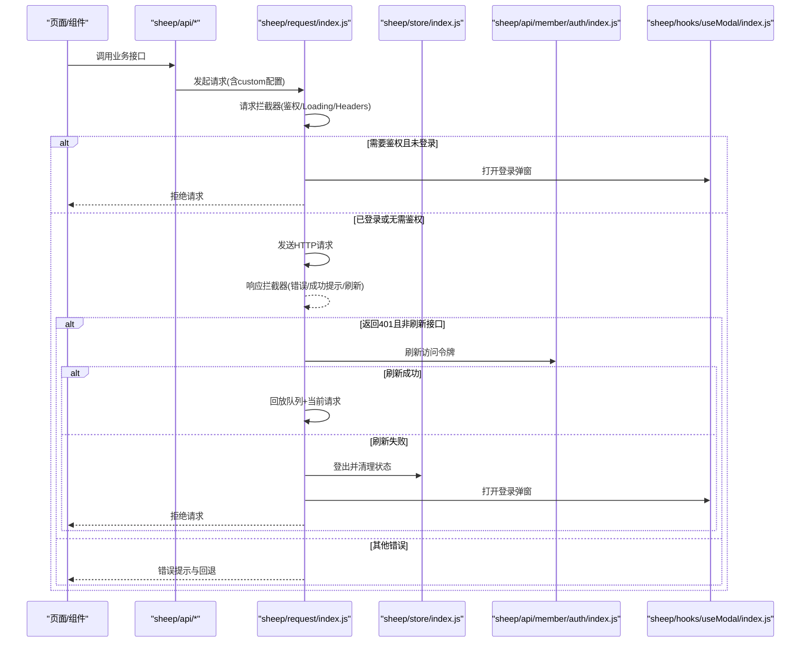
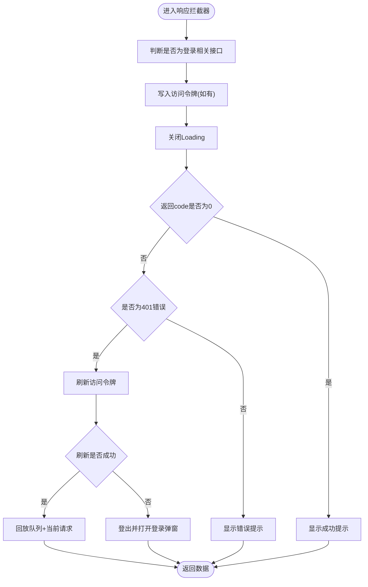
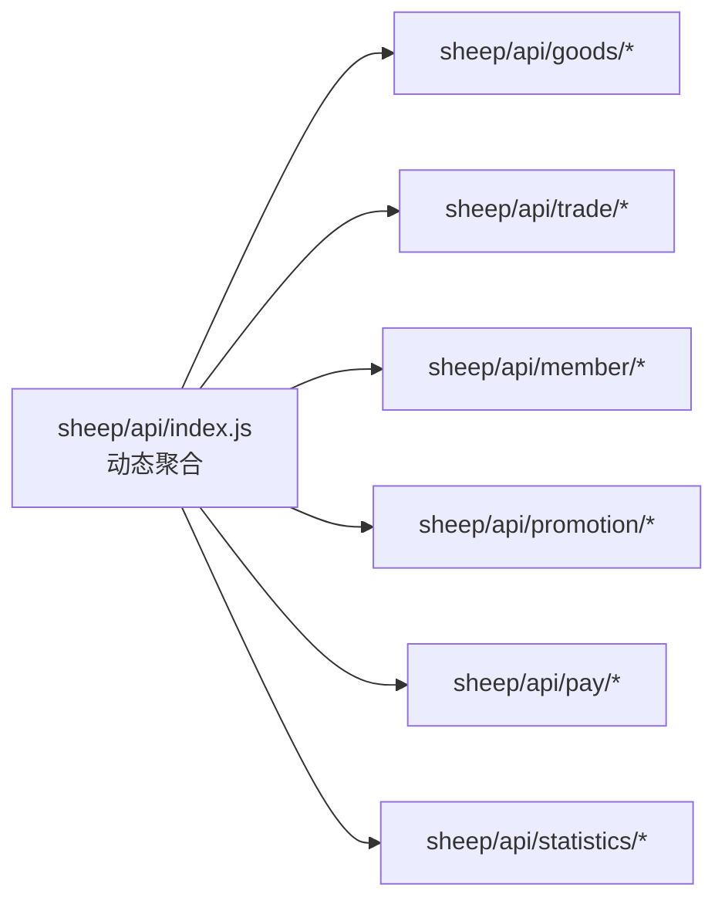
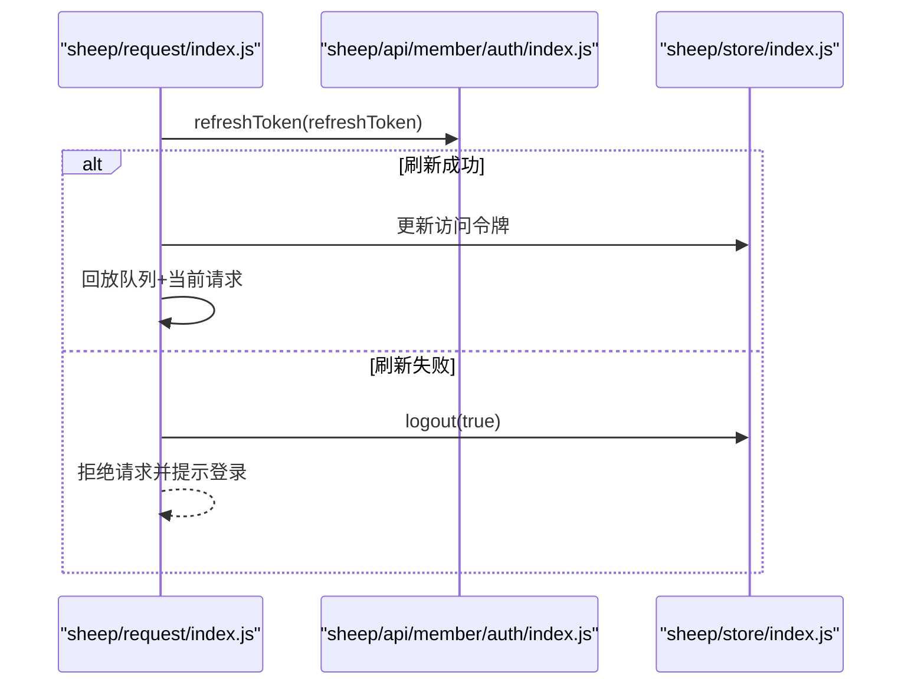
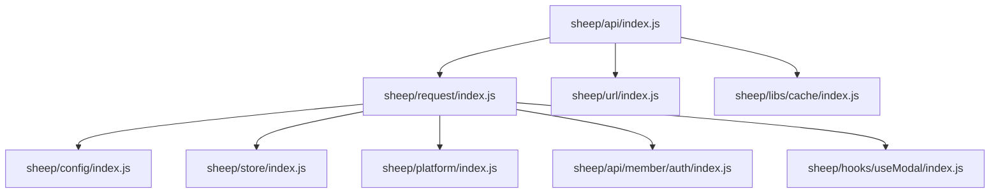

# API接口集成

<cite>
**本文引用的文件**
- [sheep/request/index.js](file://frontend/mall-uniapp/sheep/request/index.js)
- [sheep/api/index.js](file://frontend/mall-uniapp/sheep/api/index.js)
- [sheep/config/index.js](file://frontend/mall-uniapp/sheep/config/index.js)
- [sheep/store/index.js](file://frontend/mall-uniapp/sheep/store/index.js)
- [sheep/hooks/useModal/index.js](file://frontend/mall-uniapp/sheep/hooks/useModal/index.js)
- [sheep/api/member/auth/index.js](file://frontend/mall-uniapp/sheep/api/member/auth/index.js)
- [sheep/helper/const/index.js](file://frontend/mall-uniapp/sheep/helper/const/index.js)
- [sheep/platform/index.js](file://frontend/mall-uniapp/sheep/platform/index.js)
- [sheep/url/index.js](file://frontend/mall-uniapp/sheep/url/index.js)
- [sheep/libs/cache/index.js](file://frontend/mall-uniapp/sheep/libs/cache/index.js)
</cite>

## 目录
1. [简介](#简介)
2. [项目结构](#项目结构)
3. [核心组件](#核心组件)
4. [架构总览](#架构总览)
5. [详细组件分析](#详细组件分析)
6. [依赖关系分析](#依赖关系分析)
7. [性能考量](#性能考量)
8. [故障排查指南](#故障排查指南)
9. [结论](#结论)
10. [附录](#附录)

## 简介
本技术文档面向AgenticCPS商城前端的API接口集成，围绕请求封装设计模式（axios/luch-request配置、拦截器、错误处理、超时控制）、接口模块化组织（产品/交易/会员API分类管理）、数据请求实现（GET/POST、参数传递、响应处理、数据转换）、鉴权机制（Token管理、权限验证、自动刷新、登出处理）、以及缓存策略（缓存配置、失效与更新），为开发者提供完整的集成指南与常见问题解决方案。

## 项目结构
本项目采用多端统一的前端工程（uni-app），商城端位于frontend/mall-uniapp，核心API封装位于sheep/request，接口模块通过sheep/api按功能域聚合，配置与环境变量位于sheep/config，状态管理位于sheep/store，鉴权与平台能力位于sheep/api/member/auth与sheep/platform等。

图示来源
- [sheep/request/index.js:1-311](file://frontend/mall-uniapp/sheep/request/index.js#L1-L311)
- [sheep/api/index.js:1-12](file://frontend/mall-uniapp/sheep/api/index.js#L1-L12)
- [sheep/config/index.js](file://frontend/mall-uniapp/sheep/config/index.js)
- [sheep/store/index.js](file://frontend/mall-uniapp/sheep/store/index.js)
- [sheep/hooks/useModal/index.js](file://frontend/mall-uniapp/sheep/hooks/useModal/index.js)
- [sheep/api/member/auth/index.js](file://frontend/mall-uniapp/sheep/api/member/auth/index.js)
- [sheep/helper/const/index.js](file://frontend/mall-uniapp/sheep/helper/const/index.js)
- [sheep/platform/index.js](file://frontend/mall-uniapp/sheep/platform/index.js)
- [sheep/url/index.js](file://frontend/mall-uniapp/sheep/url/index.js)
- [sheep/libs/cache/index.js](file://frontend/mall-uniapp/sheep/libs/cache/index.js)

章节来源
- [sheep/request/index.js:1-311](file://frontend/mall-uniapp/sheep/request/index.js#L1-L311)
- [sheep/api/index.js:1-12](file://frontend/mall-uniapp/sheep/api/index.js#L1-L12)

## 核心组件
- 请求封装与拦截器：基于luch-request，统一配置baseURL、超时、请求头、跨端差异、请求/响应拦截、错误处理与自动刷新。
- 接口模块聚合：通过动态导入聚合各业务API模块，便于按功能域管理与扩展。
- 配置中心：集中管理基础URL、API路径、默认租户ID等。
- 状态管理：统一存储用户登录态、Token、租户信息等。
- 鉴权模块：提供登录、刷新Token、登出等能力。
- 平台与常量：注入终端类型、平台名称等请求头信息。
- 缓存库：提供可选的本地缓存策略与失效控制。

章节来源
- [sheep/request/index.js:47-107](file://frontend/mall-uniapp/sheep/request/index.js#L47-L107)
- [sheep/api/index.js:1-12](file://frontend/mall-uniapp/sheep/api/index.js#L1-L12)
- [sheep/config/index.js](file://frontend/mall-uniapp/sheep/config/index.js)
- [sheep/store/index.js](file://frontend/mall-uniapp/sheep/store/index.js)
- [sheep/api/member/auth/index.js](file://frontend/mall-uniapp/sheep/api/member/auth/index.js)
- [sheep/platform/index.js](file://frontend/mall-uniapp/sheep/platform/index.js)
- [sheep/helper/const/index.js](file://frontend/mall-uniapp/sheep/helper/const/index.js)
- [sheep/libs/cache/index.js](file://frontend/mall-uniapp/sheep/libs/cache/index.js)

## 架构总览
下图展示从页面调用到后端接口的整体流程，包括鉴权、拦截器、错误处理与自动刷新。

图示来源
- [sheep/request/index.js:72-220](file://frontend/mall-uniapp/sheep/request/index.js#L72-L220)
- [sheep/api/index.js:1-12](file://frontend/mall-uniapp/sheep/api/index.js#L1-L12)
- [sheep/store/index.js](file://frontend/mall-uniapp/sheep/store/index.js)
- [sheep/api/member/auth/index.js](file://frontend/mall-uniapp/sheep/api/member/auth/index.js)
- [sheep/hooks/useModal/index.js](file://frontend/mall-uniapp/sheep/hooks/useModal/index.js)

## 详细组件分析

### 请求封装与拦截器
- 基础配置
  - 基础URL与API路径来自配置中心，支持多端差异化（如APP-PLUS与H5）。
  - 默认超时8秒，统一Content-Type与Accept头，注入平台名、终端、租户ID。
- 请求拦截器
  - 鉴权控制：当接口标记为需登录时，若未登录则弹出登录弹窗并拒绝请求。
  - Loading控制：按需显示/隐藏Loading，避免重复叠加。
  - Token注入：从本地存储读取访问令牌并附加到Authorization头；同时注入终端与租户信息。
- 响应拦截器
  - 登录相关接口识别：当URL包含特定路径且返回包含访问令牌时，自动写入用户状态。
  - 错误处理：对非0状态码进行统一提示；401错误触发无感刷新流程；特殊业务错误码做专门处理。
  - 成功提示：按需显示成功Toast。
- 自动刷新与登出
  - 使用请求队列避免并发刷新导致的重复请求。
  - 刷新失败时统一登出并打开登录弹窗，防止死循环。

图示来源
- [sheep/request/index.js:112-220](file://frontend/mall-uniapp/sheep/request/index.js#L112-L220)

章节来源
- [sheep/request/index.js:47-107](file://frontend/mall-uniapp/sheep/request/index.js#L47-L107)
- [sheep/request/index.js:112-220](file://frontend/mall-uniapp/sheep/request/index.js#L112-L220)
- [sheep/request/index.js:222-290](file://frontend/mall-uniapp/sheep/request/index.js#L222-L290)

### 接口模块组织（产品/交易/会员）
- 动态聚合：通过glob导入各业务模块，按文件名作为模块键聚合导出，便于统一管理和按需引入。
- URL常量：集中维护各接口的URL路径，便于统一变更与复用。
- 分层管理：按功能域拆分（如商品、订单、会员），避免接口混杂，提升可维护性。

图示来源
- [sheep/api/index.js:1-12](file://frontend/mall-uniapp/sheep/api/index.js#L1-L12)
- [sheep/url/index.js](file://frontend/mall-uniapp/sheep/url/index.js)

章节来源
- [sheep/api/index.js:1-12](file://frontend/mall-uniapp/sheep/api/index.js#L1-L12)
- [sheep/url/index.js](file://frontend/mall-uniapp/sheep/url/index.js)

### 数据请求实现（GET/POST、参数、响应、转换）
- 请求发起：通过统一的request函数，传入custom配置（是否显示Loading、是否需要鉴权、是否携带Token、成功/失败提示文案等）。
- 参数传递：GET查询参数与POST请求体由调用方组装，拦截器负责注入通用头与Token。
- 响应处理：统一返回包含code/data/msg的数据结构；错误码非0时统一提示；401触发刷新。
- 数据转换：建议在具体API模块内部进行数据模型转换，保持请求层与业务层解耦。

章节来源
- [sheep/request/index.js:306-310](file://frontend/mall-uniapp/sheep/request/index.js#L306-L310)

### 接口鉴权机制（Token管理、权限验证、自动刷新、登出）
- Token管理
  - 访问令牌与刷新令牌分别存储于本地存储，请求拦截器自动注入Authorization头。
  - 支持从配置中心读取默认租户ID，或从状态中读取当前租户。
- 权限验证
  - 接口可通过custom.auth开启鉴权保护；未登录时弹出登录弹窗并拒绝请求。
- 自动刷新
  - 401错误触发刷新流程：若刷新成功则回放队列与当前请求；若失败则登出并提示登录。
- 登出处理
  - 清理用户状态、关闭弹窗、提示登录。

图示来源
- [sheep/request/index.js:222-290](file://frontend/mall-uniapp/sheep/request/index.js#L222-L290)
- [sheep/api/member/auth/index.js](file://frontend/mall-uniapp/sheep/api/member/auth/index.js)

章节来源
- [sheep/request/index.js:291-304](file://frontend/mall-uniapp/sheep/request/index.js#L291-L304)
- [sheep/request/index.js:222-290](file://frontend/mall-uniapp/sheep/request/index.js#L222-L290)
- [sheep/store/index.js](file://frontend/mall-uniapp/sheep/store/index.js)

### 接口缓存策略（配置、失效、更新）
- 缓存库：提供可选的本地缓存能力，建议结合业务场景设置TTL与Key规则。
- 失效机制：针对列表类接口可按条件失效（如切换筛选条件、切换租户）。
- 更新策略：写操作后主动失效或更新对应缓存Key，保证一致性。

章节来源
- [sheep/libs/cache/index.js](file://frontend/mall-uniapp/sheep/libs/cache/index.js)

## 依赖关系分析
- 请求层依赖配置中心、状态管理、平台信息、鉴权模块与弹窗钩子。
- 接口模块依赖请求层与URL常量，部分接口可能依赖缓存库。
- 鉴权模块被请求拦截器调用，用于刷新令牌与登出。

图示来源
- [sheep/request/index.js:6-12](file://frontend/mall-uniapp/sheep/request/index.js#L6-L12)
- [sheep/api/index.js:1-12](file://frontend/mall-uniapp/sheep/api/index.js#L1-L12)
- [sheep/config/index.js](file://frontend/mall-uniapp/sheep/config/index.js)
- [sheep/store/index.js](file://frontend/mall-uniapp/sheep/store/index.js)
- [sheep/platform/index.js](file://frontend/mall-uniapp/sheep/platform/index.js)
- [sheep/hooks/useModal/index.js](file://frontend/mall-uniapp/sheep/hooks/useModal/index.js)
- [sheep/api/member/auth/index.js](file://frontend/mall-uniapp/sheep/api/member/auth/index.js)
- [sheep/url/index.js](file://frontend/mall-uniapp/sheep/url/index.js)
- [sheep/libs/cache/index.js](file://frontend/mall-uniapp/sheep/libs/cache/index.js)

## 性能考量
- 请求合并与节流：对高频接口（如搜索、滚动加载）建议在调用层做防抖/节流，减少不必要的请求。
- 缓存命中率：合理设置缓存Key与TTL，优先使用局部缓存，避免全量刷新。
- Loading优化：避免同时多个Loading叠加，必要时使用骨架屏或占位符。
- 超时与重试：根据接口特性调整超时时间，对弱网环境增加指数退避重试策略（需在调用层实现）。

## 故障排查指南
- 401未登录/过期
  - 现象：接口返回401或提示登录过期。
  - 处理：确认刷新令牌是否存在；检查刷新流程是否成功；若失败则登出并引导登录。
- 跨域与证书
  - 现象：H5环境下网络异常或证书校验失败。
  - 处理：根据平台配置调整withCredentials与sslVerify；确保域名与证书正确。
- 超时与频繁请求
  - 现象：请求超时或触发限流提示。
  - 处理：优化接口参数与分页；在调用层增加防抖与重试；必要时降低并发。
- 本地存储异常
  - 现象：Token缺失或读取失败。
  - 处理：检查本地存储可用性；在关键位置增加兜底逻辑与错误提示。

章节来源
- [sheep/request/index.js:156-220](file://frontend/mall-uniapp/sheep/request/index.js#L156-L220)
- [sheep/request/index.js:222-290](file://frontend/mall-uniapp/sheep/request/index.js#L222-L290)

## 结论
本方案以sheep/request为核心，结合配置中心、状态管理、鉴权模块与弹窗钩子，构建了统一、可扩展、具备自动刷新与错误兜底能力的API集成体系。通过模块化组织与可选缓存策略，能够满足商城端复杂业务场景下的高性能与高可用需求。

## 附录
- 快速集成步骤
  - 在sheep/api下新增业务模块，导出接口方法并使用统一的request函数。
  - 对需要登录的接口，在调用处设置custom.auth为true。
  - 对需要Loading与提示的接口，设置custom.showLoading与custom.showSuccess/custom.errorMsg。
  - 对列表类接口，结合sheep/libs/cache/index.js进行缓存与失效控制。
- 最佳实践
  - 将URL常量集中在sheep/url/index.js，便于统一维护。
  - 在拦截器中避免做业务逻辑，保持职责单一。
  - 对敏感操作增加二次确认与错误回滚。