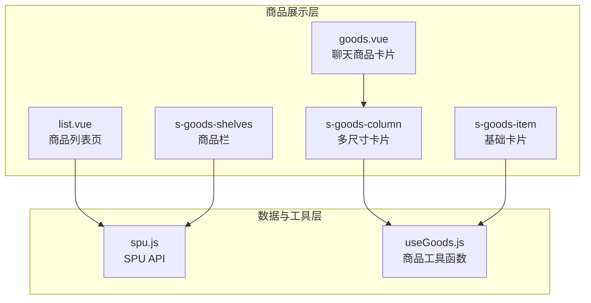
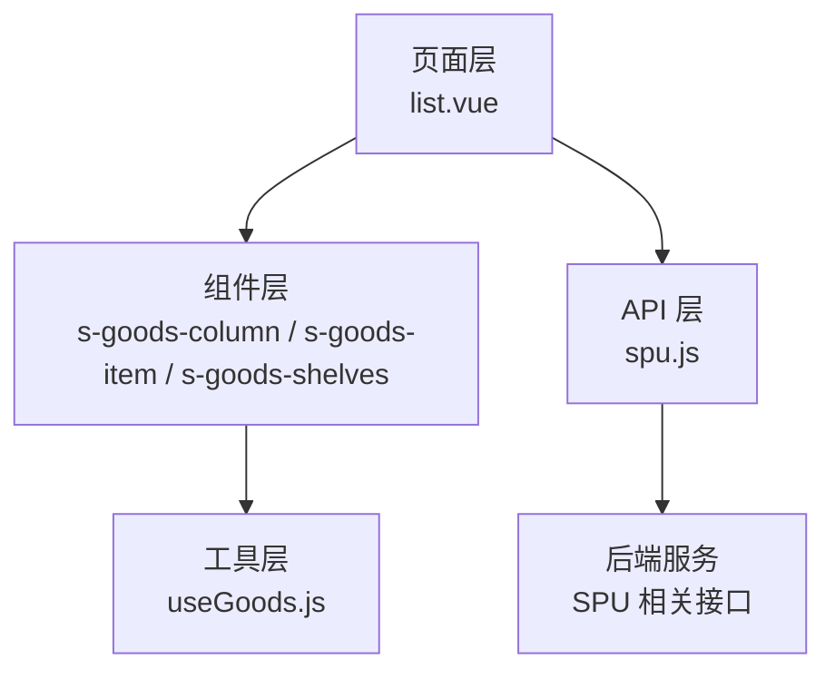
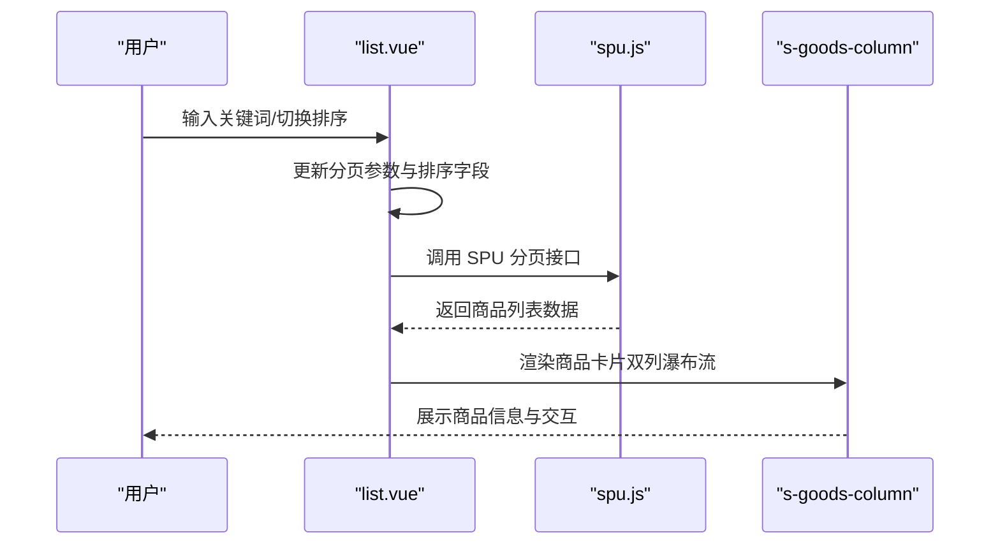
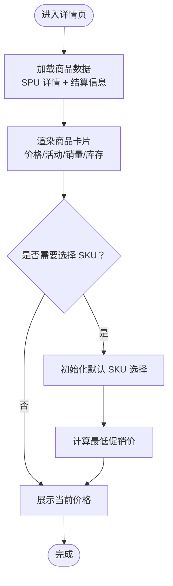
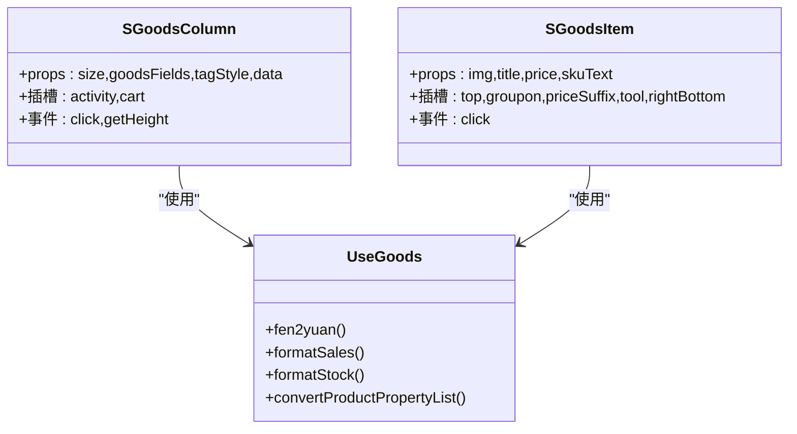
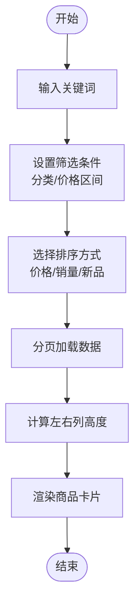
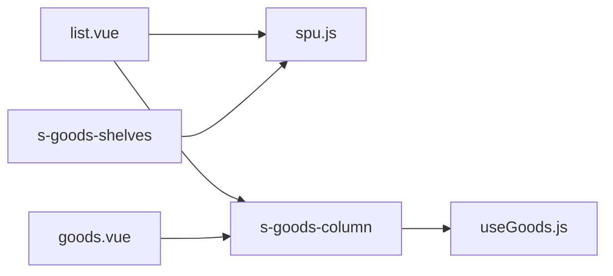

# 商品管理与展示

<cite>
**本文引用的文件**
- [s-goods-item.vue](file://frontend/mall-uniapp/sheep/components/s-goods-item/s-goods-item.vue)
- [s-goods-column.vue](file://frontend/mall-uniapp/sheep/components/s-goods-column/s-goods-column.vue)
- [s-goods-shelves.vue](file://frontend/mall-uniapp/sheep/components/s-goods-shelves/s-goods-shelves.vue)
- [spu.js](file://frontend/mall-uniapp/sheep/api/product/spu.js)
- [useGoods.js](file://frontend/mall-uniapp/sheep/hooks/useGoods.js)
- [list.vue](file://frontend/mall-uniapp/pages/goods/list.vue)
- [goods.vue](file://frontend/mall-uniapp/pages/chat/components/goods.vue)
</cite>

## 目录
1. [简介](#简介)
2. [项目结构](#项目结构)
3. [核心组件](#核心组件)
4. [架构总览](#架构总览)
5. [详细组件分析](#详细组件分析)
6. [依赖关系分析](#依赖关系分析)
7. [性能考量](#性能考量)
8. [故障排查指南](#故障排查指南)
9. [结论](#结论)
10. [附录](#附录)

## 简介
本技术文档面向 AgenticCPS 商城的商品管理与展示系统，聚焦于商品列表页、商品详情页、商品卡片组件以及搜索与筛选能力。文档从前端实现角度出发，梳理了商品数据获取、分页加载、筛选排序、SKU 选择、价格计算与库存管理等关键流程，并给出商品数据缓存策略、图片优化方案与用户体验优化建议，帮助开发者高效完成商品相关页面的开发与维护。

## 项目结构
围绕商品展示与管理，前端采用组件化架构，主要涉及以下模块：
- 商品卡片组件：统一的商品信息展示与交互入口，支持多种尺寸与布局。
- 商品货架组件：用于在装修场景中按布局类型渲染商品栏。
- 商品 API：封装 SPu 分页查询、详情获取、结算信息等接口。
- 商品 Hooks：提供价格格式化、销量/库存格式化、SKU 属性转换等通用逻辑。
- 商品列表页：负责关键词搜索、分类筛选、价格区间、销量排序与瀑布流双列布局。
- 商品聊天组件：在对话场景中以简洁卡片形式展示商品信息。

图表来源
- [s-goods-item.vue:1-190](file://frontend/mall-uniapp/sheep/components/s-goods-item/s-goods-item.vue#L1-L190)
- [s-goods-column.vue:1-464](file://frontend/mall-uniapp/sheep/components/s-goods-column/s-goods-column.vue#L1-L464)
- [s-goods-shelves.vue:1-148](file://frontend/mall-uniapp/sheep/components/s-goods-shelves/s-goods-shelves.vue#L1-L148)
- [spu.js:1-54](file://frontend/mall-uniapp/sheep/api/product/spu.js#L1-L54)
- [useGoods.js:1-515](file://frontend/mall-uniapp/sheep/hooks/useGoods.js#L1-L515)
- [list.vue:124-269](file://frontend/mall-uniapp/pages/goods/list.vue#L124-L269)
- [goods.vue:1-21](file://frontend/mall-uniapp/pages/chat/components/goods.vue#L1-L21)

章节来源
- [s-goods-item.vue:1-190](file://frontend/mall-uniapp/sheep/components/s-goods-item/s-goods-item.vue#L1-L190)
- [s-goods-column.vue:1-464](file://frontend/mall-uniapp/sheep/components/s-goods-column/s-goods-column.vue#L1-L464)
- [s-goods-shelves.vue:1-148](file://frontend/mall-uniapp/sheep/components/s-goods-shelves/s-goods-shelves.vue#L1-L148)
- [spu.js:1-54](file://frontend/mall-uniapp/sheep/api/product/spu.js#L1-L54)
- [useGoods.js:1-515](file://frontend/mall-uniapp/sheep/hooks/useGoods.js#L1-L515)
- [list.vue:124-269](file://frontend/mall-uniapp/pages/goods/list.vue#L124-L269)
- [goods.vue:1-21](file://frontend/mall-uniapp/pages/chat/components/goods.vue#L1-L21)

## 核心组件
- 商品卡片组件（s-goods-item）
  - 提供基础的商品信息展示区域，包含图片、标题、SKU 描述、价格与数量等。
  - 支持自定义价格颜色、圆角、间距等样式属性。
  - 使用价格格式化工具将分转为元，支持积分价格显示。
- 商品卡片组件（s-goods-column）
  - 支持 xs/sm/md/lg/sl 多种尺寸，适配不同布局场景。
  - 展示促销标签、活动信息、价格与原价、销量与库存等。
  - 提供点击事件回调，便于跳转至商品详情页。
- 商品货架组件（s-goods-shelves）
  - 根据布局类型渲染两列、三列或水平滚动的商品栏。
  - 通过 SPU ID 列表批量拉取商品数据并渲染卡片。
- 商品 API（spu.js）
  - 提供 SPU 列表分页、详情、结算信息等接口调用方法。
  - 默认关闭加载提示与错误提示，避免频繁弹窗影响体验。
- 商品 Hooks（useGoods.js）
  - 提供价格格式化、销量/库存格式化、SKU 属性转换、满减送规则描述等工具函数。
  - 提供将分转为元的通用方法，支持简化小数点处理。
- 商品列表页（list.vue）
  - 实现关键词搜索、分类筛选、价格区间、销量排序等筛选与排序逻辑。
  - 支持瀑布流双列布局，自动计算左右列高度并分配商品。
  - 通过分页加载商品数据，支持综合推荐、价格升序/降序、销量、新品优先等排序方式。
- 聊天商品卡片（goods.vue）
  - 在聊天场景中以简洁卡片展示商品名称、图片、价格与简介。
  - 基于商品卡片组件进行二次封装，满足轻量展示需求。

章节来源
- [s-goods-item.vue:54-121](file://frontend/mall-uniapp/sheep/components/s-goods-item/s-goods-item.vue#L54-L121)
- [s-goods-column.vue:466-703](file://frontend/mall-uniapp/sheep/components/s-goods-column/s-goods-column.vue#L466-L703)
- [s-goods-shelves.vue:91-118](file://frontend/mall-uniapp/sheep/components/s-goods-shelves/s-goods-shelves.vue#L91-L118)
- [spu.js:3-51](file://frontend/mall-uniapp/sheep/api/product/spu.js#L3-L51)
- [useGoods.js:63-91](file://frontend/mall-uniapp/sheep/hooks/useGoods.js#L63-L91)
- [list.vue:133-269](file://frontend/mall-uniapp/pages/goods/list.vue#L133-L269)
- [goods.vue:12-20](file://frontend/mall-uniapp/pages/chat/components/goods.vue#L12-L20)

## 架构总览
商品管理与展示系统的前端架构由“页面层-组件层-API 层-工具层”构成，页面层负责业务编排与交互，组件层负责可复用的 UI 与行为，API 层负责数据访问，工具层提供通用的数据处理与格式化能力。

图表来源
- [list.vue:124-269](file://frontend/mall-uniapp/pages/goods/list.vue#L124-L269)
- [s-goods-column.vue:466-703](file://frontend/mall-uniapp/sheep/components/s-goods-column/s-goods-column.vue#L466-L703)
- [s-goods-item.vue:54-121](file://frontend/mall-uniapp/sheep/components/s-goods-item/s-goods-item.vue#L54-L121)
- [s-goods-shelves.vue:91-118](file://frontend/mall-uniapp/sheep/components/s-goods-shelves/s-goods-shelves.vue#L91-L118)
- [spu.js:3-51](file://frontend/mall-uniapp/sheep/api/product/spu.js#L3-L51)
- [useGoods.js:1-515](file://frontend/mall-uniapp/sheep/hooks/useGoods.js#L1-L515)

## 详细组件分析

### 商品列表页（list.vue）
- 数据获取与分页
  - 通过 SPU 分页接口获取商品列表，支持关键词搜索与分类筛选。
  - 分页参数包含页码与每页条数，结合瀑布流双列布局进行渲染。
- 筛选与排序
  - 支持综合推荐、价格升序/降序、销量、新品优先等排序方式。
  - 点击筛选项时更新当前排序字段与顺序，并清空列表重新加载。
- 用户交互
  - 提供搜索框输入监听，触发关键词搜索并重置分页。
  - 支持展开/收起筛选面板，避免频繁刷新数据。

图表来源
- [list.vue:133-269](file://frontend/mall-uniapp/pages/goods/list.vue#L133-L269)
- [spu.js:28-39](file://frontend/mall-uniapp/sheep/api/product/spu.js#L28-L39)
- [s-goods-column.vue:466-703](file://frontend/mall-uniapp/sheep/components/s-goods-column/s-goods-column.vue#L466-L703)

章节来源
- [list.vue:133-269](file://frontend/mall-uniapp/pages/goods/list.vue#L133-L269)
- [spu.js:28-39](file://frontend/mall-uniapp/sheep/api/product/spu.js#L28-L39)

### 商品详情页设计要点
- 商品信息展示
  - 使用商品卡片组件展示标题、副标题、活动标签、价格与原价、销量与库存等。
  - 支持促销类型与活动规则描述，提升信息透明度。
- SKU 选择与价格计算
  - 通过 SKU 属性转换工具生成属性列表，支持默认选中与联动选择。
  - 价格计算基于最低促销价，结合满减送活动规则进行展示。
- 库存管理
  - 库存与销量展示支持精确值与近似值两种模式，提升可读性。
  - 积分类活动的库存与兑换量使用专门的格式化方法。

图表来源
- [useGoods.js:377-429](file://frontend/mall-uniapp/sheep/hooks/useGoods.js#L377-L429)
- [useGoods.js:502-514](file://frontend/mall-uniapp/sheep/hooks/useGoods.js#L502-L514)
- [s-goods-column.vue:466-703](file://frontend/mall-uniapp/sheep/components/s-goods-column/s-goods-column.vue#L466-L703)

章节来源
- [useGoods.js:377-429](file://frontend/mall-uniapp/sheep/hooks/useGoods.js#L377-L429)
- [useGoods.js:502-514](file://frontend/mall-uniapp/sheep/hooks/useGoods.js#L502-L514)
- [s-goods-column.vue:466-703](file://frontend/mall-uniapp/sheep/components/s-goods-column/s-goods-column.vue#L466-L703)

### 商品卡片组件（s-goods-item 与 s-goods-column）
- 设计模式
  - Props 驱动：通过 props 控制图片、标题、价格、SKU 文案、样式等。
  - 插槽扩展：提供多个插槽（如价格后缀、工具区、右侧底部）以增强可定制性。
  - 事件回调：提供点击事件，便于导航至详情页或执行其他操作。
- 图片懒加载与优化
  - 使用 CDN 地址与固定宽高模式，减少布局抖动。
  - 建议在实际项目中结合平台能力启用图片懒加载与占位图。
- 价格显示与促销标识
  - 支持积分价格与普通价格混合显示，原价采用删除线样式。
  - 促销类型与活动规则通过工具函数生成描述文本，提升可读性。
- 购买按钮
  - 提供购买按钮插槽，便于在不同场景下插入“加入购物车”、“立即购买”等操作。

图表来源
- [s-goods-item.vue:54-121](file://frontend/mall-uniapp/sheep/components/s-goods-item/s-goods-item.vue#L54-L121)
- [s-goods-column.vue:466-703](file://frontend/mall-uniapp/sheep/components/s-goods-column/s-goods-column.vue#L466-L703)
- [useGoods.js:63-91](file://frontend/mall-uniapp/sheep/hooks/useGoods.js#L63-L91)

章节来源
- [s-goods-item.vue:54-121](file://frontend/mall-uniapp/sheep/components/s-goods-item/s-goods-item.vue#L54-L121)
- [s-goods-column.vue:466-703](file://frontend/mall-uniapp/sheep/components/s-goods-column/s-goods-column.vue#L466-L703)
- [useGoods.js:63-91](file://frontend/mall-uniapp/sheep/hooks/useGoods.js#L63-L91)

### 商品搜索与筛选实现指南
- 关键词搜索
  - 监听搜索框输入，更新关键词并清空列表后重新加载。
- 分类筛选
  - 通过分类 ID 作为筛选条件参与分页请求。
- 价格区间与销量排序
  - 价格升序/降序、销量排序等通过排序字段与方向控制。
- 瀑布流双列布局
  - 通过累计左右列高度，动态分配下一个商品至较短的一侧，提升视觉均衡性。

图表来源
- [list.vue:133-269](file://frontend/mall-uniapp/pages/goods/list.vue#L133-L269)

章节来源
- [list.vue:133-269](file://frontend/mall-uniapp/pages/goods/list.vue#L133-L269)

## 依赖关系分析
- 组件与工具层
  - 商品卡片组件依赖商品 Hooks 提供的价格与格式化能力。
- 页面与组件/API
  - 商品列表页通过 API 层调用 SPU 接口，再将数据传递给商品卡片组件渲染。
- 装修场景与列表页
  - 商品货架组件在装修场景中批量渲染商品，逻辑与列表页一致但布局不同。

图表来源
- [list.vue:124-269](file://frontend/mall-uniapp/pages/goods/list.vue#L124-L269)
- [spu.js:3-51](file://frontend/mall-uniapp/sheep/api/product/spu.js#L3-L51)
- [s-goods-column.vue:466-703](file://frontend/mall-uniapp/sheep/components/s-goods-column/s-goods-column.vue#L466-L703)
- [s-goods-shelves.vue:91-118](file://frontend/mall-uniapp/sheep/components/s-goods-shelves/s-goods-shelves.vue#L91-L118)
- [goods.vue:12-20](file://frontend/mall-uniapp/pages/chat/components/goods.vue#L12-L20)

章节来源
- [list.vue:124-269](file://frontend/mall-uniapp/pages/goods/list.vue#L124-L269)
- [spu.js:3-51](file://frontend/mall-uniapp/sheep/api/product/spu.js#L3-L51)
- [s-goods-column.vue:466-703](file://frontend/mall-uniapp/sheep/components/s-goods-column/s-goods-column.vue#L466-L703)
- [s-goods-shelves.vue:91-118](file://frontend/mall-uniapp/sheep/components/s-goods-shelves/s-goods-shelves.vue#L91-L118)
- [goods.vue:12-20](file://frontend/mall-uniapp/pages/chat/components/goods.vue#L12-L20)

## 性能考量
- 数据缓存策略
  - 列表页分页加载时，建议对当前页数据进行本地缓存，避免重复请求。
  - 对于热门商品或频繁访问的分类，可引入内存缓存与持久化缓存相结合的方式。
- 图片优化方案
  - 使用 CDN 地址与固定宽高模式，减少布局抖动。
  - 建议启用图片懒加载与占位图，降低首屏阻塞。
  - 对大图采用 WebP 或 AVIF 格式，必要时提供多分辨率资源。
- 用户交互体验优化
  - 瀑布流双列布局需在渲染完成后计算高度，避免闪烁。
  - 排序与筛选变更时，应先清空列表再加载，避免旧数据干扰。
  - 提供加载状态与空状态提示，改善弱网环境下的体验。

## 故障排查指南
- 列表无数据或加载异常
  - 检查分页参数与筛选条件是否正确传入接口。
  - 确认接口返回的数据结构与组件期望一致。
- 商品卡片显示异常
  - 检查图片地址是否可用，确认 CDN 配置正确。
  - 核对价格格式化方法与数据单位（分/元）是否匹配。
- 排序与筛选无效
  - 确认排序字段与方向是否正确设置，避免与默认值冲突。
  - 检查筛选项点击逻辑，确保清空列表后再加载。
- 瀑布流布局错乱
  - 确保每个商品卡片的高度计算准确，避免负高度导致分配错误。
  - 检查左右列高度累加逻辑，防止越界或重复分配。

章节来源
- [list.vue:133-269](file://frontend/mall-uniapp/pages/goods/list.vue#L133-L269)
- [spu.js:28-39](file://frontend/mall-uniapp/sheep/api/product/spu.js#L28-L39)
- [s-goods-column.vue:698-702](file://frontend/mall-uniapp/sheep/components/s-goods-column/s-goods-column.vue#L698-L702)

## 结论
本文档从组件、页面、API 与工具四个层面梳理了 AgenticCPS 商城的商品管理与展示体系，重点覆盖了商品列表页的数据获取与瀑布流布局、筛选排序、商品详情页的 SKU 选择与价格计算、商品卡片组件的设计模式与扩展点，以及搜索与缓存优化策略。开发者可据此快速搭建稳定、高性能且具有良好用户体验的商品相关页面。

## 附录
- 开发建议
  - 统一使用商品 Hooks 中的价格与格式化方法，保证展示一致性。
  - 在装修场景中优先使用商品货架组件，减少重复开发。
  - 对高频访问的商品数据引入缓存策略，结合懒加载与占位图优化首屏性能。
- 参考路径
  - 商品列表页：[list.vue:124-269](file://frontend/mall-uniapp/pages/goods/list.vue#L124-L269)
  - 商品卡片组件：[s-goods-column.vue:1-464](file://frontend/mall-uniapp/sheep/components/s-goods-column/s-goods-column.vue#L1-L464)
  - 基础卡片组件：[s-goods-item.vue:1-190](file://frontend/mall-uniapp/sheep/components/s-goods-item/s-goods-item.vue#L1-L190)
  - 商品货架组件：[s-goods-shelves.vue:1-148](file://frontend/mall-uniapp/sheep/components/s-goods-shelves/s-goods-shelves.vue#L1-L148)
  - 商品 API：[spu.js:1-54](file://frontend/mall-uniapp/sheep/api/product/spu.js#L1-L54)
  - 商品工具函数：[useGoods.js:1-515](file://frontend/mall-uniapp/sheep/hooks/useGoods.js#L1-L515)
  - 聊天商品卡片：[goods.vue:1-21](file://frontend/mall-uniapp/pages/chat/components/goods.vue#L1-L21)