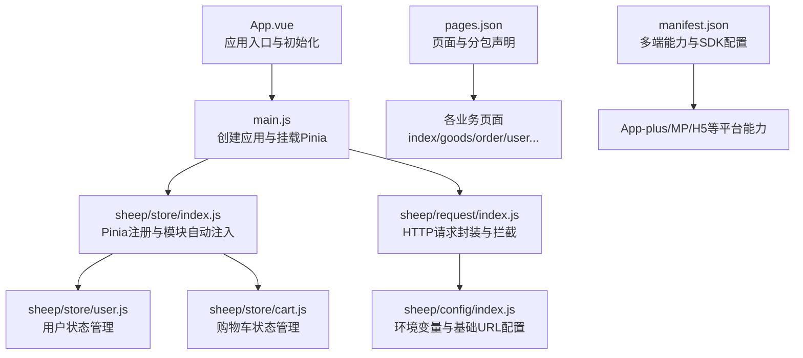
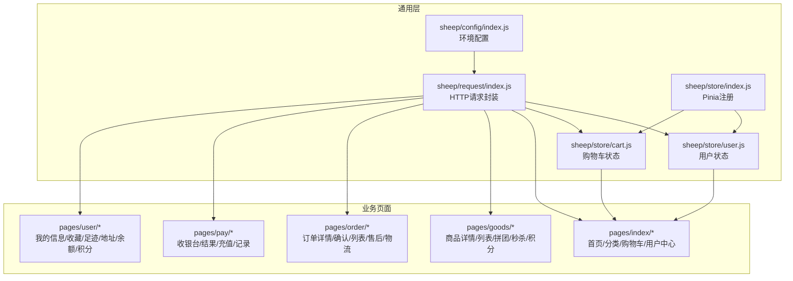
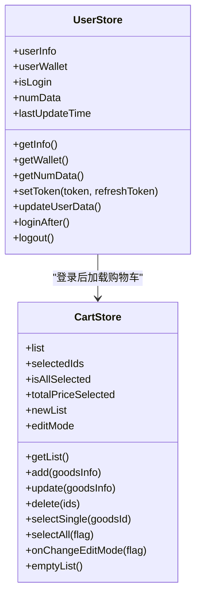
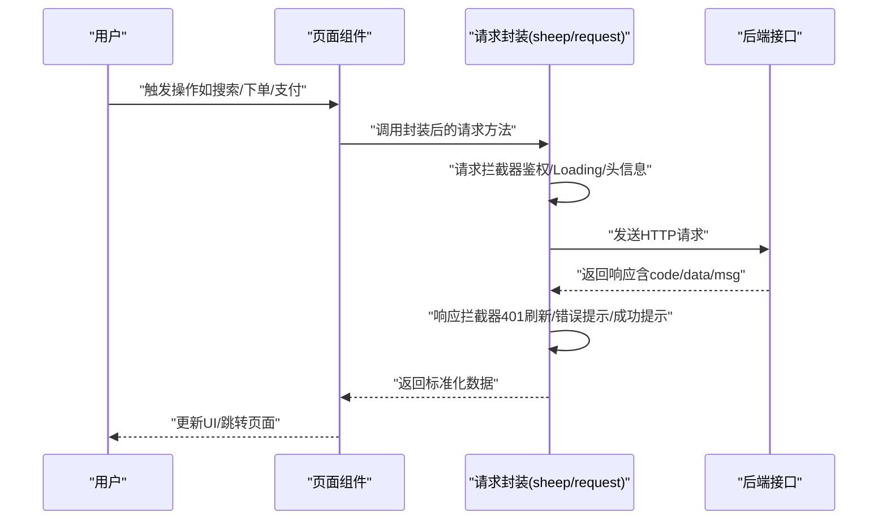
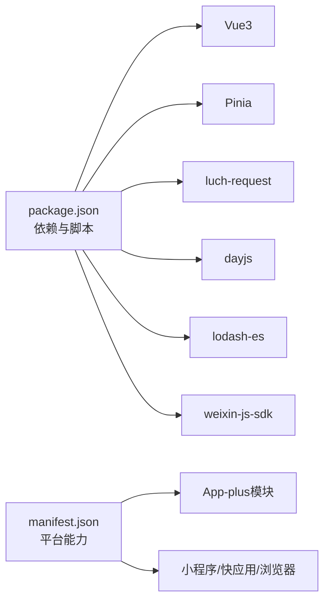

# 商城前端UniApp系统

<cite>
**本文引用的文件**
- [App.vue](file://frontend/mall-uniapp/App.vue)
- [main.js](file://frontend/mall-uniapp/main.js)
- [pages.json](file://frontend/mall-uniapp/pages.json)
- [manifest.json](file://frontend/mall-uniapp/manifest.json)
- [sheep/config/index.js](file://frontend/mall-uniapp/sheep/config/index.js)
- [sheep/request/index.js](file://frontend/mall-uniapp/sheep/request/index.js)
- [sheep/store/index.js](file://frontend/mall-uniapp/sheep/store/index.js)
- [sheep/store/user.js](file://frontend/mall-uniapp/sheep/store/user.js)
- [sheep/store/cart.js](file://frontend/mall-uniapp/sheep/store/cart.js)
- [package.json](file://frontend/mall-uniapp/package.json)
</cite>

## 目录
1. [简介](#简介)
2. [项目结构](#项目结构)
3. [核心组件](#核心组件)
4. [架构总览](#架构总览)
5. [详细组件分析](#详细组件分析)
6. [依赖关系分析](#依赖关系分析)
7. [性能考虑](#性能考虑)
8. [故障排查指南](#故障排查指南)
9. [结论](#结论)
10. [附录](#附录)

## 简介
本文件面向AgenticCPS商城前端UniApp系统，围绕基于UniApp的电商前端架构进行系统化技术文档整理，覆盖首页设计、商品列表/详情、购物车、订单处理、用户中心等核心业务模块；阐述移动端UI组件设计思路（商品卡片、轮播图、分类导航、搜索）、状态管理在电商场景的应用（商品数据、购物车、用户信息）、API接口集成（搜索、下单、支付、订单查询）、性能优化策略（图片懒加载、数据缓存、用户体验），并提供完整的开发实践指导。

## 项目结构
前端工程位于frontend/mall-uniapp，采用uni-app + Vue3 + Pinia的多端统一开发方案。项目通过pages.json声明页面与分包结构，manifest.json配置多端能力与SDK接入，sheep目录封装了配置、请求、状态管理、平台能力等通用层，便于跨端复用与扩展。

图表来源
- [App.vue:1-33](file://frontend/mall-uniapp/App.vue#L1-L33)
- [main.js:1-16](file://frontend/mall-uniapp/main.js#L1-L16)
- [sheep/store/index.js:1-21](file://frontend/mall-uniapp/sheep/store/index.js#L1-L21)
- [sheep/store/user.js:1-165](file://frontend/mall-uniapp/sheep/store/user.js#L1-L165)
- [sheep/store/cart.js:1-122](file://frontend/mall-uniapp/sheep/store/cart.js#L1-L122)
- [sheep/request/index.js:1-311](file://frontend/mall-uniapp/sheep/request/index.js#L1-L311)
- [sheep/config/index.js:1-32](file://frontend/mall-uniapp/sheep/config/index.js#L1-L32)
- [pages.json:1-704](file://frontend/mall-uniapp/pages.json#L1-L704)
- [manifest.json:1-225](file://frontend/mall-uniapp/manifest.json#L1-L225)

章节来源
- [pages.json:1-704](file://frontend/mall-uniapp/pages.json#L1-L704)
- [manifest.json:1-225](file://frontend/mall-uniapp/manifest.json#L1-L225)

## 核心组件
- 应用入口与初始化
  - App.vue负责应用生命周期钩子、隐藏原生TabBar、加载Shopro底层依赖，确保自定义导航与全局样式生效。
- 应用创建与状态注入
  - main.js创建SSR应用实例，调用setupPinia完成Pinia注册与持久化插件启用。
- 页面与分包
  - pages.json集中声明主包与多子包页面、标题、权限、下拉刷新等页面级元信息，支撑首页、商品、订单、用户中心、支付、活动等模块化组织。
- 多端能力与SDK
  - manifest.json声明App-plus模块、小程序/快应用/浏览器等平台能力与SDK配置（如支付、分享、OAuth、广告等），并设置方向锁定、隐私描述、Universal Links等。
- 配置中心
  - sheep/config/index.js从环境变量读取基础URL、API路径、静态资源、租户ID、WebSocket路径、H5地址等，支持开发与生产环境切换。
- 请求封装
  - sheep/request/index.js基于luch-request封装HTTP客户端，统一拦截器、鉴权头、Loading控制、错误提示、401无感刷新令牌、租户与终端透传等。
- 状态管理
  - sheep/store/index.js自动扫描并注册store模块，sheep/store/user.js管理用户信息、钱包、数量统计与登录后流程，sheep/store/cart.js管理购物车列表、选择状态、编辑模式与价格计算。

章节来源
- [App.vue:1-33](file://frontend/mall-uniapp/App.vue#L1-L33)
- [main.js:1-16](file://frontend/mall-uniapp/main.js#L1-L16)
- [sheep/store/index.js:1-21](file://frontend/mall-uniapp/sheep/store/index.js#L1-L21)
- [sheep/store/user.js:1-165](file://frontend/mall-uniapp/sheep/store/user.js#L1-L165)
- [sheep/store/cart.js:1-122](file://frontend/mall-uniapp/sheep/store/cart.js#L1-L122)
- [sheep/request/index.js:1-311](file://frontend/mall-uniapp/sheep/request/index.js#L1-L311)
- [sheep/config/index.js:1-32](file://frontend/mall-uniapp/sheep/config/index.js#L1-L32)

## 架构总览
系统采用“通用层 + 业务页面”的分层架构：
- 通用层：sheep目录封装配置、请求、状态、平台能力、UI组件等，保证跨端一致性与可维护性。
- 业务页面：按模块拆分子包，减少首屏体积，提升加载效率。
- 状态管理：Pinia模块化管理用户、购物车等状态，结合持久化插件实现跨会话保留。
- API集成：统一请求封装对接后端接口，内置鉴权、错误处理与无感刷新令牌机制。

图表来源
- [sheep/config/index.js:1-32](file://frontend/mall-uniapp/sheep/config/index.js#L1-L32)
- [sheep/request/index.js:1-311](file://frontend/mall-uniapp/sheep/request/index.js#L1-L311)
- [sheep/store/index.js:1-21](file://frontend/mall-uniapp/sheep/store/index.js#L1-L21)
- [sheep/store/user.js:1-165](file://frontend/mall-uniapp/sheep/store/user.js#L1-L165)
- [sheep/store/cart.js:1-122](file://frontend/mall-uniapp/sheep/store/cart.js#L1-L122)
- [pages.json:1-704](file://frontend/mall-uniapp/pages.json#L1-L704)

## 详细组件分析

### 页面与路由架构
- 主包与子包
  - 主包包含首页、分类、购物车、用户中心、登录、搜索、自定义页面等。
  - 子包按业务域划分：商品（详情/列表/拼团/秒杀/积分/评价）、订单（详情/确认/列表/售后/物流）、用户中心（信息/收藏/足迹/地址/余额/积分）、支付（收银台/结果/充值/记录）、分销（中心/佣金/推广/订单/团队/排行榜/提现）、活动（拼团/秒杀/积分）、公共（设置/富文本/FAQ/错误/WebView）、聊天（客服）等。
- 页面元信息
  - 每个页面配置标题、是否启用下拉刷新、权限要求、分组等，便于统一管理与SEO/可访问性。
- TabBar
  - 自定义TabBar指向首页、分类、购物车、用户中心四个核心页面。

章节来源
- [pages.json:1-704](file://frontend/mall-uniapp/pages.json#L1-L704)

### 移动端UI组件设计
- 商品卡片
  - 用于商品列表与推荐位，承载图片、标题、价格、销量、标签等信息，支持点击进入详情页。
- 轮播图
  - 用于首页banner与活动入口，支持多图轮播与点击跳转。
- 分类导航
  - 顶部或侧边分类，支持一级/二级分类切换与搜索直达。
- 搜索功能
  - 顶部搜索栏，支持关键词输入、历史记录、热门词、搜索结果页跳转。
- 其他常用组件
  - 支持使用uni-ui生态组件（如列表、加载更多、导航栏、徽标、评分、步进器等）以提升交互一致性。

章节来源
- [pages.json:1-704](file://frontend/mall-uniapp/pages.json#L1-L704)

### 状态管理在电商场景的应用
- 用户状态（sheep/store/user.js）
  - 管理登录态、用户信息、钱包余额、订单与优惠券数量统计。
  - 登录后自动拉取用户信息、钱包、订单数量与未使用优惠券数；支持防抖更新（5秒内不重复刷新）。
  - 登录后加载购物车、设置全局分享参数、引导绑定手机号与推广员。
  - 登出时清空用户相关缓存与购物车。
- 购物车状态（sheep/store/cart.js）
  - 维护购物车列表、有效/无效项、选中集合、全选状态、选中总价、编辑模式。
  - 提供添加、更新、删除、单选、全选、清空等动作，并在每次变更后重新计算选中状态与价格。
  - 支持跨会话持久化，保障用户退出后再次进入仍可恢复购物车。

图表来源
- [sheep/store/user.js:1-165](file://frontend/mall-uniapp/sheep/store/user.js#L1-L165)
- [sheep/store/cart.js:1-122](file://frontend/mall-uniapp/sheep/store/cart.js#L1-L122)

章节来源
- [sheep/store/user.js:1-165](file://frontend/mall-uniapp/sheep/store/user.js#L1-L165)
- [sheep/store/cart.js:1-122](file://frontend/mall-uniapp/sheep/store/cart.js#L1-L122)

### API接口集成指南
- 配置与环境
  - 通过sheep/config/index.js从环境变量读取基础URL、API路径、静态资源、租户ID、WebSocket路径、H5地址，支持开发/生产双环境。
- 请求封装与拦截
  - 基于luch-request，统一设置baseURL、超时、请求头（平台、租户、终端、Authorization等），支持全局Loading、错误提示、401无感刷新令牌、错误码映射与友好提示。
- 关键接口场景
  - 商品搜索：调用搜索接口，返回结果后渲染商品列表页。
  - 下单流程：确认订单页提交订单，后端返回订单号，跳转至支付页或收银台。
  - 支付集成：根据平台配置（微信/支付宝）发起支付，支付完成后回调至支付结果页并同步订单状态。
  - 订单查询：用户中心/订单列表页拉取订单列表与状态，支持售后/物流轨迹查询。
  - 用户中心：个人信息、地址管理、收藏、足迹、余额/积分、提现申请等。
- 平台能力
  - manifest.json中配置支付、分享、OAuth、广告等SDK，确保多端一致体验。

图表来源
- [sheep/request/index.js:1-311](file://frontend/mall-uniapp/sheep/request/index.js#L1-L311)

章节来源
- [sheep/config/index.js:1-32](file://frontend/mall-uniapp/sheep/config/index.js#L1-L32)
- [sheep/request/index.js:1-311](file://frontend/mall-uniapp/sheep/request/index.js#L1-L311)
- [manifest.json:1-225](file://frontend/mall-uniapp/manifest.json#L1-L225)

### 首页设计
- 导航与布局
  - 自定义导航栏与TabBar，首页作为核心入口，支持下拉刷新。
- 内容模块
  - 轮播图、分类导航、限时活动、商品推荐、公告/公告位等。
- 性能
  - 图片懒加载、骨架屏、分包加载、本地缓存策略降低首屏压力。

章节来源
- [pages.json:1-704](file://frontend/mall-uniapp/pages.json#L1-L704)

### 商品列表/详情
- 列表页
  - 支持筛选（价格/销量/评价）、排序、分页加载、加入购物车/立即购买。
- 详情页
  - 商品图片轮播、SKU选择、数量选择、收藏/分享、客服/购物车/购买按钮。
- 互动
  - 评价列表、问答、推荐搭配、到手价与优惠叠加。

章节来源
- [pages.json:1-704](file://frontend/mall-uniapp/pages.json#L1-L704)

### 购物车功能
- 功能点
  - 添加/编辑/删除、单选/全选、合计金额、编辑模式切换、失效商品处理。
- 状态联动
  - 与用户登录态联动，登录后同步远端购物车并合并本地缓存。

章节来源
- [sheep/store/cart.js:1-122](file://frontend/mall-uniapp/sheep/store/cart.js#L1-L122)

### 订单处理流程
- 订单确认
  - 地址选择、优惠券/积分使用、运费计算、实付金额。
- 支付
  - 多端支付通道（微信/支付宝），支付完成后回调更新订单状态。
- 售后
  - 申请退款/退货、物流信息、进度跟踪。
- 物流
  - 物流轨迹展示与通知。

章节来源
- [pages.json:1-704](file://frontend/mall-uniapp/pages.json#L1-L704)

### 用户中心实现
- 信息管理
  - 个人信息、头像昵称、性别、手机号绑定与修改。
- 资产与记录
  - 余额/积分明细、优惠券、收藏/足迹、地址管理。
- 分销
  - 分销中心、佣金明细、推广商品、团队与排行榜、提现申请。

章节来源
- [pages.json:1-704](file://frontend/mall-uniapp/pages.json#L1-L704)

## 依赖关系分析
- 依赖生态
  - Vue3、Pinia、luch-request、dayjs、lodash-es、weixin-js-sdk等。
- 多端能力
  - App-plus模块（支付、分享、视频播放、OAuth）、小程序/快应用/浏览器等平台能力开关。
- 构建与脚本
  - 包含格式化脚本与平台兼容配置。

图表来源
- [package.json:1-104](file://frontend/mall-uniapp/package.json#L1-L104)
- [manifest.json:1-225](file://frontend/mall-uniapp/manifest.json#L1-L225)

章节来源
- [package.json:1-104](file://frontend/mall-uniapp/package.json#L1-L104)
- [manifest.json:1-225](file://frontend/mall-uniapp/manifest.json#L1-L225)

## 性能考虑
- 图片懒加载
  - 列表与详情页图片采用懒加载策略，减少首屏带宽与内存占用。
- 数据缓存
  - 用户与购物车状态持久化，结合防抖更新避免频繁请求。
- 分包加载
  - 业务页面按子包拆分，首页与核心页面优先加载，其他模块按需加载。
- 请求优化
  - 统一超时与重试策略、401无感刷新令牌、Loading聚合避免重复遮罩。
- 体积优化
  - H5端Tree Shaking、小程序分包、按需引入组件与图标字体。

## 故障排查指南
- 登录态异常
  - 现象：401频繁出现或登录后状态不同步。
  - 排查：检查刷新令牌流程、本地存储token/refresh-token是否正确、登录后流程是否执行。
- 请求失败
  - 现象：接口报错或超时。
  - 排查：查看响应拦截器错误映射、网络状态、跨域与证书配置（H5）、平台SSL策略。
- 购物车不同步
  - 现象：登录前后购物车不一致。
  - 排查：确认登录后是否调用getList、是否正确合并远端与本地数据。
- 多端差异
  - 现象：不同平台UI或能力不一致。
  - 排查：核对manifest.json平台能力开关、SDK配置与平台限制。

章节来源
- [sheep/request/index.js:1-311](file://frontend/mall-uniapp/sheep/request/index.js#L1-L311)
- [sheep/store/user.js:1-165](file://frontend/mall-uniapp/sheep/store/user.js#L1-L165)
- [sheep/store/cart.js:1-122](file://frontend/mall-uniapp/sheep/store/cart.js#L1-L122)
- [manifest.json:1-225](file://frontend/mall-uniapp/manifest.json#L1-L225)

## 结论
本系统以UniApp为基础，通过sheep通用层实现配置、请求、状态与平台能力的统一抽象，配合pages.json的模块化页面组织与manifest.json的多端能力配置，构建了可扩展、高性能、跨端一致的电商前端架构。借助Pinia模块化状态管理与luch-request统一请求封装，能够高效支撑首页、商品、购物车、订单、用户中心等核心业务，并为后续功能扩展与性能优化提供良好基础。

## 附录
- 开发建议
  - 保持通用层与业务页面解耦，遵循“高内聚、低耦合”。
  - 对高频接口做缓存与防抖，合理使用分包与懒加载。
  - 在多端环境下统一测试（App/H5/小程序），关注平台差异与能力限制。
- 参考文件
  - pages.json：页面与分包声明
  - manifest.json：多端能力与SDK配置
  - sheep/config/index.js：环境配置
  - sheep/request/index.js：请求封装
  - sheep/store/*：状态管理模块