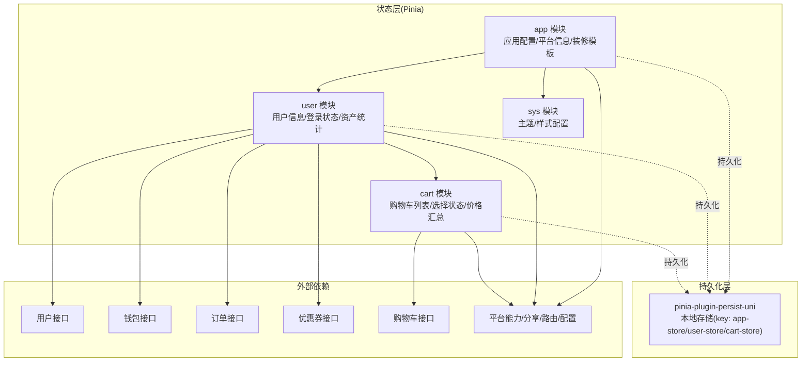
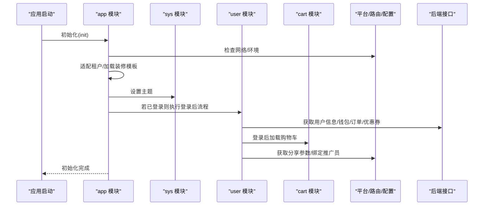
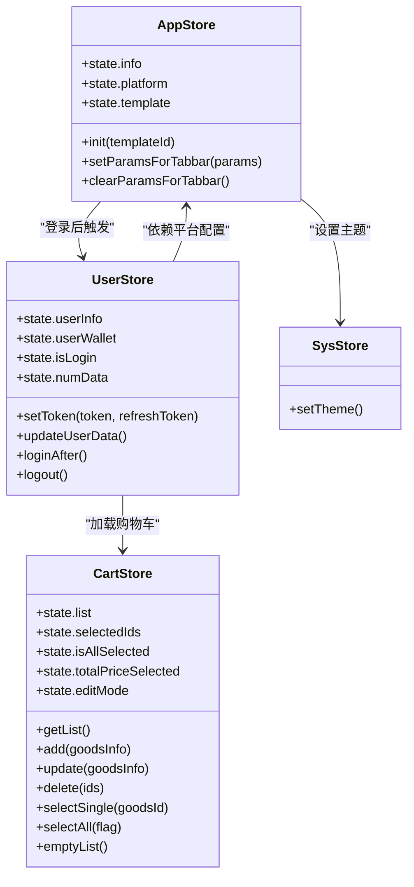
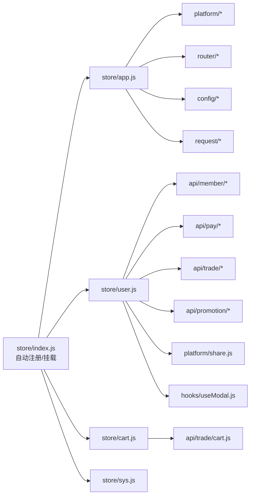

# 状态管理系统

<cite>
**本文引用的文件**
- [frontend/mall-uniapp/sheep/store/index.js](file://frontend/mall-uniapp/sheep/store/index.js)
- [frontend/mall-uniapp/sheep/store/app.js](file://frontend/mall-uniapp/sheep/store/app.js)
- [frontend/mall-uniapp/sheep/store/user.js](file://frontend/mall-uniapp/sheep/store/user.js)
- [frontend/mall-uniapp/sheep/store/cart.js](file://frontend/mall-uniapp/sheep/store/cart.js)
- [frontend/mall-uniapp/sheep/platform/share.js](file://frontend/mall-uniapp/sheep/platform/share.js)
- [frontend/mall-uniapp/sheep/api/member/user.js](file://frontend/mall-uniapp/sheep/api/member/user.js)
- [frontend/mall-uniapp/sheep/api/pay/wallet.js](file://frontend/mall-uniapp/sheep/api/pay/wallet.js)
- [frontend/mall-uniapp/sheep/api/trade/order.js](file://frontend/mall-uniapp/sheep/api/trade/order.js)
- [frontend/mall-uniapp/sheep/api/promotion/coupon.js](file://frontend/mall-uniapp/sheep/api/promotion/coupon.js)
- [frontend/mall-uniapp/sheep/api/trade/cart.js](file://frontend/mall-uniapp/sheep/api/trade/cart.js)
- [frontend/mall-uniapp/sheep/hooks/useModal.js](file://frontend/mall-uniapp/sheep/hooks/useModal.js)
- [frontend/mall-uniapp/sheep/platform/index.js](file://frontend/mall-uniapp/sheep/platform/index.js)
- [frontend/mall-uniapp/sheep/router/index.js](file://frontend/mall-uniapp/sheep/router/index.js)
- [frontend/mall-uniapp/sheep/config/index.js](file://frontend/mall-uniapp/sheep/config/index.js)
- [frontend/mall-uniapp/sheep/request/index.js](file://frontend/mall-uniapp/sheep/request/index.js)
- [frontend/mall-uniapp/sheep/store/sys.js](file://frontend/mall-uniapp/sheep/store/sys.js)
</cite>

## 目录
1. [简介](#简介)
2. [项目结构](#项目结构)
3. [核心组件](#核心组件)
4. [架构总览](#架构总览)
5. [详细组件分析](#详细组件分析)
6. [依赖关系分析](#依赖关系分析)
7. [性能考量](#性能考量)
8. [故障排查指南](#故障排查指南)
9. [结论](#结论)
10. [附录](#附录)

## 简介
本技术文档面向 AgenticCPS 商城前端（基于 UniApp + Pinia）的状态管理系统，系统性梳理了基于 Vuex/Pinia 的状态管理架构，涵盖 store 模块划分、状态树设计、模块间通信、应用状态管理、用户状态管理、购物车状态管理、状态持久化策略以及最佳实践与性能优化建议。读者无需深入代码即可理解整体设计思路与关键实现。

## 项目结构
本项目采用 Pinia 进行状态管理，store 目录位于前端工程中，通过自动注册机制集中管理各模块状态，并结合 pinia-plugin-persist-uni 实现持久化。核心文件包括：
- store 入口与自动注册：[frontend/mall-uniapp/sheep/store/index.js](file://frontend/mall-uniapp/sheep/store/index.js)
- 应用状态模块：[frontend/mall-uniapp/sheep/store/app.js](file://frontend/mall-uniapp/sheep/store/app.js)
- 用户状态模块：[frontend/mall-uniapp/sheep/store/user.js](file://frontend/mall-uniapp/sheep/store/user.js)
- 购物车状态模块：[frontend/mall-uniapp/sheep/store/cart.js](file://frontend/mall-uniapp/sheep/store/cart.js)
- 系统主题模块：[frontend/mall-uniapp/sheep/store/sys.js](file://frontend/mall-uniapp/sheep/store/sys.js)

图表来源
- [frontend/mall-uniapp/sheep/store/index.js:1-21](file://frontend/mall-uniapp/sheep/store/index.js#L1-L21)
- [frontend/mall-uniapp/sheep/store/app.js:11-133](file://frontend/mall-uniapp/sheep/store/app.js#L11-L133)
- [frontend/mall-uniapp/sheep/store/user.js:39-162](file://frontend/mall-uniapp/sheep/store/user.js#L39-L162)
- [frontend/mall-uniapp/sheep/store/cart.js:4-119](file://frontend/mall-uniapp/sheep/store/cart.js#L4-L119)

章节来源
- [frontend/mall-uniapp/sheep/store/index.js:1-21](file://frontend/mall-uniapp/sheep/store/index.js#L1-L21)
- [frontend/mall-uniapp/sheep/store/app.js:11-133](file://frontend/mall-uniapp/sheep/store/app.js#L11-L133)
- [frontend/mall-uniapp/sheep/store/user.js:39-162](file://frontend/mall-uniapp/sheep/store/user.js#L39-L162)
- [frontend/mall-uniapp/sheep/store/cart.js:4-119](file://frontend/mall-uniapp/sheep/store/cart.js#L4-L119)

## 核心组件
- store 入口与自动注册：通过 import.meta.glob 动态扫描并注册同级模块，统一挂载到应用实例，启用持久化插件。
- app 模块：负责应用基础信息、平台能力、装修模板、租户适配、主题初始化等全局配置。
- user 模块：维护用户登录状态、用户信息、钱包、订单与优惠券统计、登录后流程（拉取数据、加载购物车、分享参数、绑定推广员等）。
- cart 模块：维护购物车列表、选择状态、全选状态、选中项总价、编辑模式等，并提供增删改查与选择操作。
- sys 模块：负责主题与样式配置（如颜色、字体、布局等），与 app 模块协同完成界面风格初始化。

章节来源
- [frontend/mall-uniapp/sheep/store/index.js:1-21](file://frontend/mall-uniapp/sheep/store/index.js#L1-L21)
- [frontend/mall-uniapp/sheep/store/app.js:11-133](file://frontend/mall-uniapp/sheep/store/app.js#L11-L133)
- [frontend/mall-uniapp/sheep/store/user.js:39-162](file://frontend/mall-uniapp/sheep/store/user.js#L39-L162)
- [frontend/mall-uniapp/sheep/store/cart.js:4-119](file://frontend/mall-uniapp/sheep/store/cart.js#L4-L119)
- [frontend/mall-uniapp/sheep/store/sys.js](file://frontend/mall-uniapp/sheep/store/sys.js)

## 架构总览
Pinia 作为状态容器，模块之间通过 actions 调用 API 或相互协作，实现跨页面的数据共享与一致性。持久化通过插件按模块粒度开启，避免全量存储带来的性能与安全问题。

图表来源
- [frontend/mall-uniapp/sheep/store/app.js:52-116](file://frontend/mall-uniapp/sheep/store/app.js#L52-L116)
- [frontend/mall-uniapp/sheep/store/user.js:130-146](file://frontend/mall-uniapp/sheep/store/user.js#L130-L146)
- [frontend/mall-uniapp/sheep/store/cart.js:15-35](file://frontend/mall-uniapp/sheep/store/cart.js#L15-L35)

## 详细组件分析

### 应用状态管理（app）
职责与特性
- 应用信息与平台能力：名称、Logo、版本、版权、CDN、文件系统等。
- 平台能力：分享方式、转发信息、海报模板、复制链接地址、是否强制绑定手机号等。
- 装修模板：首页与个人中心模板数据，支持动态加载与主题配置。
- 租户适配：根据 H5 域名或小程序 appId 获取租户 ID，并在变更时清理用户 token。
- 主题初始化：调用 sys 模块设置主题。

关键交互
- 初始化流程包含网络检查、环境检查、租户适配、模板加载与主题设置。
- 登录后若用户已登录，触发 user 模块的登录后流程。

章节来源
- [frontend/mall-uniapp/sheep/store/app.js:11-133](file://frontend/mall-uniapp/sheep/store/app.js#L11-L133)
- [frontend/mall-uniapp/sheep/store/app.js:135-181](file://frontend/mall-uniapp/sheep/store/app.js#L135-L181)
- [frontend/mall-uniapp/sheep/store/app.js:183-212](file://frontend/mall-uniapp/sheep/store/app.js#L183-L212)

### 用户状态管理（user）
职责与特性
- 登录状态：基于本地 token 判断，支持设置/清除 token。
- 用户信息：头像、昵称、性别、手机号、积分等。
- 钱包信息：余额等。
- 资产统计：未使用优惠券数量、各类订单数量。
- 登录后流程：更新用户数据、加载购物车、设置分享参数、绑定推广员、必要时弹出绑定手机号提示。
- 数据更新防抖：限制更新频率，避免频繁请求。

模块间通信
- 依赖 app 模块提供的平台配置（如 bind_mobile）。
- 依赖 cart 模块进行购物车同步。
- 依赖 platform 分享能力与路由错误处理。

持久化策略
- 开启持久化，键名为 user-store。

章节来源
- [frontend/mall-uniapp/sheep/store/user.js:39-162](file://frontend/mall-uniapp/sheep/store/user.js#L39-L162)
- [frontend/mall-uniapp/sheep/platform/share.js](file://frontend/mall-uniapp/sheep/platform/share.js)
- [frontend/mall-uniapp/sheep/hooks/useModal.js](file://frontend/mall-uniapp/sheep/hooks/useModal.js)

### 购物车状态管理（cart）
职责与特性
- 购物车列表：有效与无效商品合并展示，同时维护有效列表。
- 选择状态：selectedIds、isAllSelected、选中项总价。
- 编辑模式：支持切换编辑模式并重新计算选择状态。
- 操作接口：添加、更新数量、删除、单选、全选、清空。
- 同步策略：每次操作后刷新列表并重新计算关联状态。

持久化策略
- 开启持久化，键名为 cart-store。

章节来源
- [frontend/mall-uniapp/sheep/store/cart.js:4-119](file://frontend/mall-uniapp/sheep/store/cart.js#L4-L119)

### 系统主题管理（sys）
职责与特性
- 主题与样式配置：颜色、字体、布局等。
- 与 app 模块协同：在 app 初始化时调用设置主题。

章节来源
- [frontend/mall-uniapp/sheep/store/app.js:103-105](file://frontend/mall-uniapp/sheep/store/app.js#L103-L105)
- [frontend/mall-uniapp/sheep/store/sys.js](file://frontend/mall-uniapp/sheep/store/sys.js)

### 模块间通信与依赖
- user 依赖 app 的平台配置（如 bind_mobile）与路由错误处理。
- user 依赖 cart 在登录后加载购物车。
- app 依赖 sys 设置主题，并在初始化完成后触发 user 的登录后流程。
- cart 与 user 通过 actions 调用后端接口，保持数据一致性。

图表来源
- [frontend/mall-uniapp/sheep/store/app.js:11-133](file://frontend/mall-uniapp/sheep/store/app.js#L11-L133)
- [frontend/mall-uniapp/sheep/store/user.js:39-162](file://frontend/mall-uniapp/sheep/store/user.js#L39-L162)
- [frontend/mall-uniapp/sheep/store/cart.js:4-119](file://frontend/mall-uniapp/sheep/store/cart.js#L4-L119)
- [frontend/mall-uniapp/sheep/store/sys.js](file://frontend/mall-uniapp/sheep/store/sys.js)

## 依赖关系分析
- store 入口通过 import.meta.glob 自动注册模块，减少手动导入成本。
- 模块间通过 actions 调用 API，避免直接耦合具体实现。
- 持久化按模块开启，键名明确，便于调试与迁移。
- 平台能力（分享、路由、配置）由独立模块提供，降低耦合度。

图表来源
- [frontend/mall-uniapp/sheep/store/index.js:1-21](file://frontend/mall-uniapp/sheep/store/index.js#L1-L21)
- [frontend/mall-uniapp/sheep/store/app.js:1-10](file://frontend/mall-uniapp/sheep/store/app.js#L1-L10)
- [frontend/mall-uniapp/sheep/store/user.js:1-11](file://frontend/mall-uniapp/sheep/store/user.js#L1-L11)
- [frontend/mall-uniapp/sheep/store/cart.js:1-2](file://frontend/mall-uniapp/sheep/store/cart.js#L1-L2)

章节来源
- [frontend/mall-uniapp/sheep/store/index.js:1-21](file://frontend/mall-uniapp/sheep/store/index.js#L1-L21)
- [frontend/mall-uniapp/sheep/store/app.js:1-10](file://frontend/mall-uniapp/sheep/store/app.js#L1-L10)
- [frontend/mall-uniapp/sheep/store/user.js:1-11](file://frontend/mall-uniapp/sheep/store/user.js#L1-L11)
- [frontend/mall-uniapp/sheep/store/cart.js:1-2](file://frontend/mall-uniapp/sheep/store/cart.js#L1-L2)

## 性能考量
- 防抖与节流：用户数据更新采用时间戳防抖，避免频繁请求。
- 懒加载与按需：store 模块按需注册，减少初始加载压力。
- 局部持久化：仅对关键模块开启持久化，降低存储开销与安全风险。
- 列表计算：购物车选择状态与总价在获取列表后一次性计算，避免重复计算。
- 网络与环境检查：应用初始化阶段进行网络与环境检查，提前失败以减少无效请求。

章节来源
- [frontend/mall-uniapp/sheep/store/user.js:98-116](file://frontend/mall-uniapp/sheep/store/user.js#L98-L116)
- [frontend/mall-uniapp/sheep/store/cart.js:22-34](file://frontend/mall-uniapp/sheep/store/cart.js#L22-L34)
- [frontend/mall-uniapp/sheep/store/app.js:52-64](file://frontend/mall-uniapp/sheep/store/app.js#L52-L64)

## 故障排查指南
常见问题与定位
- 登录后数据未刷新：检查 user.updateUserData 的防抖逻辑与接口返回码。
- 购物车数量不同步：确认 cart.getList 是否在 add/update/delete 后被调用。
- 主题未生效：确认 app.init 中是否调用 sys.setTheme。
- 租户切换异常：检查 adaptTenant 的租户 ID 切换逻辑与 token 清理。
- 分享参数缺失：确认 user.loginAfter 中是否调用 $share.getShareInfo。

章节来源
- [frontend/mall-uniapp/sheep/store/user.js:98-116](file://frontend/mall-uniapp/sheep/store/user.js#L98-L116)
- [frontend/mall-uniapp/sheep/store/cart.js:15-35](file://frontend/mall-uniapp/sheep/store/cart.js#L15-L35)
- [frontend/mall-uniapp/sheep/store/app.js:103-105](file://frontend/mall-uniapp/sheep/store/app.js#L103-L105)
- [frontend/mall-uniapp/sheep/store/app.js:167-177](file://frontend/mall-uniapp/sheep/store/app.js#L167-L177)
- [frontend/mall-uniapp/sheep/platform/share.js](file://frontend/mall-uniapp/sheep/platform/share.js)

## 结论
该状态管理系统以 Pinia 为核心，通过模块化设计实现了应用配置、用户状态与购物车状态的清晰分离；借助持久化插件与合理的初始化流程，兼顾了用户体验与开发效率。建议在后续迭代中进一步完善错误上报、埋点统计与模块间通信契约，持续提升系统的稳定性与可观测性。

## 附录

### 状态树与模块映射
- app：应用信息、平台能力、装修模板、租户适配、主题初始化
- user：登录状态、用户信息、钱包、资产统计、登录后流程
- cart：购物车列表、选择状态、编辑模式、总价计算
- sys：主题与样式配置

章节来源
- [frontend/mall-uniapp/sheep/store/app.js:11-51](file://frontend/mall-uniapp/sheep/store/app.js#L11-L51)
- [frontend/mall-uniapp/sheep/store/user.js:39-47](file://frontend/mall-uniapp/sheep/store/user.js#L39-L47)
- [frontend/mall-uniapp/sheep/store/cart.js:4-13](file://frontend/mall-uniapp/sheep/store/cart.js#L4-L13)
- [frontend/mall-uniapp/sheep/store/sys.js](file://frontend/mall-uniapp/sheep/store/sys.js)

### 接口与模块交互概览
- 用户：用户信息、钱包、订单数量、优惠券数量
- 购物车：列表、增删改查、选择状态
- 平台：分享、路由、配置、租户

章节来源
- [frontend/mall-uniapp/sheep/api/member/user.js](file://frontend/mall-uniapp/sheep/api/member/user.js)
- [frontend/mall-uniapp/sheep/api/pay/wallet.js](file://frontend/mall-uniapp/sheep/api/pay/wallet.js)
- [frontend/mall-uniapp/sheep/api/trade/order.js](file://frontend/mall-uniapp/sheep/api/trade/order.js)
- [frontend/mall-uniapp/sheep/api/promotion/coupon.js](file://frontend/mall-uniapp/sheep/api/promotion/coupon.js)
- [frontend/mall-uniapp/sheep/api/trade/cart.js](file://frontend/mall-uniapp/sheep/api/trade/cart.js)
- [frontend/mall-uniapp/sheep/platform/share.js](file://frontend/mall-uniapp/sheep/platform/share.js)
- [frontend/mall-uniapp/sheep/router/index.js](file://frontend/mall-uniapp/sheep/router/index.js)
- [frontend/mall-uniapp/sheep/config/index.js](file://frontend/mall-uniapp/sheep/config/index.js)
- [frontend/mall-uniapp/sheep/request/index.js](file://frontend/mall-uniapp/sheep/request/index.js)